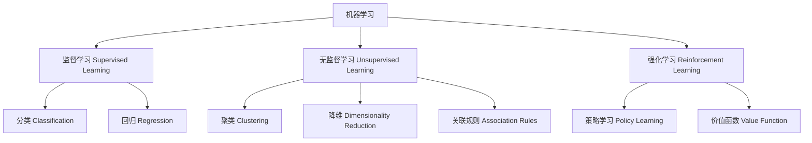
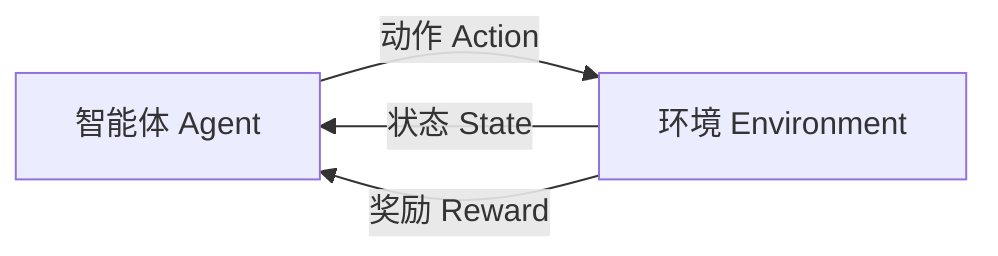
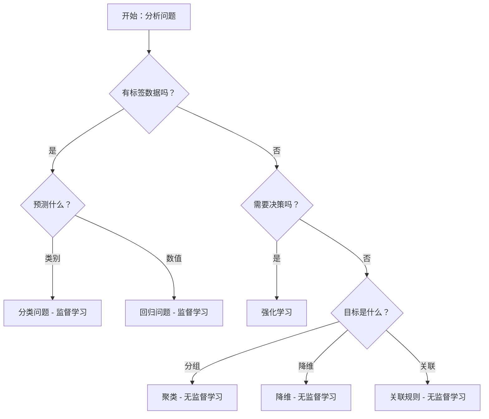

# 1.1.2 学习类型分类

## 学习目标
理解监督学习、无监督学习和强化学习的区别，能够根据问题特点选择合适的学习类型。

## 机器学习的三大类型

机器学习根据训练数据的特点和学习目标，主要分为三种类型：



## 1. 监督学习 (Supervised Learning)

### 定义
**监督学习**使用带有标签的训练数据来学习输入和输出之间的映射关系。

### 核心特点
- **有标签数据**：每个训练样本都有对应的正确答案
- **学习目标**：学会从输入预测输出
- **评估方式**：通过预测准确率来评估模型性能

### 数据结构
```python
# 监督学习的数据结构示例
training_data = [
    # (输入特征, 标签)
    ([身高, 体重, 年龄], "男性"),
    ([身高, 体重, 年龄], "女性"),
    ([房屋面积, 地段, 楼层], 房价),
    # ...
]
```

### 1.1 分类任务 (Classification)

**目标**：预测离散的类别标签

**生活实例**：
- **垃圾邮件识别**
  - 输入：邮件内容、发件人、主题等
  - 输出：垃圾邮件 / 正常邮件
  
- **疾病诊断**
  - 输入：症状、检查结果、病史等
  - 输出：疾病类型（感冒/肺炎/健康）
  
- **图像识别**
  - 输入：图像像素值
  - 输出：图像类别（猫/狗/鸟）

**Trae实践示例**：
```python
from sklearn.datasets import load_iris
from sklearn.model_selection import train_test_split
from sklearn.tree import DecisionTreeClassifier
from sklearn.metrics import accuracy_score

# 加载鸢尾花数据集（经典分类问题）
iris = load_iris()
X, y = iris.data, iris.target

# 数据划分
X_train, X_test, y_train, y_test = train_test_split(
    X, y, test_size=0.3, random_state=42
)

# 训练分类模型
clf = DecisionTreeClassifier(random_state=42)
clf.fit(X_train, y_train)

# 预测和评估
y_pred = clf.predict(X_test)
accuracy = accuracy_score(y_test, y_pred)
print(f"分类准确率: {accuracy:.2f}")

# 预测新样本
new_flower = [[5.1, 3.5, 1.4, 0.2]]  # 新的花朵特征
predicted_class = clf.predict(new_flower)
print(f"预测类别: {iris.target_names[predicted_class[0]]}")
```

### 1.2 回归任务 (Regression)

**目标**：预测连续的数值

**生活实例**：
- **房价预测**
  - 输入：面积、地段、楼层、装修等
  - 输出：房价（连续数值）
  
- **股票价格预测**
  - 输入：历史价格、交易量、市场指标等
  - 输出：未来价格
  
- **销量预测**
  - 输入：广告投入、季节、促销活动等
  - 输出：预期销量

**Trae实践示例**：
```python
from sklearn.datasets import load_boston
from sklearn.linear_model import LinearRegression
from sklearn.metrics import mean_squared_error, r2_score
import numpy as np

# 生成房价数据（模拟波士顿房价数据集）
np.random.seed(42)
n_samples = 500

# 特征：房间数、犯罪率、距离市中心距离等
rooms = np.random.normal(6, 1, n_samples)
crime_rate = np.random.exponential(3, n_samples)
distance = np.random.normal(5, 2, n_samples)

# 房价计算（简化模型）
price = (rooms * 5 - crime_rate * 2 - distance * 0.5 + 
         np.random.normal(0, 2, n_samples))

X = np.column_stack([rooms, crime_rate, distance])
y = price

# 数据划分
X_train, X_test, y_train, y_test = train_test_split(
    X, y, test_size=0.3, random_state=42
)

# 训练回归模型
reg = LinearRegression()
reg.fit(X_train, y_train)

# 预测和评估
y_pred = reg.predict(X_test)
mse = mean_squared_error(y_test, y_pred)
r2 = r2_score(y_test, y_pred)

print(f"均方误差 (MSE): {mse:.2f}")
print(f"决定系数 (R²): {r2:.2f}")

# 预测新房子的价格
new_house = [[7, 2, 3]]  # 7个房间，犯罪率2，距离市中心3
predicted_price = reg.predict(new_house)
print(f"预测房价: ${predicted_price[0]:.2f}万")
```

## 2. 无监督学习 (Unsupervised Learning)

### 定义
**无监督学习**从没有标签的数据中发现隐藏的模式和结构。

### 核心特点
- **无标签数据**：只有输入特征，没有正确答案
- **学习目标**：发现数据中的隐藏规律
- **评估方式**：通过数据内在结构来评估

### 数据结构
```python
# 无监督学习的数据结构示例
training_data = [
    # 只有输入特征，没有标签
    [用户年龄, 收入, 消费习惯],
    [用户年龄, 收入, 消费习惯],
    [商品特征1, 商品特征2, 商品特征3],
    # ...
]
```

### 2.1 聚类 (Clustering)

**目标**：将相似的数据点分组

**生活实例**：
- **用户分群**
  - 根据购买行为将用户分为不同群体
  - 为不同群体制定个性化营销策略
  
- **基因分析**
  - 根据基因特征对物种进行分类
  - 发现新的物种关系
  
- **市场细分**
  - 根据消费者特征划分市场
  - 制定差异化产品策略

**Trae实践示例**：
```python
from sklearn.cluster import KMeans
from sklearn.datasets import make_blobs
import matplotlib.pyplot as plt

# 生成模拟客户数据
np.random.seed(42)
n_customers = 300

# 客户特征：年收入、年消费
X, _ = make_blobs(n_samples=n_customers, centers=4, 
                  cluster_std=1.5, random_state=42)

# 应用K-means聚类
kmeans = KMeans(n_clusters=4, random_state=42)
clusters = kmeans.fit_predict(X)

# 可视化聚类结果
plt.figure(figsize=(10, 8))
colors = ['red', 'blue', 'green', 'purple']
for i in range(4):
    cluster_points = X[clusters == i]
    plt.scatter(cluster_points[:, 0], cluster_points[:, 1], 
                c=colors[i], label=f'客户群体 {i+1}', alpha=0.6)

# 标记聚类中心
centers = kmeans.cluster_centers_
plt.scatter(centers[:, 0], centers[:, 1], 
            c='black', marker='x', s=200, linewidths=3, label='聚类中心')

plt.xlabel('年收入 (万元)')
plt.ylabel('年消费 (万元)')
plt.title('客户聚类分析')
plt.legend()
plt.grid(True, alpha=0.3)
plt.show()

print("客户群体特征分析：")
for i in range(4):
    cluster_data = X[clusters == i]
    print(f"群体 {i+1}: 平均收入 {cluster_data[:, 0].mean():.1f}万, "
          f"平均消费 {cluster_data[:, 1].mean():.1f}万")
```

### 2.2 降维 (Dimensionality Reduction)

**目标**：减少数据的维度，保留主要信息

**生活实例**：
- **数据可视化**：将高维数据投影到2D/3D空间进行可视化
- **特征选择**：从众多特征中选择最重要的几个
- **数据压缩**：减少存储空间和计算时间

### 2.3 关联规则 (Association Rules)

**目标**：发现数据项之间的关联关系

**生活实例**：
- **购物篮分析**："买啤酒的人通常也买尿布"
- **网站推荐**："浏览A页面的用户通常也会浏览B页面"
- **基因关联**："某些基因变异通常同时出现"

**Trae实践示例**：
```python
# 模拟购物篮数据
transactions = [
    ['牛奶', '面包', '鸡蛋'],
    ['牛奶', '面包'],
    ['啤酒', '尿布', '薯片'],
    ['牛奶', '鸡蛋', '黄油'],
    ['啤酒', '尿布'],
    ['面包', '黄油'],
    ['牛奶', '面包', '黄油', '鸡蛋'],
    ['啤酒', '薯片'],
]

# 简单的关联规则发现
from collections import defaultdict

# 计算商品出现频率
item_counts = defaultdict(int)
for transaction in transactions:
    for item in transaction:
        item_counts[item] += 1

# 计算商品对的共现频率
pair_counts = defaultdict(int)
for transaction in transactions:
    for i, item1 in enumerate(transaction):
        for item2 in transaction[i+1:]:
            pair = tuple(sorted([item1, item2]))
            pair_counts[pair] += 1

# 计算置信度
print("发现的关联规则：")
for (item1, item2), count in pair_counts.items():
    confidence1 = count / item_counts[item1]
    confidence2 = count / item_counts[item2]
    
    if confidence1 > 0.5:
        print(f"{item1} → {item2}: 置信度 {confidence1:.2f}")
    if confidence2 > 0.5:
        print(f"{item2} → {item1}: 置信度 {confidence2:.2f}")
```

## 3. 强化学习 (Reinforcement Learning)

### 定义
**强化学习**通过与环境交互，在试错过程中学习最优的行为策略。

### 核心特点
- **交互学习**：智能体与环境持续交互
- **奖励机制**：通过奖励信号指导学习
- **延迟反馈**：行为的好坏可能需要时间才能体现
- **探索与利用**：在尝试新策略和使用已知好策略之间平衡

### 基本框架


### 生活实例

#### 3.1 游戏AI
- **AlphaGo**：学会下围棋，击败世界冠军
- **游戏角色**：学会在游戏中做出最优决策
- **扑克AI**：学会在不完全信息下做决策

#### 3.2 自动驾驶
- **路径规划**：学会选择最优行驶路线
- **避障决策**：学会在复杂环境中安全驾驶
- **交通信号**：学会遵守交通规则

#### 3.3 推荐系统
- **个性化推荐**：根据用户反馈调整推荐策略
- **广告投放**：学会在合适时机投放合适广告
- **内容优化**：根据用户互动优化内容展示

### Trae实践示例：简单的多臂老虎机
```python
import numpy as np
import matplotlib.pyplot as plt

class MultiArmedBandit:
    """多臂老虎机环境"""
    def __init__(self, n_arms=4):
        self.n_arms = n_arms
        # 每个臂的真实奖励概率（未知）
        self.true_rewards = np.random.uniform(0, 1, n_arms)
        
    def pull_arm(self, arm):
        """拉动某个臂，返回奖励"""
        return np.random.binomial(1, self.true_rewards[arm])

class EpsilonGreedyAgent:
    """ε-贪婪策略智能体"""
    def __init__(self, n_arms, epsilon=0.1):
        self.n_arms = n_arms
        self.epsilon = epsilon
        self.arm_counts = np.zeros(n_arms)  # 每个臂被选择的次数
        self.arm_rewards = np.zeros(n_arms)  # 每个臂的累计奖励
        
    def select_arm(self):
        """选择要拉动的臂"""
        if np.random.random() < self.epsilon:
            # 探索：随机选择
            return np.random.randint(self.n_arms)
        else:
            # 利用：选择当前最优的臂
            avg_rewards = self.arm_rewards / (self.arm_counts + 1e-8)
            return np.argmax(avg_rewards)
    
    def update(self, arm, reward):
        """更新智能体的知识"""
        self.arm_counts[arm] += 1
        self.arm_rewards[arm] += reward

# 运行强化学习实验
bandit = MultiArmedBandit(n_arms=4)
agent = EpsilonGreedyAgent(n_arms=4, epsilon=0.1)

n_rounds = 1000
rewards_history = []
cumulative_reward = 0

for round_num in range(n_rounds):
    # 智能体选择动作
    chosen_arm = agent.select_arm()
    
    # 环境给出奖励
    reward = bandit.pull_arm(chosen_arm)
    
    # 智能体学习
    agent.update(chosen_arm, reward)
    
    # 记录结果
    cumulative_reward += reward
    rewards_history.append(cumulative_reward)

# 可视化学习过程
plt.figure(figsize=(12, 5))

# 累计奖励曲线
plt.subplot(1, 2, 1)
plt.plot(rewards_history)
plt.xlabel('回合数')
plt.ylabel('累计奖励')
plt.title('强化学习过程：累计奖励')
plt.grid(True, alpha=0.3)

# 最终学到的策略 vs 真实最优策略
plt.subplot(1, 2, 2)
learned_values = agent.arm_rewards / (agent.arm_counts + 1e-8)
true_values = bandit.true_rewards

x = range(len(true_values))
plt.bar([i-0.2 for i in x], true_values, width=0.4, 
        label='真实奖励概率', alpha=0.7)
plt.bar([i+0.2 for i in x], learned_values, width=0.4, 
        label='学到的奖励估计', alpha=0.7)
plt.xlabel('臂编号')
plt.ylabel('奖励概率')
plt.title('学习结果对比')
plt.legend()
plt.grid(True, alpha=0.3)

plt.tight_layout()
plt.show()

print("实验结果：")
print(f"真实最优臂: {np.argmax(bandit.true_rewards)} (奖励概率: {max(bandit.true_rewards):.3f})")
print(f"智能体选择: {np.argmax(learned_values)} (估计奖励: {max(learned_values):.3f})")
print(f"总奖励: {cumulative_reward}/{n_rounds} = {cumulative_reward/n_rounds:.3f}")
```

## 三种学习类型的对比

| 特征 | 监督学习 | 无监督学习 | 强化学习 |
|------|----------|------------|----------|
| **数据类型** | 有标签数据 | 无标签数据 | 交互数据 |
| **学习目标** | 预测准确性 | 发现模式 | 最大化奖励 |
| **反馈方式** | 即时准确反馈 | 无直接反馈 | 延迟奖励反馈 |
| **应用场景** | 分类、回归 | 聚类、降维 | 决策、控制 |
| **评估方式** | 预测准确率 | 内在质量指标 | 累计奖励 |
| **典型算法** | 决策树、SVM | K-means、PCA | Q-learning、策略梯度 |

## 如何选择学习类型

### 决策流程图


### 实际选择指南

1. **有明确的输入-输出对应关系** → 监督学习
   - 垃圾邮件检测、房价预测、图像识别

2. **需要发现数据中的隐藏模式** → 无监督学习
   - 客户分群、市场细分、异常检测

3. **需要在动态环境中做决策** → 强化学习
   - 游戏AI、自动驾驶、推荐系统优化

## 小结

机器学习的三种主要类型各有特点和适用场景：

- **监督学习**：适合有明确目标的预测问题
- **无监督学习**：适合探索性数据分析和模式发现
- **强化学习**：适合需要在环境中学习最优策略的问题

在实际应用中，这三种方法经常结合使用，形成更强大的AI系统。

## 思考题

1. 以下问题分别属于哪种学习类型？
   - 根据用户历史行为预测是否会购买某商品
   - 将新闻文章自动分类到不同主题
   - 发现基因序列中的相似模式
   - 训练机器人学会走路

2. 如果你要开发一个智能客服系统，你会用到哪些类型的机器学习？

3. 为什么强化学习比监督学习更难？

---

**下一节预告**：我们将学习如何正确划分数据集，这是所有机器学习项目的基础。