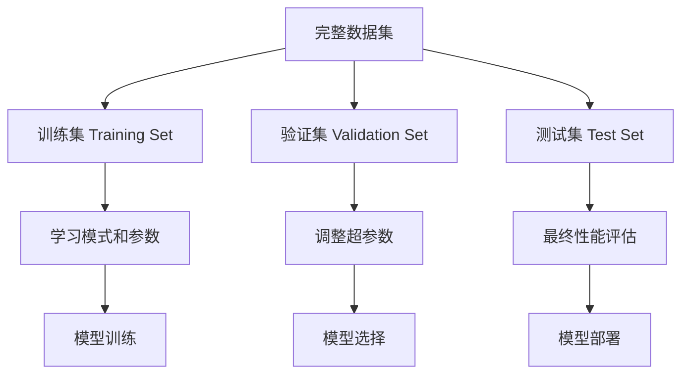
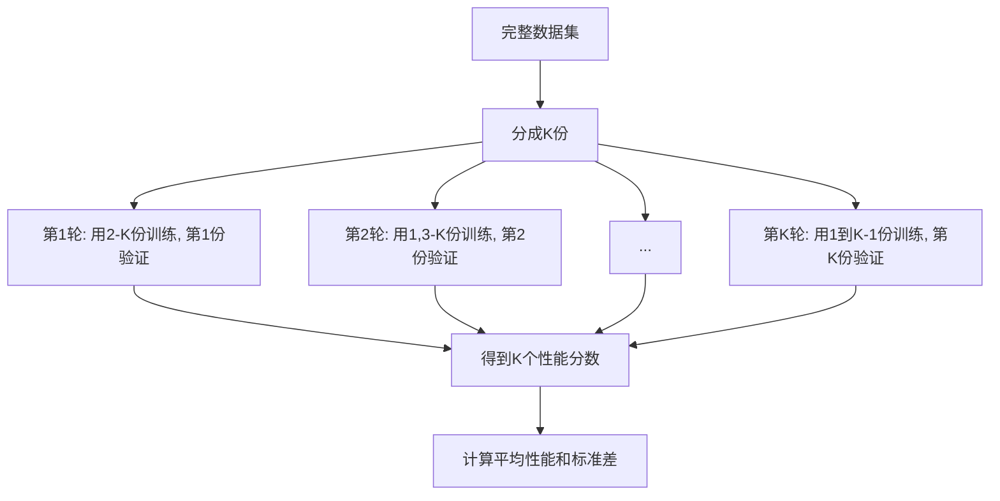

# 1.1.3 数据集划分

## 学习目标
理解训练集、验证集、测试集的作用和划分原则，掌握交叉验证等高级数据划分技术。

## 为什么要划分数据集？

想象一下，如果你要参加数学考试：

- **练习题**：平时做的题目，用来学习知识点
- **模拟考试**：考前做的测试，用来检验学习效果和调整复习策略
- **正式考试**：最终的评估，检验真实水平

机器学习中的数据集划分遵循同样的逻辑：



### 不划分数据集的问题

```python
# 错误示例：用同一份数据训练和测试
from sklearn.tree import DecisionTreeClassifier
from sklearn.datasets import load_iris
from sklearn.metrics import accuracy_score

# 加载数据
iris = load_iris()
X, y = iris.data, iris.target

# 错误做法：用全部数据训练
model = DecisionTreeClassifier()
model.fit(X, y)  # 用全部数据训练

# 用同样的数据测试
accuracy = accuracy_score(y, model.predict(X))
print(f"准确率: {accuracy:.2f}")  # 通常会得到100%的准确率！
```

**问题**：
- 模型可能只是"记住"了训练数据，而不是学会了泛化规律
- 无法评估模型在新数据上的真实性能
- 容易产生过度乐观的评估结果

## 三种数据集的详细说明

### 1. 训练集 (Training Set)

**作用**：用于训练模型，让模型学习数据中的规律

**比例**：通常占总数据的60%-80%

**特点**：
- 模型可以"看到"这些数据的输入和输出
- 模型通过这些数据调整内部参数
- 数据量越大，模型学到的规律越可靠

**类比**：学生的课本和练习题

### 2. 验证集 (Validation Set)

**作用**：用于模型选择和超参数调优

**比例**：通常占总数据的10%-20%

**特点**：
- 模型训练时不能"看到"这些数据
- 用于比较不同模型或参数设置的性能
- 帮助避免过拟合

**类比**：学生的模拟考试

**使用场景**：
```python
# 使用验证集选择最佳参数
from sklearn.model_selection import train_test_split
from sklearn.ensemble import RandomForestClassifier

# 数据划分
X_temp, X_test, y_temp, y_test = train_test_split(
    X, y, test_size=0.2, random_state=42
)
X_train, X_val, y_train, y_val = train_test_split(
    X_temp, y_temp, test_size=0.25, random_state=42  # 0.25 * 0.8 = 0.2
)

# 尝试不同的参数
parameters = [10, 50, 100, 200]
best_score = 0
best_params = None

for n_trees in parameters:
    model = RandomForestClassifier(n_estimators=n_trees, random_state=42)
    model.fit(X_train, y_train)
    
    val_score = model.score(X_val, y_val)
    print(f"树的数量: {n_trees}, 验证集准确率: {val_score:.3f}")
    
    if val_score > best_score:
        best_score = val_score
        best_params = n_trees

print(f"最佳参数: {best_params}, 最佳验证分数: {best_score:.3f}")
```

### 3. 测试集 (Test Set)

**作用**：最终评估模型的泛化性能

**比例**：通常占总数据的10%-20%

**特点**：
- 在整个模型开发过程中都不能使用
- 只在最后阶段用于评估最终模型
- 提供对模型真实性能的无偏估计

**类比**：学生的正式考试

**重要原则**：
- 测试集只能用一次！
- 不能根据测试集结果调整模型
- 测试集结果就是模型的最终成绩

## 常见的数据划分策略

### 1. 简单随机划分

**适用场景**：数据量充足，各类别分布均匀

```python
from sklearn.model_selection import train_test_split
import numpy as np

# 生成示例数据
np.random.seed(42)
X = np.random.randn(1000, 4)  # 1000个样本，4个特征
y = np.random.randint(0, 3, 1000)  # 3个类别

# 方法1：两步划分
X_temp, X_test, y_temp, y_test = train_test_split(
    X, y, test_size=0.2, random_state=42, stratify=y
)
X_train, X_val, y_train, y_val = train_test_split(
    X_temp, y_temp, test_size=0.25, random_state=42, stratify=y_temp
)

print(f"训练集大小: {len(X_train)} ({len(X_train)/len(X)*100:.1f}%)")
print(f"验证集大小: {len(X_val)} ({len(X_val)/len(X)*100:.1f}%)")
print(f"测试集大小: {len(X_test)} ({len(X_test)/len(X)*100:.1f}%)")

# 检查类别分布
print("\n各集合中的类别分布:")
print(f"训练集: {np.bincount(y_train)}")
print(f"验证集: {np.bincount(y_val)}")
print(f"测试集: {np.bincount(y_test)}")
```

### 2. 分层抽样 (Stratified Sampling)

**适用场景**：类别不平衡的数据

**目标**：确保各个子集中的类别分布与原始数据一致

```python
# 创建不平衡数据集
np.random.seed(42)
X_imbalanced = np.random.randn(1000, 4)
# 类别0: 70%, 类别1: 20%, 类别2: 10%
y_imbalanced = np.concatenate([
    np.zeros(700),
    np.ones(200),
    np.full(100, 2)
]).astype(int)

# 打乱数据
indices = np.random.permutation(len(X_imbalanced))
X_imbalanced = X_imbalanced[indices]
y_imbalanced = y_imbalanced[indices]

print("原始数据类别分布:")
print(f"类别分布: {np.bincount(y_imbalanced)}")
print(f"类别比例: {np.bincount(y_imbalanced) / len(y_imbalanced)}")

# 分层抽样
X_train, X_test, y_train, y_test = train_test_split(
    X_imbalanced, y_imbalanced, 
    test_size=0.2, 
    random_state=42, 
    stratify=y_imbalanced  # 关键参数
)

print("\n分层抽样后:")
print(f"训练集类别比例: {np.bincount(y_train) / len(y_train)}")
print(f"测试集类别比例: {np.bincount(y_test) / len(y_test)}")

# 对比：不使用分层抽样
X_train_random, X_test_random, y_train_random, y_test_random = train_test_split(
    X_imbalanced, y_imbalanced, 
    test_size=0.2, 
    random_state=42
    # 不使用stratify参数
)

print("\n随机抽样后:")
print(f"训练集类别比例: {np.bincount(y_train_random) / len(y_train_random)}")
print(f"测试集类别比例: {np.bincount(y_test_random) / len(y_test_random)}")
```

### 3. 时间序列划分

**适用场景**：时间序列数据，如股价、销量等

**原则**：用过去的数据预测未来，不能用未来的数据训练模型

```python
import pandas as pd
import matplotlib.pyplot as plt

# 生成时间序列数据
dates = pd.date_range('2020-01-01', '2023-12-31', freq='D')
np.random.seed(42)
# 模拟股价数据：有趋势 + 随机波动
trend = np.linspace(100, 200, len(dates))
noise = np.random.normal(0, 10, len(dates))
prices = trend + noise + 10 * np.sin(np.arange(len(dates)) * 2 * np.pi / 365)

# 创建DataFrame
df = pd.DataFrame({
    'date': dates,
    'price': prices
})

# 时间序列划分
train_size = int(len(df) * 0.7)
val_size = int(len(df) * 0.15)

train_data = df[:train_size]
val_data = df[train_size:train_size + val_size]
test_data = df[train_size + val_size:]

print(f"训练集: {train_data['date'].min()} 到 {train_data['date'].max()}")
print(f"验证集: {val_data['date'].min()} 到 {val_data['date'].max()}")
print(f"测试集: {test_data['date'].min()} 到 {test_data['date'].max()}")

# 可视化划分结果
plt.figure(figsize=(12, 6))
plt.plot(train_data['date'], train_data['price'], label='训练集', alpha=0.8)
plt.plot(val_data['date'], val_data['price'], label='验证集', alpha=0.8)
plt.plot(test_data['date'], test_data['price'], label='测试集', alpha=0.8)
plt.xlabel('日期')
plt.ylabel('价格')
plt.title('时间序列数据划分')
plt.legend()
plt.xticks(rotation=45)
plt.tight_layout()
plt.show()
```

## 交叉验证 (Cross-Validation)

### 什么是交叉验证？

当数据量较小时，简单的数据划分可能导致评估结果不稳定。交叉验证通过多次划分和评估来获得更可靠的性能估计。

### K折交叉验证 (K-Fold Cross-Validation)

**原理**：将数据分成K份，轮流用其中K-1份训练，1份验证



**Trae实践示例**：
```python
from sklearn.model_selection import cross_val_score, KFold
from sklearn.ensemble import RandomForestClassifier
from sklearn.datasets import load_wine
import numpy as np

# 加载葡萄酒数据集
wine = load_wine()
X, y = wine.data, wine.target

# 创建模型
model = RandomForestClassifier(n_estimators=100, random_state=42)

# 5折交叉验证
kfold = KFold(n_splits=5, shuffle=True, random_state=42)
scores = cross_val_score(model, X, y, cv=kfold, scoring='accuracy')

print("5折交叉验证结果:")
for i, score in enumerate(scores, 1):
    print(f"第{i}折: {score:.3f}")

print(f"\n平均准确率: {scores.mean():.3f} ± {scores.std():.3f}")

# 对比：简单划分的结果
from sklearn.model_selection import train_test_split
X_train, X_test, y_train, y_test = train_test_split(
    X, y, test_size=0.2, random_state=42
)
model.fit(X_train, y_train)
simple_score = model.score(X_test, y_test)

print(f"简单划分结果: {simple_score:.3f}")
print(f"\n交叉验证提供了更可靠的性能估计！")
```

### 分层K折交叉验证

**适用场景**：类别不平衡的数据

```python
from sklearn.model_selection import StratifiedKFold

# 创建不平衡数据
np.random.seed(42)
X_imb = np.random.randn(300, 4)
y_imb = np.concatenate([np.zeros(200), np.ones(50), np.full(50, 2)])

print("数据类别分布:", np.bincount(y_imb))

# 普通K折交叉验证
kfold = KFold(n_splits=5, shuffle=True, random_state=42)
scores_kfold = cross_val_score(model, X_imb, y_imb, cv=kfold)

# 分层K折交叉验证
skfold = StratifiedKFold(n_splits=5, shuffle=True, random_state=42)
scores_skfold = cross_val_score(model, X_imb, y_imb, cv=skfold)

print(f"\n普通K折: {scores_kfold.mean():.3f} ± {scores_kfold.std():.3f}")
print(f"分层K折: {scores_skfold.mean():.3f} ± {scores_skfold.std():.3f}")

# 检查每折的类别分布
print("\n分层K折中每折的类别分布:")
for i, (train_idx, val_idx) in enumerate(skfold.split(X_imb, y_imb), 1):
    val_labels = y_imb[val_idx]
    print(f"第{i}折验证集: {np.bincount(val_labels)}")
```

### 留一交叉验证 (Leave-One-Out Cross-Validation)

**适用场景**：数据量很小的情况

**原理**：每次只用一个样本作为验证集，其余作为训练集

```python
from sklearn.model_selection import LeaveOneOut

# 小数据集示例
X_small = X[:50]  # 只用50个样本
y_small = y[:50]

# 留一交叉验证
loo = LeaveOneOut()
scores_loo = cross_val_score(model, X_small, y_small, cv=loo)

print(f"留一交叉验证结果:")
print(f"准确率: {scores_loo.mean():.3f} ± {scores_loo.std():.3f}")
print(f"总共进行了 {len(scores_loo)} 次验证")
```

## 数据划分的最佳实践

### 1. 划分比例选择指南

| 数据量 | 训练集 | 验证集 | 测试集 | 建议 |
|--------|--------|--------|--------|---------|
| < 1000 | 60% | 20% | 20% | 使用交叉验证 |
| 1000-10000 | 70% | 15% | 15% | 标准划分 |
| 10000-100000 | 80% | 10% | 10% | 可适当增加训练集 |
| > 100000 | 85% | 7.5% | 7.5% | 大数据集策略 |

### 2. 数据划分检查清单

```python
def check_data_split(X_train, X_val, X_test, y_train, y_val, y_test):
    """检查数据划分是否合理"""
    
    print("=== 数据划分检查报告 ===")
    
    # 1. 检查数据量分布
    total = len(X_train) + len(X_val) + len(X_test)
    print(f"\n1. 数据量分布:")
    print(f"   训练集: {len(X_train)} ({len(X_train)/total*100:.1f}%)")
    print(f"   验证集: {len(X_val)} ({len(X_val)/total*100:.1f}%)")
    print(f"   测试集: {len(X_test)} ({len(X_test)/total*100:.1f}%)")
    
    # 2. 检查类别分布
    print(f"\n2. 类别分布:")
    train_dist = np.bincount(y_train) / len(y_train)
    val_dist = np.bincount(y_val) / len(y_val)
    test_dist = np.bincount(y_test) / len(y_test)
    
    for i in range(len(train_dist)):
        print(f"   类别{i}: 训练{train_dist[i]:.3f}, 验证{val_dist[i]:.3f}, 测试{test_dist[i]:.3f}")
    
    # 3. 检查特征分布
    print(f"\n3. 特征统计:")
    print(f"   训练集特征均值: {X_train.mean(axis=0)[:3]}...")
    print(f"   验证集特征均值: {X_val.mean(axis=0)[:3]}...")
    print(f"   测试集特征均值: {X_test.mean(axis=0)[:3]}...")
    
    # 4. 数据泄露检查
    train_set = set(map(tuple, X_train))
    val_set = set(map(tuple, X_val))
    test_set = set(map(tuple, X_test))
    
    overlap_train_val = len(train_set & val_set)
    overlap_train_test = len(train_set & test_set)
    overlap_val_test = len(val_set & test_set)
    
    print(f"\n4. 数据泄露检查:")
    print(f"   训练-验证重叠: {overlap_train_val} 个样本")
    print(f"   训练-测试重叠: {overlap_train_test} 个样本")
    print(f"   验证-测试重叠: {overlap_val_test} 个样本")
    
    if overlap_train_val + overlap_train_test + overlap_val_test == 0:
        print("   ✓ 无数据泄露")
    else:
        print("   ✗ 存在数据泄露！")

# 使用示例
check_data_split(X_train, X_val, X_test, y_train, y_val, y_test)
```

### 3. 常见错误和避免方法

#### 错误1：数据泄露
```python
# 错误做法：在划分前进行特征缩放
from sklearn.preprocessing import StandardScaler

# ❌ 错误：用全部数据计算缩放参数
scaler = StandardScaler()
X_scaled = scaler.fit_transform(X)  # 用了测试集信息！
X_train, X_test, y_train, y_test = train_test_split(X_scaled, y, test_size=0.2)

# ✅ 正确：先划分，再缩放
X_train, X_test, y_train, y_test = train_test_split(X, y, test_size=0.2)
scaler = StandardScaler()
X_train_scaled = scaler.fit_transform(X_train)  # 只用训练集
X_test_scaled = scaler.transform(X_test)  # 用训练集的参数
```

#### 错误2：重复使用测试集
```python
# ❌ 错误做法
for model_type in [DecisionTreeClassifier, RandomForestClassifier]:
    model = model_type()
    model.fit(X_train, y_train)
    test_score = model.score(X_test, y_test)  # 多次使用测试集
    print(f"{model_type.__name__}: {test_score}")

# ✅ 正确做法
for model_type in [DecisionTreeClassifier, RandomForestClassifier]:
    model = model_type()
    model.fit(X_train, y_train)
    val_score = model.score(X_val, y_val)  # 用验证集选择模型
    print(f"{model_type.__name__}: {val_score}")

# 只在最后用一次测试集
best_model = RandomForestClassifier()  # 假设这是最佳模型
best_model.fit(X_train, y_train)
final_score = best_model.score(X_test, y_test)
print(f"最终测试分数: {final_score}")
```

## 实际项目中的数据划分流程

```python
def create_data_splits(X, y, test_size=0.2, val_size=0.2, random_state=42):
    """创建训练、验证、测试集的完整流程"""
    
    # 第一步：分离出测试集
    X_temp, X_test, y_temp, y_test = train_test_split(
        X, y, test_size=test_size, random_state=random_state, stratify=y
    )
    
    # 第二步：从剩余数据中分离出验证集
    val_size_adjusted = val_size / (1 - test_size)
    X_train, X_val, y_train, y_val = train_test_split(
        X_temp, y_temp, test_size=val_size_adjusted, 
        random_state=random_state, stratify=y_temp
    )
    
    # 数据质量检查
    check_data_split(X_train, X_val, X_test, y_train, y_val, y_test)
    
    return X_train, X_val, X_test, y_train, y_val, y_test

# 使用示例
X_train, X_val, X_test, y_train, y_val, y_test = create_data_splits(
    X, y, test_size=0.2, val_size=0.2
)
```

## 小结

正确的数据集划分是机器学习项目成功的基础：

1. **三个数据集各有用途**：
   - 训练集：学习模式
   - 验证集：模型选择和调参
   - 测试集：最终评估

2. **划分原则**：
   - 保持类别分布一致（分层抽样）
   - 避免数据泄露
   - 测试集只用一次

3. **交叉验证**：
   - 小数据集的最佳选择
   - 提供更可靠的性能估计
   - 分层交叉验证处理不平衡数据

4. **最佳实践**：
   - 先划分，再预处理
   - 检查数据质量
   - 遵循时间顺序（时间序列数据）

## 思考题

1. 为什么不能用测试集来选择模型或调整参数？

2. 在以下场景中，应该如何划分数据？
   - 预测明天的股价
   - 识别医学图像中的病变
   - 推荐系统中的用户行为预测

3. 如果你的数据集只有100个样本，你会如何评估模型性能？

4. 什么情况下交叉验证的结果可能不可靠？

---

**下一节预告**：我们将学习机器学习中的两个重要概念：过拟合和欠拟合，以及如何识别和解决这些问题。