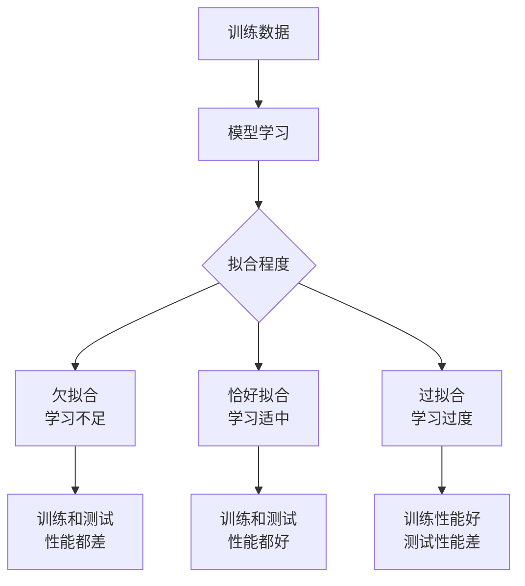
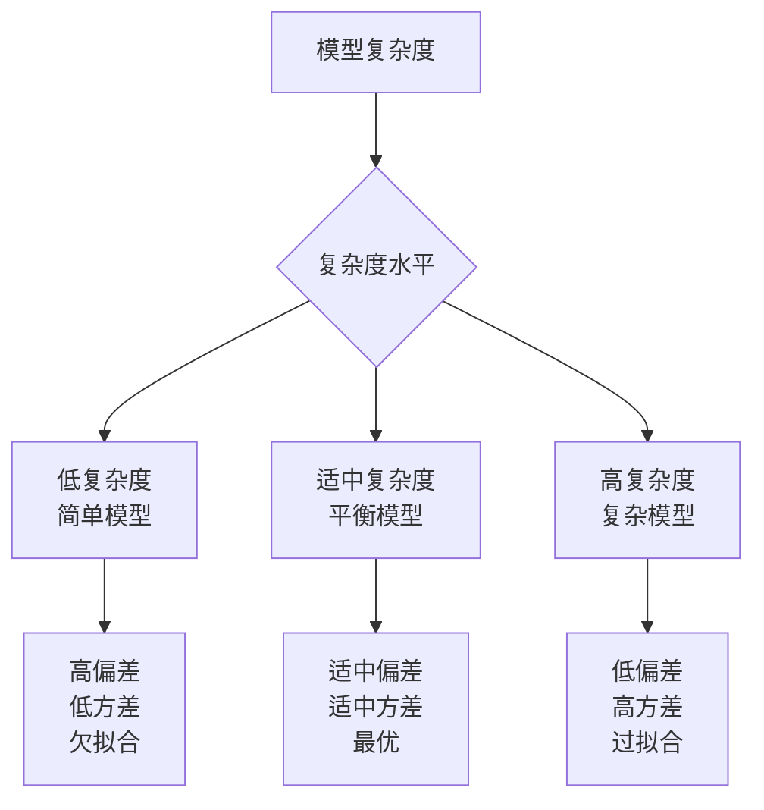
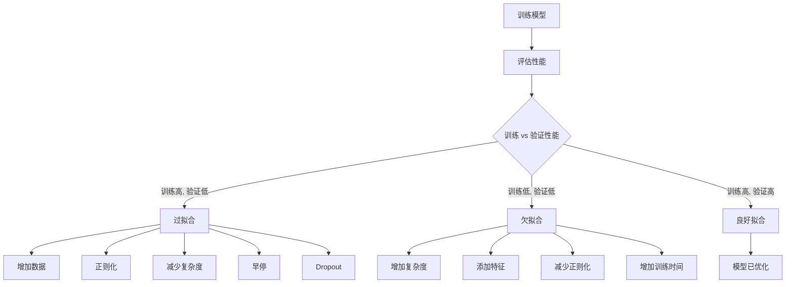

# 1.1.4 过拟合和欠拟合

## 学习目标
理解过拟合和欠拟合的概念，学会识别这些问题并掌握相应的解决方法。

## 引言：学习的平衡艺术

想象一下学习外语的过程：

- **欠拟合**：只记住了几个单词，无法理解句子的意思
- **刚好拟合**：掌握了语法规则，能理解和表达大部分内容
- **过拟合**：把整本教科书都背下来了，但遇到教科书外的内容就不知所措

机器学习中的拟合问题与此类似，关键是找到学习的平衡点。

## 什么是拟合？

**拟合 (Fitting)** 是指模型学习训练数据中规律的过程。理想情况下，我们希望模型能够：

1. **学会真正的规律**：捕捉数据中的本质模式
2. **忽略噪声**：不被随机波动误导
3. **泛化到新数据**：对未见过的数据也能做出合理预测



## 欠拟合 (Underfitting)

### 定义和特征

**欠拟合**：模型过于简单，无法捕捉数据中的基本规律

**表现特征**：
- 训练集准确率低
- 测试集准确率也低
- 训练和测试性能相近，但都不理想
- 模型复杂度不足

### 直观理解

```python
import numpy as np
import matplotlib.pyplot as plt
from sklearn.preprocessing import PolynomialFeatures
from sklearn.linear_model import LinearRegression
from sklearn.pipeline import Pipeline
from sklearn.metrics import mean_squared_error

# 生成非线性数据
np.random.seed(42)
X = np.linspace(0, 1, 100).reshape(-1, 1)
y_true = 1.5 * X.ravel() + 0.5 * np.sin(15 * X.ravel())
y = y_true + np.random.normal(0, 0.1, X.shape[0])  # 添加噪声

# 创建训练和测试数据
X_train, y_train = X[:70], y[:70]
X_test, y_test = X[70:], y[70:]

# 欠拟合示例：用直线拟合非线性数据
underfitting_model = LinearRegression()
underfitting_model.fit(X_train, y_train)

# 预测
X_plot = np.linspace(0, 1, 300).reshape(-1, 1)
y_plot_under = underfitting_model.predict(X_plot)

# 计算性能
train_score_under = underfitting_model.score(X_train, y_train)
test_score_under = underfitting_model.score(X_test, y_test)

print(f"欠拟合模型:")
print(f"训练集 R²: {train_score_under:.3f}")
print(f"测试集 R²: {test_score_under:.3f}")

# 可视化欠拟合
plt.figure(figsize=(12, 4))

plt.subplot(1, 3, 1)
plt.scatter(X_train, y_train, alpha=0.6, label='训练数据')
plt.scatter(X_test, y_test, alpha=0.6, label='测试数据')
plt.plot(X_plot, y_plot_under, 'r-', label='欠拟合模型', linewidth=2)
plt.plot(X_plot, 1.5 * X_plot.ravel() + 0.5 * np.sin(15 * X_plot.ravel()), 
         'g--', label='真实函数', alpha=0.7)
plt.title('欠拟合：模型过于简单')
plt.legend()
plt.grid(True, alpha=0.3)
```

### 欠拟合的原因

1. **模型复杂度不足**
   ```python
   # 用线性模型拟合非线性数据
   linear_model = LinearRegression()  # 太简单了
   ```

2. **特征不足**
   ```python
   # 只用一个特征预测复杂现象
   X_insufficient = data[['area']]  # 只用面积预测房价
   # 缺少位置、楼层、装修等重要特征
   ```

3. **训练不充分**
   ```python
   # 神经网络训练轮数太少
   model.fit(X_train, y_train, epochs=5)  # 太少了
   ```

4. **正则化过强**
   ```python
   # 正则化参数太大
   model = Ridge(alpha=1000)  # alpha太大，限制过强
   ```

### 解决欠拟合的方法

#### 1. 增加模型复杂度
```python
# 使用多项式特征
from sklearn.preprocessing import PolynomialFeatures

# 增加多项式特征
poly_features = PolynomialFeatures(degree=3)
X_train_poly = poly_features.fit_transform(X_train)
X_test_poly = poly_features.transform(X_test)

# 训练更复杂的模型
complex_model = LinearRegression()
complex_model.fit(X_train_poly, y_train)

train_score_complex = complex_model.score(X_train_poly, y_train)
test_score_complex = complex_model.score(X_test_poly, y_test)

print(f"\n复杂模型:")
print(f"训练集 R²: {train_score_complex:.3f}")
print(f"测试集 R²: {test_score_complex:.3f}")
```

#### 2. 增加更多特征
```python
# 房价预测示例：增加更多特征
house_features_simple = ['area']  # 简单特征
house_features_rich = [
    'area', 'bedrooms', 'bathrooms', 'age', 
    'distance_to_center', 'school_rating', 'crime_rate'
]  # 丰富特征

print("特征工程对比:")
print(f"简单特征数: {len(house_features_simple)}")
print(f"丰富特征数: {len(house_features_rich)}")
```

#### 3. 减少正则化强度
```python
from sklearn.linear_model import Ridge

# 尝试不同的正则化强度
alphas = [0.001, 0.01, 0.1, 1.0, 10.0]
for alpha in alphas:
    model = Ridge(alpha=alpha)
    model.fit(X_train_poly, y_train)
    train_score = model.score(X_train_poly, y_train)
    test_score = model.score(X_test_poly, y_test)
    print(f"Alpha={alpha}: 训练={train_score:.3f}, 测试={test_score:.3f}")
```

## 过拟合 (Overfitting)

### 定义和特征

**过拟合**：模型过于复杂，不仅学会了真正的规律，还记住了训练数据中的噪声

**表现特征**：
- 训练集准确率很高
- 测试集准确率明显较低
- 训练和测试性能差距很大
- 模型复杂度过高

### 直观理解

```python
# 过拟合示例：用高次多项式拟合数据
overfitting_model = Pipeline([
    ('poly', PolynomialFeatures(degree=15)),  # 15次多项式！
    ('linear', LinearRegression())
])

overfitting_model.fit(X_train, y_train)

# 预测
y_plot_over = overfitting_model.predict(X_plot)

# 计算性能
train_score_over = overfitting_model.score(X_train, y_train)
test_score_over = overfitting_model.score(X_test, y_test)

print(f"\n过拟合模型:")
print(f"训练集 R²: {train_score_over:.3f}")
print(f"测试集 R²: {test_score_over:.3f}")
print(f"性能差距: {train_score_over - test_score_over:.3f}")

# 可视化过拟合
plt.subplot(1, 3, 2)
plt.scatter(X_train, y_train, alpha=0.6, label='训练数据')
plt.scatter(X_test, y_test, alpha=0.6, label='测试数据')
plt.plot(X_plot, y_plot_over, 'r-', label='过拟合模型', linewidth=2)
plt.plot(X_plot, 1.5 * X_plot.ravel() + 0.5 * np.sin(15 * X_plot.ravel()), 
         'g--', label='真实函数', alpha=0.7)
plt.title('过拟合：模型过于复杂')
plt.legend()
plt.grid(True, alpha=0.3)
plt.ylim(-1, 3)  # 限制y轴范围，因为过拟合模型可能有极值
```

### 过拟合的原因

1. **模型过于复杂**
   ```python
   # 神经网络层数太多
   model = Sequential([
       Dense(1000, activation='relu'),
       Dense(1000, activation='relu'),
       Dense(1000, activation='relu'),  # 太多层了
       Dense(1000, activation='relu'),
       Dense(1)
   ])
   ```

2. **训练数据不足**
   ```python
   # 用很少的数据训练复杂模型
   small_dataset = X_train[:10]  # 只有10个样本
   complex_model.fit(small_dataset, y_train[:10])  # 容易过拟合
   ```

3. **训练时间过长**
   ```python
   # 训练轮数太多
   model.fit(X_train, y_train, epochs=1000)  # 可能训练过度
   ```

4. **缺乏正则化**
   ```python
   # 没有任何约束的复杂模型
   model = LinearRegression()  # 对高维数据没有正则化
   ```

### 解决过拟合的方法

#### 1. 正则化 (Regularization)

**L1正则化 (Lasso)**：
```python
from sklearn.linear_model import Lasso

# L1正则化：促进稀疏性，自动特征选择
lasso_model = Pipeline([
    ('poly', PolynomialFeatures(degree=15)),
    ('lasso', Lasso(alpha=0.01))  # L1正则化
])

lasso_model.fit(X_train, y_train)

train_score_lasso = lasso_model.score(X_train, y_train)
test_score_lasso = lasso_model.score(X_test, y_test)

print(f"\nLasso正则化:")
print(f"训练集 R²: {train_score_lasso:.3f}")
print(f"测试集 R²: {test_score_lasso:.3f}")

# 查看特征选择结果
lasso_coef = lasso_model.named_steps['lasso'].coef_
non_zero_features = np.sum(lasso_coef != 0)
print(f"非零特征数: {non_zero_features}/{len(lasso_coef)}")
```

**L2正则化 (Ridge)**：
```python
from sklearn.linear_model import Ridge

# L2正则化：平滑权重，防止权重过大
ridge_model = Pipeline([
    ('poly', PolynomialFeatures(degree=15)),
    ('ridge', Ridge(alpha=0.1))  # L2正则化
])

ridge_model.fit(X_train, y_train)

train_score_ridge = ridge_model.score(X_train, y_train)
test_score_ridge = ridge_model.score(X_test, y_test)

print(f"\nRidge正则化:")
print(f"训练集 R²: {train_score_ridge:.3f}")
print(f"测试集 R²: {test_score_ridge:.3f}")
```

**弹性网络 (Elastic Net)**：
```python
from sklearn.linear_model import ElasticNet

# 结合L1和L2正则化
elastic_model = Pipeline([
    ('poly', PolynomialFeatures(degree=15)),
    ('elastic', ElasticNet(alpha=0.01, l1_ratio=0.5))  # 50% L1 + 50% L2
])

elastic_model.fit(X_train, y_train)

train_score_elastic = elastic_model.score(X_train, y_train)
test_score_elastic = elastic_model.score(X_test, y_test)

print(f"\n弹性网络:")
print(f"训练集 R²: {train_score_elastic:.3f}")
print(f"测试集 R²: {test_score_elastic:.3f}")
```

#### 2. 早停 (Early Stopping)

```python
# 模拟神经网络训练过程
np.random.seed(42)
epochs = 100
train_losses = []
val_losses = []

# 模拟损失变化
for epoch in range(epochs):
    # 训练损失持续下降
    train_loss = 1.0 * np.exp(-epoch * 0.05) + np.random.normal(0, 0.01)
    
    # 验证损失先下降后上升（过拟合开始）
    if epoch < 30:
        val_loss = 1.0 * np.exp(-epoch * 0.04) + np.random.normal(0, 0.02)
    else:
        val_loss = 0.3 + (epoch - 30) * 0.01 + np.random.normal(0, 0.02)
    
    train_losses.append(train_loss)
    val_losses.append(val_loss)

# 可视化早停
plt.figure(figsize=(10, 6))
plt.plot(train_losses, label='训练损失', linewidth=2)
plt.plot(val_losses, label='验证损失', linewidth=2)

# 找到验证损失最小的点
best_epoch = np.argmin(val_losses)
plt.axvline(x=best_epoch, color='red', linestyle='--', 
            label=f'最佳停止点 (epoch {best_epoch})')

plt.xlabel('训练轮数 (Epochs)')
plt.ylabel('损失值')
plt.title('早停法防止过拟合')
plt.legend()
plt.grid(True, alpha=0.3)
plt.show()

print(f"建议在第 {best_epoch} 轮停止训练")
print(f"此时验证损失: {val_losses[best_epoch]:.3f}")
```

#### 3. 数据增强 (Data Augmentation)

```python
# 图像数据增强示例（概念演示）
def augment_data(X, y, augmentation_factor=2):
    """简单的数据增强示例"""
    X_augmented = [X]
    y_augmented = [y]
    
    for _ in range(augmentation_factor):
        # 添加噪声
        X_noisy = X + np.random.normal(0, 0.05, X.shape)
        X_augmented.append(X_noisy)
        y_augmented.append(y)
    
    return np.vstack(X_augmented), np.hstack(y_augmented)

# 原始数据
print(f"原始训练集大小: {X_train.shape[0]}")

# 数据增强
X_train_aug, y_train_aug = augment_data(X_train, y_train, augmentation_factor=3)
print(f"增强后训练集大小: {X_train_aug.shape[0]}")

# 用增强数据训练模型
augmented_model = Pipeline([
    ('poly', PolynomialFeatures(degree=10)),
    ('ridge', Ridge(alpha=0.01))
])

augmented_model.fit(X_train_aug, y_train_aug)

train_score_aug = augmented_model.score(X_train, y_train)
test_score_aug = augmented_model.score(X_test, y_test)

print(f"\n数据增强模型:")
print(f"训练集 R²: {train_score_aug:.3f}")
print(f"测试集 R²: {test_score_aug:.3f}")
```

#### 4. Dropout (神经网络专用)

```python
# Dropout概念演示
class SimpleDropout:
    def __init__(self, dropout_rate=0.5):
        self.dropout_rate = dropout_rate
    
    def apply_dropout(self, features, training=True):
        if not training:
            return features
        
        # 随机将一些特征设为0
        mask = np.random.random(features.shape) > self.dropout_rate
        return features * mask / (1 - self.dropout_rate)

# 演示dropout效果
np.random.seed(42)
original_features = np.random.randn(5, 10)
dropout = SimpleDropout(dropout_rate=0.3)

print("原始特征 (前5个):")
print(original_features[0, :5])

print("\n应用Dropout后 (前5个):")
dropped_features = dropout.apply_dropout(original_features, training=True)
print(dropped_features[0, :5])

print("\n推理时 (无Dropout):")
inference_features = dropout.apply_dropout(original_features, training=False)
print(inference_features[0, :5])
```

## 恰好拟合：找到平衡点

```python
# 恰好拟合示例：适中的复杂度 + 适当的正则化
balanced_model = Pipeline([
    ('poly', PolynomialFeatures(degree=5)),  # 适中的复杂度
    ('ridge', Ridge(alpha=0.1))  # 适当的正则化
])

balanced_model.fit(X_train, y_train)

# 预测
y_plot_balanced = balanced_model.predict(X_plot)

# 计算性能
train_score_balanced = balanced_model.score(X_train, y_train)
test_score_balanced = balanced_model.score(X_test, y_test)

print(f"\n平衡模型:")
print(f"训练集 R²: {train_score_balanced:.3f}")
print(f"测试集 R²: {test_score_balanced:.3f}")
print(f"性能差距: {abs(train_score_balanced - test_score_balanced):.3f}")

# 可视化平衡拟合
plt.subplot(1, 3, 3)
plt.scatter(X_train, y_train, alpha=0.6, label='训练数据')
plt.scatter(X_test, y_test, alpha=0.6, label='测试数据')
plt.plot(X_plot, y_plot_balanced, 'r-', label='平衡模型', linewidth=2)
plt.plot(X_plot, 1.5 * X_plot.ravel() + 0.5 * np.sin(15 * X_plot.ravel()), 
         'g--', label='真实函数', alpha=0.7)
plt.title('恰好拟合：平衡的复杂度')
plt.legend()
plt.grid(True, alpha=0.3)

plt.tight_layout()
plt.show()
```

## 偏差-方差权衡 (Bias-Variance Tradeoff)

### 理论基础

模型的总误差可以分解为三部分：

**总误差 = 偏差² + 方差 + 噪声**

- **偏差 (Bias)**：模型的预测值与真实值之间的差异
- **方差 (Variance)**：模型对训练数据变化的敏感程度
- **噪声 (Noise)**：数据中的随机误差，无法消除



### 直观演示

```python
def bias_variance_demo():
    """演示偏差-方差权衡"""
    np.random.seed(42)
    
    # 真实函数
    def true_function(x):
        return 1.5 * x + 0.5 * np.sin(15 * x)
    
    # 生成多个数据集
    n_datasets = 50
    n_samples = 50
    X_test = np.linspace(0, 1, 100).reshape(-1, 1)
    y_test_true = true_function(X_test.ravel())
    
    # 不同复杂度的模型
    models = {
        '简单模型 (度数=1)': Pipeline([('poly', PolynomialFeatures(1)), ('linear', LinearRegression())]),
        '适中模型 (度数=3)': Pipeline([('poly', PolynomialFeatures(3)), ('ridge', Ridge(alpha=0.1))]),
        '复杂模型 (度数=10)': Pipeline([('poly', PolynomialFeatures(10)), ('linear', LinearRegression())])
    }
    
    results = {}
    
    for model_name, model in models.items():
        predictions = []
        
        # 在多个数据集上训练
        for i in range(n_datasets):
            # 生成带噪声的训练数据
            X_train = np.random.uniform(0, 1, n_samples).reshape(-1, 1)
            y_train = true_function(X_train.ravel()) + np.random.normal(0, 0.1, n_samples)
            
            # 训练模型
            model.fit(X_train, y_train)
            
            # 预测
            y_pred = model.predict(X_test)
            predictions.append(y_pred)
        
        predictions = np.array(predictions)
        
        # 计算偏差和方差
        mean_prediction = np.mean(predictions, axis=0)
        bias_squared = np.mean((mean_prediction - y_test_true) ** 2)
        variance = np.mean(np.var(predictions, axis=0))
        
        results[model_name] = {
            'bias_squared': bias_squared,
            'variance': variance,
            'total_error': bias_squared + variance,
            'predictions': predictions,
            'mean_prediction': mean_prediction
        }
    
    # 可视化结果
    fig, axes = plt.subplots(2, 2, figsize=(15, 12))
    
    # 绘制预测结果
    for i, (model_name, result) in enumerate(results.items()):
        ax = axes[0, i] if i < 2 else axes[1, 0]
        
        # 绘制部分预测曲线
        for j in range(0, min(10, len(result['predictions']))):
            ax.plot(X_test, result['predictions'][j], 'b-', alpha=0.1, linewidth=1)
        
        # 绘制平均预测和真实函数
        ax.plot(X_test, result['mean_prediction'], 'r-', linewidth=3, label='平均预测')
        ax.plot(X_test, y_test_true, 'g--', linewidth=2, label='真实函数')
        
        ax.set_title(f'{model_name}\n偏差²={result["bias_squared"]:.3f}, 方差={result["variance"]:.3f}')
        ax.legend()
        ax.grid(True, alpha=0.3)
    
    # 偏差-方差权衡图
    ax = axes[1, 1]
    model_names = list(results.keys())
    biases = [results[name]['bias_squared'] for name in model_names]
    variances = [results[name]['variance'] for name in model_names]
    total_errors = [results[name]['total_error'] for name in model_names]
    
    x_pos = np.arange(len(model_names))
    width = 0.25
    
    ax.bar(x_pos - width, biases, width, label='偏差²', alpha=0.8)
    ax.bar(x_pos, variances, width, label='方差', alpha=0.8)
    ax.bar(x_pos + width, total_errors, width, label='总误差', alpha=0.8)
    
    ax.set_xlabel('模型类型')
    ax.set_ylabel('误差值')
    ax.set_title('偏差-方差权衡')
    ax.set_xticks(x_pos)
    ax.set_xticklabels([name.split('(')[0].strip() for name in model_names], rotation=45)
    ax.legend()
    ax.grid(True, alpha=0.3)
    
    plt.tight_layout()
    plt.show()
    
    # 打印数值结果
    print("偏差-方差分析结果:")
    print("-" * 50)
    for model_name, result in results.items():
        print(f"{model_name}:")
        print(f"  偏差²: {result['bias_squared']:.4f}")
        print(f"  方差:   {result['variance']:.4f}")
        print(f"  总误差: {result['total_error']:.4f}")
        print()

# 运行演示
bias_variance_demo()
```

## 实际项目中的拟合问题诊断

### 学习曲线 (Learning Curves)

```python
from sklearn.model_selection import learning_curve

def plot_learning_curves(model, X, y, title="学习曲线"):
    """绘制学习曲线来诊断拟合问题"""
    
    train_sizes, train_scores, val_scores = learning_curve(
        model, X, y, cv=5, n_jobs=-1, 
        train_sizes=np.linspace(0.1, 1.0, 10),
        scoring='neg_mean_squared_error'
    )
    
    # 转换为正值
    train_scores = -train_scores
    val_scores = -val_scores
    
    # 计算均值和标准差
    train_mean = np.mean(train_scores, axis=1)
    train_std = np.std(train_scores, axis=1)
    val_mean = np.mean(val_scores, axis=1)
    val_std = np.std(val_scores, axis=1)
    
    # 绘制学习曲线
    plt.figure(figsize=(10, 6))
    plt.plot(train_sizes, train_mean, 'o-', color='blue', label='训练分数')
    plt.fill_between(train_sizes, train_mean - train_std, train_mean + train_std, alpha=0.1, color='blue')
    
    plt.plot(train_sizes, val_mean, 'o-', color='red', label='验证分数')
    plt.fill_between(train_sizes, val_mean - val_std, val_mean + val_std, alpha=0.1, color='red')
    
    plt.xlabel('训练集大小')
    plt.ylabel('均方误差')
    plt.title(title)
    plt.legend()
    plt.grid(True, alpha=0.3)
    
    # 诊断建议
    final_train_score = train_mean[-1]
    final_val_score = val_mean[-1]
    score_gap = final_train_score - final_val_score
    
    print(f"学习曲线诊断 - {title}:")
    print(f"最终训练误差: {final_train_score:.3f}")
    print(f"最终验证误差: {final_val_score:.3f}")
    print(f"性能差距: {score_gap:.3f}")
    
    if score_gap > 0.1 and final_train_score < 0.1:
        print("诊断: 可能存在过拟合")
        print("建议: 增加正则化、减少模型复杂度或增加训练数据")
    elif final_train_score > 0.2 and final_val_score > 0.2:
        print("诊断: 可能存在欠拟合")
        print("建议: 增加模型复杂度、添加特征或减少正则化")
    else:
        print("诊断: 模型拟合良好")
    print()
    
    plt.show()

# 测试不同模型的学习曲线
models_to_test = [
    ("欠拟合模型", LinearRegression()),
    ("过拟合模型", Pipeline([('poly', PolynomialFeatures(15)), ('linear', LinearRegression())])),
    ("平衡模型", Pipeline([('poly', PolynomialFeatures(3)), ('ridge', Ridge(alpha=0.1))]))
]

for model_name, model in models_to_test:
    plot_learning_curves(model, X, y.ravel(), title=model_name)
```

### 验证曲线 (Validation Curves)

```python
from sklearn.model_selection import validation_curve

def plot_validation_curve(model_class, param_name, param_range, X, y, title="验证曲线"):
    """绘制验证曲线来选择最佳参数"""
    
    train_scores, val_scores = validation_curve(
        model_class, X, y, param_name=param_name, param_range=param_range,
        cv=5, scoring='neg_mean_squared_error', n_jobs=-1
    )
    
    # 转换为正值
    train_scores = -train_scores
    val_scores = -val_scores
    
    # 计算均值和标准差
    train_mean = np.mean(train_scores, axis=1)
    train_std = np.std(train_scores, axis=1)
    val_mean = np.mean(val_scores, axis=1)
    val_std = np.std(val_scores, axis=1)
    
    # 绘制验证曲线
    plt.figure(figsize=(10, 6))
    plt.semilogx(param_range, train_mean, 'o-', color='blue', label='训练分数')
    plt.fill_between(param_range, train_mean - train_std, train_mean + train_std, alpha=0.1, color='blue')
    
    plt.semilogx(param_range, val_mean, 'o-', color='red', label='验证分数')
    plt.fill_between(param_range, val_mean - val_std, val_mean + val_std, alpha=0.1, color='red')
    
    plt.xlabel(param_name)
    plt.ylabel('均方误差')
    plt.title(title)
    plt.legend()
    plt.grid(True, alpha=0.3)
    
    # 找到最佳参数
    best_param_idx = np.argmin(val_mean)
    best_param = param_range[best_param_idx]
    best_score = val_mean[best_param_idx]
    
    plt.axvline(x=best_param, color='green', linestyle='--', 
                label=f'最佳参数: {best_param:.3f}')
    plt.legend()
    
    print(f"验证曲线分析 - {title}:")
    print(f"最佳 {param_name}: {best_param:.3f}")
    print(f"最佳验证分数: {best_score:.3f}")
    print()
    
    plt.show()
    
    return best_param

# 测试Ridge回归的alpha参数
X_poly = PolynomialFeatures(degree=10).fit_transform(X)
ridge_alphas = np.logspace(-4, 2, 20)

best_alpha = plot_validation_curve(
    Ridge, 'alpha', ridge_alphas, X_poly, y.ravel(), 
    title="Ridge回归正则化参数选择"
)
```

## 实用的拟合问题解决策略

### 诊断流程图



### 完整的诊断和解决工具

```python
class FittingDiagnostic:
    """拟合问题诊断和解决工具"""
    
    def __init__(self):
        self.diagnosis = None
        self.recommendations = []
    
    def diagnose(self, train_score, val_score, threshold=0.05):
        """诊断拟合问题"""
        score_gap = train_score - val_score
        
        if score_gap > threshold and train_score > 0.8:
            self.diagnosis = "过拟合"
            self.recommendations = [
                "增加训练数据",
                "添加正则化 (L1/L2)",
                "减少模型复杂度",
                "使用早停法",
                "应用Dropout (神经网络)",
                "数据增强"
            ]
        elif train_score < 0.7 and val_score < 0.7:
            self.diagnosis = "欠拟合"
            self.recommendations = [
                "增加模型复杂度",
                "添加更多特征",
                "减少正则化强度",
                "增加训练时间",
                "使用更复杂的模型"
            ]
        else:
            self.diagnosis = "良好拟合"
            self.recommendations = [
                "模型性能良好",
                "可以考虑进一步优化超参数",
                "准备部署模型"
            ]
        
        return self.diagnosis
    
    def print_report(self, train_score, val_score):
        """打印诊断报告"""
        diagnosis = self.diagnose(train_score, val_score)
        
        print("=== 拟合问题诊断报告 ===")
        print(f"训练分数: {train_score:.3f}")
        print(f"验证分数: {val_score:.3f}")
        print(f"性能差距: {train_score - val_score:.3f}")
        print(f"诊断结果: {diagnosis}")
        print("\n建议措施:")
        for i, rec in enumerate(self.recommendations, 1):
            print(f"{i}. {rec}")
        print("=" * 30)

# 使用示例
diagnostic = FittingDiagnostic()

# 测试不同场景
scenarios = [
    (0.95, 0.65, "过拟合场景"),
    (0.60, 0.58, "欠拟合场景"),
    (0.85, 0.82, "良好拟合场景")
]

for train_score, val_score, scenario_name in scenarios:
    print(f"\n{scenario_name}:")
    diagnostic.print_report(train_score, val_score)
```

## 小结

过拟合和欠拟合是机器学习中的核心概念：

### 关键要点

1. **欠拟合**：
   - 模型过于简单，无法捕捉数据规律
   - 训练和测试性能都差
   - 解决：增加复杂度、添加特征

2. **过拟合**：
   - 模型过于复杂，记住了噪声
   - 训练性能好，测试性能差
   - 解决：正则化、早停、增加数据

3. **平衡拟合**：
   - 适中的复杂度和合适的正则化
   - 训练和测试性能都好且相近

### 实用建议

1. **始终监控训练和验证性能**
2. **使用学习曲线和验证曲线诊断问题**
3. **从简单模型开始，逐步增加复杂度**
4. **正则化是防止过拟合的有效手段**
5. **更多数据通常能改善过拟合问题**

## 思考题

1. 为什么过拟合的模型在训练集上表现很好，但在测试集上表现很差？

2. 在以下场景中，你更担心过拟合还是欠拟合？为什么？
   - 医学诊断系统
   - 推荐系统
   - 自动驾驶系统

3. 如果你有一个模型，训练准确率是95%，验证准确率是60%，你会采取什么措施？

4. L1和L2正则化在防止过拟合方面有什么不同？

---

**下一节预告**：我们将学习机器学习中常用的评估指标，了解如何正确评估模型性能。