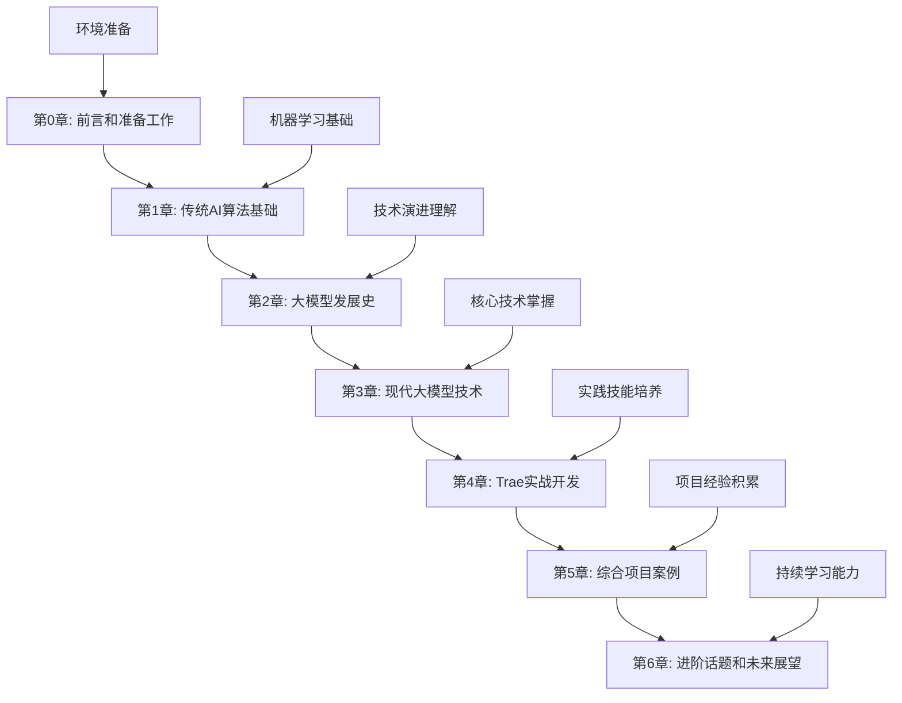

# 第0章：前言和准备工作

## 欢迎来到AI算法开发的世界

在这个人工智能快速发展的时代，掌握AI算法开发技能已经成为现代开发者的必备能力。无论你是想要转型到AI领域的传统开发者，还是希望提升AI开发技能的初学者，这本教程都将为你提供一条清晰、实用的学习路径。

## 为什么选择这本教程？

### 🎯 实用导向，快速上手
与传统的学术教材不同，本教程采用"工具优先"的理念，重点关注如何使用现代AI开发工具快速构建实际应用，而不是深入复杂的数学推导。

### 🚀 现代工具，原生体验
全程使用Trae AI这样的现代开发环境，让你从一开始就体验AI原生的开发方式，学习最前沿的开发实践。

### 📚 系统完整，循序渐进
从传统AI算法基础到现代大模型技术，从理论学习到实战项目，构建完整的知识体系。

### 💡 项目驱动，学以致用
每个概念都配有实际项目和代码示例，确保你能够将所学知识应用到实际工作中。

## 学习路径概览

## 学习目标

通过本教程的学习，你将能够：

- **理解AI算法的基本原理**：掌握从传统机器学习到现代大模型的核心概念
- **熟练使用现代AI工具**：特别是Trae等AI原生开发环境
- **独立完成AI项目**：从数据处理到模型部署的完整流程
- **跟上技术发展趋势**：建立持续学习和技术更新的能力

## 学习建议

### ⏰ 时间安排
- **总学习时长**：40-50小时
- **建议周期**：6-8周
- **每周投入**：6-8小时

### 📖 学习方法
1. **理论与实践并重**：每学完一个概念，立即动手实践
2. **完成所有项目**：不要跳过任何实践环节
3. **记录学习笔记**：建立自己的知识库
4. **参与社区讨论**：与其他学习者交流经验

### 🎯 学习重点
- **第1-2章**：建立AI认知框架，理解技术发展脉络
- **第3-4章**：掌握核心技术和实践技能
- **第5-6章**：巩固知识，拓展视野

## 前置知识要求

### 必需技能
- **编程基础**：2-5年编程经验，熟悉至少一门编程语言
- **Python基础**：了解基本语法、数据结构和面向对象编程
- **数学基础**：高中数学水平，了解基本的统计概念

### 加分技能
- **Git版本控制**：有助于项目管理和代码协作
- **Linux基础**：部分部署环节会用到
- **Web开发经验**：有助于理解AI应用的集成

## 环境准备检查清单

在开始正式学习之前，请确保完成以下准备工作：

### 硬件要求
- [ ] CPU: Intel i5 或 AMD Ryzen 5 以上
- [ ] 内存: 8GB RAM（推荐16GB）
- [ ] 存储: 至少20GB可用空间
- [ ] 网络: 稳定的互联网连接

### 软件环境
- [ ] 操作系统: Windows 10/11, macOS 10.15+, 或 Ubuntu 18.04+
- [ ] Python 3.8+ 已安装
- [ ] Trae AI 开发环境已安装
- [ ] Git 版本控制工具已安装

### 账户准备
- [ ] GitHub 账户（用于代码管理）
- [ ] Hugging Face 账户（用于模型和数据集）
- [ ] OpenAI API 密钥（可选，用于某些实验）

## 获取帮助和支持

### 官方资源
- **教程仓库**：[GitHub链接]
- **问题反馈**：[Issues页面]
- **更新日志**：[Changelog]

### 社区支持
- **学习群组**：[Discord/微信群]
- **技术论坛**：[论坛链接]
- **定期答疑**：每周三晚8点在线答疑

### 学习伙伴
我们鼓励你寻找学习伙伴，一起完成这个学习旅程。你可以：
- 在社区中寻找同期学习者
- 组建学习小组，定期讨论
- 互相review代码和项目

## 开始你的AI开发之旅

现在，让我们开始这个激动人心的学习旅程吧！首先，我们将在接下来的几个小节中完成环境配置，然后正式进入AI算法的学习。

记住，学习AI开发不是一蹴而就的过程，需要持续的实践和思考。保持好奇心，勇于尝试，相信你一定能够掌握这些强大的技术工具。

---

**下一节**：[0.1 教程介绍和学习路径](0.1_tutorial_introduction.md)

**本章导航**：
- [0.1 教程介绍和学习路径](0.1_tutorial_introduction.md)
- [0.2 AI开发工具生态概览](0.2_ai_tools_ecosystem.md)
- [0.3 Trae环境安装和配置](0.3_trae_setup.md)
- [0.4 Python基础知识回顾](0.4_python_basics.md)