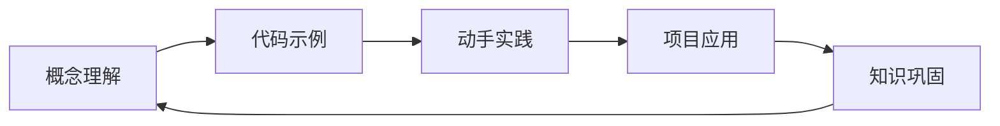
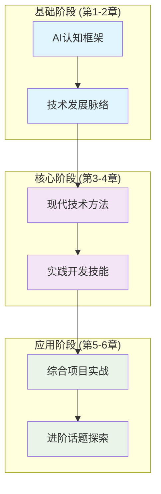
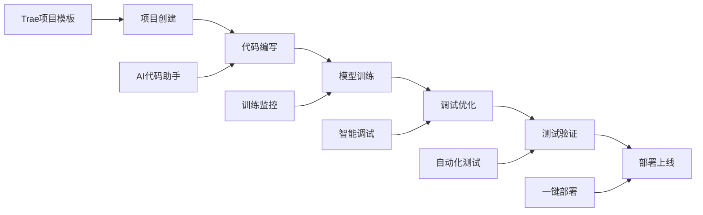
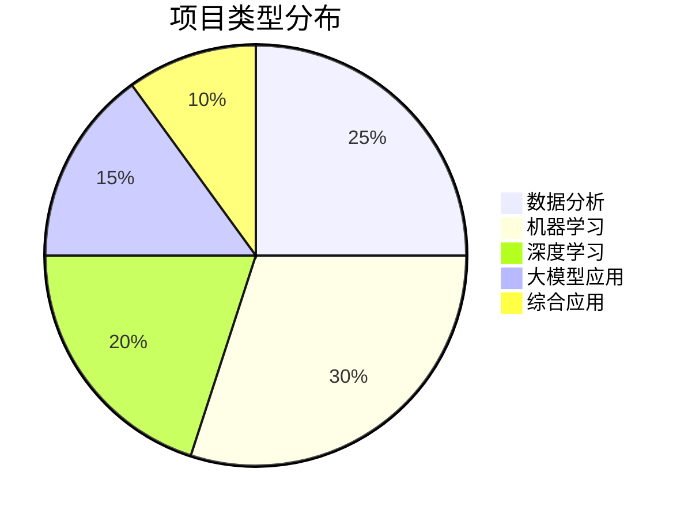
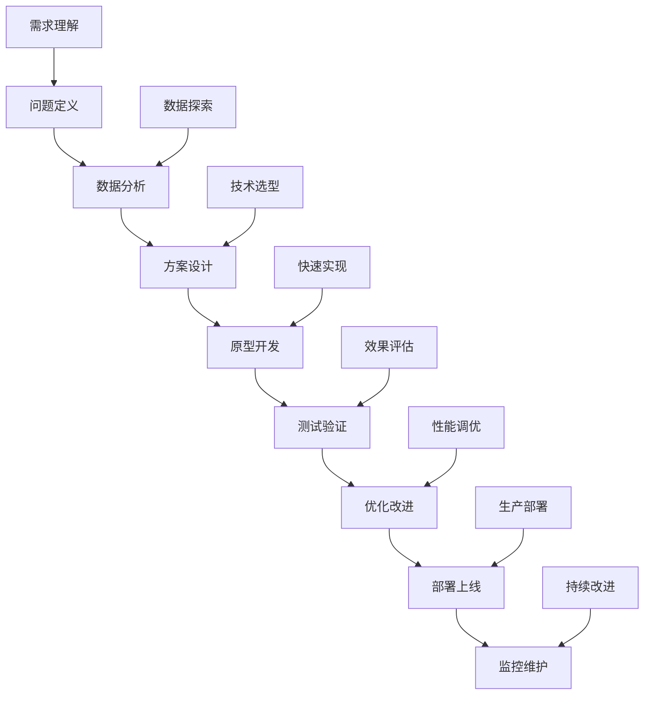

# 0.1 教程介绍和学习路径

## 0.1.1 教程目标和定位

### 教程的核心价值

在当今快速发展的AI领域，开发者面临着一个共同的挑战：**如何从传统编程快速过渡到AI开发？** 本教程正是为了解决这个问题而设计的。

#### 🌉 从传统编程到AI开发的桥梁

传统的软件开发注重逻辑设计和算法实现，而AI开发更多关注数据处理、模型训练和智能应用构建。本教程将帮助你：

- **理解思维转换**：从确定性编程到概率性建模
- **掌握新的工具链**：从传统IDE到AI原生开发环境
- **学习新的开发模式**：从代码优先到数据驱动
- **建立AI思维**：从功能实现到智能决策

#### 🔬 理论与实践相结合的学习方式

我们采用"理论够用，实践为主"的教学理念：



- **概念理解**：用通俗易懂的语言解释核心概念
- **代码示例**：提供完整可运行的代码
- **动手实践**：引导你亲自实现和修改
- **项目应用**：将知识应用到实际项目中
- **知识巩固**：通过总结和反思加深理解

#### 🛠️ 现代AI工具的深度应用

本教程重点关注现代AI开发工具的使用，特别是：

- **Trae AI**：AI原生的集成开发环境
- **Hugging Face**：预训练模型和数据集平台
- **LangChain**：大语言模型应用开发框架
- **Gradio**：快速构建AI应用界面
- **Docker**：容器化部署和环境管理

#### 🎯 面向实际项目的技能培养

每个章节都包含实际项目，从简单到复杂：

1. **第1章项目**：手写数字识别器
2. **第2章项目**：文本情感分析工具
3. **第3章项目**：智能问答系统
4. **第4章项目**：多模态内容生成器
5. **第5章项目**：完整的AI应用系统

### 目标读者画像

#### 👨‍💻 有经验的传统开发者

**典型特征**：
- 2-5年软件开发经验
- 熟悉至少一门编程语言（Python、Java、JavaScript等）
- 对AI/ML了解有限或完全不了解
- 希望快速转型到AI领域

**学习动机**：
- 职业发展需要
- 技术好奇心
- 项目需求驱动
- 薪资提升期望

#### 🎓 计算机相关专业学生

**典型特征**：
- 本科或研究生在读
- 有扎实的编程基础
- 学过基础的数学和统计课程
- 希望在AI领域找到工作机会

**学习目标**：
- 补充实践经验
- 了解行业应用
- 准备求职面试
- 完成毕业项目

#### 🚀 实用主义学习者

**核心特点**：
- 更关注"如何做"而非"为什么这样做"
- 希望快速看到学习成果
- 偏好项目驱动的学习方式
- 注重技能的实际应用价值

**学习偏好**：
- 跳过复杂的数学推导
- 重视代码示例和实践
- 喜欢循序渐进的教学方式
- 需要清晰的学习路径指导

### 学习成果预期

完成本教程后，你将获得以下能力：

#### 🧠 AI算法理解能力

- **传统机器学习**：
  - 理解监督学习、无监督学习的基本原理
  - 掌握常用算法的应用场景和选择标准
  - 能够进行特征工程和模型评估

- **深度学习基础**：
  - 理解神经网络的基本结构和训练过程
  - 掌握CNN、RNN等常用架构
  - 了解反向传播和梯度下降原理

- **大模型技术**：
  - 理解Transformer架构和注意力机制
  - 掌握预训练和微调的基本流程
  - 了解提示工程和模型优化技巧

#### 🛠️ 现代工具使用能力

- **Trae AI开发环境**：
  - 熟练使用AI辅助编程功能
  - 掌握项目管理和版本控制
  - 能够进行调试和性能优化

- **开源生态工具**：
  - 使用Hugging Face进行模型选择和部署
  - 利用LangChain构建复杂AI应用
  - 通过Gradio快速创建用户界面

#### 🏗️ 项目开发能力

- **完整开发流程**：
  ```mermaid
  graph TD
      A[需求分析] --> B[数据准备]
      B --> C[模型选择]
      C --> D[训练优化]
      D --> E[应用集成]
      E --> F[部署上线]
      F --> G[监控维护]
  ```

- **具体技能清单**：
  - [ ] 数据收集、清洗和预处理
  - [ ] 模型训练、验证和调优
  - [ ] API设计和服务部署
  - [ ] 用户界面设计和交互
  - [ ] 性能监控和问题诊断
  - [ ] 版本管理和持续集成

#### 📚 持续学习能力

- **技术跟踪能力**：
  - 了解AI领域的主要会议和期刊
  - 掌握阅读技术论文的方法
  - 建立个人的学习和实践体系

- **社区参与能力**：
  - 参与开源项目的贡献
  - 在技术社区中分享经验
  - 与其他开发者协作解决问题

## 0.1.2 学习路径设计

### 渐进式学习架构

我们的学习路径采用螺旋式上升的设计理念，每个阶段都会在前一阶段的基础上深化和扩展：



### 详细章节规划

#### 📖 第1章：传统AI算法基础 (预计8-10小时)

**学习目标**：建立AI认知框架，理解基础概念

**核心内容**：
- 机器学习基本概念和分类
- 监督学习算法（线性回归、决策树、SVM等）
- 无监督学习算法（聚类、降维等）
- 深度学习入门（神经网络基础）

**实践项目**：
- 房价预测模型（回归问题）
- 鸢尾花分类器（分类问题）
- 客户分群分析（聚类问题）
- 手写数字识别（神经网络）

**Trae实践重点**：
- 数据探索和可视化
- 模型训练和评估
- 超参数调优

#### 📚 第2章：大模型发展史 (预计6-8小时)

**学习目标**：理解AI技术演进脉络，把握发展趋势

**核心内容**：
- 早期神经网络发展历程
- Transformer架构的突破性意义
- GPT系列模型的演进过程
- BERT及其变体的技术路线
- 多模态大模型的发展现状

**实践项目**：
- 复现经典模型架构
- 对比不同模型的性能
- 分析模型演进的技术脉络

**Trae实践重点**：
- 模型架构可视化
- 性能对比分析
- 技术趋势研究

#### 🔬 第3章：现代大模型技术 (预计10-12小时)

**学习目标**：掌握核心技术方法，理解实现原理

**核心内容**：
- 预训练技术和自监督学习
- 微调方法和适应性训练
- 提示工程和上下文学习
- 模型压缩和优化技术
- 多模态融合和处理

**实践项目**：
- 文本分类模型微调
- 智能问答系统构建
- 图像描述生成器
- 多模态内容理解

**Trae实践重点**：
- 预训练模型使用
- 微调流程实现
- 提示优化技巧

#### 🛠️ 第4章：Trae实战开发 (预计8-10小时)

**学习目标**：实践完整开发流程，培养工程能力

**核心内容**：
- Trae开发环境深度使用
- AI辅助编程最佳实践
- 项目管理和协作流程
- 调试和性能优化技巧
- 部署和运维实践

**实践项目**：
- 完整AI应用开发
- 团队协作项目
- 性能优化案例
- 部署上线实践

**Trae实践重点**：
- 高效开发工作流
- 代码质量管理
- 自动化测试和部署

#### 🏗️ 第5章：综合项目案例 (预计10-12小时)

**学习目标**：巩固和应用所学知识，积累项目经验

**核心内容**：
- 智能客服系统
- 个性化推荐引擎
- 多模态内容生成器
- 实时数据分析平台

**实践项目**：
- 选择一个完整项目深度实现
- 从需求分析到上线部署
- 包含前端、后端、AI模型的完整系统

**Trae实践重点**：
- 全栈开发能力
- 系统架构设计
- 用户体验优化

#### 🚀 第6章：进阶话题和未来展望 (预计6-8小时)

**学习目标**：拓展视野，建立持续学习能力

**核心内容**：
- AI安全和伦理考虑
- 模型可解释性和公平性
- 边缘计算和模型部署
- 新兴技术趋势分析
- 职业发展和学习路径

**实践项目**：
- 模型安全性测试
- 可解释性分析工具
- 边缘部署实验
- 技术趋势研究报告

### 学习时间安排建议

#### ⏰ 标准学习计划 (8周)

```
第1周：第0章 + 第1章前半部分
├── 环境配置和基础准备 (2小时)
├── 机器学习基本概念 (3小时)
└── 监督学习算法实践 (3小时)

第2周：第1章后半部分
├── 无监督学习算法 (4小时)
└── 深度学习入门 (4小时)

第3周：第2章大模型发展史
├── 早期发展历程 (2小时)
├── Transformer突破 (3小时)
└── GPT系列演进 (3小时)

第4周：第2章完成 + 第3章开始
├── BERT和多模态发展 (2小时)
├── 预训练技术 (3小时)
└── 微调方法 (3小时)

第5周：第3章核心技术
├── 提示工程 (4小时)
└── 模型优化 (4小时)

第6周：第4章Trae实战
├── 开发环境深度使用 (4小时)
└── 项目管理和部署 (4小时)

第7周：第5章综合项目
├── 项目选择和规划 (2小时)
├── 核心功能开发 (6小时)

第8周：项目完成和进阶学习
├── 项目完善和部署 (4小时)
└── 第6章进阶话题 (4小时)
```

#### 🏃‍♂️ 快速学习计划 (6周)

适合有一定AI基础或学习时间充裕的学习者：

- **每周投入**：10-12小时
- **重点策略**：快速过理论，重点做项目
- **调整建议**：合并相关章节，增加实践比重

#### 🐌 深度学习计划 (12周)

适合希望深入理解每个概念的学习者：

- **每周投入**：4-5小时
- **重点策略**：深入理解原理，扩展相关知识
- **调整建议**：增加额外阅读，完成更多练习

### 学习方法建议

#### 📝 学习笔记管理

建议使用以下结构组织学习笔记：

```
学习笔记/
├── 概念总结/
│   ├── 机器学习基础.md
│   ├── 深度学习原理.md
│   └── 大模型技术.md
├── 代码实践/
│   ├── 项目1_房价预测/
│   ├── 项目2_文本分类/
│   └── 项目3_问答系统/
├── 问题记录/
│   ├── 技术问题.md
│   └── 解决方案.md
└── 学习反思/
    ├── 周总结.md
    └── 阶段回顾.md
```

#### 🤝 社区参与策略

- **每周分享**：在学习群中分享一个学习心得
- **问题讨论**：遇到问题先尝试自己解决，然后在社区讨论
- **代码review**：与学习伙伴互相review代码
- **项目展示**：完成项目后在社区展示和获取反馈

#### 🎯 学习效果评估

每章学习完成后，进行自我评估：

- **理论理解**：能否用自己的话解释核心概念？
- **实践能力**：能否独立完成相似的项目？
- **问题解决**：遇到新问题时能否找到解决思路？
- **知识迁移**：能否将所学应用到其他场景？

## 0.1.3 教程特色和优势

### 🛠️ 工具优先的理念

#### 重点关注现代AI工具的使用

传统的AI教育往往从数学理论开始，而我们选择从工具使用入手：

**传统路径**：
```
数学基础 → 算法原理 → 代码实现 → 工具使用
```

**我们的路径**：
```
工具使用 → 实践体验 → 原理理解 → 深度优化
```

这种方法的优势：
- **快速获得成就感**：第一天就能运行AI模型
- **理解更加直观**：通过实际效果理解算法作用
- **学习动机更强**：看到实际应用价值
- **技能更加实用**：直接对接工作需求

#### 减少复杂数学推导的比重

我们不是完全忽略数学，而是：

- **必要的数学**：保留理解算法必需的数学概念
- **直观的解释**：用图形和类比代替复杂公式
- **实践中学习**：通过调参和实验理解数学意义
- **按需深入**：提供进阶资源供有兴趣的学习者深入

**示例对比**：

传统教学方式：
```
梯度下降算法：
∇f(x) = lim(h→0) [f(x+h) - f(x)] / h
θ(t+1) = θ(t) - α∇f(θ(t))
```

我们的教学方式：
```python
# 梯度下降就像下山找最低点
# 每次都朝着最陡的方向走一小步
for epoch in range(1000):
    prediction = model(X)
    loss = calculate_loss(prediction, y)
    # 计算梯度（坡度）
    gradients = calculate_gradients(loss)
    # 更新参数（走一步）
    model.update_parameters(gradients, learning_rate=0.01)
```

#### 强调实用性和可操作性

每个概念都配有：
- **完整代码示例**：可以直接运行和修改
- **实际应用场景**：说明在什么情况下使用
- **常见问题解答**：预防和解决典型问题
- **最佳实践建议**：基于实际项目经验的建议

### 🚀 Trae深度集成

#### 全程使用Trae AI开发环境

**为什么选择Trae？**

1. **AI原生设计**：专为AI开发优化的界面和功能
2. **智能代码助手**：提供上下文相关的代码建议
3. **集成开发体验**：无需配置复杂的开发环境
4. **现代化工作流**：支持最新的AI开发最佳实践

**Trae使用贯穿全程**：



#### 体验AI原生的开发体验

**传统开发 vs AI原生开发**：

| 方面 | 传统开发 | AI原生开发 |
|------|----------|------------|
| 代码编写 | 手动编写所有代码 | AI助手生成基础代码 |
| 问题调试 | 查文档、搜索引擎 | AI助手直接解答 |
| 代码优化 | 人工review和重构 | AI建议优化方案 |
| 测试用例 | 手动编写测试 | AI生成测试用例 |
| 文档编写 | 手动编写文档 | AI自动生成文档 |

#### 学习现代AI开发最佳实践

通过Trae的使用，你将学会：

- **提示工程技巧**：如何与AI助手高效协作
- **代码质量管理**：利用AI进行代码review
- **自动化流程**：设置AI辅助的开发流程
- **团队协作**：在AI辅助环境中的协作方式

### 📚 项目驱动学习

#### 每个概念都配有实际项目

**项目设计原则**：

1. **循序渐进**：从简单到复杂，逐步提升难度
2. **实用导向**：选择有实际应用价值的项目
3. **技能覆盖**：确保涵盖所有重要技能点
4. **可扩展性**：项目可以进一步扩展和改进

**项目类型分布**：



#### 从简单示例到复杂应用

**项目难度递进**：

**Level 1 - 基础项目**（第1章）：
- 单一算法应用
- 标准数据集
- 基本评估指标
- 简单可视化

**Level 2 - 中级项目**（第2-3章）：
- 多算法对比
- 真实数据处理
- 复合评估体系
- 交互式界面

**Level 3 - 高级项目**（第4-5章）：
- 端到端系统
- 多模态数据
- 生产级部署
- 用户体验优化

**Level 4 - 专家项目**（第6章）：
- 创新性应用
- 前沿技术集成
- 性能极致优化
- 商业价值实现

#### 培养解决实际问题的能力

**问题解决框架**：



**实际问题类型**：

- **业务问题**：如何提升用户转化率？
- **技术问题**：如何处理大规模数据？
- **性能问题**：如何优化模型推理速度？
- **用户问题**：如何改善用户体验？

通过这种项目驱动的学习方式，你不仅能掌握技术知识，更能培养解决实际问题的综合能力。

---

**下一节**：[0.2 AI开发工具生态概览](0.2_ai_tools_ecosystem.md)

**本节总结**：
- 理解了教程的核心价值和目标定位
- 明确了自己是否符合目标读者画像
- 了解了完整的学习路径和时间安排
- 认识了教程的独特优势和学习方法

**检查清单**：
- [ ] 确认学习动机和目标
- [ ] 评估自己的基础能力
- [ ] 选择适合的学习计划
- [ ] 准备学习笔记工具
- [ ] 加入学习社区