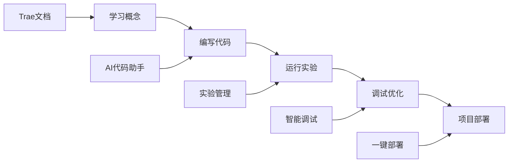
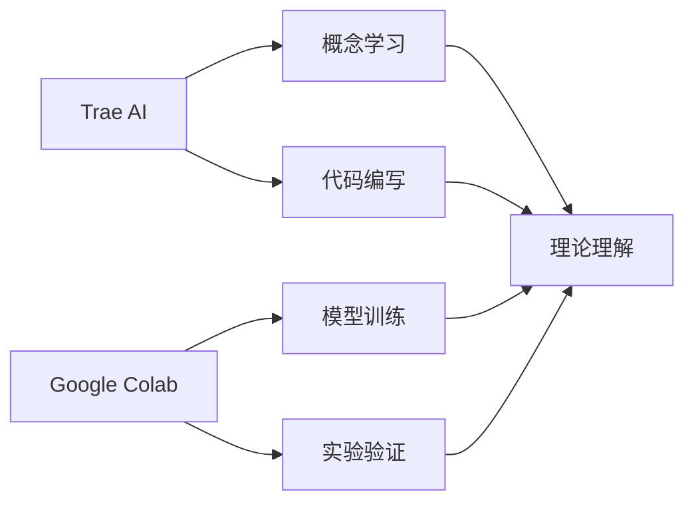
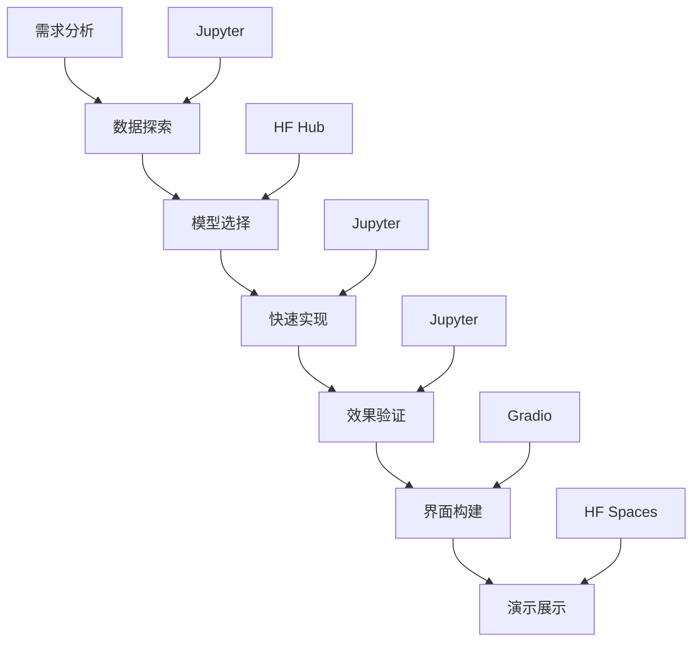
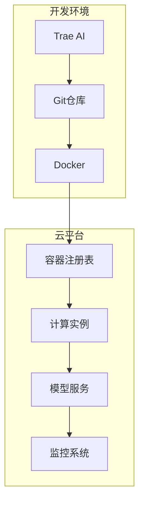
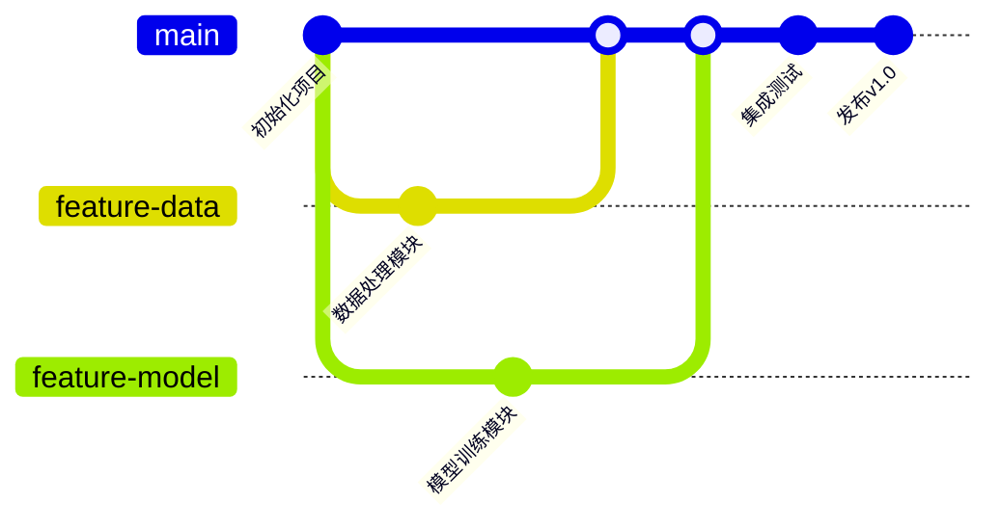
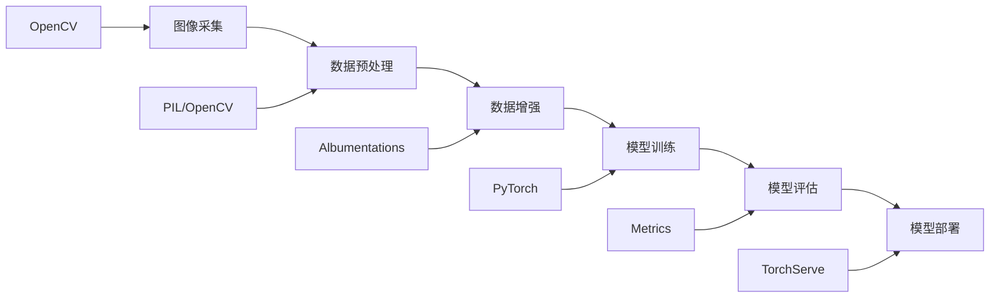
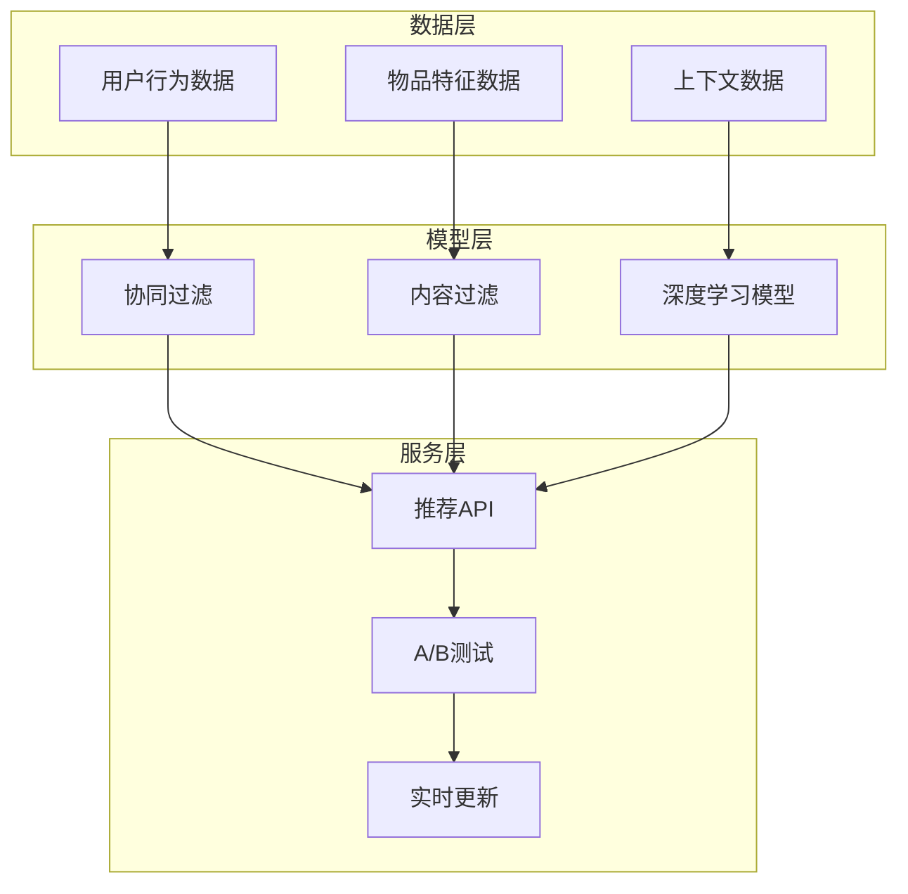
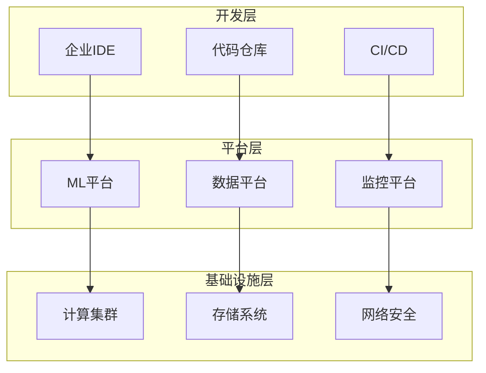

# 0.2 AI开发工具生态概览

## 0.2.1 现代AI开发工具分类

在开始AI开发之前，了解整个工具生态系统是非常重要的。现代AI开发涉及多个环节，每个环节都有相应的工具支持。让我们来系统地了解这些工具。

### 🖥️ 开发环境类工具

开发环境是我们日常编码的主要工作场所，选择合适的开发环境能够显著提升开发效率。

#### Trae AI - 本教程主要工具

**核心特点**：
- **AI原生设计**：专为AI开发优化的界面和功能
- **智能代码助手**：基于上下文的代码生成和补全
- **集成开发体验**：内置模型训练、调试、部署功能
- **现代化工作流**：支持Git、Docker、云服务集成

**适用场景**：
- AI项目的完整开发流程
- 团队协作和代码管理
- 模型训练和实验管理
- 生产环境部署

**在本教程中的作用**：


#### Cursor - AI辅助编程IDE

**核心特点**：
- 基于VSCode的AI增强版本
- 强大的代码生成和重构能力
- 支持多种编程语言
- 与GitHub Copilot深度集成

**适用场景**：
- 传统软件开发转AI开发
- 需要强大代码编辑功能的项目
- 多语言混合开发

#### GitHub Copilot - 代码生成助手

**核心特点**：
- 基于大量开源代码训练
- 实时代码建议和补全
- 支持多种编程语言和框架
- 与主流IDE集成

**使用技巧**：
```python
# 通过注释描述需求，Copilot会生成相应代码
# 创建一个简单的线性回归模型
# TODO: 导入必要的库
import numpy as np
from sklearn.linear_model import LinearRegression
from sklearn.model_selection import train_test_split

# TODO: 创建训练数据
# Copilot会根据上下文生成合适的代码
```

#### Replit - 云端协作开发环境

**核心特点**：
- 无需本地安装，浏览器直接使用
- 支持实时协作编程
- 内置多种编程语言环境
- 一键分享和部署

**适用场景**：
- 快速原型开发
- 教学和学习
- 团队协作项目
- 无本地环境限制的开发

### 🤖 机器学习平台

机器学习平台提供了模型、数据集、计算资源等核心要素，是AI开发的重要基础设施。

#### Hugging Face - 模型和数据集中心

**核心功能**：
- **模型库**：超过100,000个预训练模型
- **数据集库**：丰富的开源数据集
- **Spaces**：模型演示和应用托管
- **Transformers库**：易用的模型接口

**使用示例**：
```python
# 使用Hugging Face加载预训练模型
from transformers import pipeline

# 文本分类
classifier = pipeline("sentiment-analysis")
result = classifier("I love this tutorial!")
print(result)  # [{'label': 'POSITIVE', 'score': 0.9998}]

# 文本生成
generator = pipeline("text-generation", model="gpt2")
text = generator("The future of AI is", max_length=50)
print(text)
```

**在本教程中的应用**：
- 第2章：了解模型发展历程
- 第3章：使用预训练模型
- 第4章：模型微调和部署
- 第5章：构建完整应用

#### Google Colab - 免费GPU环境

**核心优势**：
- 免费提供GPU和TPU资源
- 预装常用机器学习库
- 与Google Drive集成
- 支持Jupyter Notebook格式

**使用场景**：
- 模型训练和实验
- 教学演示
- 快速原型验证
- 资源受限的个人项目

**配置示例**：
```python
# 检查GPU可用性
import torch
print(f"CUDA available: {torch.cuda.is_available()}")
print(f"GPU count: {torch.cuda.device_count()}")

# 安装额外依赖
!pip install transformers datasets

# 挂载Google Drive
from google.colab import drive
drive.mount('/content/drive')
```

#### Kaggle - 竞赛和学习平台

**核心功能**：
- 数据科学竞赛
- 免费数据集和代码
- 学习课程和认证
- 社区讨论和分享

**学习价值**：
- 接触真实业务问题
- 学习最佳实践方法
- 与全球开发者交流
- 建立个人作品集

#### Papers with Code - 学术资源平台

**核心功能**：
- 论文与代码对应
- 性能基准测试
- 数据集和评估指标
- 研究趋势分析

**使用方法**：
- 跟踪最新研究进展
- 复现论文实验
- 对比不同方法性能
- 寻找研究灵感

### 🌐 模型服务平台

模型服务平台提供了现成的AI能力，通过API调用即可使用，大大降低了AI应用的开发门槛。

#### OpenAI API - GPT系列模型服务

**主要模型**：
- **GPT-4**：最强大的文本生成模型
- **GPT-3.5-turbo**：性价比最高的对话模型
- **DALL-E 3**：文本到图像生成
- **Whisper**：语音识别模型

**使用示例**：
```python
import openai

# 配置API密钥
openai.api_key = "your-api-key"

# 文本生成
response = openai.ChatCompletion.create(
    model="gpt-3.5-turbo",
    messages=[
        {"role": "user", "content": "解释什么是机器学习"}
    ]
)

print(response.choices[0].message.content)
```

**定价考虑**：
- 按token计费，需要控制成本
- 不同模型价格差异较大
- 可以通过缓存和优化减少调用

#### Anthropic Claude - 对话AI服务

**核心特点**：
- 注重AI安全和对齐
- 长上下文处理能力
- 高质量的推理能力
- 较好的中文支持

**适用场景**：
- 复杂推理任务
- 长文档分析
- 安全敏感应用
- 教育和研究

#### Google Vertex AI - 企业级AI平台

**核心功能**：
- 统一的ML平台
- 预训练模型API
- 自定义模型训练
- MLOps工具链

**企业优势**：
- 数据安全和隐私保护
- 可扩展的计算资源
- 完整的监控和管理
- 与Google Cloud深度集成

#### AWS SageMaker - 云端ML平台

**核心功能**：
- 端到端ML工作流
- 托管的Jupyter环境
- 自动模型调优
- 一键模型部署

**适用场景**：
- 企业级ML项目
- 大规模数据处理
- 生产环境部署
- 多团队协作

### 🔧 开源框架

开源框架是AI开发的基础工具，提供了算法实现、模型训练、数据处理等核心功能。

#### PyTorch - 深度学习框架

**核心特点**：
- 动态计算图，调试友好
- 强大的GPU加速支持
- 丰富的预训练模型
- 活跃的社区生态

**学习路径**：
```python
# 基础张量操作
import torch

# 创建张量
x = torch.randn(3, 4)
y = torch.randn(4, 5)
z = torch.mm(x, y)  # 矩阵乘法

# 自动梯度计算
x = torch.randn(3, 4, requires_grad=True)
y = x.sum()
y.backward()  # 计算梯度
print(x.grad)  # 查看梯度
```

**在本教程中的应用**：
- 第1章：实现基础神经网络
- 第3章：构建Transformer模型
- 第4章：模型训练和优化
- 第5章：生产环境部署

#### TensorFlow - Google深度学习框架

**核心特点**：
- 静态计算图，部署优化
- TensorBoard可视化工具
- TensorFlow Serving部署
- 移动端和边缘设备支持

**使用场景**：
- 生产环境部署
- 移动应用开发
- 大规模分布式训练
- 研究和实验

#### Transformers - 预训练模型库

**核心功能**：
- 统一的模型接口
- 丰富的预训练模型
- 简单的微调流程
- 多框架支持

**使用示例**：
```python
from transformers import AutoTokenizer, AutoModel

# 加载模型和分词器
tokenizer = AutoTokenizer.from_pretrained("bert-base-chinese")
model = AutoModel.from_pretrained("bert-base-chinese")

# 文本编码
inputs = tokenizer("你好，世界！", return_tensors="pt")
outputs = model(**inputs)

# 获取文本表示
last_hidden_states = outputs.last_hidden_state
print(last_hidden_states.shape)
```

#### LangChain - LLM应用开发框架

**核心概念**：
- **Chains**：组合多个组件的工作流
- **Agents**：能够使用工具的智能体
- **Memory**：对话历史管理
- **Retrievers**：信息检索组件

**应用示例**：
```python
from langchain.llms import OpenAI
from langchain.chains import LLMChain
from langchain.prompts import PromptTemplate

# 创建提示模板
template = "请为{product}写一个创意广告语"
prompt = PromptTemplate(template=template, input_variables=["product"])

# 创建链
llm = OpenAI(temperature=0.7)
chain = LLMChain(llm=llm, prompt=prompt)

# 执行
result = chain.run(product="智能手机")
print(result)
```

## 0.2.2 工具选择指南

选择合适的工具是成功完成AI项目的关键。不同的项目阶段、项目类型和资源条件需要不同的工具组合。

### 📊 开发阶段工具选择

#### 学习阶段：Trae + Google Colab

**推荐组合**：


**选择理由**：
- **Trae**：提供完整的学习环境和AI助手
- **Colab**：免费GPU资源，适合实验
- **成本低**：基本免费使用
- **学习友好**：降低环境配置复杂度

**配置建议**：
```python
# Colab环境配置
# 1. 检查运行时类型
runtime_type = "GPU" if torch.cuda.is_available() else "CPU"
print(f"当前运行时: {runtime_type}")

# 2. 安装必要库
!pip install transformers datasets accelerate

# 3. 设置中文字体（用于可视化）
!apt-get install fonts-noto-cjk
import matplotlib.pyplot as plt
plt.rcParams['font.sans-serif'] = ['Noto Sans CJK JP']
```

#### 原型开发：Jupyter + Hugging Face

**推荐组合**：
- **Jupyter Notebook**：交互式开发和实验
- **Hugging Face Hub**：模型和数据集资源
- **Gradio**：快速构建演示界面
- **Git**：版本控制和协作

**工作流程**：


#### 生产开发：Trae + 云平台

**推荐组合**：
- **Trae AI**：主要开发环境
- **Docker**：容器化部署
- **云平台**：AWS/GCP/Azure
- **监控工具**：MLflow/Weights & Biases

**架构设计**：


#### 团队协作：GitHub + 云端IDE

**协作工具栈**：
- **GitHub**：代码托管和项目管理
- **GitHub Actions**：CI/CD自动化
- **云端IDE**：统一开发环境
- **项目管理**：Issues、Projects、Wiki

**协作流程**：


### 🎯 项目类型工具选择

#### NLP项目：Transformers + LangChain

**核心工具栈**：
```python
# 基础NLP工具
from transformers import (
    AutoTokenizer, AutoModel, 
    pipeline, Trainer
)

# LLM应用框架
from langchain import (
    LLMChain, PromptTemplate,
    VectorStore, Retriever
)

# 数据处理
from datasets import Dataset
import pandas as pd

# 可视化和部署
import gradio as gr
import streamlit as st
```

**典型项目结构**：
```
nlp_project/
├── data/
│   ├── raw/          # 原始数据
│   ├── processed/    # 处理后数据
│   └── embeddings/   # 向量数据
├── models/
│   ├── pretrained/   # 预训练模型
│   ├── finetuned/    # 微调模型
│   └── custom/       # 自定义模型
├── src/
│   ├── data_processing.py
│   ├── model_training.py
│   ├── inference.py
│   └── evaluation.py
├── notebooks/        # 实验笔记
├── app/             # 应用界面
└── deployment/      # 部署配置
```

#### 计算机视觉：PyTorch + OpenCV

**核心工具栈**：
```python
# 深度学习框架
import torch
import torchvision
from torch import nn, optim

# 图像处理
import cv2
import PIL
from albumentations import Compose, Resize, Normalize

# 预训练模型
import timm  # PyTorch Image Models
from torchvision.models import resnet50, efficientnet_b0

# 可视化
import matplotlib.pyplot as plt
import seaborn as sns
```

**项目工作流**：


#### 推荐系统：TensorFlow + MLflow

**核心工具栈**：
```python
# 机器学习框架
import tensorflow as tf
from tensorflow import keras

# 推荐系统库
import tensorflow_recommenders as tfrs
from implicit import als, bpr

# 实验管理
import mlflow
import mlflow.tensorflow

# 数据处理
import pandas as pd
import numpy as np
from scipy.sparse import csr_matrix
```

**系统架构**：


#### 多模态应用：Hugging Face + Gradio

**核心工具栈**：
```python
# 多模态模型
from transformers import (
    CLIPProcessor, CLIPModel,
    BlipProcessor, BlipForConditionalGeneration
)

# 图像处理
from PIL import Image
import torch

# 应用界面
import gradio as gr

# 音频处理
import librosa
from transformers import Wav2Vec2Processor, Wav2Vec2ForCTC
```

**应用示例**：
```python
def multimodal_app():
    # 图像描述生成
    def image_to_text(image):
        inputs = processor(image, return_tensors="pt")
        out = model.generate(**inputs, max_length=50)
        return tokenizer.decode(out[0], skip_special_tokens=True)
    
    # 文本到图像搜索
    def text_to_image_search(text, image_database):
        text_features = model.encode_text(text)
        similarities = cosine_similarity(text_features, image_features)
        return top_k_images(similarities)
    
    # Gradio界面
    interface = gr.Interface(
        fn=[image_to_text, text_to_image_search],
        inputs=["image", "text"],
        outputs=["text", "gallery"]
    )
    
    return interface
```

### 💰 资源预算考虑

#### 免费方案：Colab + Hugging Face

**资源配置**：
- **计算资源**：Google Colab免费GPU（每日限额）
- **存储资源**：Google Drive（15GB免费）
- **模型资源**：Hugging Face免费模型
- **部署资源**：Hugging Face Spaces免费托管

**适用项目**：
- 学习和实验项目
- 小规模数据集
- 原型验证
- 个人作品集

**成本控制**：
```python
# 优化GPU使用
def optimize_gpu_usage():
    # 1. 及时清理显存
    torch.cuda.empty_cache()
    
    # 2. 使用混合精度训练
    from torch.cuda.amp import autocast, GradScaler
    scaler = GradScaler()
    
    # 3. 批量大小优化
    batch_size = 16 if torch.cuda.is_available() else 4
    
    # 4. 模型检查点保存
    if epoch % 5 == 0:
        torch.save(model.state_dict(), f'checkpoint_{epoch}.pt')
```

#### 个人开发：Trae + 个人GPU

**硬件投资**：
- **GPU**：RTX 3060/4060（入门级）或RTX 3080/4080（进阶级）
- **内存**：32GB RAM（推荐）
- **存储**：1TB NVMe SSD

**软件配置**：
```bash
# CUDA环境配置
cuda-toolkit-11.8
cudnn-8.6

# Python环境
python 3.9+
pytorch 2.0+
transformers 4.20+

# 开发工具
trae-ai
docker
git
```

**成本效益分析**：
- **初期投资**：$1000-3000
- **运行成本**：电费 + 网络费用
- **使用期限**：3-5年
- **性能优势**：无使用限制，完全控制

#### 小团队：云端GPU + 协作工具

**云服务选择**：
- **AWS EC2 P3/P4实例**：按需付费
- **Google Cloud GPU实例**：抢占式实例优惠
- **Azure ML**：托管服务
- **Lambda Labs**：专业GPU云服务

**成本优化策略**：
```python
# 自动化资源管理
def auto_scaling_strategy():
    # 1. 训练时启动GPU实例
    if training_mode:
        instance = start_gpu_instance()
    
    # 2. 推理时使用CPU实例
    elif inference_mode:
        instance = start_cpu_instance()
    
    # 3. 空闲时自动关闭
    schedule_auto_shutdown(idle_time=30)  # 30分钟无活动自动关闭
    
    # 4. 使用Spot实例
    use_spot_instances = True  # 节省60-90%成本
```

#### 企业级：私有云 + 企业工具

**基础设施**：
- **私有云平台**：OpenStack/VMware
- **容器编排**：Kubernetes
- **存储系统**：分布式文件系统
- **网络安全**：VPN + 防火墙

**企业工具栈**：


**ROI考虑**：
- **初期投资**：$100K - $1M+
- **运维成本**：人力 + 硬件维护
- **安全合规**：数据安全 + 行业合规
- **长期收益**：技术积累 + 业务价值

---

**下一节**：[0.3 Trae环境安装和配置](0.3_trae_setup.md)

**本节总结**：
- 了解了AI开发工具的完整生态系统
- 学会了根据不同场景选择合适的工具组合
- 掌握了资源预算和成本控制的方法
- 为后续的实践学习做好了工具准备

**检查清单**：
- [ ] 了解各类AI开发工具的特点和用途
- [ ] 根据自己的情况选择合适的工具组合
- [ ] 评估项目的资源需求和预算
- [ ] 准备开始安装和配置开发环境