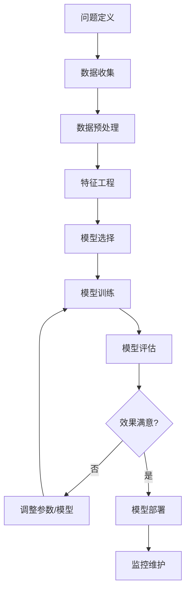

# 1.1.1 什么是机器学习

## 学习目标
理解机器学习的本质和应用场景，建立对机器学习的基本认知。

## 传统编程 vs 机器学习

### 传统编程方式
在传统编程中，我们需要明确告诉计算机每一步该做什么：

```python
# 传统编程：判断邮件是否为垃圾邮件
def is_spam_email(email_content):
    spam_keywords = ['中奖', '免费', '点击领取', '限时优惠']
    for keyword in spam_keywords:
        if keyword in email_content:
            return True
    return False
```

**问题**：
- 规则需要人工制定，难以覆盖所有情况
- 垃圾邮件发送者会不断变换策略，规则需要频繁更新
- 对于复杂问题（如图像识别），几乎无法用规则描述

### 机器学习方式
机器学习让计算机从数据中自动学习规律：

```python
# 机器学习：从历史邮件数据中学习模式
from sklearn.naive_bayes import MultinomialNB
from sklearn.feature_extraction.text import TfidfVectorizer

# 训练数据：历史邮件及其标签
training_emails = [
    ("恭喜您中奖100万，点击领取", "垃圾邮件"),
    ("明天开会讨论项目进度", "正常邮件"),
    # ... 更多训练数据
]

# 机器学习模型自动学习规律
model = MultinomialNB()
# 训练过程...

# 对新邮件进行预测
new_email = "您有一份神秘大奖等待领取"
prediction = model.predict([new_email])  # 自动判断
```

## 机器学习的定义

> **机器学习**是一种让计算机系统能够从数据中自动学习和改进的方法，无需进行明确的编程指令。

**核心思想**：
- **数据驱动**：从大量数据中发现规律
- **自动学习**：算法自动调整参数
- **泛化能力**：对未见过的数据也能做出合理预测

## 日常生活中的机器学习应用

### 1. 推荐系统
**场景**：淘宝、抖音、网易云音乐的个性化推荐

**工作原理**：
- 收集用户行为数据（浏览、购买、点赞、收藏）
- 分析用户偏好模式
- 推荐相似用户喜欢的商品/内容

**示例**：
```
用户A：喜欢运动鞋、篮球、健身器材
用户B：喜欢运动鞋、篮球、蛋白粉
系统推荐：向用户A推荐蛋白粉，向用户B推荐健身器材
```

### 2. 语音识别
**场景**：Siri、小爱同学、语音输入法

**工作原理**：
- 将声音波形转换为数字信号
- 识别语音中的音素和词汇
- 理解语义并执行相应操作

**技术演进**：
```
早期：基于规则的语音识别（准确率低）
↓
现在：深度学习语音识别（准确率95%+）
```

### 3. 图像识别
**场景**：手机人脸解锁、拍照识物、医学影像诊断

**工作原理**：
- 提取图像特征（边缘、纹理、形状）
- 学习不同类别的特征模式
- 对新图像进行分类或检测

**实际应用**：
- **人脸解锁**：识别面部特征，验证身份
- **拍照识物**：识别花草、动物、商品等
- **医学诊断**：检测X光片中的病变区域

### 4. 智能翻译
**场景**：Google翻译、百度翻译、DeepL

**技术发展**：
```
统计机器翻译 → 神经网络翻译 → Transformer翻译
准确率不断提升，接近人类水平
```

## 机器学习解决问题的基本流程



### 详细步骤说明

1. **问题定义**：明确要解决什么问题（分类、回归、聚类等）
2. **数据收集**：获取相关的训练数据
3. **数据预处理**：清洗数据，处理缺失值和异常值
4. **特征工程**：选择和构造有用的特征
5. **模型选择**：选择合适的机器学习算法
6. **模型训练**：用训练数据训练模型
7. **模型评估**：用测试数据评估模型性能
8. **参数调优**：优化模型参数提升性能
9. **模型部署**：将模型应用到实际业务中
10. **监控维护**：持续监控模型性能，必要时重新训练

## Trae实践：创建第一个机器学习项目

### 环境准备
```python
# 在Trae中创建新的Python项目
# 安装必要的机器学习库
import numpy as np
import pandas as pd
import matplotlib.pyplot as plt
from sklearn.model_selection import train_test_split
from sklearn.linear_model import LinearRegression
from sklearn.metrics import mean_squared_error

print("机器学习环境准备完成！")
```

### 简单示例：房价预测
```python
# 生成模拟房价数据
np.random.seed(42)
n_samples = 100

# 特征：房屋面积（平方米）
area = np.random.normal(100, 30, n_samples)
area = np.clip(area, 50, 200)  # 限制在合理范围内

# 目标：房价（万元），假设每平米1万元 + 噪声
price = area * 1.0 + np.random.normal(0, 10, n_samples)

# 创建数据框
data = pd.DataFrame({
    'area': area,
    'price': price
})

print("数据样本：")
print(data.head())
```

### 可视化数据
```python
# 绘制散点图
plt.figure(figsize=(10, 6))
plt.scatter(data['area'], data['price'], alpha=0.6)
plt.xlabel('房屋面积 (平方米)')
plt.ylabel('房价 (万元)')
plt.title('房屋面积与房价关系')
plt.grid(True, alpha=0.3)
plt.show()
```

### 训练机器学习模型
```python
# 准备数据
X = data[['area']]  # 特征
y = data['price']   # 目标

# 划分训练集和测试集
X_train, X_test, y_train, y_test = train_test_split(
    X, y, test_size=0.2, random_state=42
)

# 创建并训练模型
model = LinearRegression()
model.fit(X_train, y_train)

# 进行预测
y_pred = model.predict(X_test)

# 评估模型
mse = mean_squared_error(y_test, y_pred)
print(f"模型预测误差 (MSE): {mse:.2f}")
print(f"学到的规律: 房价 = {model.coef_[0]:.2f} × 面积 + {model.intercept_:.2f}")
```

## 小结

机器学习是一种让计算机从数据中自动学习规律的技术，它已经深入到我们生活的方方面面。与传统编程相比，机器学习具有以下优势：

- **自适应性**：能够适应数据的变化
- **泛化能力**：对未见过的数据也能做出合理预测
- **处理复杂问题**：能够解决难以用规则描述的复杂问题

在接下来的学习中，我们将深入了解不同类型的机器学习方法，并学会如何在Trae中实现它们。

## 思考题

1. 你能想到生活中还有哪些机器学习的应用场景？
2. 对于垃圾邮件检测问题，机器学习方法相比传统规则方法有什么优势？
3. 如果要预测明天的天气，你觉得需要哪些数据作为输入特征？

---

**下一节预告**：我们将学习机器学习的三种主要类型：监督学习、无监督学习和强化学习。