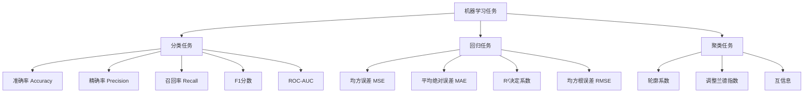
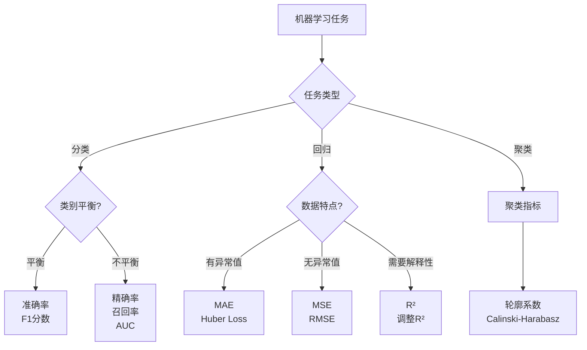

# 1.1.5 评估指标

## 学习目标
掌握机器学习中常用的评估指标，学会根据不同任务选择合适的评估方法。

## 引言：如何衡量模型的好坏？

想象你是一位老师，需要评估学生的学习效果：

- **准确率**：答对题目的比例
- **精确率**：说是对的题目中真正对的比例
- **召回率**：所有对的题目中被找出来的比例
- **F1分数**：精确率和召回率的平衡

机器学习模型的评估也是如此，不同的任务需要不同的评估标准。

## 评估指标概览



## 分类任务评估指标

### 混淆矩阵 (Confusion Matrix)

混淆矩阵是理解分类指标的基础：

```python
import numpy as np
import matplotlib.pyplot as plt
from sklearn.metrics import confusion_matrix, classification_report
from sklearn.model_selection import train_test_split
from sklearn.ensemble import RandomForestClassifier
from sklearn.datasets import make_classification
import seaborn as sns

# 生成示例数据
X, y = make_classification(n_samples=1000, n_features=20, n_classes=2, 
                          n_redundant=0, n_informative=15, random_state=42)
X_train, X_test, y_train, y_test = train_test_split(X, y, test_size=0.3, random_state=42)

# 训练模型
model = RandomForestClassifier(random_state=42)
model.fit(X_train, y_train)
y_pred = model.predict(X_test)

# 计算混淆矩阵
cm = confusion_matrix(y_test, y_pred)

# 可视化混淆矩阵
plt.figure(figsize=(8, 6))
sns.heatmap(cm, annot=True, fmt='d', cmap='Blues', 
            xticklabels=['预测负类', '预测正类'],
            yticklabels=['实际负类', '实际正类'])
plt.title('混淆矩阵')
plt.ylabel('实际类别')
plt.xlabel('预测类别')

# 添加标注
tn, fp, fn, tp = cm.ravel()
plt.text(0.5, -0.1, f'TN={tn}', ha='center', transform=plt.gca().transAxes)
plt.text(1.5, -0.1, f'FP={fp}', ha='center', transform=plt.gca().transAxes)
plt.text(0.5, 1.1, f'FN={fn}', ha='center', transform=plt.gca().transAxes)
plt.text(1.5, 1.1, f'TP={tp}', ha='center', transform=plt.gca().transAxes)

plt.show()

print("混淆矩阵解释:")
print(f"真负例 (TN): {tn} - 正确预测为负类")
print(f"假正例 (FP): {fp} - 错误预测为正类")
print(f"假负例 (FN): {fn} - 错误预测为负类")
print(f"真正例 (TP): {tp} - 正确预测为正类")
```

### 基本分类指标

#### 1. 准确率 (Accuracy)

**定义**：正确预测的样本数占总样本数的比例

**公式**：Accuracy = (TP + TN) / (TP + TN + FP + FN)

```python
from sklearn.metrics import accuracy_score

# 计算准确率
accuracy = accuracy_score(y_test, y_pred)
print(f"准确率: {accuracy:.3f}")

# 手动计算验证
manual_accuracy = (tp + tn) / (tp + tn + fp + fn)
print(f"手动计算准确率: {manual_accuracy:.3f}")

# 准确率的优缺点
print("\n准确率的特点:")
print("优点: 直观易懂，计算简单")
print("缺点: 在类别不平衡时可能误导")

# 类别不平衡示例
print("\n类别不平衡示例:")
print("假设1000个样本中，990个负类，10个正类")
print("如果模型总是预测负类:")
print(f"准确率 = 990/1000 = 99%")
print("但模型完全没有识别出正类！")
```

#### 2. 精确率 (Precision)

**定义**：在所有预测为正类的样本中，真正为正类的比例

**公式**：Precision = TP / (TP + FP)

```python
from sklearn.metrics import precision_score

# 计算精确率
precision = precision_score(y_test, y_pred)
print(f"精确率: {precision:.3f}")

# 手动计算验证
manual_precision = tp / (tp + fp) if (tp + fp) > 0 else 0
print(f"手动计算精确率: {manual_precision:.3f}")

print("\n精确率的含义:")
print("- 在所有'我说是正类'的预测中，有多少真的是正类")
print("- 衡量模型预测正类的可靠性")
print("- 关注点：避免假正例")

# 实际应用场景
print("\n适用场景:")
print("- 垃圾邮件检测：避免正常邮件被误判为垃圾邮件")
print("- 医学诊断：避免健康人被误诊为患病")
print("- 推荐系统：避免推荐用户不感兴趣的内容")
```

#### 3. 召回率 (Recall)

**定义**：在所有真正为正类的样本中，被正确预测为正类的比例

**公式**：Recall = TP / (TP + FN)

```python
from sklearn.metrics import recall_score

# 计算召回率
recall = recall_score(y_test, y_pred)
print(f"召回率: {recall:.3f}")

# 手动计算验证
manual_recall = tp / (tp + fn) if (tp + fn) > 0 else 0
print(f"手动计算召回率: {manual_recall:.3f}")

print("\n召回率的含义:")
print("- 在所有'真正是正类'的样本中，有多少被我找出来了")
print("- 衡量模型发现正类的能力")
print("- 关注点：避免假负例")

# 实际应用场景
print("\n适用场景:")
print("- 疾病筛查：不能漏掉任何患病的人")
print("- 欺诈检测：不能漏掉任何欺诈行为")
print("- 搜索引擎：不能漏掉相关的网页")
```

#### 4. F1分数 (F1-Score)

**定义**：精确率和召回率的调和平均数

**公式**：F1 = 2 × (Precision × Recall) / (Precision + Recall)

```python
from sklearn.metrics import f1_score

# 计算F1分数
f1 = f1_score(y_test, y_pred)
print(f"F1分数: {f1:.3f}")

# 手动计算验证
manual_f1 = 2 * (precision * recall) / (precision + recall) if (precision + recall) > 0 else 0
print(f"手动计算F1分数: {manual_f1:.3f}")

print("\nF1分数的特点:")
print("- 平衡考虑精确率和召回率")
print("- 当精确率和召回率都重要时使用")
print("- 值域: [0, 1]，越高越好")

# 精确率-召回率权衡可视化
def plot_precision_recall_tradeoff():
    """可视化精确率-召回率权衡"""
    from sklearn.metrics import precision_recall_curve
    
    # 获取预测概率
    y_proba = model.predict_proba(X_test)[:, 1]
    
    # 计算精确率-召回率曲线
    precisions, recalls, thresholds = precision_recall_curve(y_test, y_proba)
    
    plt.figure(figsize=(12, 4))
    
    # 精确率-召回率曲线
    plt.subplot(1, 2, 1)
    plt.plot(recalls, precisions, linewidth=2)
    plt.xlabel('召回率')
    plt.ylabel('精确率')
    plt.title('精确率-召回率曲线')
    plt.grid(True, alpha=0.3)
    
    # 阈值对精确率和召回率的影响
    plt.subplot(1, 2, 2)
    plt.plot(thresholds, precisions[:-1], label='精确率', linewidth=2)
    plt.plot(thresholds, recalls[:-1], label='召回率', linewidth=2)
    plt.xlabel('分类阈值')
    plt.ylabel('分数')
    plt.title('阈值对精确率和召回率的影响')
    plt.legend()
    plt.grid(True, alpha=0.3)
    
    plt.tight_layout()
    plt.show()

plot_precision_recall_tradeoff()
```

### 多类分类指标

```python
# 生成多类分类数据
X_multi, y_multi = make_classification(n_samples=1000, n_features=20, n_classes=3, 
                                      n_redundant=0, n_informative=15, random_state=42)
X_train_multi, X_test_multi, y_train_multi, y_test_multi = train_test_split(
    X_multi, y_multi, test_size=0.3, random_state=42)

# 训练多类分类模型
model_multi = RandomForestClassifier(random_state=42)
model_multi.fit(X_train_multi, y_train_multi)
y_pred_multi = model_multi.predict(X_test_multi)

# 多类混淆矩阵
cm_multi = confusion_matrix(y_test_multi, y_pred_multi)

plt.figure(figsize=(8, 6))
sns.heatmap(cm_multi, annot=True, fmt='d', cmap='Blues',
            xticklabels=[f'预测类{i}' for i in range(3)],
            yticklabels=[f'实际类{i}' for i in range(3)])
plt.title('多类分类混淆矩阵')
plt.show()

# 多类分类报告
print("多类分类详细报告:")
print(classification_report(y_test_multi, y_pred_multi, 
                          target_names=[f'类别{i}' for i in range(3)]))

# 不同平均方式的解释
print("\n不同平均方式:")
print(f"宏平均 (Macro): {f1_score(y_test_multi, y_pred_multi, average='macro'):.3f}")
print(f"微平均 (Micro): {f1_score(y_test_multi, y_pred_multi, average='micro'):.3f}")
print(f"加权平均 (Weighted): {f1_score(y_test_multi, y_pred_multi, average='weighted'):.3f}")

print("\n平均方式说明:")
print("- 宏平均: 每个类别权重相等，适合类别平衡的情况")
print("- 微平均: 每个样本权重相等，适合关注整体性能")
print("- 加权平均: 按类别样本数加权，适合类别不平衡的情况")
```

### ROC曲线和AUC

**ROC (Receiver Operating Characteristic)** 曲线是评估二分类模型的重要工具：

```python
from sklearn.metrics import roc_curve, auc, roc_auc_score

# 计算ROC曲线
y_proba = model.predict_proba(X_test)[:, 1]
fpr, tpr, roc_thresholds = roc_curve(y_test, y_proba)
roc_auc = auc(fpr, tpr)

# 绘制ROC曲线
plt.figure(figsize=(10, 8))

# ROC曲线
plt.subplot(2, 2, 1)
plt.plot(fpr, tpr, color='darkorange', lw=2, label=f'ROC曲线 (AUC = {roc_auc:.3f})')
plt.plot([0, 1], [0, 1], color='navy', lw=2, linestyle='--', label='随机分类器')
plt.xlim([0.0, 1.0])
plt.ylim([0.0, 1.05])
plt.xlabel('假正例率 (FPR)')
plt.ylabel('真正例率 (TPR)')
plt.title('ROC曲线')
plt.legend(loc="lower right")
plt.grid(True, alpha=0.3)

# AUC值的含义
print(f"AUC值: {roc_auc:.3f}")
print("\nAUC值解释:")
print("- AUC = 1.0: 完美分类器")
print("- AUC = 0.5: 随机分类器")
print("- AUC < 0.5: 比随机还差（可能标签搞反了）")
print("- AUC > 0.8: 通常认为是好模型")

# 不同阈值下的性能
plt.subplot(2, 2, 2)
thresholds_range = np.linspace(0, 1, 100)
accuracies = []
precisions = []
recalls = []
f1_scores = []

for threshold in thresholds_range:
    y_pred_thresh = (y_proba >= threshold).astype(int)
    
    if len(np.unique(y_pred_thresh)) > 1:  # 避免只有一个类别的情况
        accuracies.append(accuracy_score(y_test, y_pred_thresh))
        precisions.append(precision_score(y_test, y_pred_thresh, zero_division=0))
        recalls.append(recall_score(y_test, y_pred_thresh, zero_division=0))
        f1_scores.append(f1_score(y_test, y_pred_thresh, zero_division=0))
    else:
        accuracies.append(0)
        precisions.append(0)
        recalls.append(0)
        f1_scores.append(0)

plt.plot(thresholds_range, accuracies, label='准确率', linewidth=2)
plt.plot(thresholds_range, precisions, label='精确率', linewidth=2)
plt.plot(thresholds_range, recalls, label='召回率', linewidth=2)
plt.plot(thresholds_range, f1_scores, label='F1分数', linewidth=2)
plt.xlabel('分类阈值')
plt.ylabel('性能指标')
plt.title('不同阈值下的性能表现')
plt.legend()
plt.grid(True, alpha=0.3)

# 最佳阈值选择
best_f1_idx = np.argmax(f1_scores)
best_threshold = thresholds_range[best_f1_idx]
best_f1 = f1_scores[best_f1_idx]

plt.axvline(x=best_threshold, color='red', linestyle='--', 
            label=f'最佳阈值: {best_threshold:.3f}')
plt.legend()

print(f"\n最佳F1阈值: {best_threshold:.3f}")
print(f"最佳F1分数: {best_f1:.3f}")

plt.tight_layout()
plt.show()
```

## 回归任务评估指标

### 基本回归指标

```python
from sklearn.datasets import make_regression
from sklearn.linear_model import LinearRegression
from sklearn.metrics import mean_squared_error, mean_absolute_error, r2_score

# 生成回归数据
X_reg, y_reg = make_regression(n_samples=1000, n_features=10, noise=10, random_state=42)
X_train_reg, X_test_reg, y_train_reg, y_test_reg = train_test_split(
    X_reg, y_reg, test_size=0.3, random_state=42)

# 训练回归模型
model_reg = LinearRegression()
model_reg.fit(X_train_reg, y_train_reg)
y_pred_reg = model_reg.predict(X_test_reg)

# 计算各种回归指标
mse = mean_squared_error(y_test_reg, y_pred_reg)
rmse = np.sqrt(mse)
mae = mean_absolute_error(y_test_reg, y_pred_reg)
r2 = r2_score(y_test_reg, y_pred_reg)

print("回归评估指标:")
print(f"均方误差 (MSE): {mse:.3f}")
print(f"均方根误差 (RMSE): {rmse:.3f}")
print(f"平均绝对误差 (MAE): {mae:.3f}")
print(f"R²决定系数: {r2:.3f}")
```

#### 1. 均方误差 (MSE)

**定义**：预测值与真实值差值平方的平均数

**公式**：MSE = (1/n) × Σ(y_true - y_pred)²

```python
# MSE的特点和应用
print("\n均方误差 (MSE) 特点:")
print("- 对大误差敏感（平方放大效应）")
print("- 单位是原始单位的平方")
print("- 值越小越好，最小值为0")
print("- 可微分，适合作为损失函数")

# 手动计算MSE
manual_mse = np.mean((y_test_reg - y_pred_reg) ** 2)
print(f"\n手动计算MSE: {manual_mse:.3f}")

# MSE对异常值的敏感性演示
y_test_with_outlier = y_test_reg.copy()
y_test_with_outlier[0] = y_test_with_outlier[0] + 1000  # 添加异常值

mse_normal = mean_squared_error(y_test_reg, y_pred_reg)
mse_with_outlier = mean_squared_error(y_test_with_outlier, y_pred_reg)

print(f"\n异常值影响:")
print(f"正常MSE: {mse_normal:.3f}")
print(f"有异常值MSE: {mse_with_outlier:.3f}")
print(f"影响倍数: {mse_with_outlier / mse_normal:.1f}x")
```

#### 2. 平均绝对误差 (MAE)

**定义**：预测值与真实值差值绝对值的平均数

**公式**：MAE = (1/n) × Σ|y_true - y_pred|

```python
print("\n平均绝对误差 (MAE) 特点:")
print("- 对异常值不敏感")
print("- 单位与原始单位相同")
print("- 值越小越好，最小值为0")
print("- 不可微分（在0点）")

# 手动计算MAE
manual_mae = np.mean(np.abs(y_test_reg - y_pred_reg))
print(f"\n手动计算MAE: {manual_mae:.3f}")

# MAE对异常值的鲁棒性演示
mae_normal = mean_absolute_error(y_test_reg, y_pred_reg)
mae_with_outlier = mean_absolute_error(y_test_with_outlier, y_pred_reg)

print(f"\n异常值影响:")
print(f"正常MAE: {mae_normal:.3f}")
print(f"有异常值MAE: {mae_with_outlier:.3f}")
print(f"影响倍数: {mae_with_outlier / mae_normal:.1f}x")
```

#### 3. R²决定系数

**定义**：模型解释的方差占总方差的比例

**公式**：R² = 1 - (SS_res / SS_tot)

```python
print("\nR²决定系数特点:")
print("- 值域通常在[0, 1]，但可能为负")
print("- R² = 1: 完美预测")
print("- R² = 0: 模型等同于预测均值")
print("- R² < 0: 模型比预测均值还差")
print("- 无单位，便于比较不同模型")

# 手动计算R²
ss_res = np.sum((y_test_reg - y_pred_reg) ** 2)  # 残差平方和
ss_tot = np.sum((y_test_reg - np.mean(y_test_reg)) ** 2)  # 总平方和
manual_r2 = 1 - (ss_res / ss_tot)

print(f"\n手动计算R²: {manual_r2:.3f}")
print(f"SS_res (残差平方和): {ss_res:.3f}")
print(f"SS_tot (总平方和): {ss_tot:.3f}")

# R²的直观理解
print(f"\n模型解释了 {r2*100:.1f}% 的数据方差")
```

### 回归指标可视化

```python
# 创建回归结果可视化
fig, axes = plt.subplots(2, 2, figsize=(15, 12))

# 真实值 vs 预测值散点图
axes[0, 0].scatter(y_test_reg, y_pred_reg, alpha=0.6)
axes[0, 0].plot([y_test_reg.min(), y_test_reg.max()], 
                [y_test_reg.min(), y_test_reg.max()], 'r--', lw=2)
axes[0, 0].set_xlabel('真实值')
axes[0, 0].set_ylabel('预测值')
axes[0, 0].set_title(f'真实值 vs 预测值\nR² = {r2:.3f}')
axes[0, 0].grid(True, alpha=0.3)

# 残差图
residuals = y_test_reg - y_pred_reg
axes[0, 1].scatter(y_pred_reg, residuals, alpha=0.6)
axes[0, 1].axhline(y=0, color='r', linestyle='--')
axes[0, 1].set_xlabel('预测值')
axes[0, 1].set_ylabel('残差')
axes[0, 1].set_title(f'残差图\nMAE = {mae:.3f}')
axes[0, 1].grid(True, alpha=0.3)

# 残差分布直方图
axes[1, 0].hist(residuals, bins=30, alpha=0.7, edgecolor='black')
axes[1, 0].axvline(x=0, color='r', linestyle='--')
axes[1, 0].set_xlabel('残差')
axes[1, 0].set_ylabel('频数')
axes[1, 0].set_title('残差分布')
axes[1, 0].grid(True, alpha=0.3)

# Q-Q图（检验残差正态性）
from scipy import stats
stats.probplot(residuals, dist="norm", plot=axes[1, 1])
axes[1, 1].set_title('Q-Q图（正态性检验）')
axes[1, 1].grid(True, alpha=0.3)

plt.tight_layout()
plt.show()

# 残差分析
print("\n残差分析:")
print(f"残差均值: {np.mean(residuals):.6f} (应接近0)")
print(f"残差标准差: {np.std(residuals):.3f}")
print(f"残差偏度: {stats.skew(residuals):.3f} (应接近0)")
print(f"残差峰度: {stats.kurtosis(residuals):.3f} (应接近0)")
```

### 自定义回归指标

```python
def mean_absolute_percentage_error(y_true, y_pred):
    """平均绝对百分比误差"""
    return np.mean(np.abs((y_true - y_pred) / y_true)) * 100

def symmetric_mean_absolute_percentage_error(y_true, y_pred):
    """对称平均绝对百分比误差"""
    return np.mean(2 * np.abs(y_true - y_pred) / (np.abs(y_true) + np.abs(y_pred))) * 100

def mean_squared_log_error(y_true, y_pred):
    """均方对数误差"""
    return np.mean((np.log1p(y_true) - np.log1p(y_pred)) ** 2)

# 计算自定义指标
mape = mean_absolute_percentage_error(y_test_reg, y_pred_reg)
smape = symmetric_mean_absolute_percentage_error(y_test_reg, y_pred_reg)

print("\n自定义回归指标:")
print(f"平均绝对百分比误差 (MAPE): {mape:.3f}%")
print(f"对称MAPE (SMAPE): {smape:.3f}%")

print("\n指标选择建议:")
print("- MSE/RMSE: 对大误差敏感，适合惩罚大偏差")
print("- MAE: 对异常值鲁棒，适合存在噪声的数据")
print("- R²: 无单位，便于模型比较")
print("- MAPE: 相对误差，适合不同量级的数据比较")
```

## 模型选择中的评估策略

### 交叉验证评估

```python
from sklearn.model_selection import cross_val_score, cross_validate
from sklearn.ensemble import RandomForestRegressor
from sklearn.linear_model import Ridge
from sklearn.svm import SVR

# 准备多个模型
models = {
    'Linear Regression': LinearRegression(),
    'Ridge Regression': Ridge(alpha=1.0),
    'Random Forest': RandomForestRegressor(n_estimators=100, random_state=42),
    'SVR': SVR(kernel='rbf')
}

# 定义评估指标
scoring = ['neg_mean_squared_error', 'neg_mean_absolute_error', 'r2']

print("交叉验证模型比较:")
print("-" * 80)
print(f"{'模型':<20} {'MSE':<12} {'MAE':<12} {'R²':<12}")
print("-" * 80)

results = {}
for name, model in models.items():
    # 5折交叉验证
    cv_results = cross_validate(model, X_reg, y_reg, cv=5, scoring=scoring, n_jobs=-1)
    
    # 计算均值和标准差
    mse_mean = -cv_results['test_neg_mean_squared_error'].mean()
    mse_std = cv_results['test_neg_mean_squared_error'].std()
    
    mae_mean = -cv_results['test_neg_mean_absolute_error'].mean()
    mae_std = cv_results['test_neg_mean_absolute_error'].std()
    
    r2_mean = cv_results['test_r2'].mean()
    r2_std = cv_results['test_r2'].std()
    
    results[name] = {
        'mse': (mse_mean, mse_std),
        'mae': (mae_mean, mae_std),
        'r2': (r2_mean, r2_std)
    }
    
    print(f"{name:<20} {mse_mean:<8.3f}±{mse_std:<3.3f} {mae_mean:<8.3f}±{mae_std:<3.3f} {r2_mean:<8.3f}±{r2_std:<3.3f}")

print("-" * 80)
```

### 学习曲线评估

```python
from sklearn.model_selection import learning_curve

def plot_learning_curve_with_metrics(model, X, y, title="学习曲线"):
    """绘制包含多个指标的学习曲线"""
    
    # 计算学习曲线
    train_sizes, train_scores, val_scores = learning_curve(
        model, X, y, cv=5, n_jobs=-1, 
        train_sizes=np.linspace(0.1, 1.0, 10),
        scoring='neg_mean_squared_error'
    )
    
    # 转换为正值
    train_scores = -train_scores
    val_scores = -val_scores
    
    # 计算均值和标准差
    train_mean = np.mean(train_scores, axis=1)
    train_std = np.std(train_scores, axis=1)
    val_mean = np.mean(val_scores, axis=1)
    val_std = np.std(val_scores, axis=1)
    
    # 绘制学习曲线
    plt.figure(figsize=(10, 6))
    plt.plot(train_sizes, train_mean, 'o-', color='blue', label='训练MSE')
    plt.fill_between(train_sizes, train_mean - train_std, train_mean + train_std, alpha=0.1, color='blue')
    
    plt.plot(train_sizes, val_mean, 'o-', color='red', label='验证MSE')
    plt.fill_between(train_sizes, val_mean - val_std, val_mean + val_std, alpha=0.1, color='red')
    
    plt.xlabel('训练集大小')
    plt.ylabel('均方误差')
    plt.title(title)
    plt.legend()
    plt.grid(True, alpha=0.3)
    plt.show()
    
    return train_sizes, train_mean, val_mean

# 为最佳模型绘制学习曲线
best_model = RandomForestRegressor(n_estimators=100, random_state=42)
train_sizes, train_mse, val_mse = plot_learning_curve_with_metrics(
    best_model, X_reg, y_reg, "随机森林学习曲线"
)
```

## 评估指标的选择指南

### 任务类型决策树



### 实际应用场景指南

```python
def choose_metric_guide():
    """评估指标选择指南"""
    
    scenarios = {
        "医疗诊断": {
            "任务": "分类",
            "关注点": "不能漏诊",
            "推荐指标": ["召回率", "敏感性"],
            "原因": "漏诊的代价远大于误诊"
        },
        "垃圾邮件检测": {
            "任务": "分类",
            "关注点": "不能误判正常邮件",
            "推荐指标": ["精确率", "特异性"],
            "原因": "误判正常邮件会影响用户体验"
        },
        "推荐系统": {
            "任务": "分类/排序",
            "关注点": "平衡精确率和召回率",
            "推荐指标": ["F1分数", "AUC", "MAP@K"],
            "原因": "既要推荐准确，又要覆盖用户兴趣"
        },
        "房价预测": {
            "任务": "回归",
            "关注点": "预测准确性",
            "推荐指标": ["RMSE", "MAPE"],
            "原因": "RMSE惩罚大误差，MAPE提供相对误差"
        },
        "股价预测": {
            "任务": "回归",
            "关注点": "方向性和幅度",
            "推荐指标": ["方向准确率", "夏普比率"],
            "原因": "金融数据更关注趋势和风险调整收益"
        },
        "异常检测": {
            "任务": "分类",
            "关注点": "发现所有异常",
            "推荐指标": ["召回率", "F1分数"],
            "原因": "异常样本稀少，不能遗漏"
        }
    }
    
    print("评估指标选择指南")
    print("=" * 80)
    
    for scenario, info in scenarios.items():
        print(f"\n场景: {scenario}")
        print(f"任务类型: {info['任务']}")
        print(f"关注点: {info['关注点']}")
        print(f"推荐指标: {', '.join(info['推荐指标'])}")
        print(f"原因: {info['原因']}")
        print("-" * 50)

choose_metric_guide()
```

### 指标组合策略

```python
class MetricSuite:
    """评估指标套件"""
    
    def __init__(self, task_type='classification'):
        self.task_type = task_type
        self.metrics = {}
    
    def evaluate_classification(self, y_true, y_pred, y_proba=None):
        """分类任务评估"""
        from sklearn.metrics import (
            accuracy_score, precision_score, recall_score, f1_score,
            roc_auc_score, classification_report
        )
        
        self.metrics['accuracy'] = accuracy_score(y_true, y_pred)
        self.metrics['precision'] = precision_score(y_true, y_pred, average='weighted')
        self.metrics['recall'] = recall_score(y_true, y_pred, average='weighted')
        self.metrics['f1'] = f1_score(y_true, y_pred, average='weighted')
        
        if y_proba is not None:
            if len(np.unique(y_true)) == 2:  # 二分类
                self.metrics['auc'] = roc_auc_score(y_true, y_proba[:, 1])
            else:  # 多分类
                self.metrics['auc'] = roc_auc_score(y_true, y_proba, multi_class='ovr')
        
        return self.metrics
    
    def evaluate_regression(self, y_true, y_pred):
        """回归任务评估"""
        from sklearn.metrics import mean_squared_error, mean_absolute_error, r2_score
        
        self.metrics['mse'] = mean_squared_error(y_true, y_pred)
        self.metrics['rmse'] = np.sqrt(self.metrics['mse'])
        self.metrics['mae'] = mean_absolute_error(y_true, y_pred)
        self.metrics['r2'] = r2_score(y_true, y_pred)
        
        # 自定义指标
        self.metrics['mape'] = mean_absolute_percentage_error(y_true, y_pred)
        
        return self.metrics
    
    def print_report(self):
        """打印评估报告"""
        print(f"\n{self.task_type.upper()} 评估报告")
        print("=" * 40)
        
        for metric, value in self.metrics.items():
            if metric in ['mape']:
                print(f"{metric.upper():<10}: {value:.3f}%")
            else:
                print(f"{metric.upper():<10}: {value:.3f}")
        
        # 给出建议
        if self.task_type == 'classification':
            if 'f1' in self.metrics:
                if self.metrics['f1'] > 0.8:
                    print("\n✅ 模型性能良好")
                elif self.metrics['f1'] > 0.6:
                    print("\n⚠️ 模型性能一般，建议优化")
                else:
                    print("\n❌ 模型性能较差，需要重新设计")
        
        elif self.task_type == 'regression':
            if 'r2' in self.metrics:
                if self.metrics['r2'] > 0.8:
                    print("\n✅ 模型解释性良好")
                elif self.metrics['r2'] > 0.5:
                    print("\n⚠️ 模型解释性一般")
                else:
                    print("\n❌ 模型解释性较差")

# 使用示例
# 分类评估
clf_suite = MetricSuite('classification')
y_proba_binary = model.predict_proba(X_test)
clf_metrics = clf_suite.evaluate_classification(y_test, y_pred, y_proba_binary)
clf_suite.print_report()

# 回归评估
reg_suite = MetricSuite('regression')
reg_metrics = reg_suite.evaluate_regression(y_test_reg, y_pred_reg)
reg_suite.print_report()
```

## 小结

评估指标是机器学习项目成功的关键：

### 关键要点

1. **分类指标**：
   - 准确率：整体正确率
   - 精确率：预测正类的可靠性
   - 召回率：发现正类的能力
   - F1分数：精确率和召回率的平衡
   - AUC：模型区分能力

2. **回归指标**：
   - MSE/RMSE：对大误差敏感
   - MAE：对异常值鲁棒
   - R²：模型解释能力
   - MAPE：相对误差

3. **选择原则**：
   - 根据业务需求选择
   - 考虑数据特点
   - 使用多个指标综合评估
   - 结合交叉验证

### 实用建议

1. **不要只看一个指标**
2. **理解指标的业务含义**
3. **考虑类别不平衡的影响**
4. **使用可视化辅助理解**
5. **建立指标监控体系**

## 思考题

1. 在什么情况下，准确率高的模型可能是无用的？

2. 为什么在医疗诊断中更关注召回率而不是精确率？

3. 如果你的回归模型R²为0.95，但MAE很大，可能的原因是什么？

4. 在推荐系统中，如何平衡精确率和召回率？

---

**下一节预告**：我们将学习监督学习算法，从最基础的线性回归开始，逐步掌握各种经典算法。