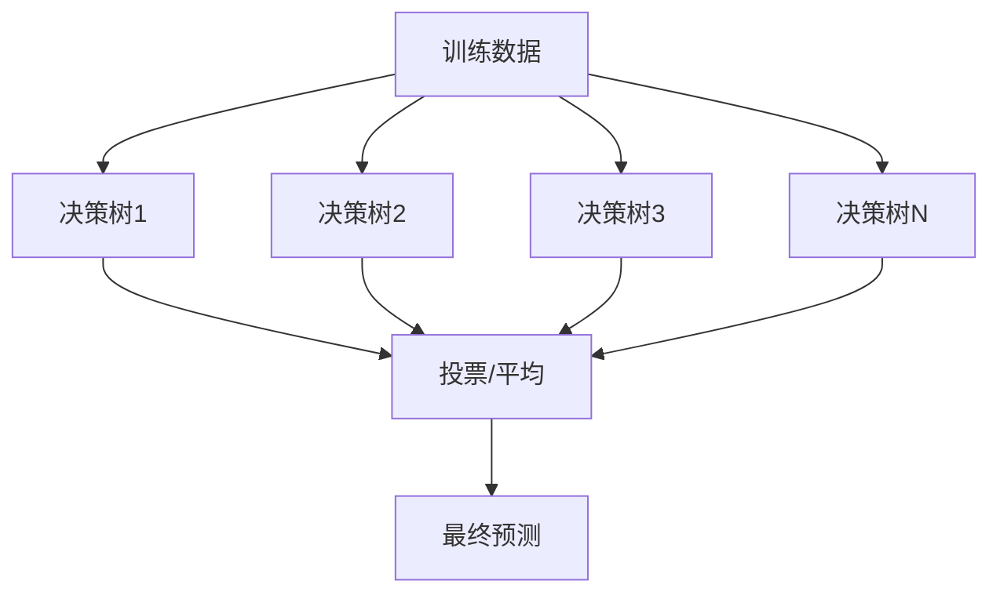

# 1.2.4 随机森林

## 学习目标

理解集成学习的威力，掌握随机森林算法的原理和实现，能够使用Trae构建高性能的随机森林分类器。

## 核心概念

### 1. 集成学习思想

**集成学习**的核心理念是"三个臭皮匠顶个诸葛亮"，通过组合多个弱学习器来构建强学习器。



### 2. 随机森林原理

**随机森林 = 多个决策树 + 随机性**

- **Bagging方法**：Bootstrap Aggregating
- **特征随机选择**：每次分裂只考虑部分特征
- **投票机制**：分类用多数投票，回归用平均值

## Python实现

### 基础随机森林实现

```python
import numpy as np
import matplotlib.pyplot as plt
from sklearn.datasets import make_classification, make_regression
from sklearn.model_selection import train_test_split
from sklearn.tree import DecisionTreeClassifier, DecisionTreeRegressor
from sklearn.ensemble import RandomForestClassifier, RandomForestRegressor
from sklearn.metrics import accuracy_score, mean_squared_error
import seaborn as sns
from collections import Counter
import pandas as pd

class SimpleRandomForest:
    """简化的随机森林实现，用于理解核心原理"""
    
    def __init__(self, n_trees=10, max_depth=5, min_samples_split=2, 
                 max_features='sqrt', random_state=42):
        self.n_trees = n_trees
        self.max_depth = max_depth
        self.min_samples_split = min_samples_split
        self.max_features = max_features
        self.random_state = random_state
        self.trees = []
        self.feature_indices = []
        
    def _bootstrap_sample(self, X, y):
        """生成Bootstrap样本"""
        n_samples = X.shape[0]
        indices = np.random.choice(n_samples, n_samples, replace=True)
        return X[indices], y[indices]
    
    def _get_random_features(self, n_features):
        """随机选择特征子集"""
        if self.max_features == 'sqrt':
            max_features = int(np.sqrt(n_features))
        elif self.max_features == 'log2':
            max_features = int(np.log2(n_features))
        elif isinstance(self.max_features, int):
            max_features = self.max_features
        else:
            max_features = n_features
            
        return np.random.choice(n_features, 
                              min(max_features, n_features), 
                              replace=False)
    
    def fit(self, X, y):
        """训练随机森林"""
        np.random.seed(self.random_state)
        n_samples, n_features = X.shape
        
        self.trees = []
        self.feature_indices = []
        
        for i in range(self.n_trees):
            # Bootstrap采样
            X_bootstrap, y_bootstrap = self._bootstrap_sample(X, y)
            
            # 随机特征选择
            feature_indices = self._get_random_features(n_features)
            self.feature_indices.append(feature_indices)
            
            # 训练决策树
            tree = DecisionTreeClassifier(
                max_depth=self.max_depth,
                min_samples_split=self.min_samples_split,
                random_state=self.random_state + i
            )
            
            tree.fit(X_bootstrap[:, feature_indices], y_bootstrap)
            self.trees.append(tree)
    
    def predict(self, X):
        """预测"""
        predictions = []
        
        for i, tree in enumerate(self.trees):
            feature_indices = self.feature_indices[i]
            pred = tree.predict(X[:, feature_indices])
            predictions.append(pred)
        
        # 投票
        predictions = np.array(predictions).T
        final_predictions = []
        
        for sample_preds in predictions:
            vote_counts = Counter(sample_preds)
            final_pred = vote_counts.most_common(1)[0][0]
            final_predictions.append(final_pred)
            
        return np.array(final_predictions)
    
    def predict_proba(self, X):
        """预测概率"""
        predictions = []
        
        for i, tree in enumerate(self.trees):
            feature_indices = self.feature_indices[i]
            pred_proba = tree.predict_proba(X[:, feature_indices])
            predictions.append(pred_proba)
        
        # 平均概率
        return np.mean(predictions, axis=0)

# 演示随机森林原理
class RandomForestDemo:
    """随机森林演示类"""
    
    def __init__(self):
        self.colors = ['#FF6B6B', '#4ECDC4', '#45B7D1', '#96CEB4', '#FFEAA7']
        
    def compare_single_vs_ensemble(self):
        """对比单个决策树与随机森林"""
        # 生成数据
        X, y = make_classification(n_samples=1000, n_features=20, 
                                 n_informative=10, n_redundant=10,
                                 n_clusters_per_class=1, random_state=42)
        
        X_train, X_test, y_train, y_test = train_test_split(
            X, y, test_size=0.3, random_state=42)
        
        # 训练模型
        single_tree = DecisionTreeClassifier(random_state=42)
        random_forest = RandomForestClassifier(n_estimators=100, random_state=42)
        
        single_tree.fit(X_train, y_train)
        random_forest.fit(X_train, y_train)
        
        # 预测
        single_pred = single_tree.predict(X_test)
        forest_pred = random_forest.predict(X_test)
        
        # 计算准确率
        single_acc = accuracy_score(y_test, single_pred)
        forest_acc = accuracy_score(y_test, forest_pred)
        
        # 可视化结果
        fig, axes = plt.subplots(1, 2, figsize=(15, 6))
        
        # 准确率对比
        models = ['单个决策树', '随机森林']
        accuracies = [single_acc, forest_acc]
        
        bars = axes[0].bar(models, accuracies, color=self.colors[:2])
        axes[0].set_ylabel('准确率')
        axes[0].set_title('单个决策树 vs 随机森林性能对比')
        axes[0].set_ylim(0, 1)
        
        # 添加数值标签
        for bar, acc in zip(bars, accuracies):
            axes[0].text(bar.get_x() + bar.get_width()/2, bar.get_height() + 0.01,
                        f'{acc:.3f}', ha='center', va='bottom')
        
        # 特征重要性对比
        single_importance = single_tree.feature_importances_
        forest_importance = random_forest.feature_importances_
        
        feature_indices = np.arange(len(single_importance))
        width = 0.35
        
        axes[1].bar(feature_indices - width/2, single_importance, width, 
                   label='单个决策树', color=self.colors[0], alpha=0.7)
        axes[1].bar(feature_indices + width/2, forest_importance, width,
                   label='随机森林', color=self.colors[1], alpha=0.7)
        
        axes[1].set_xlabel('特征索引')
        axes[1].set_ylabel('重要性')
        axes[1].set_title('特征重要性对比')
        axes[1].legend()
        
        plt.tight_layout()
        plt.show()
        
        return single_acc, forest_acc
    
    def demonstrate_bootstrap_effect(self):
        """演示Bootstrap采样的效果"""
        # 生成简单数据
        np.random.seed(42)
        X = np.random.randn(100, 2)
        y = (X[:, 0] + X[:, 1] > 0).astype(int)
        
        fig, axes = plt.subplots(2, 3, figsize=(18, 12))
        
        # 原始数据
        scatter = axes[0, 0].scatter(X[:, 0], X[:, 1], c=y, 
                                   cmap='RdYlBu', alpha=0.7)
        axes[0, 0].set_title('原始数据集')
        axes[0, 0].set_xlabel('特征1')
        axes[0, 0].set_ylabel('特征2')
        
        # 生成5个Bootstrap样本
        for i in range(5):
            row = i // 3
            col = (i + 1) % 3
            
            # Bootstrap采样
            indices = np.random.choice(len(X), len(X), replace=True)
            X_bootstrap = X[indices]
            y_bootstrap = y[indices]
            
            scatter = axes[row, col].scatter(X_bootstrap[:, 0], X_bootstrap[:, 1], 
                                           c=y_bootstrap, cmap='RdYlBu', alpha=0.7)
            axes[row, col].set_title(f'Bootstrap样本 {i+1}')
            axes[row, col].set_xlabel('特征1')
            axes[row, col].set_ylabel('特征2')
        
        plt.tight_layout()
        plt.show()
    
    def analyze_tree_diversity(self):
        """分析随机森林中树的多样性"""
        # 生成数据
        X, y = make_classification(n_samples=500, n_features=10, 
                                 n_informative=5, random_state=42)
        
        # 训练随机森林
        rf = RandomForestClassifier(n_estimators=10, random_state=42)
        rf.fit(X, y)
        
        # 分析每棵树的预测
        predictions = []
        for tree in rf.estimators_:
            pred = tree.predict(X)
            predictions.append(pred)
        
        predictions = np.array(predictions)
        
        # 计算树之间的相似性
        n_trees = len(rf.estimators_)
        similarity_matrix = np.zeros((n_trees, n_trees))
        
        for i in range(n_trees):
            for j in range(n_trees):
                similarity = np.mean(predictions[i] == predictions[j])
                similarity_matrix[i, j] = similarity
        
        # 可视化相似性矩阵
        plt.figure(figsize=(10, 8))
        sns.heatmap(similarity_matrix, annot=True, cmap='Blues', 
                   xticklabels=[f'树{i+1}' for i in range(n_trees)],
                   yticklabels=[f'树{i+1}' for i in range(n_trees)])
        plt.title('随机森林中树的预测相似性矩阵')
        plt.show()
        
        # 分析预测一致性
        agreement_scores = []
        for i in range(len(X)):
            sample_predictions = predictions[:, i]
            agreement = np.mean(sample_predictions == np.round(np.mean(sample_predictions)))
            agreement_scores.append(agreement)
        
        plt.figure(figsize=(12, 6))
        plt.hist(agreement_scores, bins=20, alpha=0.7, color=self.colors[0])
        plt.xlabel('预测一致性得分')
        plt.ylabel('样本数量')
        plt.title('随机森林预测一致性分布')
        plt.axvline(np.mean(agreement_scores), color='red', linestyle='--', 
                   label=f'平均一致性: {np.mean(agreement_scores):.3f}')
        plt.legend()
        plt.show()
        
        return similarity_matrix, agreement_scores

# 随机森林可视化工具
class RandomForestVisualizer:
    """随机森林可视化工具"""
    
    def __init__(self):
        self.colors = ['#FF6B6B', '#4ECDC4', '#45B7D1', '#96CEB4', '#FFEAA7']
    
    def plot_learning_curves(self, X, y, max_estimators=100):
        """绘制学习曲线"""
        X_train, X_test, y_train, y_test = train_test_split(
            X, y, test_size=0.3, random_state=42)
        
        n_estimators_range = range(1, max_estimators + 1, 5)
        train_scores = []
        test_scores = []
        
        for n_est in n_estimators_range:
            rf = RandomForestClassifier(n_estimators=n_est, random_state=42)
            rf.fit(X_train, y_train)
            
            train_pred = rf.predict(X_train)
            test_pred = rf.predict(X_test)
            
            train_acc = accuracy_score(y_train, train_pred)
            test_acc = accuracy_score(y_test, test_pred)
            
            train_scores.append(train_acc)
            test_scores.append(test_acc)
        
        plt.figure(figsize=(12, 8))
        plt.plot(n_estimators_range, train_scores, 'o-', color=self.colors[0], 
                label='训练集准确率', linewidth=2, markersize=4)
        plt.plot(n_estimators_range, test_scores, 'o-', color=self.colors[1], 
                label='测试集准确率', linewidth=2, markersize=4)
        
        plt.xlabel('决策树数量')
        plt.ylabel('准确率')
        plt.title('随机森林学习曲线')
        plt.legend()
        plt.grid(True, alpha=0.3)
        plt.show()
        
        return n_estimators_range, train_scores, test_scores
    
    def plot_feature_importance(self, rf_model, feature_names=None):
        """可视化特征重要性"""
        importances = rf_model.feature_importances_
        indices = np.argsort(importances)[::-1]
        
        if feature_names is None:
            feature_names = [f'特征{i}' for i in range(len(importances))]
        
        plt.figure(figsize=(12, 8))
        plt.bar(range(len(importances)), importances[indices], 
               color=self.colors[0], alpha=0.7)
        
        plt.xlabel('特征')
        plt.ylabel('重要性')
        plt.title('随机森林特征重要性排序')
        plt.xticks(range(len(importances)), 
                  [feature_names[i] for i in indices], rotation=45)
        
        # 添加数值标签
        for i, importance in enumerate(importances[indices]):
            plt.text(i, importance + 0.001, f'{importance:.3f}', 
                    ha='center', va='bottom', fontsize=8)
        
        plt.tight_layout()
        plt.show()
        
        return indices, importances
    
    def plot_oob_error(self, X, y, max_estimators=100):
        """绘制袋外误差曲线"""
        n_estimators_range = range(1, max_estimators + 1, 5)
        oob_errors = []
        
        for n_est in n_estimators_range:
            rf = RandomForestClassifier(n_estimators=n_est, oob_score=True, 
                                      random_state=42)
            rf.fit(X, y)
            oob_error = 1 - rf.oob_score_
            oob_errors.append(oob_error)
        
        plt.figure(figsize=(12, 8))
        plt.plot(n_estimators_range, oob_errors, 'o-', color=self.colors[2], 
                linewidth=2, markersize=4)
        
        plt.xlabel('决策树数量')
        plt.ylabel('袋外误差率')
        plt.title('随机森林袋外误差曲线')
        plt.grid(True, alpha=0.3)
        plt.show()
        
        return n_estimators_range, oob_errors

# 实际应用案例
class RandomForestApplications:
    """随机森林实际应用案例"""
    
    def __init__(self):
        self.colors = ['#FF6B6B', '#4ECDC4', '#45B7D1', '#96CEB4', '#FFEAA7']
    
    def credit_risk_assessment(self):
        """信用风险评估案例"""
        print("=== 信用风险评估案例 ===")
        
        # 生成模拟信用数据
        np.random.seed(42)
        n_samples = 2000
        
        # 特征生成
        age = np.random.normal(40, 12, n_samples)
        income = np.random.lognormal(10, 0.5, n_samples)
        debt_ratio = np.random.beta(2, 5, n_samples)
        credit_history = np.random.exponential(5, n_samples)
        employment_years = np.random.gamma(2, 3, n_samples)
        
        # 构建特征矩阵
        X = np.column_stack([
            age, income, debt_ratio, credit_history, employment_years
        ])
        
        # 生成标签（违约概率）
        risk_score = (
            -0.02 * age +
            -0.00001 * income +
            2.0 * debt_ratio +
            -0.1 * credit_history +
            -0.05 * employment_years +
            np.random.normal(0, 0.3, n_samples)
        )
        
        y = (risk_score > 0).astype(int)  # 1表示高风险
        
        # 特征名称
        feature_names = ['年龄', '收入', '负债比率', '信用历史长度', '工作年限']
        
        # 数据划分
        X_train, X_test, y_train, y_test = train_test_split(
            X, y, test_size=0.3, random_state=42, stratify=y)
        
        # 训练随机森林
        rf = RandomForestClassifier(n_estimators=100, random_state=42)
        rf.fit(X_train, y_train)
        
        # 预测
        y_pred = rf.predict(X_test)
        y_pred_proba = rf.predict_proba(X_test)[:, 1]
        
        # 评估结果
        accuracy = accuracy_score(y_test, y_pred)
        print(f"模型准确率: {accuracy:.3f}")
        
        # 可视化特征重要性
        visualizer = RandomForestVisualizer()
        indices, importances = visualizer.plot_feature_importance(
            rf, feature_names)
        
        # 风险分布分析
        plt.figure(figsize=(15, 5))
        
        # 预测概率分布
        plt.subplot(1, 3, 1)
        plt.hist(y_pred_proba[y_test == 0], bins=30, alpha=0.7, 
                label='低风险客户', color=self.colors[1])
        plt.hist(y_pred_proba[y_test == 1], bins=30, alpha=0.7, 
                label='高风险客户', color=self.colors[0])
        plt.xlabel('违约概率')
        plt.ylabel('客户数量')
        plt.title('风险概率分布')
        plt.legend()
        
        # 年龄与风险关系
        plt.subplot(1, 3, 2)
        plt.scatter(X_test[:, 0], y_pred_proba, c=y_test, 
                   cmap='RdYlBu', alpha=0.6)
        plt.xlabel('年龄')
        plt.ylabel('预测违约概率')
        plt.title('年龄与违约风险关系')
        plt.colorbar(label='实际风险')
        
        # 收入与风险关系
        plt.subplot(1, 3, 3)
        plt.scatter(X_test[:, 1], y_pred_proba, c=y_test, 
                   cmap='RdYlBu', alpha=0.6)
        plt.xlabel('收入')
        plt.ylabel('预测违约概率')
        plt.title('收入与违约风险关系')
        plt.colorbar(label='实际风险')
        
        plt.tight_layout()
        plt.show()
        
        return rf, X_test, y_test, feature_names
    
    def customer_segmentation(self):
        """客户细分案例"""
        print("=== 客户细分案例 ===")
        
        # 生成模拟客户数据
        np.random.seed(42)
        n_samples = 1500
        
        # 生成不同类型的客户
        # 高价值客户
        high_value = np.random.multivariate_normal(
            [50000, 80, 15], [[100000000, 500, 50], [500, 100, 5], [50, 5, 25]], 300)
        
        # 中等价值客户
        medium_value = np.random.multivariate_normal(
            [25000, 40, 8], [[50000000, 200, 20], [200, 50, 2], [20, 2, 10]], 600)
        
        # 低价值客户
        low_value = np.random.multivariate_normal(
            [8000, 15, 3], [[10000000, 100, 10], [100, 25, 1], [10, 1, 5]], 600)
        
        # 合并数据
        X = np.vstack([high_value, medium_value, low_value])
        y = np.hstack([np.zeros(300), np.ones(600), np.full(600, 2)])
        
        # 特征名称
        feature_names = ['年消费额', '购买频次', '客户生命周期']
        
        # 数据划分
        X_train, X_test, y_train, y_test = train_test_split(
            X, y, test_size=0.3, random_state=42, stratify=y)
        
        # 训练随机森林
        rf = RandomForestClassifier(n_estimators=100, random_state=42)
        rf.fit(X_train, y_train)
        
        # 预测
        y_pred = rf.predict(X_test)
        accuracy = accuracy_score(y_test, y_pred)
        print(f"客户分类准确率: {accuracy:.3f}")
        
        # 可视化结果
        fig = plt.figure(figsize=(18, 6))
        
        # 真实分布
        ax1 = fig.add_subplot(131, projection='3d')
        scatter1 = ax1.scatter(X_test[:, 0], X_test[:, 1], X_test[:, 2], 
                             c=y_test, cmap='viridis', alpha=0.6)
        ax1.set_xlabel('年消费额')
        ax1.set_ylabel('购买频次')
        ax1.set_zlabel('客户生命周期')
        ax1.set_title('真实客户分布')
        
        # 预测分布
        ax2 = fig.add_subplot(132, projection='3d')
        scatter2 = ax2.scatter(X_test[:, 0], X_test[:, 1], X_test[:, 2], 
                             c=y_pred, cmap='viridis', alpha=0.6)
        ax2.set_xlabel('年消费额')
        ax2.set_ylabel('购买频次')
        ax2.set_zlabel('客户生命周期')
        ax2.set_title('预测客户分布')
        
        # 特征重要性
        ax3 = fig.add_subplot(133)
        importances = rf.feature_importances_
        bars = ax3.bar(feature_names, importances, color=self.colors[:3])
        ax3.set_ylabel('重要性')
        ax3.set_title('特征重要性')
        ax3.tick_params(axis='x', rotation=45)
        
        # 添加数值标签
        for bar, importance in zip(bars, importances):
            ax3.text(bar.get_x() + bar.get_width()/2, bar.get_height() + 0.01,
                    f'{importance:.3f}', ha='center', va='bottom')
        
        plt.tight_layout()
        plt.show()
        
        return rf, X_test, y_test, feature_names

# 参数调优演示
class RandomForestTuning:
    """随机森林参数调优演示"""
    
    def __init__(self):
        self.colors = ['#FF6B6B', '#4ECDC4', '#45B7D1', '#96CEB4', '#FFEAA7']
    
    def tune_n_estimators(self, X, y):
        """调优决策树数量"""
        X_train, X_test, y_train, y_test = train_test_split(
            X, y, test_size=0.3, random_state=42)
        
        n_estimators_range = [10, 25, 50, 75, 100, 150, 200]
        train_scores = []
        test_scores = []
        
        for n_est in n_estimators_range:
            rf = RandomForestClassifier(n_estimators=n_est, random_state=42)
            rf.fit(X_train, y_train)
            
            train_pred = rf.predict(X_train)
            test_pred = rf.predict(X_test)
            
            train_acc = accuracy_score(y_train, train_pred)
            test_acc = accuracy_score(y_test, test_pred)
            
            train_scores.append(train_acc)
            test_scores.append(test_acc)
        
        plt.figure(figsize=(10, 6))
        plt.plot(n_estimators_range, train_scores, 'o-', 
                label='训练集', color=self.colors[0], linewidth=2)
        plt.plot(n_estimators_range, test_scores, 'o-', 
                label='测试集', color=self.colors[1], linewidth=2)
        
        plt.xlabel('决策树数量')
        plt.ylabel('准确率')
        plt.title('决策树数量对性能的影响')
        plt.legend()
        plt.grid(True, alpha=0.3)
        plt.show()
        
        return n_estimators_range, train_scores, test_scores
    
    def tune_max_depth(self, X, y):
        """调优最大深度"""
        X_train, X_test, y_train, y_test = train_test_split(
            X, y, test_size=0.3, random_state=42)
        
        max_depth_range = [3, 5, 7, 10, 15, 20, None]
        train_scores = []
        test_scores = []
        
        for max_depth in max_depth_range:
            rf = RandomForestClassifier(n_estimators=100, max_depth=max_depth, 
                                      random_state=42)
            rf.fit(X_train, y_train)
            
            train_pred = rf.predict(X_train)
            test_pred = rf.predict(X_test)
            
            train_acc = accuracy_score(y_train, train_pred)
            test_acc = accuracy_score(y_test, test_pred)
            
            train_scores.append(train_acc)
            test_scores.append(test_acc)
        
        # 处理None值用于绘图
        depth_labels = [str(d) if d is not None else 'None' for d in max_depth_range]
        
        plt.figure(figsize=(10, 6))
        x_pos = range(len(max_depth_range))
        plt.plot(x_pos, train_scores, 'o-', 
                label='训练集', color=self.colors[0], linewidth=2)
        plt.plot(x_pos, test_scores, 'o-', 
                label='测试集', color=self.colors[1], linewidth=2)
        
        plt.xlabel('最大深度')
        plt.ylabel('准确率')
        plt.title('最大深度对性能的影响')
        plt.xticks(x_pos, depth_labels)
        plt.legend()
        plt.grid(True, alpha=0.3)
        plt.show()
        
        return max_depth_range, train_scores, test_scores

# 演示代码
if __name__ == "__main__":
    # 生成演示数据
    X, y = make_classification(n_samples=1000, n_features=10, 
                             n_informative=5, n_redundant=3,
                             n_clusters_per_class=1, random_state=42)
    
    print("=== 随机森林演示 ===")
    
    # 1. 基础演示
    demo = RandomForestDemo()
    single_acc, forest_acc = demo.compare_single_vs_ensemble()
    print(f"单个决策树准确率: {single_acc:.3f}")
    print(f"随机森林准确率: {forest_acc:.3f}")
    
    # 2. Bootstrap效果演示
    demo.demonstrate_bootstrap_effect()
    
    # 3. 树多样性分析
    similarity_matrix, agreement_scores = demo.analyze_tree_diversity()
    
    # 4. 可视化工具演示
    visualizer = RandomForestVisualizer()
    visualizer.plot_learning_curves(X, y)
    
    # 5. 实际应用案例
    applications = RandomForestApplications()
    applications.credit_risk_assessment()
    applications.customer_segmentation()
    
    # 6. 参数调优
    tuning = RandomForestTuning()
    tuning.tune_n_estimators(X, y)
    tuning.tune_max_depth(X, y)
```

## 优缺点分析

### 优点

1. **高准确率**：集成多个决策树，通常比单个模型性能更好
2. **抗过拟合**：通过随机性和投票机制减少过拟合风险
3. **处理缺失值**：能够自动处理缺失特征
4. **特征重要性**：提供特征重要性排序
5. **并行训练**：各树独立训练，易于并行化
6. **鲁棒性强**：对异常值和噪声不敏感

### 缺点

1. **可解释性降低**：相比单个决策树难以解释
2. **内存消耗大**：需要存储多个决策树
3. **预测速度慢**：需要多个树的预测结果
4. **参数较多**：需要调优的超参数相对较多

## 应用场景

### 适用场景

- **分类任务**：客户分类、风险评估、疾病诊断
- **回归任务**：房价预测、销量预测、股价预测
- **特征选择**：利用特征重要性进行特征筛选
- **异常检测**：通过孤立森林检测异常

### 选择建议

- **数据量中等到大型**：随机森林在中大型数据集上表现优异
- **特征较多**：能够自动处理高维特征
- **需要特征重要性**：提供可靠的特征重要性评估
- **对准确率要求高**：通常能获得较好的预测性能

## 思考题

1. **为什么随机森林比单个决策树性能更好？**
   - 提示：考虑偏差-方差权衡

2. **Bootstrap采样和特征随机选择各起什么作用？**
   - 提示：思考多样性和泛化能力

3. **如何选择随机森林的关键超参数？**
   - 提示：n_estimators, max_depth, max_features

4. **随机森林在什么情况下可能表现不佳？**
   - 提示：考虑数据特点和问题类型

5. **如何解释随机森林的预测结果？**
   - 提示：特征重要性、SHAP值、部分依赖图

## 小结

本节介绍了**随机森林**这一重要的集成学习算法：

### 核心概念
- **集成学习思想**：组合多个弱学习器构建强学习器
- **随机性来源**：Bootstrap采样 + 特征随机选择
- **预测机制**：分类用投票，回归用平均
- **袋外评估**：利用未被采样的数据进行验证

### 关键技术
- **Bagging方法**：Bootstrap Aggregating
- **特征子集选择**：sqrt(n_features)或log2(n_features)
- **树的多样性**：通过随机性保证模型差异
- **特征重要性**：基于不纯度减少计算

### 实践要点
- **参数调优**：重点关注n_estimators和max_depth
- **特征工程**：随机森林对特征缩放不敏感
- **模型解释**：利用特征重要性和可视化工具
- **性能优化**：考虑并行训练和内存使用

### 应用场景
- **分类问题**：客户分群、风险评估、图像分类
- **回归问题**：价格预测、需求预测、评分预测
- **特征选择**：基于重要性的特征筛选
- **模型基准**：作为其他算法的性能基准

随机森林是机器学习中最实用的算法之一，在Trae中可以轻松实现和优化。掌握随机森林不仅能解决实际问题，还能为理解更复杂的集成方法打下基础。

**下一节预告**：我们将学习支持向量机(SVM)，了解如何找到最优的分类边界。