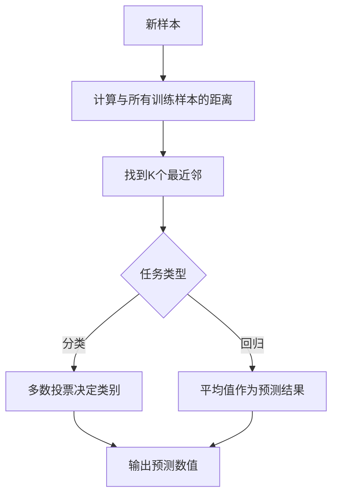

# 1.2.6 K近邻算法 (K-Nearest Neighbors, KNN)

## 学习目标

通过本节学习，你将掌握：
- K近邻算法的基本原理和几何直觉
- 距离度量方法和K值选择策略
- KNN在分类和回归任务中的应用
- 算法优化技术和实际应用场景
- 使用Python和Trae实现完整的KNN系统

## 算法概述

K近邻算法是一种基于实例的学习方法，也称为"懒惰学习"算法。它的核心思想非常直观：**相似的样本应该有相似的标签**。

### 基本思想



### 算法特点

- **非参数方法**：不对数据分布做假设
- **懒惰学习**：训练阶段只存储数据，预测时才计算
- **局部性**：预测基于局部邻域信息
- **简单直观**：算法逻辑容易理解和实现

## 数学原理

### 距离度量

KNN的核心是计算样本间的距离。常用的距离度量包括：

#### 1. 欧几里得距离 (Euclidean Distance)

$$d(x_i, x_j) = \sqrt{\sum_{k=1}^{n} (x_{ik} - x_{jk})^2}$$

#### 2. 曼哈顿距离 (Manhattan Distance)

$$d(x_i, x_j) = \sum_{k=1}^{n} |x_{ik} - x_{jk}|$$

#### 3. 闵可夫斯基距离 (Minkowski Distance)

$$d(x_i, x_j) = \left(\sum_{k=1}^{n} |x_{ik} - x_{jk}|^p\right)^{1/p}$$

当p=1时为曼哈顿距离，p=2时为欧几里得距离。

#### 4. 余弦距离 (Cosine Distance)

$$d(x_i, x_j) = 1 - \frac{x_i \cdot x_j}{||x_i|| \cdot ||x_j||}$$

### 预测规则

#### 分类任务

对于分类任务，使用多数投票：

$$\hat{y} = \arg\max_{c} \sum_{i \in N_k(x)} I(y_i = c)$$

其中$N_k(x)$表示样本$x$的K个最近邻，$I(\cdot)$是指示函数。

#### 回归任务

对于回归任务，使用平均值：

$$\hat{y} = \frac{1}{k} \sum_{i \in N_k(x)} y_i$$

或者使用距离加权平均：

$$\hat{y} = \frac{\sum_{i \in N_k(x)} w_i y_i}{\sum_{i \in N_k(x)} w_i}$$

其中$w_i = \frac{1}{d(x, x_i) + \epsilon}$，$\epsilon$是小的正数防止除零。

## 基础实现

### 从零实现KNN分类器

```python
import numpy as np
import matplotlib.pyplot as plt
from sklearn.datasets import make_classification, make_regression
from sklearn.model_selection import train_test_split
from sklearn.metrics import accuracy_score, mean_squared_error
from sklearn.preprocessing import StandardScaler
from collections import Counter
import seaborn as sns

class SimpleKNN:
    """简单的KNN实现"""
    
    def __init__(self, k=3, distance_metric='euclidean', task='classification'):
        """
        参数:
        k: 近邻数量
        distance_metric: 距离度量方法
        task: 'classification' 或 'regression'
        """
        self.k = k
        self.distance_metric = distance_metric
        self.task = task
        self.X_train = None
        self.y_train = None
    
    def fit(self, X, y):
        """训练KNN（实际上只是存储数据）"""
        self.X_train = np.array(X)
        self.y_train = np.array(y)
        print(f"📚 KNN训练完成: 存储了 {len(X)} 个训练样本")
        return self
    
    def _calculate_distance(self, x1, x2):
        """计算两个样本间的距离"""
        if self.distance_metric == 'euclidean':
            return np.sqrt(np.sum((x1 - x2) ** 2))
        elif self.distance_metric == 'manhattan':
            return np.sum(np.abs(x1 - x2))
        elif self.distance_metric == 'minkowski':
            p = 3  # 可以作为参数
            return np.sum(np.abs(x1 - x2) ** p) ** (1/p)
        elif self.distance_metric == 'cosine':
            dot_product = np.dot(x1, x2)
            norm_x1 = np.linalg.norm(x1)
            norm_x2 = np.linalg.norm(x2)
            return 1 - dot_product / (norm_x1 * norm_x2 + 1e-8)
        else:
            raise ValueError(f"不支持的距离度量: {self.distance_metric}")
    
    def _get_neighbors(self, x):
        """获取K个最近邻"""
        distances = []
        
        # 计算与所有训练样本的距离
        for i, x_train in enumerate(self.X_train):
            dist = self._calculate_distance(x, x_train)
            distances.append((dist, i))
        
        # 按距离排序并取前K个
        distances.sort(key=lambda x: x[0])
        neighbors = distances[:self.k]
        
        return neighbors
    
    def predict_single(self, x):
        """预测单个样本"""
        neighbors = self._get_neighbors(x)
        
        if self.task == 'classification':
            # 多数投票
            neighbor_labels = [self.y_train[idx] for _, idx in neighbors]
            prediction = Counter(neighbor_labels).most_common(1)[0][0]
        else:  # regression
            # 平均值或距离加权平均
            if all(dist > 0 for dist, _ in neighbors):
                # 距离加权平均
                weights = [1 / (dist + 1e-8) for dist, _ in neighbors]
                weighted_sum = sum(w * self.y_train[idx] for w, (_, idx) in zip(weights, neighbors))
                prediction = weighted_sum / sum(weights)
            else:
                # 简单平均
                neighbor_values = [self.y_train[idx] for _, idx in neighbors]
                prediction = np.mean(neighbor_values)
        
        return prediction
    
    def predict(self, X):
        """预测多个样本"""
        X = np.array(X)
        predictions = []
        
        for x in X:
            pred = self.predict_single(x)
            predictions.append(pred)
        
        return np.array(predictions)
    
    def predict_proba(self, X):
        """预测概率（仅用于分类）"""
        if self.task != 'classification':
            raise ValueError("predict_proba只适用于分类任务")
        
        X = np.array(X)
        probabilities = []
        
        # 获取所有可能的类别
        unique_classes = np.unique(self.y_train)
        
        for x in X:
            neighbors = self._get_neighbors(x)
            neighbor_labels = [self.y_train[idx] for _, idx in neighbors]
            
            # 计算每个类别的概率
            class_probs = []
            for class_label in unique_classes:
                count = neighbor_labels.count(class_label)
                prob = count / self.k
                class_probs.append(prob)
            
            probabilities.append(class_probs)
        
        return np.array(probabilities), unique_classes

# 演示KNN分类
def demonstrate_knn_classification():
    """演示KNN分类"""
    print("\n🎯 === KNN分类演示 === 🎯")
    
    # 生成分类数据
    X, y = make_classification(
        n_samples=300, n_features=2, n_redundant=0, 
        n_informative=2, n_clusters_per_class=1, random_state=42
    )
    
    # 数据标准化
    scaler = StandardScaler()
    X_scaled = scaler.fit_transform(X)
    
    # 划分数据集
    X_train, X_test, y_train, y_test = train_test_split(
        X_scaled, y, test_size=0.3, random_state=42
    )
    
    print(f"📊 数据信息:")
    print(f"  • 训练集: {len(X_train)} 样本")
    print(f"  • 测试集: {len(X_test)} 样本")
    print(f"  • 特征维度: {X.shape[1]}")
    print(f"  • 类别数量: {len(np.unique(y))}")
    
    # 测试不同的K值
    k_values = [1, 3, 5, 7, 9, 15]
    accuracies = []
    
    plt.figure(figsize=(15, 10))
    
    for i, k in enumerate(k_values):
        # 训练KNN
        knn = SimpleKNN(k=k, task='classification')
        knn.fit(X_train, y_train)
        
        # 预测
        y_pred = knn.predict(X_test)
        accuracy = accuracy_score(y_test, y_pred)
        accuracies.append(accuracy)
        
        print(f"\n🔍 K={k}: 准确率 = {accuracy:.4f}")
        
        # 可视化决策边界
        plt.subplot(2, 3, i+1)
        
        # 创建网格
        h = 0.02
        x_min, x_max = X_scaled[:, 0].min() - 1, X_scaled[:, 0].max() + 1
        y_min, y_max = X_scaled[:, 1].min() - 1, X_scaled[:, 1].max() + 1
        xx, yy = np.meshgrid(np.arange(x_min, x_max, h),
                            np.arange(y_min, y_max, h))
        
        # 预测网格点
        grid_points = np.c_[xx.ravel(), yy.ravel()]
        Z = knn.predict(grid_points)
        Z = Z.reshape(xx.shape)
        
        # 绘制决策边界
        plt.contourf(xx, yy, Z, alpha=0.3, cmap=plt.cm.RdYlBu)
        
        # 绘制数据点
        scatter = plt.scatter(X_scaled[:, 0], X_scaled[:, 1], c=y, 
                            cmap=plt.cm.RdYlBu, edgecolors='black')
        plt.title(f'K={k}, 准确率={accuracy:.3f}')
        plt.xlabel('特征1')
        plt.ylabel('特征2')
    
    plt.tight_layout()
    plt.show()
    
    # K值选择分析
    plt.figure(figsize=(10, 6))
    plt.plot(k_values, accuracies, 'bo-', linewidth=2, markersize=8)
    plt.xlabel('K值')
    plt.ylabel('准确率')
    plt.title('不同K值的分类准确率')
    plt.grid(True, alpha=0.3)
    
    # 标注最佳K值
    best_k_idx = np.argmax(accuracies)
    best_k = k_values[best_k_idx]
    best_accuracy = accuracies[best_k_idx]
    
    plt.annotate(f'最佳K={best_k}\n准确率={best_accuracy:.3f}', 
                xy=(best_k, best_accuracy), xytext=(best_k+2, best_accuracy-0.02),
                arrowprops=dict(arrowstyle='->', color='red'),
                fontsize=12, color='red')
    
    plt.show()
    
    print(f"\n🏆 最佳K值: {best_k}, 最佳准确率: {best_accuracy:.4f}")
    
    return knn, best_k

knn_classifier, optimal_k = demonstrate_knn_classification()
```

### 距离度量对比

```python
def compare_distance_metrics():
    """比较不同距离度量的效果"""
    print("\n📏 === 距离度量对比 === 📏")
    
    # 生成数据
    X, y = make_classification(
        n_samples=400, n_features=2, n_redundant=0,
        n_informative=2, n_clusters_per_class=1, random_state=42
    )
    
    # 标准化
    scaler = StandardScaler()
    X_scaled = scaler.fit_transform(X)
    
    X_train, X_test, y_train, y_test = train_test_split(
        X_scaled, y, test_size=0.3, random_state=42
    )
    
    # 测试不同距离度量
    distance_metrics = ['euclidean', 'manhattan', 'minkowski', 'cosine']
    metric_names = ['欧几里得距离', '曼哈顿距离', '闵可夫斯基距离', '余弦距离']
    
    results = []
    
    plt.figure(figsize=(16, 4))
    
    for i, (metric, name) in enumerate(zip(distance_metrics, metric_names)):
        # 训练KNN
        knn = SimpleKNN(k=5, distance_metric=metric, task='classification')
        knn.fit(X_train, y_train)
        
        # 预测和评估
        y_pred = knn.predict(X_test)
        accuracy = accuracy_score(y_test, y_pred)
        results.append((name, accuracy))
        
        print(f"📊 {name}: 准确率 = {accuracy:.4f}")
        
        # 可视化决策边界
        plt.subplot(1, 4, i+1)
        
        # 创建网格
        h = 0.02
        x_min, x_max = X_scaled[:, 0].min() - 1, X_scaled[:, 0].max() + 1
        y_min, y_max = X_scaled[:, 1].min() - 1, X_scaled[:, 1].max() + 1
        xx, yy = np.meshgrid(np.arange(x_min, x_max, h),
                            np.arange(y_min, y_max, h))
        
        # 预测网格点
        grid_points = np.c_[xx.ravel(), yy.ravel()]
        Z = knn.predict(grid_points)
        Z = Z.reshape(xx.shape)
        
        # 绘制
        plt.contourf(xx, yy, Z, alpha=0.3, cmap=plt.cm.RdYlBu)
        plt.scatter(X_scaled[:, 0], X_scaled[:, 1], c=y, 
                   cmap=plt.cm.RdYlBu, edgecolors='black')
        plt.title(f'{name}\n准确率={accuracy:.3f}')
        plt.xlabel('特征1')
        plt.ylabel('特征2')
    
    plt.tight_layout()
    plt.show()
    
    # 结果总结
    results.sort(key=lambda x: x[1], reverse=True)
    print(f"\n🏆 距离度量排名:")
    for i, (name, acc) in enumerate(results, 1):
        print(f"  {i}. {name}: {acc:.4f}")
    
    return results

distance_comparison = compare_distance_metrics()
```

## KNN回归实现

```python
def demonstrate_knn_regression():
    """演示KNN回归"""
    print("\n📈 === KNN回归演示 === 📈")
    
    # 生成回归数据
    X, y = make_regression(
        n_samples=300, n_features=1, noise=10, random_state=42
    )
    
    # 划分数据集
    X_train, X_test, y_train, y_test = train_test_split(
        X, y, test_size=0.3, random_state=42
    )
    
    print(f"📊 回归数据信息:")
    print(f"  • 训练集: {len(X_train)} 样本")
    print(f"  • 测试集: {len(X_test)} 样本")
    print(f"  • 特征维度: {X.shape[1]}")
    
    # 测试不同K值的回归效果
    k_values = [1, 3, 5, 10, 20]
    mse_scores = []
    
    plt.figure(figsize=(15, 10))
    
    for i, k in enumerate(k_values):
        # 训练KNN回归
        knn_reg = SimpleKNN(k=k, task='regression')
        knn_reg.fit(X_train, y_train)
        
        # 预测
        y_pred = knn_reg.predict(X_test)
        mse = mean_squared_error(y_test, y_pred)
        mse_scores.append(mse)
        
        print(f"\n🔍 K={k}: MSE = {mse:.2f}")
        
        # 可视化回归结果
        plt.subplot(2, 3, i+1)
        
        # 创建平滑的预测线
        X_plot = np.linspace(X.min(), X.max(), 300).reshape(-1, 1)
        y_plot = knn_reg.predict(X_plot)
        
        # 绘制数据点和预测线
        plt.scatter(X_train, y_train, alpha=0.6, label='训练数据', color='blue')
        plt.scatter(X_test, y_test, alpha=0.8, label='测试数据', color='red')
        plt.plot(X_plot, y_plot, color='green', linewidth=2, label=f'KNN预测(K={k})')
        
        plt.title(f'K={k}, MSE={mse:.1f}')
        plt.xlabel('X')
        plt.ylabel('y')
        plt.legend()
        plt.grid(True, alpha=0.3)
    
    # 添加最后一个子图显示MSE对比
    plt.subplot(2, 3, 6)
    plt.plot(k_values, mse_scores, 'ro-', linewidth=2, markersize=8)
    plt.xlabel('K值')
    plt.ylabel('MSE')
    plt.title('不同K值的MSE对比')
    plt.grid(True, alpha=0.3)
    
    # 标注最佳K值
    best_k_idx = np.argmin(mse_scores)
    best_k = k_values[best_k_idx]
    best_mse = mse_scores[best_k_idx]
    
    plt.annotate(f'最佳K={best_k}\nMSE={best_mse:.1f}', 
                xy=(best_k, best_mse), xytext=(best_k+2, best_mse+50),
                arrowprops=dict(arrowstyle='->', color='red'),
                fontsize=10, color='red')
    
    plt.tight_layout()
    plt.show()
    
    print(f"\n🏆 最佳K值: {best_k}, 最佳MSE: {best_mse:.2f}")
    
    return knn_reg, best_k

knn_regressor, optimal_k_reg = demonstrate_knn_regression()
```

## 高级KNN实现

### 加权KNN和优化技术

```python
class AdvancedKNN:
    """高级KNN实现，包含多种优化技术"""
    
    def __init__(self, k=3, distance_metric='euclidean', 
                 weights='uniform', algorithm='brute', task='classification'):
        """
        参数:
        k: 近邻数量
        distance_metric: 距离度量
        weights: 'uniform' 或 'distance'
        algorithm: 'brute', 'kd_tree', 'ball_tree'
        task: 'classification' 或 'regression'
        """
        self.k = k
        self.distance_metric = distance_metric
        self.weights = weights
        self.algorithm = algorithm
        self.task = task
        self.X_train = None
        self.y_train = None
        self.tree = None
    
    def fit(self, X, y):
        """训练KNN"""
        self.X_train = np.array(X)
        self.y_train = np.array(y)
        
        # 构建空间索引结构（简化版）
        if self.algorithm == 'kd_tree':
            print("🌳 构建KD树索引...")
            # 这里简化实现，实际应用中可使用sklearn的KDTree
            self.tree = 'kd_tree_placeholder'
        elif self.algorithm == 'ball_tree':
            print("🏀 构建Ball树索引...")
            self.tree = 'ball_tree_placeholder'
        else:
            print("💪 使用暴力搜索...")
        
        print(f"📚 高级KNN训练完成: {len(X)} 样本, 算法={self.algorithm}")
        return self
    
    def _calculate_distance(self, x1, x2):
        """计算距离"""
        if self.distance_metric == 'euclidean':
            return np.sqrt(np.sum((x1 - x2) ** 2))
        elif self.distance_metric == 'manhattan':
            return np.sum(np.abs(x1 - x2))
        elif self.distance_metric == 'chebyshev':
            return np.max(np.abs(x1 - x2))
        else:
            return np.sqrt(np.sum((x1 - x2) ** 2))  # 默认欧几里得
    
    def _get_neighbors_with_weights(self, x):
        """获取K个最近邻及其权重"""
        distances = []
        
        # 计算距离
        for i, x_train in enumerate(self.X_train):
            dist = self._calculate_distance(x, x_train)
            distances.append((dist, i))
        
        # 排序并取前K个
        distances.sort(key=lambda x: x[0])
        neighbors = distances[:self.k]
        
        # 计算权重
        if self.weights == 'uniform':
            weights = [1.0] * len(neighbors)
        else:  # distance weighting
            weights = []
            for dist, _ in neighbors:
                if dist == 0:
                    weights.append(float('inf'))  # 完全相同的点
                else:
                    weights.append(1.0 / dist)
        
        return neighbors, weights
    
    def predict_single_advanced(self, x):
        """高级单样本预测"""
        neighbors, weights = self._get_neighbors_with_weights(x)
        
        if self.task == 'classification':
            # 加权投票
            class_weights = {}
            
            for (_, idx), weight in zip(neighbors, weights):
                label = self.y_train[idx]
                if label not in class_weights:
                    class_weights[label] = 0
                class_weights[label] += weight
            
            # 返回权重最大的类别
            prediction = max(class_weights, key=class_weights.get)
            
        else:  # regression
            # 加权平均
            if any(w == float('inf') for w in weights):
                # 有完全相同的点，只考虑这些点
                exact_matches = [self.y_train[idx] for (_, idx), w in zip(neighbors, weights) if w == float('inf')]
                prediction = np.mean(exact_matches)
            else:
                weighted_sum = sum(w * self.y_train[idx] for (_, idx), w in zip(neighbors, weights))
                weight_sum = sum(weights)
                prediction = weighted_sum / weight_sum if weight_sum > 0 else 0
        
        return prediction
    
    def predict(self, X):
        """预测多个样本"""
        X = np.array(X)
        predictions = []
        
        for x in X:
            pred = self.predict_single_advanced(x)
            predictions.append(pred)
        
        return np.array(predictions)
    
    def predict_proba_advanced(self, X):
        """高级概率预测"""
        if self.task != 'classification':
            raise ValueError("predict_proba只适用于分类任务")
        
        X = np.array(X)
        unique_classes = np.unique(self.y_train)
        probabilities = []
        
        for x in X:
            neighbors, weights = self._get_neighbors_with_weights(x)
            
            # 计算加权概率
            class_weights = {cls: 0 for cls in unique_classes}
            
            for (_, idx), weight in zip(neighbors, weights):
                label = self.y_train[idx]
                class_weights[label] += weight
            
            # 归一化
            total_weight = sum(class_weights.values())
            if total_weight > 0:
                class_probs = [class_weights[cls] / total_weight for cls in unique_classes]
            else:
                class_probs = [1.0 / len(unique_classes)] * len(unique_classes)
            
            probabilities.append(class_probs)
        
        return np.array(probabilities), unique_classes

# 演示高级KNN
def demonstrate_advanced_knn():
    """演示高级KNN功能"""
    print("\n🚀 === 高级KNN演示 === 🚀")
    
    # 生成数据
    X, y = make_classification(
        n_samples=500, n_features=2, n_redundant=0,
        n_informative=2, n_clusters_per_class=2, random_state=42
    )
    
    # 标准化
    scaler = StandardScaler()
    X_scaled = scaler.fit_transform(X)
    
    X_train, X_test, y_train, y_test = train_test_split(
        X_scaled, y, test_size=0.3, random_state=42
    )
    
    # 比较不同权重方法
    weight_methods = ['uniform', 'distance']
    weight_names = ['均匀权重', '距离权重']
    
    plt.figure(figsize=(12, 5))
    
    for i, (method, name) in enumerate(zip(weight_methods, weight_names)):
        # 训练高级KNN
        adv_knn = AdvancedKNN(k=7, weights=method, task='classification')
        adv_knn.fit(X_train, y_train)
        
        # 预测
        y_pred = adv_knn.predict(X_test)
        accuracy = accuracy_score(y_test, y_pred)
        
        print(f"📊 {name}: 准确率 = {accuracy:.4f}")
        
        # 可视化
        plt.subplot(1, 2, i+1)
        
        # 创建网格
        h = 0.02
        x_min, x_max = X_scaled[:, 0].min() - 1, X_scaled[:, 0].max() + 1
        y_min, y_max = X_scaled[:, 1].min() - 1, X_scaled[:, 1].max() + 1
        xx, yy = np.meshgrid(np.arange(x_min, x_max, h),
                            np.arange(y_min, y_max, h))
        
        # 预测网格点
        grid_points = np.c_[xx.ravel(), yy.ravel()]
        Z = adv_knn.predict(grid_points)
        Z = Z.reshape(xx.shape)
        
        # 绘制决策边界
        plt.contourf(xx, yy, Z, alpha=0.3, cmap=plt.cm.RdYlBu)
        plt.scatter(X_scaled[:, 0], X_scaled[:, 1], c=y, 
                   cmap=plt.cm.RdYlBu, edgecolors='black')
        plt.title(f'{name}\n准确率={accuracy:.3f}')
        plt.xlabel('特征1')
        plt.ylabel('特征2')
    
    plt.tight_layout()
    plt.show()
    
    return adv_knn

advanced_knn = demonstrate_advanced_knn()
```

## 实际应用案例

### 案例1：推荐系统

```python
class MovieRecommendationKNN:
    """基于KNN的电影推荐系统"""
    
    def __init__(self, k=5, similarity_metric='cosine'):
        self.k = k
        self.similarity_metric = similarity_metric
        self.user_ratings = None
        self.movie_names = None
        self.user_names = None
    
    def fit(self, user_ratings, movie_names=None, user_names=None):
        """训练推荐系统"""
        self.user_ratings = np.array(user_ratings)
        self.movie_names = movie_names or [f'电影{i}' for i in range(user_ratings.shape[1])]
        self.user_names = user_names or [f'用户{i}' for i in range(user_ratings.shape[0])]
        
        print(f"🎬 推荐系统训练完成:")
        print(f"  • 用户数量: {len(self.user_names)}")
        print(f"  • 电影数量: {len(self.movie_names)}")
        print(f"  • 相似度度量: {self.similarity_metric}")
        
        return self
    
    def _calculate_similarity(self, user1_ratings, user2_ratings):
        """计算用户相似度"""
        # 只考虑两个用户都评过分的电影
        mask = (user1_ratings > 0) & (user2_ratings > 0)
        
        if np.sum(mask) == 0:
            return 0  # 没有共同评分的电影
        
        ratings1 = user1_ratings[mask]
        ratings2 = user2_ratings[mask]
        
        if self.similarity_metric == 'cosine':
            # 余弦相似度
            dot_product = np.dot(ratings1, ratings2)
            norm1 = np.linalg.norm(ratings1)
            norm2 = np.linalg.norm(ratings2)
            
            if norm1 == 0 or norm2 == 0:
                return 0
            
            return dot_product / (norm1 * norm2)
        
        elif self.similarity_metric == 'pearson':
            # 皮尔逊相关系数
            if len(ratings1) < 2:
                return 0
            
            mean1 = np.mean(ratings1)
            mean2 = np.mean(ratings2)
            
            numerator = np.sum((ratings1 - mean1) * (ratings2 - mean2))
            denominator = np.sqrt(np.sum((ratings1 - mean1)**2) * np.sum((ratings2 - mean2)**2))
            
            if denominator == 0:
                return 0
            
            return numerator / denominator
        
        else:  # euclidean
            # 欧几里得距离转相似度
            distance = np.sqrt(np.sum((ratings1 - ratings2)**2))
            return 1 / (1 + distance)
    
    def find_similar_users(self, target_user_idx):
        """找到相似用户"""
        target_ratings = self.user_ratings[target_user_idx]
        similarities = []
        
        for i, user_ratings in enumerate(self.user_ratings):
            if i != target_user_idx:
                similarity = self._calculate_similarity(target_ratings, user_ratings)
                similarities.append((similarity, i))
        
        # 按相似度排序
        similarities.sort(key=lambda x: x[0], reverse=True)
        
        return similarities[:self.k]
    
    def recommend_movies(self, target_user_idx, n_recommendations=5):
        """为用户推荐电影"""
        target_ratings = self.user_ratings[target_user_idx]
        similar_users = self.find_similar_users(target_user_idx)
        
        print(f"\n🎯 为 {self.user_names[target_user_idx]} 推荐电影:")
        print(f"📊 找到 {len(similar_users)} 个相似用户")
        
        # 计算电影推荐分数
        movie_scores = {}
        
        for movie_idx in range(len(self.movie_names)):
            if target_ratings[movie_idx] > 0:
                continue  # 跳过已评分的电影
            
            weighted_sum = 0
            similarity_sum = 0
            
            for similarity, user_idx in similar_users:
                if self.user_ratings[user_idx][movie_idx] > 0:
                    weighted_sum += similarity * self.user_ratings[user_idx][movie_idx]
                    similarity_sum += abs(similarity)
            
            if similarity_sum > 0:
                predicted_rating = weighted_sum / similarity_sum
                movie_scores[movie_idx] = predicted_rating
        
        # 排序并返回推荐
        recommendations = sorted(movie_scores.items(), key=lambda x: x[1], reverse=True)
        
        print(f"\n🎬 推荐电影 (Top {n_recommendations}):")
        print("-" * 40)
        
        for i, (movie_idx, score) in enumerate(recommendations[:n_recommendations], 1):
            print(f"{i}. {self.movie_names[movie_idx]}: 预测评分 {score:.2f}")
        
        return recommendations[:n_recommendations]
    
    def analyze_user_preferences(self, user_idx):
        """分析用户偏好"""
        user_ratings = self.user_ratings[user_idx]
        rated_movies = [(i, rating) for i, rating in enumerate(user_ratings) if rating > 0]
        
        if not rated_movies:
            print(f"用户 {self.user_names[user_idx]} 还没有评分记录")
            return
        
        # 按评分排序
        rated_movies.sort(key=lambda x: x[1], reverse=True)
        
        print(f"\n👤 {self.user_names[user_idx]} 的评分记录:")
        print("-" * 30)
        
        for movie_idx, rating in rated_movies:
            print(f"{self.movie_names[movie_idx]}: {rating}分")
        
        # 统计信息
        ratings = [rating for _, rating in rated_movies]
        print(f"\n📊 评分统计:")
        print(f"  • 评分电影数: {len(rated_movies)}")
        print(f"  • 平均评分: {np.mean(ratings):.2f}")
        print(f"  • 最高评分: {max(ratings)}")
        print(f"  • 最低评分: {min(ratings)}")

# 演示推荐系统
def demonstrate_movie_recommendation():
    """演示电影推荐系统"""
    print("\n🎬 === 电影推荐系统演示 === 🎬")
    
    # 模拟用户-电影评分矩阵 (0表示未评分)
    np.random.seed(42)
    
    # 用户和电影名称
    users = ['Alice', 'Bob', 'Charlie', 'Diana', 'Eve', 'Frank']
    movies = ['复仇者联盟', '泰坦尼克号', '阿凡达', '星球大战', '哈利波特', 
             '指环王', '黑客帝国', '肖申克的救赎', '教父', '盗梦空间']
    
    # 创建评分矩阵 (用户 x 电影)
    ratings_matrix = np.array([
        [5, 3, 4, 5, 0, 4, 5, 0, 3, 4],  # Alice: 喜欢科幻动作
        [2, 5, 3, 2, 5, 3, 2, 5, 4, 3],  # Bob: 喜欢剧情片
        [5, 2, 5, 4, 0, 3, 4, 0, 2, 5],  # Charlie: 喜欢科幻
        [3, 4, 3, 3, 4, 4, 3, 4, 5, 3],  # Diana: 口味均衡
        [4, 3, 4, 4, 0, 5, 4, 0, 3, 4],  # Eve: 喜欢奇幻冒险
        [2, 4, 2, 2, 4, 3, 2, 5, 5, 2],  # Frank: 喜欢经典剧情
    ])
    
    print(f"📊 评分矩阵信息:")
    print(f"  • 用户数: {len(users)}")
    print(f"  • 电影数: {len(movies)}")
    print(f"  • 总评分数: {np.sum(ratings_matrix > 0)}")
    print(f"  • 稀疏度: {(1 - np.sum(ratings_matrix > 0) / ratings_matrix.size) * 100:.1f}%")
    
    # 创建推荐系统
    recommender = MovieRecommendationKNN(k=3, similarity_metric='cosine')
    recommender.fit(ratings_matrix, movies, users)
    
    # 为每个用户分析偏好和推荐电影
    for user_idx in range(len(users)):
        print(f"\n{'='*50}")
        recommender.analyze_user_preferences(user_idx)
        
        # 推荐电影
        recommendations = recommender.recommend_movies(user_idx, n_recommendations=3)
        
        # 显示相似用户
        similar_users = recommender.find_similar_users(user_idx)
        print(f"\n👥 最相似的用户:")
        for similarity, similar_user_idx in similar_users:
            print(f"  {users[similar_user_idx]}: 相似度 {similarity:.3f}")
    
    return recommender

recommender_system = demonstrate_movie_recommendation()
```

### 案例2：图像分类

```python
class ImageClassificationKNN:
    """基于KNN的简单图像分类"""
    
    def __init__(self, k=3, distance_metric='euclidean'):
        self.k = k
        self.distance_metric = distance_metric
        self.X_train = None
        self.y_train = None
        self.feature_extractor = None
    
    def extract_features(self, images):
        """提取图像特征（简化版）"""
        features = []
        
        for img in images:
            # 简单特征：像素均值、标准差、边缘密度等
            feature_vector = [
                np.mean(img),                    # 平均亮度
                np.std(img),                     # 亮度标准差
                np.mean(np.abs(np.diff(img, axis=0))),  # 垂直边缘
                np.mean(np.abs(np.diff(img, axis=1))),  # 水平边缘
                np.sum(img > np.mean(img)) / img.size,   # 高亮像素比例
            ]
            features.append(feature_vector)
        
        return np.array(features)
    
    def fit(self, images, labels):
        """训练图像分类器"""
        print("🖼️ 提取图像特征...")
        self.X_train = self.extract_features(images)
        self.y_train = np.array(labels)
        
        print(f"📊 图像分类器训练完成:")
        print(f"  • 训练图像数: {len(images)}")
        print(f"  • 特征维度: {self.X_train.shape[1]}")
        print(f"  • 类别数: {len(np.unique(labels))}")
        
        return self
    
    def _calculate_distance(self, x1, x2):
        """计算特征距离"""
        if self.distance_metric == 'euclidean':
            return np.sqrt(np.sum((x1 - x2) ** 2))
        elif self.distance_metric == 'manhattan':
            return np.sum(np.abs(x1 - x2))
        else:
            return np.sqrt(np.sum((x1 - x2) ** 2))
    
    def predict(self, images):
        """预测图像类别"""
        print(f"🔍 预测 {len(images)} 张图像...")
        
        # 提取测试图像特征
        X_test = self.extract_features(images)
        predictions = []
        
        for test_features in X_test:
            # 计算与所有训练样本的距离
            distances = []
            for train_features in self.X_train:
                dist = self._calculate_distance(test_features, train_features)
                distances.append(dist)
            
            # 找到K个最近邻
            nearest_indices = np.argsort(distances)[:self.k]
            nearest_labels = self.y_train[nearest_indices]
            
            # 多数投票
            prediction = Counter(nearest_labels).most_common(1)[0][0]
            predictions.append(prediction)
        
        return np.array(predictions)
    
    def predict_with_confidence(self, images):
        """预测图像类别并返回置信度"""
        X_test = self.extract_features(images)
        predictions = []
        confidences = []
        
        for test_features in X_test:
            # 计算距离
            distances = []
            for train_features in self.X_train:
                dist = self._calculate_distance(test_features, train_features)
                distances.append(dist)
            
            # 找到K个最近邻
            nearest_indices = np.argsort(distances)[:self.k]
            nearest_labels = self.y_train[nearest_indices]
            nearest_distances = np.array(distances)[nearest_indices]
            
            # 计算加权投票
            label_weights = {}
            for label, dist in zip(nearest_labels, nearest_distances):
                weight = 1 / (dist + 1e-8)  # 距离越近权重越大
                if label not in label_weights:
                    label_weights[label] = 0
                label_weights[label] += weight
            
            # 预测和置信度
            total_weight = sum(label_weights.values())
            prediction = max(label_weights, key=label_weights.get)
            confidence = label_weights[prediction] / total_weight
            
            predictions.append(prediction)
            confidences.append(confidence)
        
        return np.array(predictions), np.array(confidences)

# 演示图像分类
def demonstrate_image_classification():
    """演示图像分类"""
    print("\n🖼️ === 图像分类演示 === 🖼️")
    
    # 生成模拟图像数据
    np.random.seed(42)
    
    def generate_synthetic_images(n_samples, image_size=(28, 28), pattern_type='circle'):
        """生成合成图像"""
        images = []
        
        for _ in range(n_samples):
            img = np.random.normal(0.1, 0.05, image_size)  # 背景噪声
            
            if pattern_type == 'circle':
                # 生成圆形图案
                center_x, center_y = image_size[0]//2, image_size[1]//2
                radius = np.random.randint(5, 10)
                
                for i in range(image_size[0]):
                    for j in range(image_size[1]):
                        if (i - center_x)**2 + (j - center_y)**2 <= radius**2:
                            img[i, j] = np.random.normal(0.8, 0.1)
            
            elif pattern_type == 'square':
                # 生成方形图案
                size = np.random.randint(8, 16)
                start_x = (image_size[0] - size) // 2
                start_y = (image_size[1] - size) // 2
                
                img[start_x:start_x+size, start_y:start_y+size] = np.random.normal(0.8, 0.1, (size, size))
            
            elif pattern_type == 'line':
                # 生成线条图案
                if np.random.random() > 0.5:  # 垂直线
                    col = image_size[1] // 2
                    img[:, col-1:col+2] = np.random.normal(0.8, 0.1, (image_size[0], 3))
                else:  # 水平线
                    row = image_size[0] // 2
                    img[row-1:row+2, :] = np.random.normal(0.8, 0.1, (3, image_size[1]))
            
            # 确保像素值在合理范围内
            img = np.clip(img, 0, 1)
            images.append(img)
        
        return images
    
    # 生成三类图像数据
    print("🎨 生成合成图像数据...")
    
    circles = generate_synthetic_images(50, pattern_type='circle')
    squares = generate_synthetic_images(50, pattern_type='square')
    lines = generate_synthetic_images(50, pattern_type='line')
    
    # 合并数据
    all_images = circles + squares + lines
    all_labels = ['circle'] * 50 + ['square'] * 50 + ['line'] * 50
    
    # 划分训练测试集
    from sklearn.model_selection import train_test_split
    
    train_images, test_images, train_labels, test_labels = train_test_split(
        all_images, all_labels, test_size=0.3, random_state=42, stratify=all_labels
    )
    
    print(f"📊 数据集信息:")
    print(f"  • 训练图像: {len(train_images)}")
    print(f"  • 测试图像: {len(test_images)}")
    print(f"  • 图像尺寸: {train_images[0].shape}")
    print(f"  • 类别: {set(all_labels)}")
    
    # 训练KNN图像分类器
    img_classifier = ImageClassificationKNN(k=5, distance_metric='euclidean')
    img_classifier.fit(train_images, train_labels)
    
    # 预测
    predictions, confidences = img_classifier.predict_with_confidence(test_images)
    
    # 评估结果
    accuracy = accuracy_score(test_labels, predictions)
    print(f"\n🎯 分类准确率: {accuracy:.4f}")
    
    # 详细分类报告
    from sklearn.metrics import classification_report, confusion_matrix
    
    print(f"\n📋 详细分类报告:")
    print(classification_report(test_labels, predictions))
    
    # 混淆矩阵
    cm = confusion_matrix(test_labels, predictions)
    
    plt.figure(figsize=(12, 5))
    
    # 混淆矩阵可视化
    plt.subplot(1, 2, 1)
    sns.heatmap(cm, annot=True, fmt='d', cmap='Blues', 
                xticklabels=['circle', 'line', 'square'],
                yticklabels=['circle', 'line', 'square'])
    plt.title('混淆矩阵')
    plt.xlabel('预测类别')
    plt.ylabel('真实类别')
    
    # 置信度分布
    plt.subplot(1, 2, 2)
    correct_mask = np.array(predictions) == np.array(test_labels)
    
    plt.hist(confidences[correct_mask], alpha=0.7, label='正确预测', bins=20, color='green')
    plt.hist(confidences[~correct_mask], alpha=0.7, label='错误预测', bins=20, color='red')
    plt.xlabel('预测置信度')
    plt.ylabel('频次')
    plt.title('预测置信度分布')
    plt.legend()
    
    plt.tight_layout()
    plt.show()
    
    # 显示一些预测示例
    print(f"\n🔍 预测示例:")
    print("-" * 50)
    
    for i in range(min(10, len(test_images))):
        true_label = test_labels[i]
        pred_label = predictions[i]
        confidence = confidences[i]
        status = "✅" if true_label == pred_label else "❌"
        
        print(f"{status} 真实: {true_label:<6} | 预测: {pred_label:<6} | 置信度: {confidence:.3f}")
    
    return img_classifier

image_classifier = demonstrate_image_classification()
```

## Trae实践环节

### 使用Trae构建KNN系统

```python
class TraeKNN:
    """Trae风格的KNN实现"""
    
    def __init__(self, k=3, distance_metric='euclidean', 
                 weights='uniform', task='classification'):
        """
        参数:
        k: 近邻数量
        distance_metric: 距离度量方法
        weights: 权重方法 ('uniform', 'distance')
        task: 任务类型 ('classification', 'regression')
        """
        self.k = k
        self.distance_metric = distance_metric
        self.weights = weights
        self.task = task
        self.X_train = None
        self.y_train = None
        self.feature_names = None
        self.class_names = None
        
    def trae_fit(self, X, y, feature_names=None):
        """Trae风格的训练方法"""
        print(f"🚀 Trae KNN开始训练...")
        print(f"📊 算法配置:")
        print(f"  • K值: {self.k}")
        print(f"  • 距离度量: {self.distance_metric}")
        print(f"  • 权重方法: {self.weights}")
        print(f"  • 任务类型: {self.task}")
        
        self.X_train = np.array(X)
        self.y_train = np.array(y)
        self.feature_names = feature_names or [f'特征{i}' for i in range(X.shape[1])]
        
        if self.task == 'classification':
            self.class_names = np.unique(y)
        
        print(f"\n📈 数据信息:")
        print(f"  • 训练样本数: {len(X)}")
        print(f"  • 特征维度: {X.shape[1]}")
        
        if self.task == 'classification':
            print(f"  • 类别数量: {len(self.class_names)}")
            print(f"  • 类别分布: {dict(zip(*np.unique(y, return_counts=True)))}")
        else:
            print(f"  • 目标值范围: [{np.min(y):.3f}, {np.max(y):.3f}]")
            print(f"  • 目标值均值: {np.mean(y):.3f}")
        
        print("✅ 训练完成! (KNN是懒惰学习，实际计算在预测时进行)")
        
        return self
    
    def _trae_calculate_distance(self, x1, x2):
        """Trae风格的距离计算"""
        if self.distance_metric == 'euclidean':
            return np.sqrt(np.sum((x1 - x2) ** 2))
        elif self.distance_metric == 'manhattan':
            return np.sum(np.abs(x1 - x2))
        elif self.distance_metric == 'chebyshev':
            return np.max(np.abs(x1 - x2))
        elif self.distance_metric == 'cosine':
            dot_product = np.dot(x1, x2)
            norm1 = np.linalg.norm(x1)
            norm2 = np.linalg.norm(x2)
            if norm1 == 0 or norm2 == 0:
                return 1
            return 1 - dot_product / (norm1 * norm2)
        else:
            raise ValueError(f"不支持的距离度量: {self.distance_metric}")
    
    def _trae_get_neighbors(self, x, return_distances=False):
        """Trae风格的邻居查找"""
        distances = []
        
        for i, x_train in enumerate(self.X_train):
            dist = self._trae_calculate_distance(x, x_train)
            distances.append((dist, i))
        
        # 按距离排序
        distances.sort(key=lambda x: x[0])
        neighbors = distances[:self.k]
        
        if return_distances:
            return neighbors
        else:
            return [idx for _, idx in neighbors]
    
    def trae_predict_single(self, x, verbose=False):
        """Trae风格的单样本预测"""
        neighbors_with_dist = self._trae_get_neighbors(x, return_distances=True)
        
        if verbose:
            print(f"\n🔍 样本分析: {x[:min(3, len(x))]}...")
            print(f"📊 找到 {len(neighbors_with_dist)} 个最近邻:")
            
            for i, (dist, idx) in enumerate(neighbors_with_dist, 1):
                label = self.y_train[idx]
                print(f"  {i}. 距离={dist:.4f}, 标签={label}")
        
        if self.task == 'classification':
            if self.weights == 'uniform':
                # 均匀权重投票
                neighbor_labels = [self.y_train[idx] for _, idx in neighbors_with_dist]
                prediction = Counter(neighbor_labels).most_common(1)[0][0]
                
                if verbose:
                    label_counts = Counter(neighbor_labels)
                    print(f"\n🗳️ 投票结果:")
                    for label, count in label_counts.most_common():
                        print(f"  {label}: {count} 票")
                    print(f"🎯 预测结果: {prediction}")
                
            else:  # distance weighting
                class_weights = {}
                total_weight = 0
                
                for dist, idx in neighbors_with_dist:
                    label = self.y_train[idx]
                    weight = 1 / (dist + 1e-8)
                    
                    if label not in class_weights:
                        class_weights[label] = 0
                    class_weights[label] += weight
                    total_weight += weight
                
                prediction = max(class_weights, key=class_weights.get)
                
                if verbose:
                    print(f"\n⚖️ 加权投票结果:")
                    for label, weight in sorted(class_weights.items(), key=lambda x: x[1], reverse=True):
                        prob = weight / total_weight
                        print(f"  {label}: 权重={weight:.4f}, 概率={prob:.4f}")
                    print(f"🎯 预测结果: {prediction}")
        
        else:  # regression
            if self.weights == 'uniform':
                neighbor_values = [self.y_train[idx] for _, idx in neighbors_with_dist]
                prediction = np.mean(neighbor_values)
                
                if verbose:
                    print(f"\n📊 邻居值: {neighbor_values}")
                    print(f"🎯 预测结果 (均值): {prediction:.4f}")
                
            else:  # distance weighting
                weighted_sum = 0
                weight_sum = 0
                
                for dist, idx in neighbors_with_dist:
                    value = self.y_train[idx]
                    weight = 1 / (dist + 1e-8)
                    weighted_sum += weight * value
                    weight_sum += weight
                
                prediction = weighted_sum / weight_sum if weight_sum > 0 else 0
                
                if verbose:
                    print(f"\n⚖️ 加权平均:")
                    for dist, idx in neighbors_with_dist:
                        value = self.y_train[idx]
                        weight = 1 / (dist + 1e-8)
                        print(f"  值={value:.4f}, 权重={weight:.4f}")
                    print(f"🎯 预测结果 (加权均值): {prediction:.4f}")
        
        return prediction
    
    def trae_predict(self, X, verbose=False):
        """Trae风格的批量预测"""
        print(f"🔮 开始预测 {len(X)} 个样本...")
        
        X = np.array(X)
        predictions = []
        
        for i, x in enumerate(X):
            if verbose and i < 3:  # 只显示前3个样本的详细信息
                print(f"\n--- 样本 {i+1} ---")
                pred = self.trae_predict_single(x, verbose=True)
            else:
                pred = self.trae_predict_single(x, verbose=False)
            
            predictions.append(pred)
        
        print(f"✅ 预测完成!")
        return np.array(predictions)
    
    def trae_evaluate(self, X, y, verbose=True):
        """Trae风格的模型评估"""
        print(f"📊 开始模型评估...")
        
        predictions = self.trae_predict(X, verbose=False)
        
        if self.task == 'classification':
            accuracy = accuracy_score(y, predictions)
            
            print(f"\n🎯 评估结果:")
            print(f"  • 准确率: {accuracy:.4f}")
            
            if verbose:
                from sklearn.metrics import classification_report, confusion_matrix
                
                print(f"\n📋 详细分类报告:")
                print(classification_report(y, predictions))
                
                # 混淆矩阵
                cm = confusion_matrix(y, predictions)
                print(f"\n🔍 混淆矩阵:")
                print(cm)
            
            return accuracy
        
        else:  # regression
            mse = mean_squared_error(y, predictions)
            rmse = np.sqrt(mse)
            mae = np.mean(np.abs(y - predictions))
            
            print(f"\n🎯 评估结果:")
            print(f"  • MSE: {mse:.4f}")
            print(f"  • RMSE: {rmse:.4f}")
            print(f"  • MAE: {mae:.4f}")
            
            if verbose:
                # 计算R²
                ss_res = np.sum((y - predictions) ** 2)
                ss_tot = np.sum((y - np.mean(y)) ** 2)
                r2 = 1 - (ss_res / ss_tot) if ss_tot != 0 else 0
                
                print(f"  • R²: {r2:.4f}")
                
                # 残差分析
                residuals = y - predictions
                print(f"\n📊 残差分析:")
                print(f"  • 残差均值: {np.mean(residuals):.4f}")
                print(f"  • 残差标准差: {np.std(residuals):.4f}")
            
            return mse
    
    def trae_analyze_feature_importance(self, X, y, n_samples=100):
        """Trae风格的特征重要性分析"""
        print(f"\n🔬 特征重要性分析...")
        
        X = np.array(X)
        y = np.array(y)
        
        # 随机选择样本进行分析
        if len(X) > n_samples:
            indices = np.random.choice(len(X), n_samples, replace=False)
            X_sample = X[indices]
            y_sample = y[indices]
        else:
            X_sample = X
            y_sample = y
        
        feature_importance = np.zeros(X.shape[1])
        
        for i in range(X.shape[1]):
            # 扰动第i个特征
            X_perturbed = X_sample.copy()
            X_perturbed[:, i] = np.random.permutation(X_perturbed[:, i])
            
            # 计算性能下降
            original_pred = self.trae_predict(X_sample, verbose=False)
            perturbed_pred = self.trae_predict(X_perturbed, verbose=False)
            
            if self.task == 'classification':
                original_acc = accuracy_score(y_sample, original_pred)
                perturbed_acc = accuracy_score(y_sample, perturbed_pred)
                importance = original_acc - perturbed_acc
            else:
                original_mse = mean_squared_error(y_sample, original_pred)
                perturbed_mse = mean_squared_error(y_sample, perturbed_pred)
                importance = perturbed_mse - original_mse  # MSE增加量
            
            feature_importance[i] = max(0, importance)  # 确保非负
        
        # 归一化
        if np.sum(feature_importance) > 0:
            feature_importance = feature_importance / np.sum(feature_importance)
        
        # 排序并显示
        importance_ranking = sorted(enumerate(feature_importance), key=lambda x: x[1], reverse=True)
        
        print(f"📊 特征重要性排名:")
        print("-" * 40)
        
        for rank, (feature_idx, importance) in enumerate(importance_ranking, 1):
            feature_name = self.feature_names[feature_idx]
            print(f"{rank:2d}. {feature_name:<15}: {importance:.4f}")
        
        return feature_importance
    
    def trae_cross_validate(self, X, y, cv=5):
        """Trae风格的交叉验证"""
        print(f"\n🔄 {cv}折交叉验证...")
        
        X = np.array(X)
        y = np.array(y)
        
        from sklearn.model_selection import KFold, StratifiedKFold
        
        if self.task == 'classification':
            kfold = StratifiedKFold(n_splits=cv, shuffle=True, random_state=42)
        else:
            kfold = KFold(n_splits=cv, shuffle=True, random_state=42)
        
        scores = []
        
        for fold, (train_idx, val_idx) in enumerate(kfold.split(X, y), 1):
            print(f"\n📁 第 {fold} 折:")
            
            X_train_fold, X_val_fold = X[train_idx], X[val_idx]
            y_train_fold, y_val_fold = y[train_idx], y[val_idx]
            
            # 创建临时模型
            temp_knn = TraeKNN(k=self.k, distance_metric=self.distance_metric, 
                              weights=self.weights, task=self.task)
            temp_knn.trae_fit(X_train_fold, y_train_fold)
            
            # 评估
            score = temp_knn.trae_evaluate(X_val_fold, y_val_fold, verbose=False)
            scores.append(score)
            
            metric_name = "准确率" if self.task == 'classification' else "MSE"
            print(f"  {metric_name}: {score:.4f}")
        
        # 总结
        mean_score = np.mean(scores)
        std_score = np.std(scores)
        
        print(f"\n🏆 交叉验证结果:")
        print(f"  • 平均{metric_name}: {mean_score:.4f} ± {std_score:.4f}")
        print(f"  • 最佳{metric_name}: {max(scores) if self.task == 'classification' else min(scores):.4f}")
        print(f"  • 最差{metric_name}: {min(scores) if self.task == 'classification' else max(scores):.4f}")
        
        return scores

# Trae KNN演示
def demonstrate_trae_knn():
    """演示Trae KNN"""
    
    print("\n🌟 === Trae KNN演示 === 🌟")
    
    # 演示1: 分类任务
    print("\n📊 演示1: 分类任务")
    print("=" * 40)
    
    # 生成分类数据
    X_cls, y_cls = make_classification(
        n_samples=300, n_features=4, n_redundant=0, 
        n_informative=4, n_clusters_per_class=1, random_state=42
    )
    
    # 特征名称
    feature_names = ['身高', '体重', '年龄', '收入']
    
    X_train, X_test, y_train, y_test = train_test_split(
        X_cls, y_cls, test_size=0.3, random_state=42
    )
    
    # 创建和训练Trae KNN分类器
    trae_knn_cls = TraeKNN(k=5, distance_metric='euclidean', 
                          weights='distance', task='classification')
    trae_knn_cls.trae_fit(X_train, y_train, feature_names)
    
    # 评估
    accuracy = trae_knn_cls.trae_evaluate(X_test, y_test)
    
    # 特征重要性分析
    importance = trae_knn_cls.trae_analyze_feature_importance(X_train, y_train)
    
    # 交叉验证
    cv_scores = trae_knn_cls.trae_cross_validate(X_train, y_train)
    
    # 演示2: 回归任务
    print("\n\n📈 演示2: 回归任务")
    print("=" * 40)
    
    # 生成回归数据
    X_reg, y_reg = make_regression(
        n_samples=300, n_features=3, noise=10, random_state=42
    )
    
    feature_names_reg = ['特征A', '特征B', '特征C']
    
    X_train_reg, X_test_reg, y_train_reg, y_test_reg = train_test_split(
        X_reg, y_reg, test_size=0.3, random_state=42
    )
    
    # 创建和训练Trae KNN回归器
    trae_knn_reg = TraeKNN(k=7, distance_metric='euclidean', 
                          weights='distance', task='regression')
    trae_knn_reg.trae_fit(X_train_reg, y_train_reg, feature_names_reg)
    
    # 评估
    mse = trae_knn_reg.trae_evaluate(X_test_reg, y_test_reg)
    
    # 特征重要性分析
    importance_reg = trae_knn_reg.trae_analyze_feature_importance(X_train_reg, y_train_reg)
    
    # 交叉验证
    cv_scores_reg = trae_knn_reg.trae_cross_validate(X_train_reg, y_train_reg)
    
    print(f"\n\n🏆 Trae KNN演示总结:")
    print("=" * 50)
    print(f"📈 分类任务准确率:     {accuracy:.4f}")
    print(f"📊 回归任务MSE:        {mse:.4f}")
    print(f"🔄 分类交叉验证均值:   {np.mean(cv_scores):.4f}")
    print(f"🔄 回归交叉验证均值:   {np.mean(cv_scores_reg):.4f}")
    
    return trae_knn_cls, trae_knn_reg

trae_models = demonstrate_trae_knn()
```

## 算法优化技术

### K值选择和模型调优

```python
def optimize_knn_parameters():
    """KNN参数优化"""
    print("\n⚙️ === KNN参数优化 === ⚙️")
    
    # 生成数据
    X, y = make_classification(
        n_samples=500, n_features=10, n_informative=5,
        n_redundant=2, n_clusters_per_class=2, random_state=42
    )
    
    # 标准化
    scaler = StandardScaler()
    X_scaled = scaler.fit_transform(X)
    
    X_train, X_test, y_train, y_test = train_test_split(
        X_scaled, y, test_size=0.3, random_state=42
    )
    
    # 1. K值优化
    print("🔍 1. K值优化")
    print("-" * 20)
    
    k_range = range(1, 31)
    train_scores = []
    val_scores = []
    
    from sklearn.model_selection import cross_val_score
    from sklearn.neighbors import KNeighborsClassifier
    
    for k in k_range:
        knn = KNeighborsClassifier(n_neighbors=k)
        
        # 训练集性能
        knn.fit(X_train, y_train)
        train_score = knn.score(X_train, y_train)
        train_scores.append(train_score)
        
        # 交叉验证性能
        cv_scores = cross_val_score(knn, X_train, y_train, cv=5)
        val_scores.append(cv_scores.mean())
    
    # 可视化K值选择
    plt.figure(figsize=(15, 5))
    
    plt.subplot(1, 3, 1)
    plt.plot(k_range, train_scores, 'bo-', label='训练集准确率', alpha=0.8)
    plt.plot(k_range, val_scores, 'ro-', label='验证集准确率', alpha=0.8)
    plt.xlabel('K值')
    plt.ylabel('准确率')
    plt.title('K值 vs 准确率')
    plt.legend()
    plt.grid(True, alpha=0.3)
    
    # 找到最佳K值
    best_k = k_range[np.argmax(val_scores)]
    best_val_score = max(val_scores)
    
    plt.axvline(x=best_k, color='green', linestyle='--', alpha=0.7)
    plt.text(best_k+1, best_val_score-0.02, f'最佳K={best_k}', 
             bbox=dict(boxstyle='round', facecolor='lightgreen'))
    
    print(f"最佳K值: {best_k}, 验证准确率: {best_val_score:.4f}")
    
    # 2. 距离度量优化
    print("\n📏 2. 距离度量优化")
    print("-" * 25)
    
    distance_metrics = ['euclidean', 'manhattan', 'chebyshev', 'minkowski']
    distance_scores = []
    
    for metric in distance_metrics:
        if metric == 'minkowski':
            knn = KNeighborsClassifier(n_neighbors=best_k, metric=metric, p=3)
        else:
            knn = KNeighborsClassifier(n_neighbors=best_k, metric=metric)
        
        cv_scores = cross_val_score(knn, X_train, y_train, cv=5)
        score = cv_scores.mean()
        distance_scores.append(score)
        
        print(f"{metric:<12}: {score:.4f}")
    
    # 可视化距离度量对比
    plt.subplot(1, 3, 2)
    bars = plt.bar(distance_metrics, distance_scores, 
                   color=['skyblue', 'lightgreen', 'lightcoral', 'lightyellow'])
    plt.ylabel('交叉验证准确率')
    plt.title('不同距离度量的性能')
    plt.xticks(rotation=45)
    
    # 标注最佳距离度量
    best_metric_idx = np.argmax(distance_scores)
    best_metric = distance_metrics[best_metric_idx]
    best_metric_score = distance_scores[best_metric_idx]
    
    bars[best_metric_idx].set_color('gold')
    plt.text(best_metric_idx, best_metric_score + 0.005, 
             f'{best_metric_score:.3f}', ha='center', va='bottom', fontweight='bold')
    
    print(f"\n最佳距离度量: {best_metric}, 准确率: {best_metric_score:.4f}")
    
    # 3. 权重方法优化
    print("\n⚖️ 3. 权重方法优化")
    print("-" * 22)
    
    weight_methods = ['uniform', 'distance']
    weight_scores = []
    
    for weights in weight_methods:
        knn = KNeighborsClassifier(n_neighbors=best_k, metric=best_metric, weights=weights)
        cv_scores = cross_val_score(knn, X_train, y_train, cv=5)
        score = cv_scores.mean()
        weight_scores.append(score)
        
        print(f"{weights:<10}: {score:.4f}")
    
    # 可视化权重方法对比
    plt.subplot(1, 3, 3)
    bars = plt.bar(weight_methods, weight_scores, color=['lightblue', 'lightpink'])
    plt.ylabel('交叉验证准确率')
    plt.title('不同权重方法的性能')
    
    best_weight_idx = np.argmax(weight_scores)
    best_weights = weight_methods[best_weight_idx]
    best_weight_score = weight_scores[best_weight_idx]
    
    bars[best_weight_idx].set_color('gold')
    plt.text(best_weight_idx, best_weight_score + 0.005, 
             f'{best_weight_score:.3f}', ha='center', va='bottom', fontweight='bold')
    
    plt.tight_layout()
    plt.show()
    
    print(f"\n最佳权重方法: {best_weights}, 准确率: {best_weight_score:.4f}")
    
    # 4. 最终模型测试
    print("\n🏆 4. 最终优化模型测试")
    print("-" * 30)
    
    # 使用最佳参数训练最终模型
    final_knn = KNeighborsClassifier(
        n_neighbors=best_k, 
        metric=best_metric, 
        weights=best_weights
    )
    
    final_knn.fit(X_train, y_train)
    final_accuracy = final_knn.score(X_test, y_test)
    
    # 与默认参数对比
    default_knn = KNeighborsClassifier()
    default_knn.fit(X_train, y_train)
    default_accuracy = default_knn.score(X_test, y_test)
    
    print(f"默认参数准确率: {default_accuracy:.4f}")
    print(f"优化参数准确率: {final_accuracy:.4f}")
    print(f"性能提升: {(final_accuracy - default_accuracy) * 100:.2f}%")
    
    # 返回最佳参数
    best_params = {
        'k': best_k,
        'metric': best_metric,
        'weights': best_weights,
        'accuracy': final_accuracy
    }
    
    return best_params, final_knn

best_params, optimized_knn = optimize_knn_parameters()
```

## 思考题

1. **K值选择**：K值过大或过小会导致什么问题？如何选择合适的K值？

2. **距离度量**：在什么情况下应该选择曼哈顿距离而不是欧几里得距离？

3. **维度诅咒**：高维数据对KNN算法有什么影响？如何缓解这个问题？

4. **计算复杂度**：KNN的时间复杂度是多少？如何优化预测速度？

5. **数据预处理**：为什么KNN算法通常需要特征标准化？

## 本节小结

K近邻算法是一种简单而强大的非参数学习方法，具有以下特点：

### 核心优势
- **简单直观**：算法逻辑容易理解和实现
- **非参数方法**：不对数据分布做假设
- **多任务适用**：同时支持分类和回归任务
- **局部适应性**：能够捕捉数据的局部模式
- **理论基础**：有坚实的统计学理论支撑

### 关键技术
- **距离度量**：欧几里得、曼哈顿、余弦等多种选择
- **K值选择**：平衡偏差和方差的重要参数
- **权重方法**：均匀权重vs距离加权
- **优化技术**：KD树、Ball树等空间索引结构

### 实际应用
- **推荐系统**：基于用户相似度的协同过滤
- **图像识别**：基于特征相似度的图像分类
- **异常检测**：识别与正常样本差异较大的异常点
- **文本分类**：基于文档相似度的分类任务

### 使用建议
- **数据预处理**：进行特征标准化和降维
- **参数调优**：通过交叉验证选择最佳K值和距离度量
- **性能优化**：使用空间索引结构加速近邻搜索
- **特征工程**：选择相关特征，避免维度诅咒

### 局限性
- **计算复杂度**：预测时需要计算与所有训练样本的距离
- **存储需求**：需要存储所有训练数据
- **维度诅咒**：高维空间中距离度量失效
- **不平衡数据**：多数类别容易主导预测结果

### 下一步学习
- **集成方法**：了解如何将KNN与其他算法结合
- **深度学习**：学习神经网络在相似度学习中的应用
- **近似算法**：研究大规模数据的近似近邻搜索方法

KNN算法虽然简单，但在许多实际应用中表现出色，特别是在数据量适中、特征维度不太高的场景中。它为我们提供了一个理解机器学习基本原理的良好起点。
```