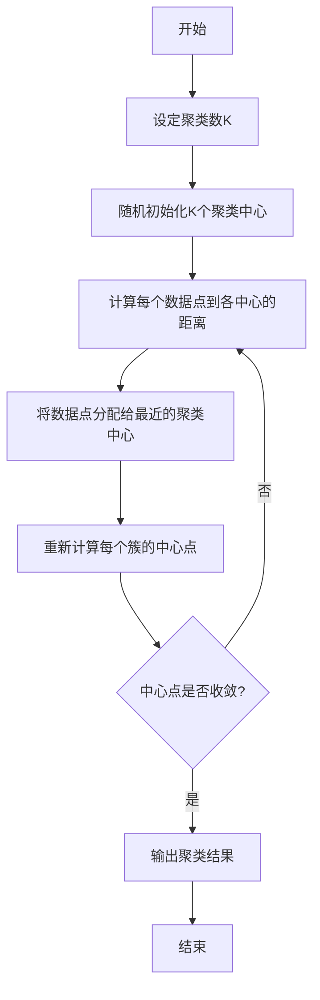

# 1.3.1 K-means聚类算法

## 学习目标

通过本节学习，你将能够：
- 理解聚类分析的基本概念和应用场景
- 掌握K-means算法的核心思想和实现步骤
- 学会使用肘部法则确定最优聚类数K
- 实现完整的客户分群分析项目
- 了解K-means算法的优缺点和适用场景

## 1. 聚类分析基础

### 1.1 什么是聚类

聚类是无监督学习的一种重要方法，其目标是将数据集中的样本分成若干个组（簇），使得：
- **簇内相似性高**：同一簇内的数据点尽可能相似
- **簇间相似性低**：不同簇之间的数据点尽可能不同

### 1.2 聚类的应用场景

```python
# 常见聚类应用场景
applications = {
    "客户分群": "根据购买行为将客户分为不同群体",
    "市场细分": "识别不同的目标市场和用户群体",
    "图像分割": "将图像分割成不同的区域或对象",
    "基因分析": "根据基因表达模式对基因进行分类",
    "社交网络": "发现社交网络中的社区结构",
    "异常检测": "识别与正常模式不符的异常数据"
}
```

## 2. K-means算法原理

### 2.1 算法核心思想

K-means算法的核心思想是：**将数据分成K个簇，使得每个数据点到其所属簇中心的距离平方和最小**。

### 2.2 算法步骤



### 2.3 数学表达

**目标函数**（最小化簇内平方和）：
$$J = \sum_{i=1}^{k} \sum_{x \in C_i} ||x - \mu_i||^2$$

其中：
- $k$ 是聚类数
- $C_i$ 是第i个簇
- $\mu_i$ 是第i个簇的中心点
- $||x - \mu_i||^2$ 是欧几里得距离的平方

**中心点更新公式**：
$$\mu_i = \frac{1}{|C_i|} \sum_{x \in C_i} x$$

## 3. K-means算法实现

### 3.1 基础实现

```python
import numpy as np
import matplotlib.pyplot as plt
from sklearn.datasets import make_blobs
from sklearn.cluster import KMeans
import seaborn as sns
from matplotlib.colors import ListedColormap

class SimpleKMeans:
    """简单的K-means聚类实现"""
    
    def __init__(self, k=3, max_iters=100, random_state=42):
        self.k = k
        self.max_iters = max_iters
        self.random_state = random_state
        
    def fit(self, X):
        """训练K-means模型"""
        np.random.seed(self.random_state)
        
        # 初始化聚类中心
        n_samples, n_features = X.shape
        self.centroids = X[np.random.choice(n_samples, self.k, replace=False)]
        
        # 存储训练历史
        self.history = {'centroids': [self.centroids.copy()], 'inertia': []}
        
        for iteration in range(self.max_iters):
            # 分配数据点到最近的聚类中心
            distances = self._calculate_distances(X)
            self.labels_ = np.argmin(distances, axis=1)
            
            # 更新聚类中心
            new_centroids = np.zeros((self.k, n_features))
            for i in range(self.k):
                if np.sum(self.labels_ == i) > 0:
                    new_centroids[i] = X[self.labels_ == i].mean(axis=0)
                else:
                    new_centroids[i] = self.centroids[i]
            
            # 检查收敛
            if np.allclose(self.centroids, new_centroids):
                print(f"算法在第{iteration+1}次迭代后收敛")
                break
                
            self.centroids = new_centroids
            self.history['centroids'].append(self.centroids.copy())
            
            # 计算簇内平方和
            inertia = self._calculate_inertia(X)
            self.history['inertia'].append(inertia)
        
        self.inertia_ = self._calculate_inertia(X)
        return self
    
    def _calculate_distances(self, X):
        """计算数据点到各聚类中心的距离"""
        distances = np.zeros((X.shape[0], self.k))
        for i, centroid in enumerate(self.centroids):
            distances[:, i] = np.sqrt(np.sum((X - centroid) ** 2, axis=1))
        return distances
    
    def _calculate_inertia(self, X):
        """计算簇内平方和"""
        inertia = 0
        for i in range(self.k):
            cluster_points = X[self.labels_ == i]
            if len(cluster_points) > 0:
                inertia += np.sum((cluster_points - self.centroids[i]) ** 2)
        return inertia
    
    def predict(self, X):
        """预测新数据点的聚类标签"""
        distances = self._calculate_distances(X)
        return np.argmin(distances, axis=1)
    
    def fit_predict(self, X):
        """训练并预测"""
        return self.fit(X).labels_

# 生成示例数据
np.random.seed(42)
X, y_true = make_blobs(n_samples=300, centers=4, cluster_std=0.60, 
                       random_state=42, center_box=(-10.0, 10.0))

print("数据集信息：")
print(f"样本数量: {X.shape[0]}")
print(f"特征维度: {X.shape[1]}")
print(f"真实聚类数: {len(np.unique(y_true))}")
```

### 3.2 算法训练和可视化

```python
# 训练K-means模型
kmeans = SimpleKMeans(k=4, max_iters=100)
kmeans.fit(X)

print(f"\n训练结果：")
print(f"最终簇内平方和: {kmeans.inertia_:.2f}")
print(f"聚类中心:\n{kmeans.centroids}")

# 可视化聚类结果
fig, axes = plt.subplots(2, 2, figsize=(15, 12))

# 原始数据
axes[0, 0].scatter(X[:, 0], X[:, 1], c=y_true, cmap='viridis', alpha=0.7)
axes[0, 0].set_title('原始数据（真实标签）', fontsize=14)
axes[0, 0].set_xlabel('特征1')
axes[0, 0].set_ylabel('特征2')
axes[0, 0].grid(True, alpha=0.3)

# K-means聚类结果
axes[0, 1].scatter(X[:, 0], X[:, 1], c=kmeans.labels_, cmap='viridis', alpha=0.7)
axes[0, 1].scatter(kmeans.centroids[:, 0], kmeans.centroids[:, 1], 
                   c='red', marker='x', s=200, linewidths=3, label='聚类中心')
axes[0, 1].set_title('K-means聚类结果', fontsize=14)
axes[0, 1].set_xlabel('特征1')
axes[0, 1].set_ylabel('特征2')
axes[0, 1].legend()
axes[0, 1].grid(True, alpha=0.3)

# 训练过程中的簇内平方和变化
if kmeans.history['inertia']:
    axes[1, 0].plot(range(1, len(kmeans.history['inertia']) + 1), 
                    kmeans.history['inertia'], 'bo-')
    axes[1, 0].set_title('训练过程中簇内平方和的变化', fontsize=14)
    axes[1, 0].set_xlabel('迭代次数')
    axes[1, 0].set_ylabel('簇内平方和')
    axes[1, 0].grid(True, alpha=0.3)

# 聚类中心的移动轨迹
colors = ['red', 'blue', 'green', 'orange']
for i in range(kmeans.k):
    centroid_history = [centroids[i] for centroids in kmeans.history['centroids']]
    centroid_history = np.array(centroid_history)
    axes[1, 1].plot(centroid_history[:, 0], centroid_history[:, 1], 
                     'o-', color=colors[i], label=f'中心{i+1}', linewidth=2, markersize=6)
    axes[1, 1].scatter(centroid_history[-1, 0], centroid_history[-1, 1], 
                       color=colors[i], s=200, marker='*', edgecolor='black')

axes[1, 1].scatter(X[:, 0], X[:, 1], c=kmeans.labels_, cmap='viridis', alpha=0.3)
axes[1, 1].set_title('聚类中心移动轨迹', fontsize=14)
axes[1, 1].set_xlabel('特征1')
axes[1, 1].set_ylabel('特征2')
axes[1, 1].legend()
axes[1, 1].grid(True, alpha=0.3)

plt.tight_layout()
plt.show()
```

## 4. 确定最优聚类数K

### 4.1 肘部法则（Elbow Method）

```python
def elbow_method(X, max_k=10):
    """使用肘部法则确定最优K值"""
    inertias = []
    k_range = range(1, max_k + 1)
    
    for k in k_range:
        kmeans = SimpleKMeans(k=k, random_state=42)
        kmeans.fit(X)
        inertias.append(kmeans.inertia_)
    
    return k_range, inertias

# 计算不同K值的簇内平方和
k_range, inertias = elbow_method(X, max_k=10)

# 可视化肘部法则
plt.figure(figsize=(12, 5))

# 肘部法则图
plt.subplot(1, 2, 1)
plt.plot(k_range, inertias, 'bo-', linewidth=2, markersize=8)
plt.xlabel('聚类数 K', fontsize=12)
plt.ylabel('簇内平方和 (WCSS)', fontsize=12)
plt.title('肘部法则确定最优K值', fontsize=14)
plt.grid(True, alpha=0.3)

# 标注可能的最优K值
optimal_k = 4  # 根据肘部法则判断
plt.axvline(x=optimal_k, color='red', linestyle='--', alpha=0.7, label=f'最优K={optimal_k}')
plt.legend()

# 计算相邻K值的改善程度
improvements = []
for i in range(1, len(inertias)):
    improvement = inertias[i-1] - inertias[i]
    improvements.append(improvement)

plt.subplot(1, 2, 2)
plt.plot(k_range[1:], improvements, 'ro-', linewidth=2, markersize=8)
plt.xlabel('聚类数 K', fontsize=12)
plt.ylabel('WCSS改善程度', fontsize=12)
plt.title('相邻K值的改善程度', fontsize=14)
plt.grid(True, alpha=0.3)

plt.tight_layout()
plt.show()

print("不同K值的簇内平方和：")
for k, inertia in zip(k_range, inertias):
    print(f"K={k}: WCSS={inertia:.2f}")
```

### 4.2 轮廓系数法

```python
from sklearn.metrics import silhouette_score, silhouette_samples

def silhouette_analysis(X, max_k=10):
    """使用轮廓系数分析最优K值"""
    silhouette_scores = []
    k_range = range(2, max_k + 1)  # 轮廓系数至少需要2个簇
    
    for k in k_range:
        kmeans = SimpleKMeans(k=k, random_state=42)
        labels = kmeans.fit_predict(X)
        score = silhouette_score(X, labels)
        silhouette_scores.append(score)
    
    return k_range, silhouette_scores

# 计算轮廓系数
k_range_sil, silhouette_scores = silhouette_analysis(X, max_k=10)

# 可视化轮廓系数
plt.figure(figsize=(12, 5))

plt.subplot(1, 2, 1)
plt.plot(k_range_sil, silhouette_scores, 'go-', linewidth=2, markersize=8)
plt.xlabel('聚类数 K', fontsize=12)
plt.ylabel('平均轮廓系数', fontsize=12)
plt.title('轮廓系数法确定最优K值', fontsize=14)
plt.grid(True, alpha=0.3)

# 标注最优K值
best_k = k_range_sil[np.argmax(silhouette_scores)]
plt.axvline(x=best_k, color='red', linestyle='--', alpha=0.7, label=f'最优K={best_k}')
plt.legend()

# 详细的轮廓分析（以K=4为例）
kmeans_optimal = SimpleKMeans(k=4, random_state=42)
labels_optimal = kmeans_optimal.fit_predict(X)
silhouette_avg = silhouette_score(X, labels_optimal)
sample_silhouette_values = silhouette_samples(X, labels_optimal)

plt.subplot(1, 2, 2)
y_lower = 10
colors = ['red', 'blue', 'green', 'orange']

for i in range(4):
    cluster_silhouette_values = sample_silhouette_values[labels_optimal == i]
    cluster_silhouette_values.sort()
    
    size_cluster_i = cluster_silhouette_values.shape[0]
    y_upper = y_lower + size_cluster_i
    
    plt.fill_betweenx(np.arange(y_lower, y_upper), 0, cluster_silhouette_values,
                      facecolor=colors[i], edgecolor=colors[i], alpha=0.7)
    
    plt.text(-0.05, y_lower + 0.5 * size_cluster_i, str(i))
    y_lower = y_upper + 10

plt.axvline(x=silhouette_avg, color="red", linestyle="--", 
            label=f'平均轮廓系数 = {silhouette_avg:.3f}')
plt.xlabel('轮廓系数值', fontsize=12)
plt.ylabel('簇标签', fontsize=12)
plt.title('各簇的轮廓系数分布 (K=4)', fontsize=14)
plt.legend()

plt.tight_layout()
plt.show()

print("\n轮廓系数分析结果：")
for k, score in zip(k_range_sil, silhouette_scores):
    print(f"K={k}: 轮廓系数={score:.3f}")
print(f"\n推荐的最优K值: {best_k}")
```

## 5. 实际应用案例：客户分群分析

### 5.1 数据准备

```python
# 生成客户数据
np.random.seed(42)
n_customers = 1000

# 客户特征：年龄、年收入、消费频率、平均订单金额
customer_data = {
    'age': np.random.normal(35, 12, n_customers),
    'annual_income': np.random.normal(50000, 20000, n_customers),
    'purchase_frequency': np.random.poisson(12, n_customers),
    'avg_order_value': np.random.normal(150, 50, n_customers)
}

# 创建DataFrame
import pandas as pd
customer_df = pd.DataFrame(customer_data)

# 数据清洗
customer_df['age'] = np.clip(customer_df['age'], 18, 80)
customer_df['annual_income'] = np.clip(customer_df['annual_income'], 20000, 150000)
customer_df['purchase_frequency'] = np.clip(customer_df['purchase_frequency'], 1, 50)
customer_df['avg_order_value'] = np.clip(customer_df['avg_order_value'], 20, 500)

print("客户数据概览：")
print(customer_df.describe())

# 数据标准化
from sklearn.preprocessing import StandardScaler

scaler = StandardScaler()
X_scaled = scaler.fit_transform(customer_df)

print("\n标准化后的数据形状:", X_scaled.shape)
```

### 5.2 客户分群实现

```python
class CustomerSegmentation:
    """客户分群分析系统"""
    
    def __init__(self, n_clusters=4):
        self.n_clusters = n_clusters
        self.kmeans = None
        self.scaler = StandardScaler()
        self.feature_names = None
        
    def fit(self, data, feature_names=None):
        """训练客户分群模型"""
        self.feature_names = feature_names or [f'feature_{i}' for i in range(data.shape[1])]
        
        # 数据标准化
        X_scaled = self.scaler.fit_transform(data)
        
        # K-means聚类
        self.kmeans = SimpleKMeans(k=self.n_clusters, random_state=42)
        self.labels_ = self.kmeans.fit_predict(X_scaled)
        
        return self
    
    def predict(self, data):
        """预测新客户的分群"""
        X_scaled = self.scaler.transform(data)
        return self.kmeans.predict(X_scaled)
    
    def analyze_segments(self, data):
        """分析各客户群体的特征"""
        df = pd.DataFrame(data, columns=self.feature_names)
        df['segment'] = self.labels_
        
        segment_analysis = {}
        
        for segment in range(self.n_clusters):
            segment_data = df[df['segment'] == segment]
            
            analysis = {
                'size': len(segment_data),
                'percentage': len(segment_data) / len(df) * 100,
                'characteristics': {}
            }
            
            for feature in self.feature_names:
                analysis['characteristics'][feature] = {
                    'mean': segment_data[feature].mean(),
                    'std': segment_data[feature].std(),
                    'min': segment_data[feature].min(),
                    'max': segment_data[feature].max()
                }
            
            segment_analysis[f'segment_{segment}'] = analysis
        
        return segment_analysis
    
    def visualize_segments(self, data):
        """可视化客户分群结果"""
        df = pd.DataFrame(data, columns=self.feature_names)
        df['segment'] = self.labels_
        
        # 创建子图
        n_features = len(self.feature_names)
        fig, axes = plt.subplots(2, 2, figsize=(15, 12))
        axes = axes.ravel()
        
        colors = ['red', 'blue', 'green', 'orange', 'purple']
        
        # 特征对比图
        for i in range(min(4, n_features)):
            for segment in range(self.n_clusters):
                segment_data = df[df['segment'] == segment]
                axes[i].scatter(segment_data.index, segment_data[self.feature_names[i]], 
                               c=colors[segment], alpha=0.6, label=f'群体{segment}', s=30)
            
            axes[i].set_title(f'{self.feature_names[i]} 分布', fontsize=12)
            axes[i].set_xlabel('客户ID')
            axes[i].set_ylabel(self.feature_names[i])
            axes[i].legend()
            axes[i].grid(True, alpha=0.3)
        
        plt.tight_layout()
        plt.show()
        
        # 箱线图对比
        fig, axes = plt.subplots(2, 2, figsize=(15, 10))
        axes = axes.ravel()
        
        for i, feature in enumerate(self.feature_names[:4]):
            df.boxplot(column=feature, by='segment', ax=axes[i])
            axes[i].set_title(f'{feature} 按群体分布')
            axes[i].set_xlabel('客户群体')
            axes[i].set_ylabel(feature)
        
        plt.suptitle('各客户群体特征对比', fontsize=16)
        plt.tight_layout()
        plt.show()

# 执行客户分群
segmentation = CustomerSegmentation(n_clusters=4)
segmentation.fit(customer_df.values, customer_df.columns.tolist())

# 分析结果
segment_analysis = segmentation.analyze_segments(customer_df.values)

print("客户分群分析结果：")
for segment_name, analysis in segment_analysis.items():
    print(f"\n{segment_name.upper()}:")
    print(f"  客户数量: {analysis['size']} ({analysis['percentage']:.1f}%)")
    print("  特征均值:")
    for feature, stats in analysis['characteristics'].items():
        print(f"    {feature}: {stats['mean']:.2f} (±{stats['std']:.2f})")
```

### 5.3 分群结果可视化

```python
# 可视化分群结果
segmentation.visualize_segments(customer_df.values)

# 创建客户群体标签
segment_labels = {
    0: "高价值客户",
    1: "潜力客户", 
    2: "普通客户",
    3: "流失风险客户"
}

# 详细的分群特征分析
df_with_segments = customer_df.copy()
df_with_segments['segment'] = segmentation.labels_
df_with_segments['segment_name'] = df_with_segments['segment'].map(segment_labels)

# 各群体的业务特征
print("\n各客户群体的业务特征：")
for segment_id, segment_name in segment_labels.items():
    segment_data = df_with_segments[df_with_segments['segment'] == segment_id]
    
    print(f"\n{segment_name} (群体{segment_id}):")
    print(f"  客户数量: {len(segment_data)}")
    print(f"  平均年龄: {segment_data['age'].mean():.1f}岁")
    print(f"  平均年收入: ¥{segment_data['annual_income'].mean():,.0f}")
    print(f"  平均购买频率: {segment_data['purchase_frequency'].mean():.1f}次/年")
    print(f"  平均订单金额: ¥{segment_data['avg_order_value'].mean():.0f}")
    
    # 计算客户生命周期价值 (CLV)
    clv = segment_data['purchase_frequency'] * segment_data['avg_order_value']
    print(f"  平均年度价值: ¥{clv.mean():,.0f}")

# 营销建议
marketing_strategies = {
    "高价值客户": "VIP服务、个性化推荐、忠诚度奖励",
    "潜力客户": "促销活动、产品推荐、提升购买频率",
    "普通客户": "标准服务、定期沟通、交叉销售",
    "流失风险客户": "挽回活动、特别优惠、重新激活"
}

print("\n营销策略建议：")
for segment_name, strategy in marketing_strategies.items():
    print(f"{segment_name}: {strategy}")
```

## 6. 算法优化和变体

### 6.1 K-means++初始化

```python
class KMeansPlusPlus:
    """使用K-means++初始化的改进版本"""
    
    def __init__(self, k=3, max_iters=100, random_state=42):
        self.k = k
        self.max_iters = max_iters
        self.random_state = random_state
        
    def _kmeans_plus_plus_init(self, X):
        """K-means++初始化方法"""
        np.random.seed(self.random_state)
        n_samples, n_features = X.shape
        centroids = np.zeros((self.k, n_features))
        
        # 随机选择第一个中心点
        centroids[0] = X[np.random.randint(n_samples)]
        
        # 选择剩余的中心点
        for i in range(1, self.k):
            # 计算每个点到最近中心的距离平方
            distances = np.array([min([np.sum((x - c)**2) for c in centroids[:i]]) for x in X])
            
            # 按距离平方的概率选择下一个中心
            probabilities = distances / distances.sum()
            cumulative_probabilities = probabilities.cumsum()
            r = np.random.rand()
            
            for j, p in enumerate(cumulative_probabilities):
                if r < p:
                    centroids[i] = X[j]
                    break
        
        return centroids
    
    def fit(self, X):
        """使用K-means++初始化训练模型"""
        # 使用K-means++初始化
        self.centroids = self._kmeans_plus_plus_init(X)
        
        # 其余步骤与标准K-means相同
        for iteration in range(self.max_iters):
            # 分配数据点
            distances = np.sqrt(((X - self.centroids[:, np.newaxis])**2).sum(axis=2))
            self.labels_ = np.argmin(distances, axis=0)
            
            # 更新中心点
            new_centroids = np.array([X[self.labels_ == i].mean(axis=0) 
                                    for i in range(self.k)])
            
            # 检查收敛
            if np.allclose(self.centroids, new_centroids):
                break
                
            self.centroids = new_centroids
        
        return self
    
    def predict(self, X):
        distances = np.sqrt(((X - self.centroids[:, np.newaxis])**2).sum(axis=2))
        return np.argmin(distances, axis=0)

# 比较不同初始化方法
fig, axes = plt.subplots(1, 3, figsize=(18, 6))

# 生成测试数据
X_test, _ = make_blobs(n_samples=300, centers=3, cluster_std=1.0, random_state=42)

# 标准K-means（随机初始化）
kmeans_standard = SimpleKMeans(k=3, random_state=42)
kmeans_standard.fit(X_test)

axes[0].scatter(X_test[:, 0], X_test[:, 1], c=kmeans_standard.labels_, cmap='viridis', alpha=0.7)
axes[0].scatter(kmeans_standard.centroids[:, 0], kmeans_standard.centroids[:, 1], 
               c='red', marker='x', s=200, linewidths=3)
axes[0].set_title(f'标准K-means\n簇内平方和: {kmeans_standard.inertia_:.2f}', fontsize=12)
axes[0].grid(True, alpha=0.3)

# K-means++初始化
kmeans_plus = KMeansPlusPlus(k=3, random_state=42)
kmeans_plus.fit(X_test)

axes[1].scatter(X_test[:, 0], X_test[:, 1], c=kmeans_plus.labels_, cmap='viridis', alpha=0.7)
axes[1].scatter(kmeans_plus.centroids[:, 0], kmeans_plus.centroids[:, 1], 
               c='red', marker='x', s=200, linewidths=3)
axes[1].set_title('K-means++初始化', fontsize=12)
axes[1].grid(True, alpha=0.3)

# sklearn实现对比
from sklearn.cluster import KMeans as SklearnKMeans
sklearn_kmeans = SklearnKMeans(n_clusters=3, init='k-means++', random_state=42)
sklearn_labels = sklearn_kmeans.fit_predict(X_test)

axes[2].scatter(X_test[:, 0], X_test[:, 1], c=sklearn_labels, cmap='viridis', alpha=0.7)
axes[2].scatter(sklearn_kmeans.cluster_centers_[:, 0], sklearn_kmeans.cluster_centers_[:, 1], 
               c='red', marker='x', s=200, linewidths=3)
axes[2].set_title(f'Sklearn K-means\n簇内平方和: {sklearn_kmeans.inertia_:.2f}', fontsize=12)
axes[2].grid(True, alpha=0.3)

plt.tight_layout()
plt.show()
```

### 6.2 Mini-batch K-means

```python
class MiniBatchKMeans:
    """Mini-batch K-means实现（适用于大数据集）"""
    
    def __init__(self, k=3, batch_size=100, max_iters=100, random_state=42):
        self.k = k
        self.batch_size = batch_size
        self.max_iters = max_iters
        self.random_state = random_state
        
    def fit(self, X):
        """使用mini-batch方法训练"""
        np.random.seed(self.random_state)
        n_samples, n_features = X.shape
        
        # 初始化聚类中心
        self.centroids = X[np.random.choice(n_samples, self.k, replace=False)]
        
        # 记录每个中心点的更新次数
        center_counts = np.zeros(self.k)
        
        for iteration in range(self.max_iters):
            # 随机选择一个mini-batch
            batch_indices = np.random.choice(n_samples, 
                                           min(self.batch_size, n_samples), 
                                           replace=False)
            batch = X[batch_indices]
            
            # 为batch中的每个点分配最近的中心
            distances = np.sqrt(((batch - self.centroids[:, np.newaxis])**2).sum(axis=2))
            labels = np.argmin(distances, axis=0)
            
            # 更新聚类中心（使用移动平均）
            for i in range(self.k):
                mask = labels == i
                if np.sum(mask) > 0:
                    center_counts[i] += np.sum(mask)
                    eta = 1.0 / center_counts[i]  # 学习率
                    self.centroids[i] = (1 - eta) * self.centroids[i] + eta * batch[mask].mean(axis=0)
        
        # 最终分配所有数据点
        distances = np.sqrt(((X - self.centroids[:, np.newaxis])**2).sum(axis=2))
        self.labels_ = np.argmin(distances, axis=0)
        
        return self
    
    def predict(self, X):
        distances = np.sqrt(((X - self.centroids[:, np.newaxis])**2).sum(axis=2))
        return np.argmin(distances, axis=0)

# 性能对比测试
print("算法性能对比：")

# 生成大数据集
large_X, _ = make_blobs(n_samples=5000, centers=5, cluster_std=2.0, random_state=42)

import time

# 标准K-means
start_time = time.time()
standard_kmeans = SimpleKMeans(k=5)
standard_kmeans.fit(large_X)
standard_time = time.time() - start_time

# Mini-batch K-means
start_time = time.time()
minibatch_kmeans = MiniBatchKMeans(k=5, batch_size=200)
minibatch_kmeans.fit(large_X)
minibatch_time = time.time() - start_time

print(f"标准K-means训练时间: {standard_time:.3f}秒")
print(f"Mini-batch K-means训练时间: {minibatch_time:.3f}秒")
print(f"速度提升: {standard_time/minibatch_time:.1f}倍")
```

## 7. Trae风格实现

```python
class TraeKMeans:
    """Trae风格的K-means聚类实现"""
    
    def __init__(self, n_clusters=3, init='k-means++', max_iter=300, 
                 tol=1e-4, random_state=None, verbose=True):
        self.n_clusters = n_clusters
        self.init = init
        self.max_iter = max_iter
        self.tol = tol
        self.random_state = random_state
        self.verbose = verbose
        
        # Trae特色：训练历史记录
        self.training_history = {
            'inertia': [],
            'centroids_movement': [],
            'iteration_times': []
        }
    
    def trae_fit(self, X, feature_names=None):
        """Trae风格的训练方法"""
        if self.verbose:
            print("🚀 Trae K-means 聚类训练开始")
            print(f"📊 数据集信息: {X.shape[0]} 样本, {X.shape[1]} 特征")
            print(f"🎯 目标聚类数: {self.n_clusters}")
        
        self.feature_names_ = feature_names or [f'特征_{i+1}' for i in range(X.shape[1])]
        
        # 初始化
        np.random.seed(self.random_state)
        if self.init == 'k-means++':
            self.cluster_centers_ = self._trae_kmeans_plus_plus_init(X)
        else:
            self.cluster_centers_ = X[np.random.choice(X.shape[0], self.n_clusters, replace=False)]
        
        prev_inertia = float('inf')
        
        for iteration in range(self.max_iter):
            start_time = time.time()
            
            # 分配步骤
            distances = self._trae_calculate_distances(X)
            self.labels_ = np.argmin(distances, axis=1)
            
            # 更新步骤
            new_centers = np.zeros_like(self.cluster_centers_)
            for k in range(self.n_clusters):
                mask = self.labels_ == k
                if np.sum(mask) > 0:
                    new_centers[k] = X[mask].mean(axis=0)
                else:
                    new_centers[k] = self.cluster_centers_[k]
            
            # 计算中心点移动距离
            movement = np.sqrt(np.sum((new_centers - self.cluster_centers_) ** 2))
            self.cluster_centers_ = new_centers
            
            # 计算簇内平方和
            inertia = self._trae_calculate_inertia(X)
            
            # 记录训练历史
            iteration_time = time.time() - start_time
            self.training_history['inertia'].append(inertia)
            self.training_history['centroids_movement'].append(movement)
            self.training_history['iteration_times'].append(iteration_time)
            
            if self.verbose and (iteration + 1) % 10 == 0:
                print(f"📈 迭代 {iteration + 1}: 簇内平方和={inertia:.2f}, 中心移动={movement:.4f}")
            
            # 收敛检查
            if abs(prev_inertia - inertia) < self.tol:
                if self.verbose:
                    print(f"✅ 算法在第 {iteration + 1} 次迭代后收敛")
                break
            
            prev_inertia = inertia
        
        self.inertia_ = inertia
        self.n_iter_ = iteration + 1
        
        if self.verbose:
            print(f"🎉 训练完成! 最终簇内平方和: {self.inertia_:.2f}")
            print(f"⏱️  总训练时间: {sum(self.training_history['iteration_times']):.3f}秒")
        
        return self
    
    def _trae_kmeans_plus_plus_init(self, X):
        """Trae实现的K-means++初始化"""
        if self.verbose:
            print("🎲 使用K-means++智能初始化...")
        
        n_samples, n_features = X.shape
        centers = np.zeros((self.n_clusters, n_features))
        
        # 第一个中心随机选择
        centers[0] = X[np.random.randint(n_samples)]
        
        for i in range(1, self.n_clusters):
            # 计算到最近中心的距离平方
            distances = np.array([min([np.sum((x - c)**2) for c in centers[:i]]) for x in X])
            
            # 按概率选择下一个中心
            probabilities = distances / distances.sum()
            cumulative_probs = probabilities.cumsum()
            r = np.random.rand()
            
            for j, p in enumerate(cumulative_probs):
                if r < p:
                    centers[i] = X[j]
                    break
        
        return centers
    
    def _trae_calculate_distances(self, X):
        """计算距离矩阵"""
        distances = np.zeros((X.shape[0], self.n_clusters))
        for i, center in enumerate(self.cluster_centers_):
            distances[:, i] = np.sqrt(np.sum((X - center) ** 2, axis=1))
        return distances
    
    def _trae_calculate_inertia(self, X):
        """计算簇内平方和"""
        inertia = 0
        for k in range(self.n_clusters):
            mask = self.labels_ == k
            if np.sum(mask) > 0:
                inertia += np.sum((X[mask] - self.cluster_centers_[k]) ** 2)
        return inertia
    
    def trae_predict(self, X):
        """Trae风格的预测方法"""
        distances = self._trae_calculate_distances(X)
        predictions = np.argmin(distances, axis=1)
        
        if self.verbose:
            print(f"🔮 预测完成: {X.shape[0]} 个样本")
            for k in range(self.n_clusters):
                count = np.sum(predictions == k)
                print(f"   簇 {k}: {count} 个样本 ({count/len(predictions)*100:.1f}%)")
        
        return predictions
    
    def trae_visualize_training(self):
        """可视化训练过程"""
        fig, axes = plt.subplots(1, 3, figsize=(18, 5))
        
        # 簇内平方和变化
        axes[0].plot(self.training_history['inertia'], 'b-o', linewidth=2, markersize=6)
        axes[0].set_title('📈 簇内平方和变化', fontsize=14)
        axes[0].set_xlabel('迭代次数')
        axes[0].set_ylabel('簇内平方和')
        axes[0].grid(True, alpha=0.3)
        
        # 中心点移动距离
        axes[1].plot(self.training_history['centroids_movement'], 'r-o', linewidth=2, markersize=6)
        axes[1].set_title('🎯 聚类中心移动距离', fontsize=14)
        axes[1].set_xlabel('迭代次数')
        axes[1].set_ylabel('移动距离')
        axes[1].grid(True, alpha=0.3)
        
        # 每次迭代时间
        axes[2].bar(range(len(self.training_history['iteration_times'])), 
                   self.training_history['iteration_times'], alpha=0.7, color='green')
        axes[2].set_title('⏱️ 每次迭代耗时', fontsize=14)
        axes[2].set_xlabel('迭代次数')
        axes[2].set_ylabel('时间 (秒)')
        axes[2].grid(True, alpha=0.3)
        
        plt.tight_layout()
        plt.show()
    
    def trae_cluster_analysis(self, X, detailed=True):
        """Trae风格的聚类分析"""
        print("📊 Trae 聚类分析报告")
        print("=" * 50)
        
        analysis_results = {}
        
        for k in range(self.n_clusters):
            mask = self.labels_ == k
            cluster_data = X[mask]
            
            if len(cluster_data) == 0:
                continue
            
            print(f"\n🏷️  簇 {k} 分析:")
            print(f"   样本数量: {len(cluster_data)} ({len(cluster_data)/len(X)*100:.1f}%)")
            
            cluster_analysis = {
                'size': len(cluster_data),
                'percentage': len(cluster_data)/len(X)*100,
                'center': self.cluster_centers_[k],
                'features': {}
            }
            
            if detailed:
                print(f"   聚类中心: [{', '.join([f'{x:.2f}' for x in self.cluster_centers_[k]])}]")
                
                for i, feature_name in enumerate(self.feature_names_):
                    feature_values = cluster_data[:, i]
                    feature_stats = {
                        'mean': np.mean(feature_values),
                        'std': np.std(feature_values),
                        'min': np.min(feature_values),
                        'max': np.max(feature_values)
                    }
                    
                    cluster_analysis['features'][feature_name] = feature_stats
                    
                    print(f"   {feature_name}: 均值={feature_stats['mean']:.2f}, "
                          f"标准差={feature_stats['std']:.2f}")
            
            analysis_results[f'cluster_{k}'] = cluster_analysis
        
        print(f"\n📈 整体指标:")
        print(f"   簇内平方和: {self.inertia_:.2f}")
        print(f"   训练迭代次数: {self.n_iter_}")
        print(f"   平均每次迭代时间: {np.mean(self.training_history['iteration_times']):.4f}秒")
        
        return analysis_results

# Trae K-means 使用示例
print("🎯 Trae K-means 聚类演示")
print("=" * 40)

# 使用之前的客户数据
trae_kmeans = TraeKMeans(n_clusters=4, init='k-means++', random_state=42, verbose=True)
trae_kmeans.trae_fit(customer_df.values, customer_df.columns.tolist())

# 可视化训练过程
trae_kmeans.trae_visualize_training()

# 详细分析
analysis = trae_kmeans.trae_cluster_analysis(customer_df.values, detailed=True)

# 预测新客户
new_customers = np.array([
    [25, 30000, 5, 80],   # 年轻低收入客户
    [45, 80000, 20, 200], # 中年高价值客户
    [35, 50000, 12, 150]  # 普通客户
])

print("\n🔮 新客户分群预测:")
predictions = trae_kmeans.trae_predict(new_customers)
for i, (customer, pred) in enumerate(zip(new_customers, predictions)):
    print(f"客户{i+1} {customer} -> 簇 {pred}")
```

## 8. 思考题

1. **K值选择**: 除了肘部法则和轮廓系数，还有哪些方法可以确定最优的K值？各有什么优缺点？

2. **初始化敏感性**: 为什么K-means算法对初始化敏感？K-means++是如何解决这个问题的？

3. **距离度量**: K-means默认使用欧几里得距离，在什么情况下应该考虑使用其他距离度量（如曼哈顿距离、余弦距离）？

4. **数据预处理**: 为什么在K-means聚类前通常需要对数据进行标准化？不标准化会产生什么问题？

5. **算法局限性**: K-means算法在处理什么类型的数据分布时效果不佳？应该如何改进？

## 9. 小结

### 9.1 K-means核心优势

- **简单易懂**: 算法思想直观，易于理解和实现
- **计算高效**: 时间复杂度O(nkt)，适合大数据集
- **收敛保证**: 算法保证收敛到局部最优解
- **广泛应用**: 在客户分群、图像分割等领域应用广泛

### 9.2 关键技术要点

- **聚类数K的选择**: 肘部法则、轮廓系数法
- **初始化策略**: K-means++智能初始化
- **收敛判断**: 中心点移动距离或目标函数变化
- **性能优化**: Mini-batch方法处理大数据集

### 9.3 实际应用场景

- **客户分群**: 根据行为特征进行精准营销
- **市场细分**: 识别不同的目标市场
- **图像处理**: 图像分割和颜色量化
- **数据压缩**: 向量量化和特征降维

### 9.4 算法局限性

- **需要预设K值**: 聚类数需要事先确定
- **对初始化敏感**: 不同初始化可能得到不同结果
- **假设球形簇**: 对非球形分布效果不佳
- **对噪声敏感**: 异常值会影响聚类中心

### 9.5 使用建议

- **数据预处理**: 标准化数据，处理异常值
- **K值选择**: 结合业务需求和统计方法
- **多次运行**: 使用不同初始化多次运行取最佳结果
- **结果验证**: 结合业务知识验证聚类合理性

### 9.6 下一步学习

- **层次聚类**: 不需要预设聚类数的方法
- **密度聚类**: DBSCAN等处理任意形状簇的算法
- **谱聚类**: 处理非凸形状数据的高级方法
- **深度聚类**: 结合神经网络的现代聚类方法

---

**本节重点**: K-means是最基础也是最重要的聚类算法，掌握其原理和实现对理解其他聚类方法具有重要意义。在实际应用中，要注意数据预处理、参数选择和结果解释的重要性。