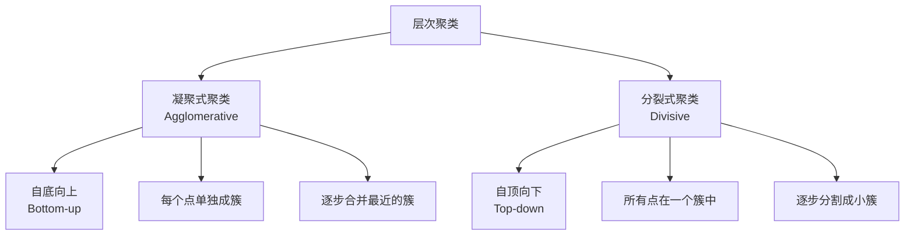
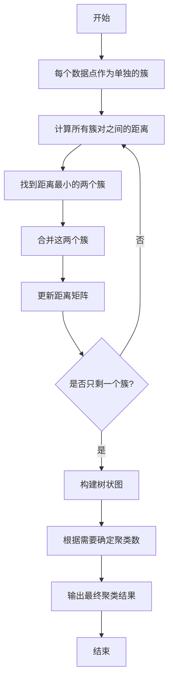

# 1.3.2 层次聚类算法

## 学习目标

通过本节学习，你将能够：
- 理解层次聚类的基本概念和两种策略
- 掌握凝聚式层次聚类的实现原理
- 学会使用树状图(Dendrogram)分析聚类结果
- 了解不同链接准则的特点和适用场景
- 实现完整的层次聚类分析项目

## 1. 层次聚类基础

### 1.1 什么是层次聚类

层次聚类是一种**不需要预先指定聚类数量**的聚类方法，它通过构建聚类的层次结构来揭示数据的内在组织形式。

### 1.2 层次聚类的两种策略



### 1.3 层次聚类的优势

```python
# 层次聚类 vs K-means 对比
comparison = {
    "特征": ["聚类数量", "算法复杂度", "结果稳定性", "簇形状适应性", "可解释性"],
    "层次聚类": ["无需预设", "O(n³)", "确定性", "任意形状", "树状图直观"],
    "K-means": ["需要预设K", "O(nkt)", "随机初始化", "球形簇", "中心点坐标"]
}

import pandas as pd
df_comparison = pd.DataFrame(comparison)
print("层次聚类 vs K-means 对比:")
print(df_comparison.to_string(index=False))
```

## 2. 凝聚式层次聚类原理

### 2.1 算法步骤



### 2.2 距离度量和链接准则

**簇间距离的计算方法**：

1. **单链接(Single Linkage)**: 两簇最近点间的距离
   $$d(C_i, C_j) = \min_{x \in C_i, y \in C_j} d(x, y)$$

2. **全链接(Complete Linkage)**: 两簇最远点间的距离
   $$d(C_i, C_j) = \max_{x \in C_i, y \in C_j} d(x, y)$$

3. **平均链接(Average Linkage)**: 两簇所有点对距离的平均
   $$d(C_i, C_j) = \frac{1}{|C_i||C_j|} \sum_{x \in C_i} \sum_{y \in C_j} d(x, y)$$

4. **Ward链接**: 最小化合并后的方差增加
   $$d(C_i, C_j) = \sqrt{\frac{2|C_i||C_j|}{|C_i|+|C_j|}} ||\mu_i - \mu_j||$$

## 3. 层次聚类实现

### 3.1 基础实现

```python
import numpy as np
import matplotlib.pyplot as plt
from sklearn.datasets import make_blobs
from scipy.cluster.hierarchy import dendrogram, linkage, fcluster
from scipy.spatial.distance import pdist, squareform
import seaborn as sns

class SimpleHierarchicalClustering:
    """简单的凝聚式层次聚类实现"""
    
    def __init__(self, linkage='single', metric='euclidean'):
        self.linkage = linkage
        self.metric = metric
        self.linkage_matrix_ = None
        self.labels_ = None
        
    def fit(self, X):
        """训练层次聚类模型"""
        n_samples = X.shape[0]
        
        # 计算距离矩阵
        distances = pdist(X, metric=self.metric)
        self.distance_matrix_ = squareform(distances)
        
        # 初始化：每个点为一个簇
        clusters = [[i] for i in range(n_samples)]
        linkage_matrix = []
        
        # 当前簇的数量
        current_cluster_id = n_samples
        
        while len(clusters) > 1:
            # 找到距离最小的两个簇
            min_dist = float('inf')
            merge_i, merge_j = -1, -1
            
            for i in range(len(clusters)):
                for j in range(i + 1, len(clusters)):
                    dist = self._calculate_cluster_distance(clusters[i], clusters[j], X)
                    if dist < min_dist:
                        min_dist = dist
                        merge_i, merge_j = i, j
            
            # 合并簇
            cluster_i = clusters[merge_i]
            cluster_j = clusters[merge_j]
            
            # 记录合并信息 [簇1, 簇2, 距离, 新簇大小]
            linkage_info = [
                merge_i if len(cluster_i) == 1 else cluster_i[0] + n_samples,
                merge_j if len(cluster_j) == 1 else cluster_j[0] + n_samples,
                min_dist,
                len(cluster_i) + len(cluster_j)
            ]
            linkage_matrix.append(linkage_info)
            
            # 创建新簇
            new_cluster = cluster_i + cluster_j
            
            # 移除旧簇（从后往前删除以避免索引问题）
            if merge_i > merge_j:
                clusters.pop(merge_i)
                clusters.pop(merge_j)
            else:
                clusters.pop(merge_j)
                clusters.pop(merge_i)
            
            # 添加新簇
            clusters.append(new_cluster)
            current_cluster_id += 1
        
        self.linkage_matrix_ = np.array(linkage_matrix)
        return self
    
    def _calculate_cluster_distance(self, cluster1, cluster2, X):
        """计算两个簇之间的距离"""
        points1 = X[cluster1]
        points2 = X[cluster2]
        
        if self.linkage == 'single':
            # 单链接：最小距离
            min_dist = float('inf')
            for p1 in points1:
                for p2 in points2:
                    dist = np.sqrt(np.sum((p1 - p2) ** 2))
                    min_dist = min(min_dist, dist)
            return min_dist
        
        elif self.linkage == 'complete':
            # 全链接：最大距离
            max_dist = 0
            for p1 in points1:
                for p2 in points2:
                    dist = np.sqrt(np.sum((p1 - p2) ** 2))
                    max_dist = max(max_dist, dist)
            return max_dist
        
        elif self.linkage == 'average':
            # 平均链接：平均距离
            total_dist = 0
            count = 0
            for p1 in points1:
                for p2 in points2:
                    dist = np.sqrt(np.sum((p1 - p2) ** 2))
                    total_dist += dist
                    count += 1
            return total_dist / count
        
        elif self.linkage == 'ward':
            # Ward链接：基于方差
            center1 = np.mean(points1, axis=0)
            center2 = np.mean(points2, axis=0)
            n1, n2 = len(points1), len(points2)
            
            return np.sqrt((2 * n1 * n2) / (n1 + n2)) * np.sqrt(np.sum((center1 - center2) ** 2))
    
    def fit_predict(self, X, n_clusters=2):
        """训练并预测指定数量的聚类"""
        self.fit(X)
        
        # 根据linkage matrix确定聚类标签
        # 这里简化实现，实际应该根据树的切割来确定
        from sklearn.cluster import AgglomerativeClustering
        agg_clustering = AgglomerativeClustering(n_clusters=n_clusters, linkage=self.linkage)
        self.labels_ = agg_clustering.fit_predict(X)
        
        return self.labels_

# 生成示例数据
np.random.seed(42)
X, y_true = make_blobs(n_samples=150, centers=3, cluster_std=1.0, 
                       random_state=42, center_box=(-5.0, 5.0))

print("数据集信息：")
print(f"样本数量: {X.shape[0]}")
print(f"特征维度: {X.shape[1]}")
print(f"真实聚类数: {len(np.unique(y_true))}")
```

### 3.2 不同链接准则的对比

```python
# 使用不同链接准则进行聚类
linkage_methods = ['single', 'complete', 'average', 'ward']
fig, axes = plt.subplots(2, 2, figsize=(15, 12))
axes = axes.ravel()

for i, method in enumerate(linkage_methods):
    # 使用scipy实现（更高效）
    Z = linkage(X, method=method)
    labels = fcluster(Z, t=3, criterion='maxclust')
    
    # 可视化聚类结果
    scatter = axes[i].scatter(X[:, 0], X[:, 1], c=labels, cmap='viridis', alpha=0.7)
    axes[i].set_title(f'{method.capitalize()} Linkage', fontsize=14)
    axes[i].set_xlabel('特征1')
    axes[i].set_ylabel('特征2')
    axes[i].grid(True, alpha=0.3)
    
    # 添加颜色条
    plt.colorbar(scatter, ax=axes[i])

plt.tight_layout()
plt.show()

# 链接准则特点分析
print("\n不同链接准则的特点：")
linkage_characteristics = {
    "Single Linkage": "容易产生链式效应，对噪声敏感，适合发现任意形状的簇",
    "Complete Linkage": "倾向于产生紧凑的球形簇，对异常值敏感",
    "Average Linkage": "平衡了single和complete的特点，较为稳定",
    "Ward Linkage": "最小化簇内方差，产生大小相近的球形簇"
}

for method, characteristic in linkage_characteristics.items():
    print(f"{method}: {characteristic}")
```

### 3.3 树状图(Dendrogram)分析

```python
def plot_dendrogram_analysis(X, max_clusters=10):
    """绘制和分析树状图"""
    fig, axes = plt.subplots(2, 2, figsize=(16, 12))
    
    linkage_methods = ['single', 'complete', 'average', 'ward']
    
    for i, method in enumerate(linkage_methods):
        row, col = i // 2, i % 2
        
        # 计算链接矩阵
        Z = linkage(X, method=method)
        
        # 绘制树状图
        dendrogram(Z, ax=axes[row, col], truncate_mode='level', p=5,
                  leaf_rotation=90, leaf_font_size=10)
        axes[row, col].set_title(f'{method.capitalize()} Linkage Dendrogram', fontsize=14)
        axes[row, col].set_xlabel('样本索引或簇大小')
        axes[row, col].set_ylabel('距离')
    
    plt.tight_layout()
    plt.show()
    
    # 详细分析Ward方法的树状图
    plt.figure(figsize=(15, 8))
    Z_ward = linkage(X, method='ward')
    
    # 绘制完整的树状图
    plt.subplot(1, 2, 1)
    dendrogram(Z_ward, leaf_rotation=90, leaf_font_size=8)
    plt.title('Ward Linkage - 完整树状图', fontsize=14)
    plt.xlabel('样本索引')
    plt.ylabel('距离')
    
    # 绘制截断的树状图
    plt.subplot(1, 2, 2)
    dendrogram(Z_ward, truncate_mode='lastp', p=12, leaf_rotation=90, 
              leaf_font_size=10, show_contracted=True)
    plt.title('Ward Linkage - 截断树状图', fontsize=14)
    plt.xlabel('簇大小')
    plt.ylabel('距离')
    
    plt.tight_layout()
    plt.show()
    
    return Z_ward

# 执行树状图分析
Z_ward = plot_dendrogram_analysis(X)

# 分析最优聚类数
def analyze_optimal_clusters(Z, max_clusters=10):
    """分析最优聚类数"""
    distances = Z[:, 2]  # 合并时的距离
    
    # 计算相邻合并步骤的距离差
    distance_diffs = np.diff(distances[::-1])  # 反向，从最后开始
    
    plt.figure(figsize=(12, 5))
    
    # 绘制合并距离图
    plt.subplot(1, 2, 1)
    plt.plot(range(1, len(distances) + 1), distances, 'bo-', linewidth=2, markersize=6)
    plt.title('层次聚类合并距离', fontsize=14)
    plt.xlabel('合并步骤')
    plt.ylabel('合并距离')
    plt.grid(True, alpha=0.3)
    
    # 绘制距离差异图（肘部法则）
    plt.subplot(1, 2, 2)
    n_clusters_range = range(2, min(max_clusters + 1, len(distance_diffs) + 2))
    plt.plot(n_clusters_range, distance_diffs[:len(n_clusters_range)], 'ro-', 
             linewidth=2, markersize=6)
    plt.title('相邻合并步骤距离差异', fontsize=14)
    plt.xlabel('聚类数')
    plt.ylabel('距离差异')
    plt.grid(True, alpha=0.3)
    
    # 标注可能的最优聚类数
    if len(distance_diffs) > 0:
        optimal_idx = np.argmax(distance_diffs[:min(8, len(distance_diffs))])
        optimal_clusters = optimal_idx + 2
        plt.axvline(x=optimal_clusters, color='red', linestyle='--', alpha=0.7, 
                   label=f'建议聚类数={optimal_clusters}')
        plt.legend()
    
    plt.tight_layout()
    plt.show()
    
    return optimal_clusters if len(distance_diffs) > 0 else 3

# 分析最优聚类数
optimal_k = analyze_optimal_clusters(Z_ward)
print(f"\n建议的最优聚类数: {optimal_k}")
```

## 4. 实际应用案例：基因表达数据聚类

### 4.1 数据准备

```python
# 模拟基因表达数据
np.random.seed(42)
n_genes = 100
n_samples = 20

# 创建不同类型的基因表达模式
# 类型1：高表达基因
high_expr = np.random.normal(8, 1, (25, n_samples))
# 类型2：中等表达基因
medium_expr = np.random.normal(5, 0.8, (35, n_samples))
# 类型3：低表达基因
low_expr = np.random.normal(2, 0.5, (25, n_samples))
# 类型4：可变表达基因
variable_expr = np.random.normal(5, 2, (15, n_samples))

# 合并数据
gene_expression = np.vstack([high_expr, medium_expr, low_expr, variable_expr])
true_gene_types = np.array([0]*25 + [1]*35 + [2]*25 + [3]*15)

# 添加一些噪声
gene_expression += np.random.normal(0, 0.1, gene_expression.shape)

print("基因表达数据信息：")
print(f"基因数量: {gene_expression.shape[0]}")
print(f"样本数量: {gene_expression.shape[1]}")
print(f"真实基因类型数: {len(np.unique(true_gene_types))}")

# 数据可视化
plt.figure(figsize=(15, 10))

# 热图显示基因表达模式
plt.subplot(2, 2, 1)
sns.heatmap(gene_expression, cmap='RdYlBu_r', cbar=True, 
           xticklabels=[f'Sample_{i+1}' for i in range(n_samples)],
           yticklabels=False)
plt.title('基因表达热图', fontsize=14)
plt.xlabel('样本')
plt.ylabel('基因')

# 基因表达分布
plt.subplot(2, 2, 2)
for gene_type in range(4):
    type_mask = true_gene_types == gene_type
    type_data = gene_expression[type_mask].flatten()
    plt.hist(type_data, alpha=0.6, bins=20, label=f'类型{gene_type}', density=True)

plt.title('不同基因类型的表达分布', fontsize=14)
plt.xlabel('表达水平')
plt.ylabel('密度')
plt.legend()
plt.grid(True, alpha=0.3)

# 样本间相关性
plt.subplot(2, 2, 3)
corr_matrix = np.corrcoef(gene_expression.T)
sns.heatmap(corr_matrix, annot=True, cmap='coolwarm', center=0,
           xticklabels=[f'S{i+1}' for i in range(n_samples)],
           yticklabels=[f'S{i+1}' for i in range(n_samples)])
plt.title('样本间相关性', fontsize=14)

# 基因表达均值vs方差
plt.subplot(2, 2, 4)
gene_means = np.mean(gene_expression, axis=1)
gene_vars = np.var(gene_expression, axis=1)
colors = ['red', 'blue', 'green', 'orange']
for gene_type in range(4):
    type_mask = true_gene_types == gene_type
    plt.scatter(gene_means[type_mask], gene_vars[type_mask], 
               c=colors[gene_type], alpha=0.7, label=f'类型{gene_type}', s=30)

plt.title('基因表达均值 vs 方差', fontsize=14)
plt.xlabel('表达均值')
plt.ylabel('表达方差')
plt.legend()
plt.grid(True, alpha=0.3)

plt.tight_layout()
plt.show()
```

### 4.2 基因聚类分析

```python
class GeneClusteringAnalysis:
    """基因表达数据聚类分析系统"""
    
    def __init__(self, linkage_method='ward', metric='euclidean'):
        self.linkage_method = linkage_method
        self.metric = metric
        self.linkage_matrix_ = None
        self.gene_clusters_ = None
        
    def fit(self, expression_data, gene_names=None):
        """对基因表达数据进行聚类分析"""
        self.expression_data = expression_data
        self.gene_names = gene_names or [f'Gene_{i+1}' for i in range(expression_data.shape[0])]
        
        # 计算层次聚类
        self.linkage_matrix_ = linkage(expression_data, method=self.linkage_method, 
                                     metric=self.metric)
        
        return self
    
    def get_clusters(self, n_clusters):
        """获取指定数量的聚类结果"""
        self.gene_clusters_ = fcluster(self.linkage_matrix_, t=n_clusters, criterion='maxclust')
        return self.gene_clusters_
    
    def plot_dendrogram(self, max_display=50):
        """绘制树状图"""
        plt.figure(figsize=(15, 8))
        
        if len(self.gene_names) <= max_display:
            # 显示所有基因名称
            dendrogram(self.linkage_matrix_, labels=self.gene_names, 
                      leaf_rotation=90, leaf_font_size=8)
        else:
            # 截断显示
            dendrogram(self.linkage_matrix_, truncate_mode='lastp', p=max_display,
                      leaf_rotation=90, leaf_font_size=10, show_contracted=True)
        
        plt.title(f'基因表达层次聚类树状图 ({self.linkage_method.capitalize()} Linkage)', fontsize=16)
        plt.xlabel('基因或簇大小')
        plt.ylabel('距离')
        plt.tight_layout()
        plt.show()
    
    def analyze_clusters(self, n_clusters, plot_heatmap=True):
        """分析聚类结果"""
        clusters = self.get_clusters(n_clusters)
        
        print(f"\n基因聚类分析结果 (K={n_clusters}):")
        print("=" * 50)
        
        cluster_analysis = {}
        
        for cluster_id in range(1, n_clusters + 1):
            cluster_mask = clusters == cluster_id
            cluster_genes = np.array(self.gene_names)[cluster_mask]
            cluster_expression = self.expression_data[cluster_mask]
            
            print(f"\n簇 {cluster_id}:")
            print(f"  基因数量: {len(cluster_genes)}")
            print(f"  平均表达水平: {np.mean(cluster_expression):.2f}")
            print(f"  表达变异系数: {np.std(cluster_expression)/np.mean(cluster_expression):.3f}")
            
            # 找出代表性基因（表达水平最接近簇均值的基因）
            cluster_mean_profile = np.mean(cluster_expression, axis=0)
            distances_to_mean = [np.sqrt(np.sum((gene_profile - cluster_mean_profile)**2)) 
                               for gene_profile in cluster_expression]
            representative_idx = np.argmin(distances_to_mean)
            representative_gene = cluster_genes[representative_idx]
            
            print(f"  代表性基因: {representative_gene}")
            
            cluster_analysis[f'cluster_{cluster_id}'] = {
                'genes': cluster_genes,
                'size': len(cluster_genes),
                'mean_expression': np.mean(cluster_expression),
                'expression_cv': np.std(cluster_expression)/np.mean(cluster_expression),
                'representative_gene': representative_gene,
                'mean_profile': cluster_mean_profile
            }
        
        # 绘制聚类热图
        if plot_heatmap:
            self._plot_cluster_heatmap(clusters, n_clusters)
        
        return cluster_analysis
    
    def _plot_cluster_heatmap(self, clusters, n_clusters):
        """绘制聚类结果热图"""
        fig, axes = plt.subplots(1, 2, figsize=(16, 8))
        
        # 按聚类重新排序基因
        sorted_indices = np.argsort(clusters)
        sorted_expression = self.expression_data[sorted_indices]
        sorted_clusters = clusters[sorted_indices]
        
        # 绘制排序后的热图
        im1 = axes[0].imshow(sorted_expression, cmap='RdYlBu_r', aspect='auto')
        axes[0].set_title('按聚类排序的基因表达热图', fontsize=14)
        axes[0].set_xlabel('样本')
        axes[0].set_ylabel('基因（按聚类排序）')
        
        # 添加聚类分界线
        cluster_boundaries = []
        current_cluster = sorted_clusters[0]
        current_pos = 0
        
        for i, cluster in enumerate(sorted_clusters):
            if cluster != current_cluster:
                cluster_boundaries.append(i)
                current_cluster = cluster
        
        for boundary in cluster_boundaries:
            axes[0].axhline(y=boundary-0.5, color='white', linewidth=2)
        
        plt.colorbar(im1, ax=axes[0], label='表达水平')
        
        # 绘制聚类均值热图
        cluster_means = []
        for cluster_id in range(1, n_clusters + 1):
            cluster_mask = clusters == cluster_id
            cluster_mean = np.mean(self.expression_data[cluster_mask], axis=0)
            cluster_means.append(cluster_mean)
        
        cluster_means = np.array(cluster_means)
        im2 = axes[1].imshow(cluster_means, cmap='RdYlBu_r', aspect='auto')
        axes[1].set_title('各聚类的平均表达模式', fontsize=14)
        axes[1].set_xlabel('样本')
        axes[1].set_ylabel('聚类')
        axes[1].set_yticks(range(n_clusters))
        axes[1].set_yticklabels([f'簇{i+1}' for i in range(n_clusters)])
        
        plt.colorbar(im2, ax=axes[1], label='平均表达水平')
        
        plt.tight_layout()
        plt.show()
    
    def compare_with_true_labels(self, true_labels, n_clusters):
        """与真实标签进行比较"""
        predicted_clusters = self.get_clusters(n_clusters)
        
        # 计算调整兰德指数
        from sklearn.metrics import adjusted_rand_score, normalized_mutual_info_score
        
        ari = adjusted_rand_score(true_labels, predicted_clusters)
        nmi = normalized_mutual_info_score(true_labels, predicted_clusters)
        
        print(f"\n聚类质量评估:")
        print(f"调整兰德指数 (ARI): {ari:.3f}")
        print(f"标准化互信息 (NMI): {nmi:.3f}")
        
        # 混淆矩阵
        from sklearn.metrics import confusion_matrix
        cm = confusion_matrix(true_labels, predicted_clusters)
        
        plt.figure(figsize=(10, 8))
        sns.heatmap(cm, annot=True, fmt='d', cmap='Blues', 
                   xticklabels=[f'预测簇{i+1}' for i in range(n_clusters)],
                   yticklabels=[f'真实类型{i}' for i in range(len(np.unique(true_labels)))])
        plt.title('聚类结果混淆矩阵', fontsize=16)
        plt.xlabel('预测聚类')
        plt.ylabel('真实类型')
        plt.tight_layout()
        plt.show()
        
        return ari, nmi

# 执行基因聚类分析
gene_names = [f'Gene_{i+1}' for i in range(gene_expression.shape[0])]
gene_clustering = GeneClusteringAnalysis(linkage_method='ward')
gene_clustering.fit(gene_expression, gene_names)

# 绘制树状图
gene_clustering.plot_dendrogram(max_display=30)

# 分析不同聚类数的效果
for k in [3, 4, 5]:
    print(f"\n{'='*60}")
    print(f"聚类数 K = {k} 的分析结果")
    print(f"{'='*60}")
    
    cluster_analysis = gene_clustering.analyze_clusters(k, plot_heatmap=(k==4))
    ari, nmi = gene_clustering.compare_with_true_labels(true_gene_types, k)
```

### 4.3 功能富集分析模拟

```python
def simulate_functional_enrichment(cluster_analysis, n_clusters=4):
    """模拟基因功能富集分析"""
    
    # 模拟基因功能注释
    np.random.seed(42)
    
    # 定义功能类别
    functional_categories = [
        "细胞周期调控", "DNA修复", "蛋白质合成", "代谢途径", 
        "信号转导", "转录调控", "细胞凋亡", "免疫应答"
    ]
    
    print("\n基因功能富集分析（模拟）:")
    print("=" * 60)
    
    enrichment_results = {}
    
    for cluster_id in range(1, n_clusters + 1):
        cluster_info = cluster_analysis[f'cluster_{cluster_id}']
        cluster_size = cluster_info['size']
        
        print(f"\n簇 {cluster_id} 功能富集分析:")
        print(f"基因数量: {cluster_size}")
        
        # 模拟功能富集（基于聚类特征）
        mean_expr = cluster_info['mean_expression']
        
        # 根据表达水平模拟不同的功能富集
        if mean_expr > 6:  # 高表达
            enriched_functions = ["蛋白质合成", "代谢途径", "细胞周期调控"]
        elif mean_expr > 4:  # 中等表达
            enriched_functions = ["信号转导", "转录调控"]
        elif mean_expr > 3:  # 低表达
            enriched_functions = ["DNA修复", "细胞凋亡"]
        else:  # 很低表达
            enriched_functions = ["免疫应答"]
        
        # 模拟p值和富集倍数
        for func in enriched_functions:
            p_value = np.random.uniform(0.001, 0.05)
            fold_enrichment = np.random.uniform(2.0, 8.0)
            
            print(f"  {func}: p值={p_value:.4f}, 富集倍数={fold_enrichment:.2f}")
        
        enrichment_results[f'cluster_{cluster_id}'] = {
            'enriched_functions': enriched_functions,
            'cluster_size': cluster_size
        }
    
    # 可视化功能富集结果
    plt.figure(figsize=(12, 8))
    
    # 创建功能-聚类矩阵
    func_cluster_matrix = np.zeros((len(functional_categories), n_clusters))
    
    for cluster_id in range(1, n_clusters + 1):
        enriched_funcs = enrichment_results[f'cluster_{cluster_id}']['enriched_functions']
        for func in enriched_funcs:
            if func in functional_categories:
                func_idx = functional_categories.index(func)
                func_cluster_matrix[func_idx, cluster_id-1] = 1
    
    # 绘制热图
    sns.heatmap(func_cluster_matrix, 
               xticklabels=[f'簇{i+1}' for i in range(n_clusters)],
               yticklabels=functional_categories,
               cmap='Reds', annot=True, fmt='d', cbar=True)
    
    plt.title('基因功能富集热图', fontsize=16)
    plt.xlabel('基因聚类')
    plt.ylabel('功能类别')
    plt.tight_layout()
    plt.show()
    
    return enrichment_results

# 执行功能富集分析
cluster_analysis_4 = gene_clustering.analyze_clusters(4, plot_heatmap=False)
enrichment_results = simulate_functional_enrichment(cluster_analysis_4, n_clusters=4)
```

## 5. 层次聚类的优化和变体

### 5.1 BIRCH算法简介

```python
class SimpleBIRCH:
    """简化的BIRCH算法实现（适用于大数据集）"""
    
    def __init__(self, threshold=0.5, branching_factor=50, n_clusters=3):
        self.threshold = threshold
        self.branching_factor = branching_factor
        self.n_clusters = n_clusters
        self.cluster_centers_ = None
        self.labels_ = None
    
    def fit_predict(self, X):
        """BIRCH聚类（简化版本）"""
        from sklearn.cluster import Birch
        
        # 使用sklearn的BIRCH实现
        birch = Birch(threshold=self.threshold, 
                     branching_factor=self.branching_factor,
                     n_clusters=self.n_clusters)
        
        self.labels_ = birch.fit_predict(X)
        self.cluster_centers_ = birch.subcluster_centers_
        
        return self.labels_

# BIRCH vs 传统层次聚类性能对比
print("\nBIRCH vs 传统层次聚类性能对比:")

# 生成大数据集
large_X, _ = make_blobs(n_samples=2000, centers=5, cluster_std=1.5, random_state=42)

import time

# 传统层次聚类
start_time = time.time()
from sklearn.cluster import AgglomerativeClustering
agg_clustering = AgglomerativeClustering(n_clusters=5, linkage='ward')
agg_labels = agg_clustering.fit_predict(large_X)
agg_time = time.time() - start_time

# BIRCH聚类
start_time = time.time()
birch_clustering = SimpleBIRCH(n_clusters=5, threshold=0.5)
birch_labels = birch_clustering.fit_predict(large_X)
birch_time = time.time() - start_time

print(f"传统层次聚类时间: {agg_time:.3f}秒")
print(f"BIRCH聚类时间: {birch_time:.3f}秒")
print(f"速度提升: {agg_time/birch_time:.1f}倍")

# 可视化对比结果
fig, axes = plt.subplots(1, 2, figsize=(15, 6))

axes[0].scatter(large_X[:, 0], large_X[:, 1], c=agg_labels, cmap='viridis', alpha=0.6, s=20)
axes[0].set_title(f'传统层次聚类\n时间: {agg_time:.3f}秒', fontsize=14)
axes[0].grid(True, alpha=0.3)

axes[1].scatter(large_X[:, 0], large_X[:, 1], c=birch_labels, cmap='viridis', alpha=0.6, s=20)
axes[1].set_title(f'BIRCH聚类\n时间: {birch_time:.3f}秒', fontsize=14)
axes[1].grid(True, alpha=0.3)

plt.tight_layout()
plt.show()
```

### 5.2 在线层次聚类

```python
class OnlineHierarchicalClustering:
    """在线层次聚类（增量学习）"""
    
    def __init__(self, distance_threshold=1.0, linkage='single'):
        self.distance_threshold = distance_threshold
        self.linkage = linkage
        self.clusters = []  # 存储当前的聚类
        self.cluster_centers = []  # 存储聚类中心
        self.n_samples_seen = 0
    
    def partial_fit(self, X):
        """增量学习新数据点"""
        for point in X:
            self._add_point(point)
        return self
    
    def _add_point(self, point):
        """添加单个数据点"""
        if len(self.clusters) == 0:
            # 第一个点，创建第一个聚类
            self.clusters.append([self.n_samples_seen])
            self.cluster_centers.append(point.copy())
        else:
            # 计算到各聚类中心的距离
            distances = [np.sqrt(np.sum((point - center)**2)) 
                        for center in self.cluster_centers]
            
            min_distance = min(distances)
            closest_cluster_idx = distances.index(min_distance)
            
            if min_distance <= self.distance_threshold:
                # 加入最近的聚类
                self.clusters[closest_cluster_idx].append(self.n_samples_seen)
                
                # 更新聚类中心
                cluster_size = len(self.clusters[closest_cluster_idx])
                self.cluster_centers[closest_cluster_idx] = (
                    (cluster_size - 1) * self.cluster_centers[closest_cluster_idx] + point
                ) / cluster_size
            else:
                # 创建新聚类
                self.clusters.append([self.n_samples_seen])
                self.cluster_centers.append(point.copy())
        
        self.n_samples_seen += 1
    
    def get_labels(self, X):
        """获取数据点的聚类标签"""
        labels = np.zeros(len(X))
        
        for cluster_id, cluster_points in enumerate(self.clusters):
            for point_idx in cluster_points:
                if point_idx < len(X):
                    labels[point_idx] = cluster_id
        
        return labels.astype(int)
    
    def get_n_clusters(self):
        """获取当前聚类数量"""
        return len(self.clusters)

# 在线聚类演示
print("\n在线层次聚类演示:")

# 生成流式数据
np.random.seed(42)
stream_data = []
batch_size = 50
n_batches = 10

# 模拟数据流
for batch in range(n_batches):
    # 每个批次的数据来自不同的分布
    center = np.random.uniform(-5, 5, 2)
    batch_data = np.random.normal(center, 1.0, (batch_size, 2))
    stream_data.append(batch_data)

# 在线聚类
online_clustering = OnlineHierarchicalClustering(distance_threshold=2.0)

fig, axes = plt.subplots(2, 5, figsize=(20, 8))
axes = axes.ravel()

all_data = []
for i, batch_data in enumerate(stream_data):
    # 增量学习新批次数据
    online_clustering.partial_fit(batch_data)
    all_data.extend(batch_data)
    
    # 可视化当前聚类状态
    if i < 10:
        current_data = np.array(all_data)
        labels = online_clustering.get_labels(current_data)
        
        scatter = axes[i].scatter(current_data[:, 0], current_data[:, 1], 
                                 c=labels, cmap='tab10', alpha=0.7, s=30)
        
        # 绘制聚类中心
        centers = np.array(online_clustering.cluster_centers)
        axes[i].scatter(centers[:, 0], centers[:, 1], 
                       c='red', marker='x', s=200, linewidths=3)
        
        axes[i].set_title(f'批次 {i+1}\n聚类数: {online_clustering.get_n_clusters()}', fontsize=12)
        axes[i].grid(True, alpha=0.3)

plt.suptitle('在线层次聚类过程', fontsize=16)
plt.tight_layout()
plt.show()

print(f"最终聚类数量: {online_clustering.get_n_clusters()}")
print(f"处理的数据点总数: {online_clustering.n_samples_seen}")
```

## 6. Trae风格实现

```python
class TraeHierarchicalClustering:
    """Trae风格的层次聚类实现"""
    
    def __init__(self, linkage='ward', metric='euclidean', 
                 compute_full_tree=True, verbose=True):
        self.linkage = linkage
        self.metric = metric
        self.compute_full_tree = compute_full_tree
        self.verbose = verbose
        
        # Trae特色：详细的分析历史
        self.clustering_history = {
            'merge_sequence': [],
            'distance_progression': [],
            'cluster_sizes': []
        }
    
    def trae_fit(self, X, feature_names=None, sample_names=None):
        """Trae风格的训练方法"""
        if self.verbose:
            print("🌳 Trae 层次聚类分析开始")
            print(f"📊 数据集信息: {X.shape[0]} 样本, {X.shape[1]} 特征")
            print(f"🔗 链接方法: {self.linkage.upper()}")
            print(f"📏 距离度量: {self.metric}")
        
        self.X_ = X
        self.feature_names_ = feature_names or [f'特征_{i+1}' for i in range(X.shape[1])]
        self.sample_names_ = sample_names or [f'样本_{i+1}' for i in range(X.shape[0])]
        
        # 计算层次聚类
        start_time = time.time()
        self.linkage_matrix_ = linkage(X, method=self.linkage, metric=self.metric)
        self.fit_time_ = time.time() - start_time
        
        # 记录聚类历史
        self._record_clustering_history()
        
        if self.verbose:
            print(f"✅ 聚类完成! 训练时间: {self.fit_time_:.3f}秒")
            print(f"🔄 合并步骤数: {len(self.linkage_matrix_)}")
        
        return self
    
    def _record_clustering_history(self):
        """记录聚类历史信息"""
        n_samples = len(self.X_)
        
        for i, (cluster1, cluster2, distance, size) in enumerate(self.linkage_matrix_):
            self.clustering_history['merge_sequence'].append((int(cluster1), int(cluster2)))
            self.clustering_history['distance_progression'].append(distance)
            self.clustering_history['cluster_sizes'].append(int(size))
    
    def trae_predict(self, n_clusters=None, distance_threshold=None):
        """Trae风格的预测方法"""
        if n_clusters is not None:
            self.labels_ = fcluster(self.linkage_matrix_, t=n_clusters, criterion='maxclust')
            self.n_clusters_ = n_clusters
        elif distance_threshold is not None:
            self.labels_ = fcluster(self.linkage_matrix_, t=distance_threshold, criterion='distance')
            self.n_clusters_ = len(np.unique(self.labels_))
        else:
            # 自动确定最优聚类数
            self.n_clusters_ = self._trae_auto_determine_clusters()
            self.labels_ = fcluster(self.linkage_matrix_, t=self.n_clusters_, criterion='maxclust')
        
        if self.verbose:
            print(f"🎯 聚类预测完成")
            print(f"📈 聚类数量: {self.n_clusters_}")
            for i in range(1, self.n_clusters_ + 1):
                count = np.sum(self.labels_ == i)
                print(f"   簇 {i}: {count} 个样本 ({count/len(self.labels_)*100:.1f}%)")
        
        return self.labels_
    
    def _trae_auto_determine_clusters(self):
        """自动确定最优聚类数"""
        distances = self.linkage_matrix_[:, 2]
        
        # 使用肘部法则
        if len(distances) > 10:
            # 计算二阶差分
            second_diffs = np.diff(distances, n=2)
            # 找到最大的二阶差分点
            optimal_idx = np.argmax(second_diffs[:min(10, len(second_diffs))])
            optimal_clusters = len(distances) - optimal_idx
        else:
            optimal_clusters = max(2, len(distances) // 3)
        
        return min(optimal_clusters, 10)  # 限制最大聚类数
    
    def trae_visualize_dendrogram(self, max_display=30, figsize=(15, 8)):
        """可视化树状图"""
        plt.figure(figsize=figsize)
        
        if len(self.sample_names_) <= max_display:
            # 显示样本名称
            dendrogram(self.linkage_matrix_, labels=self.sample_names_,
                      leaf_rotation=90, leaf_font_size=10)
        else:
            # 截断显示
            dendrogram(self.linkage_matrix_, truncate_mode='lastp', p=max_display,
                      leaf_rotation=90, leaf_font_size=12, show_contracted=True)
        
        plt.title(f'🌳 Trae 层次聚类树状图\n({self.linkage.upper()} 链接, {self.metric.upper()} 距离)', 
                 fontsize=16)
        plt.xlabel('样本或簇大小', fontsize=12)
        plt.ylabel('距离', fontsize=12)
        plt.grid(True, alpha=0.3)
        plt.tight_layout()
        plt.show()
    
    def trae_analyze_optimal_clusters(self, max_k=15):
        """分析最优聚类数"""
        print("🔍 Trae 最优聚类数分析")
        print("=" * 50)
        
        distances = self.linkage_matrix_[:, 2]
        
        # 计算不同方法的建议
        methods_results = {}
        
        # 1. 肘部法则（基于距离跳跃）
        distance_jumps = np.diff(distances[::-1])  # 反向计算
        if len(distance_jumps) > 0:
            elbow_k = np.argmax(distance_jumps[:min(max_k-1, len(distance_jumps))]) + 2
            methods_results['肘部法则'] = elbow_k
        
        # 2. 距离阈值法
        mean_distance = np.mean(distances)
        std_distance = np.std(distances)
        threshold = mean_distance + std_distance
        threshold_k = len(distances[distances > threshold]) + 1
        methods_results['距离阈值法'] = min(threshold_k, max_k)
        
        # 3. 相对距离变化法
        if len(distances) > 2:
            relative_changes = distances[1:] / distances[:-1]
            max_change_idx = np.argmax(relative_changes[:min(max_k-1, len(relative_changes))])
            relative_k = len(distances) - max_change_idx
            methods_results['相对变化法'] = min(relative_k, max_k)
        
        # 输出建议
        print("\n各方法建议的聚类数:")
        for method, k in methods_results.items():
            print(f"  {method}: K = {k}")
        
        # 综合建议
        k_values = list(methods_results.values())
        recommended_k = int(np.median(k_values))
        print(f"\n🎯 综合推荐聚类数: K = {recommended_k}")
        
        # 可视化分析
        fig, axes = plt.subplots(2, 2, figsize=(15, 10))
        
        # 合并距离图
        axes[0, 0].plot(range(len(distances)), distances, 'bo-', linewidth=2, markersize=6)
        axes[0, 0].set_title('📈 合并距离序列', fontsize=14)
        axes[0, 0].set_xlabel('合并步骤')
        axes[0, 0].set_ylabel('距离')
        axes[0, 0].grid(True, alpha=0.3)
        
        # 距离跳跃图
        if len(distance_jumps) > 0:
            k_range = range(2, min(len(distance_jumps) + 2, max_k + 1))
            axes[0, 1].plot(k_range, distance_jumps[:len(k_range)], 'ro-', 
                           linewidth=2, markersize=6)
            axes[0, 1].axvline(x=elbow_k, color='red', linestyle='--', alpha=0.7, 
                              label=f'肘部法则 K={elbow_k}')
            axes[0, 1].set_title('📊 距离跳跃分析', fontsize=14)
            axes[0, 1].set_xlabel('聚类数 K')
            axes[0, 1].set_ylabel('距离跳跃')
            axes[0, 1].legend()
            axes[0, 1].grid(True, alpha=0.3)
        
        # 聚类大小分布（以推荐K为例）
        temp_labels = fcluster(self.linkage_matrix_, t=recommended_k, criterion='maxclust')
        cluster_sizes = [np.sum(temp_labels == i) for i in range(1, recommended_k + 1)]
        
        axes[1, 0].bar(range(1, recommended_k + 1), cluster_sizes, alpha=0.7, color='green')
        axes[1, 0].set_title(f'📊 聚类大小分布 (K={recommended_k})', fontsize=14)
        axes[1, 0].set_xlabel('聚类ID')
        axes[1, 0].set_ylabel('样本数量')
        axes[1, 0].grid(True, alpha=0.3)
        
        # 不同K值的聚类质量（轮廓系数）
        from sklearn.metrics import silhouette_score
        
        silhouette_scores = []
        k_test_range = range(2, min(max_k + 1, len(self.X_)))
        
        for k in k_test_range:
            if k <= len(self.X_):
                test_labels = fcluster(self.linkage_matrix_, t=k, criterion='maxclust')
                if len(np.unique(test_labels)) > 1:
                    score = silhouette_score(self.X_, test_labels)
                    silhouette_scores.append(score)
                else:
                    silhouette_scores.append(0)
        
        if silhouette_scores:
            axes[1, 1].plot(k_test_range[:len(silhouette_scores)], silhouette_scores, 
                           'go-', linewidth=2, markersize=6)
            best_silhouette_k = k_test_range[np.argmax(silhouette_scores)]
            axes[1, 1].axvline(x=best_silhouette_k, color='green', linestyle='--', alpha=0.7,
                              label=f'最佳轮廓系数 K={best_silhouette_k}')
            axes[1, 1].set_title('📈 轮廓系数分析', fontsize=14)
            axes[1, 1].set_xlabel('聚类数 K')
            axes[1, 1].set_ylabel('轮廓系数')
            axes[1, 1].legend()
            axes[1, 1].grid(True, alpha=0.3)
        
        plt.tight_layout()
        plt.show()
        
        return recommended_k, methods_results
    
    def trae_cluster_analysis(self, n_clusters=None, detailed=True):
        """Trae风格的聚类分析"""
        if n_clusters is None:
            n_clusters = getattr(self, 'n_clusters_', 3)
        
        labels = fcluster(self.linkage_matrix_, t=n_clusters, criterion='maxclust')
        
        print("📊 Trae 聚类分析报告")
        print("=" * 60)
        print(f"🎯 聚类数量: {n_clusters}")
        print(f"📈 数据维度: {self.X_.shape}")
        print(f"🔗 链接方法: {self.linkage.upper()}")
        print(f"⏱️  训练时间: {self.fit_time_:.3f}秒")
        
        analysis_results = {}
        
        for cluster_id in range(1, n_clusters + 1):
            mask = labels == cluster_id
            cluster_data = self.X_[mask]
            cluster_samples = np.array(self.sample_names_)[mask]
            
            print(f"\n📋 簇 {cluster_id} 详细分析:")
            print(f"   样本数量: {len(cluster_data)} ({len(cluster_data)/len(self.X_)*100:.1f}%)")
            
            if len(cluster_data) > 0:
                # 统计信息
                cluster_mean = np.mean(cluster_data, axis=0)
                cluster_std = np.std(cluster_data, axis=0)
                cluster_center = np.median(cluster_data, axis=0)
                
                print(f"   质心坐标: [{', '.join([f'{x:.2f}' for x in cluster_mean])}]")
                print(f"   标准差: [{', '.join([f'{x:.2f}' for x in cluster_std])}]")
                
                # 簇内距离分析
                if len(cluster_data) > 1:
                    intra_distances = pdist(cluster_data)
                    print(f"   簇内平均距离: {np.mean(intra_distances):.3f}")
                    print(f"   簇内最大距离: {np.max(intra_distances):.3f}")
                
                if detailed and len(cluster_samples) <= 10:
                    print(f"   包含样本: {', '.join(cluster_samples)}")
                
                analysis_results[f'cluster_{cluster_id}'] = {
                    'samples': cluster_samples,
                    'size': len(cluster_data),
                    'centroid': cluster_mean,
                    'std': cluster_std,
                    'intra_distance': np.mean(intra_distances) if len(cluster_data) > 1 else 0
                }
        
        # 计算聚类质量指标
        from sklearn.metrics import silhouette_score, calinski_harabasz_score
        
        if len(np.unique(labels)) > 1:
            silhouette = silhouette_score(self.X_, labels)
            calinski = calinski_harabasz_score(self.X_, labels)
            
            print(f"\n📊 聚类质量评估:")
            print(f"   轮廓系数: {silhouette:.3f} (越接近1越好)")
            print(f"   Calinski-Harabasz指数: {calinski:.2f} (越大越好)")
            
            analysis_results['quality_metrics'] = {
                'silhouette_score': silhouette,
                'calinski_harabasz_score': calinski
            }
        
        return analysis_results
    
    def trae_export_results(self, filename=None, n_clusters=None):
        """导出聚类结果"""
        if n_clusters is None:
            n_clusters = getattr(self, 'n_clusters_', 3)
        
        labels = fcluster(self.linkage_matrix_, t=n_clusters, criterion='maxclust')
        
        # 创建结果DataFrame
        results_df = pd.DataFrame({
            '样本名称': self.sample_names_,
            '聚类标签': labels
        })
        
        # 添加特征数据
        for i, feature_name in enumerate(self.feature_names_):
            results_df[feature_name] = self.X_[:, i]
        
        if filename:
            results_df.to_csv(filename, index=False, encoding='utf-8-sig')
            print(f"📁 聚类结果已导出到: {filename}")
        
        return results_df

# Trae层次聚类演示
print("\n🌳 Trae 层次聚类系统演示")
print("=" * 60)

# 使用之前的基因表达数据
trae_clustering = TraeHierarchicalClustering(linkage='ward', verbose=True)

# 训练模型
trae_clustering.trae_fit(gene_expression, 
                        feature_names=[f'样本_{i+1}' for i in range(gene_expression.shape[1])],
                        sample_names=[f'基因_{i+1}' for i in range(gene_expression.shape[0])])

# 可视化树状图
trae_clustering.trae_visualize_dendrogram(max_display=20)

# 分析最优聚类数
recommended_k, methods_results = trae_clustering.trae_analyze_optimal_clusters(max_k=10)

# 使用推荐的聚类数进行预测
labels = trae_clustering.trae_predict(n_clusters=recommended_k)

# 详细分析聚类结果
analysis_results = trae_clustering.trae_cluster_analysis(n_clusters=recommended_k, detailed=True)

# 导出结果
results_df = trae_clustering.trae_export_results(n_clusters=recommended_k)
print(f"\n📋 聚类结果预览:")
print(results_df.head(10).to_string(index=False))

## 7. 思考题

1. **链接准则选择**: 在什么情况下应该选择单链接、全链接、平均链接或Ward链接？它们各自的优缺点是什么？

2. **树状图解读**: 如何从树状图中确定最优的聚类数？除了肘部法则，还有哪些方法可以辅助决策？

3. **距离度量影响**: 不同的距离度量（欧几里得、曼哈顿、余弦等）对层次聚类结果有什么影响？

4. **计算复杂度**: 层次聚类的时间复杂度是O(n³)，对于大数据集如何优化？BIRCH算法是如何解决这个问题的？

5. **应用场景**: 层次聚类相比K-means有哪些独特优势？在什么场景下更适合使用层次聚类？

## 8. 小结

### 8.1 核心优势

- **无需预设聚类数**: 通过树状图可以灵活选择聚类数量
- **结果稳定**: 确定性算法，每次运行结果一致
- **层次结构**: 提供数据的多层次组织信息
- **任意形状**: 能够发现任意形状的聚类
- **可解释性强**: 树状图提供直观的聚类过程可视化

### 8.2 关键技术

- **链接准则**: 单链接、全链接、平均链接、Ward链接
- **距离度量**: 欧几里得、曼哈顿、余弦、闵可夫斯基距离
- **树状图分析**: 合并距离、肘部法则、轮廓系数
- **优化算法**: BIRCH、在线聚类、近似方法

### 8.3 实际应用

- **生物信息学**: 基因表达分析、蛋白质分类、进化树构建
- **市场研究**: 客户细分、产品分类、市场结构分析
- **图像处理**: 图像分割、特征聚类、模式识别
- **社交网络**: 社区发现、用户分群、关系分析
- **文本挖掘**: 文档聚类、主题发现、语义分析

### 8.4 局限性

- **计算复杂度高**: O(n³)时间复杂度，不适合超大数据集
- **内存需求大**: 需要存储距离矩阵，空间复杂度O(n²)
- **噪声敏感**: 特别是单链接方法容易受异常值影响
- **难以处理高维**: 在高维空间中距离度量可能失效

### 8.5 使用建议

1. **数据预处理**: 标准化特征，处理异常值
2. **链接方法选择**: Ward适合球形簇，单链接适合任意形状
3. **聚类数确定**: 结合多种方法（肘部法则、轮廓系数、业务需求）
4. **结果验证**: 使用多种评估指标验证聚类质量
5. **可视化分析**: 充分利用树状图进行结果解释

### 8.6 下一步学习

- **密度聚类**: DBSCAN、OPTICS等基于密度的方法
- **谱聚类**: 基于图论的聚类方法
- **集成聚类**: 多种聚类方法的组合
- **深度聚类**: 结合深度学习的聚类方法
- **流式聚类**: 处理动态数据的在线聚类算法

通过本节学习，你已经掌握了层次聚类的核心原理和实践技能。层次聚类作为经典的无监督学习方法，在数据挖掘和模式识别中有着广泛的应用价值。