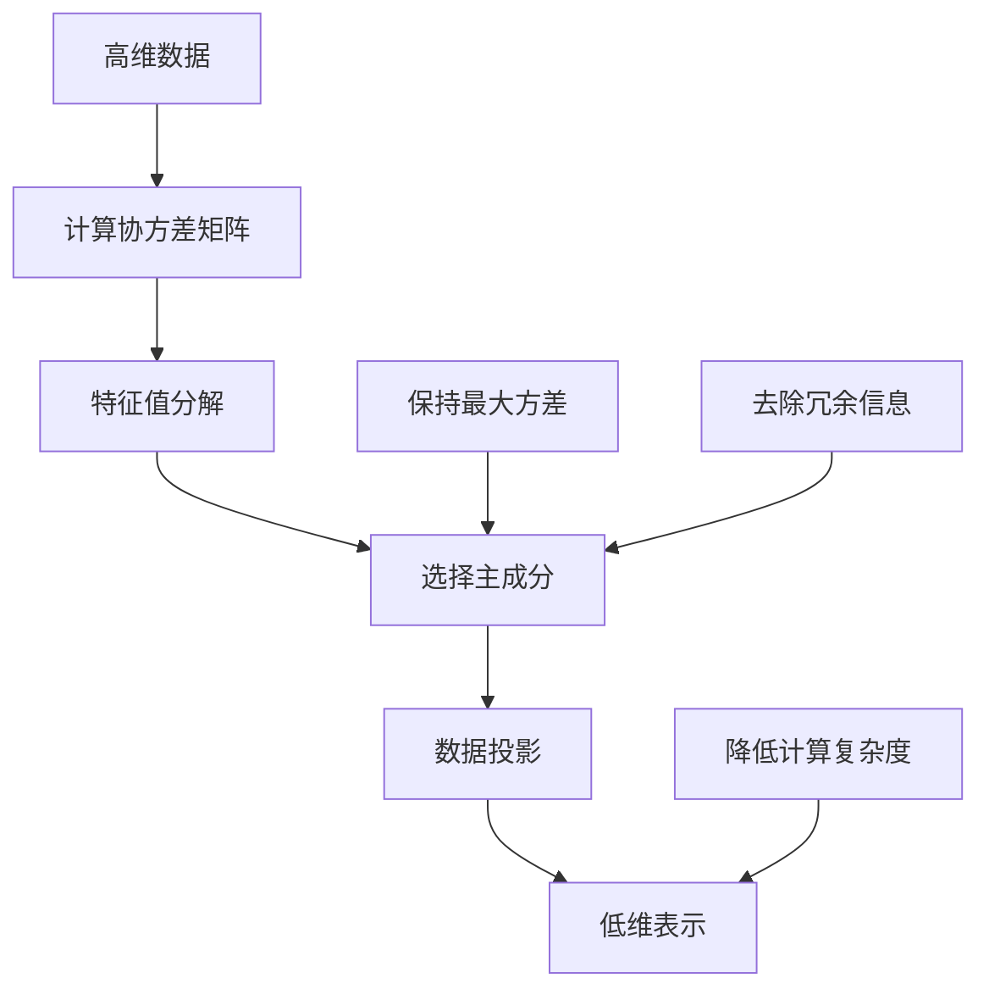

# 1.3.3 主成分分析 (PCA)

## 学习目标

通过本节学习，你将能够：
- 理解主成分分析的数学原理和几何意义
- 掌握PCA的实现步骤和关键技术
- 学会使用PCA进行数据降维和特征提取
- 了解PCA在数据可视化和噪声去除中的应用
- 实现完整的PCA分析项目

## 1. PCA基础概念

### 1.1 什么是主成分分析

主成分分析(Principal Component Analysis, PCA)是一种**无监督的线性降维技术**，通过寻找数据中方差最大的方向（主成分）来实现数据的低维表示。

### 1.2 PCA的核心思想



### 1.3 PCA的几何解释

```python
import numpy as np
import matplotlib.pyplot as plt
from sklearn.decomposition import PCA
from sklearn.datasets import make_blobs
import seaborn as sns

# 生成2D示例数据
np.random.seed(42)
X_2d = np.random.multivariate_normal([0, 0], [[3, 1.5], [1.5, 1]], 200)

# PCA分析
pca = PCA(n_components=2)
X_pca = pca.fit_transform(X_2d)

# 可视化PCA的几何意义
fig, axes = plt.subplots(1, 3, figsize=(18, 5))

# 原始数据
axes[0].scatter(X_2d[:, 0], X_2d[:, 1], alpha=0.7, s=50)
axes[0].set_title('原始数据分布', fontsize=14)
axes[0].set_xlabel('X1')
axes[0].set_ylabel('X2')
axes[0].grid(True, alpha=0.3)
axes[0].axis('equal')

# 原始数据 + 主成分方向
axes[1].scatter(X_2d[:, 0], X_2d[:, 1], alpha=0.7, s=50)

# 绘制主成分方向
mean = np.mean(X_2d, axis=0)
for i, (component, var) in enumerate(zip(pca.components_, pca.explained_variance_)):
    # 主成分向量（放大显示）
    axes[1].arrow(mean[0], mean[1], component[0]*np.sqrt(var)*2, component[1]*np.sqrt(var)*2,
                 head_width=0.2, head_length=0.3, fc=f'C{i+1}', ec=f'C{i+1}', linewidth=3,
                 label=f'PC{i+1} (解释方差: {pca.explained_variance_ratio_[i]:.2f})')

axes[1].set_title('主成分方向', fontsize=14)
axes[1].set_xlabel('X1')
axes[1].set_ylabel('X2')
axes[1].legend()
axes[1].grid(True, alpha=0.3)
axes[1].axis('equal')

# PCA变换后的数据
axes[2].scatter(X_pca[:, 0], X_pca[:, 1], alpha=0.7, s=50)
axes[2].set_title('PCA变换后的数据', fontsize=14)
axes[2].set_xlabel('第一主成分')
axes[2].set_ylabel('第二主成分')
axes[2].grid(True, alpha=0.3)
axes[2].axis('equal')

plt.tight_layout()
plt.show()

print("PCA分析结果：")
print(f"解释方差比例: {pca.explained_variance_ratio_}")
print(f"累积解释方差: {np.cumsum(pca.explained_variance_ratio_)}")
print(f"主成分方向:")
for i, component in enumerate(pca.components_):
    print(f"  PC{i+1}: [{component[0]:.3f}, {component[1]:.3f}]")
```

## 2. PCA数学原理

### 2.1 协方差矩阵和特征值分解

**步骤1：数据标准化**
$$\mathbf{X}_{centered} = \mathbf{X} - \boldsymbol{\mu}$$

其中 $\boldsymbol{\mu} = \frac{1}{n}\sum_{i=1}^{n} \mathbf{x}_i$ 是样本均值。

**步骤2：计算协方差矩阵**
$$\mathbf{C} = \frac{1}{n-1}\mathbf{X}_{centered}^T \mathbf{X}_{centered}$$

**步骤3：特征值分解**
$$\mathbf{C} = \mathbf{V}\mathbf{\Lambda}\mathbf{V}^T$$

其中：
- $\mathbf{V}$ 是特征向量矩阵（主成分方向）
- $\mathbf{\Lambda}$ 是特征值对角矩阵（方差大小）

**步骤4：选择主成分**
选择前 $k$ 个最大特征值对应的特征向量作为主成分。

**步骤5：数据投影**
$$\mathbf{Y} = \mathbf{X}_{centered} \mathbf{V}_k$$

### 2.2 PCA的优化目标

PCA等价于求解以下优化问题：

$$\max_{\mathbf{w}} \frac{\mathbf{w}^T \mathbf{C} \mathbf{w}}{\mathbf{w}^T \mathbf{w}}$$

约束条件：$||\mathbf{w}|| = 1$

这个问题的解就是协方差矩阵的特征向量。

### 2.3 PCA实现

```python
class SimplePCA:
    """简单的PCA实现"""
    
    def __init__(self, n_components=None):
        self.n_components = n_components
        self.components_ = None
        self.explained_variance_ = None
        self.explained_variance_ratio_ = None
        self.mean_ = None
        
    def fit(self, X):
        """训练PCA模型"""
        # 数据中心化
        self.mean_ = np.mean(X, axis=0)
        X_centered = X - self.mean_
        
        # 计算协方差矩阵
        cov_matrix = np.cov(X_centered.T)
        
        # 特征值分解
        eigenvalues, eigenvectors = np.linalg.eigh(cov_matrix)
        
        # 按特征值大小排序（降序）
        idx = np.argsort(eigenvalues)[::-1]
        eigenvalues = eigenvalues[idx]
        eigenvectors = eigenvectors[:, idx]
        
        # 选择主成分数量
        if self.n_components is None:
            self.n_components = len(eigenvalues)
        
        # 保存结果
        self.components_ = eigenvectors[:, :self.n_components].T
        self.explained_variance_ = eigenvalues[:self.n_components]
        self.explained_variance_ratio_ = self.explained_variance_ / np.sum(eigenvalues)
        
        return self
    
    def transform(self, X):
        """数据变换"""
        X_centered = X - self.mean_
        return np.dot(X_centered, self.components_.T)
    
    def fit_transform(self, X):
        """训练并变换"""
        return self.fit(X).transform(X)
    
    def inverse_transform(self, X_transformed):
        """逆变换"""
        return np.dot(X_transformed, self.components_) + self.mean_
    
    def get_covariance(self):
        """获取协方差矩阵"""
        return np.dot(self.components_.T * self.explained_variance_, self.components_)

# 测试SimplePCA
print("\n=== SimplePCA 测试 ===")

# 生成测试数据
np.random.seed(42)
X_test = np.random.multivariate_normal([0, 0, 0], 
                                      [[3, 1, 0.5], [1, 2, 0.3], [0.5, 0.3, 1]], 
                                      300)

# 使用自实现的PCA
simple_pca = SimplePCA(n_components=2)
X_simple_pca = simple_pca.fit_transform(X_test)

# 使用sklearn的PCA对比
sklearn_pca = PCA(n_components=2)
X_sklearn_pca = sklearn_pca.fit_transform(X_test)

print("SimplePCA结果：")
print(f"解释方差比例: {simple_pca.explained_variance_ratio_}")
print(f"主成分形状: {simple_pca.components_.shape}")

print("\nSklearn PCA结果：")
print(f"解释方差比例: {sklearn_pca.explained_variance_ratio_}")
print(f"主成分形状: {sklearn_pca.components_.shape}")

# 验证结果一致性（可能有符号差异）
diff = np.abs(np.abs(simple_pca.explained_variance_ratio_) - 
              np.abs(sklearn_pca.explained_variance_ratio_))
print(f"\n解释方差比例差异: {np.max(diff):.6f}")
```

## 3. PCA应用案例

### 3.1 图像数据降维

```python
# 模拟图像数据（手写数字）
from sklearn.datasets import load_digits
from sklearn.model_selection import train_test_split
from sklearn.linear_model import LogisticRegression
from sklearn.metrics import accuracy_score, classification_report

# 加载手写数字数据集
digits = load_digits()
X_digits, y_digits = digits.data, digits.target

print("手写数字数据集信息：")
print(f"样本数量: {X_digits.shape[0]}")
print(f"原始特征维度: {X_digits.shape[1]}")
print(f"类别数量: {len(np.unique(y_digits))}")

# 可视化原始图像
fig, axes = plt.subplots(2, 5, figsize=(12, 6))
for i in range(10):
    row, col = i // 5, i % 5
    axes[row, col].imshow(digits.images[i], cmap='gray')
    axes[row, col].set_title(f'数字: {y_digits[i]}')
    axes[row, col].axis('off')

plt.suptitle('原始手写数字图像', fontsize=16)
plt.tight_layout()
plt.show()

# PCA降维分析
class ImagePCAAnalysis:
    """图像PCA分析系统"""
    
    def __init__(self):
        self.pca_models = {}
        self.reconstruction_errors = {}
        self.classification_scores = {}
    
    def analyze_dimensions(self, X, y, max_components=100):
        """分析不同维度的效果"""
        # 测试不同的主成分数量
        n_components_list = [5, 10, 20, 30, 50, 100]
        
        print("\n=== PCA降维效果分析 ===")
        
        for n_comp in n_components_list:
            if n_comp > min(X.shape):
                continue
                
            # PCA降维
            pca = PCA(n_components=n_comp)
            X_pca = pca.fit_transform(X)
            
            # 重构误差
            X_reconstructed = pca.inverse_transform(X_pca)
            reconstruction_error = np.mean((X - X_reconstructed) ** 2)
            
            # 分类性能测试
            X_train, X_test, y_train, y_test = train_test_split(
                X_pca, y, test_size=0.3, random_state=42, stratify=y
            )
            
            clf = LogisticRegression(max_iter=1000, random_state=42)
            clf.fit(X_train, y_train)
            y_pred = clf.predict(X_test)
            accuracy = accuracy_score(y_test, y_pred)
            
            # 保存结果
            self.pca_models[n_comp] = pca
            self.reconstruction_errors[n_comp] = reconstruction_error
            self.classification_scores[n_comp] = accuracy
            
            print(f"主成分数: {n_comp:3d} | "
                  f"解释方差: {np.sum(pca.explained_variance_ratio_):.3f} | "
                  f"重构误差: {reconstruction_error:.4f} | "
                  f"分类准确率: {accuracy:.3f}")
    
    def visualize_analysis(self):
        """可视化分析结果"""
        n_components = list(self.pca_models.keys())
        explained_variances = [np.sum(self.pca_models[n].explained_variance_ratio_) 
                             for n in n_components]
        reconstruction_errors = [self.reconstruction_errors[n] for n in n_components]
        classification_scores = [self.classification_scores[n] for n in n_components]
        
        fig, axes = plt.subplots(2, 2, figsize=(15, 10))
        
        # 解释方差比例
        axes[0, 0].plot(n_components, explained_variances, 'bo-', linewidth=2, markersize=8)
        axes[0, 0].set_title('累积解释方差比例', fontsize=14)
        axes[0, 0].set_xlabel('主成分数量')
        axes[0, 0].set_ylabel('累积解释方差比例')
        axes[0, 0].grid(True, alpha=0.3)
        axes[0, 0].axhline(y=0.95, color='red', linestyle='--', alpha=0.7, label='95%阈值')
        axes[0, 0].legend()
        
        # 重构误差
        axes[0, 1].plot(n_components, reconstruction_errors, 'ro-', linewidth=2, markersize=8)
        axes[0, 1].set_title('重构误差', fontsize=14)
        axes[0, 1].set_xlabel('主成分数量')
        axes[0, 1].set_ylabel('均方重构误差')
        axes[0, 1].grid(True, alpha=0.3)
        
        # 分类准确率
        axes[1, 0].plot(n_components, classification_scores, 'go-', linewidth=2, markersize=8)
        axes[1, 0].set_title('分类准确率', fontsize=14)
        axes[1, 0].set_xlabel('主成分数量')
        axes[1, 0].set_ylabel('准确率')
        axes[1, 0].grid(True, alpha=0.3)
        
        # 综合分析（准确率 vs 压缩比）
        compression_ratios = [n/X_digits.shape[1] for n in n_components]
        axes[1, 1].scatter(compression_ratios, classification_scores, 
                          s=100, c=reconstruction_errors, cmap='viridis', alpha=0.7)
        axes[1, 1].set_title('准确率 vs 压缩比', fontsize=14)
        axes[1, 1].set_xlabel('压缩比 (保留维度/原始维度)')
        axes[1, 1].set_ylabel('分类准确率')
        axes[1, 1].grid(True, alpha=0.3)
        
        # 添加颜色条
        scatter = axes[1, 1].collections[0]
        cbar = plt.colorbar(scatter, ax=axes[1, 1])
        cbar.set_label('重构误差')
        
        plt.tight_layout()
        plt.show()
    
    def visualize_components(self, n_components=20):
        """可视化主成分"""
        pca = self.pca_models[n_components]
        
        # 重塑主成分为图像形状
        components_images = pca.components_.reshape(n_components, 8, 8)
        
        fig, axes = plt.subplots(4, 5, figsize=(15, 12))
        axes = axes.ravel()
        
        for i in range(min(n_components, 20)):
            axes[i].imshow(components_images[i], cmap='RdBu_r')
            axes[i].set_title(f'PC{i+1}\n方差比例: {pca.explained_variance_ratio_[i]:.3f}')
            axes[i].axis('off')
        
        plt.suptitle(f'前{min(n_components, 20)}个主成分可视化', fontsize=16)
        plt.tight_layout()
        plt.show()
    
    def demonstrate_reconstruction(self, n_components=20, n_samples=10):
        """演示图像重构"""
        pca = self.pca_models[n_components]
        
        # 选择样本进行重构
        indices = np.random.choice(len(X_digits), n_samples, replace=False)
        original_images = X_digits[indices]
        
        # PCA变换和逆变换
        transformed = pca.transform(original_images)
        reconstructed = pca.inverse_transform(transformed)
        
        # 可视化对比
        fig, axes = plt.subplots(3, n_samples, figsize=(2*n_samples, 6))
        
        for i in range(n_samples):
            # 原始图像
            axes[0, i].imshow(original_images[i].reshape(8, 8), cmap='gray')
            axes[0, i].set_title(f'原始\n标签: {y_digits[indices[i]]}')
            axes[0, i].axis('off')
            
            # 重构图像
            axes[1, i].imshow(reconstructed[i].reshape(8, 8), cmap='gray')
            axes[1, i].set_title('重构')
            axes[1, i].axis('off')
            
            # 差异图像
            diff = np.abs(original_images[i] - reconstructed[i])
            axes[2, i].imshow(diff.reshape(8, 8), cmap='Reds')
            axes[2, i].set_title(f'差异\nMSE: {np.mean(diff**2):.3f}')
            axes[2, i].axis('off')
        
        plt.suptitle(f'PCA图像重构演示 (主成分数: {n_components})', fontsize=16)
        plt.tight_layout()
        plt.show()

# 执行图像PCA分析
image_pca = ImagePCAAnalysis()
image_pca.analyze_dimensions(X_digits, y_digits)
image_pca.visualize_analysis()
image_pca.visualize_components(n_components=20)
image_pca.demonstrate_reconstruction(n_components=20, n_samples=8)
```

### 3.2 高维数据可视化

```python
# 高维数据可视化案例
from sklearn.datasets import load_wine, load_breast_cancer
from mpl_toolkits.mplot3d import Axes3D

class HighDimVisualization:
    """高维数据可视化系统"""
    
    def __init__(self):
        self.datasets = {
            'wine': load_wine(),
            'breast_cancer': load_breast_cancer()
        }
    
    def analyze_dataset(self, dataset_name):
        """分析数据集"""
        data = self.datasets[dataset_name]
        X, y = data.data, data.target
        
        print(f"\n=== {dataset_name.upper()} 数据集分析 ===")
        print(f"样本数量: {X.shape[0]}")
        print(f"特征维度: {X.shape[1]}")
        print(f"类别数量: {len(np.unique(y))}")
        print(f"类别分布: {np.bincount(y)}")
        
        # 标准化数据
        from sklearn.preprocessing import StandardScaler
        scaler = StandardScaler()
        X_scaled = scaler.fit_transform(X)
        
        # PCA分析
        pca_full = PCA()
        X_pca_full = pca_full.fit_transform(X_scaled)
        
        # 可视化解释方差
        self._plot_explained_variance(pca_full, dataset_name)
        
        # 2D和3D可视化
        self._plot_2d_3d_visualization(X_scaled, y, data.target_names, dataset_name)
        
        return X_scaled, y, data.target_names
    
    def _plot_explained_variance(self, pca, dataset_name):
        """绘制解释方差图"""
        fig, axes = plt.subplots(1, 2, figsize=(15, 5))
        
        # 个体解释方差
        axes[0].bar(range(1, len(pca.explained_variance_ratio_) + 1), 
                   pca.explained_variance_ratio_, alpha=0.7)
        axes[0].set_title(f'{dataset_name} - 各主成分解释方差', fontsize=14)
        axes[0].set_xlabel('主成分')
        axes[0].set_ylabel('解释方差比例')
        axes[0].grid(True, alpha=0.3)
        
        # 累积解释方差
        cumsum_var = np.cumsum(pca.explained_variance_ratio_)
        axes[1].plot(range(1, len(cumsum_var) + 1), cumsum_var, 'bo-', linewidth=2)
        axes[1].axhline(y=0.95, color='red', linestyle='--', alpha=0.7, label='95%阈值')
        axes[1].axhline(y=0.90, color='orange', linestyle='--', alpha=0.7, label='90%阈值')
        axes[1].set_title(f'{dataset_name} - 累积解释方差', fontsize=14)
        axes[1].set_xlabel('主成分数量')
        axes[1].set_ylabel('累积解释方差比例')
        axes[1].legend()
        axes[1].grid(True, alpha=0.3)
        
        plt.tight_layout()
        plt.show()
        
        # 输出关键信息
        n_95 = np.argmax(cumsum_var >= 0.95) + 1
        n_90 = np.argmax(cumsum_var >= 0.90) + 1
        print(f"达到90%解释方差需要: {n_90} 个主成分")
        print(f"达到95%解释方差需要: {n_95} 个主成分")
        print(f"前3个主成分解释方差: {cumsum_var[2]:.3f}")
    
    def _plot_2d_3d_visualization(self, X, y, target_names, dataset_name):
        """2D和3D可视化"""
        # PCA降维
        pca_2d = PCA(n_components=2)
        pca_3d = PCA(n_components=3)
        
        X_2d = pca_2d.fit_transform(X)
        X_3d = pca_3d.fit_transform(X)
        
        fig = plt.figure(figsize=(18, 6))
        
        # 2D可视化
        ax1 = fig.add_subplot(131)
        colors = plt.cm.Set1(np.linspace(0, 1, len(target_names)))
        
        for i, (target, color) in enumerate(zip(target_names, colors)):
            mask = y == i
            ax1.scatter(X_2d[mask, 0], X_2d[mask, 1], 
                       c=[color], label=target, alpha=0.7, s=50)
        
        ax1.set_title(f'{dataset_name} - PCA 2D可视化\n'
                     f'解释方差: {np.sum(pca_2d.explained_variance_ratio_):.3f}', fontsize=14)
        ax1.set_xlabel(f'PC1 ({pca_2d.explained_variance_ratio_[0]:.3f})')
        ax1.set_ylabel(f'PC2 ({pca_2d.explained_variance_ratio_[1]:.3f})')
        ax1.legend()
        ax1.grid(True, alpha=0.3)
        
        # 3D可视化
        ax2 = fig.add_subplot(132, projection='3d')
        
        for i, (target, color) in enumerate(zip(target_names, colors)):
            mask = y == i
            ax2.scatter(X_3d[mask, 0], X_3d[mask, 1], X_3d[mask, 2],
                       c=[color], label=target, alpha=0.7, s=50)
        
        ax2.set_title(f'{dataset_name} - PCA 3D可视化\n'
                     f'解释方差: {np.sum(pca_3d.explained_variance_ratio_):.3f}', fontsize=14)
        ax2.set_xlabel(f'PC1 ({pca_3d.explained_variance_ratio_[0]:.3f})')
        ax2.set_ylabel(f'PC2 ({pca_3d.explained_variance_ratio_[1]:.3f})')
        ax2.set_zlabel(f'PC3 ({pca_3d.explained_variance_ratio_[2]:.3f})')
        ax2.legend()
        
        # 特征重要性热图
        ax3 = fig.add_subplot(133)
        
        # 显示前10个特征在前3个主成分中的权重
        n_features_show = min(10, X.shape[1])
        components_matrix = pca_3d.components_[:3, :n_features_show]
        
        im = ax3.imshow(components_matrix, cmap='RdBu_r', aspect='auto')
        ax3.set_title(f'{dataset_name} - 特征权重热图', fontsize=14)
        ax3.set_xlabel('特征索引')
        ax3.set_ylabel('主成分')
        ax3.set_yticks(range(3))
        ax3.set_yticklabels(['PC1', 'PC2', 'PC3'])
        ax3.set_xticks(range(n_features_show))
        ax3.set_xticklabels(range(n_features_show))
        
        plt.colorbar(im, ax=ax3, label='权重')
        
        plt.tight_layout()
        plt.show()

# 执行高维数据可视化
vis_system = HighDimVisualization()

# 分析Wine数据集
X_wine, y_wine, wine_names = vis_system.analyze_dataset('wine')

# 分析Breast Cancer数据集
X_cancer, y_cancer, cancer_names = vis_system.analyze_dataset('breast_cancer')

### 3.3 PCA用于噪声去除

```python
class PCADenoising:
    """PCA噪声去除系统"""
    
    def __init__(self):
        self.pca_models = {}
    
    def add_noise_to_data(self, X, noise_level=0.1):
        """向数据添加噪声"""
        noise = np.random.normal(0, noise_level, X.shape)
        return X + noise
    
    def denoise_comparison(self, X_clean, noise_levels=[0.05, 0.1, 0.2, 0.3]):
        """比较不同噪声水平下的去噪效果"""
        print("\n=== PCA噪声去除效果分析 ===")
        
        results = {}
        
        for noise_level in noise_levels:
            # 添加噪声
            X_noisy = self.add_noise_to_data(X_clean, noise_level)
            
            # 测试不同主成分数量的去噪效果
            n_components_list = [5, 10, 20, 30]
            
            results[noise_level] = {}
            
            for n_comp in n_components_list:
                if n_comp > min(X_clean.shape):
                    continue
                
                # PCA去噪
                pca = PCA(n_components=n_comp)
                X_pca = pca.fit_transform(X_noisy)
                X_denoised = pca.inverse_transform(X_pca)
                
                # 计算去噪效果
                mse_noisy = np.mean((X_clean - X_noisy) ** 2)
                mse_denoised = np.mean((X_clean - X_denoised) ** 2)
                
                noise_reduction = (mse_noisy - mse_denoised) / mse_noisy * 100
                
                results[noise_level][n_comp] = {
                    'mse_noisy': mse_noisy,
                    'mse_denoised': mse_denoised,
                    'noise_reduction': noise_reduction
                }
                
                print(f"噪声水平: {noise_level:.2f} | 主成分: {n_comp:2d} | "
                      f"噪声MSE: {mse_noisy:.4f} | 去噪MSE: {mse_denoised:.4f} | "
                      f"噪声减少: {noise_reduction:.1f}%")
        
        return results
    
    def visualize_denoising(self, X_clean, noise_level=0.2, n_components=20):
        """可视化去噪效果"""
        # 添加噪声
        X_noisy = self.add_noise_to_data(X_clean, noise_level)
        
        # PCA去噪
        pca = PCA(n_components=n_components)
        X_pca = pca.fit_transform(X_noisy)
        X_denoised = pca.inverse_transform(X_pca)
        
        # 选择几个样本进行可视化（假设是图像数据）
        if X_clean.shape[1] == 64:  # 8x8图像
            n_samples = 6
            indices = np.random.choice(len(X_clean), n_samples, replace=False)
            
            fig, axes = plt.subplots(4, n_samples, figsize=(2*n_samples, 8))
            
            for i, idx in enumerate(indices):
                # 原始图像
                axes[0, i].imshow(X_clean[idx].reshape(8, 8), cmap='gray')
                axes[0, i].set_title('原始')
                axes[0, i].axis('off')
                
                # 噪声图像
                axes[1, i].imshow(X_noisy[idx].reshape(8, 8), cmap='gray')
                axes[1, i].set_title(f'噪声\n(σ={noise_level})')
                axes[1, i].axis('off')
                
                # 去噪图像
                axes[2, i].imshow(X_denoised[idx].reshape(8, 8), cmap='gray')
                axes[2, i].set_title(f'去噪\n(PC={n_components})')
                axes[2, i].axis('off')
                
                # 噪声差异
                noise_diff = np.abs(X_clean[idx] - X_noisy[idx])
                denoised_diff = np.abs(X_clean[idx] - X_denoised[idx])
                
                axes[3, i].imshow((noise_diff - denoised_diff).reshape(8, 8), 
                                 cmap='RdBu_r')
                axes[3, i].set_title('改善程度')
                axes[3, i].axis('off')
            
            plt.suptitle(f'PCA噪声去除效果演示', fontsize=16)
            plt.tight_layout()
            plt.show()
        
        # 计算整体统计
        mse_noisy = np.mean((X_clean - X_noisy) ** 2)
        mse_denoised = np.mean((X_clean - X_denoised) ** 2)
        noise_reduction = (mse_noisy - mse_denoised) / mse_noisy * 100
        
        print(f"\n去噪效果统计:")
        print(f"原始噪声MSE: {mse_noisy:.4f}")
        print(f"去噪后MSE: {mse_denoised:.4f}")
        print(f"噪声减少: {noise_reduction:.1f}%")
        print(f"信噪比改善: {10*np.log10(mse_noisy/mse_denoised):.2f} dB")

# 执行噪声去除演示
denoising_system = PCADenoising()

# 使用手写数字数据进行去噪测试
denoising_results = denoising_system.denoise_comparison(X_digits[:100])  # 使用部分数据
denoising_system.visualize_denoising(X_digits[:50], noise_level=0.15, n_components=20)

## 4. PCA的变体和扩展

### 4.1 核PCA (Kernel PCA)

```python
from sklearn.decomposition import KernelPCA
from sklearn.datasets import make_circles, make_moons

class KernelPCADemo:
    """核PCA演示"""
    
    def __init__(self):
        self.kernels = ['linear', 'poly', 'rbf', 'sigmoid']
    
    def compare_pca_methods(self):
        """比较线性PCA和核PCA"""
        # 生成非线性数据
        datasets = {
            'circles': make_circles(n_samples=300, factor=0.3, noise=0.1, random_state=42),
            'moons': make_moons(n_samples=300, noise=0.1, random_state=42)
        }
        
        fig, axes = plt.subplots(len(datasets), len(self.kernels) + 1, 
                                figsize=(20, 8))
        
        for row, (dataset_name, (X, y)) in enumerate(datasets.items()):
            # 原始数据
            axes[row, 0].scatter(X[:, 0], X[:, 1], c=y, cmap='viridis', alpha=0.7)
            axes[row, 0].set_title(f'{dataset_name} - 原始数据')
            axes[row, 0].grid(True, alpha=0.3)
            
            # 不同核函数的PCA
            for col, kernel in enumerate(self.kernels):
                if kernel == 'linear':
                    # 标准PCA
                    pca = PCA(n_components=1)
                    X_transformed = pca.fit_transform(X)
                    # 为了可视化，添加随机y坐标
                    X_plot = np.column_stack([X_transformed, 
                                            np.random.normal(0, 0.1, len(X_transformed))])
                else:
                    # 核PCA
                    kpca = KernelPCA(n_components=2, kernel=kernel, gamma=1.0)
                    X_plot = kpca.fit_transform(X)
                
                axes[row, col + 1].scatter(X_plot[:, 0], X_plot[:, 1], 
                                         c=y, cmap='viridis', alpha=0.7)
                axes[row, col + 1].set_title(f'{kernel.upper()} PCA')
                axes[row, col + 1].grid(True, alpha=0.3)
        
        plt.tight_layout()
        plt.show()

# 执行核PCA演示
kernel_pca_demo = KernelPCADemo()
kernel_pca_demo.compare_pca_methods()
```

### 4.2 增量PCA (Incremental PCA)

```python
from sklearn.decomposition import IncrementalPCA

class IncrementalPCADemo:
    """增量PCA演示"""
    
    def __init__(self):
        self.batch_sizes = [50, 100, 200]
    
    def compare_batch_learning(self, X, n_components=10):
        """比较批量学习和增量学习"""
        print("\n=== 增量PCA vs 标准PCA 比较 ===")
        
        # 标准PCA
        start_time = time.time()
        pca_standard = PCA(n_components=n_components)
        X_pca_standard = pca_standard.fit_transform(X)
        time_standard = time.time() - start_time
        
        results = {'standard': {
            'time': time_standard,
            'explained_variance_ratio': pca_standard.explained_variance_ratio_
        }}
        
        # 增量PCA with different batch sizes
        for batch_size in self.batch_sizes:
            start_time = time.time()
            
            ipca = IncrementalPCA(n_components=n_components, batch_size=batch_size)
            
            # 分批训练
            for i in range(0, len(X), batch_size):
                batch = X[i:i+batch_size]
                ipca.partial_fit(batch)
            
            # 变换数据
            X_ipca = ipca.transform(X)
            time_incremental = time.time() - start_time
            
            results[f'incremental_{batch_size}'] = {
                'time': time_incremental,
                'explained_variance_ratio': ipca.explained_variance_ratio_
            }
            
            print(f"批大小 {batch_size:3d}: 时间 {time_incremental:.3f}秒")
        
        print(f"标准PCA:     时间 {time_standard:.3f}秒")
        
        # 比较解释方差
        print("\n解释方差比例对比:")
        for method, result in results.items():
            variance_sum = np.sum(result['explained_variance_ratio'])
            print(f"{method:20s}: {variance_sum:.4f}")
        
        return results
    
    def simulate_streaming_data(self, n_batches=10, batch_size=100, n_features=50):
        """模拟流式数据处理"""
        print("\n=== 流式数据PCA处理演示 ===")
        
        # 初始化增量PCA
        ipca = IncrementalPCA(n_components=10, batch_size=batch_size)
        
        explained_variances = []
        
        for batch_idx in range(n_batches):
            # 生成新批次数据
            batch_data = np.random.randn(batch_size, n_features)
            
            # 增量学习
            ipca.partial_fit(batch_data)
            
            # 记录解释方差
            if hasattr(ipca, 'explained_variance_ratio_'):
                explained_variances.append(np.sum(ipca.explained_variance_ratio_))
            
            print(f"处理批次 {batch_idx+1:2d}: "
                  f"累积样本 {(batch_idx+1)*batch_size:4d}, "
                  f"解释方差 {explained_variances[-1]:.4f}" if explained_variances else "初始化中...")
        
        # 可视化学习过程
        if explained_variances:
            plt.figure(figsize=(10, 6))
            plt.plot(range(1, len(explained_variances)+1), explained_variances, 
                    'bo-', linewidth=2, markersize=8)
            plt.title('增量PCA学习过程', fontsize=14)
            plt.xlabel('批次数')
            plt.ylabel('累积解释方差比例')
            plt.grid(True, alpha=0.3)
            plt.show()

# 执行增量PCA演示
incremental_demo = IncrementalPCADemo()
incremental_results = incremental_demo.compare_batch_learning(X_digits)
incremental_demo.simulate_streaming_data()

## 5. Trae风格PCA实现

```python
class TraePCA:
    """Trae风格的PCA实现"""
    
    def __init__(self, n_components=None, whiten=False, verbose=True):
        self.n_components = n_components
        self.whiten = whiten
        self.verbose = verbose
        
        # Trae特色：详细的分析历史
        self.analysis_history = {
            'fit_time': None,
            'transform_time': None,
            'explained_variance_progression': [],
            'component_stability': [],
            'reconstruction_quality': {}
        }
    
    def trae_fit(self, X, feature_names=None, sample_names=None):
        """Trae风格的训练方法"""
        if self.verbose:
            print("🔍 Trae PCA 分析开始")
            print(f"📊 数据集信息: {X.shape[0]} 样本, {X.shape[1]} 特征")
        
        self.X_original_ = X.copy()
        self.feature_names_ = feature_names or [f'特征_{i+1}' for i in range(X.shape[1])]
        self.sample_names_ = sample_names or [f'样本_{i+1}' for i in range(X.shape[0])]
        
        # 数据预处理
        start_time = time.time()
        self.mean_ = np.mean(X, axis=0)
        X_centered = X - self.mean_
        
        # 计算协方差矩阵
        if self.verbose:
            print("🧮 计算协方差矩阵...")
        
        cov_matrix = np.cov(X_centered.T)
        
        # 特征值分解
        if self.verbose:
            print("🔢 执行特征值分解...")
        
        eigenvalues, eigenvectors = np.linalg.eigh(cov_matrix)
        
        # 排序
        idx = np.argsort(eigenvalues)[::-1]
        eigenvalues = eigenvalues[idx]
        eigenvectors = eigenvectors[:, idx]
        
        # 确定主成分数量
        if self.n_components is None:
            # 自动选择（保留95%方差）
            cumsum_var = np.cumsum(eigenvalues) / np.sum(eigenvalues)
            self.n_components = np.argmax(cumsum_var >= 0.95) + 1
            if self.verbose:
                print(f"🎯 自动选择主成分数: {self.n_components} (保留95%方差)")
        
        # 保存结果
        self.components_ = eigenvectors[:, :self.n_components].T
        self.explained_variance_ = eigenvalues[:self.n_components]
        self.explained_variance_ratio_ = self.explained_variance_ / np.sum(eigenvalues)
        
        # 白化处理
        if self.whiten:
            self.components_ = self.components_ / np.sqrt(self.explained_variance_[:, np.newaxis])
        
        self.analysis_history['fit_time'] = time.time() - start_time
        
        if self.verbose:
            print(f"✅ PCA训练完成! 训练时间: {self.analysis_history['fit_time']:.3f}秒")
            print(f"📈 保留主成分数: {self.n_components}")
            print(f"📊 累积解释方差: {np.sum(self.explained_variance_ratio_):.4f}")
        
        return self
    
    def trae_transform(self, X):
        """Trae风格的变换方法"""
        start_time = time.time()
        
        X_centered = X - self.mean_
        X_transformed = np.dot(X_centered, self.components_.T)
        
        if self.whiten:
            X_transformed = X_transformed / np.sqrt(self.explained_variance_)
        
        self.analysis_history['transform_time'] = time.time() - start_time
        
        if self.verbose:
            print(f"🔄 数据变换完成! 变换时间: {self.analysis_history['transform_time']:.3f}秒")
        
        return X_transformed
    
    def trae_fit_transform(self, X, feature_names=None, sample_names=None):
        """训练并变换"""
        return self.trae_fit(X, feature_names, sample_names).trae_transform(X)
    
    def trae_analyze_components(self, top_features=5):
        """分析主成分"""
        print("\n🔍 Trae 主成分详细分析")
        print("=" * 60)
        
        component_analysis = {}
        
        for i in range(self.n_components):
            print(f"\n📋 主成分 {i+1}:")
            print(f"   解释方差: {self.explained_variance_[i]:.4f}")
            print(f"   解释方差比例: {self.explained_variance_ratio_[i]:.4f} ({self.explained_variance_ratio_[i]*100:.1f}%)")
            
            # 找出贡献最大的特征
            component_weights = np.abs(self.components_[i])
            top_indices = np.argsort(component_weights)[::-1][:top_features]
            
            print(f"   主要贡献特征:")
            for j, idx in enumerate(top_indices):
                weight = self.components_[i, idx]
                print(f"     {j+1}. {self.feature_names_[idx]}: {weight:+.4f}")
            
            component_analysis[f'PC{i+1}'] = {
                'explained_variance': self.explained_variance_[i],
                'explained_variance_ratio': self.explained_variance_ratio_[i],
                'top_features': [(self.feature_names_[idx], self.components_[i, idx]) 
                               for idx in top_indices]
            }
        
        return component_analysis
    
    def trae_reconstruction_analysis(self, X, n_samples=5):
        """重构质量分析"""
        print("\n🔧 Trae 重构质量分析")
        print("=" * 50)
        
        # 变换和逆变换
        X_transformed = self.trae_transform(X)
        X_reconstructed = self.trae_inverse_transform(X_transformed)
        
        # 计算重构误差
        reconstruction_errors = np.mean((X - X_reconstructed) ** 2, axis=1)
        overall_mse = np.mean(reconstruction_errors)
        
        print(f"📊 整体重构质量:")
        print(f"   平均重构误差 (MSE): {overall_mse:.6f}")
        print(f"   重构误差标准差: {np.std(reconstruction_errors):.6f}")
        print(f"   最大重构误差: {np.max(reconstruction_errors):.6f}")
        print(f"   最小重构误差: {np.min(reconstruction_errors):.6f}")
        
        # 分析重构误差分布
        percentiles = [50, 75, 90, 95, 99]
        print(f"\n📈 重构误差分位数:")
        for p in percentiles:
            value = np.percentile(reconstruction_errors, p)
            print(f"   {p:2d}%: {value:.6f}")
        
        # 找出重构质量最好和最差的样本
        best_indices = np.argsort(reconstruction_errors)[:n_samples]
        worst_indices = np.argsort(reconstruction_errors)[-n_samples:]
        
        print(f"\n🏆 重构质量最好的{n_samples}个样本:")
        for i, idx in enumerate(best_indices):
            print(f"   {i+1}. {self.sample_names_[idx]}: MSE = {reconstruction_errors[idx]:.6f}")
        
        print(f"\n⚠️  重构质量最差的{n_samples}个样本:")
        for i, idx in enumerate(worst_indices):
            print(f"   {i+1}. {self.sample_names_[idx]}: MSE = {reconstruction_errors[idx]:.6f}")
        
        self.analysis_history['reconstruction_quality'] = {
            'overall_mse': overall_mse,
            'mse_std': np.std(reconstruction_errors),
            'best_samples': [(self.sample_names_[idx], reconstruction_errors[idx]) 
                           for idx in best_indices],
            'worst_samples': [(self.sample_names_[idx], reconstruction_errors[idx]) 
                            for idx in worst_indices]
        }
        
        return reconstruction_errors
    
    def trae_inverse_transform(self, X_transformed):
        """逆变换"""
        if self.whiten:
            X_transformed = X_transformed * np.sqrt(self.explained_variance_)
        
        return np.dot(X_transformed, self.components_) + self.mean_
    
    def trae_visualize_analysis(self, X, max_components=10):
        """可视化分析结果"""
        fig, axes = plt.subplots(2, 2, figsize=(15, 10))
        
        # 解释方差图
        n_show = min(max_components, len(self.explained_variance_ratio_))
        axes[0, 0].bar(range(1, n_show + 1), self.explained_variance_ratio_[:n_show], 
                      alpha=0.7, color='skyblue')
        axes[0, 0].set_title('🔍 各主成分解释方差', fontsize=14)
        axes[0, 0].set_xlabel('主成分')
        axes[0, 0].set_ylabel('解释方差比例')
        axes[0, 0].grid(True, alpha=0.3)
        
        # 累积解释方差
        cumsum_var = np.cumsum(self.explained_variance_ratio_)
        axes[0, 1].plot(range(1, len(cumsum_var) + 1), cumsum_var, 
                       'bo-', linewidth=2, markersize=6)
        axes[0, 1].axhline(y=0.95, color='red', linestyle='--', alpha=0.7, label='95%')
        axes[0, 1].axhline(y=0.90, color='orange', linestyle='--', alpha=0.7, label='90%')
        axes[0, 1].set_title('📈 累积解释方差', fontsize=14)
        axes[0, 1].set_xlabel('主成分数量')
        axes[0, 1].set_ylabel('累积解释方差比例')
        axes[0, 1].legend()
        axes[0, 1].grid(True, alpha=0.3)
        
        # 主成分权重热图
        n_features_show = min(20, len(self.feature_names_))
        n_components_show = min(5, self.n_components)
        
        weights_matrix = self.components_[:n_components_show, :n_features_show]
        im = axes[1, 0].imshow(weights_matrix, cmap='RdBu_r', aspect='auto')
        axes[1, 0].set_title('🎯 主成分权重热图', fontsize=14)
        axes[1, 0].set_xlabel('特征')
        axes[1, 0].set_ylabel('主成分')
        axes[1, 0].set_yticks(range(n_components_show))
        axes[1, 0].set_yticklabels([f'PC{i+1}' for i in range(n_components_show)])
        plt.colorbar(im, ax=axes[1, 0], label='权重')
        
        # 重构误差分析
        reconstruction_errors = self.trae_reconstruction_analysis(X, n_samples=3)
        axes[1, 1].hist(reconstruction_errors, bins=30, alpha=0.7, color='lightcoral')
        axes[1, 1].axvline(np.mean(reconstruction_errors), color='red', 
                          linestyle='--', label=f'均值: {np.mean(reconstruction_errors):.4f}')
        axes[1, 1].set_title('🔧 重构误差分布', fontsize=14)
        axes[1, 1].set_xlabel('重构误差 (MSE)')
        axes[1, 1].set_ylabel('频次')
        axes[1, 1].legend()
        axes[1, 1].grid(True, alpha=0.3)
        
        plt.tight_layout()
        plt.show()
    
    def trae_export_results(self, filename=None):
        """导出分析结果"""
        results = {
            'analysis_summary': {
                'n_components': self.n_components,
                'total_explained_variance': float(np.sum(self.explained_variance_ratio_)),
                'fit_time': self.analysis_history['fit_time'],
                'transform_time': self.analysis_history.get('transform_time', None)
            },
            'components': {
                f'PC{i+1}': {
                    'explained_variance': float(self.explained_variance_[i]),
                    'explained_variance_ratio': float(self.explained_variance_ratio_[i]),
                    'weights': self.components_[i].tolist()
                } for i in range(self.n_components)
            },
            'feature_names': self.feature_names_,
            'reconstruction_quality': self.analysis_history.get('reconstruction_quality', {})
        }
        
        if filename:
            import json
            with open(filename, 'w', encoding='utf-8') as f:
                json.dump(results, f, ensure_ascii=False, indent=2)
            print(f"📁 分析结果已导出到: {filename}")
        
        return results

# Trae PCA演示
print("\n🔍 Trae PCA 系统演示")
print("=" * 60)

# 使用Wine数据集进行演示
trae_pca = TraePCA(n_components=None, verbose=True)

# 训练模型
X_wine_transformed = trae_pca.trae_fit_transform(
    X_wine, 
    feature_names=[f'特征_{i+1}' for i in range(X_wine.shape[1])],
    sample_names=[f'样本_{i+1}' for i in range(X_wine.shape[0])]
)

# 详细分析
component_analysis = trae_pca.trae_analyze_components(top_features=3)
reconstruction_errors = trae_pca.trae_reconstruction_analysis(X_wine, n_samples=3)

# 可视化分析
trae_pca.trae_visualize_analysis(X_wine)

# 导出结果
results = trae_pca.trae_export_results()
print(f"\n📋 分析结果摘要:")
print(f"主成分数量: {results['analysis_summary']['n_components']}")
print(f"解释方差: {results['analysis_summary']['total_explained_variance']:.4f}")
print(f"训练时间: {results['analysis_summary']['fit_time']:.3f}秒")

## 6. 思考题

1. **主成分选择**: 如何确定最优的主成分数量？除了解释方差比例，还有哪些判断标准？

2. **数据预处理**: 为什么PCA前需要对数据进行标准化？什么情况下可以不标准化？

3. **几何解释**: PCA的几何意义是什么？主成分方向与数据分布有什么关系？

4. **应用场景**: PCA适用于哪些场景？什么情况下不适合使用PCA？

5. **核PCA优势**: 核PCA相比线性PCA有什么优势？如何选择合适的核函数？

## 7. 小结

### 7.1 核心优势

- **降维效果**: 有效减少数据维度，保留主要信息
- **噪声去除**: 通过保留主要成分去除数据噪声
- **数据可视化**: 将高维数据投影到2D/3D空间进行可视化
- **计算效率**: 降低后续算法的计算复杂度
- **特征提取**: 发现数据中的潜在模式和结构

### 7.2 关键技术

- **协方差矩阵**: 描述特征间的线性关系
- **特征值分解**: 找到数据的主要变化方向
- **方差最大化**: 保留数据中的最大方差信息
- **正交变换**: 确保主成分之间相互独立
- **白化处理**: 使变换后的数据具有单位方差

### 7.3 实际应用

- **图像处理**: 图像压缩、特征提取、人脸识别
- **数据可视化**: 高维数据的2D/3D可视化
- **特征工程**: 降维、去噪、特征选择
- **生物信息学**: 基因表达分析、蛋白质结构分析
- **金融分析**: 风险因子分析、投资组合优化

### 7.4 局限性

- **线性假设**: 只能捕获线性关系，对非线性结构效果有限
- **解释性**: 主成分通常难以直接解释其物理意义
- **全局方法**: 需要访问全部数据，不适合在线学习
- **异常值敏感**: 容易受到异常值影响
- **方差导向**: 可能保留噪声而丢失有用的低方差信息

### 7.5 使用建议

1. **数据预处理**: 根据特征尺度决定是否标准化
2. **主成分选择**: 结合解释方差、肘部法则和业务需求
3. **结果验证**: 通过重构误差和下游任务性能验证效果
4. **可视化分析**: 充分利用主成分权重和投影结果
5. **变体选择**: 根据数据特点选择合适的PCA变体

### 7.6 下一步学习

- **非线性降维**: t-SNE、UMAP等非线性降维方法
- **概率PCA**: 基于概率模型的PCA扩展
- **稀疏PCA**: 具有稀疏性约束的主成分分析
- **监督降维**: LDA、CCA等监督学习降维方法
- **深度学习**: 自编码器等深度学习降维技术

通过本节学习，你已经掌握了PCA的核心原理和实践技能。PCA作为最经典的降维技术，在数据科学和机器学习中有着广泛的应用价值。
```