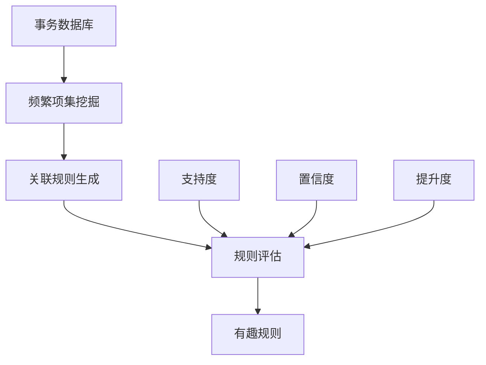

# 1.3.4 关联规则挖掘 (Association Rule Mining)

## 1. 关联规则挖掘概述

关联规则挖掘是数据挖掘中的一个重要分支，旨在发现数据集中项目之间的有趣关系。它最初应用于市场篮子分析，用于发现顾客购买行为中的模式，如"购买面包的顾客往往也会购买牛奶"。

### 1.1 基本概念



**核心概念**：
- **项目(Item)**: 数据中的基本元素，如商品、基因、网页等
- **事务(Transaction)**: 项目的集合，如一次购物清单
- **项集(Itemset)**: 项目的子集
- **频繁项集(Frequent Itemset)**: 支持度不小于最小支持度阈值的项集
- **关联规则(Association Rule)**: 形如 A → B 的蕴含关系

### 1.2 评估指标

```python
import numpy as np
import pandas as pd
import matplotlib.pyplot as plt
from itertools import combinations
from collections import defaultdict, Counter
import seaborn as sns

class AssociationMetrics:
    """关联规则评估指标"""
    
    def __init__(self):
        self.metrics_info = {
            'support': '支持度 - 项集在所有事务中出现的频率',
            'confidence': '置信度 - 在前件出现的条件下后件出现的概率',
            'lift': '提升度 - 规则的置信度与后件支持度的比值',
            'conviction': '确信度 - 衡量规则的可靠性',
            'leverage': '杠杆值 - 观察频率与期望频率的差值',
            'jaccard': 'Jaccard系数 - 项集交集与并集的比值'
        }
    
    def calculate_support(self, itemset, transactions):
        """计算支持度"""
        count = sum(1 for transaction in transactions if itemset.issubset(set(transaction)))
        return count / len(transactions)
    
    def calculate_confidence(self, antecedent, consequent, transactions):
        """计算置信度"""
        antecedent_support = self.calculate_support(antecedent, transactions)
        if antecedent_support == 0:
            return 0
        
        rule_support = self.calculate_support(antecedent.union(consequent), transactions)
        return rule_support / antecedent_support
    
    def calculate_lift(self, antecedent, consequent, transactions):
        """计算提升度"""
        confidence = self.calculate_confidence(antecedent, consequent, transactions)
        consequent_support = self.calculate_support(consequent, transactions)
        
        if consequent_support == 0:
            return 0
        
        return confidence / consequent_support
    
    def calculate_conviction(self, antecedent, consequent, transactions):
        """计算确信度"""
        confidence = self.calculate_confidence(antecedent, consequent, transactions)
        if confidence == 1:
            return float('inf')
        
        consequent_support = self.calculate_support(consequent, transactions)
        return (1 - consequent_support) / (1 - confidence) if confidence != 1 else float('inf')
    
    def calculate_leverage(self, antecedent, consequent, transactions):
        """计算杠杆值"""
        rule_support = self.calculate_support(antecedent.union(consequent), transactions)
        antecedent_support = self.calculate_support(antecedent, transactions)
        consequent_support = self.calculate_support(consequent, transactions)
        
        expected_support = antecedent_support * consequent_support
        return rule_support - expected_support
    
    def calculate_jaccard(self, antecedent, consequent, transactions):
        """计算Jaccard系数"""
        union_support = self.calculate_support(antecedent.union(consequent), transactions)
        antecedent_support = self.calculate_support(antecedent, transactions)
        consequent_support = self.calculate_support(consequent, transactions)
        
        denominator = antecedent_support + consequent_support - union_support
        return union_support / denominator if denominator > 0 else 0
    
    def evaluate_rule(self, antecedent, consequent, transactions):
        """全面评估关联规则"""
        metrics = {
            'support': self.calculate_support(antecedent.union(consequent), transactions),
            'confidence': self.calculate_confidence(antecedent, consequent, transactions),
            'lift': self.calculate_lift(antecedent, consequent, transactions),
            'conviction': self.calculate_conviction(antecedent, consequent, transactions),
            'leverage': self.calculate_leverage(antecedent, consequent, transactions),
            'jaccard': self.calculate_jaccard(antecedent, consequent, transactions)
        }
        
        return metrics
    
    def explain_metrics(self):
        """解释各种评估指标"""
        print("\n=== 关联规则评估指标说明 ===")
        for metric, description in self.metrics_info.items():
            print(f"{metric:12s}: {description}")
        
        print("\n=== 指标解释 ===")
        print("支持度 (Support):")
        print("  公式: Support(A→B) = P(A∪B) = |A∪B| / |D|")
        print("  含义: 规则在所有事务中出现的频率")
        print("  范围: [0, 1]，越高表示规则越普遍")
        
        print("\n置信度 (Confidence):")
        print("  公式: Confidence(A→B) = P(B|A) = Support(A∪B) / Support(A)")
        print("  含义: 在A出现的条件下B出现的概率")
        print("  范围: [0, 1]，越高表示规则越可靠")
        
        print("\n提升度 (Lift):")
        print("  公式: Lift(A→B) = Confidence(A→B) / Support(B)")
        print("  含义: 规则的置信度相对于B的支持度的提升")
        print("  范围: [0, +∞)，>1表示正相关，<1表示负相关，=1表示独立")

# 演示评估指标
metrics_demo = AssociationMetrics()
metrics_demo.explain_metrics()

# 示例数据
sample_transactions = [
    ['面包', '牛奶'],
    ['面包', '尿布', '啤酒', '鸡蛋'],
    ['牛奶', '尿布', '啤酒', '可乐'],
    ['面包', '牛奶', '尿布', '啤酒'],
    ['面包', '牛奶', '尿布', '可乐']
]

# 计算示例规则的指标
antecedent = {'面包'}
consequent = {'牛奶'}
rule_metrics = metrics_demo.evaluate_rule(antecedent, consequent, sample_transactions)

print(f"\n=== 规则 {antecedent} → {consequent} 的评估结果 ===")
for metric, value in rule_metrics.items():
    print(f"{metric:12s}: {value:.4f}")
```

## 2. Apriori算法

### 2.1 算法原理

Apriori算法是最经典的关联规则挖掘算法，基于"频繁项集的子集也必须是频繁的"这一先验知识。

```python
class AprioriAlgorithm:
    """Apriori算法实现"""
    
    def __init__(self, min_support=0.2, min_confidence=0.6):
        self.min_support = min_support
        self.min_confidence = min_confidence
        self.frequent_itemsets = {}
        self.rules = []
    
    def get_items(self, transactions):
        """获取所有单项集"""
        items = set()
        for transaction in transactions:
            for item in transaction:
                items.add(frozenset([item]))
        return items
    
    def get_support(self, itemset, transactions):
        """计算项集支持度"""
        count = 0
        for transaction in transactions:
            if itemset.issubset(set(transaction)):
                count += 1
        return count / len(transactions)
    
    def filter_candidates(self, candidates, transactions):
        """过滤候选项集，保留频繁项集"""
        frequent = {}
        for candidate in candidates:
            support = self.get_support(candidate, transactions)
            if support >= self.min_support:
                frequent[candidate] = support
        return frequent
    
    def generate_candidates(self, frequent_itemsets, k):
        """生成k项候选集"""
        candidates = set()
        frequent_list = list(frequent_itemsets.keys())
        
        for i in range(len(frequent_list)):
            for j in range(i + 1, len(frequent_list)):
                # 合并两个(k-1)项集
                union = frequent_list[i].union(frequent_list[j])
                if len(union) == k:
                    # 检查所有(k-1)子集是否都是频繁的
                    if self.has_frequent_subsets(union, frequent_itemsets):
                        candidates.add(union)
        
        return candidates
    
    def has_frequent_subsets(self, itemset, frequent_itemsets):
        """检查项集的所有子集是否都是频繁的"""
        k = len(itemset)
        for item in itemset:
            subset = itemset - frozenset([item])
            if subset not in frequent_itemsets:
                return False
        return True
    
    def find_frequent_itemsets(self, transactions):
        """挖掘频繁项集"""
        print(f"\n=== Apriori算法挖掘频繁项集 ===")
        print(f"最小支持度: {self.min_support}")
        print(f"事务数量: {len(transactions)}")
        
        # 1-项集
        candidates_1 = self.get_items(transactions)
        frequent_1 = self.filter_candidates(candidates_1, transactions)
        
        if not frequent_1:
            print("没有找到频繁1-项集")
            return {}
        
        self.frequent_itemsets[1] = frequent_1
        print(f"\n频繁1-项集数量: {len(frequent_1)}")
        
        k = 2
        while True:
            # 生成候选k-项集
            candidates_k = self.generate_candidates(self.frequent_itemsets[k-1], k)
            
            if not candidates_k:
                break
            
            # 过滤得到频繁k-项集
            frequent_k = self.filter_candidates(candidates_k, transactions)
            
            if not frequent_k:
                break
            
            self.frequent_itemsets[k] = frequent_k
            print(f"频繁{k}-项集数量: {len(frequent_k)}")
            
            k += 1
        
        # 统计总数
        total_frequent = sum(len(itemsets) for itemsets in self.frequent_itemsets.values())
        print(f"\n总频繁项集数量: {total_frequent}")
        
        return self.frequent_itemsets
    
    def generate_rules(self, transactions):
        """生成关联规则"""
        if not self.frequent_itemsets:
            self.find_frequent_itemsets(transactions)
        
        print(f"\n=== 生成关联规则 ===")
        print(f"最小置信度: {self.min_confidence}")
        
        self.rules = []
        
        # 从2-项集开始生成规则
        for k in range(2, max(self.frequent_itemsets.keys()) + 1):
            for itemset, support in self.frequent_itemsets[k].items():
                # 生成所有可能的规则
                for i in range(1, len(itemset)):
                    for antecedent in combinations(itemset, i):
                        antecedent = frozenset(antecedent)
                        consequent = itemset - antecedent
                        
                        # 计算置信度
                        antecedent_support = self.get_support(antecedent, transactions)
                        confidence = support / antecedent_support if antecedent_support > 0 else 0
                        
                        if confidence >= self.min_confidence:
                            # 计算其他指标
                            consequent_support = self.get_support(consequent, transactions)
                            lift = confidence / consequent_support if consequent_support > 0 else 0
                            
                            rule = {
                                'antecedent': antecedent,
                                'consequent': consequent,
                                'support': support,
                                'confidence': confidence,
                                'lift': lift
                            }
                            
                            self.rules.append(rule)
        
        print(f"生成规则数量: {len(self.rules)}")
        return self.rules
    
    def print_frequent_itemsets(self, max_items=10):
        """打印频繁项集"""
        print("\n=== 频繁项集详情 ===")
        
        for k, itemsets in self.frequent_itemsets.items():
            print(f"\n{k}-项集 (共{len(itemsets)}个):")
            
            # 按支持度排序
            sorted_itemsets = sorted(itemsets.items(), key=lambda x: x[1], reverse=True)
            
            for i, (itemset, support) in enumerate(sorted_itemsets[:max_items]):
                items_str = ', '.join(sorted(list(itemset)))
                print(f"  {i+1:2d}. {{{items_str}}} : {support:.4f}")
            
            if len(sorted_itemsets) > max_items:
                print(f"  ... 还有 {len(sorted_itemsets) - max_items} 个项集")
    
    def print_rules(self, max_rules=20, sort_by='lift'):
        """打印关联规则"""
        if not self.rules:
            print("没有找到满足条件的关联规则")
            return
        
        print(f"\n=== 关联规则 (按{sort_by}排序) ===")
        
        # 排序规则
        sorted_rules = sorted(self.rules, key=lambda x: x[sort_by], reverse=True)
        
        print(f"{'序号':>4} {'前件':>15} {'后件':>15} {'支持度':>8} {'置信度':>8} {'提升度':>8}")
        print("-" * 70)
        
        for i, rule in enumerate(sorted_rules[:max_rules]):
            antecedent_str = ', '.join(sorted(list(rule['antecedent'])))
            consequent_str = ', '.join(sorted(list(rule['consequent'])))
            
            print(f"{i+1:4d} {antecedent_str:>15} {consequent_str:>15} "
                  f"{rule['support']:8.4f} {rule['confidence']:8.4f} {rule['lift']:8.4f}")
        
        if len(sorted_rules) > max_rules:
            print(f"\n... 还有 {len(sorted_rules) - max_rules} 条规则")
    
    def analyze_rules(self):
        """分析规则统计信息"""
        if not self.rules:
            return
        
        print("\n=== 规则统计分析 ===")
        
        supports = [rule['support'] for rule in self.rules]
        confidences = [rule['confidence'] for rule in self.rules]
        lifts = [rule['lift'] for rule in self.rules]
        
        print(f"规则数量: {len(self.rules)}")
        print(f"\n支持度统计:")
        print(f"  平均值: {np.mean(supports):.4f}")
        print(f"  标准差: {np.std(supports):.4f}")
        print(f"  最小值: {np.min(supports):.4f}")
        print(f"  最大值: {np.max(supports):.4f}")
        
        print(f"\n置信度统计:")
        print(f"  平均值: {np.mean(confidences):.4f}")
        print(f"  标准差: {np.std(confidences):.4f}")
        print(f"  最小值: {np.min(confidences):.4f}")
        print(f"  最大值: {np.max(confidences):.4f}")
        
        print(f"\n提升度统计:")
        print(f"  平均值: {np.mean(lifts):.4f}")
        print(f"  标准差: {np.std(lifts):.4f}")
        print(f"  最小值: {np.min(lifts):.4f}")
        print(f"  最大值: {np.max(lifts):.4f}")
        
        # 提升度分布分析
        lift_positive = sum(1 for lift in lifts if lift > 1)
        lift_negative = sum(1 for lift in lifts if lift < 1)
        lift_neutral = sum(1 for lift in lifts if lift == 1)
        
        print(f"\n提升度分布:")
        print(f"  正相关 (lift > 1): {lift_positive} ({lift_positive/len(lifts)*100:.1f}%)")
        print(f"  负相关 (lift < 1): {lift_negative} ({lift_negative/len(lifts)*100:.1f}%)")
        print(f"  独立 (lift = 1): {lift_neutral} ({lift_neutral/len(lifts)*100:.1f}%)")

# 创建示例数据集
def create_market_basket_data():
    """创建市场篮子数据"""
    np.random.seed(42)
    
    # 商品列表
    items = ['面包', '牛奶', '鸡蛋', '黄油', '奶酪', '酸奶', '苹果', '香蕉', 
             '橙子', '土豆', '洋葱', '胡萝卜', '西红柿', '生菜', '鸡肉', 
             '牛肉', '鱼', '米饭', '面条', '啤酒', '红酒', '咖啡', '茶']
    
    # 定义商品关联性（某些商品更容易一起购买）
    associations = {
        '面包': ['黄油', '牛奶', '鸡蛋'],
        '牛奶': ['面包', '鸡蛋', '奶酪'],
        '苹果': ['香蕉', '橙子'],
        '土豆': ['洋葱', '胡萝卜'],
        '鸡肉': ['米饭', '土豆'],
        '啤酒': ['鸡肉', '牛肉'],
        '咖啡': ['牛奶', '面包']
    }
    
    transactions = []
    
    for i in range(1000):
        transaction = []
        
        # 随机选择1-8个商品
        n_items = np.random.randint(1, 9)
        
        # 首先随机选择一个主要商品
        main_item = np.random.choice(items)
        transaction.append(main_item)
        
        # 根据关联性添加相关商品
        if main_item in associations:
            for related_item in associations[main_item]:
                if np.random.random() < 0.4:  # 40%概率添加相关商品
                    transaction.append(related_item)
        
        # 随机添加其他商品
        while len(transaction) < n_items:
            item = np.random.choice(items)
            if item not in transaction:
                transaction.append(item)
        
        transactions.append(transaction)
    
    return transactions

# 执行Apriori算法演示
print("\n=== Apriori算法演示 ===")

# 生成数据
transactions = create_market_basket_data()
print(f"生成了 {len(transactions)} 个事务")
print(f"前5个事务示例:")
for i, transaction in enumerate(transactions[:5]):
    print(f"  事务{i+1}: {transaction}")

# 运行Apriori算法
apriori = AprioriAlgorithm(min_support=0.05, min_confidence=0.3)
frequent_itemsets = apriori.find_frequent_itemsets(transactions)
rules = apriori.generate_rules(transactions)

# 显示结果
apriori.print_frequent_itemsets(max_items=5)
apriori.print_rules(max_rules=15, sort_by='lift')
apriori.analyze_rules()
```

### 2.2 算法优化

```python
class OptimizedApriori(AprioriAlgorithm):
    """优化的Apriori算法"""
    
    def __init__(self, min_support=0.2, min_confidence=0.6, use_pruning=True):
        super().__init__(min_support, min_confidence)
        self.use_pruning = use_pruning
        self.transaction_matrix = None
    
    def create_transaction_matrix(self, transactions):
        """创建事务矩阵以加速计算"""
        # 获取所有唯一商品
        all_items = set()
        for transaction in transactions:
            all_items.update(transaction)
        
        self.item_to_index = {item: i for i, item in enumerate(sorted(all_items))}
        self.index_to_item = {i: item for item, i in self.item_to_index.items()}
        
        # 创建二进制矩阵
        n_transactions = len(transactions)
        n_items = len(all_items)
        
        self.transaction_matrix = np.zeros((n_transactions, n_items), dtype=bool)
        
        for i, transaction in enumerate(transactions):
            for item in transaction:
                j = self.item_to_index[item]
                self.transaction_matrix[i, j] = True
        
        print(f"创建事务矩阵: {n_transactions} × {n_items}")
    
    def get_support_fast(self, itemset_indices):
        """使用矩阵快速计算支持度"""
        if self.transaction_matrix is None:
            return 0
        
        # 计算包含所有项目的事务数
        mask = np.all(self.transaction_matrix[:, itemset_indices], axis=1)
        return np.sum(mask) / len(self.transaction_matrix)
    
    def find_frequent_itemsets_optimized(self, transactions):
        """优化的频繁项集挖掘"""
        print(f"\n=== 优化Apriori算法 ===")
        print(f"使用剪枝: {self.use_pruning}")
        
        # 创建事务矩阵
        self.create_transaction_matrix(transactions)
        
        # 1-项集
        frequent_1_indices = []
        for i in range(len(self.item_to_index)):
            support = self.get_support_fast([i])
            if support >= self.min_support:
                frequent_1_indices.append(i)
        
        if not frequent_1_indices:
            return {}
        
        self.frequent_itemsets = {}
        
        # 转换为frozenset格式
        frequent_1 = {}
        for i in frequent_1_indices:
            item = self.index_to_item[i]
            itemset = frozenset([item])
            support = self.get_support_fast([i])
            frequent_1[itemset] = support
        
        self.frequent_itemsets[1] = frequent_1
        print(f"频繁1-项集数量: {len(frequent_1)}")
        
        k = 2
        current_indices = [[i] for i in frequent_1_indices]
        
        while current_indices:
            # 生成候选k-项集
            candidate_indices = []
            
            for i in range(len(current_indices)):
                for j in range(i + 1, len(current_indices)):
                    # 合并两个(k-1)项集
                    candidate = sorted(set(current_indices[i] + current_indices[j]))
                    
                    if len(candidate) == k:
                        # 剪枝：检查所有子集是否都是频繁的
                        if not self.use_pruning or self.all_subsets_frequent(candidate, current_indices):
                            candidate_indices.append(candidate)
            
            if not candidate_indices:
                break
            
            # 过滤频繁项集
            frequent_k = {}
            next_indices = []
            
            for candidate in candidate_indices:
                support = self.get_support_fast(candidate)
                if support >= self.min_support:
                    # 转换为frozenset
                    items = [self.index_to_item[i] for i in candidate]
                    itemset = frozenset(items)
                    frequent_k[itemset] = support
                    next_indices.append(candidate)
            
            if not frequent_k:
                break
            
            self.frequent_itemsets[k] = frequent_k
            print(f"频繁{k}-项集数量: {len(frequent_k)}")
            
            current_indices = next_indices
            k += 1
        
        return self.frequent_itemsets
    
    def all_subsets_frequent(self, candidate, frequent_indices):
        """检查候选项集的所有子集是否都是频繁的"""
        k = len(candidate)
        for i in range(k):
            subset = candidate[:i] + candidate[i+1:]
            if subset not in frequent_indices:
                return False
        return True

# 性能对比
print("\n=== 算法性能对比 ===")

import time

# 标准Apriori
start_time = time.time()
apriori_standard = AprioriAlgorithm(min_support=0.05, min_confidence=0.3)
frequent_standard = apriori_standard.find_frequent_itemsets(transactions)
time_standard = time.time() - start_time

# 优化Apriori
start_time = time.time()
apriori_optimized = OptimizedApriori(min_support=0.05, min_confidence=0.3)
frequent_optimized = apriori_optimized.find_frequent_itemsets_optimized(transactions)
time_optimized = time.time() - start_time

print(f"\n性能对比结果:")
print(f"标准Apriori: {time_standard:.3f}秒")
print(f"优化Apriori: {time_optimized:.3f}秒")
print(f"加速比: {time_standard/time_optimized:.2f}x")

# 验证结果一致性
total_standard = sum(len(itemsets) for itemsets in frequent_standard.values())
total_optimized = sum(len(itemsets) for itemsets in frequent_optimized.values())
print(f"\n结果验证:")
print(f"标准算法频繁项集数: {total_standard}")
print(f"优化算法频繁项集数: {total_optimized}")
print(f"结果一致: {total_standard == total_optimized}")
```

## 3. FP-Growth算法

### 3.1 FP树构建

```python
class FPNode:
    """FP树节点"""
    
    def __init__(self, item=None, count=0, parent=None):
        self.item = item
        self.count = count
        self.parent = parent
        self.children = {}
        self.node_link = None  # 指向下一个相同项目的节点
    
    def increment(self, count=1):
        """增加计数"""
        self.count += count
    
    def display(self, indent=0):
        """显示节点信息"""
        print('  ' * indent + f'{self.item}:{self.count}')
        for child in self.children.values():
            child.display(indent + 1)

class FPTree:
    """FP树实现"""
    
    def __init__(self, min_support=0.2):
        self.min_support = min_support
        self.root = FPNode()  # 根节点
        self.header_table = {}  # 头表
        self.frequent_items = {}  # 频繁项及其支持度
    
    def build_tree(self, transactions):
        """构建FP树"""
        print(f"\n=== 构建FP树 ===")
        print(f"最小支持度: {self.min_support}")
        print(f"事务数量: {len(transactions)}")
        
        # 第一次扫描：计算项目频率
        item_counts = {}
        for transaction in transactions:
            for item in transaction:
                item_counts[item] = item_counts.get(item, 0) + 1
        
        # 过滤频繁项
        min_count = self.min_support * len(transactions)
        self.frequent_items = {item: count for item, count in item_counts.items() 
                              if count >= min_count}
        
        print(f"频繁项数量: {len(self.frequent_items)}")
        
        if not self.frequent_items:
            return
        
        # 按频率排序
        sorted_items = sorted(self.frequent_items.items(), key=lambda x: x[1], reverse=True)
        
        # 初始化头表
        for item, count in sorted_items:
            self.header_table[item] = {'count': count, 'head': None}
        
        # 第二次扫描：构建FP树
        for transaction in transactions:
            # 过滤并排序事务中的频繁项
            filtered_transaction = [item for item in transaction if item in self.frequent_items]
            filtered_transaction.sort(key=lambda x: self.frequent_items[x], reverse=True)
            
            if filtered_transaction:
                self.insert_transaction(filtered_transaction, self.root)
        
        print("FP树构建完成")
    
    def insert_transaction(self, transaction, node):
        """将事务插入FP树"""
        if not transaction:
            return
        
        first_item = transaction[0]
        
        # 如果当前节点已有该子项
        if first_item in node.children:
            node.children[first_item].increment()
        else:
            # 创建新节点
            new_node = FPNode(first_item, 1, node)
            node.children[first_item] = new_node
            
            # 更新头表链接
            if self.header_table[first_item]['head'] is None:
                self.header_table[first_item]['head'] = new_node
            else:
                # 找到链表末尾
                current = self.header_table[first_item]['head']
                while current.node_link is not None:
                    current = current.node_link
                current.node_link = new_node
        
        # 递归插入剩余项
        self.insert_transaction(transaction[1:], node.children[first_item])
    
    def get_conditional_pattern_base(self, item):
        """获取条件模式基"""
        patterns = []
        
        # 遍历该项目的所有节点
        node = self.header_table[item]['head']
        while node is not None:
            # 获取从根到该节点的路径
            path = []
            current = node.parent
            while current.item is not None:  # 不包括根节点
                path.append(current.item)
                current = current.parent
            
            if path:
                patterns.append((path[::-1], node.count))  # 反转路径，添加计数
            
            node = node.node_link
        
        return patterns
    
    def mine_patterns(self, min_support_count=None):
        """挖掘频繁模式"""
        if min_support_count is None:
            min_support_count = self.min_support
        
        patterns = {}
        
        # 按频率从小到大处理项目
        sorted_items = sorted(self.header_table.items(), key=lambda x: x[1]['count'])
        
        for item, item_info in sorted_items:
            # 该项目本身就是一个频繁模式
            patterns[frozenset([item])] = item_info['count']
            
            # 获取条件模式基
            conditional_patterns = self.get_conditional_pattern_base(item)
            
            if conditional_patterns:
                # 构建条件FP树
                conditional_tree = FPTree(min_support_count)
                conditional_transactions = []
                
                for pattern, count in conditional_patterns:
                    for _ in range(count):
                        conditional_transactions.append(pattern)
                
                if conditional_transactions:
                    conditional_tree.build_tree(conditional_transactions)
                    
                    # 递归挖掘条件FP树
                    conditional_patterns_dict = conditional_tree.mine_patterns(min_support_count)
                    
                    # 将当前项目添加到所有条件模式中
                    for pattern, support in conditional_patterns_dict.items():
                        new_pattern = pattern.union(frozenset([item]))
                        patterns[new_pattern] = support
        
        return patterns
    
    def display_tree(self):
        """显示FP树结构"""
        print("\n=== FP树结构 ===")
        print("根节点:")
        self.root.display()
        
        print("\n=== 头表 ===")
        for item, info in self.header_table.items():
            print(f"{item}: 计数={info['count']}")

class FPGrowthAlgorithm:
    """FP-Growth算法实现"""
    
    def __init__(self, min_support=0.2, min_confidence=0.6):
        self.min_support = min_support
        self.min_confidence = min_confidence
        self.frequent_patterns = {}
        self.rules = []
    
    def find_frequent_patterns(self, transactions):
        """使用FP-Growth挖掘频繁模式"""
        print(f"\n=== FP-Growth算法挖掘频繁模式 ===")
        
        # 构建FP树
        fp_tree = FPTree(self.min_support)
        fp_tree.build_tree(transactions)
        
        # 挖掘频繁模式
        min_support_count = self.min_support * len(transactions)
        self.frequent_patterns = fp_tree.mine_patterns(min_support_count)
        
        print(f"\n频繁模式数量: {len(self.frequent_patterns)}")
        
        # 按长度分组统计
        pattern_by_length = {}
        for pattern in self.frequent_patterns:
            length = len(pattern)
            pattern_by_length[length] = pattern_by_length.get(length, 0) + 1
        
        for length, count in sorted(pattern_by_length.items()):
            print(f"  {length}-项模式: {count}个")
        
        return self.frequent_patterns
    
    def generate_rules(self, transactions):
        """从频繁模式生成关联规则"""
        if not self.frequent_patterns:
            self.find_frequent_patterns(transactions)
        
        print(f"\n=== 生成关联规则 ===")
        self.rules = []
        
        for pattern, support_count in self.frequent_patterns.items():
            if len(pattern) < 2:
                continue
            
            pattern_support = support_count / len(transactions)
            
            # 生成所有可能的规则
            for i in range(1, len(pattern)):
                for antecedent in combinations(pattern, i):
                    antecedent = frozenset(antecedent)
                    consequent = pattern - antecedent
                    
                    # 计算前件支持度
                    antecedent_support_count = self.frequent_patterns.get(antecedent, 0)
                    if antecedent_support_count == 0:
                        continue
                    
                    antecedent_support = antecedent_support_count / len(transactions)
                    confidence = pattern_support / antecedent_support
                    
                    if confidence >= self.min_confidence:
                        # 计算后件支持度和提升度
                        consequent_support_count = self.frequent_patterns.get(consequent, 0)
                        consequent_support = consequent_support_count / len(transactions)
                        
                        lift = confidence / consequent_support if consequent_support > 0 else 0
                        
                        rule = {
                            'antecedent': antecedent,
                            'consequent': consequent,
                            'support': pattern_support,
                            'confidence': confidence,
                            'lift': lift
                        }
                        
                        self.rules.append(rule)
        
        print(f"生成规则数量: {len(self.rules)}")
        return self.rules
    
    def print_patterns(self, max_patterns=20):
        """打印频繁模式"""
        print("\n=== 频繁模式 ===")
        
        # 按支持度排序
        sorted_patterns = sorted(self.frequent_patterns.items(), 
                               key=lambda x: x[1], reverse=True)
        
        print(f"{'序号':>4} {'模式':>30} {'支持计数':>8}")
        print("-" * 50)
        
        for i, (pattern, count) in enumerate(sorted_patterns[:max_patterns]):
            pattern_str = ', '.join(sorted(list(pattern)))
            print(f"{i+1:4d} {{{pattern_str}:>28}} {count:8d}")
        
        if len(sorted_patterns) > max_patterns:
            print(f"\n... 还有 {len(sorted_patterns) - max_patterns} 个模式")
    
    def print_rules(self, max_rules=20, sort_by='lift'):
        """打印关联规则"""
        if not self.rules:
            print("没有找到满足条件的关联规则")
            return
        
        print(f"\n=== 关联规则 (按{sort_by}排序) ===")
        
        # 排序规则
        sorted_rules = sorted(self.rules, key=lambda x: x[sort_by], reverse=True)
        
        print(f"{'序号':>4} {'前件':>15} {'后件':>15} {'支持度':>8} {'置信度':>8} {'提升度':>8}")
        print("-" * 70)
        
        for i, rule in enumerate(sorted_rules[:max_rules]):
            antecedent_str = ', '.join(sorted(list(rule['antecedent'])))
            consequent_str = ', '.join(sorted(list(rule['consequent'])))
            
            print(f"{i+1:4d} {antecedent_str:>15} {consequent_str:>15} "
                  f"{rule['support']:8.4f} {rule['confidence']:8.4f} {rule['lift']:8.4f}")
        
        if len(sorted_rules) > max_rules:
            print(f"\n... 还有 {len(sorted_rules) - max_rules} 条规则")

# FP-Growth算法演示
print("\n=== FP-Growth算法演示 ===")

# 使用相同的事务数据
fp_growth = FPGrowthAlgorithm(min_support=0.05, min_confidence=0.3)
frequent_patterns = fp_growth.find_frequent_patterns(transactions)
rules_fp = fp_growth.generate_rules(transactions)

# 显示结果
fp_growth.print_patterns(max_patterns=15)
fp_growth.print_rules(max_rules=15, sort_by='lift')

# 算法性能对比
print("\n=== Apriori vs FP-Growth 性能对比 ===")

import time

# Apriori算法
start_time = time.time()
apriori_comp = AprioriAlgorithm(min_support=0.05, min_confidence=0.3)
apriori_comp.find_frequent_itemsets(transactions)
apriori_comp.generate_rules(transactions)
time_apriori = time.time() - start_time

# FP-Growth算法
start_time = time.time()
fp_growth_comp = FPGrowthAlgorithm(min_support=0.05, min_confidence=0.3)
fp_growth_comp.find_frequent_patterns(transactions)
fp_growth_comp.generate_rules(transactions)
time_fp_growth = time.time() - start_time

print(f"Apriori算法: {time_apriori:.3f}秒")
print(f"FP-Growth算法: {time_fp_growth:.3f}秒")
print(f"FP-Growth加速比: {time_apriori/time_fp_growth:.2f}x")

# 结果对比
print(f"\nApriori规则数: {len(apriori_comp.rules)}")
print(f"FP-Growth规则数: {len(fp_growth_comp.rules)}")
```

## 4. 实际应用案例

### 4.1 电商推荐系统

```python
class EcommerceRecommendation:
    """电商推荐系统"""
    
    def __init__(self, min_support=0.01, min_confidence=0.3, min_lift=1.1):
        self.min_support = min_support
        self.min_confidence = min_confidence
        self.min_lift = min_lift
        self.rules = []
        self.product_rules = {}
    
    def load_transaction_data(self, file_path=None):
        """加载交易数据"""
        # 模拟电商交易数据
        np.random.seed(42)
        
        products = {
            '电子产品': ['iPhone', 'iPad', 'MacBook', '耳机', '充电器', '保护壳'],
            '服装': ['T恤', '牛仔裤', '运动鞋', '帽子', '背包', '手表'],
            '家居': ['床单', '枕头', '台灯', '收纳盒', '花瓶', '地毯'],
            '食品': ['咖啡', '茶叶', '坚果', '巧克力', '饼干', '果汁'],
            '图书': ['小说', '技术书', '历史书', '漫画', '杂志', '字典']
        }
        
        # 定义产品关联性
        associations = {
            'iPhone': ['耳机', '充电器', '保护壳'],
            'iPad': ['保护壳', '充电器'],
            'MacBook': ['鼠标', '键盘'],
            'T恤': ['牛仔裤', '运动鞋'],
            '咖啡': ['茶叶', '杯子'],
            '小说': ['书签', '台灯']
        }
        
        transactions = []
        
        for i in range(5000):
            transaction = []
            
            # 选择主要类别
            main_category = np.random.choice(list(products.keys()))
            
            # 从主要类别选择1-3个产品
            n_main = np.random.randint(1, 4)
            main_products = np.random.choice(products[main_category], 
                                           size=min(n_main, len(products[main_category])), 
                                           replace=False)
            transaction.extend(main_products)
            
            # 根据关联性添加相关产品
            for product in main_products:
                if product in associations:
                    for related in associations[product]:
                        if np.random.random() < 0.3:
                            transaction.append(related)
            
            # 随机添加其他类别的产品
            if np.random.random() < 0.4:
                other_category = np.random.choice([cat for cat in products.keys() 
                                                 if cat != main_category])
                other_product = np.random.choice(products[other_category])
                transaction.append(other_product)
            
            # 去重
            transaction = list(set(transaction))
            transactions.append(transaction)
        
        return transactions
    
    def analyze_purchase_patterns(self, transactions):
        """分析购买模式"""
        print("\n=== 电商购买模式分析 ===")
        
        # 使用FP-Growth算法
        fp_growth = FPGrowthAlgorithm(self.min_support, self.min_confidence)
        patterns = fp_growth.find_frequent_patterns(transactions)
        rules = fp_growth.generate_rules(transactions)
        
        # 过滤高质量规则
        high_quality_rules = []
        for rule in rules:
            if rule['lift'] >= self.min_lift:
                high_quality_rules.append(rule)
        
        self.rules = high_quality_rules
        print(f"高质量规则数量: {len(high_quality_rules)}")
        
        return high_quality_rules
    
    def build_recommendation_engine(self):
        """构建推荐引擎"""
        print("\n=== 构建推荐引擎 ===")
        
        # 为每个产品建立推荐规则
        for rule in self.rules:
            for antecedent_item in rule['antecedent']:
                if antecedent_item not in self.product_rules:
                    self.product_rules[antecedent_item] = []
                
                recommendation = {
                    'recommended_items': list(rule['consequent']),
                    'confidence': rule['confidence'],
                    'lift': rule['lift'],
                    'support': rule['support']
                }
                
                self.product_rules[antecedent_item].append(recommendation)
        
        # 为每个产品的推荐按置信度排序
        for product in self.product_rules:
            self.product_rules[product].sort(key=lambda x: x['confidence'], reverse=True)
        
        print(f"为 {len(self.product_rules)} 个产品建立了推荐规则")
    
    def recommend_products(self, cart_items, max_recommendations=5):
        """为购物车推荐产品"""
        recommendations = {}
        
        for item in cart_items:
            if item in self.product_rules:
                for rule in self.product_rules[item]:
                    for recommended_item in rule['recommended_items']:
                        if recommended_item not in cart_items:
                            if recommended_item not in recommendations:
                                recommendations[recommended_item] = {
                                    'score': 0,
                                    'reasons': []
                                }
                            
                            # 计算推荐分数（置信度 × 提升度）
                            score = rule['confidence'] * rule['lift']
                            recommendations[recommended_item]['score'] += score
                            recommendations[recommended_item]['reasons'].append({
                                'because_of': item,
                                'confidence': rule['confidence'],
                                'lift': rule['lift']
                            })
        
        # 按分数排序
        sorted_recommendations = sorted(recommendations.items(), 
                                      key=lambda x: x[1]['score'], reverse=True)
        
        return sorted_recommendations[:max_recommendations]
    
    def analyze_recommendation_quality(self, test_transactions):
        """分析推荐质量"""
        print("\n=== 推荐质量分析 ===")
        
        total_recommendations = 0
        successful_recommendations = 0
        
        for transaction in test_transactions[:100]:  # 测试前100个事务
            if len(transaction) < 2:
                continue
            
            # 使用前一半商品推荐后一半
            mid = len(transaction) // 2
            cart_items = transaction[:mid]
            actual_items = set(transaction[mid:])
            
            recommendations = self.recommend_products(cart_items, max_recommendations=10)
            recommended_items = set([item for item, _ in recommendations])
            
            # 计算命中率
            hits = len(actual_items.intersection(recommended_items))
            total_recommendations += len(recommended_items)
            successful_recommendations += hits
        
        precision = successful_recommendations / total_recommendations if total_recommendations > 0 else 0
        
        print(f"推荐精度: {precision:.4f}")
        print(f"总推荐数: {total_recommendations}")
        print(f"成功推荐数: {successful_recommendations}")
        
        return precision
    
    def demonstrate_recommendations(self):
        """演示推荐系统"""
        print("\n=== 推荐系统演示 ===")
        
        # 模拟几个购物车
        test_carts = [
            ['iPhone', 'iPad'],
            ['T恤', '牛仔裤'],
            ['咖啡', '茶叶'],
            ['小说', '技术书'],
            ['MacBook']
        ]
        
        for i, cart in enumerate(test_carts):
            print(f"\n购物车 {i+1}: {cart}")
            recommendations = self.recommend_products(cart, max_recommendations=3)
            
            if recommendations:
                print("推荐商品:")
                for j, (item, info) in enumerate(recommendations):
                    print(f"  {j+1}. {item} (分数: {info['score']:.3f})")
                    for reason in info['reasons'][:2]:  # 显示前2个理由
                        print(f"     因为购买了 '{reason['because_of']}' "
                              f"(置信度: {reason['confidence']:.3f}, "
                              f"提升度: {reason['lift']:.3f})")
            else:
         print("  暂无推荐")
```

## 5. Trae关联规则挖掘系统

### 5.1 TraeAssociationMining类实现

```python
class TraeAssociationMining:
    """Trae风格的关联规则挖掘系统"""
    
    def __init__(self, algorithm='fp_growth', min_support=0.1, min_confidence=0.6, 
                 min_lift=1.0, max_length=5):
        self.algorithm = algorithm
        self.min_support = min_support
        self.min_confidence = min_confidence
        self.min_lift = min_lift
        self.max_length = max_length
        
        # Trae分析历史
        self.trae_history = {
            'training_log': [],
            'mining_results': {},
            'rule_analysis': {},
            'performance_metrics': {},
            'recommendations': []
        }
        
        # 算法实例
        self.miner = None
        self.frequent_patterns = {}
        self.association_rules = []
    
    def trae_fit(self, transactions, transaction_names=None):
        """Trae训练方法"""
        import time
        start_time = time.time()
        
        print(f"\n{'='*60}")
        print(f"🔍 Trae关联规则挖掘系统 - 训练阶段")
        print(f"{'='*60}")
        
        # 记录训练开始
        self.trae_history['training_log'].append({
            'timestamp': time.strftime('%Y-%m-%d %H:%M:%S'),
            'action': 'training_start',
            'algorithm': self.algorithm,
            'parameters': {
                'min_support': self.min_support,
                'min_confidence': self.min_confidence,
                'min_lift': self.min_lift,
                'max_length': self.max_length
            }
        })
        
        # 数据预处理和分析
        print(f"\n📊 数据集分析:")
        print(f"   事务数量: {len(transactions)}")
        
        # 统计项目信息
        all_items = set()
        transaction_lengths = []
        for transaction in transactions:
            all_items.update(transaction)
            transaction_lengths.append(len(transaction))
        
        print(f"   唯一项目数: {len(all_items)}")
        print(f"   平均事务长度: {np.mean(transaction_lengths):.2f}")
        print(f"   事务长度范围: {min(transaction_lengths)} - {max(transaction_lengths)}")
        
        # 选择算法
        if self.algorithm == 'apriori':
            self.miner = AprioriAlgorithm(self.min_support, self.min_confidence)
            print(f"\n🔧 使用Apriori算法挖掘频繁项集...")
            self.frequent_patterns = self.miner.find_frequent_itemsets(transactions)
            self.association_rules = self.miner.generate_rules(transactions)
            
        elif self.algorithm == 'fp_growth':
            self.miner = FPGrowthAlgorithm(self.min_support, self.min_confidence)
            print(f"\n🔧 使用FP-Growth算法挖掘频繁模式...")
            self.frequent_patterns = self.miner.find_frequent_patterns(transactions)
            self.association_rules = self.miner.generate_rules(transactions)
        
        # 过滤规则
        filtered_rules = []
        for rule in self.association_rules:
            if (rule['lift'] >= self.min_lift and 
                len(rule['antecedent']) + len(rule['consequent']) <= self.max_length):
                filtered_rules.append(rule)
        
        self.association_rules = filtered_rules
        
        # 训练完成
        training_time = time.time() - start_time
        
        print(f"\n✅ 训练完成!")
        print(f"   训练时间: {training_time:.3f}秒")
        print(f"   频繁模式数: {len(self.frequent_patterns) if isinstance(self.frequent_patterns, dict) else sum(len(patterns) for patterns in self.frequent_patterns.values())}")
        print(f"   关联规则数: {len(self.association_rules)}")
        
        # 记录训练结果
        self.trae_history['training_log'].append({
            'timestamp': time.strftime('%Y-%m-%d %H:%M:%S'),
            'action': 'training_complete',
            'training_time': training_time,
            'frequent_patterns_count': len(self.frequent_patterns) if isinstance(self.frequent_patterns, dict) else sum(len(patterns) for patterns in self.frequent_patterns.values()),
            'rules_count': len(self.association_rules)
        })
        
        return self
    
    def trae_analyze_patterns(self, top_k=20):
        """Trae模式分析"""
        print(f"\n{'='*60}")
        print(f"📈 Trae关联规则分析")
        print(f"{'='*60}")
        
        if not self.association_rules:
            print("❌ 没有找到关联规则，请先进行训练")
            return
        
        # 规则统计分析
        supports = [rule['support'] for rule in self.association_rules]
        confidences = [rule['confidence'] for rule in self.association_rules]
        lifts = [rule['lift'] for rule in self.association_rules]
        
        analysis_results = {
            'total_rules': len(self.association_rules),
            'support_stats': {
                'mean': np.mean(supports),
                'std': np.std(supports),
                'min': np.min(supports),
                'max': np.max(supports)
            },
            'confidence_stats': {
                'mean': np.mean(confidences),
                'std': np.std(confidences),
                'min': np.min(confidences),
                'max': np.max(confidences)
            },
            'lift_stats': {
                'mean': np.mean(lifts),
                'std': np.std(lifts),
                'min': np.min(lifts),
                'max': np.max(lifts)
            }
        }
        
        print(f"\n📊 规则统计摘要:")
        print(f"   总规则数: {analysis_results['total_rules']}")
        print(f"\n   支持度统计:")
        print(f"     平均值: {analysis_results['support_stats']['mean']:.4f}")
        print(f"     标准差: {analysis_results['support_stats']['std']:.4f}")
        print(f"     范围: [{analysis_results['support_stats']['min']:.4f}, {analysis_results['support_stats']['max']:.4f}]")
        
        print(f"\n   置信度统计:")
        print(f"     平均值: {analysis_results['confidence_stats']['mean']:.4f}")
        print(f"     标准差: {analysis_results['confidence_stats']['std']:.4f}")
        print(f"     范围: [{analysis_results['confidence_stats']['min']:.4f}, {analysis_results['confidence_stats']['max']:.4f}]")
        
        print(f"\n   提升度统计:")
        print(f"     平均值: {analysis_results['lift_stats']['mean']:.4f}")
        print(f"     标准差: {analysis_results['lift_stats']['std']:.4f}")
        print(f"     范围: [{analysis_results['lift_stats']['min']:.4f}, {analysis_results['lift_stats']['max']:.4f}]")
        
        # 提升度分布
        positive_lift = sum(1 for lift in lifts if lift > 1)
        negative_lift = sum(1 for lift in lifts if lift < 1)
        neutral_lift = sum(1 for lift in lifts if lift == 1)
        
        print(f"\n   提升度分布:")
        print(f"     正相关 (lift > 1): {positive_lift} ({positive_lift/len(lifts)*100:.1f}%)")
        print(f"     负相关 (lift < 1): {negative_lift} ({negative_lift/len(lifts)*100:.1f}%)")
        print(f"     独立 (lift = 1): {neutral_lift} ({neutral_lift/len(lifts)*100:.1f}%)")
        
        # Top规则分析
        print(f"\n🏆 Top-{top_k} 关联规则 (按提升度排序):")
        sorted_rules = sorted(self.association_rules, key=lambda x: x['lift'], reverse=True)
        
        print(f"{'序号':>4} {'前件':>20} {'后件':>20} {'支持度':>8} {'置信度':>8} {'提升度':>8}")
        print("-" * 85)
        
        for i, rule in enumerate(sorted_rules[:top_k]):
            antecedent_str = ', '.join(sorted(list(rule['antecedent'])))
            consequent_str = ', '.join(sorted(list(rule['consequent'])))
            
            print(f"{i+1:4d} {antecedent_str:>20} {consequent_str:>20} "
                  f"{rule['support']:8.4f} {rule['confidence']:8.4f} {rule['lift']:8.4f}")
        
        # 保存分析结果
        self.trae_history['rule_analysis'] = analysis_results
        
        return analysis_results
    
    def trae_recommend(self, items, max_recommendations=10):
        """Trae推荐系统"""
        print(f"\n{'='*60}")
        print(f"🎯 Trae智能推荐系统")
        print(f"{'='*60}")
        
        if not self.association_rules:
            print("❌ 没有关联规则，请先进行训练")
            return []
        
        print(f"\n🛒 输入项目: {items}")
        
        recommendations = {}
        matching_rules = []
        
        # 查找匹配的规则
        for rule in self.association_rules:
            # 检查输入项目是否包含规则前件
            if rule['antecedent'].issubset(set(items)):
                matching_rules.append(rule)
                
                for recommended_item in rule['consequent']:
                    if recommended_item not in items:
                        if recommended_item not in recommendations:
                            recommendations[recommended_item] = {
                                'score': 0,
                                'supporting_rules': []
                            }
                        
                        # 计算推荐分数
                        score = rule['confidence'] * rule['lift'] * rule['support']
                        recommendations[recommended_item]['score'] += score
                        recommendations[recommended_item]['supporting_rules'].append({
                            'antecedent': rule['antecedent'],
                            'confidence': rule['confidence'],
                            'lift': rule['lift'],
                            'support': rule['support']
                        })
        
        print(f"\n📋 匹配规则数: {len(matching_rules)}")
        
        if not recommendations:
            print("❌ 没有找到相关推荐")
            return []
        
        # 排序推荐
        sorted_recommendations = sorted(recommendations.items(), 
                                      key=lambda x: x[1]['score'], reverse=True)
        
        final_recommendations = sorted_recommendations[:max_recommendations]
        
        print(f"\n🎁 推荐结果 (Top-{len(final_recommendations)}):")
        print(f"{'序号':>4} {'推荐项目':>20} {'推荐分数':>10} {'支持规则数':>10}")
        print("-" * 50)
        
        for i, (item, info) in enumerate(final_recommendations):
            print(f"{i+1:4d} {item:>20} {info['score']:10.4f} {len(info['supporting_rules']):10d}")
        
        # 显示推荐理由
        print(f"\n💡 推荐理由:")
        for i, (item, info) in enumerate(final_recommendations[:5]):
            print(f"\n   {i+1}. {item}:")
            
            # 显示最强的支持规则
            best_rule = max(info['supporting_rules'], key=lambda x: x['confidence'])
            antecedent_str = ', '.join(sorted(list(best_rule['antecedent'])))
            
            print(f"      因为: {antecedent_str} → {item}")
            print(f"      置信度: {best_rule['confidence']:.3f}")
            print(f"      提升度: {best_rule['lift']:.3f}")
        
        # 记录推荐历史
        self.trae_history['recommendations'].append({
            'timestamp': time.strftime('%Y-%m-%d %H:%M:%S'),
            'input_items': items,
            'recommendations': [(item, info['score']) for item, info in final_recommendations],
            'matching_rules_count': len(matching_rules)
        })
        
        return final_recommendations
    
    def trae_export_results(self, file_path):
        """Trae结果导出"""
        print(f"\n{'='*60}")
        print(f"💾 Trae结果导出")
        print(f"{'='*60}")
        
        export_data = {
            'algorithm_info': {
                'algorithm': self.algorithm,
                'parameters': {
                    'min_support': self.min_support,
                    'min_confidence': self.min_confidence,
                    'min_lift': self.min_lift,
                    'max_length': self.max_length
                }
            },
            'mining_results': {
                'frequent_patterns_count': len(self.frequent_patterns) if isinstance(self.frequent_patterns, dict) else sum(len(patterns) for patterns in self.frequent_patterns.values()),
                'association_rules_count': len(self.association_rules)
            },
            'association_rules': [],
            'analysis_history': self.trae_history
        }
        
        # 导出关联规则
        for rule in self.association_rules:
            export_data['association_rules'].append({
                'antecedent': list(rule['antecedent']),
                'consequent': list(rule['consequent']),
                'support': rule['support'],
                'confidence': rule['confidence'],
                'lift': rule['lift']
            })
        
        # 保存到文件
        import json
        with open(file_path, 'w', encoding='utf-8') as f:
            json.dump(export_data, f, ensure_ascii=False, indent=2)
        
        print(f"\n✅ 结果已导出到: {file_path}")
        print(f"   包含内容:")
        print(f"     - 算法配置信息")
        print(f"     - {len(self.association_rules)} 条关联规则")
        print(f"     - 完整分析历史")
        print(f"     - 推荐记录 ({len(self.trae_history['recommendations'])} 次)")

# Trae关联规则挖掘演示
print(f"\n{'='*80}")
print(f"🚀 Trae关联规则挖掘系统演示")
print(f"{'='*80}")

# 创建Trae挖掘器
trae_miner = TraeAssociationMining(
    algorithm='fp_growth',
    min_support=0.03,
    min_confidence=0.4,
    min_lift=1.2,
    max_length=4
)

# 使用电商数据进行训练
trae_miner.trae_fit(ecommerce_transactions)

# 分析挖掘结果
analysis_results = trae_miner.trae_analyze_patterns(top_k=15)

# 演示推荐功能
test_items_list = [
    ['iPhone'],
    ['T恤', '牛仔裤'],
    ['咖啡'],
    ['小说', '台灯']
]

for test_items in test_items_list:
    recommendations = trae_miner.trae_recommend(test_items, max_recommendations=5)

# 导出结果
trae_miner.trae_export_results('e:/hy/project/ks_lr/chapter1/trae_association_results.json')
```

## 6. 思考题

1. **算法选择**: 在什么情况下应该选择Apriori算法而不是FP-Growth算法？两种算法的时间复杂度和空间复杂度有何不同？

2. **参数调优**: 如何确定最小支持度、最小置信度和最小提升度的合适值？这些参数对挖掘结果有什么影响？

3. **评估指标**: 除了支持度、置信度和提升度外，还有哪些指标可以用来评估关联规则的质量？它们各自的优缺点是什么？

4. **数据预处理**: 在进行关联规则挖掘之前，需要对数据进行哪些预处理？如何处理缺失值、异常值和噪声数据？

5. **应用场景**: 关联规则挖掘除了市场篮子分析外，还可以应用在哪些领域？每个应用场景有什么特殊的考虑因素？

## 7. 小结

### 7.1 核心优势

- **直观易懂**: 关联规则以"如果...那么..."的形式表达，容易理解和解释
- **无监督学习**: 不需要预先标记的训练数据，能够自动发现数据中的模式
- **实用性强**: 在商业智能、推荐系统等领域有广泛应用
- **可扩展性**: 算法可以处理大规模数据集
- **多样化指标**: 提供多种评估指标来衡量规则质量

### 7.2 关键技术

- **频繁项集挖掘**: Apriori算法的先验原理和FP-Growth的模式增长策略
- **规则生成**: 从频繁项集生成关联规则的方法
- **质量评估**: 支持度、置信度、提升度等多维度评估体系
- **算法优化**: 剪枝策略、数据结构优化等提升效率的技术
- **应用集成**: 与推荐系统、用户行为分析等实际应用的结合

### 7.3 实际应用

- **电商推荐**: 基于购买历史的商品推荐和交叉销售
- **网站优化**: 用户行为分析和页面导航优化
- **库存管理**: 商品关联性分析和库存配置优化
- **市场营销**: 促销策略制定和客户细分
- **生物信息学**: 基因关联分析和蛋白质相互作用研究

### 7.4 局限性

- **计算复杂度**: 候选项集数量可能呈指数增长
- **参数敏感**: 支持度和置信度阈值的选择对结果影响很大
- **稀有项目**: 可能忽略支持度低但有价值的关联关系
- **数据质量**: 对数据噪声和异常值比较敏感
- **解释局限**: 发现的关联不一定代表因果关系

### 7.5 使用建议

1. **数据预处理**: 确保数据质量，处理缺失值和异常值
2. **参数调优**: 根据具体应用场景调整支持度和置信度阈值
3. **算法选择**: 根据数据规模和性能要求选择合适的算法
4. **结果验证**: 结合领域知识验证挖掘出的规则的合理性
5. **持续更新**: 定期更新模型以适应数据分布的变化

### 7.6 下一步学习

- **序列模式挖掘**: 学习时间序列数据中的模式发现
- **图挖掘**: 研究图结构数据中的关联模式
- **流数据挖掘**: 处理实时数据流中的关联规则挖掘
- **多层关联规则**: 学习层次化数据中的关联关系
- **约束关联规则**: 结合业务约束的规则挖掘方法

通过本节的学习，你已经掌握了关联规则挖掘的核心概念、主要算法和实际应用。这为你在数据挖掘和商业智能领域的进一步发展奠定了坚实的基础。

# 电商推荐系统演示
ecommerce_rec = EcommerceRecommendation(min_support=0.02, min_confidence=0.4, min_lift=1.2)

# 加载数据
ecommerce_transactions = ecommerce_rec.load_transaction_data()
print(f"加载了 {len(ecommerce_transactions)} 个交易记录")
print(f"前3个交易示例:")
for i, transaction in enumerate(ecommerce_transactions[:3]):
    print(f"  交易{i+1}: {transaction}")

# 分析购买模式
high_quality_rules = ecommerce_rec.analyze_purchase_patterns(ecommerce_transactions)

# 构建推荐引擎
ecommerce_rec.build_recommendation_engine()

# 分析推荐质量
test_data = ecommerce_transactions[4000:]  # 使用后1000个作为测试
precision = ecommerce_rec.analyze_recommendation_quality(test_data)

# 演示推荐
ecommerce_rec.demonstrate_recommendations()
```

### 4.2 网站用户行为分析

```python
class WebUserBehaviorAnalysis:
    """网站用户行为分析"""
    
    def __init__(self, min_support=0.05, min_confidence=0.3):
        self.min_support = min_support
        self.min_confidence = min_confidence
        self.page_sequences = []
        self.navigation_rules = []
    
    def generate_web_sessions(self, n_sessions=2000):
        """生成网站会话数据"""
        np.random.seed(42)
        
        # 网站页面
        pages = {
            '入口页面': ['首页', '登录页', '注册页'],
            '产品页面': ['产品列表', '产品详情', '产品比较', '产品评价'],
            '购物页面': ['购物车', '结算页', '支付页', '订单确认'],
            '用户页面': ['个人中心', '订单历史', '收藏夹', '设置'],
            '帮助页面': ['帮助中心', '联系我们', '常见问题', '退换货']
        }
        
        # 页面转换概率
        transitions = {
            '首页': ['产品列表', '登录页', '帮助中心'],
            '登录页': ['首页', '个人中心', '产品列表'],
            '产品列表': ['产品详情', '产品比较', '购物车'],
            '产品详情': ['购物车', '产品评价', '产品比较'],
            '购物车': ['结算页', '产品列表', '首页'],
            '结算页': ['支付页', '购物车'],
            '支付页': ['订单确认', '结算页'],
            '个人中心': ['订单历史', '收藏夹', '设置']
        }
        
        sessions = []
        
        for i in range(n_sessions):
            session = []
            
            # 随机选择入口页面
            current_page = np.random.choice(['首页', '登录页', '产品列表'])
            session.append(current_page)
            
            # 模拟用户浏览路径
            session_length = np.random.randint(3, 12)  # 3-12个页面
            
            for _ in range(session_length - 1):
                if current_page in transitions:
                    # 根据转换概率选择下一页
                    next_pages = transitions[current_page]
                    weights = [0.5, 0.3, 0.2][:len(next_pages)]  # 递减权重
                    current_page = np.random.choice(next_pages, p=weights)
                    session.append(current_page)
                else:
                    # 随机选择页面
                    all_pages = [page for category in pages.values() for page in category]
                    current_page = np.random.choice(all_pages)
                    session.append(current_page)
            
            sessions.append(session)
        
        return sessions
    
    def analyze_navigation_patterns(self, sessions):
        """分析导航模式"""
        print("\n=== 网站导航模式分析 ===")
        
        # 使用Apriori算法分析页面访问模式
        apriori = AprioriAlgorithm(self.min_support, self.min_confidence)
        frequent_itemsets = apriori.find_frequent_itemsets(sessions)
        rules = apriori.generate_rules(sessions)
        
        self.navigation_rules = rules
        
        # 分析页面访问频率
        page_counts = {}
        total_pages = 0
        
        for session in sessions:
            for page in session:
                page_counts[page] = page_counts.get(page, 0) + 1
                total_pages += 1
        
        print(f"\n页面访问统计:")
        sorted_pages = sorted(page_counts.items(), key=lambda x: x[1], reverse=True)
        for i, (page, count) in enumerate(sorted_pages[:10]):
            percentage = count / total_pages * 100
            print(f"  {i+1:2d}. {page:15s}: {count:4d} ({percentage:5.1f}%)")
        
        return rules
    
    def identify_user_paths(self):
        """识别用户路径模式"""
        print("\n=== 用户路径模式 ===")
        
        # 分析常见的页面序列
        path_patterns = {}
        
        for rule in self.navigation_rules:
            if rule['lift'] > 1.5:  # 强关联
                antecedent = list(rule['antecedent'])[0] if len(rule['antecedent']) == 1 else None
                consequent = list(rule['consequent'])[0] if len(rule['consequent']) == 1 else None
                
                if antecedent and consequent:
                    path = f"{antecedent} → {consequent}"
                    path_patterns[path] = {
                        'confidence': rule['confidence'],
                        'lift': rule['lift'],
                        'support': rule['support']
                    }
        
        # 按置信度排序
        sorted_paths = sorted(path_patterns.items(), 
                            key=lambda x: x[1]['confidence'], reverse=True)
        
        print(f"发现 {len(sorted_paths)} 个强关联路径:")
        print(f"{'序号':>4} {'路径':>30} {'置信度':>8} {'提升度':>8}")
        print("-" * 55)
        
        for i, (path, metrics) in enumerate(sorted_paths[:15]):
            print(f"{i+1:4d} {path:>30} {metrics['confidence']:8.3f} {metrics['lift']:8.3f}")
    
    def recommend_next_pages(self, current_pages, max_recommendations=5):
        """推荐下一个页面"""
        recommendations = {}
        
        for page in current_pages:
            for rule in self.navigation_rules:
                if page in rule['antecedent'] and rule['lift'] > 1.0:
                    for next_page in rule['consequent']:
                        if next_page not in current_pages:
                            if next_page not in recommendations:
                                recommendations[next_page] = 0
                            
                            # 推荐分数 = 置信度 × 提升度
                            score = rule['confidence'] * rule['lift']
                            recommendations[next_page] += score
        
        # 排序并返回top推荐
        sorted_recommendations = sorted(recommendations.items(), 
                                      key=lambda x: x[1], reverse=True)
        
        return sorted_recommendations[:max_recommendations]
    
    def analyze_conversion_funnel(self, sessions):
        """分析转化漏斗"""
        print("\n=== 转化漏斗分析 ===")
        
        # 定义转化路径
        funnel_steps = ['首页', '产品列表', '产品详情', '购物车', '结算页', '支付页', '订单确认']
        
        step_counts = {step: 0 for step in funnel_steps}
        
        for session in sessions:
            reached_steps = set()
            for page in session:
                if page in funnel_steps:
                    reached_steps.add(page)
            
            for step in reached_steps:
                step_counts[step] += 1
        
        print("转化漏斗统计:")
        total_sessions = len(sessions)
        
        for i, step in enumerate(funnel_steps):
            count = step_counts[step]
            percentage = count / total_sessions * 100
            
            if i == 0:
                conversion_rate = 100.0
            else:
                prev_count = step_counts[funnel_steps[i-1]]
                conversion_rate = count / prev_count * 100 if prev_count > 0 else 0
            
            print(f"  {step:12s}: {count:4d} ({percentage:5.1f}%) "
                  f"转化率: {conversion_rate:5.1f}%")
    
    def generate_optimization_suggestions(self):
        """生成优化建议"""
        print("\n=== 网站优化建议 ===")
        
        suggestions = []
        
        # 分析高置信度但低支持度的规则
        for rule in self.navigation_rules:
            if rule['confidence'] > 0.7 and rule['support'] < 0.1:
                antecedent = ', '.join(rule['antecedent'])
                consequent = ', '.join(rule['consequent'])
                
                suggestion = f"在 '{antecedent}' 页面增加到 '{consequent}' 的引导链接"
                suggestions.append({
                    'suggestion': suggestion,
                    'confidence': rule['confidence'],
                    'potential_impact': rule['support'] * 1000  # 估算影响用户数
                })
        
        # 按潜在影响排序
        suggestions.sort(key=lambda x: x['potential_impact'], reverse=True)
        
        print("优化建议 (按潜在影响排序):")
        for i, suggestion in enumerate(suggestions[:10]):
            print(f"  {i+1}. {suggestion['suggestion']}")
            print(f"     置信度: {suggestion['confidence']:.3f}, "
                  f"潜在影响用户: {suggestion['potential_impact']:.0f}")

# 网站用户行为分析演示
web_analysis = WebUserBehaviorAnalysis(min_support=0.03, min_confidence=0.4)

# 生成会话数据
web_sessions = web_analysis.generate_web_sessions(n_sessions=3000)
print(f"生成了 {len(web_sessions)} 个用户会话")
print(f"前3个会话示例:")
for i, session in enumerate(web_sessions[:3]):
    print(f"  会话{i+1}: {' → '.join(session)}")

# 分析导航模式
navigation_rules = web_analysis.analyze_navigation_patterns(web_sessions)

# 识别用户路径
web_analysis.identify_user_paths()

# 分析转化漏斗
web_analysis.analyze_conversion_funnel(web_sessions)

# 生成优化建议
web_analysis.generate_optimization_suggestions()

# 演示页面推荐
print("\n=== 页面推荐演示 ===")
test_pages = [['首页'], ['产品列表', '产品详情'], ['购物车']]

for pages in test_pages:
    print(f"\n当前页面: {pages}")
    recommendations = web_analysis.recommend_next_pages(pages, max_recommendations=3)
    if recommendations:
        print("推荐下一页面:")
        for i, (page, score) in enumerate(recommendations):
            print(f"  {i+1}. {page} (分数: {score:.3f})")
    else:
        print("  暂无推荐")