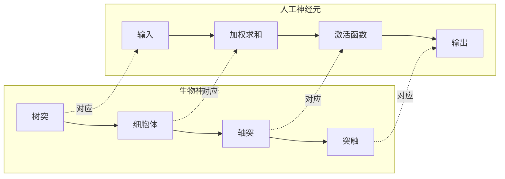

# 1.4.1 神经网络基本概念

## 1. 神经网络概述

### 1.1 什么是神经网络

神经网络（Neural Network）是一种受生物神经系统启发的计算模型，通过模拟大脑神经元之间的连接和信息传递方式来处理信息。它由大量相互连接的简单处理单元（神经元）组成，能够学习复杂的非线性映射关系。



### 1.2 神经网络的发展历程

```python
import matplotlib.pyplot as plt
import numpy as np
from datetime import datetime

# 神经网络发展时间线
class NeuralNetworkHistory:
    def __init__(self):
        self.milestones = [
            (1943, "McCulloch-Pitts神经元", "首个数学神经元模型"),
            (1957, "感知机", "Rosenblatt提出感知机算法"),
            (1969, "感知机局限性", "Minsky指出线性不可分问题"),
            (1986, "反向传播", "Rumelhart等人完善BP算法"),
            (1989, "通用逼近定理", "证明神经网络的理论基础"),
            (2006, "深度学习复兴", "Hinton提出深度信念网络"),
            (2012, "ImageNet突破", "AlexNet在图像识别上的成功"),
            (2017, "Transformer", "注意力机制革命性突破"),
            (2020, "GPT-3", "大规模语言模型的里程碑")
        ]
    
    def visualize_timeline(self):
        """可视化神经网络发展时间线"""
        fig, ax = plt.subplots(figsize=(15, 8))
        
        years = [milestone[0] for milestone in self.milestones]
        names = [milestone[1] for milestone in self.milestones]
        descriptions = [milestone[2] for milestone in self.milestones]
        
        # 绘制时间线
        ax.plot(years, [1]*len(years), 'o-', linewidth=3, markersize=10, color='#2E86AB')
        
        # 添加里程碑标签
        for i, (year, name, desc) in enumerate(self.milestones):
            # 交替显示在时间线上下
            y_pos = 1.3 if i % 2 == 0 else 0.7
            
            ax.annotate(f'{year}\n{name}', 
                       xy=(year, 1), xytext=(year, y_pos),
                       ha='center', va='center',
                       bbox=dict(boxstyle='round,pad=0.3', facecolor='lightblue', alpha=0.7),
                       arrowprops=dict(arrowstyle='->', color='gray', lw=1))
            
            # 添加描述
            ax.text(year, y_pos-0.2 if i % 2 == 0 else y_pos+0.2, desc, 
                   ha='center', va='center', fontsize=8, style='italic')
        
        ax.set_ylim(0, 2)
        ax.set_xlabel('年份', fontsize=12)
        ax.set_title('神经网络发展历程', fontsize=16, fontweight='bold')
        ax.grid(True, alpha=0.3)
        ax.set_yticks([])
        
        plt.tight_layout()
        plt.show()
        
        return fig

# 创建并显示发展历程
history = NeuralNetworkHistory()
history.visualize_timeline()
```

## 2. 人工神经元模型

### 2.1 基本神经元结构

人工神经元是神经网络的基本计算单元，它接收多个输入信号，经过加权求和和激活函数处理后产生输出。

**数学表达式：**

$$y = f(\sum_{i=1}^{n} w_i x_i + b)$$

其中：
- $x_i$：第i个输入
- $w_i$：第i个输入对应的权重
- $b$：偏置项
- $f$：激活函数
- $y$：输出

```python
class SimpleNeuron:
    """简单神经元实现"""
    
    def __init__(self, num_inputs, activation='sigmoid'):
        # 随机初始化权重和偏置
        self.weights = np.random.randn(num_inputs) * 0.1
        self.bias = np.random.randn() * 0.1
        self.activation = activation
    
    def sigmoid(self, x):
        """Sigmoid激活函数"""
        return 1 / (1 + np.exp(-np.clip(x, -500, 500)))
    
    def relu(self, x):
        """ReLU激活函数"""
        return np.maximum(0, x)
    
    def tanh(self, x):
        """Tanh激活函数"""
        return np.tanh(x)
    
    def forward(self, inputs):
        """前向传播"""
        # 加权求和
        weighted_sum = np.dot(inputs, self.weights) + self.bias
        
        # 应用激活函数
        if self.activation == 'sigmoid':
            output = self.sigmoid(weighted_sum)
        elif self.activation == 'relu':
            output = self.relu(weighted_sum)
        elif self.activation == 'tanh':
            output = self.tanh(weighted_sum)
        else:
            output = weighted_sum  # 线性激活
        
        return output
    
    def visualize_neuron(self):
        """可视化神经元结构"""
        fig, (ax1, ax2) = plt.subplots(1, 2, figsize=(15, 6))
        
        # 左图：神经元结构
        ax1.set_xlim(-2, 4)
        ax1.set_ylim(-2, 3)
        
        # 绘制输入
        num_inputs = len(self.weights)
        input_y = np.linspace(-1, 2, num_inputs)
        
        for i, y in enumerate(input_y):
            # 输入节点
            circle = plt.Circle((-1, y), 0.2, color='lightblue', ec='black')
            ax1.add_patch(circle)
            ax1.text(-1, y, f'x{i+1}', ha='center', va='center', fontweight='bold')
            
            # 连接线和权重
            ax1.arrow(-0.8, y, 1.3, 0.5-y, head_width=0.1, head_length=0.1, 
                     fc='red', ec='red', alpha=0.7)
            ax1.text(-0.2, y+0.2, f'w{i+1}={self.weights[i]:.2f}', 
                    fontsize=8, color='red')
        
        # 神经元主体
        circle = plt.Circle((1, 0.5), 0.4, color='yellow', ec='black', linewidth=2)
        ax1.add_patch(circle)
        ax1.text(1, 0.5, 'Σ', ha='center', va='center', fontsize=20, fontweight='bold')
        
        # 偏置
        ax1.text(1, -0.8, f'b={self.bias:.2f}', ha='center', va='center', 
                bbox=dict(boxstyle='round', facecolor='lightgreen'))
        
        # 激活函数
        rect = plt.Rectangle((2, 0.2), 0.6, 0.6, facecolor='orange', ec='black')
        ax1.add_patch(rect)
        ax1.text(2.3, 0.5, self.activation, ha='center', va='center', fontweight='bold')
        
        # 输出
        ax1.arrow(2.6, 0.5, 0.8, 0, head_width=0.1, head_length=0.1, 
                 fc='green', ec='green')
        ax1.text(3.5, 0.5, 'y', ha='center', va='center', fontsize=16, 
                fontweight='bold', color='green')
        
        ax1.set_title('神经元结构图', fontsize=14, fontweight='bold')
        ax1.axis('off')
        
        # 右图：激活函数
        x = np.linspace(-5, 5, 100)
        if self.activation == 'sigmoid':
            y = self.sigmoid(x)
        elif self.activation == 'relu':
            y = self.relu(x)
        elif self.activation == 'tanh':
            y = self.tanh(x)
        else:
            y = x
        
        ax2.plot(x, y, linewidth=3, color='blue')
        ax2.grid(True, alpha=0.3)
        ax2.set_xlabel('输入 (x)', fontsize=12)
        ax2.set_ylabel('输出 f(x)', fontsize=12)
        ax2.set_title(f'{self.activation.upper()} 激活函数', fontsize=14, fontweight='bold')
        
        plt.tight_layout()
        plt.show()
        
        return fig

# 演示不同激活函数的神经元
print("=" * 60)
print("🧠 神经元模型演示")
print("=" * 60)

# 创建不同激活函数的神经元
activations = ['sigmoid', 'relu', 'tanh']
for activation in activations:
    print(f"\n📊 {activation.upper()} 神经元:")
    neuron = SimpleNeuron(num_inputs=3, activation=activation)
    
    # 测试输入
    test_input = np.array([0.5, -0.3, 0.8])
    output = neuron.forward(test_input)
    
    print(f"   权重: {neuron.weights}")
    print(f"   偏置: {neuron.bias:.4f}")
    print(f"   输入: {test_input}")
    print(f"   输出: {output:.4f}")
    
    # 可视化第一个神经元
    if activation == 'sigmoid':
        neuron.visualize_neuron()
```

### 2.2 激活函数详解

激活函数为神经网络引入非线性，使其能够学习复杂的模式。

```python
class ActivationFunctions:
    """激活函数集合"""
    
    @staticmethod
    def sigmoid(x):
        """Sigmoid函数: f(x) = 1/(1+e^(-x))"""
        return 1 / (1 + np.exp(-np.clip(x, -500, 500)))
    
    @staticmethod
    def sigmoid_derivative(x):
        """Sigmoid导数"""
        s = ActivationFunctions.sigmoid(x)
        return s * (1 - s)
    
    @staticmethod
    def relu(x):
        """ReLU函数: f(x) = max(0, x)"""
        return np.maximum(0, x)
    
    @staticmethod
    def relu_derivative(x):
        """ReLU导数"""
        return (x > 0).astype(float)
    
    @staticmethod
    def tanh(x):
        """Tanh函数: f(x) = tanh(x)"""
        return np.tanh(x)
    
    @staticmethod
    def tanh_derivative(x):
        """Tanh导数"""
        return 1 - np.tanh(x) ** 2
    
    @staticmethod
    def leaky_relu(x, alpha=0.01):
        """Leaky ReLU函数"""
        return np.where(x > 0, x, alpha * x)
    
    @staticmethod
    def leaky_relu_derivative(x, alpha=0.01):
        """Leaky ReLU导数"""
        return np.where(x > 0, 1, alpha)
    
    @staticmethod
    def softmax(x):
        """Softmax函数（用于多分类）"""
        exp_x = np.exp(x - np.max(x, axis=-1, keepdims=True))
        return exp_x / np.sum(exp_x, axis=-1, keepdims=True)
    
    def compare_activations(self):
        """比较不同激活函数"""
        x = np.linspace(-5, 5, 100)
        
        fig, axes = plt.subplots(2, 3, figsize=(18, 12))
        axes = axes.flatten()
        
        functions = [
            ('Sigmoid', self.sigmoid, self.sigmoid_derivative),
            ('ReLU', self.relu, self.relu_derivative),
            ('Tanh', self.tanh, self.tanh_derivative),
            ('Leaky ReLU', self.leaky_relu, self.leaky_relu_derivative),
        ]
        
        for i, (name, func, deriv) in enumerate(functions):
            if i < len(axes):
                y = func(x)
                dy = deriv(x)
                
                axes[i].plot(x, y, label=f'{name}', linewidth=3, color='blue')
                axes[i].plot(x, dy, label=f'{name} 导数', linewidth=2, 
                           color='red', linestyle='--')
                
                axes[i].grid(True, alpha=0.3)
                axes[i].legend()
                axes[i].set_title(f'{name} 激活函数', fontweight='bold')
                axes[i].set_xlabel('x')
                axes[i].set_ylabel('f(x)')
        
        # Softmax特殊处理（多维输入）
        x_soft = np.array([[1, 2, 3], [1, 5, 1], [3, 1, 2]])
        y_soft = self.softmax(x_soft)
        
        axes[4].bar(range(len(x_soft)), x_soft.flatten(), alpha=0.7, label='输入')
        axes[4].bar(range(len(y_soft)), y_soft.flatten(), alpha=0.7, label='Softmax输出')
        axes[4].set_title('Softmax 示例', fontweight='bold')
        axes[4].legend()
        
        # 隐藏最后一个子图
        axes[5].axis('off')
        
        plt.tight_layout()
        plt.show()
        
        return fig
    
    def activation_properties(self):
        """激活函数特性分析"""
        properties = {
            'Sigmoid': {
                '范围': '(0, 1)',
                '优点': '平滑、可微、输出有界',
                '缺点': '梯度消失、计算复杂',
                '适用': '二分类输出层'
            },
            'ReLU': {
                '范围': '[0, +∞)',
                '优点': '计算简单、缓解梯度消失',
                '缺点': '神经元死亡、输出无上界',
                '适用': '隐藏层（最常用）'
            },
            'Tanh': {
                '范围': '(-1, 1)',
                '优点': '零中心、平滑可微',
                '缺点': '梯度消失',
                '适用': '隐藏层（RNN中常用）'
            },
            'Leaky ReLU': {
                '范围': '(-∞, +∞)',
                '优点': '避免神经元死亡',
                '缺点': '需要调整α参数',
                '适用': '深层网络隐藏层'
            },
            'Softmax': {
                '范围': '(0, 1)，和为1',
                '优点': '概率解释、多分类',
                '缺点': '计算复杂',
                '适用': '多分类输出层'
            }
        }
        
        print("\n" + "=" * 80)
        print("📊 激活函数特性对比")
        print("=" * 80)
        
        for name, props in properties.items():
            print(f"\n🔸 {name}:")
            for key, value in props.items():
                print(f"   {key}: {value}")
        
        return properties

# 激活函数演示
activation_demo = ActivationFunctions()
activation_demo.compare_activations()
properties = activation_demo.activation_properties()
```

## 3. 多层感知机（MLP）

### 3.1 网络结构

多层感知机是最基本的前馈神经网络，由输入层、一个或多个隐藏层和输出层组成。

```python
class MultiLayerPerceptron:
    """多层感知机实现"""
    
    def __init__(self, layer_sizes, activations=None, learning_rate=0.01):
        self.layer_sizes = layer_sizes
        self.num_layers = len(layer_sizes)
        self.learning_rate = learning_rate
        
        # 默认激活函数
        if activations is None:
            activations = ['relu'] * (self.num_layers - 2) + ['sigmoid']
        self.activations = activations
        
        # 初始化权重和偏置
        self.weights = []
        self.biases = []
        
        for i in range(self.num_layers - 1):
            # Xavier初始化
            w = np.random.randn(layer_sizes[i], layer_sizes[i+1]) * np.sqrt(2.0 / layer_sizes[i])
            b = np.zeros((1, layer_sizes[i+1]))
            
            self.weights.append(w)
            self.biases.append(b)
        
        # 存储前向传播的中间结果
        self.activations_cache = []
        self.z_cache = []
    
    def activate(self, z, activation_type):
        """激活函数"""
        if activation_type == 'sigmoid':
            return 1 / (1 + np.exp(-np.clip(z, -500, 500)))
        elif activation_type == 'relu':
            return np.maximum(0, z)
        elif activation_type == 'tanh':
            return np.tanh(z)
        elif activation_type == 'softmax':
            exp_z = np.exp(z - np.max(z, axis=1, keepdims=True))
            return exp_z / np.sum(exp_z, axis=1, keepdims=True)
        else:
            return z  # 线性激活
    
    def activate_derivative(self, z, activation_type):
        """激活函数导数"""
        if activation_type == 'sigmoid':
            s = self.activate(z, 'sigmoid')
            return s * (1 - s)
        elif activation_type == 'relu':
            return (z > 0).astype(float)
        elif activation_type == 'tanh':
            return 1 - np.tanh(z) ** 2
        else:
            return np.ones_like(z)  # 线性激活导数为1
    
    def forward(self, X):
        """前向传播"""
        self.activations_cache = [X]
        self.z_cache = []
        
        current_input = X
        
        for i in range(self.num_layers - 1):
            # 线性变换
            z = np.dot(current_input, self.weights[i]) + self.biases[i]
            self.z_cache.append(z)
            
            # 激活函数
            a = self.activate(z, self.activations[i])
            self.activations_cache.append(a)
            
            current_input = a
        
        return current_input
    
    def backward(self, X, y, output):
        """反向传播"""
        m = X.shape[0]  # 样本数量
        
        # 计算输出层误差
        if self.activations[-1] == 'softmax':
            # 对于softmax + 交叉熵，梯度简化为 (y_pred - y_true)
            dz = output - y
        else:
            # 对于其他激活函数
            dz = (output - y) * self.activate_derivative(self.z_cache[-1], self.activations[-1])
        
        # 存储梯度
        dw_list = []
        db_list = []
        
        # 从输出层向输入层反向传播
        for i in range(self.num_layers - 2, -1, -1):
            # 计算权重和偏置梯度
            dw = np.dot(self.activations_cache[i].T, dz) / m
            db = np.mean(dz, axis=0, keepdims=True)
            
            dw_list.insert(0, dw)
            db_list.insert(0, db)
            
            # 计算前一层的误差（如果不是输入层）
            if i > 0:
                dz = np.dot(dz, self.weights[i].T) * self.activate_derivative(
                    self.z_cache[i-1], self.activations[i-1])
        
        return dw_list, db_list
    
    def update_parameters(self, dw_list, db_list):
        """更新参数"""
        for i in range(len(self.weights)):
            self.weights[i] -= self.learning_rate * dw_list[i]
            self.biases[i] -= self.learning_rate * db_list[i]
    
    def train(self, X, y, epochs=1000, verbose=True):
        """训练网络"""
        losses = []
        
        for epoch in range(epochs):
            # 前向传播
            output = self.forward(X)
            
            # 计算损失
            if self.activations[-1] == 'softmax':
                # 交叉熵损失
                loss = -np.mean(np.sum(y * np.log(output + 1e-8), axis=1))
            else:
                # 均方误差损失
                loss = np.mean((output - y) ** 2)
            
            losses.append(loss)
            
            # 反向传播
            dw_list, db_list = self.backward(X, y, output)
            
            # 更新参数
            self.update_parameters(dw_list, db_list)
            
            # 打印进度
            if verbose and (epoch + 1) % (epochs // 10) == 0:
                print(f"Epoch {epoch + 1}/{epochs}, Loss: {loss:.6f}")
        
        return losses
    
    def predict(self, X):
        """预测"""
        return self.forward(X)
    
    def visualize_network(self):
        """可视化网络结构"""
        fig, ax = plt.subplots(figsize=(12, 8))
        
        # 计算层的位置
        max_neurons = max(self.layer_sizes)
        layer_positions = np.linspace(0, 10, self.num_layers)
        
        # 绘制每一层
        for layer_idx, num_neurons in enumerate(self.layer_sizes):
            x = layer_positions[layer_idx]
            
            # 计算神经元的y坐标
            if num_neurons == 1:
                y_positions = [max_neurons / 2]
            else:
                y_positions = np.linspace(0, max_neurons, num_neurons)
            
            # 绘制神经元
            for neuron_idx, y in enumerate(y_positions):
                if layer_idx == 0:
                    color = 'lightblue'  # 输入层
                    label = f'x{neuron_idx+1}'
                elif layer_idx == self.num_layers - 1:
                    color = 'lightgreen'  # 输出层
                    label = f'y{neuron_idx+1}'
                else:
                    color = 'lightyellow'  # 隐藏层
                    label = f'h{neuron_idx+1}'
                
                circle = plt.Circle((x, y), 0.3, color=color, ec='black')
                ax.add_patch(circle)
                ax.text(x, y, label, ha='center', va='center', fontweight='bold')
                
                # 绘制连接线（除了最后一层）
                if layer_idx < self.num_layers - 1:
                    next_layer_size = self.layer_sizes[layer_idx + 1]
                    next_x = layer_positions[layer_idx + 1]
                    
                    if next_layer_size == 1:
                        next_y_positions = [max_neurons / 2]
                    else:
                        next_y_positions = np.linspace(0, max_neurons, next_layer_size)
                    
                    for next_y in next_y_positions:
                        ax.plot([x + 0.3, next_x - 0.3], [y, next_y], 
                               'k-', alpha=0.3, linewidth=1)
        
        # 添加层标签
        layer_labels = ['输入层'] + [f'隐藏层{i}' for i in range(1, self.num_layers-1)] + ['输出层']
        for i, (x, label) in enumerate(zip(layer_positions, layer_labels)):
            ax.text(x, -1, label, ha='center', va='center', 
                   fontweight='bold', fontsize=12)
            ax.text(x, -1.5, f'({self.layer_sizes[i]})', ha='center', va='center', 
                   fontsize=10, style='italic')
        
        ax.set_xlim(-1, 11)
        ax.set_ylim(-2, max_neurons + 1)
        ax.set_aspect('equal')
        ax.axis('off')
        ax.set_title('多层感知机网络结构', fontsize=16, fontweight='bold')
        
        plt.tight_layout()
        plt.show()
        
        return fig

# MLP演示
print("\n" + "=" * 60)
print("🧠 多层感知机演示")
print("=" * 60)

# 创建简单的分类数据集
np.random.seed(42)
X = np.random.randn(200, 2)
y = ((X[:, 0] ** 2 + X[:, 1] ** 2) > 1).astype(int)
y_onehot = np.eye(2)[y]  # 转换为one-hot编码

print(f"\n📊 数据集信息:")
print(f"   样本数量: {X.shape[0]}")
print(f"   特征维度: {X.shape[1]}")
print(f"   类别数量: {len(np.unique(y))}")

# 创建MLP
mlp = MultiLayerPerceptron(
    layer_sizes=[2, 8, 4, 2],  # 2输入 -> 8隐藏 -> 4隐藏 -> 2输出
    activations=['relu', 'relu', 'softmax'],
    learning_rate=0.1
)

# 可视化网络结构
mlp.visualize_network()

# 训练网络
print(f"\n🚀 开始训练...")
losses = mlp.train(X, y_onehot, epochs=1000, verbose=True)

# 绘制损失曲线
fig, (ax1, ax2) = plt.subplots(1, 2, figsize=(15, 6))

# 损失曲线
ax1.plot(losses, linewidth=2, color='red')
ax1.set_xlabel('Epoch')
ax1.set_ylabel('Loss')
ax1.set_title('训练损失曲线')
ax1.grid(True, alpha=0.3)

# 决策边界可视化
h = 0.02
x_min, x_max = X[:, 0].min() - 1, X[:, 0].max() + 1
y_min, y_max = X[:, 1].min() - 1, X[:, 1].max() + 1
xx, yy = np.meshgrid(np.arange(x_min, x_max, h),
                     np.arange(y_min, y_max, h))

mesh_points = np.c_[xx.ravel(), yy.ravel()]
predictions = mlp.predict(mesh_points)
Z = np.argmax(predictions, axis=1)
Z = Z.reshape(xx.shape)

ax2.contourf(xx, yy, Z, alpha=0.8, cmap=plt.cm.RdYlBu)
scatter = ax2.scatter(X[:, 0], X[:, 1], c=y, cmap=plt.cm.RdYlBu, edgecolors='black')
ax2.set_xlabel('特征1')
ax2.set_ylabel('特征2')
ax2.set_title('MLP决策边界')

plt.tight_layout()
plt.show()

# 计算准确率
train_pred = mlp.predict(X)
train_accuracy = np.mean(np.argmax(train_pred, axis=1) == y)
print(f"\n✅ 训练完成!")
print(f"   最终损失: {losses[-1]:.6f}")
print(f"   训练准确率: {train_accuracy:.4f}")
```