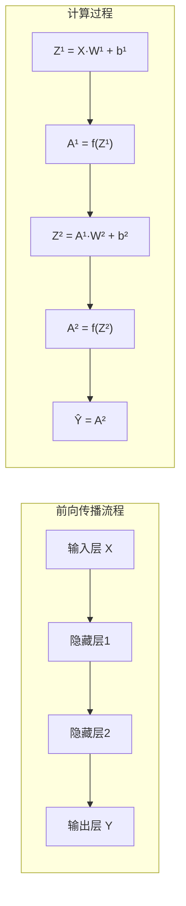
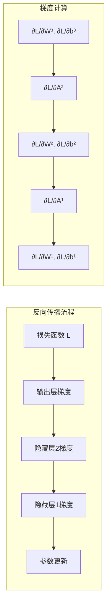

# 1.4.2 前向传播与反向传播

## 1. 前向传播（Forward Propagation）

### 1.1 前向传播概述

前向传播是神经网络中信息从输入层流向输出层的过程。在这个过程中，每一层的神经元接收前一层的输出，经过线性变换和激活函数处理后，将结果传递给下一层。



### 1.2 数学表达式

对于一个L层的神经网络，前向传播的数学表达式为：

**第l层的计算：**
$$Z^{[l]} = A^{[l-1]} \cdot W^{[l]} + b^{[l]}$$
$$A^{[l]} = g^{[l]}(Z^{[l]})$$

其中：
- $A^{[l]}$：第l层的激活值
- $W^{[l]}$：第l层的权重矩阵
- $b^{[l]}$：第l层的偏置向量
- $g^{[l]}$：第l层的激活函数
- $A^{[0]} = X$：输入数据

```python
import numpy as np
import matplotlib.pyplot as plt
from matplotlib.animation import FuncAnimation
import seaborn as sns

class ForwardPropagationDemo:
    """前向传播演示类"""
    
    def __init__(self, layer_sizes, activations=None):
        self.layer_sizes = layer_sizes
        self.num_layers = len(layer_sizes)
        
        # 默认激活函数
        if activations is None:
            activations = ['relu'] * (self.num_layers - 2) + ['sigmoid']
        self.activations = activations
        
        # 初始化权重和偏置
        self.weights = []
        self.biases = []
        
        np.random.seed(42)
        for i in range(self.num_layers - 1):
            # He初始化（适用于ReLU）
            w = np.random.randn(layer_sizes[i], layer_sizes[i+1]) * np.sqrt(2.0 / layer_sizes[i])
            b = np.zeros((1, layer_sizes[i+1]))
            
            self.weights.append(w)
            self.biases.append(b)
        
        # 存储前向传播过程
        self.forward_cache = {}
    
    def activation_function(self, z, activation_type):
        """激活函数"""
        if activation_type == 'sigmoid':
            return 1 / (1 + np.exp(-np.clip(z, -500, 500)))
        elif activation_type == 'relu':
            return np.maximum(0, z)
        elif activation_type == 'tanh':
            return np.tanh(z)
        elif activation_type == 'softmax':
            exp_z = np.exp(z - np.max(z, axis=1, keepdims=True))
            return exp_z / np.sum(exp_z, axis=1, keepdims=True)
        else:
            return z  # 线性激活
    
    def forward_propagation_step_by_step(self, X, verbose=True):
        """逐步展示前向传播过程"""
        if verbose:
            print(f"\n{'='*80}")
            print(f"🚀 前向传播逐步演示")
            print(f"{'='*80}")
            print(f"\n📊 输入数据形状: {X.shape}")
            print(f"   网络结构: {' -> '.join(map(str, self.layer_sizes))}")
        
        # 初始化
        current_activation = X
        self.forward_cache = {'A0': X}
        
        if verbose:
            print(f"\n🔸 输入层 (A⁰):")
            print(f"   形状: {current_activation.shape}")
            print(f"   数值: {current_activation.flatten()[:5]}..." if current_activation.size > 5 else f"   数值: {current_activation.flatten()}")
        
        # 逐层前向传播
        for layer in range(self.num_layers - 1):
            if verbose:
                print(f"\n{'─'*60}")
                print(f"🔸 第 {layer + 1} 层计算:")
            
            # 线性变换: Z = A·W + b
            z = np.dot(current_activation, self.weights[layer]) + self.biases[layer]
            
            if verbose:
                print(f"   权重 W{layer+1} 形状: {self.weights[layer].shape}")
                print(f"   偏置 b{layer+1} 形状: {self.biases[layer].shape}")
                print(f"   线性输出 Z{layer+1} 形状: {z.shape}")
                print(f"   Z{layer+1} 范围: [{z.min():.4f}, {z.max():.4f}]")
            
            # 激活函数: A = g(Z)
            activation_type = self.activations[layer]
            current_activation = self.activation_function(z, activation_type)
            
            if verbose:
                print(f"   激活函数: {activation_type}")
                print(f"   激活输出 A{layer+1} 形状: {current_activation.shape}")
                print(f"   A{layer+1} 范围: [{current_activation.min():.4f}, {current_activation.max():.4f}]")
            
            # 缓存结果
            self.forward_cache[f'Z{layer+1}'] = z
            self.forward_cache[f'A{layer+1}'] = current_activation
        
        if verbose:
            print(f"\n✅ 前向传播完成!")
            print(f"   最终输出形状: {current_activation.shape}")
            print(f"   输出值: {current_activation.flatten()}")
        
        return current_activation
    
    def visualize_forward_flow(self, X):
        """可视化前向传播数据流"""
        # 执行前向传播
        output = self.forward_propagation_step_by_step(X, verbose=False)
        
        # 创建可视化
        fig, axes = plt.subplots(2, self.num_layers, figsize=(4*self.num_layers, 10))
        if self.num_layers == 1:
            axes = axes.reshape(2, 1)
        
        # 上排：激活值热图
        for layer in range(self.num_layers):
            activation_key = f'A{layer}'
            activation_data = self.forward_cache[activation_key]
            
            # 如果是1D数据，转换为2D用于显示
            if len(activation_data.shape) == 1:
                activation_data = activation_data.reshape(-1, 1)
            elif activation_data.shape[0] == 1:
                activation_data = activation_data.T
            
            im1 = axes[0, layer].imshow(activation_data, cmap='viridis', aspect='auto')
            axes[0, layer].set_title(f'A{layer} (激活值)', fontweight='bold')
            axes[0, layer].set_xlabel('神经元')
            axes[0, layer].set_ylabel('样本' if layer == 0 else '激活值')
            plt.colorbar(im1, ax=axes[0, layer])
        
        # 下排：权重热图
        for layer in range(self.num_layers - 1):
            im2 = axes[1, layer].imshow(self.weights[layer], cmap='RdBu', aspect='auto')
            axes[1, layer].set_title(f'W{layer+1} (权重)', fontweight='bold')
            axes[1, layer].set_xlabel(f'第{layer+2}层神经元')
            axes[1, layer].set_ylabel(f'第{layer+1}层神经元')
            plt.colorbar(im2, ax=axes[1, layer])
        
        # 最后一列显示输出分布
        if self.num_layers > 1:
            axes[1, -1].hist(output.flatten(), bins=20, alpha=0.7, color='green')
            axes[1, -1].set_title('输出分布', fontweight='bold')
            axes[1, -1].set_xlabel('输出值')
            axes[1, -1].set_ylabel('频次')
        
        plt.tight_layout()
        plt.show()
        
        return fig
    
    def analyze_activation_statistics(self, X):
        """分析各层激活值统计信息"""
        output = self.forward_propagation_step_by_step(X, verbose=False)
        
        print(f"\n{'='*80}")
        print(f"📊 各层激活值统计分析")
        print(f"{'='*80}")
        
        statistics = {}
        
        for layer in range(self.num_layers):
            activation_key = f'A{layer}'
            activation_data = self.forward_cache[activation_key]
            
            stats = {
                'mean': np.mean(activation_data),
                'std': np.std(activation_data),
                'min': np.min(activation_data),
                'max': np.max(activation_data),
                'zeros_ratio': np.mean(activation_data == 0),  # 对ReLU有意义
                'shape': activation_data.shape
            }
            
            statistics[f'Layer_{layer}'] = stats
            
            layer_name = '输入层' if layer == 0 else f'隐藏层{layer}' if layer < self.num_layers-1 else '输出层'
            print(f"\n🔸 {layer_name} (A{layer}):")
            print(f"   形状: {stats['shape']}")
            print(f"   均值: {stats['mean']:.4f}")
            print(f"   标准差: {stats['std']:.4f}")
            print(f"   范围: [{stats['min']:.4f}, {stats['max']:.4f}]")
            if layer > 0 and self.activations[layer-1] == 'relu':
                print(f"   零值比例: {stats['zeros_ratio']:.2%} (ReLU死神经元)")
        
        return statistics

# 前向传播演示
print("\n" + "=" * 80)
print("🧠 前向传播详细演示")
print("=" * 80)

# 创建演示网络
forward_demo = ForwardPropagationDemo(
    layer_sizes=[3, 5, 4, 2],
    activations=['relu', 'relu', 'sigmoid']
)

# 创建测试数据
test_input = np.array([[0.5, -0.3, 0.8]])
print(f"\n📝 测试输入: {test_input}")

# 逐步演示前向传播
output = forward_demo.forward_propagation_step_by_step(test_input)

# 可视化数据流
forward_demo.visualize_forward_flow(test_input)

# 分析激活值统计
stats = forward_demo.analyze_activation_statistics(test_input)
```

## 2. 反向传播（Backward Propagation）

### 2.1 反向传播概述

反向传播是训练神经网络的核心算法，它通过链式法则计算损失函数对网络参数的梯度，然后使用梯度下降法更新参数。



### 2.2 数学推导

**链式法则：**
$$\frac{\partial L}{\partial W^{[l]}} = \frac{\partial L}{\partial Z^{[l]}} \cdot \frac{\partial Z^{[l]}}{\partial W^{[l]}}$$

**具体计算公式：**

1. **输出层梯度：**
   $$dZ^{[L]} = A^{[L]} - Y$$

2. **隐藏层梯度：**
   $$dZ^{[l]} = (W^{[l+1]})^T \cdot dZ^{[l+1]} \odot g'^{[l]}(Z^{[l]})$$

3. **权重和偏置梯度：**
   $$dW^{[l]} = \frac{1}{m} dZ^{[l]} \cdot (A^{[l-1]})^T$$
   $$db^{[l]} = \frac{1}{m} \sum_{i=1}^{m} dZ^{[l](i)}$$

```python
class BackwardPropagationDemo:
    """反向传播演示类"""
    
    def __init__(self, forward_demo):
        self.forward_demo = forward_demo
        self.layer_sizes = forward_demo.layer_sizes
        self.num_layers = forward_demo.num_layers
        self.activations = forward_demo.activations
        self.weights = forward_demo.weights
        self.biases = forward_demo.biases
        
        # 存储反向传播过程
        self.backward_cache = {}
    
    def activation_derivative(self, z, activation_type):
        """激活函数导数"""
        if activation_type == 'sigmoid':
            s = 1 / (1 + np.exp(-np.clip(z, -500, 500)))
            return s * (1 - s)
        elif activation_type == 'relu':
            return (z > 0).astype(float)
        elif activation_type == 'tanh':
            return 1 - np.tanh(z) ** 2
        else:
            return np.ones_like(z)  # 线性激活导数为1
    
    def compute_loss(self, y_pred, y_true, loss_type='mse'):
        """计算损失函数"""
        if loss_type == 'mse':
            return np.mean((y_pred - y_true) ** 2)
        elif loss_type == 'cross_entropy':
            return -np.mean(np.sum(y_true * np.log(y_pred + 1e-8), axis=1))
        else:
            return np.mean(np.abs(y_pred - y_true))
    
    def compute_loss_derivative(self, y_pred, y_true, loss_type='mse'):
        """计算损失函数导数"""
        m = y_true.shape[0]
        
        if loss_type == 'mse':
            return 2 * (y_pred - y_true) / m
        elif loss_type == 'cross_entropy':
            return (y_pred - y_true) / m
        else:
            return np.sign(y_pred - y_true) / m
    
    def backward_propagation_step_by_step(self, X, y_true, loss_type='mse', verbose=True):
        """逐步展示反向传播过程"""
        if verbose:
            print(f"\n{'='*80}")
            print(f"⬅️ 反向传播逐步演示")
            print(f"{'='*80}")
        
        # 首先进行前向传播
        y_pred = self.forward_demo.forward_propagation_step_by_step(X, verbose=False)
        forward_cache = self.forward_demo.forward_cache
        
        # 计算损失
        loss = self.compute_loss(y_pred, y_true, loss_type)
        
        if verbose:
            print(f"\n📊 损失计算:")
            print(f"   预测值: {y_pred.flatten()}")
            print(f"   真实值: {y_true.flatten()}")
            print(f"   损失函数: {loss_type}")
            print(f"   损失值: {loss:.6f}")
        
        # 初始化梯度缓存
        self.backward_cache = {}
        
        # 计算输出层梯度
        if loss_type == 'cross_entropy' and self.activations[-1] == 'softmax':
            # 对于softmax + 交叉熵，梯度简化
            dZ = y_pred - y_true
        else:
            # 一般情况
            dL_dA = self.compute_loss_derivative(y_pred, y_true, loss_type)
            last_layer_idx = self.num_layers - 2
            dA_dZ = self.activation_derivative(
                forward_cache[f'Z{self.num_layers-1}'], 
                self.activations[last_layer_idx]
            )
            dZ = dL_dA * dA_dZ
        
        if verbose:
            print(f"\n🔸 输出层梯度 (dZ{self.num_layers-1}):")
            print(f"   形状: {dZ.shape}")
            print(f"   范围: [{dZ.min():.6f}, {dZ.max():.6f}]")
            print(f"   均值: {dZ.mean():.6f}")
        
        self.backward_cache[f'dZ{self.num_layers-1}'] = dZ
        
        # 从输出层向输入层反向传播
        current_dZ = dZ
        
        for layer in range(self.num_layers - 2, -1, -1):
            if verbose:
                print(f"\n{'─'*60}")
                print(f"🔸 第 {layer + 1} 层反向传播:")
            
            # 计算权重梯度: dW = (1/m) * A_prev^T * dZ
            A_prev = forward_cache[f'A{layer}']
            dW = np.dot(A_prev.T, current_dZ) / X.shape[0]
            
            # 计算偏置梯度: db = (1/m) * sum(dZ)
            db = np.mean(current_dZ, axis=0, keepdims=True)
            
            if verbose:
                print(f"   权重梯度 dW{layer+1}:")
                print(f"     形状: {dW.shape}")
                print(f"     范围: [{dW.min():.6f}, {dW.max():.6f}]")
                print(f"     L2范数: {np.linalg.norm(dW):.6f}")
                
                print(f"   偏置梯度 db{layer+1}:")
                print(f"     形状: {db.shape}")
                print(f"     值: {db.flatten()}")
            
            # 存储梯度
            self.backward_cache[f'dW{layer+1}'] = dW
            self.backward_cache[f'db{layer+1}'] = db
            
            # 计算前一层的激活梯度（如果不是输入层）
            if layer > 0:
                # dA_prev = W^T * dZ
                dA_prev = np.dot(current_dZ, self.weights[layer].T)
                
                # dZ_prev = dA_prev * g'(Z_prev)
                Z_prev = forward_cache[f'Z{layer}']
                dZ_prev = dA_prev * self.activation_derivative(Z_prev, self.activations[layer-1])
                
                if verbose:
                    print(f"   前层激活梯度 dA{layer}:")
                    print(f"     形状: {dA_prev.shape}")
                    print(f"     范围: [{dA_prev.min():.6f}, {dA_prev.max():.6f}]")
                    
                    print(f"   前层输入梯度 dZ{layer}:")
                    print(f"     形状: {dZ_prev.shape}")
                    print(f"     范围: [{dZ_prev.min():.6f}, {dZ_prev.max():.6f}]")
                
                self.backward_cache[f'dA{layer}'] = dA_prev
                self.backward_cache[f'dZ{layer}'] = dZ_prev
                current_dZ = dZ_prev
        
        if verbose:
            print(f"\n✅ 反向传播完成!")
            print(f"   计算了 {len([k for k in self.backward_cache.keys() if k.startswith('dW')])} 个权重梯度")
            print(f"   计算了 {len([k for k in self.backward_cache.keys() if k.startswith('db')])} 个偏置梯度")
        
        return loss, self.backward_cache
    
    def visualize_gradients(self, X, y_true):
        """可视化梯度"""
        loss, gradients = self.backward_propagation_step_by_step(X, y_true, verbose=False)
        
        # 计算权重梯度的数量
        num_weight_layers = len([k for k in gradients.keys() if k.startswith('dW')])
        
        fig, axes = plt.subplots(2, num_weight_layers, figsize=(5*num_weight_layers, 10))
        if num_weight_layers == 1:
            axes = axes.reshape(2, 1)
        
        for i in range(num_weight_layers):
            layer_idx = i + 1
            
            # 上排：权重梯度热图
            dW = gradients[f'dW{layer_idx}']
            im1 = axes[0, i].imshow(dW, cmap='RdBu', aspect='auto')
            axes[0, i].set_title(f'权重梯度 dW{layer_idx}', fontweight='bold')
            axes[0, i].set_xlabel(f'第{layer_idx+1}层神经元')
            axes[0, i].set_ylabel(f'第{layer_idx}层神经元')
            plt.colorbar(im1, ax=axes[0, i])
            
            # 下排：梯度统计
            gradient_flat = dW.flatten()
            axes[1, i].hist(gradient_flat, bins=20, alpha=0.7, color='blue')
            axes[1, i].axvline(gradient_flat.mean(), color='red', linestyle='--', 
                              label=f'均值: {gradient_flat.mean():.6f}')
            axes[1, i].set_title(f'dW{layer_idx} 分布', fontweight='bold')
            axes[1, i].set_xlabel('梯度值')
            axes[1, i].set_ylabel('频次')
            axes[1, i].legend()
        
        plt.tight_layout()
        plt.show()
        
        return fig
    
    def gradient_checking(self, X, y_true, epsilon=1e-7):
        """梯度检查（数值梯度 vs 解析梯度）"""
        print(f"\n{'='*80}")
        print(f"🔍 梯度检查")
        print(f"{'='*80}")
        
        # 计算解析梯度
        loss, analytical_gradients = self.backward_propagation_step_by_step(X, y_true, verbose=False)
        
        # 数值梯度检查
        print(f"\n📊 检查结果:")
        
        for layer in range(self.num_layers - 1):
            layer_idx = layer + 1
            
            # 检查权重梯度
            dW_analytical = analytical_gradients[f'dW{layer_idx}']
            
            # 随机选择几个权重进行数值梯度检查
            num_checks = min(5, dW_analytical.size)
            indices = np.random.choice(dW_analytical.size, num_checks, replace=False)
            
            print(f"\n🔸 第 {layer_idx} 层权重梯度检查:")
            
            for idx in indices:
                i, j = np.unravel_index(idx, dW_analytical.shape)
                
                # 计算数值梯度
                original_weight = self.weights[layer][i, j]
                
                # f(x + epsilon)
                self.weights[layer][i, j] = original_weight + epsilon
                y_pred_plus = self.forward_demo.forward_propagation_step_by_step(X, verbose=False)
                loss_plus = self.compute_loss(y_pred_plus, y_true)
                
                # f(x - epsilon)
                self.weights[layer][i, j] = original_weight - epsilon
                y_pred_minus = self.forward_demo.forward_propagation_step_by_step(X, verbose=False)
                loss_minus = self.compute_loss(y_pred_minus, y_true)
                
                # 恢复原始权重
                self.weights[layer][i, j] = original_weight
                
                # 数值梯度
                numerical_gradient = (loss_plus - loss_minus) / (2 * epsilon)
                analytical_gradient = dW_analytical[i, j]
                
                # 计算相对误差
                relative_error = abs(numerical_gradient - analytical_gradient) / \
                               (abs(numerical_gradient) + abs(analytical_gradient) + 1e-8)
                
                status = "✅" if relative_error < 1e-5 else "❌"
                print(f"     W{layer_idx}[{i},{j}]: 数值={numerical_gradient:.8f}, "
                      f"解析={analytical_gradient:.8f}, 误差={relative_error:.2e} {status}")
        
        print(f"\n💡 梯度检查说明:")
        print(f"   - 相对误差 < 1e-5: 梯度计算正确 ✅")
        print(f"   - 相对误差 > 1e-3: 可能存在错误 ❌")

# 反向传播演示
print("\n" + "=" * 80)
print("🧠 反向传播详细演示")
print("=" * 80)

# 使用之前的前向传播演示网络
backward_demo = BackwardPropagationDemo(forward_demo)

# 创建测试数据和标签
test_input = np.array([[0.5, -0.3, 0.8]])
test_target = np.array([[0.2, 0.8]])  # 目标输出

print(f"\n📝 测试数据:")
print(f"   输入: {test_input}")
print(f"   目标: {test_target}")

# 逐步演示反向传播
loss, gradients = backward_demo.backward_propagation_step_by_step(test_input, test_target)

# 可视化梯度
backward_demo.visualize_gradients(test_input, test_target)

# 梯度检查
backward_demo.gradient_checking(test_input, test_target)
```

## 3. 完整的训练循环

### 3.1 梯度下降优化

```python
class NeuralNetworkTrainer:
    """完整的神经网络训练器"""
    
    def __init__(self, layer_sizes, activations=None, learning_rate=0.01, 
                 optimizer='sgd', loss_function='mse'):
        self.layer_sizes = layer_sizes
        self.num_layers = len(layer_sizes)
        self.learning_rate = learning_rate
        self.optimizer = optimizer
        self.loss_function = loss_function
        
        # 激活函数
        if activations is None:
            activations = ['relu'] * (self.num_layers - 2) + ['sigmoid']
        self.activations = activations
        
        # 初始化参数
        self.initialize_parameters()
        
        # 优化器相关参数
        self.initialize_optimizer()
        
        # 训练历史
        self.training_history = {
            'losses': [],
            'accuracies': [],
            'gradient_norms': []
        }
    
    def initialize_parameters(self):
        """初始化网络参数"""
        self.weights = []
        self.biases = []
        
        np.random.seed(42)
        for i in range(self.num_layers - 1):
            # Xavier/He初始化
            if self.activations[i] == 'relu':
                # He初始化
                w = np.random.randn(self.layer_sizes[i], self.layer_sizes[i+1]) * \
                    np.sqrt(2.0 / self.layer_sizes[i])
            else:
                # Xavier初始化
                w = np.random.randn(self.layer_sizes[i], self.layer_sizes[i+1]) * \
                    np.sqrt(1.0 / self.layer_sizes[i])
            
            b = np.zeros((1, self.layer_sizes[i+1]))
            
            self.weights.append(w)
            self.biases.append(b)
    
    def initialize_optimizer(self):
        """初始化优化器参数"""
        if self.optimizer == 'momentum':
            self.momentum = 0.9
            self.v_weights = [np.zeros_like(w) for w in self.weights]
            self.v_biases = [np.zeros_like(b) for b in self.biases]
        
        elif self.optimizer == 'adam':
            self.beta1 = 0.9
            self.beta2 = 0.999
            self.epsilon = 1e-8
            self.m_weights = [np.zeros_like(w) for w in self.weights]
            self.m_biases = [np.zeros_like(b) for b in self.biases]
            self.v_weights = [np.zeros_like(w) for w in self.weights]
            self.v_biases = [np.zeros_like(b) for b in self.biases]
            self.t = 0  # 时间步
    
    def activation_function(self, z, activation_type):
        """激活函数"""
        if activation_type == 'sigmoid':
            return 1 / (1 + np.exp(-np.clip(z, -500, 500)))
        elif activation_type == 'relu':
            return np.maximum(0, z)
        elif activation_type == 'tanh':
            return np.tanh(z)
        elif activation_type == 'softmax':
            exp_z = np.exp(z - np.max(z, axis=1, keepdims=True))
            return exp_z / np.sum(exp_z, axis=1, keepdims=True)
        else:
            return z
    
    def activation_derivative(self, z, activation_type):
        """激活函数导数"""
        if activation_type == 'sigmoid':
            s = self.activation_function(z, 'sigmoid')
            return s * (1 - s)
        elif activation_type == 'relu':
            return (z > 0).astype(float)
        elif activation_type == 'tanh':
            return 1 - np.tanh(z) ** 2
        else:
            return np.ones_like(z)
    
    def forward_propagation(self, X):
        """前向传播"""
        self.activations_cache = [X]
        self.z_cache = []
        
        current_input = X
        
        for i in range(self.num_layers - 1):
            z = np.dot(current_input, self.weights[i]) + self.biases[i]
            self.z_cache.append(z)
            
            a = self.activation_function(z, self.activations[i])
            self.activations_cache.append(a)
            
            current_input = a
        
        return current_input
    
    def compute_loss(self, y_pred, y_true):
        """计算损失"""
        if self.loss_function == 'mse':
            return np.mean((y_pred - y_true) ** 2)
        elif self.loss_function == 'cross_entropy':
            return -np.mean(np.sum(y_true * np.log(y_pred + 1e-8), axis=1))
        else:
            return np.mean(np.abs(y_pred - y_true))
    
    def backward_propagation(self, X, y_true, y_pred):
        """反向传播"""
        m = X.shape[0]
        
        # 计算输出层梯度
        if (self.loss_function == 'cross_entropy' and 
            self.activations[-1] == 'softmax'):
            dz = y_pred - y_true
        else:
            if self.loss_function == 'mse':
                dL_dA = 2 * (y_pred - y_true) / m
            else:
                dL_dA = np.sign(y_pred - y_true) / m
            
            dA_dZ = self.activation_derivative(self.z_cache[-1], self.activations[-1])
            dz = dL_dA * dA_dZ
        
        # 存储梯度
        dw_list = []
        db_list = []
        
        # 从输出层向输入层反向传播
        for i in range(self.num_layers - 2, -1, -1):
            # 计算权重和偏置梯度
            dw = np.dot(self.activations_cache[i].T, dz) / m
            db = np.mean(dz, axis=0, keepdims=True)
            
            dw_list.insert(0, dw)
            db_list.insert(0, db)
            
            # 计算前一层的误差（如果不是输入层）
            if i > 0:
                dz = np.dot(dz, self.weights[i].T) * \
                     self.activation_derivative(self.z_cache[i-1], self.activations[i-1])
        
        return dw_list, db_list
    
    def update_parameters(self, dw_list, db_list):
        """更新参数"""
        if self.optimizer == 'sgd':
            # 标准梯度下降
            for i in range(len(self.weights)):
                self.weights[i] -= self.learning_rate * dw_list[i]
                self.biases[i] -= self.learning_rate * db_list[i]
        
        elif self.optimizer == 'momentum':
            # 动量梯度下降
            for i in range(len(self.weights)):
                self.v_weights[i] = self.momentum * self.v_weights[i] - self.learning_rate * dw_list[i]
                self.v_biases[i] = self.momentum * self.v_biases[i] - self.learning_rate * db_list[i]
                
                self.weights[i] += self.v_weights[i]
                self.biases[i] += self.v_biases[i]
        
        elif self.optimizer == 'adam':
            # Adam优化器
            self.t += 1
            
            for i in range(len(self.weights)):
                # 更新一阶矩估计
                self.m_weights[i] = self.beta1 * self.m_weights[i] + (1 - self.beta1) * dw_list[i]
                self.m_biases[i] = self.beta1 * self.m_biases[i] + (1 - self.beta1) * db_list[i]
                
                # 更新二阶矩估计
                self.v_weights[i] = self.beta2 * self.v_weights[i] + (1 - self.beta2) * (dw_list[i] ** 2)
                self.v_biases[i] = self.beta2 * self.v_biases[i] + (1 - self.beta2) * (db_list[i] ** 2)
                
                # 偏差修正
                m_w_corrected = self.m_weights[i] / (1 - self.beta1 ** self.t)
                m_b_corrected = self.m_biases[i] / (1 - self.beta1 ** self.t)
                v_w_corrected = self.v_weights[i] / (1 - self.beta2 ** self.t)
                v_b_corrected = self.v_biases[i] / (1 - self.beta2 ** self.t)
                
                # 更新参数
                self.weights[i] -= self.learning_rate * m_w_corrected / (np.sqrt(v_w_corrected) + self.epsilon)
                self.biases[i] -= self.learning_rate * m_b_corrected / (np.sqrt(v_b_corrected) + self.epsilon)
    
    def train(self, X, y, epochs=1000, batch_size=None, validation_data=None, verbose=True):
        """训练网络"""
        if batch_size is None:
            batch_size = X.shape[0]
        
        if verbose:
            print(f"\n{'='*80}")
            print(f"🚀 开始训练神经网络")
            print(f"{'='*80}")
            print(f"   网络结构: {' -> '.join(map(str, self.layer_sizes))}")
            print(f"   优化器: {self.optimizer}")
            print(f"   学习率: {self.learning_rate}")
            print(f"   批次大小: {batch_size}")
            print(f"   训练轮数: {epochs}")
        
        for epoch in range(epochs):
            # 随机打乱数据
            indices = np.random.permutation(X.shape[0])
            X_shuffled = X[indices]
            y_shuffled = y[indices]
            
            epoch_loss = 0
            num_batches = 0
            
            # 批次训练
            for i in range(0, X.shape[0], batch_size):
                batch_X = X_shuffled[i:i+batch_size]
                batch_y = y_shuffled[i:i+batch_size]
                
                # 前向传播
                y_pred = self.forward_propagation(batch_X)
                
                # 计算损失
                batch_loss = self.compute_loss(y_pred, batch_y)
                epoch_loss += batch_loss
                num_batches += 1
                
                # 反向传播
                dw_list, db_list = self.backward_propagation(batch_X, batch_y, y_pred)
                
                # 更新参数
                self.update_parameters(dw_list, db_list)
            
            # 记录训练历史
            avg_loss = epoch_loss / num_batches
            self.training_history['losses'].append(avg_loss)
            
            # 计算梯度范数
            gradient_norm = np.sqrt(sum(np.sum(dw**2) for dw in dw_list))
            self.training_history['gradient_norms'].append(gradient_norm)
            
            # 计算准确率（如果是分类问题）
            if self.loss_function == 'cross_entropy':
                train_pred = self.predict(X)
                train_accuracy = np.mean(np.argmax(train_pred, axis=1) == np.argmax(y, axis=1))
                self.training_history['accuracies'].append(train_accuracy)
            
            # 打印进度
            if verbose and (epoch + 1) % (epochs // 10) == 0:
                print(f"   Epoch {epoch + 1:4d}/{epochs}: Loss = {avg_loss:.6f}", end="")
                if self.loss_function == 'cross_entropy':
                    print(f", Accuracy = {train_accuracy:.4f}", end="")
                print(f", Grad Norm = {gradient_norm:.6f}")
        
        if verbose:
            print(f"\n✅ 训练完成!")
        
        return self.training_history
    
    def predict(self, X):
        """预测"""
        return self.forward_propagation(X)
    
    def visualize_training_history(self):
        """可视化训练历史"""
        fig, axes = plt.subplots(1, 3, figsize=(18, 6))
        
        # 损失曲线
        axes[0].plot(self.training_history['losses'], linewidth=2, color='red')
        axes[0].set_xlabel('Epoch')
        axes[0].set_ylabel('Loss')
        axes[0].set_title('训练损失曲线')
        axes[0].grid(True, alpha=0.3)
        
        # 准确率曲线（如果有）
        if self.training_history['accuracies']:
            axes[1].plot(self.training_history['accuracies'], linewidth=2, color='green')
            axes[1].set_xlabel('Epoch')
            axes[1].set_ylabel('Accuracy')
            axes[1].set_title('训练准确率曲线')
            axes[1].grid(True, alpha=0.3)
        else:
            axes[1].text(0.5, 0.5, '无准确率数据\n(回归任务)', 
                        ha='center', va='center', transform=axes[1].transAxes)
            axes[1].set_title('准确率')
        
        # 梯度范数
        axes[2].plot(self.training_history['gradient_norms'], linewidth=2, color='blue')
        axes[2].set_xlabel('Epoch')
        axes[2].set_ylabel('Gradient Norm')
        axes[2].set_title('梯度范数曲线')
        axes[2].grid(True, alpha=0.3)
        axes[2].set_yscale('log')
        
        plt.tight_layout()
        plt.show()
        
        return fig

# 完整训练演示
print("\n" + "=" * 80)
print("🧠 完整神经网络训练演示")
print("=" * 80)

# 创建更复杂的数据集
np.random.seed(42)
n_samples = 1000
X = np.random.randn(n_samples, 2)
# 创建螺旋形数据
t = np.linspace(0, 4*np.pi, n_samples//2)
spiral1_x = t * np.cos(t) * 0.1
spiral1_y = t * np.sin(t) * 0.1
spiral2_x = t * np.cos(t + np.pi) * 0.1
spiral2_y = t * np.sin(t + np.pi) * 0.1

X = np.vstack([
    np.column_stack([spiral1_x, spiral1_y]),
    np.column_stack([spiral2_x, spiral2_y])
])
y = np.hstack([np.zeros(n_samples//2), np.ones(n_samples//2)])
y_onehot = np.eye(2)[y.astype(int)]

print(f"\n📊 螺旋数据集:")
print(f"   样本数量: {X.shape[0]}")
print(f"   特征维度: {X.shape[1]}")
print(f"   类别数量: {len(np.unique(y))}")

# 可视化数据集
fig, ax = plt.subplots(figsize=(8, 8))
scatter = ax.scatter(X[:, 0], X[:, 1], c=y, cmap='RdYlBu', alpha=0.7)
ax.set_xlabel('特征1')
ax.set_ylabel('特征2')
ax.set_title('螺旋形数据集')
plt.colorbar(scatter)
plt.show()

# 比较不同优化器
optimizers = ['sgd', 'momentum', 'adam']
training_histories = {}

for optimizer in optimizers:
    print(f"\n🔧 使用 {optimizer.upper()} 优化器训练...")
    
    trainer = NeuralNetworkTrainer(
        layer_sizes=[2, 16, 16, 2],
        activations=['relu', 'relu', 'softmax'],
        learning_rate=0.01,
        optimizer=optimizer,
        loss_function='cross_entropy'
    )
    
    history = trainer.train(X, y_onehot, epochs=500, batch_size=32, verbose=False)
    training_histories[optimizer] = history
    
    # 计算最终准确率
    final_pred = trainer.predict(X)
    final_accuracy = np.mean(np.argmax(final_pred, axis=1) == y)
    print(f"   最终准确率: {final_accuracy:.4f}")

# 比较优化器性能
fig, axes = plt.subplots(1, 2, figsize=(15, 6))

for optimizer, history in training_histories.items():
    axes[0].plot(history['losses'], label=optimizer.upper(), linewidth=2)
    axes[1].plot(history['accuracies'], label=optimizer.upper(), linewidth=2)

axes[0].set_xlabel('Epoch')
axes[0].set_ylabel('Loss')
axes[0].set_title('不同优化器的损失对比')
axes[0].legend()
axes[0].grid(True, alpha=0.3)
axes[0].set_yscale('log')

axes[1].set_xlabel('Epoch')
axes[1].set_ylabel('Accuracy')
axes[1].set_title('不同优化器的准确率对比')
axes[1].legend()
axes[1].grid(True, alpha=0.3)

plt.tight_layout()
plt.show()

print(f"\n✅ 前向传播与反向传播演示完成!")
```

## 4. 思考题

1. **梯度消失问题**: 为什么深层网络容易出现梯度消失？如何通过激活函数选择和权重初始化来缓解这个问题？

2. **数值稳定性**: 在实现Softmax函数时，为什么要减去输入的最大值？这如何提高数值稳定性？

3. **优化器比较**: SGD、Momentum和Adam优化器各有什么优缺点？在什么情况下应该选择哪种优化器？

4. **批次大小影响**: 批次大小对训练过程有什么影响？大批次和小批次各有什么优缺点？

5. **梯度检查**: 梯度检查的原理是什么？在实际项目中应该如何使用梯度检查来调试网络？

## 5. 小结

### 5.1 核心概念

- **前向传播**: 数据从输入层流向输出层的计算过程
- **反向传播**: 通过链式法则计算梯度并更新参数的过程
- **激活函数**: 为网络引入非线性的关键组件
- **损失函数**: 衡量预测值与真实值差异的指标
- **优化器**: 根据梯度更新参数的算法

### 5.2 关键技术

- **链式法则**: 反向传播的数学基础
- **梯度下降**: 参数优化的基本方法
- **权重初始化**: 影响训练稳定性的重要因素
- **批次训练**: 提高训练效率的策略
- **梯度检查**: 验证梯度计算正确性的方法

### 5.3 实践要点

- 选择合适的激活函数和损失函数
- 正确初始化网络参数
- 监控训练过程中的梯度范数
- 使用合适的优化器和学习率
- 定期进行梯度检查以确保实现正确

通过本节的学习，你已经深入理解了神经网络的核心算法——前向传播和反向传播。这为你进一步学习深度学习的高级技术奠定了坚实的基础。