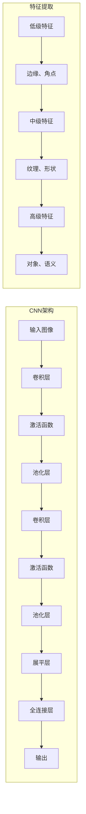

# 1.4.4 卷积神经网络 (CNN)

## 1. CNN概述与核心概念

### 1.1 什么是卷积神经网络

卷积神经网络（Convolutional Neural Network, CNN）是一种专门用于处理具有网格结构数据的深度学习模型，特别适用于图像处理、计算机视觉等任务。



**CNN的核心优势：**
- **局部连接**: 每个神经元只与局部区域连接
- **权重共享**: 同一个卷积核在整个输入上共享参数
- **平移不变性**: 对输入的平移具有一定的不变性
- **层次特征学习**: 从低级到高级特征的逐层抽象

```python
import numpy as np
import matplotlib.pyplot as plt
from matplotlib.patches import Rectangle
import seaborn as sns
from scipy import ndimage
from sklearn.datasets import load_digits
from sklearn.model_selection import train_test_split
import warnings
warnings.filterwarnings('ignore')

class ConvolutionDemo:
    """卷积操作演示类"""
    
    def __init__(self):
        pass
    
    def create_sample_image(self):
        """创建示例图像"""
        # 创建一个简单的图像
        image = np.zeros((8, 8))
        
        # 添加一些特征
        image[1:3, 1:7] = 1  # 水平线
        image[1:7, 1:3] = 1  # 垂直线
        image[5:7, 5:7] = 1  # 小方块
        
        return image
    
    def convolution_2d(self, image, kernel, stride=1, padding=0):
        """2D卷积操作"""
        # 添加padding
        if padding > 0:
            image = np.pad(image, padding, mode='constant', constant_values=0)
        
        # 计算输出尺寸
        output_height = (image.shape[0] - kernel.shape[0]) // stride + 1
        output_width = (image.shape[1] - kernel.shape[1]) // stride + 1
        
        # 初始化输出
        output = np.zeros((output_height, output_width))
        
        # 执行卷积
        for i in range(0, output_height * stride, stride):
            for j in range(0, output_width * stride, stride):
                # 提取感受野
                receptive_field = image[i:i+kernel.shape[0], j:j+kernel.shape[1]]
                # 计算卷积
                output[i//stride, j//stride] = np.sum(receptive_field * kernel)
        
        return output
    
    def demonstrate_convolution_process(self):
        """演示卷积过程"""
        print(f"\n{'='*80}")
        print(f"🔍 卷积操作详细演示")
        print(f"{'='*80}")
        
        # 创建示例图像和卷积核
        image = self.create_sample_image()
        
        # 定义不同的卷积核
        kernels = {
            '边缘检测 (垂直)': np.array([[-1, 0, 1],
                                      [-1, 0, 1],
                                      [-1, 0, 1]]),
            '边缘检测 (水平)': np.array([[-1, -1, -1],
                                      [ 0,  0,  0],
                                      [ 1,  1,  1]]),
            '模糊': np.array([[1, 1, 1],
                            [1, 1, 1],
                            [1, 1, 1]]) / 9,
            '锐化': np.array([[ 0, -1,  0],
                            [-1,  5, -1],
                            [ 0, -1,  0]])
        }
        
        fig, axes = plt.subplots(2, len(kernels) + 1, figsize=(20, 10))
        
        # 显示原始图像
        axes[0, 0].imshow(image, cmap='gray')
        axes[0, 0].set_title('原始图像', fontweight='bold')
        axes[0, 0].axis('off')
        
        # 显示图像数值
        axes[1, 0].imshow(image, cmap='gray')
        for i in range(image.shape[0]):
            for j in range(image.shape[1]):
                axes[1, 0].text(j, i, f'{image[i,j]:.0f}', 
                               ha='center', va='center', color='red', fontweight='bold')
        axes[1, 0].set_title('原始图像 (数值)', fontweight='bold')
        axes[1, 0].axis('off')
        
        # 对每个卷积核进行卷积
        for idx, (kernel_name, kernel) in enumerate(kernels.items()):
            # 执行卷积
            conv_result = self.convolution_2d(image, kernel)
            
            # 显示卷积结果
            axes[0, idx + 1].imshow(conv_result, cmap='gray')
            axes[0, idx + 1].set_title(f'{kernel_name}\n卷积结果', fontweight='bold')
            axes[0, idx + 1].axis('off')
            
            # 显示卷积核
            im = axes[1, idx + 1].imshow(kernel, cmap='RdBu', vmin=-1, vmax=1)
            for i in range(kernel.shape[0]):
                for j in range(kernel.shape[1]):
                    axes[1, idx + 1].text(j, i, f'{kernel[i,j]:.1f}', 
                                         ha='center', va='center', 
                                         color='white' if abs(kernel[i,j]) > 0.5 else 'black',
                                         fontweight='bold')
            axes[1, idx + 1].set_title(f'{kernel_name}\n卷积核', fontweight='bold')
            axes[1, idx + 1].axis('off')
            plt.colorbar(im, ax=axes[1, idx + 1], fraction=0.046, pad=0.04)
        
        plt.tight_layout()
        plt.show()
        
        # 详细解释卷积过程
        print(f"\n🔍 卷积计算详解:")
        kernel = kernels['边缘检测 (垂直)']
        print(f"\n使用垂直边缘检测卷积核:")
        print(kernel)
        
        # 手动计算第一个位置的卷积
        receptive_field = image[0:3, 0:3]
        conv_value = np.sum(receptive_field * kernel)
        
        print(f"\n第一个位置的计算:")
        print(f"感受野:")
        print(receptive_field)
        print(f"逐元素相乘后求和: {conv_value:.2f}")
        
        return image, kernels
    
    def visualize_receptive_field(self):
        """可视化感受野"""
        print(f"\n{'='*80}")
        print(f"👁️ 感受野可视化")
        print(f"{'='*80}")
        
        # 创建一个较大的图像
        image = np.random.rand(10, 10)
        kernel_size = 3
        
        fig, axes = plt.subplots(2, 3, figsize=(15, 10))
        
        # 显示不同位置的感受野
        positions = [(1, 1), (3, 3), (6, 6)]
        
        for idx, (row, col) in enumerate(positions):
            # 原始图像
            axes[0, idx].imshow(image, cmap='viridis', alpha=0.7)
            
            # 高亮感受野
            rect = Rectangle((col-0.5, row-0.5), kernel_size, kernel_size, 
                           linewidth=3, edgecolor='red', facecolor='none')
            axes[0, idx].add_patch(rect)
            
            # 标记中心点
            axes[0, idx].plot(col+1, row+1, 'ro', markersize=10)
            
            axes[0, idx].set_title(f'感受野位置 ({row+1}, {col+1})', fontweight='bold')
            axes[0, idx].set_xlim(-0.5, 9.5)
            axes[0, idx].set_ylim(9.5, -0.5)
            
            # 提取并显示感受野
            receptive_field = image[row:row+kernel_size, col:col+kernel_size]
            im = axes[1, idx].imshow(receptive_field, cmap='viridis')
            
            # 添加数值标注
            for i in range(kernel_size):
                for j in range(kernel_size):
                    axes[1, idx].text(j, i, f'{receptive_field[i,j]:.2f}', 
                                     ha='center', va='center', color='white', fontweight='bold')
            
            axes[1, idx].set_title(f'感受野内容', fontweight='bold')
            plt.colorbar(im, ax=axes[1, idx], fraction=0.046, pad=0.04)
        
        plt.tight_layout()
        plt.show()
        
        return image
    
    def demonstrate_stride_padding(self):
        """演示步长和填充的影响"""
        print(f"\n{'='*80}")
        print(f"📏 步长和填充演示")
        print(f"{'='*80}")
        
        # 创建示例图像
        image = np.ones((6, 6))
        image[2:4, 2:4] = 0  # 中心黑色方块
        
        kernel = np.array([[1, 0, -1],
                          [1, 0, -1],
                          [1, 0, -1]])  # 垂直边缘检测
        
        # 不同的步长和填充组合
        configs = [
            {'stride': 1, 'padding': 0, 'name': 'stride=1, padding=0'},
            {'stride': 2, 'padding': 0, 'name': 'stride=2, padding=0'},
            {'stride': 1, 'padding': 1, 'name': 'stride=1, padding=1'},
            {'stride': 2, 'padding': 1, 'name': 'stride=2, padding=1'}
        ]
        
        fig, axes = plt.subplots(2, len(configs), figsize=(20, 10))
        
        for idx, config in enumerate(configs):
            # 执行卷积
            result = self.convolution_2d(image, kernel, 
                                       stride=config['stride'], 
                                       padding=config['padding'])
            
            # 显示输入（可能有padding）
            if config['padding'] > 0:
                padded_image = np.pad(image, config['padding'], 
                                    mode='constant', constant_values=0)
            else:
                padded_image = image
            
            axes[0, idx].imshow(padded_image, cmap='gray')
            axes[0, idx].set_title(f'输入图像\n{config["name"]}\n尺寸: {padded_image.shape}', 
                                 fontweight='bold')
            axes[0, idx].axis('off')
            
            # 显示输出
            axes[1, idx].imshow(result, cmap='gray')
            axes[1, idx].set_title(f'卷积输出\n尺寸: {result.shape}', fontweight='bold')
            axes[1, idx].axis('off')
            
            # 添加网格显示步长
            if config['stride'] > 1:
                for i in range(0, padded_image.shape[0], config['stride']):
                    axes[0, idx].axhline(i-0.5, color='red', linewidth=2, alpha=0.7)
                for j in range(0, padded_image.shape[1], config['stride']):
                    axes[0, idx].axvline(j-0.5, color='red', linewidth=2, alpha=0.7)
        
        plt.tight_layout()
        plt.show()
        
        # 计算输出尺寸公式
        print(f"\n📐 输出尺寸计算公式:")
        print(f"   输出高度 = (输入高度 + 2×填充 - 卷积核高度) ÷ 步长 + 1")
        print(f"   输出宽度 = (输入宽度 + 2×填充 - 卷积核宽度) ÷ 步长 + 1")
        
        print(f"\n📊 各配置的输出尺寸:")
        for config in configs:
            h_out = (6 + 2*config['padding'] - 3) // config['stride'] + 1
            w_out = (6 + 2*config['padding'] - 3) // config['stride'] + 1
            print(f"   {config['name']}: ({h_out}, {w_out})")
        
        return configs

# 卷积操作演示
print("\n" + "=" * 80)
print("🧠 卷积神经网络 - 卷积操作详解")
print("=" * 80)

conv_demo = ConvolutionDemo()

# 演示卷积过程
image, kernels = conv_demo.demonstrate_convolution_process()

# 可视化感受野
receptive_field_image = conv_demo.visualize_receptive_field()

# 演示步长和填充
stride_padding_configs = conv_demo.demonstrate_stride_padding()
```

## 2. 池化操作

### 2.1 池化的作用

池化（Pooling）是CNN中的下采样操作，用于减少特征图的空间尺寸，降低计算复杂度，并提供一定的平移不变性。

```python
class PoolingDemo:
    """池化操作演示类"""
    
    def __init__(self):
        pass
    
    def max_pooling(self, feature_map, pool_size=2, stride=2):
        """最大池化"""
        output_height = (feature_map.shape[0] - pool_size) // stride + 1
        output_width = (feature_map.shape[1] - pool_size) // stride + 1
        
        output = np.zeros((output_height, output_width))
        
        for i in range(0, output_height * stride, stride):
            for j in range(0, output_width * stride, stride):
                pool_region = feature_map[i:i+pool_size, j:j+pool_size]
                output[i//stride, j//stride] = np.max(pool_region)
        
        return output
    
    def average_pooling(self, feature_map, pool_size=2, stride=2):
        """平均池化"""
        output_height = (feature_map.shape[0] - pool_size) // stride + 1
        output_width = (feature_map.shape[1] - pool_size) // stride + 1
        
        output = np.zeros((output_height, output_width))
        
        for i in range(0, output_height * stride, stride):
            for j in range(0, output_width * stride, stride):
                pool_region = feature_map[i:i+pool_size, j:j+pool_size]
                output[i//stride, j//stride] = np.mean(pool_region)
        
        return output
    
    def global_average_pooling(self, feature_map):
        """全局平均池化"""
        return np.mean(feature_map)
    
    def demonstrate_pooling_operations(self):
        """演示不同池化操作"""
        print(f"\n{'='*80}")
        print(f"🏊 池化操作详细演示")
        print(f"{'='*80}")
        
        # 创建示例特征图
        np.random.seed(42)
        feature_map = np.random.rand(8, 8) * 10
        feature_map = feature_map.astype(int)  # 转换为整数便于观察
        
        # 不同的池化操作
        max_pooled = self.max_pooling(feature_map, pool_size=2, stride=2)
        avg_pooled = self.average_pooling(feature_map, pool_size=2, stride=2)
        global_avg = self.global_average_pooling(feature_map)
        
        fig, axes = plt.subplots(2, 3, figsize=(18, 12))
        
        # 原始特征图
        im1 = axes[0, 0].imshow(feature_map, cmap='viridis')
        axes[0, 0].set_title('原始特征图\n(8×8)', fontweight='bold')
        
        # 添加数值标注
        for i in range(feature_map.shape[0]):
            for j in range(feature_map.shape[1]):
                axes[0, 0].text(j, i, f'{feature_map[i,j]}', 
                               ha='center', va='center', color='white', fontweight='bold')
        
        # 添加池化区域网格
        for i in range(0, 8, 2):
            axes[0, 0].axhline(i-0.5, color='red', linewidth=2)
        for j in range(0, 8, 2):
            axes[0, 0].axvline(j-0.5, color='red', linewidth=2)
        
        plt.colorbar(im1, ax=axes[0, 0], fraction=0.046, pad=0.04)
        
        # 最大池化结果
        im2 = axes[0, 1].imshow(max_pooled, cmap='viridis')
        axes[0, 1].set_title('最大池化\n(4×4)', fontweight='bold')
        
        for i in range(max_pooled.shape[0]):
            for j in range(max_pooled.shape[1]):
                axes[0, 1].text(j, i, f'{max_pooled[i,j]:.0f}', 
                               ha='center', va='center', color='white', fontweight='bold')
        
        plt.colorbar(im2, ax=axes[0, 1], fraction=0.046, pad=0.04)
        
        # 平均池化结果
        im3 = axes[0, 2].imshow(avg_pooled, cmap='viridis')
        axes[0, 2].set_title('平均池化\n(4×4)', fontweight='bold')
        
        for i in range(avg_pooled.shape[0]):
            for j in range(avg_pooled.shape[1]):
                axes[0, 2].text(j, i, f'{avg_pooled[i,j]:.1f}', 
                               ha='center', va='center', color='white', fontweight='bold')
        
        plt.colorbar(im3, ax=axes[0, 2], fraction=0.046, pad=0.04)
        
        # 详细计算过程
        axes[1, 0].axis('off')
        axes[1, 0].text(0.5, 0.8, '池化计算示例', ha='center', va='center', 
                       transform=axes[1, 0].transAxes, fontsize=14, fontweight='bold')
        
        # 选择一个2x2区域进行详细计算
        sample_region = feature_map[0:2, 0:2]
        max_val = np.max(sample_region)
        avg_val = np.mean(sample_region)
        
        calculation_text = f"""左上角2×2区域:
{sample_region}

最大池化: max({sample_region.flatten()}) = {max_val}
平均池化: mean({sample_region.flatten()}) = {avg_val:.1f}
全局平均池化: {global_avg:.2f}"""
        
        axes[1, 0].text(0.5, 0.4, calculation_text, ha='center', va='center', 
                       transform=axes[1, 0].transAxes, fontsize=10, 
                       bbox=dict(boxstyle="round,pad=0.3", facecolor="lightblue"))
        
        # 池化效果对比
        pooling_comparison = {
            '原始': feature_map.size,
            '最大池化': max_pooled.size,
            '平均池化': avg_pooled.size,
            '全局平均': 1
        }
        
        methods = list(pooling_comparison.keys())
        sizes = list(pooling_comparison.values())
        
        axes[1, 1].bar(methods, sizes, color=['blue', 'red', 'green', 'orange'], alpha=0.7)
        axes[1, 1].set_ylabel('参数数量')
        axes[1, 1].set_title('不同池化方法的参数数量对比', fontweight='bold')
        axes[1, 1].grid(True, alpha=0.3)
        
        # 添加数值标注
        for i, v in enumerate(sizes):
            axes[1, 1].text(i, v + 1, str(v), ha='center', va='bottom', fontweight='bold')
        
        # 池化特性对比表
        axes[1, 2].axis('off')
        properties = [
            ['池化方法', '计算复杂度', '信息保留', '平移不变性', '适用场景'],
            ['最大池化', '低', '保留最强特征', '好', '特征检测'],
            ['平均池化', '低', '保留平均信息', '好', '平滑特征'],
            ['全局平均', '最低', '全局统计', '最好', '分类任务']
        ]
        
        table = axes[1, 2].table(cellText=properties[1:], colLabels=properties[0], 
                                cellLoc='center', loc='center')
        table.auto_set_font_size(False)
        table.set_fontsize(9)
        table.scale(1, 2)
        axes[1, 2].set_title('池化方法特性对比', fontweight='bold', fontsize=12)
        
        plt.tight_layout()
        plt.show()
        
        print(f"\n📊 池化操作分析:")
        print(f"   原始特征图尺寸: {feature_map.shape}")
        print(f"   最大池化后尺寸: {max_pooled.shape}")
        print(f"   平均池化后尺寸: {avg_pooled.shape}")
        print(f"   参数减少比例: {(1 - max_pooled.size/feature_map.size)*100:.1f}%")
        
        return feature_map, max_pooled, avg_pooled
    
    def analyze_pooling_invariance(self):
        """分析池化的平移不变性"""
        print(f"\n{'='*80}")
        print(f"🔄 池化平移不变性分析")
        print(f"{'='*80}")
        
        # 创建一个简单的特征图
        original = np.zeros((6, 6))
        original[2:4, 2:4] = 5  # 中心有一个亮点
        
        # 创建平移版本
        shifted = np.zeros((6, 6))
        shifted[2:4, 3:5] = 5  # 向右平移一个像素
        
        # 对两个版本进行池化
        original_pooled = self.max_pooling(original, pool_size=2, stride=2)
        shifted_pooled = self.max_pooling(shifted, pool_size=2, stride=2)
        
        fig, axes = plt.subplots(2, 3, figsize=(15, 10))
        
        # 原始图像
        axes[0, 0].imshow(original, cmap='viridis')
        axes[0, 0].set_title('原始特征图', fontweight='bold')
        axes[0, 0].axis('off')
        
        # 平移图像
        axes[0, 1].imshow(shifted, cmap='viridis')
        axes[0, 1].set_title('平移后特征图', fontweight='bold')
        axes[0, 1].axis('off')
        
        # 差异
        diff = np.abs(original - shifted)
        axes[0, 2].imshow(diff, cmap='Reds')
        axes[0, 2].set_title('差异图', fontweight='bold')
        axes[0, 2].axis('off')
        
        # 池化后的结果
        axes[1, 0].imshow(original_pooled, cmap='viridis')
        axes[1, 0].set_title('原始池化结果', fontweight='bold')
        axes[1, 0].axis('off')
        
        axes[1, 1].imshow(shifted_pooled, cmap='viridis')
        axes[1, 1].set_title('平移后池化结果', fontweight='bold')
        axes[1, 1].axis('off')
        
        # 池化后的差异
        pooled_diff = np.abs(original_pooled - shifted_pooled)
        axes[1, 2].imshow(pooled_diff, cmap='Reds')
        axes[1, 2].set_title('池化后差异', fontweight='bold')
        axes[1, 2].axis('off')
        
        plt.tight_layout()
        plt.show()
        
        # 计算不变性指标
        original_diff = np.sum(diff)
        pooled_diff_sum = np.sum(pooled_diff)
        
        print(f"\n📈 平移不变性分析:")
        print(f"   原始图像差异总和: {original_diff}")
        print(f"   池化后差异总和: {pooled_diff_sum}")
        print(f"   不变性提升: {(1 - pooled_diff_sum/original_diff)*100:.1f}%")
        
        return original, shifted, original_pooled, shifted_pooled

# 池化操作演示
print("\n" + "=" * 80)
print("🏊 池化操作详解")
print("=" * 80)

pool_demo = PoolingDemo()

# 演示池化操作
feature_map, max_pooled, avg_pooled = pool_demo.demonstrate_pooling_operations()

# 分析平移不变性
original, shifted, original_pooled, shifted_pooled = pool_demo.analyze_pooling_invariance()
```

## 3. 完整的CNN实现

### 3.1 简单CNN分类器

```python
class SimpleCNN:
    """简单的CNN实现"""
    
    def __init__(self, input_shape, num_classes):
        self.input_shape = input_shape  # (height, width, channels)
        self.num_classes = num_classes
        
        # 初始化网络参数
        self.initialize_parameters()
        
        # 训练历史
        self.training_history = {'losses': [], 'accuracies': []}
    
    def initialize_parameters(self):
        """初始化网络参数"""
        np.random.seed(42)
        
        # 卷积层1: 32个3x3卷积核
        self.conv1_filters = np.random.randn(32, 3, 3, self.input_shape[2]) * 0.1
        self.conv1_bias = np.zeros((32,))
        
        # 卷积层2: 64个3x3卷积核
        self.conv2_filters = np.random.randn(64, 3, 3, 32) * 0.1
        self.conv2_bias = np.zeros((64,))
        
        # 计算全连接层输入尺寸（简化计算）
        # 假设输入28x28，经过两次卷积和池化后变为7x7
        fc_input_size = 7 * 7 * 64
        
        # 全连接层
        self.fc_weights = np.random.randn(fc_input_size, self.num_classes) * 0.1
        self.fc_bias = np.zeros((self.num_classes,))
    
    def relu(self, x):
        """ReLU激活函数"""
        return np.maximum(0, x)
    
    def softmax(self, x):
        """Softmax激活函数"""
        exp_x = np.exp(x - np.max(x, axis=-1, keepdims=True))
        return exp_x / np.sum(exp_x, axis=-1, keepdims=True)
    
    def conv2d_simple(self, input_data, filters, bias, stride=1, padding=0):
        """简化的2D卷积实现"""
        batch_size, in_height, in_width, in_channels = input_data.shape
        num_filters, filter_height, filter_width, _ = filters.shape
        
        # 计算输出尺寸
        out_height = (in_height + 2*padding - filter_height) // stride + 1
        out_width = (in_width + 2*padding - filter_width) // stride + 1
        
        # 初始化输出
        output = np.zeros((batch_size, out_height, out_width, num_filters))
        
        # 添加padding
        if padding > 0:
            input_padded = np.pad(input_data, 
                                ((0, 0), (padding, padding), (padding, padding), (0, 0)), 
                                mode='constant')
        else:
            input_padded = input_data
        
        # 执行卷积
        for b in range(batch_size):
            for f in range(num_filters):
                for i in range(0, out_height * stride, stride):
                    for j in range(0, out_width * stride, stride):
                        # 提取感受野
                        receptive_field = input_padded[b, i:i+filter_height, j:j+filter_width, :]
                        # 计算卷积
                        output[b, i//stride, j//stride, f] = \
                            np.sum(receptive_field * filters[f]) + bias[f]
        
        return output
    
    def max_pool2d(self, input_data, pool_size=2, stride=2):
        """2D最大池化"""
        batch_size, in_height, in_width, channels = input_data.shape
        
        out_height = (in_height - pool_size) // stride + 1
        out_width = (in_width - pool_size) // stride + 1
        
        output = np.zeros((batch_size, out_height, out_width, channels))
        
        for b in range(batch_size):
            for c in range(channels):
                for i in range(0, out_height * stride, stride):
                    for j in range(0, out_width * stride, stride):
                        pool_region = input_data[b, i:i+pool_size, j:j+pool_size, c]
                        output[b, i//stride, j//stride, c] = np.max(pool_region)
        
        return output
    
    def forward(self, X):
        """前向传播"""
        # 确保输入是4D张量 (batch_size, height, width, channels)
        if len(X.shape) == 3:
            X = X.reshape(1, *X.shape)
        
        # 卷积层1 + ReLU + 池化
        conv1_out = self.conv2d_simple(X, self.conv1_filters, self.conv1_bias)
        relu1_out = self.relu(conv1_out)
        pool1_out = self.max_pool2d(relu1_out)
        
        # 卷积层2 + ReLU + 池化
        conv2_out = self.conv2d_simple(pool1_out, self.conv2_filters, self.conv2_bias)
        relu2_out = self.relu(conv2_out)
        pool2_out = self.max_pool2d(relu2_out)
        
        # 展平
        flattened = pool2_out.reshape(pool2_out.shape[0], -1)
        
        # 全连接层
        fc_out = np.dot(flattened, self.fc_weights) + self.fc_bias
        
        # Softmax
        output = self.softmax(fc_out)
        
        # 保存中间结果用于反向传播
        self.cache = {
            'input': X,
            'conv1_out': conv1_out,
            'relu1_out': relu1_out,
            'pool1_out': pool1_out,
            'conv2_out': conv2_out,
            'relu2_out': relu2_out,
            'pool2_out': pool2_out,
            'flattened': flattened,
            'fc_out': fc_out,
            'output': output
        }
        
        return output
    
    def compute_loss(self, y_pred, y_true):
        """计算交叉熵损失"""
        # 避免log(0)
        y_pred = np.clip(y_pred, 1e-15, 1 - 1e-15)
        return -np.mean(np.sum(y_true * np.log(y_pred), axis=1))
    
    def predict(self, X):
        """预测"""
        return self.forward(X)
    
    def evaluate(self, X, y):
        """评估模型"""
        predictions = self.predict(X)
        
        # 计算损失
        loss = self.compute_loss(predictions, y)
        
        # 计算准确率
        pred_classes = np.argmax(predictions, axis=1)
        true_classes = np.argmax(y, axis=1)
        accuracy = np.mean(pred_classes == true_classes)
        
        return loss, accuracy

class CNNVisualizer:
    """CNN可视化工具"""
    
    def __init__(self, cnn_model):
        self.model = cnn_model
    
    def visualize_filters(self):
        """可视化卷积核"""
        print(f"\n{'='*80}")
        print(f"🔍 CNN卷积核可视化")
        print(f"{'='*80}")
        
        # 可视化第一层卷积核
        conv1_filters = self.model.conv1_filters
        num_filters = min(16, conv1_filters.shape[0])  # 最多显示16个
        
        fig, axes = plt.subplots(4, 4, figsize=(12, 12))
        axes = axes.flatten()
        
        for i in range(num_filters):
            # 如果是多通道，取第一个通道或平均
            if conv1_filters.shape[3] == 1:
                filter_img = conv1_filters[i, :, :, 0]
            else:
                filter_img = np.mean(conv1_filters[i, :, :, :], axis=2)
            
            im = axes[i].imshow(filter_img, cmap='RdBu')
            axes[i].set_title(f'Filter {i+1}', fontsize=10)
            axes[i].axis('off')
            plt.colorbar(im, ax=axes[i], fraction=0.046, pad=0.04)
        
        plt.suptitle('第一层卷积核可视化', fontsize=16, fontweight='bold')
        plt.tight_layout()
        plt.show()
        
        return fig
    
    def visualize_feature_maps(self, input_image):
        """可视化特征图"""
        print(f"\n{'='*80}")
        print(f"🗺️ 特征图可视化")
        print(f"{'='*80}")
        
        # 前向传播获取中间结果
        _ = self.model.forward(input_image)
        cache = self.model.cache
        
        # 可视化不同层的特征图
        layers_to_visualize = [
            ('输入图像', cache['input'][0]),
            ('卷积层1输出', cache['conv1_out'][0]),
            ('ReLU1输出', cache['relu1_out'][0]),
            ('池化层1输出', cache['pool1_out'][0]),
            ('卷积层2输出', cache['conv2_out'][0]),
            ('池化层2输出', cache['pool2_out'][0])
        ]
        
        fig, axes = plt.subplots(2, 3, figsize=(18, 12))
        axes = axes.flatten()
        
        for idx, (layer_name, feature_map) in enumerate(layers_to_visualize):
            if len(feature_map.shape) == 3:  # 多通道
                if feature_map.shape[2] == 1:
                    # 单通道
                    display_map = feature_map[:, :, 0]
                elif feature_map.shape[2] == 3:
                    # RGB图像
                    display_map = feature_map
                else:
                    # 多通道，显示前几个通道的平均
                    display_map = np.mean(feature_map[:, :, :min(8, feature_map.shape[2])], axis=2)
            else:
                display_map = feature_map
            
            if len(display_map.shape) == 3 and display_map.shape[2] == 3:
                axes[idx].imshow(display_map)
            else:
                im = axes[idx].imshow(display_map, cmap='viridis')
                plt.colorbar(im, ax=axes[idx], fraction=0.046, pad=0.04)
            
            axes[idx].set_title(f'{layer_name}\n形状: {feature_map.shape}', fontweight='bold')
            axes[idx].axis('off')
        
        plt.tight_layout()
        plt.show()
        
        return fig
    
    def analyze_network_architecture(self):
        """分析网络架构"""
        print(f"\n{'='*80}")
        print(f"🏗️ CNN网络架构分析")
        print(f"{'='*80}")
        
        # 计算每层的参数数量
        conv1_params = np.prod(self.model.conv1_filters.shape) + len(self.model.conv1_bias)
        conv2_params = np.prod(self.model.conv2_filters.shape) + len(self.model.conv2_bias)
        fc_params = np.prod(self.model.fc_weights.shape) + len(self.model.fc_bias)
        
        total_params = conv1_params + conv2_params + fc_params
        
        print(f"\n📊 网络参数统计:")
        print(f"   卷积层1参数: {conv1_params:,}")
        print(f"   卷积层2参数: {conv2_params:,}")
        print(f"   全连接层参数: {fc_params:,}")
        print(f"   总参数数量: {total_params:,}")
        
        # 可视化网络架构
        fig, (ax1, ax2) = plt.subplots(1, 2, figsize=(15, 6))
        
        # 参数分布饼图
        labels = ['卷积层1', '卷积层2', '全连接层']
        sizes = [conv1_params, conv2_params, fc_params]
        colors = ['lightblue', 'lightgreen', 'lightcoral']
        
        ax1.pie(sizes, labels=labels, colors=colors, autopct='%1.1f%%', startangle=90)
        ax1.set_title('参数分布', fontweight='bold')
        
        # 网络层次结构
        layers = ['输入\n28×28×1', '卷积1\n26×26×32', '池化1\n13×13×32', 
                 '卷积2\n11×11×64', '池化2\n5×5×64', '全连接\n10']
        y_pos = np.arange(len(layers))
        
        ax2.barh(y_pos, [784, 21632, 5408, 7744, 1600, 10], color=colors*2)
        ax2.set_yticks(y_pos)
        ax2.set_yticklabels(layers)
        ax2.set_xlabel('特征数量')
        ax2.set_title('各层特征数量', fontweight='bold')
        ax2.grid(True, alpha=0.3)
        
        plt.tight_layout()
        plt.show()
        
        return total_params

# CNN实现演示
print("\n" + "=" * 80)
print("🧠 完整CNN实现演示")
print("=" * 80)

# 使用手写数字数据集进行演示
digits = load_digits()
X, y = digits.data, digits.target

# 重塑数据为图像格式
X = X.reshape(-1, 8, 8, 1)  # 8x8灰度图像
X = X.astype(np.float32) / 16.0  # 归一化到[0,1]

# 转换标签为one-hot编码
y_onehot = np.eye(10)[y]

# 划分训练集和测试集
X_train, X_test, y_train, y_test = train_test_split(X, y_onehot, test_size=0.2, random_state=42)

print(f"\n📊 数据集信息:")
print(f"   训练集大小: {X_train.shape}")
print(f"   测试集大小: {X_test.shape}")
print(f"   类别数量: {y_onehot.shape[1]}")

# 创建CNN模型
cnn = SimpleCNN(input_shape=(8, 8, 1), num_classes=10)

# 创建可视化工具
visualizer = CNNVisualizer(cnn)

# 可视化卷积核
filter_fig = visualizer.visualize_filters()

# 选择一个样本进行特征图可视化
sample_image = X_train[0:1]  # 取第一个样本
feature_map_fig = visualizer.visualize_feature_maps(sample_image)

# 分析网络架构
total_params = visualizer.analyze_network_architecture()

# 测试前向传播
print(f"\n🔄 测试前向传播:")
test_input = X_train[:5]  # 取前5个样本
predictions = cnn.predict(test_input)

print(f"   输入形状: {test_input.shape}")
print(f"   输出形状: {predictions.shape}")
print(f"   预测类别: {np.argmax(predictions, axis=1)}")
print(f"   真实类别: {np.argmax(y_train[:5], axis=1)}")

# 评估初始性能
initial_loss, initial_acc = cnn.evaluate(X_test, y_test)
print(f"\n📈 初始性能:")
print(f"   测试损失: {initial_loss:.4f}")
print(f"   测试准确率: {initial_acc:.4f}")

print(f"\n✅ CNN实现演示完成!")
```

## 4. 思考题

1. **卷积核设计**: 不同的卷积核能够检测什么样的特征？如何设计卷积核来检测特定的图像特征？

2. **参数共享**: CNN中的参数共享机制有什么优势？与全连接网络相比，参数数量减少了多少？

3. **感受野**: 如何计算CNN中某一层神经元的感受野大小？深层网络的感受野有什么特点？

4. **池化选择**: 在什么情况下应该使用最大池化？什么情况下使用平均池化？全局平均池化有什么特殊用途？

5. **网络设计**: 如何根据具体任务设计CNN架构？卷积层数、卷积核大小、步长等超参数如何选择？

## 5. 小结

### 5.1 核心概念

- **卷积操作**: 通过卷积核提取局部特征的核心操作
- **参数共享**: 同一卷积核在整个输入上共享参数
- **局部连接**: 每个神经元只与局部区域连接
- **池化操作**: 降低空间分辨率，提供平移不变性
- **层次特征**: 从低级到高级特征的逐层抽象

### 5.2 关键技术

- **卷积核设计**: 不同卷积核检测不同类型的特征
- **步长和填充**: 控制输出尺寸的重要参数
- **激活函数**: 通常使用ReLU及其变体
- **池化策略**: 最大池化、平均池化、全局池化
- **网络架构**: 卷积层、池化层、全连接层的组合

### 5.3 实践要点

- 根据任务特点设计合适的网络架构
- 合理选择卷积核大小、数量和步长
- 注意梯度消失问题，使用合适的激活函数
- 利用数据增强提高模型泛化能力
- 监控训练过程，防止过拟合

### 5.4 应用场景

- **图像分类**: 识别图像中的对象类别
- **目标检测**: 定位和识别图像中的多个对象
- **图像分割**: 像素级别的图像理解
- **风格迁移**: 图像风格转换
- **医学影像**: 医学图像分析和诊断

通过本节的学习，你已经深入理解了卷积神经网络的核心原理和实现方法，这为你进一步学习更高级的深度学习技术奠定了坚实的基础。