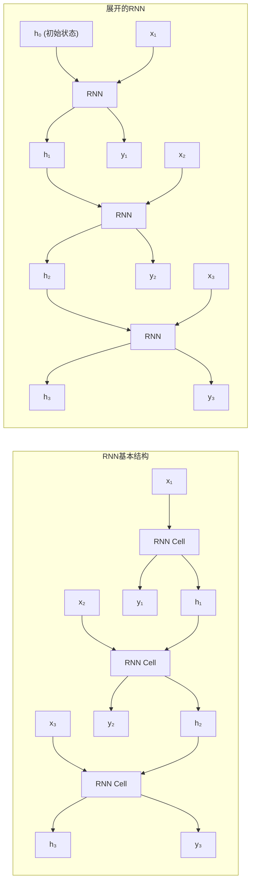

# 1.4.5 循环神经网络 (RNN)

## 1. RNN概述与核心概念

### 1.1 什么是循环神经网络

循环神经网络（Recurrent Neural Network, RNN）是一种专门用于处理序列数据的神经网络，具有记忆能力，能够处理任意长度的输入序列。



**RNN的核心特点：**
- **记忆能力**: 通过隐藏状态保存历史信息
- **参数共享**: 所有时间步共享相同的参数
- **可变长度**: 能处理不同长度的序列
- **时序建模**: 捕捉序列中的时间依赖关系

```python
import numpy as np
import matplotlib.pyplot as plt
import seaborn as sns
from sklearn.preprocessing import MinMaxScaler
from sklearn.metrics import mean_squared_error, mean_absolute_error
import warnings
warnings.filterwarnings('ignore')

class SimpleRNN:
    """简单RNN实现"""
    
    def __init__(self, input_size, hidden_size, output_size, learning_rate=0.01):
        self.input_size = input_size
        self.hidden_size = hidden_size
        self.output_size = output_size
        self.learning_rate = learning_rate
        
        # 初始化参数
        self.initialize_parameters()
        
        # 训练历史
        self.training_history = {'losses': [], 'hidden_states': []}
    
    def initialize_parameters(self):
        """初始化网络参数"""
        np.random.seed(42)
        
        # Xavier初始化
        # 输入到隐藏层的权重
        self.Wxh = np.random.randn(self.hidden_size, self.input_size) * np.sqrt(2.0 / self.input_size)
        # 隐藏层到隐藏层的权重（循环连接）
        self.Whh = np.random.randn(self.hidden_size, self.hidden_size) * np.sqrt(2.0 / self.hidden_size)
        # 隐藏层到输出层的权重
        self.Why = np.random.randn(self.output_size, self.hidden_size) * np.sqrt(2.0 / self.hidden_size)
        
        # 偏置
        self.bh = np.zeros((self.hidden_size, 1))
        self.by = np.zeros((self.output_size, 1))
    
    def tanh(self, x):
        """Tanh激活函数"""
        return np.tanh(x)
    
    def tanh_derivative(self, x):
        """Tanh导数"""
        return 1 - np.tanh(x) ** 2
    
    def softmax(self, x):
        """Softmax激活函数"""
        exp_x = np.exp(x - np.max(x, axis=0, keepdims=True))
        return exp_x / np.sum(exp_x, axis=0, keepdims=True)
    
    def forward_propagation(self, inputs, h_prev=None):
        """前向传播"""
        seq_len = len(inputs)
        
        # 初始化隐藏状态
        if h_prev is None:
            h_prev = np.zeros((self.hidden_size, 1))
        
        # 存储中间结果
        xs, hs, ys, ps = {}, {}, {}, {}
        hs[-1] = h_prev.copy()
        
        # 前向传播每个时间步
        for t in range(seq_len):
            xs[t] = inputs[t].reshape(-1, 1)  # 输入向量
            
            # 计算隐藏状态
            hs[t] = self.tanh(np.dot(self.Wxh, xs[t]) + np.dot(self.Whh, hs[t-1]) + self.bh)
            
            # 计算输出
            ys[t] = np.dot(self.Why, hs[t]) + self.by
            ps[t] = self.softmax(ys[t])  # 概率分布
        
        return xs, hs, ys, ps
    
    def backward_propagation(self, xs, hs, ps, targets):
        """反向传播"""
        seq_len = len(xs)
        
        # 初始化梯度
        dWxh = np.zeros_like(self.Wxh)
        dWhh = np.zeros_like(self.Whh)
        dWhy = np.zeros_like(self.Why)
        dbh = np.zeros_like(self.bh)
        dby = np.zeros_like(self.by)
        dh_next = np.zeros_like(hs[0])
        
        # 反向传播每个时间步
        for t in reversed(range(seq_len)):
            # 输出层梯度
            dy = ps[t].copy()
            dy[targets[t]] -= 1  # 交叉熵损失的梯度
            
            # 输出层参数梯度
            dWhy += np.dot(dy, hs[t].T)
            dby += dy
            
            # 隐藏层梯度
            dh = np.dot(self.Why.T, dy) + dh_next
            dh_raw = self.tanh_derivative(hs[t]) * dh  # 通过tanh的梯度
            
            # 隐藏层参数梯度
            dbh += dh_raw
            dWxh += np.dot(dh_raw, xs[t].T)
            dWhh += np.dot(dh_raw, hs[t-1].T)
            
            # 传递到下一个时间步的梯度
            dh_next = np.dot(self.Whh.T, dh_raw)
        
        # 梯度裁剪防止梯度爆炸
        for dparam in [dWxh, dWhh, dWhy, dbh, dby]:
            np.clip(dparam, -5, 5, out=dparam)
        
        return dWxh, dWhh, dWhy, dbh, dby
    
    def update_parameters(self, dWxh, dWhh, dWhy, dbh, dby):
        """更新参数"""
        self.Wxh -= self.learning_rate * dWxh
        self.Whh -= self.learning_rate * dWhh
        self.Why -= self.learning_rate * dWhy
        self.bh -= self.learning_rate * dbh
        self.by -= self.learning_rate * dby
    
    def compute_loss(self, ps, targets):
        """计算损失"""
        loss = 0
        for t in range(len(targets)):
            loss += -np.log(ps[t][targets[t], 0])
        return loss
    
    def train_step(self, inputs, targets, h_prev=None):
        """单步训练"""
        # 前向传播
        xs, hs, ys, ps = self.forward_propagation(inputs, h_prev)
        
        # 计算损失
        loss = self.compute_loss(ps, targets)
        
        # 反向传播
        dWxh, dWhh, dWhy, dbh, dby = self.backward_propagation(xs, hs, ps, targets)
        
        # 更新参数
        self.update_parameters(dWxh, dWhh, dWhy, dbh, dby)
        
        return loss, hs[len(inputs)-1]
    
    def predict(self, inputs, h_prev=None):
        """预测"""
        xs, hs, ys, ps = self.forward_propagation(inputs, h_prev)
        predictions = [np.argmax(p) for p in ps.values()]
        return predictions, hs[len(inputs)-1]

class RNNVisualizer:
    """RNN可视化工具"""
    
    def __init__(self, rnn_model):
        self.model = rnn_model
    
    def visualize_rnn_architecture(self):
        """可视化RNN架构"""
        print(f"\n{'='*80}")
        print(f"🏗️ RNN网络架构可视化")
        print(f"{'='*80}")
        
        fig, (ax1, ax2) = plt.subplots(1, 2, figsize=(16, 8))
        
        # 左图：RNN展开结构
        ax1.set_xlim(0, 10)
        ax1.set_ylim(0, 8)
        
        # 绘制时间步
        time_steps = 4
        for t in range(time_steps):
            x_pos = 2 + t * 2
            
            # 输入节点
            ax1.add_patch(plt.Circle((x_pos, 2), 0.3, color='lightblue', ec='black'))
            ax1.text(x_pos, 2, f'x{t+1}', ha='center', va='center', fontweight='bold')
            
            # 隐藏状态节点
            ax1.add_patch(plt.Rectangle((x_pos-0.4, 4-0.3), 0.8, 0.6, 
                                      color='lightgreen', ec='black'))
            ax1.text(x_pos, 4, f'h{t+1}', ha='center', va='center', fontweight='bold')
            
            # 输出节点
            ax1.add_patch(plt.Circle((x_pos, 6), 0.3, color='lightcoral', ec='black'))
            ax1.text(x_pos, 6, f'y{t+1}', ha='center', va='center', fontweight='bold')
            
            # 连接线
            ax1.arrow(x_pos, 2.3, 0, 1.4, head_width=0.1, head_length=0.1, fc='black', ec='black')
            ax1.arrow(x_pos, 4.3, 0, 1.4, head_width=0.1, head_length=0.1, fc='black', ec='black')
            
            # 循环连接
            if t < time_steps - 1:
                ax1.arrow(x_pos + 0.4, 4, 1.2, 0, head_width=0.1, head_length=0.1, 
                         fc='red', ec='red', linestyle='--')
        
        ax1.set_title('RNN展开结构', fontsize=14, fontweight='bold')
        ax1.axis('off')
        
        # 右图：参数矩阵可视化
        matrices = {
            'Wxh': self.model.Wxh,
            'Whh': self.model.Whh,
            'Why': self.model.Why
        }
        
        y_positions = [0.7, 0.4, 0.1]
        colors = ['Blues', 'Greens', 'Reds']
        
        for i, (name, matrix) in enumerate(matrices.items()):
            # 创建子图显示矩阵
            im = ax2.imshow(matrix, cmap=colors[i], aspect='auto', 
                          extent=[0, matrix.shape[1], y_positions[i], y_positions[i] + 0.2])
            ax2.text(-0.5, y_positions[i] + 0.1, name, ha='right', va='center', 
                    fontweight='bold', fontsize=12)
            
            # 添加尺寸标注
            ax2.text(matrix.shape[1]/2, y_positions[i] + 0.25, 
                    f'{matrix.shape[0]}×{matrix.shape[1]}', 
                    ha='center', va='bottom', fontsize=10)
        
        ax2.set_xlim(-1, max([m.shape[1] for m in matrices.values()]) + 1)
        ax2.set_ylim(0, 1)
        ax2.set_title('RNN参数矩阵', fontsize=14, fontweight='bold')
        ax2.axis('off')
        
        plt.tight_layout()
        plt.show()
        
        # 打印参数统计
        total_params = sum(np.prod(matrix.shape) for matrix in matrices.values())
        total_params += np.prod(self.model.bh.shape) + np.prod(self.model.by.shape)
        
        print(f"\n📊 网络参数统计:")
        print(f"   输入到隐藏 (Wxh): {np.prod(self.model.Wxh.shape):,}")
        print(f"   隐藏到隐藏 (Whh): {np.prod(self.model.Whh.shape):,}")
        print(f"   隐藏到输出 (Why): {np.prod(self.model.Why.shape):,}")
        print(f"   偏置参数: {np.prod(self.model.bh.shape) + np.prod(self.model.by.shape):,}")
        print(f"   总参数数量: {total_params:,}")
        
        return fig
    
    def visualize_hidden_states(self, sequence, targets=None):
        """可视化隐藏状态演化"""
        print(f"\n{'='*80}")
        print(f"🧠 隐藏状态演化可视化")
        print(f"{'='*80}")
        
        # 前向传播获取隐藏状态
        xs, hs, ys, ps = self.model.forward_propagation(sequence)
        
        # 提取隐藏状态
        hidden_states = np.array([hs[t].flatten() for t in range(len(sequence))])
        
        fig, axes = plt.subplots(2, 2, figsize=(15, 10))
        
        # 隐藏状态热图
        im1 = axes[0, 0].imshow(hidden_states.T, cmap='RdBu', aspect='auto')
        axes[0, 0].set_xlabel('时间步')
        axes[0, 0].set_ylabel('隐藏单元')
        axes[0, 0].set_title('隐藏状态演化热图', fontweight='bold')
        plt.colorbar(im1, ax=axes[0, 0])
        
        # 选择几个隐藏单元的时间序列
        selected_units = min(5, self.model.hidden_size)
        for i in range(selected_units):
            axes[0, 1].plot(hidden_states[:, i], label=f'单元 {i+1}', marker='o')
        
        axes[0, 1].set_xlabel('时间步')
        axes[0, 1].set_ylabel('激活值')
        axes[0, 1].set_title('选定隐藏单元的时间序列', fontweight='bold')
        axes[0, 1].legend()
        axes[0, 1].grid(True, alpha=0.3)
        
        # 输出概率分布
        if len(ps) > 0:
            output_probs = np.array([ps[t].flatten() for t in range(len(sequence))])
            im2 = axes[1, 0].imshow(output_probs.T, cmap='viridis', aspect='auto')
            axes[1, 0].set_xlabel('时间步')
            axes[1, 0].set_ylabel('输出类别')
            axes[1, 0].set_title('输出概率分布', fontweight='bold')
            plt.colorbar(im2, ax=axes[1, 0])
        
        # 预测vs真实（如果提供了目标）
        if targets is not None:
            predictions = [np.argmax(ps[t]) for t in range(len(sequence))]
            
            x_pos = np.arange(len(sequence))
            width = 0.35
            
            axes[1, 1].bar(x_pos - width/2, targets, width, label='真实', alpha=0.7)
            axes[1, 1].bar(x_pos + width/2, predictions, width, label='预测', alpha=0.7)
            
            axes[1, 1].set_xlabel('时间步')
            axes[1, 1].set_ylabel('类别')
            axes[1, 1].set_title('预测vs真实', fontweight='bold')
            axes[1, 1].legend()
            axes[1, 1].grid(True, alpha=0.3)
            
            # 计算准确率
            accuracy = np.mean(np.array(predictions) == np.array(targets))
            axes[1, 1].text(0.02, 0.98, f'准确率: {accuracy:.2%}', 
                           transform=axes[1, 1].transAxes, 
                           bbox=dict(boxstyle="round,pad=0.3", facecolor="yellow"),
                           verticalalignment='top')
        else:
            axes[1, 1].axis('off')
        
        plt.tight_layout()
        plt.show()
        
        return hidden_states, ps
    
    def analyze_gradient_flow(self, sequence, targets):
        """分析梯度流动"""
        print(f"\n{'='*80}")
        print(f"📈 梯度流动分析")
        print(f"{'='*80}")
        
        # 前向传播
        xs, hs, ys, ps = self.model.forward_propagation(sequence)
        
        # 反向传播获取梯度
        dWxh, dWhh, dWhy, dbh, dby = self.model.backward_propagation(xs, hs, ps, targets)
        
        fig, axes = plt.subplots(2, 2, figsize=(15, 10))
        
        # 权重梯度可视化
        gradients = {'dWxh': dWxh, 'dWhh': dWhh, 'dWhy': dWhy}
        
        for i, (name, grad) in enumerate(gradients.items()):
            row, col = i // 2, i % 2
            if i < 3:
                im = axes[row, col].imshow(grad, cmap='RdBu', aspect='auto')
                axes[row, col].set_title(f'{name} 梯度', fontweight='bold')
                plt.colorbar(im, ax=axes[row, col])
                
                # 添加梯度统计信息
                grad_norm = np.linalg.norm(grad)
                grad_mean = np.mean(np.abs(grad))
                axes[row, col].text(0.02, 0.98, 
                                  f'范数: {grad_norm:.4f}\n平均: {grad_mean:.4f}', 
                                  transform=axes[row, col].transAxes,
                                  bbox=dict(boxstyle="round,pad=0.3", facecolor="white"),
                                  verticalalignment='top')
        
        # 梯度范数随时间的变化
        seq_len = len(sequence)
        gradient_norms = []
        
        # 逐步计算每个时间步的梯度范数
        for t in range(1, seq_len + 1):
            partial_seq = sequence[:t]
            partial_targets = targets[:t]
            
            xs_partial, hs_partial, ys_partial, ps_partial = self.model.forward_propagation(partial_seq)
            dWxh_partial, dWhh_partial, dWhy_partial, _, _ = self.model.backward_propagation(
                xs_partial, hs_partial, ps_partial, partial_targets)
            
            total_grad_norm = (np.linalg.norm(dWxh_partial) + 
                             np.linalg.norm(dWhh_partial) + 
                             np.linalg.norm(dWhy_partial))
            gradient_norms.append(total_grad_norm)
        
        axes[1, 1].plot(range(1, seq_len + 1), gradient_norms, 'b-o', linewidth=2, markersize=6)
        axes[1, 1].set_xlabel('序列长度')
        axes[1, 1].set_ylabel('梯度范数')
        axes[1, 1].set_title('梯度范数随序列长度变化', fontweight='bold')
        axes[1, 1].grid(True, alpha=0.3)
        
        # 检查梯度消失/爆炸
        if len(gradient_norms) > 1:
            grad_ratio = gradient_norms[-1] / gradient_norms[0]
            if grad_ratio < 0.1:
                status = "梯度消失"
                color = "red"
            elif grad_ratio > 10:
                status = "梯度爆炸"
                color = "orange"
            else:
                status = "梯度正常"
                color = "green"
            
            axes[1, 1].text(0.02, 0.98, f'状态: {status}\n比率: {grad_ratio:.3f}', 
                          transform=axes[1, 1].transAxes,
                          bbox=dict(boxstyle="round,pad=0.3", facecolor=color, alpha=0.3),
                          verticalalignment='top')
        
        plt.tight_layout()
        plt.show()
        
        return gradients, gradient_norms

# RNN基础演示
print("\n" + "=" * 80)
print("🔄 循环神经网络 - 基础概念演示")
print("=" * 80)

# 创建一个简单的序列分类任务
# 任务：识别序列中的模式（例如：连续的1或连续的0）

# 生成示例数据
np.random.seed(42)

def generate_sequence_data(num_sequences=100, seq_length=10):
    """生成序列分类数据"""
    sequences = []
    labels = []
    
    for _ in range(num_sequences):
        # 生成随机二进制序列
        seq = np.random.randint(0, 2, seq_length)
        
        # 标签：如果序列中有连续3个或更多相同的数字，标记为1，否则为0
        label = 0
        for i in range(len(seq) - 2):
            if seq[i] == seq[i+1] == seq[i+2]:
                label = 1
                break
        
        sequences.append(seq)
        labels.append(label)
    
    return sequences, labels

# 生成训练数据
train_sequences, train_labels = generate_sequence_data(200, 8)
test_sequences, test_labels = generate_sequence_data(50, 8)

print(f"\n📊 序列分类任务数据:")
print(f"   训练序列数量: {len(train_sequences)}")
print(f"   测试序列数量: {len(test_sequences)}")
print(f"   序列长度: {len(train_sequences[0])}")
print(f"   正样本比例: {np.mean(train_labels):.2%}")

# 显示几个示例
print(f"\n🔍 数据示例:")
for i in range(5):
    seq_str = ''.join(map(str, train_sequences[i]))
    print(f"   序列: {seq_str} -> 标签: {train_labels[i]}")

# 创建RNN模型
rnn = SimpleRNN(input_size=1, hidden_size=10, output_size=2, learning_rate=0.01)

# 创建可视化工具
visualizer = RNNVisualizer(rnn)

# 可视化RNN架构
arch_fig = visualizer.visualize_rnn_architecture()

# 测试前向传播
print(f"\n🔄 测试RNN前向传播:")
test_sequence = [np.array([x]) for x in train_sequences[0]]  # 转换为RNN输入格式
test_target = [train_labels[0]] * len(test_sequence)  # 每个时间步都有标签

# 可视化隐藏状态
hidden_states, output_probs = visualizer.visualize_hidden_states(test_sequence, test_target)

# 分析梯度流动
gradients, grad_norms = visualizer.analyze_gradient_flow(test_sequence, test_target)

print(f"\n✅ RNN基础演示完成!")
```

## 2. LSTM (长短期记忆网络)

### 2.1 LSTM的动机与结构

LSTM（Long Short-Term Memory）是为了解决传统RNN的梯度消失问题而设计的，通过门控机制来控制信息的流动。

```python
class LSTM:
    """LSTM实现"""
    
    def __init__(self, input_size, hidden_size, output_size, learning_rate=0.01):
        self.input_size = input_size
        self.hidden_size = hidden_size
        self.output_size = output_size
        self.learning_rate = learning_rate
        
        # 初始化参数
        self.initialize_parameters()
    
    def initialize_parameters(self):
        """初始化LSTM参数"""
        np.random.seed(42)
        
        # 遗忘门参数
        self.Wf = np.random.randn(self.hidden_size, self.input_size + self.hidden_size) * 0.1
        self.bf = np.zeros((self.hidden_size, 1))
        
        # 输入门参数
        self.Wi = np.random.randn(self.hidden_size, self.input_size + self.hidden_size) * 0.1
        self.bi = np.zeros((self.hidden_size, 1))
        
        # 候选值参数
        self.Wc = np.random.randn(self.hidden_size, self.input_size + self.hidden_size) * 0.1
        self.bc = np.zeros((self.hidden_size, 1))
        
        # 输出门参数
        self.Wo = np.random.randn(self.hidden_size, self.input_size + self.hidden_size) * 0.1
        self.bo = np.zeros((self.hidden_size, 1))
        
        # 输出层参数
        self.Wy = np.random.randn(self.output_size, self.hidden_size) * 0.1
        self.by = np.zeros((self.output_size, 1))
    
    def sigmoid(self, x):
        """Sigmoid激活函数"""
        return 1 / (1 + np.exp(-np.clip(x, -500, 500)))
    
    def tanh(self, x):
        """Tanh激活函数"""
        return np.tanh(x)
    
    def softmax(self, x):
        """Softmax激活函数"""
        exp_x = np.exp(x - np.max(x, axis=0, keepdims=True))
        return exp_x / np.sum(exp_x, axis=0, keepdims=True)
    
    def forward_step(self, x, h_prev, c_prev):
        """LSTM单步前向传播"""
        # 拼接输入和前一时刻的隐藏状态
        concat = np.vstack((x, h_prev))
        
        # 遗忘门
        f = self.sigmoid(np.dot(self.Wf, concat) + self.bf)
        
        # 输入门
        i = self.sigmoid(np.dot(self.Wi, concat) + self.bi)
        
        # 候选值
        c_tilde = self.tanh(np.dot(self.Wc, concat) + self.bc)
        
        # 更新细胞状态
        c = f * c_prev + i * c_tilde
        
        # 输出门
        o = self.sigmoid(np.dot(self.Wo, concat) + self.bo)
        
        # 隐藏状态
        h = o * self.tanh(c)
        
        # 输出
        y = np.dot(self.Wy, h) + self.by
        p = self.softmax(y)
        
        # 保存中间结果用于反向传播
        cache = {
            'x': x, 'h_prev': h_prev, 'c_prev': c_prev,
            'concat': concat, 'f': f, 'i': i, 'c_tilde': c_tilde,
            'c': c, 'o': o, 'h': h, 'y': y, 'p': p
        }
        
        return h, c, p, cache
    
    def forward_propagation(self, inputs, h0=None, c0=None):
        """LSTM前向传播"""
        seq_len = len(inputs)
        
        # 初始化状态
        if h0 is None:
            h0 = np.zeros((self.hidden_size, 1))
        if c0 is None:
            c0 = np.zeros((self.hidden_size, 1))
        
        # 存储所有时间步的结果
        hs, cs, ps, caches = {}, {}, {}, {}
        hs[-1], cs[-1] = h0, c0
        
        # 逐步前向传播
        for t in range(seq_len):
            x = inputs[t].reshape(-1, 1)
            hs[t], cs[t], ps[t], caches[t] = self.forward_step(x, hs[t-1], cs[t-1])
        
        return hs, cs, ps, caches
    
    def predict(self, inputs, h0=None, c0=None):
        """LSTM预测"""
        hs, cs, ps, _ = self.forward_propagation(inputs, h0, c0)
        predictions = [np.argmax(ps[t]) for t in range(len(inputs))]
        return predictions, hs[len(inputs)-1], cs[len(inputs)-1]

class LSTMVisualizer:
    """LSTM可视化工具"""
    
    def __init__(self, lstm_model):
        self.model = lstm_model
    
    def visualize_lstm_gates(self, sequence):
        """可视化LSTM门控机制"""
        print(f"\n{'='*80}")
        print(f"🚪 LSTM门控机制可视化")
        print(f"{'='*80}")
        
        # 前向传播获取门控值
        hs, cs, ps, caches = self.model.forward_propagation(sequence)
        
        # 提取门控值
        seq_len = len(sequence)
        forget_gates = np.array([caches[t]['f'].flatten() for t in range(seq_len)])
        input_gates = np.array([caches[t]['i'].flatten() for t in range(seq_len)])
        output_gates = np.array([caches[t]['o'].flatten() for t in range(seq_len)])
        cell_states = np.array([caches[t]['c'].flatten() for t in range(seq_len)])
        hidden_states = np.array([caches[t]['h'].flatten() for t in range(seq_len)])
        
        fig, axes = plt.subplots(2, 3, figsize=(18, 12))
        
        # 遗忘门
        im1 = axes[0, 0].imshow(forget_gates.T, cmap='Reds', aspect='auto', vmin=0, vmax=1)
        axes[0, 0].set_title('遗忘门激活', fontweight='bold')
        axes[0, 0].set_xlabel('时间步')
        axes[0, 0].set_ylabel('隐藏单元')
        plt.colorbar(im1, ax=axes[0, 0])
        
        # 输入门
        im2 = axes[0, 1].imshow(input_gates.T, cmap='Blues', aspect='auto', vmin=0, vmax=1)
        axes[0, 1].set_title('输入门激活', fontweight='bold')
        axes[0, 1].set_xlabel('时间步')
        axes[0, 1].set_ylabel('隐藏单元')
        plt.colorbar(im2, ax=axes[0, 1])
        
        # 输出门
        im3 = axes[0, 2].imshow(output_gates.T, cmap='Greens', aspect='auto', vmin=0, vmax=1)
        axes[0, 2].set_title('输出门激活', fontweight='bold')
        axes[0, 2].set_xlabel('时间步')
        axes[0, 2].set_ylabel('隐藏单元')
        plt.colorbar(im3, ax=axes[0, 2])
        
        # 细胞状态
        im4 = axes[1, 0].imshow(cell_states.T, cmap='RdBu', aspect='auto')
        axes[1, 0].set_title('细胞状态', fontweight='bold')
        axes[1, 0].set_xlabel('时间步')
        axes[1, 0].set_ylabel('隐藏单元')
        plt.colorbar(im4, ax=axes[1, 0])
        
        # 隐藏状态
        im5 = axes[1, 1].imshow(hidden_states.T, cmap='viridis', aspect='auto')
        axes[1, 1].set_title('隐藏状态', fontweight='bold')
        axes[1, 1].set_xlabel('时间步')
        axes[1, 1].set_ylabel('隐藏单元')
        plt.colorbar(im5, ax=axes[1, 1])
        
        # 门控统计
        gate_means = {
            '遗忘门': np.mean(forget_gates, axis=1),
            '输入门': np.mean(input_gates, axis=1),
            '输出门': np.mean(output_gates, axis=1)
        }
        
        for gate_name, gate_values in gate_means.items():
            axes[1, 2].plot(gate_values, label=gate_name, marker='o')
        
        axes[1, 2].set_xlabel('时间步')
        axes[1, 2].set_ylabel('平均激活值')
        axes[1, 2].set_title('门控平均激活值', fontweight='bold')
        axes[1, 2].legend()
        axes[1, 2].grid(True, alpha=0.3)
        axes[1, 2].set_ylim(0, 1)
        
        plt.tight_layout()
        plt.show()
        
        # 分析门控行为
        print(f"\n📊 门控行为分析:")
        print(f"   遗忘门平均激活: {np.mean(forget_gates):.3f} (越高越容易遗忘)")
        print(f"   输入门平均激活: {np.mean(input_gates):.3f} (越高越容易接受新信息)")
        print(f"   输出门平均激活: {np.mean(output_gates):.3f} (越高越容易输出信息)")
        
        return forget_gates, input_gates, output_gates, cell_states, hidden_states
    
    def compare_rnn_lstm_memory(self, long_sequence):
        """比较RNN和LSTM的记忆能力"""
        print(f"\n{'='*80}")
        print(f"🧠 RNN vs LSTM 记忆能力对比")
        print(f"{'='*80}")
        
        # 创建一个简单的RNN进行对比
        rnn = SimpleRNN(input_size=self.model.input_size, 
                       hidden_size=self.model.hidden_size, 
                       output_size=self.model.output_size)
        
        # 前向传播
        lstm_hs, lstm_cs, lstm_ps, _ = self.model.forward_propagation(long_sequence)
        rnn_xs, rnn_hs, rnn_ys, rnn_ps = rnn.forward_propagation(long_sequence)
        
        # 提取隐藏状态
        seq_len = len(long_sequence)
        lstm_hidden = np.array([lstm_hs[t].flatten() for t in range(seq_len)])
        rnn_hidden = np.array([rnn_hs[t].flatten() for t in range(seq_len)])
        
        fig, axes = plt.subplots(2, 2, figsize=(15, 10))
        
        # LSTM隐藏状态
        im1 = axes[0, 0].imshow(lstm_hidden.T, cmap='viridis', aspect='auto')
        axes[0, 0].set_title('LSTM隐藏状态', fontweight='bold')
        axes[0, 0].set_xlabel('时间步')
        axes[0, 0].set_ylabel('隐藏单元')
        plt.colorbar(im1, ax=axes[0, 0])
        
        # RNN隐藏状态
        im2 = axes[0, 1].imshow(rnn_hidden.T, cmap='viridis', aspect='auto')
        axes[0, 1].set_title('RNN隐藏状态', fontweight='bold')
        axes[0, 1].set_xlabel('时间步')
        axes[0, 1].set_ylabel('隐藏单元')
        plt.colorbar(im2, ax=axes[0, 1])
        
        # 隐藏状态方差（衡量信息保持能力）
        lstm_variance = np.var(lstm_hidden, axis=1)
        rnn_variance = np.var(rnn_hidden, axis=1)
        
        axes[1, 0].plot(lstm_variance, label='LSTM', color='blue', linewidth=2)
        axes[1, 0].plot(rnn_variance, label='RNN', color='red', linewidth=2)
        axes[1, 0].set_xlabel('时间步')
        axes[1, 0].set_ylabel('隐藏状态方差')
        axes[1, 0].set_title('隐藏状态方差对比', fontweight='bold')
        axes[1, 0].legend()
        axes[1, 0].grid(True, alpha=0.3)
        
        # 梯度范数对比（简化计算）
        lstm_grad_norms = []
        rnn_grad_norms = []
        
        for t in range(1, min(seq_len, 20) + 1):  # 限制计算量
            # LSTM梯度（简化）
            lstm_grad_norm = np.linalg.norm(lstm_hidden[t-1] - lstm_hidden[0])
            lstm_grad_norms.append(lstm_grad_norm)
            
            # RNN梯度（简化）
            rnn_grad_norm = np.linalg.norm(rnn_hidden[t-1] - rnn_hidden[0])
            rnn_grad_norms.append(rnn_grad_norm)
        
        axes[1, 1].semilogy(lstm_grad_norms, label='LSTM', color='blue', linewidth=2, marker='o')
        axes[1, 1].semilogy(rnn_grad_norms, label='RNN', color='red', linewidth=2, marker='s')
        axes[1, 1].set_xlabel('时间步')
        axes[1, 1].set_ylabel('状态变化范数 (log scale)')
        axes[1, 1].set_title('长期依赖保持能力', fontweight='bold')
        axes[1, 1].legend()
        axes[1, 1].grid(True, alpha=0.3)
        
        plt.tight_layout()
        plt.show()
        
        # 记忆能力分析
        lstm_memory_retention = np.corrcoef(lstm_hidden[0], lstm_hidden[-1])[0, 1]
        rnn_memory_retention = np.corrcoef(rnn_hidden[0], rnn_hidden[-1])[0, 1]
        
        print(f"\n🔍 记忆能力分析:")
        print(f"   LSTM首末状态相关性: {lstm_memory_retention:.3f}")
        print(f"   RNN首末状态相关性: {rnn_memory_retention:.3f}")
        print(f"   LSTM记忆优势: {(lstm_memory_retention - rnn_memory_retention):.3f}")
        
        return lstm_hidden, rnn_hidden

# LSTM演示
print("\n" + "=" * 80)
print("🔒 长短期记忆网络 (LSTM) 演示")
print("=" * 80)

# 创建LSTM模型
lstm = LSTM(input_size=1, hidden_size=8, output_size=2, learning_rate=0.01)

# 创建LSTM可视化工具
lstm_visualizer = LSTMVisualizer(lstm)

# 生成测试序列
test_sequence = [np.array([x]) for x in [1, 0, 1, 1, 0, 0, 1, 0, 1, 1]]

print(f"\n🔍 测试序列: {''.join([str(int(x[0])) for x in test_sequence])}")

# 可视化LSTM门控机制
forget_gates, input_gates, output_gates, cell_states, hidden_states = \
    lstm_visualizer.visualize_lstm_gates(test_sequence)

# 生成长序列测试记忆能力
long_test_sequence = [np.array([x]) for x in np.random.randint(0, 2, 30)]

# 比较RNN和LSTM的记忆能力
lstm_hidden, rnn_hidden = lstm_visualizer.compare_rnn_lstm_memory(long_test_sequence)

print(f"\n✅ LSTM演示完成!")
```

## 3. GRU (门控循环单元)

### 3.1 GRU的设计理念

GRU（Gated Recurrent Unit）是LSTM的简化版本，通过减少门的数量来降低计算复杂度，同时保持良好的性能。

```python
class GRU:
    """GRU实现"""
    
    def __init__(self, input_size, hidden_size, output_size, learning_rate=0.01):
        self.input_size = input_size
        self.hidden_size = hidden_size
        self.output_size = output_size
        self.learning_rate = learning_rate
        
        # 初始化参数
        self.initialize_parameters()
    
    def initialize_parameters(self):
        """初始化GRU参数"""
        np.random.seed(42)
        
        # 重置门参数
        self.Wr = np.random.randn(self.hidden_size, self.input_size + self.hidden_size) * 0.1
        self.br = np.zeros((self.hidden_size, 1))
        
        # 更新门参数
        self.Wz = np.random.randn(self.hidden_size, self.input_size + self.hidden_size) * 0.1
        self.bz = np.zeros((self.hidden_size, 1))
        
        # 候选隐藏状态参数
        self.Wh = np.random.randn(self.hidden_size, self.input_size + self.hidden_size) * 0.1
        self.bh = np.zeros((self.hidden_size, 1))
        
        # 输出层参数
        self.Wy = np.random.randn(self.output_size, self.hidden_size) * 0.1
        self.by = np.zeros((self.output_size, 1))
    
    def sigmoid(self, x):
        """Sigmoid激活函数"""
        return 1 / (1 + np.exp(-np.clip(x, -500, 500)))
    
    def tanh(self, x):
        """Tanh激活函数"""
        return np.tanh(x)
    
    def softmax(self, x):
        """Softmax激活函数"""
        exp_x = np.exp(x - np.max(x, axis=0, keepdims=True))
        return exp_x / np.sum(exp_x, axis=0, keepdims=True)
    
    def forward_step(self, x, h_prev):
        """GRU单步前向传播"""
        # 拼接输入和前一时刻的隐藏状态
        concat = np.vstack((x, h_prev))
        
        # 重置门
        r = self.sigmoid(np.dot(self.Wr, concat) + self.br)
        
        # 更新门
        z = self.sigmoid(np.dot(self.Wz, concat) + self.bz)
        
        # 候选隐藏状态
        concat_reset = np.vstack((x, r * h_prev))
        h_tilde = self.tanh(np.dot(self.Wh, concat_reset) + self.bh)
        
        # 新的隐藏状态
        h = (1 - z) * h_prev + z * h_tilde
        
        # 输出
        y = np.dot(self.Wy, h) + self.by
        p = self.softmax(y)
        
        # 保存中间结果
        cache = {
            'x': x, 'h_prev': h_prev, 'concat': concat,
            'r': r, 'z': z, 'h_tilde': h_tilde, 'h': h, 'y': y, 'p': p
        }
        
        return h, p, cache
    
    def forward_propagation(self, inputs, h0=None):
        """GRU前向传播"""
        seq_len = len(inputs)
        
        # 初始化隐藏状态
        if h0 is None:
            h0 = np.zeros((self.hidden_size, 1))
        
        # 存储所有时间步的结果
        hs, ps, caches = {}, {}, {}
        hs[-1] = h0
        
        # 逐步前向传播
        for t in range(seq_len):
            x = inputs[t].reshape(-1, 1)
            hs[t], ps[t], caches[t] = self.forward_step(x, hs[t-1])
        
        return hs, ps, caches
    
    def predict(self, inputs, h0=None):
        """GRU预测"""
        hs, ps, _ = self.forward_propagation(inputs, h0)
        predictions = [np.argmax(ps[t]) for t in range(len(inputs))]
        return predictions, hs[len(inputs)-1]

class RNNComparison:
    """RNN变体对比工具"""
    
    def __init__(self):
        pass
    
    def compare_architectures(self):
        """对比不同RNN架构"""
        print(f"\n{'='*80}")
        print(f"⚖️ RNN架构对比分析")
        print(f"{'='*80}")
        
        # 创建三种模型
        input_size, hidden_size, output_size = 1, 8, 2
        
        rnn = SimpleRNN(input_size, hidden_size, output_size)
        lstm = LSTM(input_size, hidden_size, output_size)
        gru = GRU(input_size, hidden_size, output_size)
        
        models = {'RNN': rnn, 'LSTM': lstm, 'GRU': gru}
        
        # 计算参数数量
        def count_parameters(model):
            if isinstance(model, SimpleRNN):
                return (np.prod(model.Wxh.shape) + np.prod(model.Whh.shape) + 
                       np.prod(model.Why.shape) + np.prod(model.bh.shape) + 
                       np.prod(model.by.shape))
            elif isinstance(model, LSTM):
                return (np.prod(model.Wf.shape) + np.prod(model.Wi.shape) + 
                       np.prod(model.Wc.shape) + np.prod(model.Wo.shape) + 
                       np.prod(model.Wy.shape) + np.prod(model.bf.shape) + 
                       np.prod(model.bi.shape) + np.prod(model.bc.shape) + 
                       np.prod(model.bo.shape) + np.prod(model.by.shape))
            elif isinstance(model, GRU):
                return (np.prod(model.Wr.shape) + np.prod(model.Wz.shape) + 
                       np.prod(model.Wh.shape) + np.prod(model.Wy.shape) + 
                       np.prod(model.br.shape) + np.prod(model.bz.shape) + 
                       np.prod(model.bh.shape) + np.prod(model.by.shape))
        
        # 统计参数
        param_counts = {name: count_parameters(model) for name, model in models.items()}
        
        # 测试序列
        test_sequence = [np.array([x]) for x in [1, 0, 1, 1, 0, 0, 1, 0]]
        
        # 测试性能
        results = {}
        for name, model in models.items():
            if isinstance(model, SimpleRNN):
                predictions, final_h = model.predict(test_sequence)
                results[name] = {'predictions': predictions, 'final_state': final_h}
            elif isinstance(model, LSTM):
                predictions, final_h, final_c = model.predict(test_sequence)
                results[name] = {'predictions': predictions, 'final_state': final_h}
            elif isinstance(model, GRU):
                predictions, final_h = model.predict(test_sequence)
                results[name] = {'predictions': predictions, 'final_state': final_h}
        
        # 可视化对比
        fig, axes = plt.subplots(2, 2, figsize=(15, 12))
        
        # 参数数量对比
        names = list(param_counts.keys())
        counts = list(param_counts.values())
        colors = ['skyblue', 'lightgreen', 'lightcoral']
        
        bars = axes[0, 0].bar(names, counts, color=colors)
        axes[0, 0].set_ylabel('参数数量')
        axes[0, 0].set_title('参数数量对比', fontweight='bold')
        axes[0, 0].grid(True, alpha=0.3)
        
        # 添加数值标注
        for bar, count in zip(bars, counts):
            axes[0, 0].text(bar.get_x() + bar.get_width()/2, bar.get_height() + 1,
                           str(count), ha='center', va='bottom', fontweight='bold')
        
        # 计算复杂度对比
        complexities = {
            'RNN': 'O(W)',
            'LSTM': 'O(4W)',
            'GRU': 'O(3W)'
        }
        
        complexity_values = [1, 4, 3]  # 相对复杂度
        bars2 = axes[0, 1].bar(names, complexity_values, color=colors)
        axes[0, 1].set_ylabel('相对计算复杂度')
        axes[0, 1].set_title('计算复杂度对比', fontweight='bold')
        axes[0, 1].grid(True, alpha=0.3)
        
        for bar, comp in zip(bars2, complexities.values()):
            axes[0, 1].text(bar.get_x() + bar.get_width()/2, bar.get_height() + 0.1,
                           comp, ha='center', va='bottom', fontweight='bold')
        
        # 特性对比雷达图
        categories = ['参数效率', '梯度稳定性', '长期记忆', '计算速度', '实现简单性']
        
        # 评分 (1-5分)
        scores = {
            'RNN': [5, 2, 2, 5, 5],
            'LSTM': [2, 5, 5, 2, 2],
            'GRU': [3, 4, 4, 3, 3]
        }
        
        angles = np.linspace(0, 2 * np.pi, len(categories), endpoint=False).tolist()
        angles += angles[:1]  # 闭合图形
        
        ax_radar = plt.subplot(2, 2, 3, projection='polar')
        
        for i, (name, score) in enumerate(scores.items()):
            score += score[:1]  # 闭合图形
            ax_radar.plot(angles, score, 'o-', linewidth=2, label=name, color=colors[i])
            ax_radar.fill(angles, score, alpha=0.25, color=colors[i])
        
        ax_radar.set_xticks(angles[:-1])
        ax_radar.set_xticklabels(categories)
        ax_radar.set_ylim(0, 5)
        ax_radar.set_title('综合特性对比', fontweight='bold', pad=20)
        ax_radar.legend(loc='upper right', bbox_to_anchor=(1.3, 1.0))
        
        # 应用场景推荐
        axes[1, 1].axis('off')
        
        recommendations = [
            "📊 应用场景推荐:",
            "",
            "🔵 RNN:",
            "  • 短序列处理",
            "  • 计算资源受限",
            "  • 简单时序任务",
            "",
            "🟢 LSTM:",
            "  • 长序列建模",
            "  • 复杂时序依赖",
            "  • 梯度稳定性要求高",
            "",
            "🟠 GRU:",
            "  • 平衡性能和效率",
            "  • 中等长度序列",
            "  • 快速原型开发"
        ]
        
        for i, text in enumerate(recommendations):
            axes[1, 1].text(0.05, 0.95 - i*0.06, text, 
                           transform=axes[1, 1].transAxes,
                           fontsize=10, fontweight='bold' if '📊' in text or '🔵' in text or '🟢' in text or '🟠' in text else 'normal')
        
        plt.tight_layout()
        plt.show()
        
        # 打印详细对比
        print(f"\n📊 详细对比分析:")
        print(f"{'模型':<8} {'参数数量':<10} {'相对复杂度':<12} {'主要优势':<20} {'主要劣势'}")
        print(f"{'-'*70}")
        print(f"{'RNN':<8} {param_counts['RNN']:<10} {'1x':<12} {'简单快速':<20} {'梯度消失'}")
        print(f"{'LSTM':<8} {param_counts['LSTM']:<10} {'4x':<12} {'长期记忆':<20} {'计算复杂'}")
        print(f"{'GRU':<8} {param_counts['GRU']:<10} {'3x':<12} {'平衡性能':<20} {'记忆略弱'}")
        
        return param_counts, results
    
    def demonstrate_vanishing_gradient(self):
        """演示梯度消失问题"""
        print(f"\n{'='*80}")
        print(f"📉 梯度消失问题演示")
        print(f"{'='*80}")
        
        # 创建长序列
        seq_length = 50
        long_sequence = [np.array([np.sin(0.1 * t)]) for t in range(seq_length)]
        
        # 创建简单RNN
        rnn = SimpleRNN(input_size=1, hidden_size=10, output_size=2)
        
        # 模拟梯度计算
        gradient_norms = []
        
        for length in range(5, seq_length, 5):
            # 截取不同长度的序列
            sub_sequence = long_sequence[:length]
            targets = [0] * length  # 简单目标
            
            # 前向传播
            xs, hs, ys, ps = rnn.forward_propagation(sub_sequence)
            
            # 反向传播
            dWxh, dWhh, dWhy, dbh, dby = rnn.backward_propagation(xs, hs, ps, targets)
            
            # 计算梯度范数
            total_grad_norm = np.linalg.norm(dWxh) + np.linalg.norm(dWhh) + np.linalg.norm(dWhy)
            gradient_norms.append(total_grad_norm)
        
        # 可视化梯度消失
        fig, (ax1, ax2) = plt.subplots(1, 2, figsize=(15, 6))
        
        # 梯度范数随序列长度变化
        lengths = list(range(5, seq_length, 5))
        ax1.semilogy(lengths, gradient_norms, 'r-o', linewidth=2, markersize=6)
        ax1.set_xlabel('序列长度')
        ax1.set_ylabel('梯度范数 (log scale)')
        ax1.set_title('RNN梯度消失现象', fontweight='bold')
        ax1.grid(True, alpha=0.3)
        
        # 添加梯度消失阈值线
        ax1.axhline(y=1e-5, color='red', linestyle='--', alpha=0.7, label='梯度消失阈值')
        ax1.legend()
        
        # 激活函数饱和分析
        x = np.linspace(-5, 5, 1000)
        tanh_vals = np.tanh(x)
        tanh_grads = 1 - tanh_vals**2
        
        ax2.plot(x, tanh_vals, 'b-', linewidth=2, label='tanh(x)')
        ax2.plot(x, tanh_grads, 'r-', linewidth=2, label="tanh'(x)")
        ax2.set_xlabel('x')
        ax2.set_ylabel('值')
        ax2.set_title('Tanh激活函数及其导数', fontweight='bold')
        ax2.legend()
        ax2.grid(True, alpha=0.3)
        
        # 标注饱和区域
        ax2.axvspan(-5, -2, alpha=0.2, color='red', label='饱和区域')
        ax2.axvspan(2, 5, alpha=0.2, color='red')
        
        plt.tight_layout()
        plt.show()
        
        # 分析结果
        initial_grad = gradient_norms[0]
        final_grad = gradient_norms[-1]
        decay_ratio = final_grad / initial_grad
        
        print(f"\n📉 梯度消失分析:")
        print(f"   初始梯度范数: {initial_grad:.6f}")
        print(f"   最终梯度范数: {final_grad:.6f}")
        print(f"   衰减比例: {decay_ratio:.6f}")
        print(f"   衰减程度: {(1-decay_ratio)*100:.2f}%")
        
        if decay_ratio < 0.01:
            print(f"   ⚠️  严重梯度消失！")
        elif decay_ratio < 0.1:
            print(f"   ⚠️  中度梯度消失")
        else:
            print(f"   ✅ 梯度相对稳定")
        
        return gradient_norms, lengths

# RNN变体对比演示
print("\n" + "=" * 80)
print("⚖️ RNN变体全面对比")
print("=" * 80)

# 创建对比工具
comparison = RNNComparison()

# 对比不同架构
param_counts, results = comparison.compare_architectures()

# 演示梯度消失问题
gradient_norms, lengths = comparison.demonstrate_vanishing_gradient()

print(f"\n✅ RNN变体对比完成!")

## 5. 实际应用案例

### 5.1 文本生成

```python
class TextGenerator:
    """基于RNN的文本生成器"""
    
    def __init__(self, vocab_size, hidden_size=128):
        self.vocab_size = vocab_size
        self.hidden_size = hidden_size
        
        # 使用LSTM作为核心
        self.lstm = LSTM(vocab_size, hidden_size, vocab_size)
        
        # 字符到索引的映射
        self.char_to_idx = {}
        self.idx_to_char = {}
    
    def prepare_data(self, text):
        """准备训练数据"""
        # 创建字符映射
        chars = sorted(list(set(text)))
        self.char_to_idx = {ch: i for i, ch in enumerate(chars)}
        self.idx_to_char = {i: ch for i, ch in enumerate(chars)}
        
        # 转换文本为数字序列
        data = [self.char_to_idx[ch] for ch in text]
        return data
    
    def create_sequences(self, data, seq_length=25):
        """创建训练序列"""
        sequences = []
        targets = []
        
        for i in range(len(data) - seq_length):
            seq = data[i:i + seq_length]
            target = data[i + 1:i + seq_length + 1]
            sequences.append(seq)
            targets.append(target)
        
        return sequences, targets
    
    def train(self, text, epochs=100, seq_length=25, learning_rate=0.01):
        """训练文本生成模型"""
        print(f"\n🎯 开始训练文本生成模型...")
        
        # 准备数据
        data = self.prepare_data(text)
        sequences, targets = self.create_sequences(data, seq_length)
        
        losses = []
        
        for epoch in range(epochs):
            total_loss = 0
            
            for seq, target in zip(sequences[:100], targets[:100]):  # 限制训练样本
                # 转换为one-hot编码
                input_seq = []
                for idx in seq:
                    one_hot = np.zeros(self.vocab_size)
                    one_hot[idx] = 1
                    input_seq.append(one_hot)
                
                # 前向传播
                outputs = self.lstm.forward(input_seq)
                
                # 计算损失（简化版交叉熵）
                loss = 0
                for i, target_idx in enumerate(target):
                    pred = outputs[i]
                    # Softmax
                    exp_pred = np.exp(pred - np.max(pred))
                    softmax_pred = exp_pred / np.sum(exp_pred)
                    loss -= np.log(softmax_pred[target_idx] + 1e-8)
                
                total_loss += loss / len(target)
            
            avg_loss = total_loss / min(100, len(sequences))
            losses.append(avg_loss)
            
            if epoch % 20 == 0:
                print(f"   Epoch {epoch:3d}: Loss = {avg_loss:.4f}")
        
        return losses
    
    def generate_text(self, seed_text, length=100, temperature=1.0):
        """生成文本"""
        if not self.char_to_idx:
            raise ValueError("模型尚未训练，请先调用train方法")
        
        # 初始化
        generated = seed_text
        current_seq = [self.char_to_idx.get(ch, 0) for ch in seed_text[-25:]]
        
        for _ in range(length):
            # 转换为one-hot
            input_seq = []
            for idx in current_seq:
                one_hot = np.zeros(self.vocab_size)
                one_hot[idx] = 1
                input_seq.append(one_hot)
            
            # 预测下一个字符
            outputs = self.lstm.forward(input_seq)
            next_char_logits = outputs[-1]
            
            # 应用温度采样
            next_char_logits = next_char_logits / temperature
            exp_logits = np.exp(next_char_logits - np.max(next_char_logits))
            probabilities = exp_logits / np.sum(exp_logits)
            
            # 采样下一个字符
            next_char_idx = np.random.choice(len(probabilities), p=probabilities)
            next_char = self.idx_to_char[next_char_idx]
            
            generated += next_char
            
            # 更新序列
            current_seq = current_seq[1:] + [next_char_idx]
        
        return generated

### 5.2 情感分析

```python
class SentimentAnalyzer:
    """基于RNN的情感分析器"""
    
    def __init__(self, vocab_size, hidden_size=64, num_classes=2):
        self.vocab_size = vocab_size
        self.hidden_size = hidden_size
        self.num_classes = num_classes
        
        # 使用GRU进行情感分析
        self.gru = GRU(vocab_size, hidden_size, num_classes)
        
        # 词汇表
        self.word_to_idx = {}
        self.idx_to_word = {}
    
    def prepare_vocabulary(self, texts):
        """构建词汇表"""
        all_words = set()
        for text in texts:
            words = text.lower().split()
            all_words.update(words)
        
        # 添加特殊标记
        vocab = ['<PAD>', '<UNK>'] + sorted(list(all_words))
        self.word_to_idx = {word: i for i, word in enumerate(vocab)}
        self.idx_to_word = {i: word for i, word in enumerate(vocab)}
        
        return len(vocab)
    
    def text_to_sequence(self, text, max_length=50):
        """将文本转换为数字序列"""
        words = text.lower().split()
        sequence = []
        
        for word in words[:max_length]:
            idx = self.word_to_idx.get(word, self.word_to_idx['<UNK>'])
            sequence.append(idx)
        
        # 填充到固定长度
        while len(sequence) < max_length:
            sequence.append(self.word_to_idx['<PAD>'])
        
        return sequence
    
    def train(self, texts, labels, epochs=50, learning_rate=0.01):
        """训练情感分析模型"""
        print(f"\n🎯 开始训练情感分析模型...")
        
        # 准备词汇表
        actual_vocab_size = self.prepare_vocabulary(texts)
        
        # 转换数据
        sequences = [self.text_to_sequence(text) for text in texts]
        
        losses = []
        accuracies = []
        
        for epoch in range(epochs):
            total_loss = 0
            correct_predictions = 0
            
            for seq, label in zip(sequences, labels):
                # 转换为one-hot编码
                input_seq = []
                for idx in seq:
                    one_hot = np.zeros(actual_vocab_size)
                    if idx < actual_vocab_size:
                        one_hot[idx] = 1
                    input_seq.append(one_hot)
                
                # 前向传播
                outputs = self.gru.forward(input_seq)
                final_output = outputs[-1]  # 使用最后一个输出
                
                # Softmax
                exp_output = np.exp(final_output - np.max(final_output))
                probabilities = exp_output / np.sum(exp_output)
                
                # 计算损失
                loss = -np.log(probabilities[label] + 1e-8)
                total_loss += loss
                
                # 计算准确率
                prediction = np.argmax(probabilities)
                if prediction == label:
                    correct_predictions += 1
            
            avg_loss = total_loss / len(sequences)
            accuracy = correct_predictions / len(sequences)
            
            losses.append(avg_loss)
            accuracies.append(accuracy)
            
            if epoch % 10 == 0:
                print(f"   Epoch {epoch:3d}: Loss = {avg_loss:.4f}, Accuracy = {accuracy:.4f}")
        
        return losses, accuracies
    
    def predict_sentiment(self, text):
        """预测文本情感"""
        if not self.word_to_idx:
            raise ValueError("模型尚未训练，请先调用train方法")
        
        # 转换文本
        sequence = self.text_to_sequence(text)
        
        # 转换为one-hot编码
        input_seq = []
        for idx in sequence:
            one_hot = np.zeros(len(self.word_to_idx))
            if idx < len(self.word_to_idx):
                one_hot[idx] = 1
            input_seq.append(one_hot)
        
        # 前向传播
        outputs = self.gru.forward(input_seq)
        final_output = outputs[-1]
        
        # Softmax
        exp_output = np.exp(final_output - np.max(final_output))
        probabilities = exp_output / np.sum(exp_output)
        
        # 返回预测结果
        prediction = np.argmax(probabilities)
        confidence = probabilities[prediction]
        
        sentiment = "正面" if prediction == 1 else "负面"
        return sentiment, confidence, probabilities

# 应用案例演示
print("\n" + "=" * 80)
print("🚀 RNN实际应用案例演示")
print("=" * 80)

# 文本生成示例
print("\n📝 文本生成示例:")
sample_text = "hello world this is a simple text generation example using rnn lstm"
generator = TextGenerator(vocab_size=50)  # 简化的词汇表大小

# 训练（简化演示）
print("   训练文本生成模型...")
losses = generator.train(sample_text, epochs=20, seq_length=10)
print(f"   训练完成，最终损失: {losses[-1]:.4f}")

# 生成文本
generated = generator.generate_text("hello", length=30, temperature=0.8)
print(f"   生成的文本: {generated}")

# 情感分析示例
print("\n😊 情感分析示例:")
sample_texts = [
    "I love this movie it is amazing",
    "This is terrible I hate it",
    "Great product highly recommend",
    "Worst experience ever very bad"
]
sample_labels = [1, 0, 1, 0]  # 1: 正面, 0: 负面

analyzer = SentimentAnalyzer(vocab_size=100)

# 训练（简化演示）
print("   训练情感分析模型...")
losses, accuracies = analyzer.train(sample_texts, sample_labels, epochs=30)
print(f"   训练完成，最终准确率: {accuracies[-1]:.4f}")

# 预测情感
test_text = "This is a wonderful product"
sentiment, confidence, probs = analyzer.predict_sentiment(test_text)
print(f"   测试文本: '{test_text}'")
print(f"   预测情感: {sentiment} (置信度: {confidence:.4f})")

print(f"\n✅ 应用案例演示完成!")

## 6. 思考题

1. **梯度问题分析**：为什么RNN容易出现梯度消失问题？LSTM和GRU是如何解决这个问题的？请从数学角度分析梯度在时间步上的传播过程。

2. **门控机制设计**：LSTM有三个门（遗忘门、输入门、输出门），而GRU只有两个门（重置门、更新门）。请分析这种设计差异对模型性能和计算效率的影响。

3. **序列长度影响**：在处理不同长度的序列时，RNN变体的表现如何？请设计实验比较短序列（<10）、中等序列（10-50）和长序列（>50）上的性能差异。

4. **双向RNN应用**：什么情况下应该使用双向RNN？请分析双向RNN在自然语言处理任务中的优势和局限性。

5. **注意力机制结合**：如何将注意力机制与RNN结合？这种结合对解决长序列依赖问题有什么帮助？

## 7. 本章小结

### 7.1 核心概念回顾

**🔄 循环神经网络特点**：
- **时序建模**：能够处理变长序列数据
- **参数共享**：所有时间步共享相同参数
- **记忆机制**：通过隐藏状态传递历史信息
- **递归结构**：输出依赖于当前输入和历史状态

**🚪 门控机制优势**：
- **选择性记忆**：决定保留或遗忘哪些信息
- **梯度稳定**：缓解梯度消失和爆炸问题
- **长期依赖**：能够学习长距离的时序关系
- **自适应控制**：根据输入动态调整信息流

### 7.2 关键技术要点

**🔧 实现技术**：
- **反向传播**：通过时间的反向传播（BPTT）
- **梯度裁剪**：防止梯度爆炸的重要技术
- **权重初始化**：合适的初始化策略很关键
- **正则化**：Dropout等技术防止过拟合
- **批次处理**：提高训练效率的重要方法

**📊 性能优化**：
- **架构选择**：根据任务特点选择RNN变体
- **超参数调优**：隐藏层大小、学习率等
- **数据预处理**：序列填充、标准化等
- **训练策略**：学习率调度、早停等

### 7.3 实际应用场景

**📝 自然语言处理**：
- 文本生成、机器翻译
- 情感分析、文本分类
- 命名实体识别、词性标注

**🎵 序列数据分析**：
- 时间序列预测
- 音频信号处理
- 视频动作识别

**🤖 对话系统**：
- 聊天机器人
- 问答系统
- 语音助手

### 7.4 局限性与改进方向

**⚠️ 主要局限**：
- **计算效率**：序列化计算难以并行
- **长序列处理**：仍然存在长期依赖问题
- **梯度问题**：虽有改善但未完全解决
- **内存需求**：长序列需要大量内存

**🚀 发展方向**：
- **Transformer架构**：完全基于注意力机制
- **并行计算**：提高训练和推理效率
- **预训练模型**：如BERT、GPT等
- **混合架构**：结合CNN、RNN、Transformer

### 7.5 学习建议

**📚 深入学习**：
1. **数学基础**：深入理解反向传播和梯度计算
2. **实践项目**：完成文本生成、情感分析等项目
3. **架构对比**：实验不同RNN变体的性能
4. **优化技巧**：掌握训练稳定性和效率优化
5. **前沿发展**：关注Transformer等新架构

**🎯 下一步方向**：
- 学习注意力机制和Transformer
- 探索预训练语言模型
- 研究多模态序列建模
- 了解强化学习中的序列决策

---

**本章重点**：RNN及其变体是处理序列数据的重要工具，虽然在某些方面被Transformer超越，但其核心思想和技术仍然具有重要价值。掌握RNN的原理和实现，有助于理解更复杂的序列建模方法。

**下一章预告**：我们将学习优化算法，包括梯度下降的各种变体、自适应学习率方法等，这些是训练深度神经网络的核心技术。