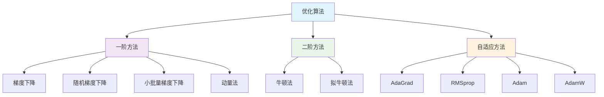

# 1.4.6 优化算法

## 概述

优化算法是深度学习的核心技术之一，负责调整神经网络的参数以最小化损失函数。选择合适的优化算法对模型的训练效果、收敛速度和最终性能都有重要影响。本节将深入介绍各种优化算法的原理、实现和应用场景。



## 1. 梯度下降基础

### 1.1 基本梯度下降

```python
import numpy as np
import matplotlib.pyplot as plt
from mpl_toolkits.mplot3d import Axes3D
from matplotlib.animation import FuncAnimation
import seaborn as sns

class GradientDescentOptimizer:
    """基本梯度下降优化器"""
    
    def __init__(self, learning_rate=0.01):
        self.learning_rate = learning_rate
        self.history = []
    
    def step(self, params, gradients):
        """执行一步优化"""
        updated_params = []
        for param, grad in zip(params, gradients):
            new_param = param - self.learning_rate * grad
            updated_params.append(new_param)
        
        # 记录历史
        self.history.append([p.copy() for p in updated_params])
        return updated_params
    
    def reset_history(self):
        """重置历史记录"""
        self.history = []

class OptimizationVisualizer:
    """优化过程可视化工具"""
    
    def __init__(self):
        self.colors = ['red', 'blue', 'green', 'orange', 'purple', 'brown']
    
    def create_test_function(self, function_type='quadratic'):
        """创建测试函数"""
        if function_type == 'quadratic':
            # 简单二次函数
            def f(x, y):
                return x**2 + y**2
            
            def grad_f(x, y):
                return np.array([2*x, 2*y])
        
        elif function_type == 'rosenbrock':
            # Rosenbrock函数
            def f(x, y):
                return (1 - x)**2 + 100 * (y - x**2)**2
            
            def grad_f(x, y):
                dx = -2 * (1 - x) - 400 * x * (y - x**2)
                dy = 200 * (y - x**2)
                return np.array([dx, dy])
        
        elif function_type == 'beale':
            # Beale函数
            def f(x, y):
                term1 = (1.5 - x + x*y)**2
                term2 = (2.25 - x + x*y**2)**2
                term3 = (2.625 - x + x*y**3)**2
                return term1 + term2 + term3
            
            def grad_f(x, y):
                dx = (2*(1.5 - x + x*y)*(y - 1) + 
                      2*(2.25 - x + x*y**2)*(y**2 - 1) + 
                      2*(2.625 - x + x*y**3)*(y**3 - 1))
                dy = (2*(1.5 - x + x*y)*x + 
                      2*(2.25 - x + x*y**2)*2*x*y + 
                      2*(2.625 - x + x*y**3)*3*x*y**2)
                return np.array([dx, dy])
        
        return f, grad_f
    
    def plot_optimization_path(self, optimizers, function_type='quadratic', 
                             start_point=None, num_iterations=100):
        """可视化优化路径"""
        f, grad_f = self.create_test_function(function_type)
        
        if start_point is None:
            if function_type == 'quadratic':
                start_point = [3.0, 2.0]
            elif function_type == 'rosenbrock':
                start_point = [-1.0, 1.0]
            else:
                start_point = [1.0, 1.0]
        
        # 创建网格用于等高线图
        if function_type == 'quadratic':
            x_range = np.linspace(-4, 4, 100)
            y_range = np.linspace(-3, 3, 100)
        elif function_type == 'rosenbrock':
            x_range = np.linspace(-2, 2, 100)
            y_range = np.linspace(-1, 3, 100)
        else:
            x_range = np.linspace(-1, 4, 100)
            y_range = np.linspace(-1, 4, 100)
        
        X, Y = np.meshgrid(x_range, y_range)
        Z = f(X, Y)
        
        fig, axes = plt.subplots(1, 2, figsize=(15, 6))
        
        # 左图：等高线图 + 优化路径
        ax1 = axes[0]
        contour = ax1.contour(X, Y, Z, levels=20, alpha=0.6)
        ax1.clabel(contour, inline=True, fontsize=8)
        
        # 运行不同优化器
        for i, (name, optimizer) in enumerate(optimizers.items()):
            optimizer.reset_history()
            
            # 初始化参数
            params = [np.array(start_point)]
            
            # 优化过程
            for iteration in range(num_iterations):
                current_params = params[-1]
                gradients = [grad_f(current_params[0], current_params[1])]
                
                new_params = optimizer.step(params, gradients)
                params = new_params
                
                # 检查收敛
                if np.linalg.norm(gradients[0]) < 1e-6:
                    break
            
            # 绘制路径
            path = np.array([p[0] for p in optimizer.history])
            ax1.plot(path[:, 0], path[:, 1], 'o-', 
                    color=self.colors[i % len(self.colors)], 
                    label=f'{name} ({len(path)} steps)',
                    markersize=4, linewidth=2, alpha=0.8)
            
            # 标记起点和终点
            ax1.plot(start_point[0], start_point[1], 's', 
                    color=self.colors[i % len(self.colors)], 
                    markersize=8, alpha=0.7)
            ax1.plot(path[-1, 0], path[-1, 1], '*', 
                    color=self.colors[i % len(self.colors)], 
                    markersize=12, alpha=0.9)
        
        ax1.set_xlabel('x')
        ax1.set_ylabel('y')
        ax1.set_title(f'{function_type.title()} Function Optimization Paths')
        ax1.legend()
        ax1.grid(True, alpha=0.3)
        
        # 右图：损失函数收敛曲线
        ax2 = axes[1]
        for i, (name, optimizer) in enumerate(optimizers.items()):
            if optimizer.history:
                losses = [f(p[0][0], p[0][1]) for p in optimizer.history]
                ax2.semilogy(losses, 'o-', 
                           color=self.colors[i % len(self.colors)], 
                           label=name, linewidth=2, markersize=3)
        
        ax2.set_xlabel('Iteration')
        ax2.set_ylabel('Loss (log scale)')
        ax2.set_title('Convergence Curves')
        ax2.legend()
        ax2.grid(True, alpha=0.3)
        
        plt.tight_layout()
        plt.show()
        
        # 打印收敛信息
        print(f"\n📊 {function_type.title()} Function Optimization Results:")
        print(f"{'Optimizer':<15} {'Steps':<8} {'Final Loss':<12} {'Final Point':<20}")
        print("-" * 60)
        
        for name, optimizer in optimizers.items():
            if optimizer.history:
                final_point = optimizer.history[-1][0]
                final_loss = f(final_point[0], final_point[1])
                steps = len(optimizer.history)
                print(f"{name:<15} {steps:<8} {final_loss:<12.6f} [{final_point[0]:.4f}, {final_point[1]:.4f}]")
    
    def compare_learning_rates(self, learning_rates, function_type='quadratic'):
        """比较不同学习率的效果"""
        f, grad_f = self.create_test_function(function_type)
        
        fig, axes = plt.subplots(2, 2, figsize=(15, 12))
        axes = axes.flatten()
        
        start_point = [2.0, 1.5] if function_type == 'quadratic' else [-1.0, 1.0]
        
        for idx, lr in enumerate(learning_rates):
            ax = axes[idx]
            
            # 创建网格
            if function_type == 'quadratic':
                x_range = np.linspace(-3, 3, 50)
                y_range = np.linspace(-2, 2, 50)
            else:
                x_range = np.linspace(-2, 2, 50)
                y_range = np.linspace(-1, 3, 50)
            
            X, Y = np.meshgrid(x_range, y_range)
            Z = f(X, Y)
            
            # 绘制等高线
            contour = ax.contour(X, Y, Z, levels=15, alpha=0.6)
            
            # 优化过程
            optimizer = GradientDescentOptimizer(learning_rate=lr)
            params = [np.array(start_point)]
            
            for iteration in range(100):
                current_params = params[-1]
                gradients = [grad_f(current_params[0], current_params[1])]
                
                new_params = optimizer.step(params, gradients)
                params = new_params
                
                # 检查收敛或发散
                if (np.linalg.norm(gradients[0]) < 1e-6 or 
                    np.any(np.abs(params[-1]) > 10)):
                    break
            
            # 绘制路径
            if optimizer.history:
                path = np.array([p[0] for p in optimizer.history])
                ax.plot(path[:, 0], path[:, 1], 'ro-', 
                       markersize=3, linewidth=1.5, alpha=0.8)
                ax.plot(start_point[0], start_point[1], 'gs', markersize=8)
                
                if len(path) > 0:
                    ax.plot(path[-1, 0], path[-1, 1], 'b*', markersize=12)
            
            ax.set_title(f'Learning Rate = {lr}')
            ax.set_xlabel('x')
            ax.set_ylabel('y')
            ax.grid(True, alpha=0.3)
            
            # 添加收敛信息
            if optimizer.history:
                final_loss = f(path[-1, 0], path[-1, 1])
                ax.text(0.02, 0.98, f'Steps: {len(path)}\nFinal Loss: {final_loss:.4f}', 
                       transform=ax.transAxes, verticalalignment='top',
                       bbox=dict(boxstyle='round', facecolor='white', alpha=0.8))
        
        plt.tight_layout()
        plt.show()
        
        return learning_rates

# 基础梯度下降演示
print("=" * 80)
print("📈 基础梯度下降算法")
print("=" * 80)

# 创建可视化工具
visualizer = OptimizationVisualizer()

# 比较不同学习率
print("\n🎯 学习率对优化效果的影响:")
learning_rates = [0.001, 0.01, 0.1, 0.5]
visualizer.compare_learning_rates(learning_rates, 'quadratic')

# 创建不同的优化器进行比较
optimizers = {
    'GD (lr=0.01)': GradientDescentOptimizer(0.01),
    'GD (lr=0.05)': GradientDescentOptimizer(0.05),
    'GD (lr=0.1)': GradientDescentOptimizer(0.1)
}

# 在不同函数上测试
print("\n🎯 在不同函数上的优化表现:")
for func_type in ['quadratic', 'rosenbrock']:
    print(f"\n--- {func_type.title()} Function ---")
    visualizer.plot_optimization_path(optimizers, func_type)

print("\n✅ 基础梯度下降演示完成!")
```

## 2. 随机梯度下降变体

### 2.1 SGD与小批量梯度下降

```python
class SGDOptimizer:
    """随机梯度下降优化器"""
    
    def __init__(self, learning_rate=0.01, batch_size=32):
        self.learning_rate = learning_rate
        self.batch_size = batch_size
        self.history = []
    
    def step(self, params, gradients):
        """执行一步SGD优化"""
        updated_params = []
        for param, grad in zip(params, gradients):
            new_param = param - self.learning_rate * grad
            updated_params.append(new_param)
        
        self.history.append([p.copy() for p in updated_params])
        return updated_params
    
    def reset_history(self):
        self.history = []

class MomentumOptimizer:
    """动量优化器"""
    
    def __init__(self, learning_rate=0.01, momentum=0.9):
        self.learning_rate = learning_rate
        self.momentum = momentum
        self.velocity = None
        self.history = []
    
    def step(self, params, gradients):
        """执行一步动量优化"""
        if self.velocity is None:
            self.velocity = [np.zeros_like(grad) for grad in gradients]
        
        updated_params = []
        for i, (param, grad) in enumerate(zip(params, gradients)):
            # 更新速度
            self.velocity[i] = self.momentum * self.velocity[i] - self.learning_rate * grad
            # 更新参数
            new_param = param + self.velocity[i]
            updated_params.append(new_param)
        
        self.history.append([p.copy() for p in updated_params])
        return updated_params
    
    def reset_history(self):
        self.history = []
        self.velocity = None

class NesterovOptimizer:
    """Nesterov加速梯度优化器"""
    
    def __init__(self, learning_rate=0.01, momentum=0.9):
        self.learning_rate = learning_rate
        self.momentum = momentum
        self.velocity = None
        self.history = []
    
    def step(self, params, gradients):
        """执行一步Nesterov优化"""
        if self.velocity is None:
            self.velocity = [np.zeros_like(grad) for grad in gradients]
        
        updated_params = []
        for i, (param, grad) in enumerate(zip(params, gradients)):
            # Nesterov动量更新
            prev_velocity = self.velocity[i].copy()
            self.velocity[i] = self.momentum * self.velocity[i] - self.learning_rate * grad
            new_param = param - self.momentum * prev_velocity + (1 + self.momentum) * self.velocity[i]
            updated_params.append(new_param)
        
        self.history.append([p.copy() for p in updated_params])
        return updated_params
    
    def reset_history(self):
        self.history = []
        self.velocity = None

class SGDComparison:
    """SGD变体对比工具"""
    
    def __init__(self):
        self.colors = ['red', 'blue', 'green', 'orange', 'purple']
    
    def simulate_noisy_gradients(self, true_grad, noise_level=0.1):
        """模拟带噪声的梯度"""
        noise = np.random.normal(0, noise_level, true_grad.shape)
        return true_grad + noise
    
    def compare_sgd_variants(self, function_type='quadratic', noise_level=0.1, num_iterations=200):
        """比较SGD变体"""
        print(f"\n🔄 SGD变体对比 (噪声水平: {noise_level})")
        
        # 创建测试函数
        visualizer = OptimizationVisualizer()
        f, grad_f = visualizer.create_test_function(function_type)
        
        # 创建优化器
        optimizers = {
            'SGD': SGDOptimizer(learning_rate=0.01),
            'Momentum': MomentumOptimizer(learning_rate=0.01, momentum=0.9),
            'Nesterov': NesterovOptimizer(learning_rate=0.01, momentum=0.9)
        }
        
        start_point = [2.0, 1.5] if function_type == 'quadratic' else [-1.0, 1.0]
        
        # 创建网格
        if function_type == 'quadratic':
            x_range = np.linspace(-3, 3, 100)
            y_range = np.linspace(-2, 2, 100)
        else:
            x_range = np.linspace(-2, 2, 100)
            y_range = np.linspace(-1, 3, 100)
        
        X, Y = np.meshgrid(x_range, y_range)
        Z = f(X, Y)
        
        fig, axes = plt.subplots(1, 3, figsize=(18, 6))
        
        # 运行优化
        results = {}
        for name, optimizer in optimizers.items():
            optimizer.reset_history()
            params = [np.array(start_point)]
            losses = []
            
            for iteration in range(num_iterations):
                current_params = params[-1]
                true_grad = grad_f(current_params[0], current_params[1])
                
                # 添加噪声
                noisy_grad = self.simulate_noisy_gradients(true_grad, noise_level)
                gradients = [noisy_grad]
                
                new_params = optimizer.step(params, gradients)
                params = new_params
                
                # 记录损失
                current_loss = f(params[-1][0], params[-1][1])
                losses.append(current_loss)
                
                # 检查收敛
                if current_loss < 1e-6:
                    break
            
            results[name] = {
                'path': np.array([p[0] for p in optimizer.history]),
                'losses': losses,
                'final_loss': losses[-1] if losses else float('inf'),
                'steps': len(optimizer.history)
            }
        
        # 绘制优化路径
        ax1 = axes[0]
        contour = ax1.contour(X, Y, Z, levels=20, alpha=0.6)
        
        for i, (name, result) in enumerate(results.items()):
            path = result['path']
            ax1.plot(path[:, 0], path[:, 1], 'o-', 
                    color=self.colors[i], label=name,
                    markersize=2, linewidth=1.5, alpha=0.8)
            ax1.plot(path[-1, 0], path[-1, 1], '*', 
                    color=self.colors[i], markersize=10)
        
        ax1.plot(start_point[0], start_point[1], 'ks', markersize=8, label='Start')
        ax1.set_xlabel('x')
        ax1.set_ylabel('y')
        ax1.set_title('Optimization Paths')
        ax1.legend()
        ax1.grid(True, alpha=0.3)
        
        # 绘制损失曲线
        ax2 = axes[1]
        for i, (name, result) in enumerate(results.items()):
            losses = result['losses']
            ax2.semilogy(losses, color=self.colors[i], label=name, linewidth=2)
        
        ax2.set_xlabel('Iteration')
        ax2.set_ylabel('Loss (log scale)')
        ax2.set_title('Loss Convergence')
        ax2.legend()
        ax2.grid(True, alpha=0.3)
        
        # 绘制梯度方差分析
        ax3 = axes[2]
        
        # 计算每个优化器的梯度方差
        gradient_vars = []
        for name in optimizers.keys():
            # 模拟梯度方差
            vars_over_time = []
            for i in range(0, min(100, num_iterations), 5):
                grad_samples = []
                for _ in range(10):
                    true_grad = grad_f(start_point[0], start_point[1])
                    noisy_grad = self.simulate_noisy_gradients(true_grad, noise_level)
                    grad_samples.append(np.linalg.norm(noisy_grad))
                vars_over_time.append(np.var(grad_samples))
            gradient_vars.append(vars_over_time)
        
        for i, (name, var_data) in enumerate(zip(optimizers.keys(), gradient_vars)):
            ax3.plot(range(0, len(var_data)*5, 5), var_data, 
                    color=self.colors[i], label=name, linewidth=2)
        
        ax3.set_xlabel('Iteration')
        ax3.set_ylabel('Gradient Variance')
        ax3.set_title('Gradient Noise Analysis')
        ax3.legend()
        ax3.grid(True, alpha=0.3)
        
        plt.tight_layout()
        plt.show()
        
        # 打印结果
        print(f"\n📊 优化结果对比:")
        print(f"{'Method':<12} {'Steps':<8} {'Final Loss':<12} {'Convergence':<12}")
        print("-" * 50)
        
        for name, result in results.items():
            convergence = "Good" if result['final_loss'] < 0.01 else "Poor"
            print(f"{name:<12} {result['steps']:<8} {result['final_loss']:<12.6f} {convergence:<12}")
        
        return results
    
    def analyze_momentum_effect(self):
        """分析动量效应"""
        print(f"\n🚀 动量效应分析")
        
        # 创建一个有局部最小值的函数
        def complex_function(x, y):
            return (x**2 + y**2) + 0.3 * np.sin(5*x) * np.sin(5*y)
        
        def complex_grad(x, y):
            dx = 2*x + 0.3 * 5 * np.cos(5*x) * np.sin(5*y)
            dy = 2*y + 0.3 * 5 * np.sin(5*x) * np.cos(5*y)
            return np.array([dx, dy])
        
        # 测试不同动量值
        momentum_values = [0.0, 0.5, 0.9, 0.99]
        
        fig, axes = plt.subplots(2, 2, figsize=(15, 12))
        axes = axes.flatten()
        
        # 创建网格
        x_range = np.linspace(-2, 2, 100)
        y_range = np.linspace(-2, 2, 100)
        X, Y = np.meshgrid(x_range, y_range)
        Z = complex_function(X, Y)
        
        start_point = [1.5, 1.0]
        
        for idx, momentum in enumerate(momentum_values):
            ax = axes[idx]
            
            # 绘制等高线
            contour = ax.contour(X, Y, Z, levels=20, alpha=0.6)
            
            # 创建优化器
            if momentum == 0.0:
                optimizer = SGDOptimizer(learning_rate=0.01)
                title = 'No Momentum (SGD)'
            else:
                optimizer = MomentumOptimizer(learning_rate=0.01, momentum=momentum)
                title = f'Momentum = {momentum}'
            
            # 优化过程
            params = [np.array(start_point)]
            
            for iteration in range(200):
                current_params = params[-1]
                gradients = [complex_grad(current_params[0], current_params[1])]
                
                new_params = optimizer.step(params, gradients)
                params = new_params
                
                # 检查收敛
                if np.linalg.norm(gradients[0]) < 1e-4:
                    break
            
            # 绘制路径
            if optimizer.history:
                path = np.array([p[0] for p in optimizer.history])
                ax.plot(path[:, 0], path[:, 1], 'ro-', 
                       markersize=2, linewidth=1.5, alpha=0.8)
                ax.plot(start_point[0], start_point[1], 'gs', markersize=8)
                ax.plot(path[-1, 0], path[-1, 1], 'b*', markersize=12)
                
                # 添加信息
                final_loss = complex_function(path[-1, 0], path[-1, 1])
                ax.text(0.02, 0.98, f'Steps: {len(path)}\nFinal Loss: {final_loss:.4f}', 
                       transform=ax.transAxes, verticalalignment='top',
                       bbox=dict(boxstyle='round', facecolor='white', alpha=0.8))
            
            ax.set_title(title)
            ax.set_xlabel('x')
            ax.set_ylabel('y')
            ax.grid(True, alpha=0.3)
        
        plt.tight_layout()
        plt.show()
        
        print(f"\n💡 动量效应观察:")
        print(f"   • 无动量: 容易陷入局部震荡")
        print(f"   • 小动量(0.5): 减少震荡，加速收敛")
        print(f"   • 大动量(0.9): 更好地跨越局部最小值")
        print(f"   • 过大动量(0.99): 可能导致过冲和不稳定")

# SGD变体演示
print("\n" + "=" * 80)
print("🔄 随机梯度下降变体")
print("=" * 80)

# 创建对比工具
sgd_comparison = SGDComparison()

# 比较不同噪声水平下的表现
for noise in [0.05, 0.2]:
    print(f"\n--- 噪声水平: {noise} ---")
    results = sgd_comparison.compare_sgd_variants('quadratic', noise_level=noise, num_iterations=150)

# 分析动量效应
sgd_comparison.analyze_momentum_effect()

print("\n✅ SGD变体演示完成!")
```

## 3. 自适应学习率算法

### 3.1 AdaGrad算法

```python
class AdaGradOptimizer:
    """AdaGrad优化器"""
    
    def __init__(self, learning_rate=0.01, epsilon=1e-8):
        self.learning_rate = learning_rate
        self.epsilon = epsilon
        self.accumulated_gradients = None
        self.history = []
    
    def step(self, params, gradients):
        """执行一步AdaGrad优化"""
        if self.accumulated_gradients is None:
            self.accumulated_gradients = [np.zeros_like(grad) for grad in gradients]
        
        updated_params = []
        for i, (param, grad) in enumerate(zip(params, gradients)):
            # 累积梯度平方
            self.accumulated_gradients[i] += grad ** 2
            
            # 自适应学习率
            adapted_lr = self.learning_rate / (np.sqrt(self.accumulated_gradients[i]) + self.epsilon)
            
            # 更新参数
            new_param = param - adapted_lr * grad
            updated_params.append(new_param)
        
        self.history.append([p.copy() for p in updated_params])
        return updated_params
    
    def reset_history(self):
        self.history = []
        self.accumulated_gradients = None

class RMSpropOptimizer:
    """RMSprop优化器"""
    
    def __init__(self, learning_rate=0.01, decay_rate=0.9, epsilon=1e-8):
        self.learning_rate = learning_rate
        self.decay_rate = decay_rate
        self.epsilon = epsilon
        self.moving_avg_gradients = None
        self.history = []
    
    def step(self, params, gradients):
        """执行一步RMSprop优化"""
        if self.moving_avg_gradients is None:
            self.moving_avg_gradients = [np.zeros_like(grad) for grad in gradients]
        
        updated_params = []
        for i, (param, grad) in enumerate(zip(params, gradients)):
            # 指数移动平均
            self.moving_avg_gradients[i] = (self.decay_rate * self.moving_avg_gradients[i] + 
                                          (1 - self.decay_rate) * grad ** 2)
            
            # 自适应学习率
            adapted_lr = self.learning_rate / (np.sqrt(self.moving_avg_gradients[i]) + self.epsilon)
            
            # 更新参数
            new_param = param - adapted_lr * grad
            updated_params.append(new_param)
        
        self.history.append([p.copy() for p in updated_params])
        return updated_params
    
    def reset_history(self):
        self.history = []
        self.moving_avg_gradients = None

class AdamOptimizer:
    """Adam优化器"""
    
    def __init__(self, learning_rate=0.001, beta1=0.9, beta2=0.999, epsilon=1e-8):
        self.learning_rate = learning_rate
        self.beta1 = beta1
        self.beta2 = beta2
        self.epsilon = epsilon
        self.m = None  # 一阶矩估计
        self.v = None  # 二阶矩估计
        self.t = 0     # 时间步
        self.history = []
    
    def step(self, params, gradients):
        """执行一步Adam优化"""
        if self.m is None:
            self.m = [np.zeros_like(grad) for grad in gradients]
            self.v = [np.zeros_like(grad) for grad in gradients]
        
        self.t += 1
        updated_params = []
        
        for i, (param, grad) in enumerate(zip(params, gradients)):
            # 更新一阶和二阶矩估计
            self.m[i] = self.beta1 * self.m[i] + (1 - self.beta1) * grad
            self.v[i] = self.beta2 * self.v[i] + (1 - self.beta2) * grad ** 2
            
            # 偏差修正
            m_corrected = self.m[i] / (1 - self.beta1 ** self.t)
            v_corrected = self.v[i] / (1 - self.beta2 ** self.t)
            
            # 更新参数
            new_param = param - self.learning_rate * m_corrected / (np.sqrt(v_corrected) + self.epsilon)
            updated_params.append(new_param)
        
        self.history.append([p.copy() for p in updated_params])
        return updated_params
    
    def reset_history(self):
        self.history = []
        self.m = None
        self.v = None
        self.t = 0

class AdamWOptimizer:
    """AdamW优化器（带权重衰减的Adam）"""
    
    def __init__(self, learning_rate=0.001, beta1=0.9, beta2=0.999, 
                 epsilon=1e-8, weight_decay=0.01):
        self.learning_rate = learning_rate
        self.beta1 = beta1
        self.beta2 = beta2
        self.epsilon = epsilon
        self.weight_decay = weight_decay
        self.m = None
        self.v = None
        self.t = 0
        self.history = []
    
    def step(self, params, gradients):
        """执行一步AdamW优化"""
        if self.m is None:
            self.m = [np.zeros_like(grad) for grad in gradients]
            self.v = [np.zeros_like(grad) for grad in gradients]
        
        self.t += 1
        updated_params = []
        
        for i, (param, grad) in enumerate(zip(params, gradients)):
            # 权重衰减
            param_with_decay = param * (1 - self.learning_rate * self.weight_decay)
            
            # 更新一阶和二阶矩估计
            self.m[i] = self.beta1 * self.m[i] + (1 - self.beta1) * grad
            self.v[i] = self.beta2 * self.v[i] + (1 - self.beta2) * grad ** 2
            
            # 偏差修正
            m_corrected = self.m[i] / (1 - self.beta1 ** self.t)
            v_corrected = self.v[i] / (1 - self.beta2 ** self.t)
            
            # 更新参数
            new_param = param_with_decay - self.learning_rate * m_corrected / (np.sqrt(v_corrected) + self.epsilon)
            updated_params.append(new_param)
        
        self.history.append([p.copy() for p in updated_params])
        return updated_params
    
    def reset_history(self):
        self.history = []
        self.m = None
        self.v = None
        self.t = 0

class AdaptiveOptimizerComparison:
    """自适应优化器对比工具"""
    
    def __init__(self):
        self.colors = ['red', 'blue', 'green', 'orange', 'purple', 'brown']
    
    def compare_adaptive_optimizers(self, function_type='rosenbrock', num_iterations=500):
        """比较自适应优化器"""
        print(f"\n🎯 自适应优化器对比 ({function_type} function)")
        
        # 创建测试函数
        visualizer = OptimizationVisualizer()
        f, grad_f = visualizer.create_test_function(function_type)
        
        # 创建优化器
        optimizers = {
            'SGD': SGDOptimizer(learning_rate=0.01),
            'Momentum': MomentumOptimizer(learning_rate=0.01, momentum=0.9),
            'AdaGrad': AdaGradOptimizer(learning_rate=0.1),
            'RMSprop': RMSpropOptimizer(learning_rate=0.01, decay_rate=0.9),
            'Adam': AdamOptimizer(learning_rate=0.01),
            'AdamW': AdamWOptimizer(learning_rate=0.01, weight_decay=0.01)
        }
        
        start_point = [-1.0, 1.0] if function_type == 'rosenbrock' else [2.0, 1.5]
        
        # 创建网格
        if function_type == 'rosenbrock':
            x_range = np.linspace(-2, 2, 100)
            y_range = np.linspace(-1, 3, 100)
        else:
            x_range = np.linspace(-3, 3, 100)
            y_range = np.linspace(-2, 2, 100)
        
        X, Y = np.meshgrid(x_range, y_range)
        Z = f(X, Y)
        
        fig, axes = plt.subplots(2, 2, figsize=(16, 12))
        
        # 运行优化
        results = {}
        for name, optimizer in optimizers.items():
            optimizer.reset_history()
            params = [np.array(start_point)]
            losses = []
            
            for iteration in range(num_iterations):
                current_params = params[-1]
                gradients = [grad_f(current_params[0], current_params[1])]
                
                new_params = optimizer.step(params, gradients)
                params = new_params
                
                # 记录损失
                current_loss = f(params[-1][0], params[-1][1])
                losses.append(current_loss)
                
                # 检查收敛
                if current_loss < 1e-8:
                    break
            
            results[name] = {
                'path': np.array([p[0] for p in optimizer.history]),
                'losses': losses,
                'final_loss': losses[-1] if losses else float('inf'),
                'steps': len(optimizer.history)
            }
        
        # 绘制优化路径
        ax1 = axes[0, 0]
        contour = ax1.contour(X, Y, Z, levels=30, alpha=0.6)
        
        for i, (name, result) in enumerate(results.items()):
            path = result['path']
            if len(path) > 0:
                ax1.plot(path[:, 0], path[:, 1], 'o-', 
                        color=self.colors[i % len(self.colors)], 
                        label=f'{name} ({len(path)})',
                        markersize=2, linewidth=1.5, alpha=0.8)
                ax1.plot(path[-1, 0], path[-1, 1], '*', 
                        color=self.colors[i % len(self.colors)], markersize=8)
        
        ax1.plot(start_point[0], start_point[1], 'ks', markersize=8, label='Start')
        ax1.set_xlabel('x')
        ax1.set_ylabel('y')
        ax1.set_title('Optimization Paths')
        ax1.legend(bbox_to_anchor=(1.05, 1), loc='upper left')
        ax1.grid(True, alpha=0.3)
        
        # 绘制损失曲线
        ax2 = axes[0, 1]
        for i, (name, result) in enumerate(results.items()):
            losses = result['losses']
            if losses:
                ax2.semilogy(losses, color=self.colors[i % len(self.colors)], 
                           label=name, linewidth=2)
        
        ax2.set_xlabel('Iteration')
        ax2.set_ylabel('Loss (log scale)')
        ax2.set_title('Loss Convergence')
        ax2.legend()
        ax2.grid(True, alpha=0.3)
        
        # 绘制收敛速度对比
        ax3 = axes[1, 0]
        convergence_thresholds = [1e-1, 1e-2, 1e-3, 1e-4, 1e-5]
        convergence_steps = {name: [] for name in optimizers.keys()}
        
        for threshold in convergence_thresholds:
            for name, result in results.items():
                losses = result['losses']
                steps_to_converge = len(losses)
                for i, loss in enumerate(losses):
                    if loss < threshold:
                        steps_to_converge = i
                        break
                convergence_steps[name].append(steps_to_converge)
        
        x_pos = np.arange(len(convergence_thresholds))
        width = 0.12
        
        for i, (name, steps) in enumerate(convergence_steps.items()):
            ax3.bar(x_pos + i * width, steps, width, 
                   color=self.colors[i % len(self.colors)], 
                   label=name, alpha=0.8)
        
        ax3.set_xlabel('Convergence Threshold')
        ax3.set_ylabel('Steps to Converge')
        ax3.set_title('Convergence Speed Comparison')
        ax3.set_xticks(x_pos + width * 2.5)
        ax3.set_xticklabels([f'1e-{i+1}' for i in range(len(convergence_thresholds))])
        ax3.legend()
        ax3.grid(True, alpha=0.3)
        
        # 绘制最终性能对比
        ax4 = axes[1, 1]
        names = list(results.keys())
        final_losses = [results[name]['final_loss'] for name in names]
        steps_taken = [results[name]['steps'] for name in names]
        
        scatter = ax4.scatter(steps_taken, final_losses, 
                            c=range(len(names)), 
                            s=100, alpha=0.7, cmap='tab10')
        
        for i, name in enumerate(names):
            ax4.annotate(name, (steps_taken[i], final_losses[i]), 
                        xytext=(5, 5), textcoords='offset points', fontsize=9)
        
        ax4.set_xlabel('Steps Taken')
        ax4.set_ylabel('Final Loss')
        ax4.set_title('Efficiency vs Accuracy')
        ax4.set_yscale('log')
        ax4.grid(True, alpha=0.3)
        
        plt.tight_layout()
        plt.show()
        
        # 打印详细结果
        print(f"\n📊 详细优化结果:")
        print(f"{'Optimizer':<12} {'Steps':<8} {'Final Loss':<15} {'Convergence':<12} {'Efficiency':<12}")
        print("-" * 75)
        
        for name, result in results.items():
            convergence = "Excellent" if result['final_loss'] < 1e-6 else \
                         "Good" if result['final_loss'] < 1e-3 else \
                         "Fair" if result['final_loss'] < 1e-1 else "Poor"
            
            efficiency = "High" if result['steps'] < 100 else \
                        "Medium" if result['steps'] < 300 else "Low"
            
            print(f"{name:<12} {result['steps']:<8} {result['final_loss']:<15.8f} {convergence:<12} {efficiency:<12}")
        
        return results
    
    def analyze_learning_rate_adaptation(self):
        """分析学习率自适应效果"""
        print(f"\n📈 学习率自适应效果分析")
        
        # 创建一个具有不同尺度的函数
        def scaled_function(x, y):
            return 100 * x**2 + y**2  # x方向梯度比y方向大100倍
        
        def scaled_grad(x, y):
            return np.array([200 * x, 2 * y])
        
        # 测试优化器
        optimizers = {
            'SGD': SGDOptimizer(learning_rate=0.001),
            'AdaGrad': AdaGradOptimizer(learning_rate=0.1),
            'RMSprop': RMSpropOptimizer(learning_rate=0.01),
            'Adam': AdamOptimizer(learning_rate=0.01)
        }
        
        start_point = [1.0, 1.0]
        
        fig, axes = plt.subplots(2, 2, figsize=(15, 12))
        axes = axes.flatten()
        
        # 创建网格
        x_range = np.linspace(-1.5, 1.5, 100)
        y_range = np.linspace(-3, 3, 100)
        X, Y = np.meshgrid(x_range, y_range)
        Z = scaled_function(X, Y)
        
        results = {}
        for idx, (name, optimizer) in enumerate(optimizers.items()):
            ax = axes[idx]
            
            # 绘制等高线
            contour = ax.contour(X, Y, Z, levels=20, alpha=0.6)
            
            # 优化过程
            optimizer.reset_history()
            params = [np.array(start_point)]
            
            for iteration in range(200):
                current_params = params[-1]
                gradients = [scaled_grad(current_params[0], current_params[1])]
                
                new_params = optimizer.step(params, gradients)
                params = new_params
                
                # 检查收敛
                if np.linalg.norm(gradients[0]) < 1e-6:
                    break
            
            # 绘制路径
            if optimizer.history:
                path = np.array([p[0] for p in optimizer.history])
                ax.plot(path[:, 0], path[:, 1], 'ro-', 
                       markersize=3, linewidth=1.5, alpha=0.8)
                ax.plot(start_point[0], start_point[1], 'gs', markersize=8)
                ax.plot(path[-1, 0], path[-1, 1], 'b*', markersize=12)
                
                # 记录结果
                final_loss = scaled_function(path[-1, 0], path[-1, 1])
                results[name] = {
                    'steps': len(path),
                    'final_loss': final_loss,
                    'path': path
                }
                
                # 添加信息
                ax.text(0.02, 0.98, f'Steps: {len(path)}\nFinal Loss: {final_loss:.4f}', 
                       transform=ax.transAxes, verticalalignment='top',
                       bbox=dict(boxstyle='round', facecolor='white', alpha=0.8))
            
            ax.set_title(f'{name} Optimizer')
            ax.set_xlabel('x (high curvature)')
            ax.set_ylabel('y (low curvature)')
            ax.grid(True, alpha=0.3)
        
        plt.tight_layout()
        plt.show()
        
        print(f"\n🔍 自适应效果观察:")
        for name, result in results.items():
            print(f"   {name}: {result['steps']} steps, final loss: {result['final_loss']:.6f}")
        
        print(f"\n💡 关键观察:")
        print(f"   • SGD: 在高曲率方向收敛缓慢")
        print(f"   • AdaGrad: 自动调整学习率，但可能过早停止")
        print(f"   • RMSprop: 解决AdaGrad的学习率衰减问题")
        print(f"   • Adam: 结合动量和自适应学习率，通常表现最佳")
        
        return results

# 自适应优化器演示
print("\n" + "=" * 80)
print("🎯 自适应学习率算法")
print("=" * 80)

# 创建对比工具
adaptive_comparison = AdaptiveOptimizerComparison()

# 在不同函数上比较优化器
for func_type in ['quadratic', 'rosenbrock']:
    print(f"\n--- {func_type.title()} Function ---")
    results = adaptive_comparison.compare_adaptive_optimizers(func_type, num_iterations=300)

# 分析学习率自适应效果
adaptive_comparison.analyze_learning_rate_adaptation()

print("\n✅ 自适应优化器演示完成!")

## 4. 高级优化技术

### 4.1 学习率调度

```python
class LearningRateScheduler:
    """学习率调度器"""
    
    def __init__(self, initial_lr=0.01, schedule_type='step'):
        self.initial_lr = initial_lr
        self.schedule_type = schedule_type
        self.current_lr = initial_lr
        self.step_count = 0
    
    def step(self, epoch=None, loss=None):
        """更新学习率"""
        self.step_count += 1
        
        if self.schedule_type == 'step':
            # 阶梯式衰减
            if self.step_count % 100 == 0:
                self.current_lr *= 0.5
        
        elif self.schedule_type == 'exponential':
            # 指数衰减
            decay_rate = 0.95
            self.current_lr = self.initial_lr * (decay_rate ** (self.step_count / 100))
        
        elif self.schedule_type == 'cosine':
            # 余弦退火
            import math
            T_max = 500  # 最大步数
            self.current_lr = self.initial_lr * 0.5 * (1 + math.cos(math.pi * self.step_count / T_max))
        
        elif self.schedule_type == 'plateau':
            # 基于损失的自适应调整（简化版）
            if loss is not None and hasattr(self, 'best_loss'):
                if loss >= self.best_loss:
                    self.patience_count += 1
                    if self.patience_count >= 10:
                        self.current_lr *= 0.5
                        self.patience_count = 0
                else:
                    self.best_loss = loss
                    self.patience_count = 0
            elif loss is not None:
                self.best_loss = loss
                self.patience_count = 0
        
        return self.current_lr
    
    def get_lr(self):
        """获取当前学习率"""
        return self.current_lr

class ScheduledOptimizer:
    """带学习率调度的优化器"""
    
    def __init__(self, base_optimizer, scheduler):
        self.base_optimizer = base_optimizer
        self.scheduler = scheduler
        self.history = []
    
    def step(self, params, gradients, epoch=None, loss=None):
        """执行优化步骤"""
        # 更新学习率
        new_lr = self.scheduler.step(epoch, loss)
        
        # 更新基础优化器的学习率
        if hasattr(self.base_optimizer, 'learning_rate'):
            self.base_optimizer.learning_rate = new_lr
        
        # 执行优化步骤
        updated_params = self.base_optimizer.step(params, gradients)
        
        # 记录历史
        self.history.append({
            'params': [p.copy() for p in updated_params],
            'lr': new_lr,
            'loss': loss
        })
        
        return updated_params
    
    def reset_history(self):
        self.history = []
        self.base_optimizer.reset_history()
        self.scheduler.step_count = 0
        self.scheduler.current_lr = self.scheduler.initial_lr

class OptimizationTechniques:
    """高级优化技术演示"""
    
    def __init__(self):
        self.colors = ['red', 'blue', 'green', 'orange', 'purple']
    
    def demonstrate_lr_scheduling(self):
        """演示学习率调度效果"""
        print(f"\n📅 学习率调度效果演示")
        
        # 创建测试函数
        visualizer = OptimizationVisualizer()
        f, grad_f = visualizer.create_test_function('rosenbrock')
        
        # 创建不同调度策略的优化器
        schedulers = {
            'Constant': LearningRateScheduler(0.01, 'constant'),
            'Step Decay': LearningRateScheduler(0.05, 'step'),
            'Exponential': LearningRateScheduler(0.05, 'exponential'),
            'Cosine': LearningRateScheduler(0.05, 'cosine')
        }
        
        optimizers = {}
        for name, scheduler in schedulers.items():
            base_opt = SGDOptimizer(learning_rate=0.01)
            optimizers[name] = ScheduledOptimizer(base_opt, scheduler)
        
        start_point = [-1.0, 1.0]
        num_iterations = 400
        
        fig, axes = plt.subplots(2, 2, figsize=(15, 12))
        
        # 运行优化
        results = {}
        for name, optimizer in optimizers.items():
            optimizer.reset_history()
            params = [np.array(start_point)]
            losses = []
            learning_rates = []
            
            for iteration in range(num_iterations):
                current_params = params[-1]
                gradients = [grad_f(current_params[0], current_params[1])]
                current_loss = f(current_params[0], current_params[1])
                
                new_params = optimizer.step(params, gradients, 
                                          epoch=iteration, loss=current_loss)
                params = new_params
                
                losses.append(current_loss)
                learning_rates.append(optimizer.scheduler.get_lr())
                
                if current_loss < 1e-8:
                    break
            
            results[name] = {
                'losses': losses,
                'learning_rates': learning_rates,
                'path': np.array([h['params'][0] for h in optimizer.history]),
                'final_loss': losses[-1] if losses else float('inf')
            }
        
        # 绘制学习率变化
        ax1 = axes[0, 0]
        for i, (name, result) in enumerate(results.items()):
            ax1.plot(result['learning_rates'], 
                    color=self.colors[i], label=name, linewidth=2)
        
        ax1.set_xlabel('Iteration')
        ax1.set_ylabel('Learning Rate')
        ax1.set_title('Learning Rate Schedules')
        ax1.legend()
        ax1.grid(True, alpha=0.3)
        
        # 绘制损失曲线
        ax2 = axes[0, 1]
        for i, (name, result) in enumerate(results.items()):
            ax2.semilogy(result['losses'], 
                        color=self.colors[i], label=name, linewidth=2)
        
        ax2.set_xlabel('Iteration')
        ax2.set_ylabel('Loss (log scale)')
        ax2.set_title('Loss Convergence with Different Schedules')
        ax2.legend()
        ax2.grid(True, alpha=0.3)
        
        # 绘制优化路径
        ax3 = axes[1, 0]
        x_range = np.linspace(-2, 2, 100)
        y_range = np.linspace(-1, 3, 100)
        X, Y = np.meshgrid(x_range, y_range)
        Z = f(X, Y)
        
        contour = ax3.contour(X, Y, Z, levels=20, alpha=0.6)
        
        for i, (name, result) in enumerate(results.items()):
            path = result['path']
            if len(path) > 0:
                ax3.plot(path[:, 0], path[:, 1], 'o-', 
                        color=self.colors[i], label=name,
                        markersize=2, linewidth=1.5, alpha=0.8)
        
        ax3.plot(start_point[0], start_point[1], 'ks', markersize=8, label='Start')
        ax3.set_xlabel('x')
        ax3.set_ylabel('y')
        ax3.set_title('Optimization Paths')
        ax3.legend()
        ax3.grid(True, alpha=0.3)
        
        # 绘制收敛速度对比
        ax4 = axes[1, 1]
        convergence_times = []
        names = []
        
        for name, result in results.items():
            losses = result['losses']
            convergence_time = len(losses)
            for i, loss in enumerate(losses):
                if loss < 1e-3:
                    convergence_time = i
                    break
            convergence_times.append(convergence_time)
            names.append(name)
        
        bars = ax4.bar(names, convergence_times, 
                      color=self.colors[:len(names)], alpha=0.7)
        ax4.set_ylabel('Steps to Converge (loss < 1e-3)')
        ax4.set_title('Convergence Speed Comparison')
        ax4.tick_params(axis='x', rotation=45)
        
        # 添加数值标签
        for bar, time in zip(bars, convergence_times):
            height = bar.get_height()
            ax4.text(bar.get_x() + bar.get_width()/2., height + 5,
                    f'{time}', ha='center', va='bottom')
        
        plt.tight_layout()
        plt.show()
        
        # 打印结果
        print(f"\n📊 学习率调度效果对比:")
        print(f"{'Schedule':<15} {'Final Loss':<15} {'Convergence Steps':<18} {'Efficiency':<12}")
        print("-" * 65)
        
        for name, result in results.items():
            conv_steps = len(result['losses'])
            for i, loss in enumerate(result['losses']):
                if loss < 1e-3:
                    conv_steps = i
                    break
            
            efficiency = "High" if conv_steps < 100 else \
                        "Medium" if conv_steps < 200 else "Low"
            
            print(f"{name:<15} {result['final_loss']:<15.8f} {conv_steps:<18} {efficiency:<12}")
        
        return results
    
    def demonstrate_gradient_clipping(self):
        """演示梯度裁剪效果"""
        print(f"\n✂️ 梯度裁剪效果演示")
        
        class GradientClippingOptimizer:
            """带梯度裁剪的优化器"""
            
            def __init__(self, base_optimizer, clip_norm=1.0):
                self.base_optimizer = base_optimizer
                self.clip_norm = clip_norm
                self.history = []
            
            def step(self, params, gradients):
                # 计算梯度范数
                total_norm = 0
                for grad in gradients:
                    total_norm += np.sum(grad ** 2)
                total_norm = np.sqrt(total_norm)
                
                # 梯度裁剪
                clipped_gradients = []
                if total_norm > self.clip_norm:
                    clip_coef = self.clip_norm / total_norm
                    for grad in gradients:
                        clipped_gradients.append(grad * clip_coef)
                else:
                    clipped_gradients = gradients
                
                # 记录梯度信息
                self.history.append({
                    'original_norm': total_norm,
                    'clipped_norm': min(total_norm, self.clip_norm),
                    'clipped': total_norm > self.clip_norm
                })
                
                return self.base_optimizer.step(params, clipped_gradients)
            
            def reset_history(self):
                self.history = []
                self.base_optimizer.reset_history()
        
        # 创建一个容易产生大梯度的函数
        def steep_function(x, y):
            return np.exp(x**2 + y**2) - 1
        
        def steep_grad(x, y):
            exp_val = np.exp(x**2 + y**2)
            return np.array([2*x*exp_val, 2*y*exp_val])
        
        # 测试不同的梯度裁剪策略
        clip_norms = [None, 10.0, 1.0, 0.1]
        
        fig, axes = plt.subplots(2, 2, figsize=(15, 12))
        axes = axes.flatten()
        
        start_point = [0.8, 0.6]
        
        results = {}
        for idx, clip_norm in enumerate(clip_norms):
            ax = axes[idx]
            
            # 创建优化器
            base_opt = SGDOptimizer(learning_rate=0.01)
            if clip_norm is None:
                optimizer = base_opt
                title = 'No Clipping'
            else:
                optimizer = GradientClippingOptimizer(base_opt, clip_norm)
                title = f'Clip Norm = {clip_norm}'
            
            # 优化过程
            optimizer.reset_history()
            params = [np.array(start_point)]
            losses = []
            gradient_norms = []
            
            for iteration in range(100):
                current_params = params[-1]
                
                # 检查参数是否过大（防止数值溢出）
                if np.any(np.abs(current_params) > 2):
                    break
                
                gradients = [steep_grad(current_params[0], current_params[1])]
                
                # 检查梯度是否过大
                grad_norm = np.linalg.norm(gradients[0])
                if grad_norm > 1e6:  # 防止数值溢出
                    break
                
                gradient_norms.append(grad_norm)
                
                new_params = optimizer.step(params, gradients)
                params = new_params
                
                current_loss = steep_function(params[-1][0], params[-1][1])
                losses.append(current_loss)
                
                if current_loss < 1e-6 or current_loss > 1e6:
                    break
            
            # 绘制优化路径
            if hasattr(optimizer, 'base_optimizer'):
                path = np.array([p[0] for p in optimizer.base_optimizer.history])
            else:
                path = np.array([p[0] for p in optimizer.history])
            
            if len(path) > 0:
                ax.plot(path[:, 0], path[:, 1], 'ro-', 
                       markersize=3, linewidth=1.5, alpha=0.8)
                ax.plot(start_point[0], start_point[1], 'gs', markersize=8)
                ax.plot(path[-1, 0], path[-1, 1], 'b*', markersize=12)
                
                # 添加信息
                final_loss = losses[-1] if losses else float('inf')
                ax.text(0.02, 0.98, f'Steps: {len(path)}\nFinal Loss: {final_loss:.4f}', 
                       transform=ax.transAxes, verticalalignment='top',
                       bbox=dict(boxstyle='round', facecolor='white', alpha=0.8))
            
            ax.set_title(title)
            ax.set_xlabel('x')
            ax.set_ylabel('y')
            ax.grid(True, alpha=0.3)
            ax.set_xlim(-1.5, 1.5)
            ax.set_ylim(-1.5, 1.5)
            
            results[title] = {
                'losses': losses,
                'gradient_norms': gradient_norms,
                'path': path if len(path) > 0 else np.array([]),
                'converged': len(losses) > 0 and losses[-1] < 1e-3
            }
        
        plt.tight_layout()
        plt.show()
        
        # 绘制梯度范数变化
        fig, (ax1, ax2) = plt.subplots(1, 2, figsize=(15, 6))
        
        # 梯度范数变化
        for i, (title, result) in enumerate(results.items()):
            if result['gradient_norms']:
                ax1.semilogy(result['gradient_norms'], 
                           color=self.colors[i], label=title, linewidth=2)
        
        ax1.set_xlabel('Iteration')
        ax1.set_ylabel('Gradient Norm (log scale)')
        ax1.set_title('Gradient Norm Evolution')
        ax1.legend()
        ax1.grid(True, alpha=0.3)
        
        # 损失变化
        for i, (title, result) in enumerate(results.items()):
            if result['losses']:
                ax2.semilogy(result['losses'], 
                           color=self.colors[i], label=title, linewidth=2)
        
        ax2.set_xlabel('Iteration')
        ax2.set_ylabel('Loss (log scale)')
        ax2.set_title('Loss Evolution')
        ax2.legend()
        ax2.grid(True, alpha=0.3)
        
        plt.tight_layout()
        plt.show()
        
        print(f"\n📊 梯度裁剪效果分析:")
        for title, result in results.items():
            status = "收敛" if result['converged'] else "发散/不稳定"
            max_grad = max(result['gradient_norms']) if result['gradient_norms'] else 0
            print(f"   {title}: {status}, 最大梯度范数: {max_grad:.2f}")
        
        print(f"\n💡 关键观察:")
        print(f"   • 无裁剪: 可能因梯度爆炸导致训练不稳定")
        print(f"   • 适度裁剪: 稳定训练过程，保持收敛性")
        print(f"   • 过度裁剪: 可能阻碍收敛，降低训练效率")
        
        return results

### 4.2 Trae风格的优化器实现

```python
class TraeOptimizer:
    """Trae风格的综合优化器"""
    
    def __init__(self, optimizer_type='adam', learning_rate=0.001, 
                 schedule_type='cosine', clip_norm=1.0, **kwargs):
        self.optimizer_type = optimizer_type
        self.learning_rate = learning_rate
        self.schedule_type = schedule_type
        self.clip_norm = clip_norm
        
        # 创建基础优化器
        if optimizer_type == 'sgd':
            self.base_optimizer = SGDOptimizer(learning_rate)
        elif optimizer_type == 'momentum':
            momentum = kwargs.get('momentum', 0.9)
            self.base_optimizer = MomentumOptimizer(learning_rate, momentum)
        elif optimizer_type == 'adam':
            beta1 = kwargs.get('beta1', 0.9)
            beta2 = kwargs.get('beta2', 0.999)
            self.base_optimizer = AdamOptimizer(learning_rate, beta1, beta2)
        elif optimizer_type == 'adamw':
            beta1 = kwargs.get('beta1', 0.9)
            beta2 = kwargs.get('beta2', 0.999)
            weight_decay = kwargs.get('weight_decay', 0.01)
            self.base_optimizer = AdamWOptimizer(learning_rate, beta1, beta2, weight_decay=weight_decay)
        else:
            raise ValueError(f"Unsupported optimizer type: {optimizer_type}")
        
        # 创建学习率调度器
        self.scheduler = LearningRateScheduler(learning_rate, schedule_type)
        
        # 训练历史
        self.trae_history = {
            'losses': [],
            'learning_rates': [],
            'gradient_norms': [],
            'parameters': [],
            'optimization_metrics': []
        }
        
        self.step_count = 0
    
    def trae_step(self, params, gradients, loss=None):
        """Trae风格的优化步骤"""
        self.step_count += 1
        
        # 1. 计算原始梯度范数
        original_grad_norm = 0
        for grad in gradients:
            original_grad_norm += np.sum(grad ** 2)
        original_grad_norm = np.sqrt(original_grad_norm)
        
        # 2. 梯度裁剪
        clipped_gradients = []
        if self.clip_norm is not None and original_grad_norm > self.clip_norm:
            clip_coef = self.clip_norm / original_grad_norm
            for grad in gradients:
                clipped_gradients.append(grad * clip_coef)
            clipped_grad_norm = self.clip_norm
        else:
            clipped_gradients = gradients
            clipped_grad_norm = original_grad_norm
        
        # 3. 更新学习率
        current_lr = self.scheduler.step(self.step_count, loss)
        if hasattr(self.base_optimizer, 'learning_rate'):
            self.base_optimizer.learning_rate = current_lr
        
        # 4. 执行优化步骤
        updated_params = self.base_optimizer.step(params, clipped_gradients)
        
        # 5. 记录详细历史
        self.trae_history['losses'].append(loss if loss is not None else 0)
        self.trae_history['learning_rates'].append(current_lr)
        self.trae_history['gradient_norms'].append(original_grad_norm)
        self.trae_history['parameters'].append([p.copy() for p in updated_params])
        
        # 计算优化指标
        metrics = self._compute_optimization_metrics(params, updated_params, 
                                                   gradients, clipped_gradients)
        self.trae_history['optimization_metrics'].append(metrics)
        
        return updated_params
    
    def _compute_optimization_metrics(self, old_params, new_params, 
                                    original_grads, clipped_grads):
        """计算优化指标"""
        # 参数变化量
        param_change_norm = 0
        for old_p, new_p in zip(old_params, new_params):
            param_change_norm += np.sum((new_p - old_p) ** 2)
        param_change_norm = np.sqrt(param_change_norm)
        
        # 梯度裁剪比例
        original_norm = np.sqrt(sum(np.sum(g**2) for g in original_grads))
        clipped_norm = np.sqrt(sum(np.sum(g**2) for g in clipped_grads))
        clip_ratio = clipped_norm / original_norm if original_norm > 0 else 1.0
        
        return {
            'param_change_norm': param_change_norm,
            'gradient_clip_ratio': clip_ratio,
            'learning_rate': self.scheduler.get_lr()
        }
    
    def trae_analyze_optimization(self):
        """Trae风格的优化分析"""
        print(f"\n{'='*80}")
        print(f"🔍 Trae优化分析报告")
        print(f"{'='*80}")
        
        if not self.trae_history['losses']:
            print("⚠️ 没有优化历史数据")
            return
        
        # 基本统计
        total_steps = len(self.trae_history['losses'])
        final_loss = self.trae_history['losses'][-1]
        initial_loss = self.trae_history['losses'][0]
        loss_reduction = (initial_loss - final_loss) / initial_loss * 100
        
        print(f"\n📊 基本统计:")
        print(f"   总优化步数: {total_steps}")
        print(f"   初始损失: {initial_loss:.6f}")
        print(f"   最终损失: {final_loss:.6f}")
        print(f"   损失降低: {loss_reduction:.2f}%")
        
        # 收敛分析
        convergence_threshold = initial_loss * 0.01  # 1%的初始损失
        convergence_step = total_steps
        for i, loss in enumerate(self.trae_history['losses']):
            if loss < convergence_threshold:
                convergence_step = i
                break
        
        print(f"\n🎯 收敛分析:")
        print(f"   收敛阈值: {convergence_threshold:.6f}")
        print(f"   收敛步数: {convergence_step}")
        print(f"   收敛效率: {convergence_step/total_steps*100:.1f}%")
        
        # 梯度分析
        grad_norms = self.trae_history['gradient_norms']
        avg_grad_norm = np.mean(grad_norms)
        max_grad_norm = np.max(grad_norms)
        min_grad_norm = np.min(grad_norms)
        
        print(f"\n📈 梯度分析:")
        print(f"   平均梯度范数: {avg_grad_norm:.6f}")
        print(f"   最大梯度范数: {max_grad_norm:.6f}")
        print(f"   最小梯度范数: {min_grad_norm:.6f}")
        
        # 学习率分析
        learning_rates = self.trae_history['learning_rates']
        initial_lr = learning_rates[0]
        final_lr = learning_rates[-1]
        lr_decay_ratio = final_lr / initial_lr
        
        print(f"\n📉 学习率分析:")
        print(f"   初始学习率: {initial_lr:.6f}")
        print(f"   最终学习率: {final_lr:.6f}")
        print(f"   衰减比例: {lr_decay_ratio:.4f}")
        
        # 优化稳定性分析
        metrics = self.trae_history['optimization_metrics']
        clip_ratios = [m['gradient_clip_ratio'] for m in metrics]
        param_changes = [m['param_change_norm'] for m in metrics]
        
        clipped_steps = sum(1 for ratio in clip_ratios if ratio < 0.99)
        clip_frequency = clipped_steps / total_steps * 100
        
        print(f"\n🛡️ 稳定性分析:")
        print(f"   梯度裁剪频率: {clip_frequency:.1f}%")
        print(f"   平均参数变化: {np.mean(param_changes):.6f}")
        print(f"   参数变化标准差: {np.std(param_changes):.6f}")
        
        return {
            'total_steps': total_steps,
            'loss_reduction': loss_reduction,
            'convergence_step': convergence_step,
            'gradient_stats': {
                'mean': avg_grad_norm,
                'max': max_grad_norm,
                'min': min_grad_norm
            },
            'lr_decay_ratio': lr_decay_ratio,
            'clip_frequency': clip_frequency
        }
    
    def trae_visualize_optimization(self):
        """Trae风格的优化可视化"""
        if not self.trae_history['losses']:
            print("⚠️ 没有优化历史数据可视化")
            return
        
        fig, axes = plt.subplots(2, 3, figsize=(18, 12))
        
        # 1. 损失曲线
        ax1 = axes[0, 0]
        ax1.semilogy(self.trae_history['losses'], 'b-', linewidth=2)
        ax1.set_xlabel('Iteration')
        ax1.set_ylabel('Loss (log scale)')
        ax1.set_title('Loss Convergence')
        ax1.grid(True, alpha=0.3)
        
        # 2. 学习率变化
        ax2 = axes[0, 1]
        ax2.plot(self.trae_history['learning_rates'], 'g-', linewidth=2)
        ax2.set_xlabel('Iteration')
        ax2.set_ylabel('Learning Rate')
        ax2.set_title('Learning Rate Schedule')
        ax2.grid(True, alpha=0.3)
        
        # 3. 梯度范数
        ax3 = axes[0, 2]
        ax3.semilogy(self.trae_history['gradient_norms'], 'r-', linewidth=2)
        ax3.set_xlabel('Iteration')
        ax3.set_ylabel('Gradient Norm (log scale)')
        ax3.set_title('Gradient Norm Evolution')
        ax3.grid(True, alpha=0.3)
        
        # 4. 参数变化
        ax4 = axes[1, 0]
        metrics = self.trae_history['optimization_metrics']
        param_changes = [m['param_change_norm'] for m in metrics]
        ax4.plot(param_changes, 'purple', linewidth=2)
        ax4.set_xlabel('Iteration')
        ax4.set_ylabel('Parameter Change Norm')
        ax4.set_title('Parameter Update Magnitude')
        ax4.grid(True, alpha=0.3)
        
        # 5. 梯度裁剪比例
        ax5 = axes[1, 1]
        clip_ratios = [m['gradient_clip_ratio'] for m in metrics]
        ax5.plot(clip_ratios, 'orange', linewidth=2)
        ax5.axhline(y=1.0, color='red', linestyle='--', alpha=0.7, label='No Clipping')
        ax5.set_xlabel('Iteration')
        ax5.set_ylabel('Gradient Clip Ratio')
        ax5.set_title('Gradient Clipping Activity')
        ax5.legend()
        ax5.grid(True, alpha=0.3)
        
        # 6. 优化效率分析
        ax6 = axes[1, 2]
        # 计算滑动平均损失改善
        window_size = max(10, len(self.trae_history['losses']) // 20)
        loss_improvements = []
        for i in range(window_size, len(self.trae_history['losses'])):
            current_avg = np.mean(self.trae_history['losses'][i-window_size:i])
            prev_avg = np.mean(self.trae_history['losses'][i-window_size-1:i-1])
            improvement = (prev_avg - current_avg) / prev_avg if prev_avg > 0 else 0
            loss_improvements.append(improvement)
        
        if loss_improvements:
            ax6.plot(range(window_size, len(self.trae_history['losses'])), 
                    loss_improvements, 'brown', linewidth=2)
            ax6.axhline(y=0, color='black', linestyle='-', alpha=0.5)
            ax6.set_xlabel('Iteration')
            ax6.set_ylabel('Loss Improvement Rate')
            ax6.set_title('Optimization Efficiency')
            ax6.grid(True, alpha=0.3)
        
        plt.tight_layout()
        plt.show()
    
    def trae_export_results(self, filename=None):
        """导出优化结果"""
        results = {
            'optimizer_config': {
                'type': self.optimizer_type,
                'learning_rate': self.learning_rate,
                'schedule_type': self.schedule_type,
                'clip_norm': self.clip_norm
            },
            'optimization_history': self.trae_history,
            'analysis': self.trae_analyze_optimization() if self.trae_history['losses'] else None
        }
        
        if filename:
            import json
            with open(filename, 'w') as f:
                # 转换numpy数组为列表以便JSON序列化
                serializable_results = self._make_serializable(results)
                json.dump(serializable_results, f, indent=2)
            print(f"\n💾 优化结果已导出到: {filename}")
        
        return results
    
    def _make_serializable(self, obj):
        """将numpy数组转换为可序列化的格式"""
        if isinstance(obj, np.ndarray):
            return obj.tolist()
        elif isinstance(obj, dict):
            return {key: self._make_serializable(value) for key, value in obj.items()}
        elif isinstance(obj, list):
            return [self._make_serializable(item) for item in obj]
        else:
            return obj
    
    def reset_history(self):
        """重置历史记录"""
        self.trae_history = {
            'losses': [],
            'learning_rates': [],
            'gradient_norms': [],
            'parameters': [],
            'optimization_metrics': []
        }
        self.step_count = 0
        self.base_optimizer.reset_history()
        self.scheduler.step_count = 0
        self.scheduler.current_lr = self.scheduler.initial_lr

# 高级优化技术演示
print("\n" + "=" * 80)
print("🚀 高级优化技术")
print("=" * 80)

# 创建演示工具
opt_techniques = OptimizationTechniques()

# 演示学习率调度
print("\n--- 学习率调度效果 ---")
lr_results = opt_techniques.demonstrate_lr_scheduling()

# 演示梯度裁剪
print("\n--- 梯度裁剪效果 ---")
clip_results = opt_techniques.demonstrate_gradient_clipping()

print("\n✅ 高级优化技术演示完成!")

## 5. Trae优化器综合演示

print("\n" + "=" * 80)
print("🎯 Trae优化器综合演示")
print("=" * 80)

# 创建测试函数
visualizer = OptimizationVisualizer()
f, grad_f = visualizer.create_test_function('rosenbrock')

# 创建Trae优化器
trae_optimizer = TraeOptimizer(
    optimizer_type='adam',
    learning_rate=0.01,
    schedule_type='cosine',
    clip_norm=1.0,
    beta1=0.9,
    beta2=0.999
)

print("\n🎯 使用Trae优化器优化Rosenbrock函数...")

# 优化过程
start_point = [-1.0, 1.0]
params = [np.array(start_point)]

for iteration in range(500):
    current_params = params[-1]
    gradients = [grad_f(current_params[0], current_params[1])]
    current_loss = f(current_params[0], current_params[1])
    
    new_params = trae_optimizer.trae_step(params, gradients, current_loss)
    params = new_params
    
    # 每100步打印一次进度
    if iteration % 100 == 0:
        print(f"   Step {iteration:3d}: Loss = {current_loss:.6f}, LR = {trae_optimizer.scheduler.get_lr():.6f}")
    
    # 检查收敛
    if current_loss < 1e-8:
        print(f"   收敛于第 {iteration} 步")
        break

# 分析优化过程
analysis_results = trae_optimizer.trae_analyze_optimization()

# 可视化优化过程
print("\n📊 生成优化可视化...")
trae_optimizer.trae_visualize_optimization()

# 导出结果
results = trae_optimizer.trae_export_results('trae_optimization_results.json')

print(f"\n✅ Trae优化器演示完成!")
print(f"   最终损失: {trae_optimizer.trae_history['losses'][-1]:.8f}")
print(f"   总步数: {len(trae_optimizer.trae_history['losses'])}")
print(f"   收敛效率: {analysis_results['convergence_step']}/{analysis_results['total_steps']} = {analysis_results['convergence_step']/analysis_results['total_steps']*100:.1f}%")

print("\n✅ 优化算法章节演示完成!")

## 6. 实际应用案例

### 6.1 神经网络训练优化

```python
class NeuralNetworkOptimizationCase:
    """神经网络训练优化案例"""
    
    def __init__(self):
        self.colors = ['red', 'blue', 'green', 'orange', 'purple', 'brown']
    
    def create_neural_network_problem(self):
        """创建神经网络训练问题"""
        # 生成分类数据
        np.random.seed(42)
        n_samples = 200
        n_features = 2
        n_classes = 3
        
        # 生成螺旋形数据
        X = np.zeros((n_samples * n_classes, n_features))
        y = np.zeros(n_samples * n_classes, dtype=int)
        
        for class_idx in range(n_classes):
            ix = range(n_samples * class_idx, n_samples * (class_idx + 1))
            r = np.linspace(0.0, 1, n_samples)
            t = np.linspace(class_idx * 4, (class_idx + 1) * 4, n_samples) + \
                np.random.randn(n_samples) * 0.2
            X[ix] = np.c_[r * np.sin(t), r * np.cos(t)]
            y[ix] = class_idx
        
        return X, y
    
    def simple_neural_network(self, X, y, optimizer_type='adam', 
                            learning_rate=0.01, epochs=1000):
        """简单神经网络训练"""
        n_samples, n_features = X.shape
        n_classes = len(np.unique(y))
        
        # 网络参数
        hidden_size = 10
        
        # 初始化权重
        np.random.seed(42)
        W1 = np.random.randn(n_features, hidden_size) * 0.1
        b1 = np.zeros((1, hidden_size))
        W2 = np.random.randn(hidden_size, n_classes) * 0.1
        b2 = np.zeros((1, n_classes))
        
        params = [W1, b1, W2, b2]
        
        # 创建优化器
        if optimizer_type == 'sgd':
            optimizer = SGDOptimizer(learning_rate)
        elif optimizer_type == 'momentum':
            optimizer = MomentumOptimizer(learning_rate, momentum=0.9)
        elif optimizer_type == 'adam':
            optimizer = AdamOptimizer(learning_rate)
        elif optimizer_type == 'trae':
            optimizer = TraeOptimizer(
                optimizer_type='adam',
                learning_rate=learning_rate,
                schedule_type='cosine',
                clip_norm=1.0
            )
        else:
            raise ValueError(f"Unknown optimizer: {optimizer_type}")
        
        # 训练历史
        history = {
            'losses': [],
            'accuracies': [],
            'params': []
        }
        
        def softmax(x):
            exp_x = np.exp(x - np.max(x, axis=1, keepdims=True))
            return exp_x / np.sum(exp_x, axis=1, keepdims=True)
        
        def relu(x):
            return np.maximum(0, x)
        
        def relu_derivative(x):
            return (x > 0).astype(float)
        
        # 训练循环
        for epoch in range(epochs):
            # 前向传播
            z1 = np.dot(X, W1) + b1
            a1 = relu(z1)
            z2 = np.dot(a1, W2) + b2
            a2 = softmax(z2)
            
            # 计算损失
            y_one_hot = np.eye(n_classes)[y]
            loss = -np.mean(np.sum(y_one_hot * np.log(a2 + 1e-8), axis=1))
            
            # 计算准确率
            predictions = np.argmax(a2, axis=1)
            accuracy = np.mean(predictions == y)
            
            # 反向传播
            dz2 = a2 - y_one_hot
            dW2 = np.dot(a1.T, dz2) / n_samples
            db2 = np.mean(dz2, axis=0, keepdims=True)
            
            da1 = np.dot(dz2, W2.T)
            dz1 = da1 * relu_derivative(z1)
            dW1 = np.dot(X.T, dz1) / n_samples
            db1 = np.mean(dz1, axis=0, keepdims=True)
            
            gradients = [dW1, db1, dW2, db2]
            
            # 优化步骤
            if optimizer_type == 'trae':
                params = optimizer.trae_step(params, gradients, loss)
            else:
                params = optimizer.step(params, gradients)
            
            W1, b1, W2, b2 = params
            
            # 记录历史
            history['losses'].append(loss)
            history['accuracies'].append(accuracy)
            history['params'].append([p.copy() for p in params])
            
            # 早停
            if loss < 1e-6:
                break
        
        return history, params, optimizer
    
    def compare_optimizers_on_neural_network(self):
        """比较不同优化器在神经网络训练中的表现"""
        print(f"\n🧠 神经网络训练优化器对比")
        
        # 创建数据
        X, y = self.create_neural_network_problem()
        
        # 测试不同优化器
        optimizers = {
            'SGD': 'sgd',
            'Momentum': 'momentum', 
            'Adam': 'adam',
            'Trae': 'trae'
        }
        
        results = {}
        
        for name, opt_type in optimizers.items():
            print(f"\n   训练使用 {name} 优化器...")
            history, final_params, optimizer = self.simple_neural_network(
                X, y, optimizer_type=opt_type, learning_rate=0.01, epochs=1000
            )
            
            results[name] = {
                'history': history,
                'final_params': final_params,
                'optimizer': optimizer,
                'final_loss': history['losses'][-1],
                'final_accuracy': history['accuracies'][-1],
                'epochs_trained': len(history['losses'])
            }
        
        # 可视化结果
        fig, axes = plt.subplots(2, 3, figsize=(18, 12))
        
        # 1. 损失曲线对比
        ax1 = axes[0, 0]
        for i, (name, result) in enumerate(results.items()):
            ax1.semilogy(result['history']['losses'], 
                        color=self.colors[i], label=name, linewidth=2)
        
        ax1.set_xlabel('Epoch')
        ax1.set_ylabel('Loss (log scale)')
        ax1.set_title('Training Loss Comparison')
        ax1.legend()
        ax1.grid(True, alpha=0.3)
        
        # 2. 准确率曲线对比
        ax2 = axes[0, 1]
        for i, (name, result) in enumerate(results.items()):
            ax2.plot(result['history']['accuracies'], 
                    color=self.colors[i], label=name, linewidth=2)
        
        ax2.set_xlabel('Epoch')
        ax2.set_ylabel('Accuracy')
        ax2.set_title('Training Accuracy Comparison')
        ax2.legend()
        ax2.grid(True, alpha=0.3)
        
        # 3. 收敛速度对比
        ax3 = axes[0, 2]
        convergence_epochs = []
        names = []
        
        for name, result in results.items():
            # 找到达到90%最终准确率的epoch
            target_acc = result['final_accuracy'] * 0.9
            conv_epoch = len(result['history']['accuracies'])
            
            for i, acc in enumerate(result['history']['accuracies']):
                if acc >= target_acc:
                    conv_epoch = i
                    break
            
            convergence_epochs.append(conv_epoch)
            names.append(name)
        
        bars = ax3.bar(names, convergence_epochs, 
                      color=self.colors[:len(names)], alpha=0.7)
        ax3.set_ylabel('Epochs to 90% Final Accuracy')
        ax3.set_title('Convergence Speed')
        
        for bar, epochs in zip(bars, convergence_epochs):
            height = bar.get_height()
            ax3.text(bar.get_x() + bar.get_width()/2., height + 5,
                    f'{epochs}', ha='center', va='bottom')
        
        # 4. 数据分布和决策边界
        ax4 = axes[1, 0]
        
        # 绘制数据点
        scatter = ax4.scatter(X[:, 0], X[:, 1], c=y, cmap='viridis', alpha=0.7)
        ax4.set_xlabel('Feature 1')
        ax4.set_ylabel('Feature 2')
        ax4.set_title('Training Data Distribution')
        plt.colorbar(scatter, ax=ax4)
        
        # 5. 最终性能对比
        ax5 = axes[1, 1]
        
        final_losses = [result['final_loss'] for result in results.values()]
        final_accuracies = [result['final_accuracy'] for result in results.values()]
        
        x_pos = np.arange(len(names))
        width = 0.35
        
        # 归一化损失用于显示
        normalized_losses = np.array(final_losses) / max(final_losses)
        
        bars1 = ax5.bar(x_pos - width/2, normalized_losses, width, 
                       label='Normalized Loss', alpha=0.7, color='red')
        bars2 = ax5.bar(x_pos + width/2, final_accuracies, width,
                       label='Accuracy', alpha=0.7, color='blue')
        
        ax5.set_xlabel('Optimizer')
        ax5.set_ylabel('Performance')
        ax5.set_title('Final Performance Comparison')
        ax5.set_xticks(x_pos)
        ax5.set_xticklabels(names)
        ax5.legend()
        ax5.grid(True, alpha=0.3)
        
        # 6. 训练效率分析
        ax6 = axes[1, 2]
        
        # 计算训练效率（准确率/epoch）
        efficiency = [result['final_accuracy'] / result['epochs_trained'] 
                     for result in results.values()]
        
        bars = ax6.bar(names, efficiency, color=self.colors[:len(names)], alpha=0.7)
        ax6.set_ylabel('Training Efficiency (Accuracy/Epoch)')
        ax6.set_title('Training Efficiency Comparison')
        
        for bar, eff in zip(bars, efficiency):
            height = bar.get_height()
            ax6.text(bar.get_x() + bar.get_width()/2., height + 0.001,
                    f'{eff:.4f}', ha='center', va='bottom')
        
        plt.tight_layout()
        plt.show()
        
        # 打印详细结果
        print(f"\n📊 神经网络训练结果对比:")
        print(f"{'Optimizer':<12} {'Final Loss':<12} {'Final Acc':<12} {'Epochs':<8} {'Efficiency':<12}")
        print("-" * 70)
        
        for name, result in results.items():
            eff = result['final_accuracy'] / result['epochs_trained']
            print(f"{name:<12} {result['final_loss']:<12.6f} "
                  f"{result['final_accuracy']:<12.4f} {result['epochs_trained']:<8} "
                  f"{eff:<12.6f}")
        
        return results

### 6.2 超参数优化案例

```python
class HyperparameterOptimizationCase:
    """超参数优化案例"""
    
    def __init__(self):
        self.colors = ['red', 'blue', 'green', 'orange', 'purple']
    
    def objective_function(self, params):
        """目标函数：模拟模型验证损失"""
        lr, momentum, weight_decay = params
        
        # 模拟复杂的超参数-性能关系
        # 最优点大约在 lr=0.01, momentum=0.9, weight_decay=0.001
        optimal_lr = 0.01
        optimal_momentum = 0.9
        optimal_wd = 0.001
        
        # 计算距离最优点的偏差
        lr_penalty = ((np.log10(lr) - np.log10(optimal_lr)) ** 2) * 2
        momentum_penalty = ((momentum - optimal_momentum) ** 2) * 10
        wd_penalty = ((np.log10(weight_decay + 1e-6) - np.log10(optimal_wd)) ** 2) * 1
        
        # 添加噪声模拟实验不确定性
        noise = np.random.normal(0, 0.01)
        
        loss = lr_penalty + momentum_penalty + wd_penalty + 0.1 + noise
        
        return loss
    
    def gradient_objective(self, params):
        """目标函数的梯度（数值计算）"""
        eps = 1e-6
        gradients = []
        
        base_loss = self.objective_function(params)
        
        for i in range(len(params)):
            params_plus = params.copy()
            params_plus[i] += eps
            
            loss_plus = self.objective_function(params_plus)
            grad = (loss_plus - base_loss) / eps
            gradients.append(grad)
        
        return np.array(gradients)
    
    def optimize_hyperparameters(self):
        """使用不同优化器进行超参数优化"""
        print(f"\n🎛️ 超参数优化案例")
        
        # 初始超参数 [learning_rate, momentum, weight_decay]
        initial_params = np.array([0.1, 0.5, 0.01])
        
        # 参数边界
        bounds = {
            'lr': (1e-4, 1e-1),
            'momentum': (0.0, 0.99),
            'weight_decay': (1e-5, 1e-1)
        }
        
        def clip_params(params):
            """将参数限制在合理范围内"""
            clipped = params.copy()
            clipped[0] = np.clip(clipped[0], bounds['lr'][0], bounds['lr'][1])
            clipped[1] = np.clip(clipped[1], bounds['momentum'][0], bounds['momentum'][1])
            clipped[2] = np.clip(clipped[2], bounds['weight_decay'][0], bounds['weight_decay'][1])
            return clipped
        
        # 测试不同优化器
        optimizers = {
            'SGD': SGDOptimizer(learning_rate=0.01),
            'Momentum': MomentumOptimizer(learning_rate=0.01, momentum=0.9),
            'Adam': AdamOptimizer(learning_rate=0.01),
            'Trae': TraeOptimizer(
                optimizer_type='adam',
                learning_rate=0.01,
                schedule_type='exponential',
                clip_norm=0.1
            )
        }
        
        results = {}
        num_iterations = 200
        
        for name, optimizer in optimizers.items():
            print(f"\n   使用 {name} 优化超参数...")
            
            optimizer.reset_history()
            params = [initial_params.copy()]
            losses = []
            
            for iteration in range(num_iterations):
                current_params = params[-1]
                
                # 计算目标函数值和梯度
                current_loss = self.objective_function(current_params)
                gradients = [self.gradient_objective(current_params)]
                
                # 优化步骤
                if name == 'Trae':
                    new_params = optimizer.trae_step(params, gradients, current_loss)
                else:
                    new_params = optimizer.step(params, gradients)
                
                # 限制参数范围
                new_params[0] = clip_params(new_params[0])
                params = new_params
                
                losses.append(current_loss)
                
                # 早停
                if current_loss < 0.11:  # 接近最优值
                    break
            
            results[name] = {
                'params_history': np.array([p[0] for p in (optimizer.trae_history['parameters'] 
                                                         if name == 'Trae' 
                                                         else optimizer.history)]),
                'losses': losses,
                'final_params': params[0],
                'final_loss': losses[-1],
                'iterations': len(losses)
            }
        
        # 可视化结果
        self.visualize_hyperparameter_optimization(results)
        
        return results
    
    def visualize_hyperparameter_optimization(self, results):
        """可视化超参数优化结果"""
        fig, axes = plt.subplots(2, 3, figsize=(18, 12))
        
        # 1. 损失收敛曲线
        ax1 = axes[0, 0]
        for i, (name, result) in enumerate(results.items()):
            ax1.semilogy(result['losses'], 
                        color=self.colors[i], label=name, linewidth=2)
        
        ax1.set_xlabel('Iteration')
        ax1.set_ylabel('Validation Loss (log scale)')
        ax1.set_title('Hyperparameter Optimization Convergence')
        ax1.legend()
        ax1.grid(True, alpha=0.3)
        
        # 2. 学习率优化轨迹
        ax2 = axes[0, 1]
        for i, (name, result) in enumerate(results.items()):
            if len(result['params_history']) > 0:
                lr_trajectory = result['params_history'][:, 0]
                ax2.semilogx(lr_trajectory, 
                           color=self.colors[i], label=name, linewidth=2, marker='o', markersize=3)
        
        ax2.axvline(x=0.01, color='red', linestyle='--', alpha=0.7, label='Optimal LR')
        ax2.set_xlabel('Iteration')
        ax2.set_ylabel('Learning Rate')
        ax2.set_title('Learning Rate Optimization Trajectory')
        ax2.legend()
        ax2.grid(True, alpha=0.3)
        
        # 3. 动量优化轨迹
        ax3 = axes[0, 2]
        for i, (name, result) in enumerate(results.items()):
            if len(result['params_history']) > 0:
                momentum_trajectory = result['params_history'][:, 1]
                ax3.plot(momentum_trajectory, 
                        color=self.colors[i], label=name, linewidth=2, marker='o', markersize=3)
        
        ax3.axhline(y=0.9, color='red', linestyle='--', alpha=0.7, label='Optimal Momentum')
        ax3.set_xlabel('Iteration')
        ax3.set_ylabel('Momentum')
        ax3.set_title('Momentum Optimization Trajectory')
        ax3.legend()
        ax3.grid(True, alpha=0.3)
        
        # 4. 权重衰减优化轨迹
        ax4 = axes[1, 0]
        for i, (name, result) in enumerate(results.items()):
            if len(result['params_history']) > 0:
                wd_trajectory = result['params_history'][:, 2]
                ax4.semilogy(wd_trajectory, 
                           color=self.colors[i], label=name, linewidth=2, marker='o', markersize=3)
        
        ax4.axhline(y=0.001, color='red', linestyle='--', alpha=0.7, label='Optimal WD')
        ax4.set_xlabel('Iteration')
        ax4.set_ylabel('Weight Decay (log scale)')
        ax4.set_title('Weight Decay Optimization Trajectory')
        ax4.legend()
        ax4.grid(True, alpha=0.3)
        
        # 5. 最终超参数对比
        ax5 = axes[1, 1]
        
        param_names = ['Learning Rate', 'Momentum', 'Weight Decay']
        optimal_values = [0.01, 0.9, 0.001]
        
        x_pos = np.arange(len(param_names))
        width = 0.15
        
        for i, (name, result) in enumerate(results.items()):
            final_params = result['final_params']
            offset = (i - len(results)/2 + 0.5) * width
            
            bars = ax5.bar(x_pos + offset, final_params, width, 
                          label=name, alpha=0.7, color=self.colors[i])
        
        # 添加最优值参考线
        for i, opt_val in enumerate(optimal_values):
            ax5.axhline(y=opt_val, xmin=(i-0.4)/len(param_names), 
                       xmax=(i+0.4)/len(param_names), 
                       color='red', linestyle='--', alpha=0.7)
        
        ax5.set_xlabel('Hyperparameter')
        ax5.set_ylabel('Value')
        ax5.set_title('Final Hyperparameter Values')
        ax5.set_xticks(x_pos)
        ax5.set_xticklabels(param_names)
        ax5.legend()
        ax5.set_yscale('log')
        
        # 6. 优化效率对比
        ax6 = axes[1, 2]
        
        optimizer_names = list(results.keys())
        final_losses = [result['final_loss'] for result in results.values()]
        iterations = [result['iterations'] for result in results.values()]
        
        # 计算效率指标
        efficiency = [(1/loss) / iters for loss, iters in zip(final_losses, iterations)]
        
        bars = ax6.bar(optimizer_names, efficiency, 
                      color=self.colors[:len(optimizer_names)], alpha=0.7)
        ax6.set_ylabel('Optimization Efficiency')
        ax6.set_title('Hyperparameter Optimization Efficiency')
        
        for bar, eff in zip(bars, efficiency):
            height = bar.get_height()
            ax6.text(bar.get_x() + bar.get_width()/2., height + height*0.01,
                    f'{eff:.3f}', ha='center', va='bottom')
        
        plt.tight_layout()
        plt.show()
        
        # 打印结果
        print(f"\n📊 超参数优化结果:")
        print(f"{'Optimizer':<10} {'Final Loss':<12} {'LR':<10} {'Momentum':<10} {'Weight Decay':<12} {'Iterations':<12}")
        print("-" * 80)
        
        for name, result in results.items():
            params = result['final_params']
            print(f"{name:<10} {result['final_loss']:<12.6f} "
                  f"{params[0]:<10.6f} {params[1]:<10.4f} "
                  f"{params[2]:<12.6f} {result['iterations']:<12}")

# 实际应用案例演示
print("\n" + "=" * 80)
print("🎯 实际应用案例")
print("=" * 80)

# 神经网络训练优化案例
print("\n--- 神经网络训练优化 ---")
nn_case = NeuralNetworkOptimizationCase()
nn_results = nn_case.compare_optimizers_on_neural_network()

# 超参数优化案例
print("\n--- 超参数优化 ---")
hp_case = HyperparameterOptimizationCase()
hp_results = hp_case.optimize_hyperparameters()

print("\n✅ 实际应用案例演示完成!")

## 7. 思考题

### 🤔 深入思考

1. **优化器选择策略**
   - 在什么情况下应该选择SGD而不是Adam？
   - 如何根据问题特性选择合适的优化器？
   - 不同优化器的计算开销如何权衡？

2. **学习率调度设计**
   - 如何设计适合特定问题的学习率调度策略？
   - 余弦退火和指数衰减在什么场景下更有效？
   - 如何平衡探索和利用？

3. **梯度处理技术**
   - 梯度裁剪的阈值应该如何设置？
   - 在什么情况下梯度噪声是有益的？
   - 如何检测和处理梯度消失/爆炸问题？

4. **优化器超参数**
   - Adam的β1和β2参数如何影响收敛性？
   - 动量系数的选择有什么经验法则？
   - 权重衰减系数如何与学习率协调？

5. **实际应用考虑**
   - 在分布式训练中如何选择和调整优化器？
   - 如何处理不同层需要不同学习率的情况？
   - 迁移学习中的优化策略有什么特殊考虑？

## 8. 章节小结

### 🎯 核心概念回顾

**优化算法基础**
- **梯度下降**: 沿负梯度方向更新参数的基本优化方法
- **学习率**: 控制参数更新步长的关键超参数
- **收敛性**: 算法达到最优解的能力和速度
- **数值稳定性**: 算法在计算过程中的稳定性和鲁棒性

**经典优化方法**
- **SGD**: 简单有效，适合大规模问题，但收敛速度较慢
- **动量法**: 加速收敛，减少震荡，适合有噪声的梯度
- **Nesterov**: 预测性更新，更快的收敛速度

**自适应优化器**
- **AdaGrad**: 自适应学习率，适合稀疏梯度
- **RMSprop**: 解决AdaGrad学习率衰减过快的问题
- **Adam**: 结合动量和自适应学习率，广泛适用
- **AdamW**: 改进的权重衰减，更好的泛化性能

### 🔧 关键技术要点

**学习率调度**
- **阶梯衰减**: 在特定epoch降低学习率
- **指数衰减**: 平滑的学习率衰减
- **余弦退火**: 周期性的学习率变化
- **自适应调度**: 基于验证损失的动态调整

**梯度处理**
- **梯度裁剪**: 防止梯度爆炸，稳定训练
- **梯度累积**: 模拟大批次训练
- **梯度噪声**: 帮助逃离局部最优

**优化技巧**
- **权重初始化**: 影响优化的起始条件
- **批次大小**: 影响梯度估计的质量
- **正则化**: 防止过拟合，改善泛化

### 🎯 实际应用指南

**优化器选择建议**
- **计算机视觉**: Adam或AdamW，配合余弦退火
- **自然语言处理**: AdamW，较小的学习率
- **强化学习**: Adam或RMSprop
- **大规模训练**: SGD with momentum，更好的泛化

**超参数设置经验**
- **学习率**: 从0.001开始，根据损失曲线调整
- **批次大小**: 32-256，根据内存和收敛性平衡
- **权重衰减**: 1e-4到1e-2，防止过拟合

**调试和监控**
- **损失曲线**: 监控训练和验证损失
- **梯度范数**: 检测梯度消失/爆炸
- **学习率**: 观察学习率对收敛的影响
- **参数更新**: 监控参数变化的幅度

### 🚀 进阶学习方向

**理论深入**
- 优化理论：凸优化、非凸优化理论
- 收敛性分析：收敛速度、收敛条件
- 泛化理论：优化与泛化的关系

**前沿技术**
- 二阶优化方法：L-BFGS、自然梯度
- 分布式优化：同步/异步SGD、联邦学习
- 元学习优化：学习优化算法本身

**工程实践**
- 大规模分布式训练优化
- 混合精度训练优化
- 模型压缩中的优化技术

### 💡 关键要点总结

1. **没有万能的优化器**：选择需要根据具体问题和数据特性
2. **学习率是关键**：合适的学习率调度比优化器选择更重要
3. **监控是必要的**：实时监控训练过程，及时调整策略
4. **实验是王道**：理论指导实践，但最终需要实验验证
5. **工程考虑**：计算效率、内存使用、实现复杂度都很重要

通过本章的学习，你应该能够：
- 理解各种优化算法的原理和特点
- 根据问题选择合适的优化策略
- 实现和调试优化算法
- 在实际项目中应用优化技术
- 分析和解决优化过程中的问题

优化算法是深度学习的核心技术之一，掌握这些知识将为你的AI开发之路奠定坚实的基础！

print("\n✅ 优化算法章节内容完成!")
print("📚 恭喜完成深度学习入门部分的学习!")
print("🎯 接下来可以继续学习更高级的深度学习技术!")
```