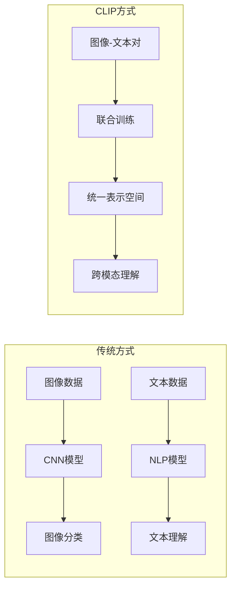
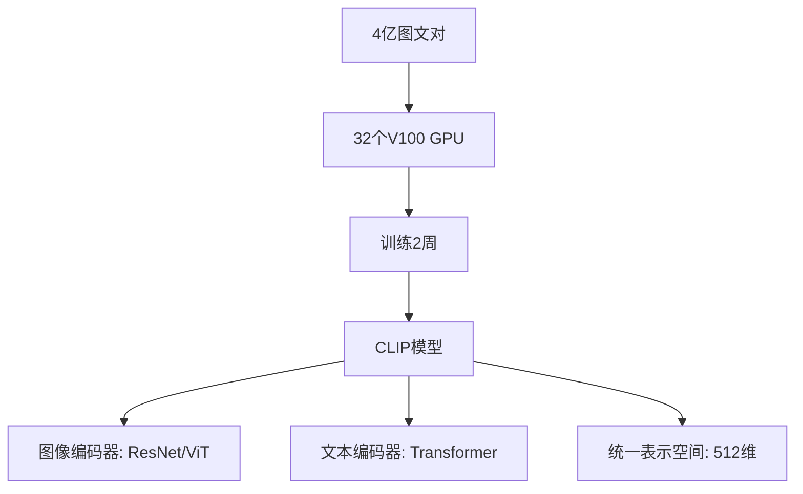
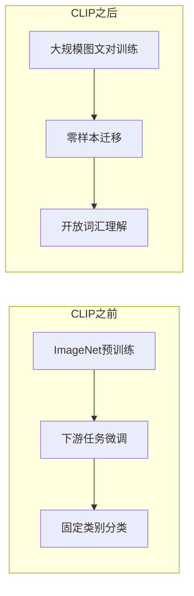

# 2.5.1 CLIP：视觉-语言理解的突破

## 学习目标

通过本节学习，你将能够：

1. **理解CLIP的核心创新**：掌握对比学习在多模态领域的应用
2. **掌握视觉-语言联合训练**：理解如何让AI同时理解图像和文本
3. **认识零样本学习能力**：了解CLIP如何实现无需训练的图像分类
4. **体验多模态应用**：使用Trae实现基于CLIP的实际应用

## CLIP的历史背景

### 多模态AI的挑战

在CLIP出现之前，计算机视觉和自然语言处理基本上是两个独立的领域：



**传统方法的局限性**：
- **数据孤岛**：图像和文本分别训练，无法建立联系
- **标注依赖**：需要大量人工标注的分类数据
- **泛化能力差**：只能识别训练时见过的类别
- **语义理解浅**：无法理解图像的丰富语义内容

### OpenAI的创新思路

2021年，OpenAI提出了一个革命性的想法：**能否让AI像人类一样，通过阅读图像的文字描述来理解图像？**

**人类的学习方式**：
```
看到一张图片 → 阅读描述文字 → 建立图文联系 → 理解图像内容
```

**CLIP的学习方式**：
```
大量图文对 → 对比学习训练 → 统一表示空间 → 零样本理解
```

## CLIP的核心原理

### 对比学习框架

CLIP的核心思想是**对比学习**（Contrastive Learning）：

```python
# CLIP的核心思想（简化版）
class CLIPCore:
    def __init__(self):
        self.image_encoder = ImageEncoder()  # 图像编码器
        self.text_encoder = TextEncoder()    # 文本编码器
    
    def contrastive_loss(self, images, texts):
        # 1. 编码图像和文本
        image_features = self.image_encoder(images)
        text_features = self.text_encoder(texts)
        
        # 2. 计算相似度矩阵
        similarity_matrix = torch.matmul(image_features, text_features.T)
        
        # 3. 对比学习：匹配的图文对相似度高，不匹配的相似度低
        labels = torch.arange(len(images))  # 对角线为正样本
        
        # 4. 双向损失：图像→文本 和 文本→图像
        loss_i2t = cross_entropy(similarity_matrix, labels)
        loss_t2i = cross_entropy(similarity_matrix.T, labels)
        
        return (loss_i2t + loss_t2i) / 2
```

### 训练数据和规模

**数据来源**：
- **WIT数据集**：从互联网收集的4亿个图像-文本对
- **数据多样性**：涵盖各种主题、风格、语言
- **自然描述**：真实的网页文本，而非人工标注

**训练规模**：


### 架构设计

**双编码器架构**：

```python
class CLIP(nn.Module):
    def __init__(self, 
                 image_encoder_type='ResNet50',
                 text_encoder_type='Transformer',
                 embed_dim=512):
        super().__init__()
        
        # 图像编码器选择
        if image_encoder_type == 'ResNet50':
            self.image_encoder = ResNet50(output_dim=embed_dim)
        elif image_encoder_type == 'ViT-B/32':
            self.image_encoder = VisionTransformer(
                patch_size=32, embed_dim=embed_dim
            )
        
        # 文本编码器
        self.text_encoder = TextTransformer(
            vocab_size=49408,
            context_length=77,
            embed_dim=embed_dim
        )
        
        # 温度参数（可学习）
        self.logit_scale = nn.Parameter(torch.ones([]) * np.log(1/0.07))
    
    def encode_image(self, image):
        return self.image_encoder(image)
    
    def encode_text(self, text):
        return self.text_encoder(text)
    
    def forward(self, image, text):
        # 获取特征
        image_features = self.encode_image(image)
        text_features = self.encode_text(text)
        
        # L2归一化
        image_features = F.normalize(image_features, dim=-1)
        text_features = F.normalize(text_features, dim=-1)
        
        # 计算相似度
        logit_scale = self.logit_scale.exp()
        logits_per_image = logit_scale * image_features @ text_features.t()
        logits_per_text = logits_per_image.t()
        
        return logits_per_image, logits_per_text
```

## CLIP的突破性能力

### 零样本图像分类

**传统方法 vs CLIP**：

```python
# 传统图像分类
class TraditionalClassifier:
    def __init__(self, num_classes=1000):
        self.model = ResNet50(num_classes=num_classes)
        # 只能分类训练时见过的1000个类别
    
    def predict(self, image):
        return self.model(image)  # 输出1000个类别的概率

# CLIP零样本分类
class CLIPClassifier:
    def __init__(self):
        self.clip_model = load_clip_model()
    
    def predict(self, image, class_names):
        # 可以分类任意给定的类别！
        text_prompts = [f"a photo of a {name}" for name in class_names]
        
        with torch.no_grad():
            image_features = self.clip_model.encode_image(image)
            text_features = self.clip_model.encode_text(text_prompts)
            
            # 计算相似度
            similarity = (image_features @ text_features.T).softmax(dim=-1)
            
        return similarity

# 使用示例
clip_classifier = CLIPClassifier()

# 可以识别任意类别，无需重新训练！
result1 = clip_classifier.predict(image, ["cat", "dog", "bird"])
result2 = clip_classifier.predict(image, ["苹果", "香蕉", "橙子"])  # 支持中文
result3 = clip_classifier.predict(image, ["happy person", "sad person"])  # 情感识别
```

### 跨模态检索

**图像搜索文本**：
```python
def image_to_text_search(query_image, text_database):
    """根据图像搜索相关文本"""
    image_features = clip_model.encode_image(query_image)
    text_features = clip_model.encode_text(text_database)
    
    # 计算相似度
    similarities = image_features @ text_features.T
    
    # 返回最相似的文本
    top_indices = similarities.argsort(descending=True)
    return [text_database[i] for i in top_indices[:5]]

# 使用示例
query_image = load_image("sunset_beach.jpg")
text_db = [
    "Beautiful sunset over the ocean",
    "People playing volleyball on beach", 
    "City skyline at night",
    "Mountain landscape in winter",
    "Tropical beach with palm trees"
]

results = image_to_text_search(query_image, text_db)
print("Most relevant texts:", results)
# 输出: ["Beautiful sunset over the ocean", "Tropical beach with palm trees", ...]
```

**文本搜索图像**：
```python
def text_to_image_search(query_text, image_database):
    """根据文本搜索相关图像"""
    text_features = clip_model.encode_text([query_text])
    image_features = clip_model.encode_image(image_database)
    
    similarities = text_features @ image_features.T
    top_indices = similarities.argsort(descending=True)
    
    return [image_database[i] for i in top_indices[:5]]

# 使用示例
query = "a cute cat sleeping"
image_results = text_to_image_search(query, image_database)
```

### 细粒度理解能力

CLIP不仅能识别物体，还能理解：

```python
# 细粒度属性理解
attribute_prompts = [
    "a red car",
    "a blue car", 
    "a fast car",
    "an old car",
    "a luxury car"
]

# 动作和状态理解
action_prompts = [
    "a person running",
    "a person sitting",
    "a person smiling",
    "a person reading"
]

# 场景和上下文理解
scene_prompts = [
    "indoor scene",
    "outdoor scene",
    "daytime photo",
    "nighttime photo",
    "crowded place",
    "quiet place"
]

# 风格和艺术理解
style_prompts = [
    "a photograph",
    "a painting", 
    "a cartoon",
    "a sketch",
    "black and white image",
    "colorful image"
]
```

## CLIP的技术影响

### 对计算机视觉的影响

**范式转变**：


**具体改变**：
1. **数据需求**：从精确标注转向自然描述
2. **模型能力**：从封闭集合转向开放词汇
3. **应用方式**：从微调转向提示工程
4. **评估方法**：从准确率转向语义理解

### 对多模态AI的推动

**后续发展**：
- **DALL-E 2**：基于CLIP的文本到图像生成
- **Flamingo**：少样本多模态学习
- **BLIP**：统一的视觉-语言理解和生成
- **GPT-4V**：大语言模型的视觉能力

```python
# CLIP启发的后续模型架构
class MultimodalModel:
    def __init__(self):
        # CLIP风格的编码器
        self.image_encoder = CLIPImageEncoder()
        self.text_encoder = CLIPTextEncoder()
        
        # 扩展能力
        self.image_generator = DiffusionModel()  # 图像生成
        self.text_generator = GPTModel()         # 文本生成
        self.cross_attention = CrossAttention()  # 跨模态注意力
    
    def understand_and_generate(self, image, text_prompt):
        # 理解输入
        image_features = self.image_encoder(image)
        text_features = self.text_encoder(text_prompt)
        
        # 跨模态融合
        fused_features = self.cross_attention(image_features, text_features)
        
        # 生成输出
        generated_text = self.text_generator(fused_features)
        generated_image = self.image_generator(fused_features)
        
        return generated_text, generated_image
```

## Trae实践：构建CLIP应用

### 环境准备

```python
# 在Trae中安装必要的库
!pip install torch torchvision
!pip install transformers
!pip install clip-by-openai
!pip install gradio
!pip install pillow

# 导入必要的库
import torch
import clip
from PIL import Image
import gradio as gr
import numpy as np
from typing import List, Tuple
```

### 基础CLIP使用

```python
class CLIPDemo:
    def __init__(self):
        # 加载预训练的CLIP模型
        self.device = "cuda" if torch.cuda.is_available() else "cpu"
        self.model, self.preprocess = clip.load("ViT-B/32", device=self.device)
        
        print(f"CLIP模型已加载到 {self.device}")
        print(f"支持的图像尺寸: {self.preprocess.transforms[0].size}")
    
    def classify_image(self, image_path: str, categories: List[str]) -> dict:
        """零样本图像分类"""
        # 加载和预处理图像
        image = Image.open(image_path)
        image_input = self.preprocess(image).unsqueeze(0).to(self.device)
        
        # 准备文本提示
        text_prompts = [f"a photo of a {category}" for category in categories]
        text_inputs = clip.tokenize(text_prompts).to(self.device)
        
        # 计算特征
        with torch.no_grad():
            image_features = self.model.encode_image(image_input)
            text_features = self.model.encode_text(text_inputs)
            
            # 计算相似度
            logits_per_image, logits_per_text = self.model(image_input, text_inputs)
            probs = logits_per_image.softmax(dim=-1).cpu().numpy()[0]
        
        # 返回结果
        results = {}
        for i, category in enumerate(categories):
            results[category] = float(probs[i])
        
        return results
    
    def find_best_match(self, image_path: str, text_descriptions: List[str]) -> Tuple[str, float]:
        """找到最匹配的文本描述"""
        image = Image.open(image_path)
        image_input = self.preprocess(image).unsqueeze(0).to(self.device)
        text_inputs = clip.tokenize(text_descriptions).to(self.device)
        
        with torch.no_grad():
            logits_per_image, _ = self.model(image_input, text_inputs)
            probs = logits_per_image.softmax(dim=-1).cpu().numpy()[0]
        
        best_idx = np.argmax(probs)
        return text_descriptions[best_idx], float(probs[best_idx])

# 使用示例
clip_demo = CLIPDemo()

# 测试图像分类
image_path = "test_image.jpg"
categories = ["cat", "dog", "bird", "car", "tree"]
results = clip_demo.classify_image(image_path, categories)

print("分类结果:")
for category, prob in sorted(results.items(), key=lambda x: x[1], reverse=True):
    print(f"{category}: {prob:.3f}")
```

### 构建交互式应用

```python
class CLIPWebApp:
    def __init__(self):
        self.clip_demo = CLIPDemo()
    
    def image_classification_interface(self, image, categories_text):
        """Gradio界面：图像分类"""
        if image is None:
            return "请上传图像"
        
        # 解析类别
        categories = [cat.strip() for cat in categories_text.split(',') if cat.strip()]
        if not categories:
            return "请输入分类类别（用逗号分隔）"
        
        try:
            # 保存临时图像
            temp_path = "temp_image.jpg"
            image.save(temp_path)
            
            # 进行分类
            results = self.clip_demo.classify_image(temp_path, categories)
            
            # 格式化结果
            output = "分类结果:\n\n"
            for category, prob in sorted(results.items(), key=lambda x: x[1], reverse=True):
                bar = "█" * int(prob * 20)  # 简单的进度条
                output += f"{category}: {prob:.3f} {bar}\n"
            
            return output
            
        except Exception as e:
            return f"处理错误: {str(e)}"
    
    def image_description_interface(self, image, descriptions_text):
        """Gradio界面：图像描述匹配"""
        if image is None:
            return "请上传图像"
        
        descriptions = [desc.strip() for desc in descriptions_text.split('\n') if desc.strip()]
        if not descriptions:
            return "请输入描述文本（每行一个）"
        
        try:
            temp_path = "temp_image.jpg"
            image.save(temp_path)
            
            best_match, confidence = self.clip_demo.find_best_match(temp_path, descriptions)
            
            output = f"最佳匹配:\n\n"
            output += f"描述: {best_match}\n"
            output += f"置信度: {confidence:.3f}\n\n"
            output += "所有结果:\n"
            
            # 显示所有结果
            image_input = self.clip_demo.preprocess(image).unsqueeze(0).to(self.clip_demo.device)
            text_inputs = clip.tokenize(descriptions).to(self.clip_demo.device)
            
            with torch.no_grad():
                logits_per_image, _ = self.clip_demo.model(image_input, text_inputs)
                probs = logits_per_image.softmax(dim=-1).cpu().numpy()[0]
            
            for i, (desc, prob) in enumerate(zip(descriptions, probs)):
                output += f"{i+1}. {desc}: {prob:.3f}\n"
            
            return output
            
        except Exception as e:
            return f"处理错误: {str(e)}"
    
    def launch_app(self):
        """启动Gradio应用"""
        # 图像分类界面
        classification_interface = gr.Interface(
            fn=self.image_classification_interface,
            inputs=[
                gr.Image(type="pil", label="上传图像"),
                gr.Textbox(
                    label="分类类别", 
                    placeholder="输入类别，用逗号分隔，例如：猫,狗,鸟,汽车",
                    value="cat,dog,bird,car,tree"
                )
            ],
            outputs=gr.Textbox(label="分类结果"),
            title="CLIP 零样本图像分类",
            description="上传图像并输入想要分类的类别，CLIP会告诉你图像最可能属于哪个类别"
        )
        
        # 图像描述匹配界面
        description_interface = gr.Interface(
            fn=self.image_description_interface,
            inputs=[
                gr.Image(type="pil", label="上传图像"),
                gr.Textbox(
                    label="描述文本", 
                    lines=5,
                    placeholder="每行输入一个描述，例如:\n一只可爱的小猫\n一条忠诚的狗\n美丽的风景",
                    value="a cute cat\na loyal dog\na beautiful landscape\na busy city street\na peaceful nature scene"
                )
            ],
            outputs=gr.Textbox(label="匹配结果"),
            title="CLIP 图像-文本匹配",
            description="上传图像并输入多个描述，CLIP会找出最匹配的描述"
        )
        
        # 组合界面
        app = gr.TabbedInterface(
            [classification_interface, description_interface],
            ["图像分类", "文本匹配"]
        )
        
        return app

# 启动应用
if __name__ == "__main__":
    app = CLIPWebApp()
    interface = app.launch_app()
    interface.launch(share=True)  # share=True 可以生成公开链接
```

### 高级应用：图像搜索引擎

```python
class CLIPImageSearchEngine:
    def __init__(self):
        self.clip_demo = CLIPDemo()
        self.image_database = []
        self.image_features = None
    
    def build_image_database(self, image_folder: str):
        """构建图像数据库"""
        import os
        from pathlib import Path
        
        print("正在构建图像数据库...")
        
        # 支持的图像格式
        supported_formats = {'.jpg', '.jpeg', '.png', '.bmp', '.tiff'}
        
        # 收集图像文件
        image_paths = []
        for ext in supported_formats:
            image_paths.extend(Path(image_folder).glob(f"*{ext}"))
            image_paths.extend(Path(image_folder).glob(f"*{ext.upper()}"))
        
        print(f"找到 {len(image_paths)} 张图像")
        
        # 编码所有图像
        features_list = []
        valid_paths = []
        
        for i, img_path in enumerate(image_paths):
            try:
                image = Image.open(img_path)
                image_input = self.clip_demo.preprocess(image).unsqueeze(0).to(self.clip_demo.device)
                
                with torch.no_grad():
                    features = self.clip_demo.model.encode_image(image_input)
                    features = features / features.norm(dim=-1, keepdim=True)  # 归一化
                
                features_list.append(features.cpu())
                valid_paths.append(str(img_path))
                
                if (i + 1) % 10 == 0:
                    print(f"已处理 {i + 1}/{len(image_paths)} 张图像")
                    
            except Exception as e:
                print(f"处理图像 {img_path} 时出错: {e}")
        
        # 保存结果
        self.image_database = valid_paths
        self.image_features = torch.cat(features_list, dim=0)
        
        print(f"图像数据库构建完成，共 {len(self.image_database)} 张图像")
    
    def search_by_text(self, query_text: str, top_k: int = 5) -> List[Tuple[str, float]]:
        """根据文本搜索图像"""
        if self.image_features is None:
            raise ValueError("请先构建图像数据库")
        
        # 编码查询文本
        text_input = clip.tokenize([query_text]).to(self.clip_demo.device)
        
        with torch.no_grad():
            text_features = self.clip_demo.model.encode_text(text_input)
            text_features = text_features / text_features.norm(dim=-1, keepdim=True)
        
        # 计算相似度
        similarities = (self.image_features @ text_features.T).squeeze()
        
        # 获取top-k结果
        top_indices = similarities.argsort(descending=True)[:top_k]
        
        results = []
        for idx in top_indices:
            image_path = self.image_database[idx]
            similarity = float(similarities[idx])
            results.append((image_path, similarity))
        
        return results
    
    def search_by_image(self, query_image_path: str, top_k: int = 5) -> List[Tuple[str, float]]:
        """根据图像搜索相似图像"""
        if self.image_features is None:
            raise ValueError("请先构建图像数据库")
        
        # 编码查询图像
        image = Image.open(query_image_path)
        image_input = self.clip_demo.preprocess(image).unsqueeze(0).to(self.clip_demo.device)
        
        with torch.no_grad():
            query_features = self.clip_demo.model.encode_image(image_input)
            query_features = query_features / query_features.norm(dim=-1, keepdim=True)
        
        # 计算相似度
        similarities = (self.image_features @ query_features.T).squeeze()
        
        # 获取top-k结果（排除自己）
        top_indices = similarities.argsort(descending=True)
        
        results = []
        for idx in top_indices:
            image_path = self.image_database[idx]
            if image_path != query_image_path:  # 排除查询图像本身
                similarity = float(similarities[idx])
                results.append((image_path, similarity))
                if len(results) >= top_k:
                    break
        
        return results

# 使用示例
search_engine = CLIPImageSearchEngine()

# 构建数据库（假设有一个图像文件夹）
# search_engine.build_image_database("./image_dataset")

# 文本搜索
# results = search_engine.search_by_text("a beautiful sunset", top_k=5)
# print("搜索结果:")
# for image_path, similarity in results:
#     print(f"{image_path}: {similarity:.3f}")
```

## 学习总结

### 核心要点回顾

1. **CLIP的创新**：
   - 对比学习框架统一图像和文本理解
   - 大规模网络数据训练，无需人工标注
   - 零样本能力，可以理解训练时未见过的概念

2. **技术架构**：
   - 双编码器设计：图像编码器 + 文本编码器
   - 统一表示空间：512维特征向量
   - 对比学习损失：匹配的图文对相似度高

3. **应用能力**：
   - 零样本图像分类
   - 跨模态检索（图搜文、文搜图）
   - 细粒度语义理解
   - 开放词汇识别

4. **技术影响**：
   - 推动了多模态AI的发展
   - 启发了DALL-E、GPT-4V等后续模型
   - 改变了计算机视觉的研究范式

### 实践技能

通过本节的学习和实践，你应该掌握：

- [ ] 理解CLIP的核心原理和训练方法
- [ ] 使用预训练CLIP模型进行零样本分类
- [ ] 实现图像-文本匹配和检索功能
- [ ] 构建基于CLIP的交互式应用
- [ ] 开发图像搜索引擎等实用工具

### 思考题

1. **对比学习的优势**：为什么对比学习比传统的分类训练更适合多模态学习？

2. **数据质量vs数量**：CLIP使用了大量网络数据，这些数据质量参差不齐，为什么仍然有效？

3. **零样本能力的局限**：CLIP的零样本能力有哪些局限性？在什么情况下可能失效？

4. **计算效率**：如何优化CLIP在大规模图像检索中的计算效率？

5. **多语言支持**：CLIP如何处理不同语言的文本？中文效果如何？

### 扩展阅读

- **原始论文**："Learning Transferable Visual Representations from Natural Language Supervision"
- **技术博客**：OpenAI CLIP介绍博客
- **代码实现**：OpenAI官方CLIP代码库
- **应用案例**：基于CLIP的创意应用集合

---

**下一节**：[2.5.2 DALL-E：文本到图像生成的革命](2.5.2_dalle_text_to_image.md)

**本节总结**：CLIP通过对比学习实现了图像和文本的统一理解，开创了多模态AI的新时代。它的零样本能力和开放词汇理解为AI应用带来了革命性的变化，也为后续的多模态大模型奠定了基础。