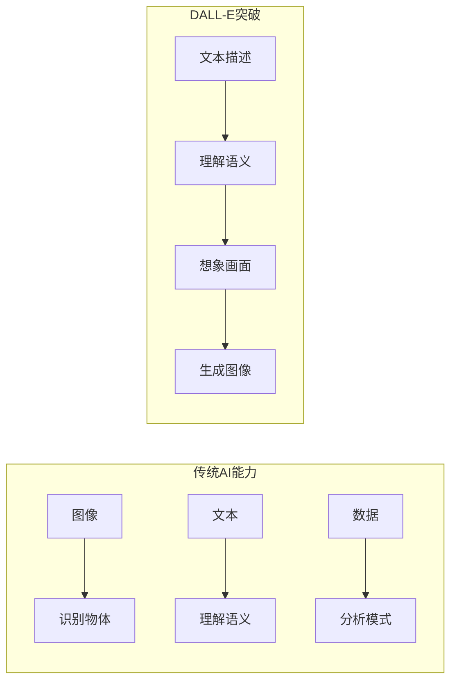
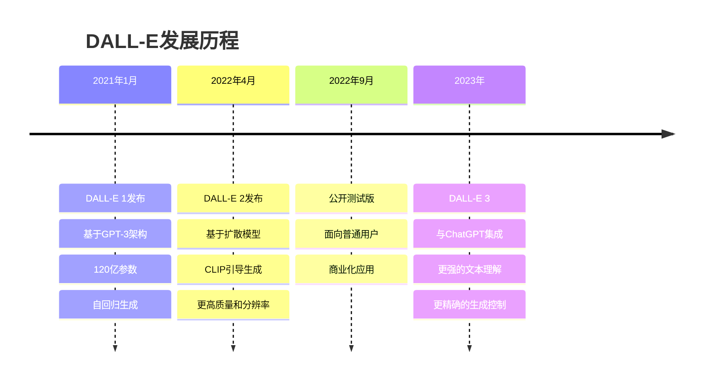
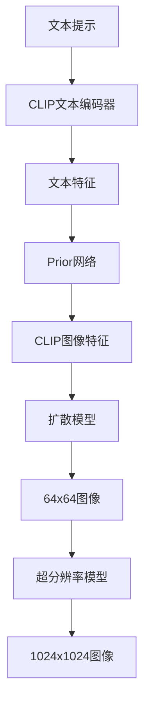

# 2.5.2 DALL-E：文本到图像生成的革命

## 学习目标

通过本节学习，你将能够：

1. **理解DALL-E的核心创新**：掌握文本到图像生成的技术原理
2. **认识创意AI的突破**：了解AI如何理解和创造视觉内容
3. **掌握扩散模型技术**：理解DALL-E 2背后的扩散模型原理
4. **体验AI艺术创作**：使用Trae实现文本到图像生成应用

## DALL-E的历史背景

### 从理解到创造的跨越

在DALL-E出现之前，AI主要专注于**理解**现有内容：



**创造性AI的挑战**：
- **语义理解**：如何从文字描述中理解视觉概念？
- **创意组合**：如何将不同概念创造性地结合？
- **视觉生成**：如何将抽象概念转化为具体图像？
- **风格控制**：如何控制生成图像的艺术风格？

### OpenAI的愿景

**DALL-E的命名**：结合了艺术家达利（Dalí）和机器人瓦力（WALL-E），象征着艺术创造力与AI技术的结合。

**发展历程**：


## DALL-E 1：自回归图像生成

### 核心思想

DALL-E 1将图像生成问题转化为**序列生成问题**：

```python
# DALL-E 1的核心思想
class DALLE1Concept:
    def __init__(self):
        # 将图像转换为token序列
        self.image_tokenizer = VQVAETokenizer()  # 图像→token
        self.text_tokenizer = BPETokenizer()     # 文本→token
        self.transformer = GPTTransformer()      # 序列生成模型
    
    def image_to_tokens(self, image):
        """将256x256图像转换为1024个token"""
        # 使用VQ-VAE将图像编码为离散token
        return self.image_tokenizer.encode(image)  # [1024] tokens
    
    def generate_image(self, text_prompt):
        """根据文本生成图像"""
        # 1. 文本编码
        text_tokens = self.text_tokenizer.encode(text_prompt)
        
        # 2. 组合输入：[文本token] + [图像token占位符]
        input_sequence = text_tokens + [MASK] * 1024
        
        # 3. 自回归生成图像token
        for i in range(1024):
            next_token = self.transformer.predict_next(input_sequence)
            input_sequence[len(text_tokens) + i] = next_token
        
        # 4. 解码为图像
        image_tokens = input_sequence[len(text_tokens):]
        generated_image = self.image_tokenizer.decode(image_tokens)
        
        return generated_image
```

### VQ-VAE图像编码

**Vector Quantized Variational AutoEncoder**：

```python
class VQVAEImageTokenizer:
    def __init__(self, codebook_size=8192, image_size=256):
        self.codebook_size = codebook_size
        self.image_size = image_size
        
        # 编码器：图像 → 特征图
        self.encoder = ConvEncoder(
            input_channels=3,
            hidden_dims=[128, 256, 512],
            output_dim=256
        )
        
        # 码本：连续特征 → 离散token
        self.codebook = nn.Embedding(codebook_size, 256)
        
        # 解码器：特征图 → 图像
        self.decoder = ConvDecoder(
            input_dim=256,
            hidden_dims=[512, 256, 128],
            output_channels=3
        )
    
    def encode(self, image):
        """图像编码为token序列"""
        # 1. 卷积编码 [3, 256, 256] → [256, 32, 32]
        features = self.encoder(image)
        
        # 2. 量化到码本 [256, 32, 32] → [32, 32] token indices
        flat_features = features.view(-1, 256)  # [1024, 256]
        
        # 找到最近的码本向量
        distances = torch.cdist(flat_features, self.codebook.weight)
        token_indices = distances.argmin(dim=-1)  # [1024]
        
        return token_indices.view(32, 32)  # [32, 32] token grid
    
    def decode(self, token_indices):
        """token序列解码为图像"""
        # 1. 查找码本向量
        quantized = self.codebook(token_indices)  # [32, 32, 256]
        
        # 2. 重塑为特征图
        features = quantized.permute(2, 0, 1).unsqueeze(0)  # [1, 256, 32, 32]
        
        # 3. 卷积解码
        reconstructed = self.decoder(features)  # [1, 3, 256, 256]
        
        return reconstructed
```

### GPT架构适配

```python
class DALLE1Transformer:
    def __init__(self, 
                 vocab_size_text=50000,
                 vocab_size_image=8192,
                 n_layers=64,
                 n_heads=16,
                 d_model=1024):
        
        # 文本和图像使用不同的嵌入
        self.text_embedding = nn.Embedding(vocab_size_text, d_model)
        self.image_embedding = nn.Embedding(vocab_size_image, d_model)
        
        # 位置编码
        self.text_pos_embedding = nn.Embedding(256, d_model)  # 最大文本长度
        self.image_pos_embedding = nn.Embedding(1024, d_model)  # 32x32图像token
        
        # Transformer层
        self.layers = nn.ModuleList([
            TransformerBlock(d_model, n_heads) for _ in range(n_layers)
        ])
        
        # 输出头
        self.text_head = nn.Linear(d_model, vocab_size_text)
        self.image_head = nn.Linear(d_model, vocab_size_image)
    
    def forward(self, text_tokens, image_tokens=None, mode='generate'):
        batch_size = text_tokens.size(0)
        text_len = text_tokens.size(1)
        
        # 文本嵌入
        text_emb = self.text_embedding(text_tokens)
        text_pos = torch.arange(text_len, device=text_tokens.device)
        text_emb += self.text_pos_embedding(text_pos)
        
        if mode == 'generate' and image_tokens is not None:
            # 图像嵌入
            image_len = image_tokens.size(1)
            image_emb = self.image_embedding(image_tokens)
            image_pos = torch.arange(image_len, device=image_tokens.device)
            image_emb += self.image_pos_embedding(image_pos)
            
            # 拼接序列
            sequence = torch.cat([text_emb, image_emb], dim=1)
        else:
            sequence = text_emb
        
        # Transformer处理
        for layer in self.layers:
            sequence = layer(sequence)
        
        # 分离文本和图像部分
        if mode == 'generate':
            image_output = sequence[:, text_len:]
            return self.image_head(image_output)
        else:
            return self.text_head(sequence)
```

## DALL-E 2：扩散模型革命

### 架构创新

DALL-E 2采用了完全不同的技术路线：



**关键组件**：
1. **CLIP编码器**：理解文本语义
2. **Prior网络**：从文本特征生成图像特征
3. **扩散模型**：从特征生成图像
4. **超分辨率**：提升图像分辨率

### 扩散模型原理

**前向扩散过程**（加噪）：
```python
class DiffusionForward:
    def __init__(self, num_timesteps=1000):
        self.num_timesteps = num_timesteps
        
        # 噪声调度
        self.betas = self.cosine_beta_schedule(num_timesteps)
        self.alphas = 1.0 - self.betas
        self.alphas_cumprod = torch.cumprod(self.alphas, dim=0)
    
    def cosine_beta_schedule(self, timesteps, s=0.008):
        """余弦噪声调度"""
        steps = timesteps + 1
        x = torch.linspace(0, timesteps, steps)
        alphas_cumprod = torch.cos(((x / timesteps) + s) / (1 + s) * torch.pi * 0.5) ** 2
        alphas_cumprod = alphas_cumprod / alphas_cumprod[0]
        betas = 1 - (alphas_cumprod[1:] / alphas_cumprod[:-1])
        return torch.clip(betas, 0.0001, 0.9999)
    
    def add_noise(self, x0, t, noise=None):
        """在时间步t添加噪声"""
        if noise is None:
            noise = torch.randn_like(x0)
        
        sqrt_alphas_cumprod_t = torch.sqrt(self.alphas_cumprod[t])
        sqrt_one_minus_alphas_cumprod_t = torch.sqrt(1.0 - self.alphas_cumprod[t])
        
        # x_t = sqrt(α̅_t) * x_0 + sqrt(1 - α̅_t) * ε
        return sqrt_alphas_cumprod_t * x0 + sqrt_one_minus_alphas_cumprod_t * noise
```

**反向去噪过程**（生成）：
```python
class DiffusionReverse:
    def __init__(self, model, forward_process):
        self.model = model  # U-Net去噪模型
        self.forward = forward_process
    
    def predict_noise(self, x_t, t, text_embedding):
        """预测时间步t的噪声"""
        return self.model(x_t, t, text_embedding)
    
    def denoise_step(self, x_t, t, text_embedding):
        """单步去噪"""
        # 预测噪声
        predicted_noise = self.predict_noise(x_t, t, text_embedding)
        
        # 计算去噪参数
        alpha_t = self.forward.alphas[t]
        alpha_cumprod_t = self.forward.alphas_cumprod[t]
        beta_t = self.forward.betas[t]
        
        # 预测x_0
        sqrt_recip_alphas_cumprod_t = torch.sqrt(1.0 / alpha_cumprod_t)
        sqrt_recipm1_alphas_cumprod_t = torch.sqrt(1.0 / alpha_cumprod_t - 1)
        
        pred_x0 = sqrt_recip_alphas_cumprod_t * x_t - sqrt_recipm1_alphas_cumprod_t * predicted_noise
        
        # 计算x_{t-1}
        if t > 0:
            alpha_cumprod_prev = self.forward.alphas_cumprod[t-1]
            posterior_variance = beta_t * (1.0 - alpha_cumprod_prev) / (1.0 - alpha_cumprod_t)
            
            # 添加随机性
            noise = torch.randn_like(x_t) if t > 0 else torch.zeros_like(x_t)
            
            x_prev = (1.0 / torch.sqrt(alpha_t)) * (x_t - (beta_t / torch.sqrt(1.0 - alpha_cumprod_t)) * predicted_noise)
            x_prev += torch.sqrt(posterior_variance) * noise
        else:
            x_prev = pred_x0
        
        return x_prev
    
    def generate(self, text_embedding, image_shape, num_steps=50):
        """完整生成过程"""
        # 从纯噪声开始
        x = torch.randn(image_shape)
        
        # 选择采样时间步
        timesteps = torch.linspace(self.forward.num_timesteps-1, 0, num_steps, dtype=torch.long)
        
        # 逐步去噪
        for t in timesteps:
            x = self.denoise_step(x, t, text_embedding)
        
        return x
```

### U-Net去噪网络

```python
class UNetDenoisingModel(nn.Module):
    def __init__(self, 
                 in_channels=3,
                 model_channels=128,
                 out_channels=3,
                 num_res_blocks=2,
                 attention_resolutions=[16, 8],
                 channel_mult=[1, 2, 4, 8],
                 text_embed_dim=512):
        super().__init__()
        
        # 时间嵌入
        self.time_embed = nn.Sequential(
            nn.Linear(model_channels, 4 * model_channels),
            nn.SiLU(),
            nn.Linear(4 * model_channels, 4 * model_channels)
        )
        
        # 文本条件嵌入
        self.text_proj = nn.Linear(text_embed_dim, 4 * model_channels)
        
        # 下采样路径
        self.input_conv = nn.Conv2d(in_channels, model_channels, 3, padding=1)
        
        self.down_blocks = nn.ModuleList()
        ch = model_channels
        input_ch = [ch]
        
        for level, mult in enumerate(channel_mult):
            for _ in range(num_res_blocks):
                layers = [
                    ResBlock(ch, mult * model_channels, 4 * model_channels),
                ]
                
                # 添加注意力层
                if 2**level in attention_resolutions:
                    layers.append(AttentionBlock(mult * model_channels))
                
                self.down_blocks.append(nn.Sequential(*layers))
                ch = mult * model_channels
                input_ch.append(ch)
            
            # 下采样（除了最后一层）
            if level < len(channel_mult) - 1:
                self.down_blocks.append(Downsample(ch))
                input_ch.append(ch)
        
        # 中间块
        self.middle_block = nn.Sequential(
            ResBlock(ch, ch, 4 * model_channels),
            AttentionBlock(ch),
            ResBlock(ch, ch, 4 * model_channels)
        )
        
        # 上采样路径
        self.up_blocks = nn.ModuleList()
        
        for level, mult in list(enumerate(channel_mult))[::-1]:
            for i in range(num_res_blocks + 1):
                layers = [
                    ResBlock(ch + input_ch.pop(), mult * model_channels, 4 * model_channels)
                ]
                
                if 2**level in attention_resolutions:
                    layers.append(AttentionBlock(mult * model_channels))
                
                self.up_blocks.append(nn.Sequential(*layers))
                ch = mult * model_channels
            
            # 上采样（除了最后一层）
            if level > 0:
                self.up_blocks.append(Upsample(ch))
        
        # 输出层
        self.output_conv = nn.Sequential(
            nn.GroupNorm(32, ch),
            nn.SiLU(),
            nn.Conv2d(ch, out_channels, 3, padding=1)
        )
    
    def forward(self, x, timesteps, text_embedding):
        # 时间嵌入
        t_emb = self.time_embed(timestep_embedding(timesteps, self.model_channels))
        
        # 文本条件
        if text_embedding is not None:
            t_emb += self.text_proj(text_embedding)
        
        # 下采样
        h = self.input_conv(x)
        hs = [h]
        
        for block in self.down_blocks:
            if isinstance(block, Downsample):
                h = block(h)
            else:
                h = block(h, t_emb)
            hs.append(h)
        
        # 中间处理
        h = self.middle_block(h, t_emb)
        
        # 上采样
        for block in self.up_blocks:
            if isinstance(block, Upsample):
                h = block(h)
            else:
                h = torch.cat([h, hs.pop()], dim=1)
                h = block(h, t_emb)
        
        # 输出
        return self.output_conv(h)
```

## DALL-E 3：精确控制与理解

### 主要改进

**更强的文本理解**：
```python
class DALLE3TextProcessor:
    def __init__(self):
        # 使用更强的语言模型理解复杂描述
        self.text_encoder = GPT4TextEncoder()
        self.prompt_enhancer = PromptEnhancer()
    
    def process_prompt(self, user_prompt):
        """处理和增强用户提示"""
        # 1. 理解用户意图
        intent = self.analyze_intent(user_prompt)
        
        # 2. 补充细节描述
        enhanced_prompt = self.prompt_enhancer.enhance(
            user_prompt, 
            style_hints=intent.get('style'),
            composition_hints=intent.get('composition')
        )
        
        # 3. 生成多层次描述
        descriptions = {
            'main_subject': self.extract_main_subject(enhanced_prompt),
            'style': self.extract_style(enhanced_prompt),
            'composition': self.extract_composition(enhanced_prompt),
            'details': self.extract_details(enhanced_prompt)
        }
        
        return descriptions
    
    def analyze_intent(self, prompt):
        """分析用户意图"""
        # 识别艺术风格
        style_keywords = {
            'photorealistic': ['photo', 'realistic', 'photograph'],
            'artistic': ['painting', 'art', 'artistic', 'canvas'],
            'cartoon': ['cartoon', 'animated', 'comic'],
            'abstract': ['abstract', 'surreal', 'conceptual']
        }
        
        # 识别构图要求
        composition_keywords = {
            'portrait': ['portrait', 'headshot', 'face'],
            'landscape': ['landscape', 'scenery', 'view'],
            'close_up': ['close-up', 'macro', 'detailed'],
            'wide_shot': ['wide', 'panoramic', 'full view']
        }
        
        intent = {'style': [], 'composition': []}
        
        for style, keywords in style_keywords.items():
            if any(kw in prompt.lower() for kw in keywords):
                intent['style'].append(style)
        
        for comp, keywords in composition_keywords.items():
            if any(kw in prompt.lower() for kw in keywords):
                intent['composition'].append(comp)
        
        return intent
```

**精确的生成控制**：
```python
class DALLE3Generator:
    def __init__(self):
        self.base_model = DiffusionModel()
        self.controlnet = ControlNet()  # 精确控制
        self.inpainting_model = InpaintingModel()  # 局部编辑
    
    def generate_with_control(self, 
                            text_prompt, 
                            control_image=None,
                            mask=None,
                            style_strength=1.0,
                            composition_strength=1.0):
        """带控制的图像生成"""
        
        # 1. 文本编码
        text_features = self.encode_text(text_prompt)
        
        # 2. 控制条件
        control_features = None
        if control_image is not None:
            control_features = self.controlnet.encode(control_image)
        
        # 3. 生成参数
        generation_params = {
            'text_guidance': text_features,
            'control_guidance': control_features,
            'style_strength': style_strength,
            'composition_strength': composition_strength
        }
        
        # 4. 条件生成
        if mask is not None:
            # 局部编辑模式
            return self.inpainting_model.generate(
                base_image=control_image,
                mask=mask,
                **generation_params
            )
        else:
            # 完整生成模式
            return self.base_model.generate(**generation_params)
    
    def iterative_refinement(self, initial_image, refinement_prompts):
        """迭代优化"""
        current_image = initial_image
        
        for prompt in refinement_prompts:
            # 生成优化mask
            attention_map = self.get_attention_map(current_image, prompt)
            mask = self.generate_refinement_mask(attention_map)
            
            # 局部优化
            current_image = self.generate_with_control(
                text_prompt=prompt,
                control_image=current_image,
                mask=mask,
                style_strength=0.7  # 保持整体风格
            )
        
        return current_image
```

## Trae实践：构建DALL-E风格应用

### 环境准备

```python
# 安装必要的库
!pip install torch torchvision
!pip install diffusers transformers
!pip install accelerate
!pip install gradio
!pip install pillow numpy matplotlib

# 导入库
import torch
from diffusers import StableDiffusionPipeline, DPMSolverMultistepScheduler
from transformers import CLIPTextModel, CLIPTokenizer
from PIL import Image, ImageDraw, ImageFont
import gradio as gr
import numpy as np
import matplotlib.pyplot as plt
from typing import List, Optional, Tuple
import io
import base64
```

### 基础文本到图像生成

```python
class TextToImageGenerator:
    def __init__(self, model_id="runwayml/stable-diffusion-v1-5"):
        self.device = "cuda" if torch.cuda.is_available() else "cpu"
        print(f"使用设备: {self.device}")
        
        # 加载模型
        self.pipe = StableDiffusionPipeline.from_pretrained(
            model_id,
            torch_dtype=torch.float16 if self.device == "cuda" else torch.float32,
            safety_checker=None,  # 关闭安全检查以提高速度
            requires_safety_checker=False
        )
        
        # 优化调度器
        self.pipe.scheduler = DPMSolverMultistepScheduler.from_config(
            self.pipe.scheduler.config
        )
        
        self.pipe = self.pipe.to(self.device)
        
        # 启用内存优化
        if self.device == "cuda":
            self.pipe.enable_memory_efficient_attention()
            self.pipe.enable_xformers_memory_efficient_attention()
    
    def generate_image(self, 
                      prompt: str,
                      negative_prompt: str = "",
                      width: int = 512,
                      height: int = 512,
                      num_inference_steps: int = 20,
                      guidance_scale: float = 7.5,
                      seed: Optional[int] = None) -> Image.Image:
        """生成单张图像"""
        
        # 设置随机种子
        if seed is not None:
            torch.manual_seed(seed)
        
        # 生成图像
        with torch.autocast(self.device):
            result = self.pipe(
                prompt=prompt,
                negative_prompt=negative_prompt,
                width=width,
                height=height,
                num_inference_steps=num_inference_steps,
                guidance_scale=guidance_scale,
                num_images_per_prompt=1
            )
        
        return result.images[0]
    
    def generate_variations(self, 
                          prompt: str,
                          num_variations: int = 4,
                          **kwargs) -> List[Image.Image]:
        """生成多个变体"""
        variations = []
        
        for i in range(num_variations):
            # 每个变体使用不同的随机种子
            seed = kwargs.get('seed', 42) + i if 'seed' in kwargs else None
            kwargs_copy = kwargs.copy()
            kwargs_copy['seed'] = seed
            
            image = self.generate_image(prompt, **kwargs_copy)
            variations.append(image)
        
        return variations
    
    def create_image_grid(self, images: List[Image.Image], cols: int = 2) -> Image.Image:
        """创建图像网格"""
        rows = (len(images) + cols - 1) // cols
        
        # 获取单个图像尺寸
        w, h = images[0].size
        
        # 创建网格图像
        grid = Image.new('RGB', (w * cols, h * rows), color='white')
        
        for i, img in enumerate(images):
            row = i // cols
            col = i % cols
            grid.paste(img, (col * w, row * h))
        
        return grid

# 使用示例
generator = TextToImageGenerator()

# 生成单张图像
image = generator.generate_image(
    prompt="A beautiful sunset over a calm lake, digital art style",
    negative_prompt="blurry, low quality, distorted",
    guidance_scale=7.5,
    num_inference_steps=25
)

# 显示图像
image.show()
```

### 高级提示工程

```python
class PromptEngineer:
    def __init__(self):
        # 风格关键词库
        self.style_keywords = {
            'photorealistic': 'photorealistic, highly detailed, 8k resolution, professional photography',
            'digital_art': 'digital art, concept art, trending on artstation, highly detailed',
            'oil_painting': 'oil painting, classical art style, renaissance, masterpiece',
            'watercolor': 'watercolor painting, soft colors, artistic, traditional media',
            'anime': 'anime style, manga, japanese animation, cel shading',
            'cartoon': 'cartoon style, animated, colorful, stylized',
            'cyberpunk': 'cyberpunk style, neon lights, futuristic, sci-fi, dark atmosphere',
            'fantasy': 'fantasy art, magical, ethereal, mystical, enchanted'
        }
        
        # 质量增强词
        self.quality_boosters = [
            'highly detailed', 'masterpiece', 'best quality', 
            'ultra high resolution', '8k', 'professional',
            'award winning', 'stunning', 'breathtaking'
        ]
        
        # 负面提示词
        self.negative_keywords = [
            'blurry', 'low quality', 'distorted', 'ugly', 
            'bad anatomy', 'extra limbs', 'deformed',
            'watermark', 'signature', 'text', 'cropped'
        ]
    
    def enhance_prompt(self, 
                      base_prompt: str,
                      style: str = 'digital_art',
                      add_quality: bool = True,
                      custom_modifiers: List[str] = None) -> str:
        """增强提示词"""
        
        enhanced_parts = [base_prompt]
        
        # 添加风格
        if style in self.style_keywords:
            enhanced_parts.append(self.style_keywords[style])
        
        # 添加质量增强
        if add_quality:
            quality_words = np.random.choice(self.quality_boosters, 2, replace=False)
            enhanced_parts.extend(quality_words)
        
        # 添加自定义修饰符
        if custom_modifiers:
            enhanced_parts.extend(custom_modifiers)
        
        return ', '.join(enhanced_parts)
    
    def generate_negative_prompt(self, 
                               custom_negative: List[str] = None) -> str:
        """生成负面提示词"""
        negative_parts = self.negative_keywords.copy()
        
        if custom_negative:
            negative_parts.extend(custom_negative)
        
        return ', '.join(negative_parts)
    
    def create_style_variations(self, base_prompt: str) -> dict:
        """创建不同风格的提示词变体"""
        variations = {}
        
        for style_name in self.style_keywords.keys():
            variations[style_name] = self.enhance_prompt(
                base_prompt, 
                style=style_name
            )
        
        return variations
    
    def analyze_prompt(self, prompt: str) -> dict:
        """分析提示词"""
        words = prompt.lower().split()
        
        analysis = {
            'word_count': len(words),
            'has_style_keywords': False,
            'has_quality_keywords': False,
            'detected_styles': [],
            'detected_objects': [],
            'suggestions': []
        }
        
        # 检测风格关键词
        for style, keywords in self.style_keywords.items():
            if any(kw in prompt.lower() for kw in keywords.split(', ')):
                analysis['detected_styles'].append(style)
                analysis['has_style_keywords'] = True
        
        # 检测质量关键词
        if any(kw in prompt.lower() for kw in self.quality_boosters):
            analysis['has_quality_keywords'] = True
        
        # 生成建议
        if not analysis['has_style_keywords']:
            analysis['suggestions'].append("考虑添加艺术风格关键词")
        
        if not analysis['has_quality_keywords']:
            analysis['suggestions'].append("考虑添加质量增强词")
        
        if analysis['word_count'] < 5:
            analysis['suggestions'].append("提示词可能过于简单，考虑添加更多细节")
        
        return analysis

# 使用示例
prompter = PromptEngineer()

# 增强提示词
base_prompt = "a cat sitting on a windowsill"
enhanced = prompter.enhance_prompt(
    base_prompt, 
    style='photorealistic',
    custom_modifiers=['golden hour lighting', 'cozy atmosphere']
)
print(f"增强后: {enhanced}")

# 生成负面提示词
negative = prompter.generate_negative_prompt(['cartoon', 'anime'])
print(f"负面提示: {negative}")

# 创建风格变体
variations = prompter.create_style_variations(base_prompt)
for style, prompt in variations.items():
    print(f"{style}: {prompt}")
```

### 交互式Web应用

```python
class DALLEWebApp:
    def __init__(self):
        self.generator = TextToImageGenerator()
        self.prompter = PromptEngineer()
    
    def generate_interface(self, 
                         prompt, 
                         style, 
                         negative_prompt,
                         width, 
                         height, 
                         steps, 
                         guidance, 
                         seed,
                         num_images):
        """Gradio生成界面"""
        try:
            # 增强提示词
            if style != "custom":
                enhanced_prompt = self.prompter.enhance_prompt(prompt, style=style)
            else:
                enhanced_prompt = prompt
            
            # 处理负面提示词
            if not negative_prompt.strip():
                negative_prompt = self.prompter.generate_negative_prompt()
            
            # 生成图像
            if num_images == 1:
                image = self.generator.generate_image(
                    prompt=enhanced_prompt,
                    negative_prompt=negative_prompt,
                    width=width,
                    height=height,
                    num_inference_steps=steps,
                    guidance_scale=guidance,
                    seed=seed if seed > 0 else None
                )
                return image, f"使用提示词: {enhanced_prompt}"
            else:
                images = self.generator.generate_variations(
                    prompt=enhanced_prompt,
                    num_variations=num_images,
                    negative_prompt=negative_prompt,
                    width=width,
                    height=height,
                    num_inference_steps=steps,
                    guidance_scale=guidance,
                    seed=seed if seed > 0 else None
                )
                grid = self.generator.create_image_grid(images, cols=2)
                return grid, f"生成了{num_images}个变体\n使用提示词: {enhanced_prompt}"
                
        except Exception as e:
            error_img = Image.new('RGB', (512, 512), color='red')
            return error_img, f"生成错误: {str(e)}"
    
    def analyze_prompt_interface(self, prompt):
        """提示词分析界面"""
        analysis = self.prompter.analyze_prompt(prompt)
        
        result = f"""提示词分析结果:
        
词数: {analysis['word_count']}
检测到的风格: {', '.join(analysis['detected_styles']) if analysis['detected_styles'] else '无'}
包含风格关键词: {'是' if analysis['has_style_keywords'] else '否'}
包含质量关键词: {'是' if analysis['has_quality_keywords'] else '否'}

建议:
{chr(10).join(f'• {s}' for s in analysis['suggestions']) if analysis['suggestions'] else '• 提示词看起来不错！'}
        """
        
        return result
    
    def launch_app(self):
        """启动Gradio应用"""
        
        # 主生成界面
        with gr.Blocks(title="DALL-E风格图像生成器") as app:
            gr.Markdown("# 🎨 DALL-E风格图像生成器")
            gr.Markdown("输入文本描述，AI将为您生成对应的图像")
            
            with gr.Tab("图像生成"):
                with gr.Row():
                    with gr.Column(scale=1):
                        prompt_input = gr.Textbox(
                            label="提示词",
                            placeholder="描述您想要生成的图像...",
                            lines=3,
                            value="a beautiful landscape with mountains and a lake"
                        )
                        
                        style_dropdown = gr.Dropdown(
                            choices=list(self.prompter.style_keywords.keys()) + ["custom"],
                            value="digital_art",
                            label="艺术风格"
                        )
                        
                        negative_input = gr.Textbox(
                            label="负面提示词（可选）",
                            placeholder="不想要的元素...",
                            lines=2
                        )
                        
                        with gr.Row():
                            width_slider = gr.Slider(256, 1024, 512, step=64, label="宽度")
                            height_slider = gr.Slider(256, 1024, 512, step=64, label="高度")
                        
                        with gr.Row():
                            steps_slider = gr.Slider(10, 50, 20, step=1, label="推理步数")
                            guidance_slider = gr.Slider(1, 20, 7.5, step=0.5, label="引导强度")
                        
                        with gr.Row():
                            seed_input = gr.Number(label="随机种子（0为随机）", value=0)
                            num_images_slider = gr.Slider(1, 4, 1, step=1, label="生成数量")
                        
                        generate_btn = gr.Button("🎨 生成图像", variant="primary")
                    
                    with gr.Column(scale=1):
                        output_image = gr.Image(label="生成的图像")
                        output_info = gr.Textbox(label="生成信息", lines=3)
                
                # 绑定生成函数
                generate_btn.click(
                    fn=self.generate_interface,
                    inputs=[
                        prompt_input, style_dropdown, negative_input,
                        width_slider, height_slider, steps_slider, 
                        guidance_slider, seed_input, num_images_slider
                    ],
                    outputs=[output_image, output_info]
                )
            
            with gr.Tab("提示词分析"):
                with gr.Row():
                    with gr.Column():
                        analyze_prompt_input = gr.Textbox(
                            label="输入提示词进行分析",
                            lines=3,
                            placeholder="输入您的提示词..."
                        )
                        analyze_btn = gr.Button("📊 分析提示词")
                    
                    with gr.Column():
                        analysis_output = gr.Textbox(
                            label="分析结果",
                            lines=10
                        )
                
                analyze_btn.click(
                    fn=self.analyze_prompt_interface,
                    inputs=[analyze_prompt_input],
                    outputs=[analysis_output]
                )
            
            with gr.Tab("使用说明"):
                gr.Markdown("""
                ## 📖 使用指南
                
                ### 提示词编写技巧
                1. **具体描述**: 详细描述想要的内容、风格、颜色等
                2. **风格关键词**: 使用"digital art"、"photorealistic"等风格词
                3. **质量词汇**: 添加"highly detailed"、"masterpiece"等提升质量
                4. **构图描述**: 指定"close-up"、"wide shot"等构图要求
                
                ### 参数说明
                - **推理步数**: 更多步数通常产生更好质量，但速度更慢
                - **引导强度**: 控制AI对提示词的遵循程度
                - **随机种子**: 相同种子产生相同结果，用于复现
                
                ### 示例提示词
                ```
                a majestic dragon flying over a medieval castle, 
                fantasy art style, highly detailed, dramatic lighting, 
                8k resolution, trending on artstation
                ```
                """)
        
        return app

# 启动应用
if __name__ == "__main__":
    app = DALLEWebApp()
    interface = app.launch_app()
    interface.launch(share=True, server_name="0.0.0.0", server_port=7860)
```

## 学习总结

### 核心要点回顾

1. **DALL-E的演进**：
   - DALL-E 1：自回归生成，GPT架构适配
   - DALL-E 2：扩散模型，CLIP引导生成
   - DALL-E 3：精确控制，更强文本理解

2. **关键技术**：
   - **VQ-VAE**：图像离散化表示
   - **扩散模型**：渐进去噪生成
   - **CLIP引导**：文本-图像语义对齐
   - **U-Net架构**：高效的去噪网络

3. **应用能力**：
   - 文本到图像生成
   - 风格控制和转换
   - 图像编辑和修复
   - 创意内容创作

4. **技术影响**：
   - 推动了生成式AI的普及
   - 开创了AI艺术创作新领域
   - 影响了内容创作行业

### 实践技能

通过本节学习，你应该掌握：

- [ ] 理解DALL-E的技术原理和发展历程
- [ ] 掌握扩散模型的基本概念和实现
- [ ] 使用预训练模型进行文本到图像生成
- [ ] 编写有效的提示词和负面提示词
- [ ] 构建交互式图像生成应用
- [ ] 理解生成式AI的应用潜力和局限性

### 思考题

1. **生成质量vs速度**：如何在生成质量和速度之间找到平衡？

2. **提示词工程**：什么样的提示词能够产生更好的生成效果？

3. **版权和伦理**：AI生成的图像涉及哪些版权和伦理问题？

4. **技术局限**：当前文本到图像生成技术有哪些局限性？

5. **未来发展**：您认为文本到图像生成技术会如何发展？

### 扩展阅读

- **DALL-E论文**："Zero-Shot Text-to-Image Generation"
- **DALL-E 2论文**："Hierarchical Text-Conditional Image Generation with CLIP Latents"
- **扩散模型综述**："Denoising Diffusion Probabilistic Models"
- **Stable Diffusion**：开源扩散模型实现

---

**下一节**：[2.5.3 GPT-4V：多模态理解的新高度](2.5.3_gpt4v_multimodal.md)

**本节总结**：DALL-E系列模型开创了文本到图像生成的新时代，从最初的自回归方法到扩散模型的突破，再到精确控制的实现，展现了AI创造力的巨大潜力。这项技术不仅推动了生成式AI的发展，也为艺术创作、内容生产等领域带来了革命性的变化。