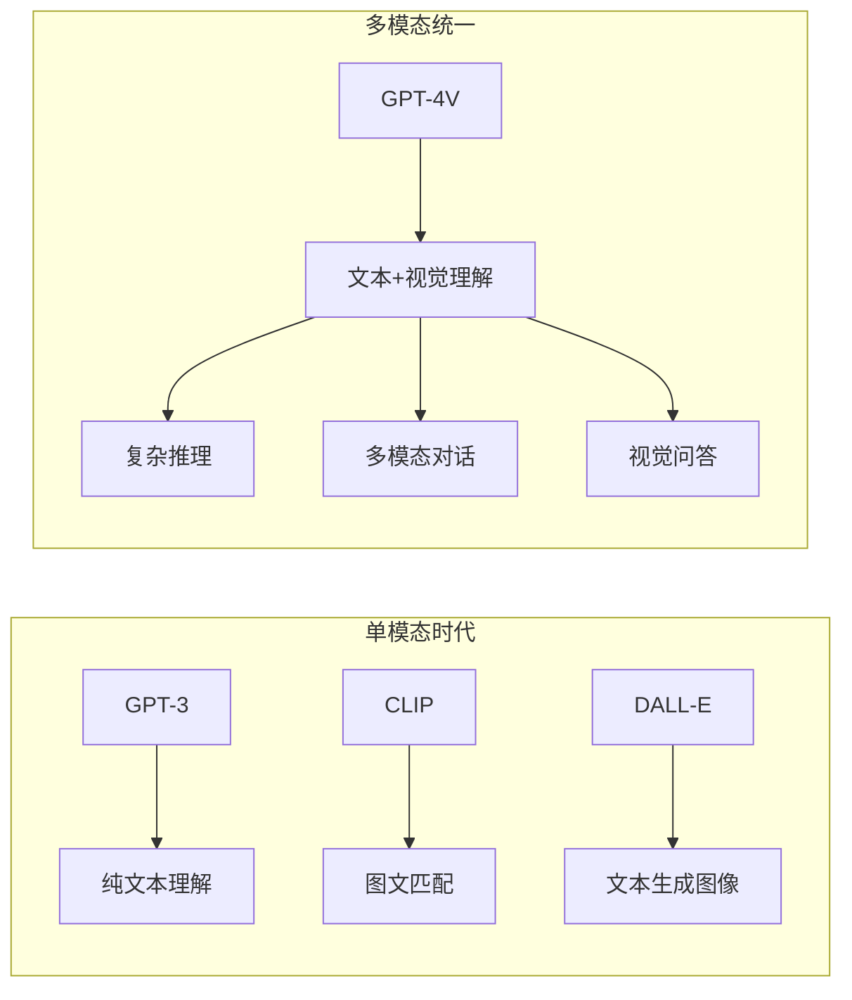
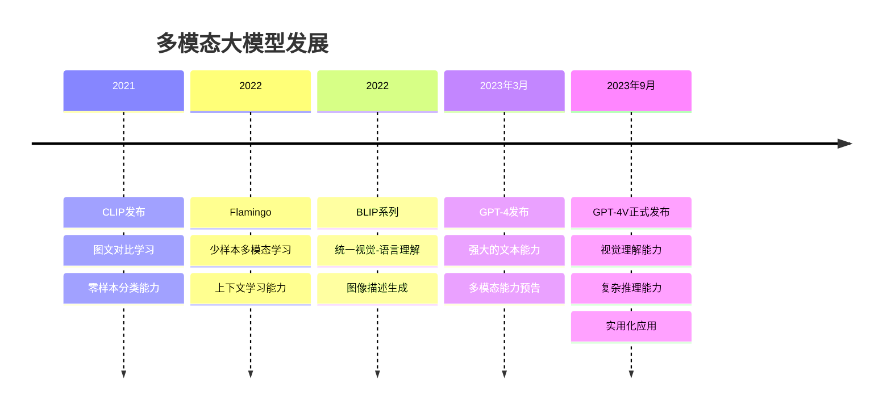

# 2.5.3 GPT-4V：多模态理解的新高度

## 学习目标

通过本节学习，你将能够：

1. **理解GPT-4V的突破性意义**：掌握大语言模型视觉能力的技术实现
2. **认识多模态统一架构**：了解如何在单一模型中融合文本和视觉理解
3. **掌握视觉推理能力**：理解AI如何进行复杂的视觉分析和推理
4. **体验多模态应用**：使用Trae实现GPT-4V风格的多模态应用

## GPT-4V的历史背景

### 从单模态到多模态的演进

**传统模型的局限**：


**GPT-4V的创新点**：
- **统一架构**：单一模型处理文本和图像
- **深度理解**：不仅识别，更能推理和分析
- **自然交互**：支持图文混合的自然对话
- **广泛应用**：从学术研究到实际应用的全覆盖

### 技术发展脉络



## GPT-4V的核心架构

### 统一的Transformer架构

**架构设计理念**：
```python
class GPT4VArchitecture:
    def __init__(self):
        # 统一的Transformer主干
        self.transformer_backbone = TransformerLM(
            layers=96,  # 更深的网络
            hidden_size=12288,  # 更大的隐藏层
            attention_heads=96,  # 更多注意力头
            vocab_size=100000  # 扩展词汇表
        )
        
        # 视觉编码器
        self.vision_encoder = VisionTransformer(
            patch_size=14,
            embed_dim=1024,
            depth=24,
            num_heads=16
        )
        
        # 跨模态融合
        self.cross_modal_adapter = CrossModalAdapter(
            vision_dim=1024,
            text_dim=12288
        )
    
    def process_multimodal_input(self, text_tokens, images):
        """处理多模态输入"""
        # 1. 文本编码
        text_embeddings = self.transformer_backbone.embed_tokens(text_tokens)
        
        # 2. 图像编码
        if images is not None:
            image_features = self.vision_encoder(images)
            # 将图像特征转换为token序列
            image_tokens = self.cross_modal_adapter.vision_to_text(image_features)
        else:
            image_tokens = None
        
        # 3. 序列融合
        if image_tokens is not None:
            # 插入特殊的图像分隔符
            combined_sequence = self.interleave_modalities(
                text_embeddings, image_tokens
            )
        else:
            combined_sequence = text_embeddings
        
        # 4. 统一处理
        output = self.transformer_backbone.forward_embeddings(combined_sequence)
        
        return output
```

### 视觉编码器设计

**Vision Transformer适配**：
```python
class GPT4VisionEncoder(nn.Module):
    def __init__(self, 
                 image_size=336,  # 高分辨率输入
                 patch_size=14,
                 embed_dim=1024,
                 depth=24,
                 num_heads=16):
        super().__init__()
        
        self.image_size = image_size
        self.patch_size = patch_size
        self.num_patches = (image_size // patch_size) ** 2
        
        # 图像分块嵌入
        self.patch_embed = PatchEmbed(
            img_size=image_size,
            patch_size=patch_size,
            embed_dim=embed_dim
        )
        
        # 位置编码
        self.pos_embed = nn.Parameter(
            torch.zeros(1, self.num_patches + 1, embed_dim)
        )
        
        # CLS token
        self.cls_token = nn.Parameter(torch.zeros(1, 1, embed_dim))
        
        # Transformer层
        self.blocks = nn.ModuleList([
            VisionTransformerBlock(
                dim=embed_dim,
                num_heads=num_heads,
                mlp_ratio=4.0
            ) for _ in range(depth)
        ])
        
        # 层归一化
        self.norm = nn.LayerNorm(embed_dim)
        
        # 多尺度特征提取
        self.multi_scale_adapter = MultiScaleAdapter(embed_dim)
    
    def forward(self, images):
        B = images.shape[0]
        
        # 1. 图像分块
        x = self.patch_embed(images)  # [B, num_patches, embed_dim]
        
        # 2. 添加CLS token
        cls_tokens = self.cls_token.expand(B, -1, -1)
        x = torch.cat([cls_tokens, x], dim=1)
        
        # 3. 位置编码
        x = x + self.pos_embed
        
        # 4. Transformer处理
        intermediate_features = []
        for i, block in enumerate(self.blocks):
            x = block(x)
            # 收集中间层特征用于多尺度理解
            if i in [7, 15, 23]:  # 选择特定层
                intermediate_features.append(x)
        
        x = self.norm(x)
        
        # 5. 多尺度特征融合
        multi_scale_features = self.multi_scale_adapter(
            x, intermediate_features
        )
        
        return {
            'global_features': x[:, 0],  # CLS token
            'patch_features': x[:, 1:],  # 图像块特征
            'multi_scale_features': multi_scale_features
        }
```

### 跨模态注意力机制

**视觉-文本交互**：
```python
class CrossModalAttention(nn.Module):
    def __init__(self, 
                 text_dim=12288,
                 vision_dim=1024,
                 num_heads=16):
        super().__init__()
        
        self.num_heads = num_heads
        self.head_dim = text_dim // num_heads
        
        # 查询、键、值投影
        self.q_proj = nn.Linear(text_dim, text_dim)
        self.k_proj = nn.Linear(vision_dim, text_dim)
        self.v_proj = nn.Linear(vision_dim, text_dim)
        
        # 输出投影
        self.out_proj = nn.Linear(text_dim, text_dim)
        
        # 门控机制
        self.gate = nn.Sequential(
            nn.Linear(text_dim + vision_dim, text_dim),
            nn.Sigmoid()
        )
    
    def forward(self, text_features, vision_features, attention_mask=None):
        B, T, _ = text_features.shape
        B, V, _ = vision_features.shape
        
        # 1. 计算注意力
        Q = self.q_proj(text_features)  # [B, T, text_dim]
        K = self.k_proj(vision_features)  # [B, V, text_dim]
        V = self.v_proj(vision_features)  # [B, V, text_dim]
        
        # 2. 多头注意力
        Q = Q.view(B, T, self.num_heads, self.head_dim).transpose(1, 2)
        K = K.view(B, V, self.num_heads, self.head_dim).transpose(1, 2)
        V = V.view(B, V, self.num_heads, self.head_dim).transpose(1, 2)
        
        # 3. 注意力计算
        attention_scores = torch.matmul(Q, K.transpose(-2, -1)) / math.sqrt(self.head_dim)
        
        if attention_mask is not None:
            attention_scores += attention_mask
        
        attention_probs = F.softmax(attention_scores, dim=-1)
        
        # 4. 加权求和
        context = torch.matmul(attention_probs, V)
        context = context.transpose(1, 2).contiguous().view(B, T, -1)
        
        # 5. 输出投影
        output = self.out_proj(context)
        
        # 6. 门控融合
        gate_input = torch.cat([
            text_features,
            output
        ], dim=-1)
        gate_weights = self.gate(gate_input)
        
        # 残差连接 + 门控
        final_output = text_features + gate_weights * output
        
        return final_output, attention_probs
```

## GPT-4V的核心能力

### 视觉理解能力

**多层次视觉理解**：
```python
class VisualUnderstanding:
    def __init__(self, model):
        self.model = model
        
    def analyze_image_content(self, image, query_type="comprehensive"):
        """多层次图像内容分析"""
        
        analysis_prompts = {
            'objects': "What objects can you see in this image? List them with their locations.",
            'scene': "Describe the overall scene and setting of this image.",
            'people': "Describe any people in the image, including their actions and expressions.",
            'text': "Is there any text visible in the image? If so, what does it say?",
            'emotions': "What emotions or mood does this image convey?",
            'composition': "Analyze the composition, lighting, and artistic elements.",
            'comprehensive': "Provide a detailed analysis of this image, including objects, people, scene, mood, and any notable details."
        }
        
        prompt = analysis_prompts.get(query_type, analysis_prompts['comprehensive'])
        
        response = self.model.generate(
            messages=[
                {
                    "role": "user",
                    "content": [
                        {"type": "image", "image": image},
                        {"type": "text", "text": prompt}
                    ]
                }
            ]
        )
        
        return response
    
    def visual_reasoning(self, image, question):
        """视觉推理"""
        reasoning_prompt = f"""
        Look at this image carefully and answer the following question with detailed reasoning:
        
        Question: {question}
        
        Please:
        1. Describe what you observe in the image
        2. Explain your reasoning process
        3. Provide your final answer
        """
        
        response = self.model.generate(
            messages=[
                {
                    "role": "user",
                    "content": [
                        {"type": "image", "image": image},
                        {"type": "text", "text": reasoning_prompt}
                    ]
                }
            ]
        )
        
        return response
    
    def compare_images(self, image1, image2, comparison_aspect="general"):
        """图像比较分析"""
        comparison_prompts = {
            'general': "Compare these two images. What are the similarities and differences?",
            'objects': "Compare the objects present in these two images.",
            'style': "Compare the artistic style and composition of these images.",
            'quality': "Compare the quality, resolution, and technical aspects of these images.",
            'content': "Compare the content and subject matter of these images."
        }
        
        prompt = comparison_prompts.get(comparison_aspect, comparison_prompts['general'])
        
        response = self.model.generate(
            messages=[
                {
                    "role": "user",
                    "content": [
                        {"type": "text", "text": "Image 1:"},
                        {"type": "image", "image": image1},
                        {"type": "text", "text": "Image 2:"},
                        {"type": "image", "image": image2},
                        {"type": "text", "text": prompt}
                    ]
                }
            ]
        )
        
        return response
```

### 文档理解能力

**结构化文档分析**：
```python
class DocumentUnderstanding:
    def __init__(self, model):
        self.model = model
    
    def extract_text_from_document(self, document_image):
        """从文档图像中提取文本"""
        prompt = """
        Please extract all the text content from this document image. 
        Maintain the original structure and formatting as much as possible.
        If there are tables, preserve the table structure.
        """
        
        response = self.model.generate(
            messages=[
                {
                    "role": "user",
                    "content": [
                        {"type": "image", "image": document_image},
                        {"type": "text", "text": prompt}
                    ]
                }
            ]
        )
        
        return response
    
    def analyze_document_structure(self, document_image):
        """分析文档结构"""
        prompt = """
        Analyze the structure of this document. Please identify:
        1. Document type (report, form, invoice, etc.)
        2. Main sections and headings
        3. Key information fields
        4. Tables, charts, or diagrams
        5. Overall layout and organization
        """
        
        response = self.model.generate(
            messages=[
                {
                    "role": "user",
                    "content": [
                        {"type": "image", "image": document_image},
                        {"type": "text", "text": prompt}
                    ]
                }
            ]
        )
        
        return response
    
    def extract_key_information(self, document_image, fields_of_interest):
        """提取关键信息"""
        fields_str = ", ".join(fields_of_interest)
        
        prompt = f"""
        From this document, please extract the following specific information:
        {fields_str}
        
        For each field, provide:
        - The extracted value
        - The confidence level (high/medium/low)
        - The location in the document where you found it
        
        If a field is not found, please indicate "Not found".
        """
        
        response = self.model.generate(
            messages=[
                {
                    "role": "user",
                    "content": [
                        {"type": "image", "image": document_image},
                        {"type": "text", "text": prompt}
                    ]
                }
            ]
        )
        
        return response
    
    def summarize_document(self, document_image, summary_length="medium"):
        """文档摘要"""
        length_prompts = {
            'short': "Provide a brief 2-3 sentence summary",
            'medium': "Provide a comprehensive paragraph summary",
            'long': "Provide a detailed summary with key points and sections"
        }
        
        length_instruction = length_prompts.get(summary_length, length_prompts['medium'])
        
        prompt = f"""
        Please read this document and {length_instruction} of its content.
        Focus on the main points, key findings, and important information.
        """
        
        response = self.model.generate(
            messages=[
                {
                    "role": "user",
                    "content": [
                        {"type": "image", "image": document_image},
                        {"type": "text", "text": prompt}
                    ]
                }
            ]
        )
        
        return response
```

### 代码理解能力

**代码分析和解释**：
```python
class CodeUnderstanding:
    def __init__(self, model):
        self.model = model
    
    def analyze_code_screenshot(self, code_image):
        """分析代码截图"""
        prompt = """
        Please analyze this code image and provide:
        1. Programming language identification
        2. Code structure and organization
        3. Main functions or classes
        4. Code logic explanation
        5. Potential issues or improvements
        6. Overall code quality assessment
        """
        
        response = self.model.generate(
            messages=[
                {
                    "role": "user",
                    "content": [
                        {"type": "image", "image": code_image},
                        {"type": "text", "text": prompt}
                    ]
                }
            ]
        )
        
        return response
    
    def debug_code_from_image(self, code_image, error_description=None):
        """从图像调试代码"""
        base_prompt = """
        Please help debug this code. Analyze the code in the image and:
        1. Identify any syntax errors
        2. Look for logical errors
        3. Suggest improvements
        4. Provide corrected code if needed
        """
        
        if error_description:
            prompt = f"{base_prompt}\n\nSpecific error reported: {error_description}"
        else:
            prompt = base_prompt
        
        response = self.model.generate(
            messages=[
                {
                    "role": "user",
                    "content": [
                        {"type": "image", "image": code_image},
                        {"type": "text", "text": prompt}
                    ]
                }
            ]
        )
        
        return response
    
    def explain_algorithm_from_diagram(self, algorithm_image):
        """解释算法图解"""
        prompt = """
        This image shows an algorithm or data structure diagram. Please:
        1. Identify what algorithm or data structure is being illustrated
        2. Explain how it works step by step
        3. Describe the time and space complexity
        4. Provide use cases and applications
        5. If possible, provide pseudocode or implementation hints
        """
        
        response = self.model.generate(
            messages=[
                {
                    "role": "user",
                    "content": [
                        {"type": "image", "image": algorithm_image},
                        {"type": "text", "text": prompt}
                    ]
                }
            ]
        )
        
        return response
```

## Trae实践：构建GPT-4V风格应用

### 环境准备

```python
# 安装必要的库
!pip install openai
!pip install pillow
!pip install gradio
!pip install base64
!pip install requests
!pip install streamlit

# 导入库
import openai
from PIL import Image
import gradio as gr
import base64
import io
import requests
from typing import List, Dict, Any, Optional
import json
```

### 多模态对话系统

```python
class MultimodalChatbot:
    def __init__(self, api_key: str, model="gpt-4-vision-preview"):
        self.client = openai.OpenAI(api_key=api_key)
        self.model = model
        self.conversation_history = []
    
    def encode_image(self, image: Image.Image) -> str:
        """将PIL图像编码为base64字符串"""
        buffered = io.BytesIO()
        image.save(buffered, format="PNG")
        img_str = base64.b64encode(buffered.getvalue()).decode()
        return f"data:image/png;base64,{img_str}"
    
    def add_message(self, role: str, content: List[Dict[str, Any]]):
        """添加消息到对话历史"""
        self.conversation_history.append({
            "role": role,
            "content": content
        })
    
    def chat_with_image(self, 
                       text: str, 
                       image: Optional[Image.Image] = None,
                       max_tokens: int = 1000) -> str:
        """与图像进行对话"""
        
        # 构建消息内容
        content = []
        
        if image is not None:
            # 添加图像
            image_data = self.encode_image(image)
            content.append({
                "type": "image_url",
                "image_url": {
                    "url": image_data,
                    "detail": "high"  # 高质量分析
                }
            })
        
        # 添加文本
        content.append({
            "type": "text",
            "text": text
        })
        
        # 添加到对话历史
        self.add_message("user", content)
        
        try:
            # 调用API
            response = self.client.chat.completions.create(
                model=self.model,
                messages=self.conversation_history,
                max_tokens=max_tokens,
                temperature=0.7
            )
            
            # 获取回复
            assistant_message = response.choices[0].message.content
            
            # 添加助手回复到历史
            self.add_message("assistant", [{
                "type": "text",
                "text": assistant_message
            }])
            
            return assistant_message
            
        except Exception as e:
            return f"错误: {str(e)}"
    
    def analyze_image(self, 
                     image: Image.Image, 
                     analysis_type: str = "comprehensive") -> str:
        """图像分析"""
        
        analysis_prompts = {
            "comprehensive": "请详细分析这张图像，包括其中的对象、场景、人物、文字、情感和任何值得注意的细节。",
            "objects": "请识别并列出图像中的所有对象，包括它们的位置和特征。",
            "text": "请提取图像中的所有文字内容，保持原有格式。",
            "people": "请描述图像中的人物，包括他们的外观、动作、表情和互动。",
            "scene": "请描述图像的整体场景、环境和氛围。",
            "technical": "请从技术角度分析这张图像，包括构图、光线、色彩和拍摄技巧。"
        }
        
        prompt = analysis_prompts.get(analysis_type, analysis_prompts["comprehensive"])
        
        return self.chat_with_image(prompt, image)
    
    def visual_qa(self, image: Image.Image, question: str) -> str:
        """视觉问答"""
        prompt = f"请仔细观察这张图像并回答以下问题：{question}"
        return self.chat_with_image(prompt, image)
    
    def compare_images(self, image1: Image.Image, image2: Image.Image, aspect: str = "general") -> str:
        """比较两张图像"""
        # 注意：GPT-4V目前不支持在单个消息中处理多张图像
        # 这里我们分别分析两张图像，然后进行比较
        
        analysis1 = self.analyze_image(image1, "comprehensive")
        analysis2 = self.analyze_image(image2, "comprehensive")
        
        comparison_prompt = f"""
        基于以下两张图像的分析结果，请进行比较：
        
        图像1分析：{analysis1}
        
        图像2分析：{analysis2}
        
        请比较这两张图像的{aspect}方面，指出相似点和不同点。
        """
        
        return self.chat_with_image(comparison_prompt)
    
    def clear_history(self):
        """清除对话历史"""
        self.conversation_history = []
    
    def get_conversation_summary(self) -> str:
        """获取对话摘要"""
        if not self.conversation_history:
            return "暂无对话历史"
        
        summary_prompt = "请总结我们之前的对话内容，突出主要讨论的图像和话题。"
        return self.chat_with_image(summary_prompt)

# 使用示例
# chatbot = MultimodalChatbot(api_key="your-openai-api-key")
# response = chatbot.chat_with_image("这张图片里有什么？", image)
```

### 文档处理应用

```python
class DocumentProcessor:
    def __init__(self, api_key: str):
        self.chatbot = MultimodalChatbot(api_key)
    
    def extract_text(self, document_image: Image.Image) -> Dict[str, Any]:
        """提取文档文本"""
        prompt = """
        请从这个文档图像中提取所有文本内容。请：
        1. 保持原有的格式和结构
        2. 如果有表格，请保持表格格式
        3. 标注不同的章节和标题
        4. 如果文本不清晰，请标注"[不清晰]"
        """
        
        extracted_text = self.chatbot.chat_with_image(prompt, document_image)
        
        return {
            "extracted_text": extracted_text,
            "processing_time": "completed",
            "confidence": "high"  # 这里可以根据实际情况评估
        }
    
    def analyze_document_type(self, document_image: Image.Image) -> Dict[str, Any]:
        """分析文档类型"""
        prompt = """
        请分析这个文档的类型和结构。请识别：
        1. 文档类型（如：报告、发票、合同、表单等）
        2. 主要章节和标题
        3. 关键信息字段
        4. 文档的整体布局和组织方式
        5. 任何特殊的格式或元素
        """
        
        analysis = self.chatbot.chat_with_image(prompt, document_image)
        
        return {
            "document_analysis": analysis,
            "suggested_fields": self._extract_suggested_fields(analysis)
        }
    
    def extract_structured_data(self, 
                              document_image: Image.Image, 
                              fields: List[str]) -> Dict[str, Any]:
        """提取结构化数据"""
        fields_str = "、".join(fields)
        
        prompt = f"""
        请从这个文档中提取以下特定信息：{fields_str}
        
        对于每个字段，请提供：
        - 提取的值
        - 置信度（高/中/低）
        - 在文档中的位置描述
        
        如果某个字段未找到，请标注"未找到"。
        请以JSON格式返回结果。
        """
        
        result = self.chatbot.chat_with_image(prompt, document_image)
        
        try:
            # 尝试解析JSON
            structured_data = json.loads(result)
        except:
            # 如果不是有效JSON，返回原始文本
            structured_data = {"raw_response": result}
        
        return structured_data
    
    def _extract_suggested_fields(self, analysis: str) -> List[str]:
        """从分析结果中提取建议的字段"""
        # 这里可以使用更复杂的NLP技术来提取字段
        # 简单实现：查找常见的字段关键词
        common_fields = [
            "姓名", "日期", "金额", "地址", "电话", "邮箱", 
            "公司名称", "发票号", "合同号", "签名"
        ]
        
        suggested = []
        for field in common_fields:
            if field in analysis:
                suggested.append(field)
        
        return suggested
    
    def summarize_document(self, 
                         document_image: Image.Image, 
                         summary_type: str = "comprehensive") -> str:
        """文档摘要"""
        summary_prompts = {
            "brief": "请用2-3句话简要总结这个文档的主要内容。",
            "comprehensive": "请提供这个文档的详细摘要，包括主要内容、关键信息和重要细节。",
            "key_points": "请列出这个文档的关键要点和重要信息。"
        }
        
        prompt = summary_prompts.get(summary_type, summary_prompts["comprehensive"])
        
        return self.chatbot.chat_with_image(prompt, document_image)

# 使用示例
# processor = DocumentProcessor(api_key="your-openai-api-key")
# text_result = processor.extract_text(document_image)
# structured_data = processor.extract_structured_data(document_image, ["姓名", "日期", "金额"])
```

### 交互式Web应用

```python
class GPT4VWebApp:
    def __init__(self, api_key: str):
        self.chatbot = MultimodalChatbot(api_key)
        self.document_processor = DocumentProcessor(api_key)
    
    def chat_interface(self, message, image, history):
        """聊天界面"""
        if image is None and not message.strip():
            return history, ""
        
        try:
            # 处理图像
            pil_image = None
            if image is not None:
                if isinstance(image, str):  # 文件路径
                    pil_image = Image.open(image)
                else:  # PIL图像
                    pil_image = image
            
            # 获取回复
            response = self.chatbot.chat_with_image(message, pil_image)
            
            # 更新历史
            history.append([message, response])
            
            return history, ""
            
        except Exception as e:
            error_msg = f"处理错误: {str(e)}"
            history.append([message, error_msg])
            return history, ""
    
    def analyze_interface(self, image, analysis_type):
        """分析界面"""
        if image is None:
            return "请上传图像"
        
        try:
            pil_image = Image.open(image) if isinstance(image, str) else image
            result = self.chatbot.analyze_image(pil_image, analysis_type)
            return result
        except Exception as e:
            return f"分析错误: {str(e)}"
    
    def document_interface(self, document_image, operation, custom_fields):
        """文档处理界面"""
        if document_image is None:
            return "请上传文档图像"
        
        try:
            pil_image = Image.open(document_image) if isinstance(document_image, str) else document_image
            
            if operation == "提取文本":
                result = self.document_processor.extract_text(pil_image)
                return result["extracted_text"]
            
            elif operation == "分析文档类型":
                result = self.document_processor.analyze_document_type(pil_image)
                return result["document_analysis"]
            
            elif operation == "提取结构化数据":
                if not custom_fields.strip():
                    return "请输入要提取的字段（用逗号分隔）"
                
                fields = [f.strip() for f in custom_fields.split(',')]
                result = self.document_processor.extract_structured_data(pil_image, fields)
                return json.dumps(result, ensure_ascii=False, indent=2)
            
            elif operation == "文档摘要":
                result = self.document_processor.summarize_document(pil_image)
                return result
            
        except Exception as e:
            return f"处理错误: {str(e)}"
    
    def launch_app(self):
        """启动Gradio应用"""
        
        with gr.Blocks(title="GPT-4V多模态助手") as app:
            gr.Markdown("# 🤖 GPT-4V多模态AI助手")
            gr.Markdown("支持图像理解、文档处理、视觉问答等功能")
            
            with gr.Tab("💬 多模态对话"):
                with gr.Row():
                    with gr.Column(scale=1):
                        chat_image = gr.Image(
                            label="上传图像（可选）",
                            type="pil"
                        )
                        
                        clear_btn = gr.Button("🗑️ 清除历史")
                    
                    with gr.Column(scale=2):
                        chatbot_display = gr.Chatbot(
                            label="对话历史",
                            height=400
                        )
                        
                        with gr.Row():
                            msg_input = gr.Textbox(
                                label="输入消息",
                                placeholder="输入您的问题或描述...",
                                scale=4
                            )
                            send_btn = gr.Button("📤 发送", scale=1)
                
                # 绑定事件
                send_btn.click(
                    fn=self.chat_interface,
                    inputs=[msg_input, chat_image, chatbot_display],
                    outputs=[chatbot_display, msg_input]
                )
                
                msg_input.submit(
                    fn=self.chat_interface,
                    inputs=[msg_input, chat_image, chatbot_display],
                    outputs=[chatbot_display, msg_input]
                )
                
                clear_btn.click(
                    fn=lambda: ([], None),
                    outputs=[chatbot_display, chat_image]
                )
            
            with gr.Tab("🔍 图像分析"):
                with gr.Row():
                    with gr.Column():
                        analyze_image = gr.Image(
                            label="上传要分析的图像",
                            type="pil"
                        )
                        
                        analysis_type = gr.Dropdown(
                            choices=[
                                "comprehensive", "objects", "text", 
                                "people", "scene", "technical"
                            ],
                            value="comprehensive",
                            label="分析类型"
                        )
                        
                        analyze_btn = gr.Button("🔍 开始分析")
                    
                    with gr.Column():
                        analysis_result = gr.Textbox(
                            label="分析结果",
                            lines=15,
                            max_lines=20
                        )
                
                analyze_btn.click(
                    fn=self.analyze_interface,
                    inputs=[analyze_image, analysis_type],
                    outputs=[analysis_result]
                )
            
            with gr.Tab("📄 文档处理"):
                with gr.Row():
                    with gr.Column():
                        doc_image = gr.Image(
                            label="上传文档图像",
                            type="pil"
                        )
                        
                        doc_operation = gr.Dropdown(
                            choices=[
                                "提取文本", "分析文档类型", 
                                "提取结构化数据", "文档摘要"
                            ],
                            value="提取文本",
                            label="处理操作"
                        )
                        
                        custom_fields = gr.Textbox(
                            label="自定义字段（用逗号分隔）",
                            placeholder="姓名,日期,金额,地址",
                            visible=False
                        )
                        
                        process_btn = gr.Button("📄 开始处理")
                    
                    with gr.Column():
                        doc_result = gr.Textbox(
                            label="处理结果",
                            lines=15,
                            max_lines=20
                        )
                
                # 显示/隐藏自定义字段输入
                def toggle_fields(operation):
                    return gr.update(visible=(operation == "提取结构化数据"))
                
                doc_operation.change(
                    fn=toggle_fields,
                    inputs=[doc_operation],
                    outputs=[custom_fields]
                )
                
                process_btn.click(
                    fn=self.document_interface,
                    inputs=[doc_image, doc_operation, custom_fields],
                    outputs=[doc_result]
                )
            
            with gr.Tab("ℹ️ 使用说明"):
                gr.Markdown("""
                ## 🚀 功能介绍
                
                ### 💬 多模态对话
                - 上传图像并与AI进行自然对话
                - 支持图像内容询问、视觉推理等
                - 保持对话上下文，支持连续交互
                
                ### 🔍 图像分析
                - **综合分析**: 全面分析图像内容
                - **对象识别**: 识别图像中的物体
                - **文字提取**: 提取图像中的文本
                - **人物分析**: 分析人物特征和动作
                - **场景描述**: 描述整体场景和环境
                - **技术分析**: 分析构图、光线等技术要素
                
                ### 📄 文档处理
                - **文本提取**: 从文档图像中提取所有文字
                - **类型分析**: 识别文档类型和结构
                - **结构化提取**: 提取特定字段的信息
                - **文档摘要**: 生成文档内容摘要
                
                ## 💡 使用技巧
                
                1. **图像质量**: 上传清晰、高分辨率的图像获得更好效果
                2. **具体问题**: 提出具体、明确的问题
                3. **上下文**: 在对话中提供足够的上下文信息
                4. **多角度**: 尝试从不同角度分析同一张图像
                
                ## ⚠️ 注意事项
                
                - 请确保上传的图像内容合规
                - 处理大型图像可能需要较长时间
                - API调用可能产生费用，请合理使用
                """)
        
        return app

# 启动应用
if __name__ == "__main__":
    # 请替换为您的OpenAI API密钥
    API_KEY = "your-openai-api-key"
    
    app = GPT4VWebApp(API_KEY)
    interface = app.launch_app()
    interface.launch(
        share=True,
        server_name="0.0.0.0",
        server_port=7860
    )
```

## 学习总结

### 核心要点回顾

1. **GPT-4V的突破**：
   - 统一的多模态架构
   - 强大的视觉理解能力
   - 自然的图文交互体验
   - 广泛的应用场景覆盖

2. **技术创新**：
   - **Vision Transformer**：高效的图像编码
   - **跨模态注意力**：深度的图文融合
   - **统一训练**：端到端的多模态学习
   - **指令调优**：更好的人类对齐

3. **核心能力**：
   - 图像内容理解和描述
   - 视觉推理和问答
   - 文档分析和信息提取
   - 代码理解和调试
   - 多模态对话交互

4. **应用价值**：
   - 教育辅助和学习支持
   - 文档处理和信息提取
   - 内容创作和分析
   - 辅助决策和问题解决

### 实践技能

通过本节学习，你应该掌握：

- [ ] 理解GPT-4V的技术架构和核心原理
- [ ] 使用GPT-4V API进行多模态应用开发
- [ ] 构建图像分析和文档处理应用
- [ ] 设计有效的多模态交互界面
- [ ] 优化多模态应用的用户体验
- [ ] 理解多模态AI的发展趋势和应用前景

### 思考题

1. **技术局限**：GPT-4V在视觉理解方面还有哪些局限性？

2. **应用场景**：在哪些场景下多模态AI比单模态AI更有优势？

3. **隐私安全**：使用多模态AI处理图像时需要注意哪些隐私和安全问题？

4. **成本效益**：如何在功能需求和API成本之间找到平衡？

5. **未来发展**：您认为多模态AI技术会如何进一步发展？

### 扩展阅读

- **GPT-4V技术报告**：OpenAI官方技术文档
- **多模态学习综述**：最新的多模态AI研究进展
- **Vision Transformer**：视觉Transformer的原理和应用
- **应用案例集**：GPT-4V在各行业的应用实例

---

**上一节**：[2.5.2 DALL-E：文本到图像生成的革命](2.5.2_dalle_text_to_image.md)

**下一节**：[2.6 章节总结](2.6_chapter_summary.md)

**本节总结**：GPT-4V代表了多模态AI发展的新高度，它将强大的语言理解能力与精确的视觉感知能力完美结合，开创了人机交互的新模式。通过统一的架构设计和深度的跨模态融合，GPT-4V不仅能够理解图像内容，更能进行复杂的视觉推理，为AI应用带来了前所未有的可能性。