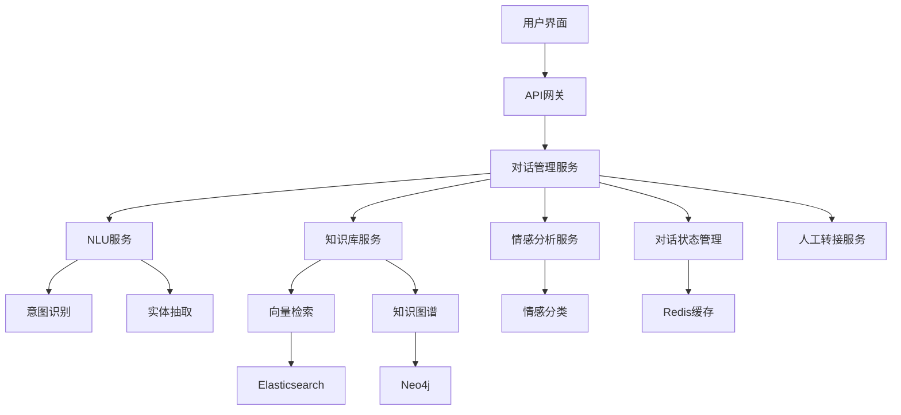

# 5.1 智能客服系统

## 项目概述

智能客服系统是现代企业数字化转型的重要组成部分。本项目将构建一个功能完整的智能客服系统，集成自然语言理解、知识库问答、情感分析等核心技术，实现7×24小时的智能客户服务。

### 🎯 项目目标
- 构建企业级智能客服系统
- 实现多轮对话理解和上下文管理
- 集成知识库进行智能问答
- 提供情感分析和个性化服务
- 支持人工客服无缝转接

### 📊 预期效果
- **响应速度**: < 2秒
- **问题解决率**: > 80%
- **用户满意度**: > 4.5/5
- **并发支持**: 1000+用户

## 5.1.1 需求分析和系统设计

### 业务需求分析

**核心业务场景**:
1. **常见问题咨询**: 产品信息、服务流程、政策解答
2. **技术支持**: 故障排查、使用指导、问题诊断
3. **订单查询**: 订单状态、物流信息、退换货流程
4. **投诉建议**: 问题反馈、服务评价、改进建议

**用户角色定义**:
- **终端用户**: 寻求帮助的客户
- **客服代表**: 处理复杂问题的人工客服
- **系统管理员**: 维护知识库和系统配置
- **业务分析师**: 分析客服数据和优化策略

### 系统架构设计



**核心模块说明**:
- **对话管理**: 统一的对话流程控制和状态管理
- **NLU服务**: 自然语言理解，包括意图识别和实体抽取
- **知识库服务**: 基于向量检索和知识图谱的智能问答
- **情感分析**: 识别用户情感状态，提供个性化服务
- **转接服务**: 智能判断转接时机，实现人机协作

### 技术选型

**后端技术栈**:
- **框架**: FastAPI (高性能异步API)
- **NLP模型**: BERT, RoBERTa, GPT-3.5
- **向量数据库**: Pinecone, Weaviate
- **图数据库**: Neo4j
- **缓存**: Redis
- **搜索引擎**: Elasticsearch

**前端技术栈**:
- **框架**: Streamlit (快速原型)
- **UI组件**: Streamlit-chat
- **可视化**: Plotly, Altair

## 5.1.2 核心功能实现

### 对话管理核心类

```python
# conversation_manager.py
from typing import Dict, List, Optional, Any
from dataclasses import dataclass
from datetime import datetime
import uuid
import redis
import json

@dataclass
class Message:
    """消息数据结构"""
    id: str
    user_id: str
    content: str
    message_type: str  # 'user', 'bot', 'system'
    timestamp: datetime
    metadata: Dict[str, Any] = None

@dataclass
class ConversationContext:
    """对话上下文"""
    user_id: str
    session_id: str
    current_intent: Optional[str] = None
    entities: Dict[str, Any] = None
    conversation_state: str = 'active'  # active, waiting, transferred
    emotion_state: Optional[str] = None
    satisfaction_score: Optional[float] = None
    messages: List[Message] = None
    
    def __post_init__(self):
        if self.entities is None:
            self.entities = {}
        if self.messages is None:
            self.messages = []

class ConversationManager:
    """对话管理器"""
    
    def __init__(self, redis_client: redis.Redis):
        self.redis_client = redis_client
        self.session_timeout = 3600  # 1小时超时
    
    def create_session(self, user_id: str) -> str:
        """创建新的对话会话"""
        session_id = str(uuid.uuid4())
        context = ConversationContext(
            user_id=user_id,
            session_id=session_id
        )
        
        # 存储到Redis
        self._save_context(context)
        return session_id
    
    def get_context(self, session_id: str) -> Optional[ConversationContext]:
        """获取对话上下文"""
        try:
            data = self.redis_client.get(f"session:{session_id}")
            if data:
                context_dict = json.loads(data)
                return self._dict_to_context(context_dict)
            return None
        except Exception as e:
            print(f"获取上下文失败: {e}")
            return None
    
    def update_context(self, session_id: str, **kwargs) -> bool:
        """更新对话上下文"""
        context = self.get_context(session_id)
        if not context:
            return False
        
        # 更新字段
        for key, value in kwargs.items():
            if hasattr(context, key):
                setattr(context, key, value)
        
        self._save_context(context)
        return True
    
    def add_message(self, session_id: str, content: str, 
                   message_type: str, metadata: Dict = None) -> bool:
        """添加消息到对话历史"""
        context = self.get_context(session_id)
        if not context:
            return False
        
        message = Message(
            id=str(uuid.uuid4()),
            user_id=context.user_id,
            content=content,
            message_type=message_type,
            timestamp=datetime.now(),
            metadata=metadata or {}
        )
        
        context.messages.append(message)
        
        # 限制消息历史长度
        if len(context.messages) > 50:
            context.messages = context.messages[-50:]
        
        self._save_context(context)
        return True
    
    def get_conversation_history(self, session_id: str, 
                               limit: int = 10) -> List[Message]:
        """获取对话历史"""
        context = self.get_context(session_id)
        if not context:
            return []
        
        return context.messages[-limit:] if context.messages else []
    
    def _save_context(self, context: ConversationContext):
        """保存上下文到Redis"""
        context_dict = self._context_to_dict(context)
        self.redis_client.setex(
            f"session:{context.session_id}",
            self.session_timeout,
            json.dumps(context_dict, default=str)
        )
    
    def _context_to_dict(self, context: ConversationContext) -> Dict:
        """转换上下文为字典"""
        return {
            'user_id': context.user_id,
            'session_id': context.session_id,
            'current_intent': context.current_intent,
            'entities': context.entities,
            'conversation_state': context.conversation_state,
            'emotion_state': context.emotion_state,
            'satisfaction_score': context.satisfaction_score,
            'messages': [
                {
                    'id': msg.id,
                    'user_id': msg.user_id,
                    'content': msg.content,
                    'message_type': msg.message_type,
                    'timestamp': msg.timestamp.isoformat(),
                    'metadata': msg.metadata
                }
                for msg in context.messages
            ]
        }
    
    def _dict_to_context(self, data: Dict) -> ConversationContext:
        """从字典转换为上下文对象"""
        messages = [
            Message(
                id=msg['id'],
                user_id=msg['user_id'],
                content=msg['content'],
                message_type=msg['message_type'],
                timestamp=datetime.fromisoformat(msg['timestamp']),
                metadata=msg.get('metadata', {})
            )
            for msg in data.get('messages', [])
        ]
        
        return ConversationContext(
            user_id=data['user_id'],
            session_id=data['session_id'],
            current_intent=data.get('current_intent'),
            entities=data.get('entities', {}),
            conversation_state=data.get('conversation_state', 'active'),
            emotion_state=data.get('emotion_state'),
            satisfaction_score=data.get('satisfaction_score'),
            messages=messages
        )
```

### NLU服务实现

```python
# nlu_service.py
from typing import Dict, List, Tuple, Optional
import torch
from transformers import (
    AutoTokenizer, AutoModelForSequenceClassification,
    AutoModelForTokenClassification, pipeline
)
import numpy as np
from dataclasses import dataclass

@dataclass
class IntentResult:
    """意图识别结果"""
    intent: str
    confidence: float
    alternatives: List[Tuple[str, float]]

@dataclass
class EntityResult:
    """实体抽取结果"""
    entities: List[Dict[str, Any]]
    
class NLUService:
    """自然语言理解服务"""
    
    def __init__(self, model_config: Dict[str, str]):
        self.device = torch.device('cuda' if torch.cuda.is_available() else 'cpu')
        
        # 加载意图识别模型
        self.intent_tokenizer = AutoTokenizer.from_pretrained(
            model_config['intent_model']
        )
        self.intent_model = AutoModelForSequenceClassification.from_pretrained(
            model_config['intent_model']
        ).to(self.device)
        
        # 加载实体识别模型
        self.ner_pipeline = pipeline(
            "ner",
            model=model_config['ner_model'],
            tokenizer=model_config['ner_model'],
            aggregation_strategy="simple",
            device=0 if torch.cuda.is_available() else -1
        )
        
        # 意图标签映射
        self.intent_labels = {
            0: "greeting",
            1: "product_inquiry", 
            2: "order_status",
            3: "technical_support",
            4: "complaint",
            5: "goodbye",
            6: "other"
        }
    
    def predict_intent(self, text: str) -> IntentResult:
        """预测用户意图"""
        # 文本预处理
        inputs = self.intent_tokenizer(
            text,
            return_tensors="pt",
            truncation=True,
            padding=True,
            max_length=512
        ).to(self.device)
        
        # 模型推理
        with torch.no_grad():
            outputs = self.intent_model(**inputs)
            probabilities = torch.softmax(outputs.logits, dim=-1)
            
        # 获取预测结果
        probs = probabilities.cpu().numpy()[0]
        predicted_idx = np.argmax(probs)
        confidence = float(probs[predicted_idx])
        
        # 获取备选意图
        alternatives = []
        for idx, prob in enumerate(probs):
            if idx != predicted_idx and prob > 0.1:
                alternatives.append((self.intent_labels[idx], float(prob)))
        
        alternatives.sort(key=lambda x: x[1], reverse=True)
        
        return IntentResult(
            intent=self.intent_labels[predicted_idx],
            confidence=confidence,
            alternatives=alternatives[:3]
        )
    
    def extract_entities(self, text: str) -> EntityResult:
        """抽取命名实体"""
        # 使用pipeline进行实体识别
        ner_results = self.ner_pipeline(text)
        
        # 处理结果
        entities = []
        for entity in ner_results:
            entities.append({
                'text': entity['word'],
                'label': entity['entity_group'],
                'confidence': entity['score'],
                'start': entity['start'],
                'end': entity['end']
            })
        
        return EntityResult(entities=entities)
    
    def analyze_text(self, text: str) -> Dict[str, Any]:
        """综合文本分析"""
        intent_result = self.predict_intent(text)
        entity_result = self.extract_entities(text)
        
        return {
            'intent': {
                'predicted': intent_result.intent,
                'confidence': intent_result.confidence,
                'alternatives': intent_result.alternatives
            },
            'entities': entity_result.entities,
            'text_length': len(text),
            'word_count': len(text.split())
        }
```

### 知识库服务实现

```python
# knowledge_base.py
from typing import List, Dict, Optional, Any
import numpy as np
from sentence_transformers import SentenceTransformer
import pinecone
from dataclasses import dataclass
import json

@dataclass
class KnowledgeItem:
    """知识库条目"""
    id: str
    question: str
    answer: str
    category: str
    tags: List[str]
    confidence: float = 0.0
    metadata: Dict[str, Any] = None

class KnowledgeBaseService:
    """知识库服务"""
    
    def __init__(self, config: Dict[str, Any]):
        # 初始化向量模型
        self.encoder = SentenceTransformer(config['embedding_model'])
        
        # 初始化Pinecone
        pinecone.init(
            api_key=config['pinecone_api_key'],
            environment=config['pinecone_environment']
        )
        
        self.index_name = config['index_name']
        self.index = pinecone.Index(self.index_name)
        
        # 相似度阈值
        self.similarity_threshold = config.get('similarity_threshold', 0.7)
    
    def add_knowledge(self, items: List[KnowledgeItem]) -> bool:
        """添加知识到向量数据库"""
        try:
            vectors_to_upsert = []
            
            for item in items:
                # 生成问题向量
                question_vector = self.encoder.encode(item.question).tolist()
                
                # 准备元数据
                metadata = {
                    'question': item.question,
                    'answer': item.answer,
                    'category': item.category,
                    'tags': item.tags
                }
                if item.metadata:
                    metadata.update(item.metadata)
                
                vectors_to_upsert.append({
                    'id': item.id,
                    'values': question_vector,
                    'metadata': metadata
                })
            
            # 批量上传到Pinecone
            self.index.upsert(vectors=vectors_to_upsert)
            return True
            
        except Exception as e:
            print(f"添加知识失败: {e}")
            return False
    
    def search_knowledge(self, query: str, top_k: int = 5, 
                        category_filter: Optional[str] = None) -> List[KnowledgeItem]:
        """搜索相关知识"""
        try:
            # 生成查询向量
            query_vector = self.encoder.encode(query).tolist()
            
            # 构建过滤条件
            filter_dict = {}
            if category_filter:
                filter_dict['category'] = category_filter
            
            # 向量搜索
            search_results = self.index.query(
                vector=query_vector,
                top_k=top_k,
                include_metadata=True,
                filter=filter_dict if filter_dict else None
            )
            
            # 处理搜索结果
            knowledge_items = []
            for match in search_results['matches']:
                if match['score'] >= self.similarity_threshold:
                    metadata = match['metadata']
                    item = KnowledgeItem(
                        id=match['id'],
                        question=metadata['question'],
                        answer=metadata['answer'],
                        category=metadata['category'],
                        tags=metadata.get('tags', []),
                        confidence=match['score'],
                        metadata=metadata
                    )
                    knowledge_items.append(item)
            
            return knowledge_items
            
        except Exception as e:
            print(f"搜索知识失败: {e}")
            return []
    
    def get_answer(self, query: str, context: Optional[Dict] = None) -> Optional[str]:
        """获取问题答案"""
        # 搜索相关知识
        category_filter = None
        if context and 'current_intent' in context:
            category_filter = self._intent_to_category(context['current_intent'])
        
        knowledge_items = self.search_knowledge(
            query, 
            top_k=3, 
            category_filter=category_filter
        )
        
        if not knowledge_items:
            return None
        
        # 返回最相关的答案
        best_match = knowledge_items[0]
        if best_match.confidence >= self.similarity_threshold:
            return best_match.answer
        
        return None
    
    def _intent_to_category(self, intent: str) -> Optional[str]:
        """意图到类别的映射"""
        intent_category_map = {
            'product_inquiry': 'product',
            'order_status': 'order',
            'technical_support': 'technical',
            'complaint': 'service'
        }
        return intent_category_map.get(intent)
    
    def update_knowledge(self, item_id: str, updated_item: KnowledgeItem) -> bool:
        """更新知识条目"""
        try:
            # 删除旧条目
            self.index.delete(ids=[item_id])
            
            # 添加新条目
            return self.add_knowledge([updated_item])
            
        except Exception as e:
            print(f"更新知识失败: {e}")
            return False
    
    def delete_knowledge(self, item_ids: List[str]) -> bool:
        """删除知识条目"""
        try:
            self.index.delete(ids=item_ids)
            return True
        except Exception as e:
            print(f"删除知识失败: {e}")
            return False
```

### 情感分析服务

```python
# emotion_analysis.py
from typing import Dict, List, Optional
import torch
from transformers import AutoTokenizer, AutoModelForSequenceClassification
import numpy as np
from dataclasses import dataclass

@dataclass
class EmotionResult:
    """情感分析结果"""
    emotion: str
    confidence: float
    valence: float  # 情感效价 (-1到1)
    arousal: float  # 情感唤醒度 (0到1)
    emotions_distribution: Dict[str, float]

class EmotionAnalysisService:
    """情感分析服务"""
    
    def __init__(self, model_path: str):
        self.device = torch.device('cuda' if torch.cuda.is_available() else 'cpu')
        
        # 加载情感分析模型
        self.tokenizer = AutoTokenizer.from_pretrained(model_path)
        self.model = AutoModelForSequenceClassification.from_pretrained(
            model_path
        ).to(self.device)
        
        # 情感标签
        self.emotion_labels = {
            0: "anger",      # 愤怒
            1: "disgust",    # 厌恶
            2: "fear",       # 恐惧
            3: "joy",        # 喜悦
            4: "neutral",    # 中性
            5: "sadness",    # 悲伤
            6: "surprise"    # 惊讶
        }
        
        # 情感效价和唤醒度映射
        self.emotion_dimensions = {
            "anger": {"valence": -0.8, "arousal": 0.9},
            "disgust": {"valence": -0.7, "arousal": 0.6},
            "fear": {"valence": -0.6, "arousal": 0.8},
            "joy": {"valence": 0.8, "arousal": 0.7},
            "neutral": {"valence": 0.0, "arousal": 0.3},
            "sadness": {"valence": -0.7, "arousal": 0.4},
            "surprise": {"valence": 0.2, "arousal": 0.8}
        }
    
    def analyze_emotion(self, text: str) -> EmotionResult:
        """分析文本情感"""
        # 文本预处理
        inputs = self.tokenizer(
            text,
            return_tensors="pt",
            truncation=True,
            padding=True,
            max_length=512
        ).to(self.device)
        
        # 模型推理
        with torch.no_grad():
            outputs = self.model(**inputs)
            probabilities = torch.softmax(outputs.logits, dim=-1)
        
        # 获取预测结果
        probs = probabilities.cpu().numpy()[0]
        predicted_idx = np.argmax(probs)
        predicted_emotion = self.emotion_labels[predicted_idx]
        confidence = float(probs[predicted_idx])
        
        # 计算情感分布
        emotions_distribution = {
            self.emotion_labels[i]: float(prob) 
            for i, prob in enumerate(probs)
        }
        
        # 获取情感维度
        dimensions = self.emotion_dimensions[predicted_emotion]
        
        return EmotionResult(
            emotion=predicted_emotion,
            confidence=confidence,
            valence=dimensions["valence"],
            arousal=dimensions["arousal"],
            emotions_distribution=emotions_distribution
        )
    
    def get_response_strategy(self, emotion_result: EmotionResult) -> Dict[str, Any]:
        """根据情感分析结果获取回复策略"""
        emotion = emotion_result.emotion
        confidence = emotion_result.confidence
        
        strategies = {
            "anger": {
                "tone": "calm_and_understanding",
                "priority": "high",
                "escalation": True,
                "response_template": "我理解您的不满，让我来帮助您解决这个问题。",
                "suggested_actions": ["apologize", "offer_solution", "escalate_if_needed"]
            },
            "sadness": {
                "tone": "empathetic_and_supportive",
                "priority": "medium",
                "escalation": False,
                "response_template": "我很抱歉听到这个情况，我会尽力帮助您。",
                "suggested_actions": ["show_empathy", "provide_support", "offer_alternatives"]
            },
            "joy": {
                "tone": "positive_and_engaging",
                "priority": "normal",
                "escalation": False,
                "response_template": "很高兴为您服务！让我来帮助您。",
                "suggested_actions": ["maintain_positivity", "be_helpful", "encourage_feedback"]
            },
            "fear": {
                "tone": "reassuring_and_clear",
                "priority": "medium",
                "escalation": False,
                "response_template": "请不用担心，我会详细为您解释并提供帮助。",
                "suggested_actions": ["provide_reassurance", "explain_clearly", "offer_step_by_step_help"]
            },
            "neutral": {
                "tone": "professional_and_helpful",
                "priority": "normal",
                "escalation": False,
                "response_template": "我来为您提供帮助。",
                "suggested_actions": ["be_direct", "provide_information", "ask_clarifying_questions"]
            }
        }
        
        strategy = strategies.get(emotion, strategies["neutral"])
        strategy["confidence"] = confidence
        
        # 如果情感识别置信度低，使用中性策略
        if confidence < 0.6:
            strategy = strategies["neutral"]
            strategy["confidence"] = confidence
            strategy["note"] = "Low confidence emotion detection, using neutral strategy"
        
        return strategy
    
    def analyze_conversation_emotion_trend(self, messages: List[str]) -> Dict[str, Any]:
        """分析对话中的情感变化趋势"""
        if not messages:
            return {"trend": "neutral", "emotions": [], "summary": "No messages to analyze"}
        
        emotions = []
        valences = []
        arousals = []
        
        for message in messages:
            result = self.analyze_emotion(message)
            emotions.append({
                "emotion": result.emotion,
                "confidence": result.confidence,
                "valence": result.valence,
                "arousal": result.arousal
            })
            valences.append(result.valence)
            arousals.append(result.arousal)
        
        # 计算趋势
        avg_valence = np.mean(valences)
        avg_arousal = np.mean(arousals)
        valence_trend = "improving" if valences[-1] > valences[0] else "declining" if valences[-1] < valences[0] else "stable"
        
        return {
            "emotions": emotions,
            "average_valence": avg_valence,
            "average_arousal": avg_arousal,
            "valence_trend": valence_trend,
            "latest_emotion": emotions[-1]["emotion"],
            "summary": self._generate_emotion_summary(avg_valence, avg_arousal, valence_trend)
        }
    
    def _generate_emotion_summary(self, avg_valence: float, avg_arousal: float, trend: str) -> str:
        """生成情感分析摘要"""
        if avg_valence > 0.3:
            valence_desc = "积极"
        elif avg_valence < -0.3:
            valence_desc = "消极"
        else:
            valence_desc = "中性"
        
        if avg_arousal > 0.6:
            arousal_desc = "高激活"
        elif avg_arousal < 0.4:
            arousal_desc = "低激活"
        else:
            arousal_desc = "中等激活"
        
        trend_desc = {
            "improving": "情感趋向好转",
            "declining": "情感趋向恶化", 
            "stable": "情感保持稳定"
        }[trend]
        
        return f"用户情感整体呈现{valence_desc}、{arousal_desc}状态，{trend_desc}"
```

## 5.1.3 系统集成和API设计

### FastAPI主服务

```python
# main.py
from fastapi import FastAPI, HTTPException, Depends
from fastapi.middleware.cors import CORSMiddleware
from pydantic import BaseModel
from typing import List, Optional, Dict, Any
import redis
import os
from datetime import datetime

# 导入自定义模块
from conversation_manager import ConversationManager
from nlu_service import NLUService
from knowledge_base import KnowledgeBaseService
from emotion_analysis import EmotionAnalysisService

# 创建FastAPI应用
app = FastAPI(
    title="智能客服系统API",
    description="基于大模型的智能客服系统",
    version="1.0.0"
)

# 添加CORS中间件
app.add_middleware(
    CORSMiddleware,
    allow_origins=["*"],
    allow_credentials=True,
    allow_methods=["*"],
    allow_headers=["*"],
)

# 请求/响应模型
class ChatRequest(BaseModel):
    message: str
    user_id: str
    session_id: Optional[str] = None

class ChatResponse(BaseModel):
    response: str
    session_id: str
    intent: Optional[str] = None
    emotion: Optional[str] = None
    confidence: float
    suggestions: List[str] = []
    need_human_transfer: bool = False

class SessionRequest(BaseModel):
    user_id: str

class SessionResponse(BaseModel):
    session_id: str
    status: str

# 全局服务实例
redis_client = None
conversation_manager = None
nlu_service = None
knowledge_base = None
emotion_service = None

@app.on_event("startup")
async def startup_event():
    """应用启动时初始化服务"""
    global redis_client, conversation_manager, nlu_service, knowledge_base, emotion_service
    
    # 初始化Redis
    redis_client = redis.Redis(
        host=os.getenv('REDIS_HOST', 'localhost'),
        port=int(os.getenv('REDIS_PORT', 6379)),
        db=0,
        decode_responses=True
    )
    
    # 初始化对话管理器
    conversation_manager = ConversationManager(redis_client)
    
    # 初始化NLU服务
    nlu_config = {
        'intent_model': 'bert-base-chinese',
        'ner_model': 'ckiplab/bert-base-chinese-ner'
    }
    nlu_service = NLUService(nlu_config)
    
    # 初始化知识库服务
    kb_config = {
        'embedding_model': 'sentence-transformers/paraphrase-multilingual-MiniLM-L12-v2',
        'pinecone_api_key': os.getenv('PINECONE_API_KEY'),
        'pinecone_environment': os.getenv('PINECONE_ENVIRONMENT'),
        'index_name': 'customer-service-kb',
        'similarity_threshold': 0.7
    }
    knowledge_base = KnowledgeBaseService(kb_config)
    
    # 初始化情感分析服务
    emotion_service = EmotionAnalysisService('j-hartmann/emotion-english-distilroberta-base')

@app.post("/api/chat", response_model=ChatResponse)
async def chat(request: ChatRequest):
    """处理聊天请求"""
    try:
        # 获取或创建会话
        session_id = request.session_id
        if not session_id:
            session_id = conversation_manager.create_session(request.user_id)
        
        # 添加用户消息到对话历史
        conversation_manager.add_message(
            session_id, 
            request.message, 
            "user"
        )
        
        # NLU分析
        nlu_result = nlu_service.analyze_text(request.message)
        intent = nlu_result['intent']['predicted']
        intent_confidence = nlu_result['intent']['confidence']
        
        # 情感分析
        emotion_result = emotion_service.analyze_emotion(request.message)
        
        # 更新对话上下文
        conversation_manager.update_context(
            session_id,
            current_intent=intent,
            entities=nlu_result['entities'],
            emotion_state=emotion_result.emotion
        )
        
        # 获取对话上下文
        context = conversation_manager.get_context(session_id)
        
        # 知识库查询
        answer = knowledge_base.get_answer(
            request.message,
            context={'current_intent': intent}
        )
        
        # 生成回复
        if answer:
            response_text = answer
            confidence = intent_confidence
        else:
            response_text = "抱歉，我没有找到相关信息。让我为您转接人工客服。"
            confidence = 0.0
        
        # 根据情感调整回复策略
        emotion_strategy = emotion_service.get_response_strategy(emotion_result)
        if emotion_strategy['tone'] == 'calm_and_understanding':
            response_text = f"{emotion_strategy['response_template']} {response_text}"
        
        # 判断是否需要人工转接
        need_transfer = (
            confidence < 0.5 or 
            emotion_result.emotion in ['anger', 'sadness'] or
            intent == 'complaint'
        )
        
        # 添加机器人回复到对话历史
        conversation_manager.add_message(
            session_id,
            response_text,
            "bot",
            metadata={
                'intent': intent,
                'confidence': confidence,
                'emotion': emotion_result.emotion
            }
        )
        
        # 生成建议回复
        suggestions = _generate_suggestions(intent, context)
        
        return ChatResponse(
            response=response_text,
            session_id=session_id,
            intent=intent,
            emotion=emotion_result.emotion,
            confidence=confidence,
            suggestions=suggestions,
            need_human_transfer=need_transfer
        )
        
    except Exception as e:
        raise HTTPException(status_code=500, detail=f"处理聊天请求失败: {str(e)}")

@app.post("/api/session", response_model=SessionResponse)
async def create_session(request: SessionRequest):
    """创建新的对话会话"""
    try:
        session_id = conversation_manager.create_session(request.user_id)
        return SessionResponse(
            session_id=session_id,
            status="created"
        )
    except Exception as e:
        raise HTTPException(status_code=500, detail=f"创建会话失败: {str(e)}")

@app.get("/api/session/{session_id}/history")
async def get_conversation_history(session_id: str, limit: int = 10):
    """获取对话历史"""
    try:
        messages = conversation_manager.get_conversation_history(session_id, limit)
        return {
            "session_id": session_id,
            "messages": [
                {
                    "content": msg.content,
                    "type": msg.message_type,
                    "timestamp": msg.timestamp.isoformat(),
                    "metadata": msg.metadata
                }
                for msg in messages
            ]
        }
    except Exception as e:
        raise HTTPException(status_code=500, detail=f"获取对话历史失败: {str(e)}")

@app.post("/api/session/{session_id}/transfer")
async def transfer_to_human(session_id: str):
    """转接人工客服"""
    try:
        # 更新会话状态
        success = conversation_manager.update_context(
            session_id,
            conversation_state="transferred"
        )
        
        if success:
            # 添加系统消息
            conversation_manager.add_message(
                session_id,
                "已为您转接人工客服，请稍候...",
                "system"
            )
            
            return {"status": "transferred", "message": "已成功转接人工客服"}
        else:
            raise HTTPException(status_code=404, detail="会话不存在")
            
    except Exception as e:
        raise HTTPException(status_code=500, detail=f"转接失败: {str(e)}")

@app.get("/api/analytics/emotion/{session_id}")
async def get_emotion_analysis(session_id: str):
    """获取对话情感分析"""
    try:
        # 获取对话历史
        messages = conversation_manager.get_conversation_history(session_id, 20)
        user_messages = [msg.content for msg in messages if msg.message_type == "user"]
        
        if not user_messages:
            return {"error": "没有用户消息可分析"}
        
        # 分析情感趋势
        emotion_trend = emotion_service.analyze_conversation_emotion_trend(user_messages)
        
        return {
            "session_id": session_id,
            "emotion_analysis": emotion_trend
        }
        
    except Exception as e:
        raise HTTPException(status_code=500, detail=f"情感分析失败: {str(e)}")

def _generate_suggestions(intent: str, context) -> List[str]:
    """根据意图生成建议回复"""
    suggestions_map = {
        "product_inquiry": [
            "查看产品详情",
            "比较不同产品",
            "联系销售顾问"
        ],
        "order_status": [
            "查询物流信息",
            "修改收货地址",
            "申请退换货"
        ],
        "technical_support": [
            "查看使用手册",
            "观看视频教程",
            "预约技术支持"
        ],
        "complaint": [
            "提交详细反馈",
            "申请退款",
            "联系客服主管"
        ]
    }
    
    return suggestions_map.get(intent, ["查看帮助文档", "联系人工客服"])

if __name__ == "__main__":
    import uvicorn
    uvicorn.run(app, host="0.0.0.0", port=8000)
```

这个智能客服系统的核心实现包括了对话管理、自然语言理解、知识库检索、情感分析等关键功能。接下来我们将继续完善前端界面和部署配置。