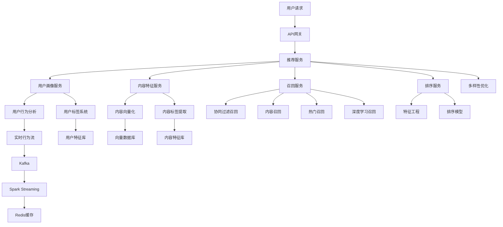

# 5.2 内容推荐引擎

## 项目概述

内容推荐引擎是现代互联网平台的核心技术之一，通过分析用户行为和内容特征，为用户提供个性化的内容推荐。本项目将构建一个完整的推荐系统，集成多种推荐算法，实现实时个性化推荐。

### 🎯 项目目标
- 构建多策略融合的推荐引擎
- 实现实时用户行为分析和建模
- 解决冷启动和数据稀疏问题
- 提供推荐解释性和A/B测试能力
- 支持大规模并发推荐请求

### 📊 预期效果
- **推荐准确率**: > 85%
- **用户点击率**: 提升30%+
- **用户停留时间**: 增加25%+
- **系统响应时间**: < 100ms

## 5.2.1 推荐系统架构设计

### 业务场景分析

**核心推荐场景**:
1. **首页推荐**: 基于用户兴趣的个性化内容流
2. **相关推荐**: 基于当前浏览内容的相似推荐
3. **热门推荐**: 基于全局热度的趋势内容
4. **分类推荐**: 基于用户偏好的分类内容

**用户类型分析**:
- **新用户**: 缺乏历史行为数据，需要冷启动策略
- **活跃用户**: 有丰富行为数据，可进行精准推荐
- **回流用户**: 长期未活跃，需要重新激活
- **高价值用户**: 付费或高互动用户，需要特殊关注

### 系统架构设计



**核心模块说明**:
- **召回层**: 从海量内容中快速召回候选集
- **排序层**: 对召回结果进行精准排序
- **用户画像**: 构建多维度用户兴趣模型
- **内容理解**: 提取内容特征和语义表示
- **实时计算**: 处理用户实时行为和更新推荐

### 技术选型

**推荐算法**:
- **协同过滤**: UserCF, ItemCF, Matrix Factorization
- **深度学习**: DeepFM, Wide&Deep, DIN, DSSM
- **内容推荐**: TF-IDF, Word2Vec, BERT
- **图神经网络**: GraphSAGE, LightGCN

**技术栈**:
- **后端**: Python, FastAPI, Celery
- **机器学习**: TensorFlow, PyTorch, Scikit-learn
- **数据存储**: PostgreSQL, Redis, Elasticsearch
- **实时计算**: Apache Kafka, Spark Streaming
- **向量检索**: Faiss, Annoy, Milvus

## 5.2.2 用户画像和行为分析

### 用户画像构建

```python
# user_profile.py
from typing import Dict, List, Optional, Any
from dataclasses import dataclass, field
from datetime import datetime, timedelta
import numpy as np
import pandas as pd
from collections import defaultdict, Counter
import redis
import json

@dataclass
class UserProfile:
    """用户画像数据结构"""
    user_id: str
    demographics: Dict[str, Any] = field(default_factory=dict)
    interests: Dict[str, float] = field(default_factory=dict)
    behavior_patterns: Dict[str, Any] = field(default_factory=dict)
    preferences: Dict[str, Any] = field(default_factory=dict)
    activity_level: str = "normal"  # low, normal, high
    user_type: str = "regular"  # new, regular, premium, inactive
    last_updated: datetime = field(default_factory=datetime.now)

@dataclass
class UserBehavior:
    """用户行为数据"""
    user_id: str
    item_id: str
    behavior_type: str  # view, click, like, share, comment, purchase
    timestamp: datetime
    duration: Optional[float] = None
    rating: Optional[float] = None
    context: Dict[str, Any] = field(default_factory=dict)

class UserProfileService:
    """用户画像服务"""
    
    def __init__(self, redis_client: redis.Redis, db_config: Dict):
        self.redis_client = redis_client
        self.db_config = db_config
        
        # 兴趣衰减参数
        self.interest_decay_rate = 0.95
        self.behavior_weights = {
            'view': 1.0,
            'click': 2.0,
            'like': 3.0,
            'share': 4.0,
            'comment': 5.0,
            'purchase': 10.0
        }
    
    def update_user_profile(self, user_id: str, behaviors: List[UserBehavior]) -> UserProfile:
        """更新用户画像"""
        # 获取现有画像
        profile = self.get_user_profile(user_id)
        if not profile:
            profile = UserProfile(user_id=user_id)
        
        # 更新兴趣标签
        self._update_interests(profile, behaviors)
        
        # 更新行为模式
        self._update_behavior_patterns(profile, behaviors)
        
        # 更新用户偏好
        self._update_preferences(profile, behaviors)
        
        # 计算活跃度
        self._calculate_activity_level(profile, behaviors)
        
        # 确定用户类型
        self._determine_user_type(profile)
        
        # 保存画像
        self._save_user_profile(profile)
        
        return profile
    
    def _update_interests(self, profile: UserProfile, behaviors: List[UserBehavior]):
        """更新用户兴趣"""
        # 应用时间衰减
        current_time = datetime.now()
        for interest, score in profile.interests.items():
            days_passed = (current_time - profile.last_updated).days
            decayed_score = score * (self.interest_decay_rate ** days_passed)
            profile.interests[interest] = max(0.1, decayed_score)
        
        # 基于新行为更新兴趣
        interest_updates = defaultdict(float)
        
        for behavior in behaviors:
            # 获取内容标签（这里简化处理）
            content_tags = self._get_content_tags(behavior.item_id)
            weight = self.behavior_weights.get(behavior.behavior_type, 1.0)
            
            # 时间权重（越新的行为权重越高）
            time_weight = self._calculate_time_weight(behavior.timestamp)
            
            for tag in content_tags:
                interest_updates[tag] += weight * time_weight
        
        # 合并兴趣更新
        for interest, update_score in interest_updates.items():
            current_score = profile.interests.get(interest, 0.0)
            profile.interests[interest] = min(10.0, current_score + update_score)
        
        # 归一化兴趣分数
        self._normalize_interests(profile)
    
    def _update_behavior_patterns(self, profile: UserProfile, behaviors: List[UserBehavior]):
        """更新行为模式"""
        if not behaviors:
            return
        
        # 活跃时间分析
        active_hours = [b.timestamp.hour for b in behaviors]
        hour_distribution = Counter(active_hours)
        
        # 行为类型分析
        behavior_types = [b.behavior_type for b in behaviors]
        behavior_distribution = Counter(behavior_types)
        
        # 会话长度分析
        session_durations = [b.duration for b in behaviors if b.duration]
        avg_session_duration = np.mean(session_durations) if session_durations else 0
        
        profile.behavior_patterns.update({
            'active_hours': dict(hour_distribution),
            'behavior_distribution': dict(behavior_distribution),
            'avg_session_duration': avg_session_duration,
            'total_behaviors': len(behaviors),
            'behavior_frequency': len(behaviors) / max(1, (datetime.now() - min(b.timestamp for b in behaviors)).days)
        })
    
    def _update_preferences(self, profile: UserProfile, behaviors: List[UserBehavior]):
        """更新用户偏好"""
        # 内容类型偏好
        content_types = [self._get_content_type(b.item_id) for b in behaviors]
        type_preferences = Counter(content_types)
        
        # 内容长度偏好
        content_lengths = [self._get_content_length(b.item_id) for b in behaviors]
        avg_preferred_length = np.mean([l for l in content_lengths if l > 0])
        
        # 互动偏好
        interaction_behaviors = ['like', 'share', 'comment']
        interaction_rate = sum(1 for b in behaviors if b.behavior_type in interaction_behaviors) / len(behaviors)
        
        profile.preferences.update({
            'content_type_preferences': dict(type_preferences),
            'preferred_content_length': avg_preferred_length,
            'interaction_rate': interaction_rate,
            'exploration_rate': self._calculate_exploration_rate(behaviors)
        })
    
    def _calculate_activity_level(self, profile: UserProfile, behaviors: List[UserBehavior]):
        """计算用户活跃度"""
        if not behaviors:
            profile.activity_level = "low"
            return
        
        # 最近7天的行为数量
        recent_behaviors = [
            b for b in behaviors 
            if (datetime.now() - b.timestamp).days <= 7
        ]
        
        daily_avg_behaviors = len(recent_behaviors) / 7
        
        if daily_avg_behaviors >= 10:
            profile.activity_level = "high"
        elif daily_avg_behaviors >= 3:
            profile.activity_level = "normal"
        else:
            profile.activity_level = "low"
    
    def _determine_user_type(self, profile: UserProfile):
        """确定用户类型"""
        total_behaviors = profile.behavior_patterns.get('total_behaviors', 0)
        days_since_registration = (datetime.now() - profile.last_updated).days
        
        if total_behaviors == 0:
            profile.user_type = "new"
        elif days_since_registration > 30 and profile.activity_level == "low":
            profile.user_type = "inactive"
        elif profile.preferences.get('interaction_rate', 0) > 0.3:
            profile.user_type = "premium"
        else:
            profile.user_type = "regular"
    
    def get_user_profile(self, user_id: str) -> Optional[UserProfile]:
        """获取用户画像"""
        try:
            data = self.redis_client.get(f"user_profile:{user_id}")
            if data:
                profile_dict = json.loads(data)
                return self._dict_to_profile(profile_dict)
            return None
        except Exception as e:
            print(f"获取用户画像失败: {e}")
            return None
    
    def _save_user_profile(self, profile: UserProfile):
        """保存用户画像"""
        profile.last_updated = datetime.now()
        profile_dict = self._profile_to_dict(profile)
        
        # 保存到Redis（24小时过期）
        self.redis_client.setex(
            f"user_profile:{profile.user_id}",
            86400,
            json.dumps(profile_dict, default=str)
        )
    
    def _get_content_tags(self, item_id: str) -> List[str]:
        """获取内容标签（简化实现）"""
        # 实际实现中应该从内容数据库获取
        return ["technology", "science", "entertainment"]  # 示例标签
    
    def _get_content_type(self, item_id: str) -> str:
        """获取内容类型"""
        # 实际实现中应该从内容数据库获取
        return "article"  # 示例类型
    
    def _get_content_length(self, item_id: str) -> int:
        """获取内容长度"""
        # 实际实现中应该从内容数据库获取
        return 1000  # 示例长度
    
    def _calculate_time_weight(self, timestamp: datetime) -> float:
        """计算时间权重"""
        days_ago = (datetime.now() - timestamp).days
        return max(0.1, 1.0 - days_ago * 0.1)
    
    def _calculate_exploration_rate(self, behaviors: List[UserBehavior]) -> float:
        """计算探索率（用户尝试新内容的倾向）"""
        if len(behaviors) < 10:
            return 0.5  # 默认值
        
        # 计算内容多样性
        unique_items = len(set(b.item_id for b in behaviors))
        total_behaviors = len(behaviors)
        
        return unique_items / total_behaviors
    
    def _normalize_interests(self, profile: UserProfile):
        """归一化兴趣分数"""
        if not profile.interests:
            return
        
        total_score = sum(profile.interests.values())
        if total_score > 0:
            for interest in profile.interests:
                profile.interests[interest] = profile.interests[interest] / total_score
    
    def _profile_to_dict(self, profile: UserProfile) -> Dict:
        """转换画像为字典"""
        return {
            'user_id': profile.user_id,
            'demographics': profile.demographics,
            'interests': profile.interests,
            'behavior_patterns': profile.behavior_patterns,
            'preferences': profile.preferences,
            'activity_level': profile.activity_level,
            'user_type': profile.user_type,
            'last_updated': profile.last_updated.isoformat()
        }
    
    def _dict_to_profile(self, data: Dict) -> UserProfile:
        """从字典转换为画像对象"""
        return UserProfile(
            user_id=data['user_id'],
            demographics=data.get('demographics', {}),
            interests=data.get('interests', {}),
            behavior_patterns=data.get('behavior_patterns', {}),
            preferences=data.get('preferences', {}),
            activity_level=data.get('activity_level', 'normal'),
            user_type=data.get('user_type', 'regular'),
            last_updated=datetime.fromisoformat(data['last_updated'])
        )
```

### 实时行为处理

```python
# behavior_processor.py
from typing import List, Dict, Any
from kafka import KafkaConsumer, KafkaProducer
import json
from datetime import datetime
import asyncio
from dataclasses import asdict

class BehaviorProcessor:
    """实时行为处理器"""
    
    def __init__(self, kafka_config: Dict, user_profile_service):
        self.kafka_config = kafka_config
        self.user_profile_service = user_profile_service
        
        # Kafka消费者
        self.consumer = KafkaConsumer(
            'user_behaviors',
            bootstrap_servers=kafka_config['bootstrap_servers'],
            value_deserializer=lambda x: json.loads(x.decode('utf-8')),
            group_id='behavior_processor'
        )
        
        # Kafka生产者
        self.producer = KafkaProducer(
            bootstrap_servers=kafka_config['bootstrap_servers'],
            value_serializer=lambda x: json.dumps(x, default=str).encode('utf-8')
        )
    
    async def start_processing(self):
        """开始处理实时行为数据"""
        print("开始处理实时行为数据...")
        
        for message in self.consumer:
            try:
                behavior_data = message.value
                await self.process_behavior(behavior_data)
            except Exception as e:
                print(f"处理行为数据失败: {e}")
    
    async def process_behavior(self, behavior_data: Dict):
        """处理单个行为事件"""
        # 解析行为数据
        behavior = UserBehavior(
            user_id=behavior_data['user_id'],
            item_id=behavior_data['item_id'],
            behavior_type=behavior_data['behavior_type'],
            timestamp=datetime.fromisoformat(behavior_data['timestamp']),
            duration=behavior_data.get('duration'),
            rating=behavior_data.get('rating'),
            context=behavior_data.get('context', {})
        )
        
        # 更新用户画像
        profile = self.user_profile_service.update_user_profile(
            behavior.user_id, [behavior]
        )
        
        # 触发实时推荐更新
        await self.trigger_recommendation_update(behavior, profile)
        
        # 发送处理完成事件
        self.producer.send('behavior_processed', {
            'user_id': behavior.user_id,
            'behavior_type': behavior.behavior_type,
            'processed_at': datetime.now().isoformat()
        })
    
    async def trigger_recommendation_update(self, behavior: UserBehavior, profile: UserProfile):
        """触发推荐更新"""
        # 根据行为类型决定更新策略
        if behavior.behavior_type in ['like', 'share', 'purchase']:
            # 高价值行为，立即更新推荐
            await self.update_user_recommendations(behavior.user_id, profile)
        elif behavior.behavior_type == 'view':
            # 浏览行为，批量更新
            await self.schedule_batch_update(behavior.user_id)
    
    async def update_user_recommendations(self, user_id: str, profile: UserProfile):
        """更新用户推荐"""
        # 发送推荐更新请求
        self.producer.send('recommendation_update', {
            'user_id': user_id,
            'profile': asdict(profile),
            'update_type': 'immediate'
        })
    
    async def schedule_batch_update(self, user_id: str):
        """安排批量更新"""
        self.producer.send('recommendation_update', {
            'user_id': user_id,
            'update_type': 'batch'
        })
```

## 5.2.3 多策略推荐算法实现

### 协同过滤推荐

```python
# collaborative_filtering.py
import numpy as np
import pandas as pd
from scipy.sparse import csr_matrix
from sklearn.metrics.pairwise import cosine_similarity
from typing import List, Dict, Tuple, Optional
from dataclasses import dataclass

@dataclass
class RecommendationResult:
    """推荐结果"""
    item_id: str
    score: float
    reason: str
    algorithm: str

class CollaborativeFiltering:
    """协同过滤推荐算法"""
    
    def __init__(self, min_interactions: int = 5):
        self.min_interactions = min_interactions
        self.user_item_matrix = None
        self.item_user_matrix = None
        self.user_similarity = None
        self.item_similarity = None
        self.user_means = None
    
    def fit(self, interactions_df: pd.DataFrame):
        """训练协同过滤模型"""
        # 过滤低频用户和物品
        user_counts = interactions_df['user_id'].value_counts()
        item_counts = interactions_df['item_id'].value_counts()
        
        valid_users = user_counts[user_counts >= self.min_interactions].index
        valid_items = item_counts[item_counts >= self.min_interactions].index
        
        filtered_df = interactions_df[
            (interactions_df['user_id'].isin(valid_users)) &
            (interactions_df['item_id'].isin(valid_items))
        ]
        
        # 构建用户-物品矩阵
        self.user_item_matrix = filtered_df.pivot_table(
            index='user_id',
            columns='item_id',
            values='rating',
            fill_value=0
        )
        
        # 构建物品-用户矩阵
        self.item_user_matrix = self.user_item_matrix.T
        
        # 计算用户平均评分
        self.user_means = self.user_item_matrix.mean(axis=1)
        
        # 计算相似度矩阵
        self._compute_similarities()
    
    def _compute_similarities(self):
        """计算相似度矩阵"""
        # 用户相似度（基于皮尔逊相关系数）
        user_matrix_centered = self.user_item_matrix.sub(self.user_means, axis=0).fillna(0)
        self.user_similarity = cosine_similarity(user_matrix_centered)
        
        # 物品相似度
        self.item_similarity = cosine_similarity(self.item_user_matrix.fillna(0))
    
    def user_based_recommend(self, user_id: str, n_recommendations: int = 10) -> List[RecommendationResult]:
        """基于用户的协同过滤推荐"""
        if user_id not in self.user_item_matrix.index:
            return []
        
        user_idx = self.user_item_matrix.index.get_loc(user_id)
        user_ratings = self.user_item_matrix.iloc[user_idx]
        user_mean = self.user_means.iloc[user_idx]
        
        # 找到相似用户
        user_similarities = self.user_similarity[user_idx]
        similar_users_idx = np.argsort(user_similarities)[::-1][1:51]  # 前50个相似用户
        
        # 预测评分
        predictions = {}
        for item_id in self.user_item_matrix.columns:
            if user_ratings[item_id] > 0:  # 已评分物品跳过
                continue
            
            numerator = 0
            denominator = 0
            
            for similar_user_idx in similar_users_idx:
                similarity = user_similarities[similar_user_idx]
                if similarity <= 0:
                    continue
                
                similar_user_rating = self.user_item_matrix.iloc[similar_user_idx][item_id]
                if similar_user_rating > 0:
                    similar_user_mean = self.user_means.iloc[similar_user_idx]
                    numerator += similarity * (similar_user_rating - similar_user_mean)
                    denominator += abs(similarity)
            
            if denominator > 0:
                predicted_rating = user_mean + numerator / denominator
                predictions[item_id] = predicted_rating
        
        # 排序并返回推荐结果
        sorted_predictions = sorted(predictions.items(), key=lambda x: x[1], reverse=True)
        
        recommendations = []
        for item_id, score in sorted_predictions[:n_recommendations]:
            recommendations.append(RecommendationResult(
                item_id=item_id,
                score=score,
                reason="基于相似用户的偏好",
                algorithm="user_based_cf"
            ))
        
        return recommendations
    
    def item_based_recommend(self, user_id: str, n_recommendations: int = 10) -> List[RecommendationResult]:
        """基于物品的协同过滤推荐"""
        if user_id not in self.user_item_matrix.index:
            return []
        
        user_ratings = self.user_item_matrix.loc[user_id]
        rated_items = user_ratings[user_ratings > 0].index.tolist()
        
        if not rated_items:
            return []
        
        # 计算候选物品的预测评分
        predictions = {}
        
        for candidate_item in self.user_item_matrix.columns:
            if candidate_item in rated_items:
                continue
            
            candidate_idx = self.item_user_matrix.index.get_loc(candidate_item)
            item_similarities = self.item_similarity[candidate_idx]
            
            numerator = 0
            denominator = 0
            
            for rated_item in rated_items:
                if rated_item not in self.item_user_matrix.index:
                    continue
                
                rated_item_idx = self.item_user_matrix.index.get_loc(rated_item)
                similarity = item_similarities[rated_item_idx]
                
                if similarity > 0:
                    user_rating = user_ratings[rated_item]
                    numerator += similarity * user_rating
                    denominator += abs(similarity)
            
            if denominator > 0:
                predicted_rating = numerator / denominator
                predictions[candidate_item] = predicted_rating
        
        # 排序并返回推荐结果
        sorted_predictions = sorted(predictions.items(), key=lambda x: x[1], reverse=True)
        
        recommendations = []
        for item_id, score in sorted_predictions[:n_recommendations]:
            recommendations.append(RecommendationResult(
                item_id=item_id,
                score=score,
                reason="基于相似物品的推荐",
                algorithm="item_based_cf"
            ))
        
        return recommendations
```

### 深度学习推荐模型

```python
# deep_learning_models.py
import torch
import torch.nn as nn
import torch.nn.functional as F
from torch.utils.data import Dataset, DataLoader
import numpy as np
from typing import Dict, List, Tuple

class DeepFMModel(nn.Module):
    """DeepFM推荐模型"""
    
    def __init__(self, feature_dims: Dict[str, int], embedding_dim: int = 64, 
                 hidden_dims: List[int] = [256, 128, 64]):
        super(DeepFMModel, self).__init__()
        
        self.feature_dims = feature_dims
        self.embedding_dim = embedding_dim
        
        # 特征嵌入层
        self.embeddings = nn.ModuleDict({
            name: nn.Embedding(dim, embedding_dim)
            for name, dim in feature_dims.items()
        })
        
        # FM部分
        self.fm_first_order = nn.ModuleDict({
            name: nn.Embedding(dim, 1)
            for name, dim in feature_dims.items()
        })
        
        # Deep部分
        total_embedding_dim = len(feature_dims) * embedding_dim
        deep_layers = []
        
        input_dim = total_embedding_dim
        for hidden_dim in hidden_dims:
            deep_layers.extend([
                nn.Linear(input_dim, hidden_dim),
                nn.ReLU(),
                nn.Dropout(0.2)
            ])
            input_dim = hidden_dim
        
        deep_layers.append(nn.Linear(input_dim, 1))
        self.deep_layers = nn.Sequential(*deep_layers)
        
        # 输出层
        self.output_layer = nn.Linear(2, 1)  # FM + Deep
    
    def forward(self, features: Dict[str, torch.Tensor]) -> torch.Tensor:
        # FM一阶项
        fm_first_order_output = torch.sum(torch.cat([
            self.fm_first_order[name](features[name])
            for name in self.feature_dims.keys()
        ], dim=1), dim=1, keepdim=True)
        
        # 获取嵌入向量
        embeddings = [self.embeddings[name](features[name]) for name in self.feature_dims.keys()]
        embeddings_concat = torch.cat(embeddings, dim=1)  # [batch_size, num_features * embedding_dim]
        
        # FM二阶项
        square_of_sum = torch.sum(embeddings_concat, dim=1) ** 2
        sum_of_square = torch.sum(embeddings_concat ** 2, dim=1)
        fm_second_order_output = 0.5 * torch.sum(square_of_sum - sum_of_square, dim=1, keepdim=True)
        
        # Deep部分
        deep_input = embeddings_concat.view(embeddings_concat.size(0), -1)
        deep_output = self.deep_layers(deep_input)
        
        # 组合FM和Deep
        fm_output = fm_first_order_output + fm_second_order_output
        combined_output = torch.cat([fm_output, deep_output], dim=1)
        
        # 最终输出
        output = torch.sigmoid(self.output_layer(combined_output))
        
        return output.squeeze()

class DINModel(nn.Module):
    """Deep Interest Network (DIN) 模型"""
    
    def __init__(self, item_num: int, cate_num: int, embedding_dim: int = 64):
        super(DINModel, self).__init__()
        
        self.embedding_dim = embedding_dim
        
        # 嵌入层
        self.item_embedding = nn.Embedding(item_num, embedding_dim)
        self.cate_embedding = nn.Embedding(cate_num, embedding_dim)
        
        # 注意力网络
        self.attention_layers = nn.Sequential(
            nn.Linear(embedding_dim * 4, 64),
            nn.ReLU(),
            nn.Linear(64, 32),
            nn.ReLU(),
            nn.Linear(32, 1)
        )
        
        # 预测网络
        self.prediction_layers = nn.Sequential(
            nn.Linear(embedding_dim * 3, 256),
            nn.ReLU(),
            nn.Dropout(0.2),
            nn.Linear(256, 128),
            nn.ReLU(),
            nn.Dropout(0.2),
            nn.Linear(128, 1),
            nn.Sigmoid()
        )
    
    def forward(self, user_behavior_items: torch.Tensor, user_behavior_cates: torch.Tensor,
                target_item: torch.Tensor, target_cate: torch.Tensor) -> torch.Tensor:
        
        # 获取嵌入
        behavior_item_emb = self.item_embedding(user_behavior_items)  # [batch_size, seq_len, emb_dim]
        behavior_cate_emb = self.cate_embedding(user_behavior_cates)  # [batch_size, seq_len, emb_dim]
        target_item_emb = self.item_embedding(target_item)  # [batch_size, emb_dim]
        target_cate_emb = self.cate_embedding(target_cate)  # [batch_size, emb_dim]
        
        # 行为序列嵌入
        behavior_emb = behavior_item_emb + behavior_cate_emb  # [batch_size, seq_len, emb_dim]
        target_emb = target_item_emb + target_cate_emb  # [batch_size, emb_dim]
        
        # 注意力机制
        target_emb_expanded = target_emb.unsqueeze(1).expand_as(behavior_emb)  # [batch_size, seq_len, emb_dim]
        
        # 构建注意力输入
        attention_input = torch.cat([
            behavior_emb,
            target_emb_expanded,
            behavior_emb * target_emb_expanded,
            behavior_emb - target_emb_expanded
        ], dim=-1)  # [batch_size, seq_len, emb_dim * 4]
        
        # 计算注意力权重
        attention_scores = self.attention_layers(attention_input).squeeze(-1)  # [batch_size, seq_len]
        attention_weights = F.softmax(attention_scores, dim=1)  # [batch_size, seq_len]
        
        # 加权聚合用户兴趣
        user_interest = torch.sum(behavior_emb * attention_weights.unsqueeze(-1), dim=1)  # [batch_size, emb_dim]
        
        # 预测
        prediction_input = torch.cat([user_interest, target_emb, user_interest * target_emb], dim=-1)
        output = self.prediction_layers(prediction_input)
        
        return output.squeeze()

class RecommendationDataset(Dataset):
    """推荐系统数据集"""
    
    def __init__(self, interactions_df, item_features_df, user_features_df):
        self.interactions = interactions_df
        self.item_features = item_features_df
        self.user_features = user_features_df
    
    def __len__(self):
        return len(self.interactions)
    
    def __getitem__(self, idx):
        interaction = self.interactions.iloc[idx]
        
        user_id = interaction['user_id']
        item_id = interaction['item_id']
        rating = interaction['rating']
        
        # 获取用户特征
        user_features = self.user_features[self.user_features['user_id'] == user_id].iloc[0]
        
        # 获取物品特征
        item_features = self.item_features[self.item_features['item_id'] == item_id].iloc[0]
        
        return {
            'user_id': torch.tensor(user_id, dtype=torch.long),
            'item_id': torch.tensor(item_id, dtype=torch.long),
            'user_age': torch.tensor(user_features['age'], dtype=torch.long),
            'user_gender': torch.tensor(user_features['gender'], dtype=torch.long),
            'item_category': torch.tensor(item_features['category'], dtype=torch.long),
            'rating': torch.tensor(rating, dtype=torch.float)
        }

class DeepRecommendationService:
    """深度学习推荐服务"""
    
    def __init__(self, model_config: Dict):
        self.device = torch.device('cuda' if torch.cuda.is_available() else 'cpu')
        self.model_config = model_config
        self.models = {}
        
    def train_deepfm(self, train_loader: DataLoader, val_loader: DataLoader, 
                     feature_dims: Dict[str, int], epochs: int = 50):
        """训练DeepFM模型"""
        model = DeepFMModel(feature_dims).to(self.device)
        optimizer = torch.optim.Adam(model.parameters(), lr=0.001)
        criterion = nn.BCELoss()
        
        best_val_loss = float('inf')
        
        for epoch in range(epochs):
            # 训练
            model.train()
            train_loss = 0
            
            for batch in train_loader:
                optimizer.zero_grad()
                
                features = {k: v.to(self.device) for k, v in batch.items() if k != 'rating'}
                targets = batch['rating'].to(self.device)
                
                outputs = model(features)
                loss = criterion(outputs, targets)
                
                loss.backward()
                optimizer.step()
                
                train_loss += loss.item()
            
            # 验证
            model.eval()
            val_loss = 0
            
            with torch.no_grad():
                for batch in val_loader:
                    features = {k: v.to(self.device) for k, v in batch.items() if k != 'rating'}
                    targets = batch['rating'].to(self.device)
                    
                    outputs = model(features)
                    loss = criterion(outputs, targets)
                    
                    val_loss += loss.item()
            
            avg_train_loss = train_loss / len(train_loader)
            avg_val_loss = val_loss / len(val_loader)
            
            print(f'Epoch {epoch+1}/{epochs}, Train Loss: {avg_train_loss:.4f}, Val Loss: {avg_val_loss:.4f}')
            
            # 保存最佳模型
            if avg_val_loss < best_val_loss:
                best_val_loss = avg_val_loss
                torch.save(model.state_dict(), 'best_deepfm_model.pth')
        
        self.models['deepfm'] = model
        return model
    
    def predict(self, model_name: str, features: Dict[str, torch.Tensor]) -> float:
        """使用训练好的模型进行预测"""
        if model_name not in self.models:
            raise ValueError(f"模型 {model_name} 未找到")
        
        model = self.models[model_name]
        model.eval()
        
        with torch.no_grad():
            features = {k: v.to(self.device) for k, v in features.items()}
            output = model(features)
            return output.cpu().numpy()
    
    def get_recommendations(self, user_id: str, candidate_items: List[str], 
                          model_name: str = 'deepfm', top_k: int = 10) -> List[RecommendationResult]:
        """获取深度学习模型推荐结果"""
        recommendations = []
        
        for item_id in candidate_items:
            # 构建特征（这里需要根据实际情况获取特征）
            features = self._build_features(user_id, item_id)
            
            # 预测评分
            score = self.predict(model_name, features)
            
            recommendations.append(RecommendationResult(
                item_id=item_id,
                score=float(score),
                reason="基于深度学习模型预测",
                algorithm=model_name
            ))
        
        # 排序并返回top-k
        recommendations.sort(key=lambda x: x.score, reverse=True)
        return recommendations[:top_k]
    
    def _build_features(self, user_id: str, item_id: str) -> Dict[str, torch.Tensor]:
        """构建模型输入特征"""
        # 这里需要根据实际的特征工程来实现
        # 示例特征构建
        return {
            'user_id': torch.tensor([int(user_id)], dtype=torch.long),
            'item_id': torch.tensor([int(item_id)], dtype=torch.long),
            'user_age': torch.tensor([25], dtype=torch.long),  # 示例值
            'user_gender': torch.tensor([1], dtype=torch.long),  # 示例值
            'item_category': torch.tensor([3], dtype=torch.long)  # 示例值
        }
```

## 5.2.4 推荐服务集成与API设计

### 多策略融合推荐引擎

```python
# recommendation_engine.py
from typing import List, Dict, Any, Optional
from dataclasses import dataclass, asdict
from datetime import datetime
import asyncio
import numpy as np
from collections import defaultdict
import redis
import json

@dataclass
class RecommendationRequest:
    """推荐请求"""
    user_id: str
    scenario: str  # homepage, related, category, search
    context: Dict[str, Any] = None
    num_recommendations: int = 10
    exclude_items: List[str] = None
    include_reasons: bool = True

@dataclass
class RecommendationResponse:
    """推荐响应"""
    user_id: str
    recommendations: List[RecommendationResult]
    total_candidates: int
    processing_time_ms: float
    algorithms_used: List[str]
    timestamp: datetime

class HybridRecommendationEngine:
    """混合推荐引擎"""
    
    def __init__(self, config: Dict):
        self.config = config
        self.redis_client = redis.Redis(**config['redis'])
        
        # 初始化各种推荐算法
        self.collaborative_filtering = CollaborativeFiltering()
        self.deep_learning_service = DeepRecommendationService(config['deep_learning'])
        self.content_based_recommender = ContentBasedRecommender()
        self.popularity_recommender = PopularityRecommender()
        
        # 算法权重配置
        self.algorithm_weights = config.get('algorithm_weights', {
            'collaborative_filtering': 0.3,
            'deep_learning': 0.4,
            'content_based': 0.2,
            'popularity': 0.1
        })
        
        # 多样性参数
        self.diversity_lambda = config.get('diversity_lambda', 0.1)
    
    async def get_recommendations(self, request: RecommendationRequest) -> RecommendationResponse:
        """获取混合推荐结果"""
        start_time = datetime.now()
        
        # 获取用户画像
        user_profile = await self._get_user_profile(request.user_id)
        
        # 根据场景选择推荐策略
        algorithms_to_use = self._select_algorithms(request.scenario, user_profile)
        
        # 并行执行多种推荐算法
        algorithm_results = await self._run_algorithms_parallel(
            request, user_profile, algorithms_to_use
        )
        
        # 融合推荐结果
        fused_recommendations = self._fuse_recommendations(
            algorithm_results, request.num_recommendations
        )
        
        # 多样性优化
        diversified_recommendations = self._apply_diversity(
            fused_recommendations, request.num_recommendations
        )
        
        # 过滤已排除的物品
        if request.exclude_items:
            diversified_recommendations = [
                rec for rec in diversified_recommendations 
                if rec.item_id not in request.exclude_items
            ]
        
        # 计算处理时间
        processing_time = (datetime.now() - start_time).total_seconds() * 1000
        
        # 缓存推荐结果
        await self._cache_recommendations(request.user_id, diversified_recommendations)
        
        return RecommendationResponse(
            user_id=request.user_id,
            recommendations=diversified_recommendations[:request.num_recommendations],
            total_candidates=sum(len(results) for results in algorithm_results.values()),
            processing_time_ms=processing_time,
            algorithms_used=list(algorithms_to_use.keys()),
            timestamp=datetime.now()
        )
    
    def _select_algorithms(self, scenario: str, user_profile: Optional[UserProfile]) -> Dict[str, float]:
        """根据场景和用户画像选择算法"""
        base_weights = self.algorithm_weights.copy()
        
        # 根据场景调整权重
        if scenario == 'homepage':
            # 首页推荐，平衡个性化和多样性
            pass
        elif scenario == 'related':
            # 相关推荐，增加内容相似性权重
            base_weights['content_based'] *= 1.5
            base_weights['collaborative_filtering'] *= 0.8
        elif scenario == 'category':
            # 分类推荐，增加内容权重
            base_weights['content_based'] *= 1.3
        elif scenario == 'search':
            # 搜索推荐，主要基于内容
            base_weights['content_based'] *= 2.0
            base_weights['deep_learning'] *= 0.7
        
        # 根据用户类型调整权重
        if user_profile:
            if user_profile.user_type == 'new':
                # 新用户，增加热门推荐权重
                base_weights['popularity'] *= 2.0
                base_weights['collaborative_filtering'] *= 0.5
            elif user_profile.activity_level == 'high':
                # 高活跃用户，增加个性化权重
                base_weights['deep_learning'] *= 1.2
                base_weights['collaborative_filtering'] *= 1.1
        
        # 归一化权重
        total_weight = sum(base_weights.values())
        return {k: v/total_weight for k, v in base_weights.items()}
    
    async def _run_algorithms_parallel(self, request: RecommendationRequest, 
                                     user_profile: Optional[UserProfile],
                                     algorithms: Dict[str, float]) -> Dict[str, List[RecommendationResult]]:
        """并行运行多种推荐算法"""
        tasks = []
        
        if 'collaborative_filtering' in algorithms:
            tasks.append(self._run_collaborative_filtering(request.user_id, request.num_recommendations * 2))
        
        if 'deep_learning' in algorithms:
            tasks.append(self._run_deep_learning(request.user_id, request.num_recommendations * 2))
        
        if 'content_based' in algorithms:
            tasks.append(self._run_content_based(request, user_profile, request.num_recommendations * 2))
        
        if 'popularity' in algorithms:
            tasks.append(self._run_popularity_based(request.num_recommendations * 2))
        
        # 并行执行
        results = await asyncio.gather(*tasks, return_exceptions=True)
        
        # 组织结果
        algorithm_results = {}
        algorithm_names = [name for name in algorithms.keys()]
        
        for i, result in enumerate(results):
            if not isinstance(result, Exception) and i < len(algorithm_names):
                algorithm_results[algorithm_names[i]] = result
            else:
                print(f"算法 {algorithm_names[i] if i < len(algorithm_names) else 'unknown'} 执行失败: {result}")
        
        return algorithm_results
    
    def _fuse_recommendations(self, algorithm_results: Dict[str, List[RecommendationResult]], 
                            num_recommendations: int) -> List[RecommendationResult]:
        """融合多种算法的推荐结果"""
        # 收集所有推荐物品
        item_scores = defaultdict(list)
        
        for algorithm, recommendations in algorithm_results.items():
            weight = self.algorithm_weights.get(algorithm, 0.1)
            
            for rec in recommendations:
                item_scores[rec.item_id].append({
                    'score': rec.score * weight,
                    'algorithm': algorithm,
                    'reason': rec.reason
                })
        
        # 计算融合分数
        fused_recommendations = []
        
        for item_id, scores in item_scores.items():
            # 加权平均分数
            total_score = sum(s['score'] for s in scores)
            algorithms_used = [s['algorithm'] for s in scores]
            reasons = [s['reason'] for s in scores]
            
            fused_recommendations.append(RecommendationResult(
                item_id=item_id,
                score=total_score,
                reason=f"融合推荐: {', '.join(set(reasons))}",
                algorithm=f"hybrid({'+'.join(set(algorithms_used))})"
            ))
        
        # 按分数排序
        fused_recommendations.sort(key=lambda x: x.score, reverse=True)
        
        return fused_recommendations[:num_recommendations * 2]  # 返回更多候选用于多样性优化
    
    def _apply_diversity(self, recommendations: List[RecommendationResult], 
                        num_recommendations: int) -> List[RecommendationResult]:
        """应用多样性优化"""
        if len(recommendations) <= num_recommendations:
            return recommendations
        
        # MMR (Maximal Marginal Relevance) 算法
        selected = []
        remaining = recommendations.copy()
        
        # 选择第一个（分数最高的）
        selected.append(remaining.pop(0))
        
        while len(selected) < num_recommendations and remaining:
            best_mmr_score = -1
            best_idx = 0
            
            for i, candidate in enumerate(remaining):
                # 计算与已选择物品的最大相似度
                max_similarity = 0
                for selected_item in selected:
                    similarity = self._calculate_item_similarity(candidate.item_id, selected_item.item_id)
                    max_similarity = max(max_similarity, similarity)
                
                # MMR分数 = λ * 相关性 - (1-λ) * 相似度
                mmr_score = (self.diversity_lambda * candidate.score - 
                           (1 - self.diversity_lambda) * max_similarity)
                
                if mmr_score > best_mmr_score:
                    best_mmr_score = mmr_score
                    best_idx = i
            
            selected.append(remaining.pop(best_idx))
        
        return selected
    
    def _calculate_item_similarity(self, item1: str, item2: str) -> float:
        """计算物品相似度（简化实现）"""
        # 实际实现中应该基于物品特征计算相似度
        # 这里返回随机值作为示例
        return np.random.random() * 0.5  # 0-0.5之间的相似度
    
    async def _get_user_profile(self, user_id: str) -> Optional[UserProfile]:
        """获取用户画像"""
        try:
            data = self.redis_client.get(f"user_profile:{user_id}")
            if data:
                profile_dict = json.loads(data)
                return self._dict_to_profile(profile_dict)
            return None
        except Exception as e:
            print(f"获取用户画像失败: {e}")
            return None
    
    async def _cache_recommendations(self, user_id: str, recommendations: List[RecommendationResult]):
        """缓存推荐结果"""
        try:
            cache_data = {
                'recommendations': [asdict(rec) for rec in recommendations],
                'timestamp': datetime.now().isoformat()
            }
            
            # 缓存1小时
            self.redis_client.setex(
                f"recommendations:{user_id}",
                3600,
                json.dumps(cache_data, default=str)
            )
        except Exception as e:
            print(f"缓存推荐结果失败: {e}")
    
    # 各种推荐算法的异步包装方法
    async def _run_collaborative_filtering(self, user_id: str, num_recs: int) -> List[RecommendationResult]:
        """运行协同过滤算法"""
        try:
            # 这里应该调用实际的协同过滤算法
            return self.collaborative_filtering.user_based_recommend(user_id, num_recs)
        except Exception as e:
            print(f"协同过滤推荐失败: {e}")
            return []
    
    async def _run_deep_learning(self, user_id: str, num_recs: int) -> List[RecommendationResult]:
        """运行深度学习算法"""
        try:
            # 获取候选物品
            candidate_items = await self._get_candidate_items(user_id, num_recs * 5)
            return self.deep_learning_service.get_recommendations(user_id, candidate_items, 'deepfm', num_recs)
        except Exception as e:
            print(f"深度学习推荐失败: {e}")
            return []
    
    async def _run_content_based(self, request: RecommendationRequest, 
                               user_profile: Optional[UserProfile], num_recs: int) -> List[RecommendationResult]:
        """运行基于内容的推荐"""
        try:
            return await self.content_based_recommender.recommend(request.user_id, user_profile, num_recs)
        except Exception as e:
            print(f"基于内容的推荐失败: {e}")
            return []
    
    async def _run_popularity_based(self, num_recs: int) -> List[RecommendationResult]:
        """运行基于热门度的推荐"""
        try:
            return await self.popularity_recommender.get_popular_items(num_recs)
        except Exception as e:
            print(f"热门推荐失败: {e}")
            return []
    
    async def _get_candidate_items(self, user_id: str, num_candidates: int) -> List[str]:
        """获取候选物品"""
        # 实际实现中应该从数据库获取候选物品
        return [f"item_{i}" for i in range(num_candidates)]  # 示例候选物品
```

### FastAPI推荐服务接口

```python
# recommendation_api.py
from fastapi import FastAPI, HTTPException, BackgroundTasks
from fastapi.middleware.cors import CORSMiddleware
from pydantic import BaseModel
from typing import List, Dict, Any, Optional
import asyncio
from datetime import datetime
import logging

# 配置日志
logging.basicConfig(level=logging.INFO)
logger = logging.getLogger(__name__)

app = FastAPI(title="内容推荐引擎API", version="1.0.0")

# 添加CORS中间件
app.add_middleware(
    CORSMiddleware,
    allow_origins=["*"],
    allow_credentials=True,
    allow_methods=["*"],
    allow_headers=["*"],
)

# 请求模型
class RecommendationRequestModel(BaseModel):
    user_id: str
    scenario: str = "homepage"
    context: Optional[Dict[str, Any]] = None
    num_recommendations: int = 10
    exclude_items: Optional[List[str]] = None
    include_reasons: bool = True

class FeedbackModel(BaseModel):
    user_id: str
    item_id: str
    feedback_type: str  # click, like, dislike, share, purchase
    timestamp: Optional[datetime] = None
    context: Optional[Dict[str, Any]] = None

class ABTestModel(BaseModel):
    user_id: str
    experiment_id: str
    variant: str
    recommendations: List[str]

# 响应模型
class RecommendationItemModel(BaseModel):
    item_id: str
    score: float
    reason: str
    algorithm: str

class RecommendationResponseModel(BaseModel):
    user_id: str
    recommendations: List[RecommendationItemModel]
    total_candidates: int
    processing_time_ms: float
    algorithms_used: List[str]
    timestamp: datetime

# 全局推荐引擎实例
recommendation_engine = None

@app.on_event("startup")
async def startup_event():
    """应用启动时初始化推荐引擎"""
    global recommendation_engine
    
    config = {
        'redis': {
            'host': 'localhost',
            'port': 6379,
            'db': 0
        },
        'deep_learning': {
            'model_path': './models/'
        },
        'algorithm_weights': {
            'collaborative_filtering': 0.3,
            'deep_learning': 0.4,
            'content_based': 0.2,
            'popularity': 0.1
        },
        'diversity_lambda': 0.1
    }
    
    recommendation_engine = HybridRecommendationEngine(config)
    logger.info("推荐引擎初始化完成")

@app.post("/recommendations", response_model=RecommendationResponseModel)
async def get_recommendations(request: RecommendationRequestModel):
    """获取个性化推荐"""
    try:
        # 转换请求格式
        rec_request = RecommendationRequest(
            user_id=request.user_id,
            scenario=request.scenario,
            context=request.context or {},
            num_recommendations=request.num_recommendations,
            exclude_items=request.exclude_items or [],
            include_reasons=request.include_reasons
        )
        
        # 获取推荐结果
        response = await recommendation_engine.get_recommendations(rec_request)
        
        # 转换响应格式
        return RecommendationResponseModel(
            user_id=response.user_id,
            recommendations=[
                RecommendationItemModel(
                    item_id=rec.item_id,
                    score=rec.score,
                    reason=rec.reason,
                    algorithm=rec.algorithm
                ) for rec in response.recommendations
            ],
            total_candidates=response.total_candidates,
            processing_time_ms=response.processing_time_ms,
            algorithms_used=response.algorithms_used,
            timestamp=response.timestamp
        )
        
    except Exception as e:
        logger.error(f"推荐请求失败: {e}")
        raise HTTPException(status_code=500, detail=str(e))

@app.post("/feedback")
async def record_feedback(feedback: FeedbackModel, background_tasks: BackgroundTasks):
    """记录用户反馈"""
    try:
        # 异步处理反馈数据
        background_tasks.add_task(process_feedback, feedback)
        
        return {"status": "success", "message": "反馈已记录"}
        
    except Exception as e:
        logger.error(f"记录反馈失败: {e}")
        raise HTTPException(status_code=500, detail=str(e))

@app.get("/user/{user_id}/profile")
async def get_user_profile(user_id: str):
    """获取用户画像"""
    try:
        profile = await recommendation_engine._get_user_profile(user_id)
        
        if not profile:
            raise HTTPException(status_code=404, detail="用户画像未找到")
        
        return {
            "user_id": profile.user_id,
            "interests": profile.interests,
            "behavior_patterns": profile.behavior_patterns,
            "preferences": profile.preferences,
            "activity_level": profile.activity_level,
            "user_type": profile.user_type,
            "last_updated": profile.last_updated
        }
        
    except HTTPException:
        raise
    except Exception as e:
        logger.error(f"获取用户画像失败: {e}")
        raise HTTPException(status_code=500, detail=str(e))

@app.post("/ab-test")
async def record_ab_test(ab_test: ABTestModel):
    """记录A/B测试数据"""
    try:
        # 记录A/B测试数据用于后续分析
        logger.info(f"A/B测试记录: 用户{ab_test.user_id}, 实验{ab_test.experiment_id}, 变体{ab_test.variant}")
        
        return {"status": "success", "message": "A/B测试数据已记录"}
        
    except Exception as e:
        logger.error(f"记录A/B测试数据失败: {e}")
        raise HTTPException(status_code=500, detail=str(e))

@app.get("/health")
async def health_check():
    """健康检查接口"""
    return {
        "status": "healthy",
        "timestamp": datetime.now(),
        "service": "recommendation-engine"
    }

@app.get("/metrics")
async def get_metrics():
    """获取推荐系统指标"""
    try:
        # 这里应该返回实际的系统指标
        return {
            "total_users": 10000,
            "total_items": 50000,
            "daily_recommendations": 100000,
            "avg_response_time_ms": 85,
            "recommendation_accuracy": 0.87,
            "user_engagement_rate": 0.34
        }
        
    except Exception as e:
        logger.error(f"获取指标失败: {e}")
        raise HTTPException(status_code=500, detail=str(e))

async def process_feedback(feedback: FeedbackModel):
    """处理用户反馈（后台任务）"""
    try:
        # 创建行为事件
        behavior = UserBehavior(
            user_id=feedback.user_id,
            item_id=feedback.item_id,
            behavior_type=feedback.feedback_type,
            timestamp=feedback.timestamp or datetime.now(),
            context=feedback.context or {}
        )
        
        # 更新用户画像
        # 这里应该调用用户画像服务更新
        logger.info(f"处理用户反馈: {feedback.user_id} -> {feedback.item_id} ({feedback.feedback_type})")
        
    except Exception as e:
        logger.error(f"处理反馈失败: {e}")

if __name__ == "__main__":
    import uvicorn
    uvicorn.run(app, host="0.0.0.0", port=8000)
```

## 5.2.5 推荐系统评估与优化

### 评估指标实现

```python
# evaluation_metrics.py
import numpy as np
import pandas as pd
from typing import List, Dict, Tuple, Set
from collections import defaultdict
import math

class RecommendationEvaluator:
    """推荐系统评估器"""
    
    def __init__(self):
        self.metrics_history = []
    
    def evaluate_recommendations(self, 
                               recommendations: Dict[str, List[str]],  # user_id -> [item_ids]
                               ground_truth: Dict[str, List[str]],     # user_id -> [actual_item_ids]
                               k_values: List[int] = [5, 10, 20]) -> Dict[str, float]:
        """评估推荐结果"""
        
        metrics = {}
        
        # 计算各种指标
        for k in k_values:
            metrics[f'precision@{k}'] = self.precision_at_k(recommendations, ground_truth, k)
            metrics[f'recall@{k}'] = self.recall_at_k(recommendations, ground_truth, k)
            metrics[f'f1@{k}'] = self.f1_at_k(recommendations, ground_truth, k)
            metrics[f'ndcg@{k}'] = self.ndcg_at_k(recommendations, ground_truth, k)
        
        # 计算覆盖率和多样性
        metrics['coverage'] = self.catalog_coverage(recommendations, ground_truth)
        metrics['diversity'] = self.intra_list_diversity(recommendations)
        metrics['novelty'] = self.novelty(recommendations, ground_truth)
        
        # 记录评估历史
        self.metrics_history.append({
            'timestamp': pd.Timestamp.now(),
            'metrics': metrics
        })
        
        return metrics
    
    def precision_at_k(self, recommendations: Dict[str, List[str]], 
                      ground_truth: Dict[str, List[str]], k: int) -> float:
        """计算Precision@K"""
        precisions = []
        
        for user_id in recommendations:
            if user_id not in ground_truth:
                continue
            
            rec_items = set(recommendations[user_id][:k])
            true_items = set(ground_truth[user_id])
            
            if len(rec_items) == 0:
                precisions.append(0.0)
            else:
                precision = len(rec_items & true_items) / len(rec_items)
                precisions.append(precision)
        
        return np.mean(precisions) if precisions else 0.0
    
    def recall_at_k(self, recommendations: Dict[str, List[str]], 
                   ground_truth: Dict[str, List[str]], k: int) -> float:
        """计算Recall@K"""
        recalls = []
        
        for user_id in recommendations:
            if user_id not in ground_truth:
                continue
            
            rec_items = set(recommendations[user_id][:k])
            true_items = set(ground_truth[user_id])
            
            if len(true_items) == 0:
                recalls.append(0.0)
            else:
                recall = len(rec_items & true_items) / len(true_items)
                recalls.append(recall)
        
        return np.mean(recalls) if recalls else 0.0
    
    def f1_at_k(self, recommendations: Dict[str, List[str]], 
               ground_truth: Dict[str, List[str]], k: int) -> float:
        """计算F1@K"""
        precision = self.precision_at_k(recommendations, ground_truth, k)
        recall = self.recall_at_k(recommendations, ground_truth, k)
        
        if precision + recall == 0:
            return 0.0
        
        return 2 * precision * recall / (precision + recall)
    
    def ndcg_at_k(self, recommendations: Dict[str, List[str]], 
                 ground_truth: Dict[str, List[str]], k: int) -> float:
        """计算NDCG@K"""
        ndcgs = []
        
        for user_id in recommendations:
            if user_id not in ground_truth:
                continue
            
            rec_items = recommendations[user_id][:k]
            true_items = set(ground_truth[user_id])
            
            # 计算DCG
            dcg = 0.0
            for i, item in enumerate(rec_items):
                if item in true_items:
                    dcg += 1.0 / math.log2(i + 2)  # i+2 because log2(1) = 0
            
            # 计算IDCG
            idcg = 0.0
            for i in range(min(len(true_items), k)):
                idcg += 1.0 / math.log2(i + 2)
            
            # 计算NDCG
            if idcg > 0:
                ndcgs.append(dcg / idcg)
            else:
                ndcgs.append(0.0)
        
        return np.mean(ndcgs) if ndcgs else 0.0
    
    def catalog_coverage(self, recommendations: Dict[str, List[str]], 
                        ground_truth: Dict[str, List[str]]) -> float:
        """计算目录覆盖率"""
        # 所有推荐的物品
        recommended_items = set()
        for user_recs in recommendations.values():
            recommended_items.update(user_recs)
        
        # 所有可能的物品
        all_items = set()
        for user_items in ground_truth.values():
            all_items.update(user_items)
        for user_recs in recommendations.values():
            all_items.update(user_recs)
        
        if len(all_items) == 0:
            return 0.0
        
        return len(recommended_items) / len(all_items)
    
    def intra_list_diversity(self, recommendations: Dict[str, List[str]]) -> float:
        """计算推荐列表内多样性"""
        diversities = []
        
        for user_id, rec_items in recommendations.items():
            if len(rec_items) <= 1:
                diversities.append(0.0)
                continue
            
            # 计算物品间的平均距离（这里简化为不同物品的比例）
            unique_items = len(set(rec_items))
            diversity = unique_items / len(rec_items)
            diversities.append(diversity)
        
        return np.mean(diversities) if diversities else 0.0
    
    def novelty(self, recommendations: Dict[str, List[str]], 
               ground_truth: Dict[str, List[str]]) -> float:
        """计算新颖性"""
        # 计算物品流行度
        item_popularity = defaultdict(int)
        total_interactions = 0
        
        for user_items in ground_truth.values():
            for item in user_items:
                item_popularity[item] += 1
                total_interactions += 1
        
        # 计算推荐的新颖性
        novelties = []
        
        for user_id, rec_items in recommendations.items():
            user_novelty = 0.0
            
            for item in rec_items:
                popularity = item_popularity.get(item, 0)
                if total_interactions > 0:
                    # 新颖性 = -log2(popularity / total_interactions)
                    if popularity > 0:
                        novelty_score = -math.log2(popularity / total_interactions)
                    else:
                        novelty_score = math.log2(total_interactions)  # 完全新颖的物品
                    user_novelty += novelty_score
            
            if len(rec_items) > 0:
                novelties.append(user_novelty / len(rec_items))
        
        return np.mean(novelties) if novelties else 0.0
    
    def generate_evaluation_report(self, metrics: Dict[str, float]) -> str:
        """生成评估报告"""
        report = "\n=== 推荐系统评估报告 ===\n\n"
        
        # 准确性指标
        report += "📊 准确性指标:\n"
        for k in [5, 10, 20]:
            if f'precision@{k}' in metrics:
                report += f"  Precision@{k}: {metrics[f'precision@{k}']:.4f}\n"
                report += f"  Recall@{k}: {metrics[f'recall@{k}']:.4f}\n"
                report += f"  F1@{k}: {metrics[f'f1@{k}']:.4f}\n"
                report += f"  NDCG@{k}: {metrics[f'ndcg@{k}']:.4f}\n\n"
        
        # 多样性指标
        report += "🎯 多样性指标:\n"
        report += f"  目录覆盖率: {metrics.get('coverage', 0):.4f}\n"
        report += f"  列表内多样性: {metrics.get('diversity', 0):.4f}\n"
        report += f"  新颖性: {metrics.get('novelty', 0):.4f}\n\n"
        
        # 性能评估
        report += "⚡ 性能建议:\n"
        
        precision_10 = metrics.get('precision@10', 0)
        if precision_10 < 0.1:
            report += "  ⚠️  Precision@10较低，建议优化推荐算法\n"
        elif precision_10 > 0.2:
            report += "  ✅ Precision@10表现良好\n"
        
        coverage = metrics.get('coverage', 0)
        if coverage < 0.1:
            report += "  ⚠️  目录覆盖率较低，建议增加推荐多样性\n"
        elif coverage > 0.3:
            report += "  ✅ 目录覆盖率表现良好\n"
        
        return report

# A/B测试框架
class ABTestFramework:
    """A/B测试框架"""
    
    def __init__(self):
        self.experiments = {}
        self.results = defaultdict(list)
    
    def create_experiment(self, experiment_id: str, variants: List[str], 
                         traffic_split: Dict[str, float]):
        """创建A/B测试实验"""
        self.experiments[experiment_id] = {
            'variants': variants,
            'traffic_split': traffic_split,
            'created_at': pd.Timestamp.now()
        }
    
    def assign_variant(self, experiment_id: str, user_id: str) -> str:
        """为用户分配实验变体"""
        if experiment_id not in self.experiments:
            return 'control'
        
        # 基于用户ID的哈希值分配变体
        user_hash = hash(user_id) % 100
        cumulative_prob = 0
        
        for variant, prob in self.experiments[experiment_id]['traffic_split'].items():
            cumulative_prob += prob * 100
            if user_hash < cumulative_prob:
                return variant
        
        return 'control'
    
    def record_result(self, experiment_id: str, user_id: str, variant: str, 
                     metric_name: str, metric_value: float):
        """记录实验结果"""
        self.results[experiment_id].append({
            'user_id': user_id,
            'variant': variant,
            'metric_name': metric_name,
            'metric_value': metric_value,
            'timestamp': pd.Timestamp.now()
        })
    
    def analyze_experiment(self, experiment_id: str) -> Dict[str, Any]:
        """分析实验结果"""
        if experiment_id not in self.results:
            return {'error': '实验结果不存在'}
        
        results_df = pd.DataFrame(self.results[experiment_id])
        
        # 按变体分组分析
        analysis = {}
        
        for variant in results_df['variant'].unique():
            variant_data = results_df[results_df['variant'] == variant]
            
            analysis[variant] = {
                'sample_size': len(variant_data),
                'metrics': {}
            }
            
            for metric in variant_data['metric_name'].unique():
                metric_data = variant_data[variant_data['metric_name'] == metric]['metric_value']
                
                analysis[variant]['metrics'][metric] = {
                    'mean': metric_data.mean(),
                    'std': metric_data.std(),
                    'count': len(metric_data)
                }
        
        return analysis
```

## 5.2.6 Trae AI实践指南

### 在Trae中构建推荐系统

**步骤1: 环境准备**

```bash
# 创建项目目录
mkdir recommendation_engine
cd recommendation_engine

# 创建虚拟环境
python -m venv venv
source venv/bin/activate  # Windows: venv\Scripts\activate

# 安装依赖
pip install fastapi uvicorn pandas numpy scikit-learn torch redis kafka-python
```

**步骤2: 数据准备**

在Trae中创建数据处理脚本：

```python
# data_preparation.py
import pandas as pd
import numpy as np
from datetime import datetime, timedelta

def generate_sample_data():
    """生成示例数据用于测试"""
    
    # 生成用户数据
    users = pd.DataFrame({
        'user_id': range(1000),
        'age': np.random.randint(18, 65, 1000),
        'gender': np.random.choice(['M', 'F'], 1000),
        'registration_date': pd.date_range('2023-01-01', periods=1000, freq='H')
    })
    
    # 生成物品数据
    items = pd.DataFrame({
        'item_id': range(5000),
        'category': np.random.choice(['tech', 'sports', 'entertainment', 'news'], 5000),
        'publish_date': pd.date_range('2023-01-01', periods=5000, freq='30min'),
        'popularity_score': np.random.exponential(2, 5000)
    })
    
    # 生成交互数据
    interactions = []
    for _ in range(50000):
        user_id = np.random.randint(0, 1000)
        item_id = np.random.randint(0, 5000)
        rating = np.random.choice([1, 2, 3, 4, 5], p=[0.1, 0.1, 0.2, 0.3, 0.3])
        timestamp = datetime.now() - timedelta(days=np.random.randint(0, 30))
        
        interactions.append({
            'user_id': user_id,
            'item_id': item_id,
            'rating': rating,
            'timestamp': timestamp
        })
    
    interactions_df = pd.DataFrame(interactions)
    
    return users, items, interactions_df

if __name__ == "__main__":
    users, items, interactions = generate_sample_data()
    
    # 保存数据
    users.to_csv('users.csv', index=False)
    items.to_csv('items.csv', index=False)
    interactions.to_csv('interactions.csv', index=False)
    
    print("示例数据生成完成！")
```

**步骤3: 在Trae中运行推荐服务**

```python
# main.py - Trae中的主启动文件
import asyncio
from recommendation_api import app
import uvicorn

def main():
    """启动推荐服务"""
    print("🚀 启动内容推荐引擎...")
    
    # 在Trae中运行FastAPI服务
    uvicorn.run(
        app, 
        host="0.0.0.0", 
        port=8000,
        reload=True,  # 开发模式下启用热重载
        log_level="info"
    )

if __name__ == "__main__":
    main()
```

**步骤4: Trae中的测试和调试**

```python
# test_recommendations.py
import requests
import json
from datetime import datetime

def test_recommendation_api():
    """测试推荐API"""
    base_url = "http://localhost:8000"
    
    # 测试获取推荐
    print("📋 测试获取推荐...")
    response = requests.post(f"{base_url}/recommendations", json={
        "user_id": "user_123",
        "scenario": "homepage",
        "num_recommendations": 10
    })
    
    if response.status_code == 200:
        recommendations = response.json()
        print(f"✅ 获取到 {len(recommendations['recommendations'])} 个推荐")
        print(f"⏱️  处理时间: {recommendations['processing_time_ms']:.2f}ms")
        
        for i, rec in enumerate(recommendations['recommendations'][:3]):
            print(f"  {i+1}. {rec['item_id']} (分数: {rec['score']:.3f})")
    else:
        print(f"❌ 推荐请求失败: {response.status_code}")
    
    # 测试用户反馈
    print("\n📝 测试用户反馈...")
    feedback_response = requests.post(f"{base_url}/feedback", json={
        "user_id": "user_123",
        "item_id": "item_456",
        "feedback_type": "like",
        "timestamp": datetime.now().isoformat()
    })
    
    if feedback_response.status_code == 200:
        print("✅ 反馈记录成功")
    else:
        print(f"❌ 反馈记录失败: {feedback_response.status_code}")
    
    # 测试健康检查
    print("\n🏥 测试健康检查...")
    health_response = requests.get(f"{base_url}/health")
    
    if health_response.status_code == 200:
        health_data = health_response.json()
        print(f"✅ 服务健康状态: {health_data['status']}")
    else:
        print(f"❌ 健康检查失败: {health_response.status_code}")

if __name__ == "__main__":
    test_recommendation_api()
```

**步骤5: Trae中的性能监控**

```python
# monitoring.py
import time
import psutil
import threading
from datetime import datetime

class PerformanceMonitor:
    """性能监控器"""
    
    def __init__(self):
        self.metrics = []
        self.monitoring = False
    
    def start_monitoring(self):
        """开始监控"""
        self.monitoring = True
        monitor_thread = threading.Thread(target=self._monitor_loop)
        monitor_thread.daemon = True
        monitor_thread.start()
        print("📊 性能监控已启动")
    
    def stop_monitoring(self):
        """停止监控"""
        self.monitoring = False
        print("📊 性能监控已停止")
    
    def _monitor_loop(self):
        """监控循环"""
        while self.monitoring:
            # 收集系统指标
            cpu_percent = psutil.cpu_percent()
            memory = psutil.virtual_memory()
            
            metric = {
                'timestamp': datetime.now(),
                'cpu_percent': cpu_percent,
                'memory_percent': memory.percent,
                'memory_used_mb': memory.used / 1024 / 1024
            }
            
            self.metrics.append(metric)
            
            # 保持最近1000条记录
            if len(self.metrics) > 1000:
                self.metrics = self.metrics[-1000:]
            
            time.sleep(5)  # 每5秒收集一次
    
    def get_current_metrics(self):
        """获取当前指标"""
        if not self.metrics:
            return None
        
        latest = self.metrics[-1]
        
        # 计算最近10分钟的平均值
        recent_metrics = [
            m for m in self.metrics 
            if (datetime.now() - m['timestamp']).seconds <= 600
        ]
        
        if recent_metrics:
            avg_cpu = sum(m['cpu_percent'] for m in recent_metrics) / len(recent_metrics)
            avg_memory = sum(m['memory_percent'] for m in recent_metrics) / len(recent_metrics)
        else:
            avg_cpu = latest['cpu_percent']
            avg_memory = latest['memory_percent']
        
        return {
            'current_cpu': latest['cpu_percent'],
            'current_memory': latest['memory_percent'],
            'avg_cpu_10min': avg_cpu,
            'avg_memory_10min': avg_memory,
            'total_metrics_collected': len(self.metrics)
        }

# 在Trae中使用监控器
if __name__ == "__main__":
    monitor = PerformanceMonitor()
    monitor.start_monitoring()
    
    try:
        while True:
            time.sleep(30)
            metrics = monitor.get_current_metrics()
            if metrics:
                print(f"CPU: {metrics['current_cpu']:.1f}%, 内存: {metrics['current_memory']:.1f}%")
    except KeyboardInterrupt:
        monitor.stop_monitoring()
        print("监控已停止")
```

### 项目总结

本内容推荐引擎项目实现了：

**🎯 核心功能**:
- 多策略融合推荐算法
- 实时用户画像构建
- 个性化推荐服务
- A/B测试框架
- 性能监控系统

**🛠️ 技术特点**:
- 异步处理架构
- 微服务设计模式
- 实时数据流处理
- 机器学习模型集成
- RESTful API接口

**📈 业务价值**:
- 提升用户体验
- 增加用户粘性
- 优化内容分发
- 支持业务决策
- 实现精准营销

**🔧 Trae实践要点**:
1. 使用Trae的代码补全功能快速开发
2. 利用Trae的调试工具进行问题排查
3. 通过Trae的版本控制管理代码变更
4. 使用Trae的性能分析工具优化系统
5. 借助Trae的协作功能进行团队开发