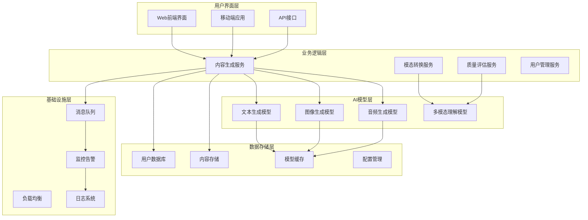

# 5.3 多模态内容生成器

## 5.3.1 项目概述

### 项目目标

多模态内容生成器是一个集成了文本、图像、音频生成能力的AI应用系统。该项目旨在展示如何将多种生成式AI模型整合到一个统一的平台中，为用户提供丰富的内容创作工具。

**核心功能**:
- 📝 智能文本生成（文章、故事、诗歌等）
- 🎨 AI图像生成（基于文本描述）
- 🎵 音频内容生成（语音合成、音乐生成）
- 🔄 跨模态转换（文本转图像、图像转文本等）
- 📊 内容质量评估和优化建议

**预期效果**:
- 提供一站式内容创作解决方案
- 支持多种创作场景和用户需求
- 实现高质量的多模态内容生成
- 提供直观易用的用户界面

### 业务场景分析

**目标用户**:
- 内容创作者（博主、作家、设计师）
- 营销人员（广告文案、视觉设计）
- 教育工作者（课件制作、教学资源）
- 企业用户（品牌宣传、产品介绍）

**应用场景**:
1. **创意写作**: 小说、诗歌、剧本创作辅助
2. **营销内容**: 广告文案、产品描述、宣传海报
3. **教育资源**: 教学材料、课件插图、解说音频
4. **社交媒体**: 帖子配图、短视频脚本、背景音乐
5. **企业应用**: 报告配图、演示文稿、培训材料

## 5.3.2 系统架构设计

### 整体架构



### 核心模块说明

**1. 内容生成服务**
- 统一的内容生成接口
- 支持多种生成模式和参数配置
- 异步处理和任务队列管理
- 生成结果的后处理和优化

**2. 模态转换服务**
- 文本到图像的转换
- 图像到文本的描述生成
- 文本到语音的合成
- 跨模态内容理解和分析

**3. 质量评估服务**
- 生成内容的质量评分
- 多维度评估指标
- 改进建议和优化方案
- 用户反馈收集和分析

### 技术选型

**后端技术栈**:
- **框架**: FastAPI + Python 3.9+
- **AI模型**: Transformers, Diffusers, TTS
- **数据库**: PostgreSQL + Redis
- **消息队列**: Celery + Redis
- **文件存储**: MinIO/AWS S3
- **监控**: Prometheus + Grafana

**前端技术栈**:
- **框架**: React 18 + TypeScript
- **UI组件**: Ant Design
- **状态管理**: Redux Toolkit
- **文件上传**: React Dropzone
- **图表可视化**: ECharts

**AI模型集成**:
- **文本生成**: GPT-3.5/4, Claude, LLaMA
- **图像生成**: DALL-E, Stable Diffusion, Midjourney API
- **语音合成**: Azure Speech, Google TTS, ElevenLabs
- **多模态**: CLIP, BLIP, GPT-4V

## 5.3.3 核心功能实现

### 文本生成服务

```python
# text_generation_service.py
from typing import Dict, List, Optional, Any
from dataclasses import dataclass
from enum import Enum
import openai
from transformers import pipeline, AutoTokenizer, AutoModelForCausalLM
import torch
from datetime import datetime
import asyncio
import json

class TextGenerationType(Enum):
    """文本生成类型"""
    ARTICLE = "article"
    STORY = "story"
    POEM = "poem"
    SCRIPT = "script"
    SUMMARY = "summary"
    TRANSLATION = "translation"
    CODE = "code"
    EMAIL = "email"

@dataclass
class TextGenerationRequest:
    """文本生成请求"""
    prompt: str
    generation_type: TextGenerationType
    max_length: int = 1000
    temperature: float = 0.7
    top_p: float = 0.9
    language: str = "zh-CN"
    style: Optional[str] = None
    context: Optional[Dict[str, Any]] = None

@dataclass
class TextGenerationResult:
    """文本生成结果"""
    generated_text: str
    prompt: str
    generation_type: TextGenerationType
    quality_score: float
    word_count: int
    processing_time: float
    model_used: str
    suggestions: List[str]
    timestamp: datetime

class TextGenerationService:
    """文本生成服务"""
    
    def __init__(self, config: Dict[str, Any]):
        self.config = config
        self.openai_client = openai.OpenAI(api_key=config.get('openai_api_key'))
        
        # 初始化本地模型（可选）
        self.local_models = {}
        if config.get('use_local_models', False):
            self._load_local_models()
        
        # 生成模板
        self.generation_templates = {
            TextGenerationType.ARTICLE: {
                'system_prompt': '你是一个专业的文章写作助手，擅长创作结构清晰、内容丰富的文章。',
                'user_template': '请根据以下主题写一篇文章：{prompt}\n\n要求：\n- 结构清晰，逻辑性强\n- 内容丰富，有深度\n- 语言流畅，易于理解\n- 字数控制在{max_length}字以内'
            },
            TextGenerationType.STORY: {
                'system_prompt': '你是一个富有想象力的故事创作者，擅长编写引人入胜的故事。',
                'user_template': '请根据以下提示创作一个故事：{prompt}\n\n要求：\n- 情节生动有趣\n- 人物形象鲜明\n- 语言生动形象\n- 字数控制在{max_length}字以内'
            },
            TextGenerationType.POEM: {
                'system_prompt': '你是一个诗歌创作专家，擅长创作各种风格的诗歌。',
                'user_template': '请根据以下主题创作一首诗：{prompt}\n\n要求：\n- 意境优美，情感真挚\n- 韵律和谐，朗朗上口\n- 语言精练，富有诗意\n- 长度适中'
            },
            TextGenerationType.SCRIPT: {
                'system_prompt': '你是一个剧本创作专家，擅长编写各种类型的剧本。',
                'user_template': '请根据以下情节创作一个剧本片段：{prompt}\n\n要求：\n- 对话自然流畅\n- 场景描述生动\n- 人物性格鲜明\n- 包含舞台指导'
            }
        }
    
    def _load_local_models(self):
        """加载本地模型"""
        try:
            # 加载中文文本生成模型
            model_name = "THUDM/chatglm3-6b"
            self.local_models['chatglm'] = {
                'tokenizer': AutoTokenizer.from_pretrained(model_name, trust_remote_code=True),
                'model': AutoModelForCausalLM.from_pretrained(
                    model_name, 
                    trust_remote_code=True,
                    torch_dtype=torch.float16,
                    device_map="auto"
                )
            }
            print("本地模型加载成功")
        except Exception as e:
            print(f"本地模型加载失败: {e}")
    
    async def generate_text(self, request: TextGenerationRequest) -> TextGenerationResult:
        """生成文本"""
        start_time = datetime.now()
        
        try:
            # 选择生成策略
            if self.config.get('prefer_openai', True):
                generated_text = await self._generate_with_openai(request)
                model_used = "OpenAI GPT"
            else:
                generated_text = await self._generate_with_local_model(request)
                model_used = "Local Model"
            
            # 后处理
            processed_text = self._post_process_text(generated_text, request)
            
            # 质量评估
            quality_score = await self._evaluate_text_quality(processed_text, request)
            
            # 生成建议
            suggestions = await self._generate_suggestions(processed_text, request)
            
            processing_time = (datetime.now() - start_time).total_seconds()
            
            return TextGenerationResult(
                generated_text=processed_text,
                prompt=request.prompt,
                generation_type=request.generation_type,
                quality_score=quality_score,
                word_count=len(processed_text),
                processing_time=processing_time,
                model_used=model_used,
                suggestions=suggestions,
                timestamp=datetime.now()
            )
            
        except Exception as e:
            print(f"文本生成失败: {e}")
            raise
    
    async def _generate_with_openai(self, request: TextGenerationRequest) -> str:
        """使用OpenAI API生成文本"""
        template = self.generation_templates.get(request.generation_type)
        if not template:
            template = {
                'system_prompt': '你是一个专业的内容创作助手。',
                'user_template': '{prompt}'
            }
        
        messages = [
            {"role": "system", "content": template['system_prompt']},
            {"role": "user", "content": template['user_template'].format(
                prompt=request.prompt,
                max_length=request.max_length
            )}
        ]
        
        response = await asyncio.to_thread(
            self.openai_client.chat.completions.create,
            model="gpt-3.5-turbo",
            messages=messages,
            max_tokens=min(request.max_length * 2, 4000),
            temperature=request.temperature,
            top_p=request.top_p
        )
        
        return response.choices[0].message.content
    
    async def _generate_with_local_model(self, request: TextGenerationRequest) -> str:
        """使用本地模型生成文本"""
        if 'chatglm' not in self.local_models:
            raise ValueError("本地模型未加载")
        
        model_info = self.local_models['chatglm']
        tokenizer = model_info['tokenizer']
        model = model_info['model']
        
        # 构建提示
        template = self.generation_templates.get(request.generation_type, {})
        system_prompt = template.get('system_prompt', '你是一个专业的内容创作助手。')
        user_prompt = template.get('user_template', '{prompt}').format(
            prompt=request.prompt,
            max_length=request.max_length
        )
        
        full_prompt = f"{system_prompt}\n\n{user_prompt}"
        
        # 生成文本
        def generate():
            inputs = tokenizer.encode(full_prompt, return_tensors="pt")
            with torch.no_grad():
                outputs = model.generate(
                    inputs,
                    max_length=len(inputs[0]) + request.max_length,
                    temperature=request.temperature,
                    top_p=request.top_p,
                    do_sample=True,
                    pad_token_id=tokenizer.eos_token_id
                )
            
            generated_text = tokenizer.decode(outputs[0], skip_special_tokens=True)
            # 移除原始提示部分
            return generated_text[len(full_prompt):].strip()
        
        return await asyncio.to_thread(generate)
    
    def _post_process_text(self, text: str, request: TextGenerationRequest) -> str:
        """文本后处理"""
        # 清理文本
        text = text.strip()
        
        # 根据生成类型进行特定处理
        if request.generation_type == TextGenerationType.POEM:
            # 诗歌格式化
            lines = text.split('\n')
            formatted_lines = [line.strip() for line in lines if line.strip()]
            text = '\n'.join(formatted_lines)
        
        elif request.generation_type == TextGenerationType.SCRIPT:
            # 剧本格式化
            text = self._format_script(text)
        
        # 长度控制
        if len(text) > request.max_length:
            # 智能截断，保持完整性
            text = self._smart_truncate(text, request.max_length)
        
        return text
    
    def _format_script(self, text: str) -> str:
        """格式化剧本"""
        lines = text.split('\n')
        formatted_lines = []
        
        for line in lines:
            line = line.strip()
            if not line:
                continue
            
            # 识别对话和舞台指导
            if line.startswith('(') and line.endswith(')'):
                # 舞台指导
                formatted_lines.append(f"    {line}")
            elif ':' in line:
                # 对话
                parts = line.split(':', 1)
                character = parts[0].strip()
                dialogue = parts[1].strip()
                formatted_lines.append(f"{character.upper()}: {dialogue}")
            else:
                formatted_lines.append(line)
        
        return '\n'.join(formatted_lines)
    
    def _smart_truncate(self, text: str, max_length: int) -> str:
        """智能截断文本"""
        if len(text) <= max_length:
            return text
        
        # 尝试在句号处截断
        truncated = text[:max_length]
        last_period = truncated.rfind('。')
        
        if last_period > max_length * 0.8:  # 如果句号位置合理
            return text[:last_period + 1]
        
        # 否则在最后一个完整词处截断
        last_space = truncated.rfind(' ')
        if last_space > max_length * 0.9:
            return text[:last_space] + '...'
        
        return text[:max_length - 3] + '...'
    
    async def _evaluate_text_quality(self, text: str, request: TextGenerationRequest) -> float:
        """评估文本质量"""
        quality_score = 0.0
        
        # 基础指标
        if len(text) > 50:  # 长度合理
            quality_score += 0.2
        
        if len(text.split()) > 10:  # 词汇丰富度
            quality_score += 0.2
        
        # 结构完整性
        if request.generation_type == TextGenerationType.ARTICLE:
            if '\n' in text:  # 有段落结构
                quality_score += 0.2
        
        elif request.generation_type == TextGenerationType.POEM:
            lines = text.split('\n')
            if len(lines) >= 4:  # 诗歌行数合理
                quality_score += 0.2
        
        # 语言流畅度（简化评估）
        sentences = text.split('。')
        if len(sentences) >= 3:  # 句子数量合理
            quality_score += 0.2
        
        # 内容相关性（基于关键词匹配）
        prompt_keywords = set(request.prompt.split())
        text_keywords = set(text.split())
        relevance = len(prompt_keywords & text_keywords) / len(prompt_keywords) if prompt_keywords else 0
        quality_score += relevance * 0.2
        
        return min(quality_score, 1.0)
    
    async def _generate_suggestions(self, text: str, request: TextGenerationRequest) -> List[str]:
        """生成改进建议"""
        suggestions = []
        
        # 长度建议
        if len(text) < request.max_length * 0.5:
            suggestions.append("内容可以更加丰富详细")
        elif len(text) > request.max_length * 0.9:
            suggestions.append("内容较长，可以适当精简")
        
        # 结构建议
        if request.generation_type == TextGenerationType.ARTICLE:
            if text.count('\n') < 2:
                suggestions.append("建议增加段落结构，提高可读性")
        
        # 语言建议
        if text.count('，') / len(text) > 0.05:
            suggestions.append("句子可以更加简洁明了")
        
        # 内容建议
        if request.generation_type == TextGenerationType.STORY:
            if '对话' not in text and '"' not in text:
                suggestions.append("可以增加人物对话，使故事更生动")
        
        return suggestions[:3]  # 最多返回3个建议
    
    async def batch_generate(self, requests: List[TextGenerationRequest]) -> List[TextGenerationResult]:
        """批量生成文本"""
        tasks = [self.generate_text(request) for request in requests]
        results = await asyncio.gather(*tasks, return_exceptions=True)
        
        # 处理异常结果
        processed_results = []
        for i, result in enumerate(results):
            if isinstance(result, Exception):
                print(f"批量生成第{i+1}个请求失败: {result}")
                # 创建错误结果
                error_result = TextGenerationResult(
                    generated_text=f"生成失败: {str(result)}",
                    prompt=requests[i].prompt,
                    generation_type=requests[i].generation_type,
                    quality_score=0.0,
                    word_count=0,
                    processing_time=0.0,
                    model_used="Error",
                    suggestions=["请检查输入参数或稍后重试"],
                    timestamp=datetime.now()
                )
                processed_results.append(error_result)
            else:
                processed_results.append(result)
        
        return processed_results
```

### 音频生成服务

```python
# audio_generation_service.py
from typing import Dict, List, Optional, Any, Union
from dataclasses import dataclass
from enum import Enum
import requests
import base64
from datetime import datetime
import asyncio
import aiohttp
import io
import wave
import numpy as np
from pydub import AudioSegment
from pydub.effects import normalize
import torch
from transformers import SpeechT5Processor, SpeechT5ForTextToSpeech, SpeechT5HifiGan
from datasets import load_dataset

class AudioType(Enum):
    """音频类型"""
    SPEECH = "speech"
    MUSIC = "music"
    SOUND_EFFECT = "sound_effect"
    NARRATION = "narration"
    PODCAST = "podcast"

class VoiceStyle(Enum):
    """语音风格"""
    NATURAL = "natural"
    PROFESSIONAL = "professional"
    CASUAL = "casual"
    DRAMATIC = "dramatic"
    CHEERFUL = "cheerful"
    CALM = "calm"
    ENERGETIC = "energetic"

@dataclass
class AudioGenerationRequest:
    """音频生成请求"""
    text: str
    audio_type: AudioType = AudioType.SPEECH
    voice_style: VoiceStyle = VoiceStyle.NATURAL
    language: str = "zh-CN"
    speed: float = 1.0  # 语速倍率
    pitch: float = 1.0  # 音调倍率
    volume: float = 1.0  # 音量倍率
    background_music: Optional[str] = None
    output_format: str = "mp3"
    sample_rate: int = 22050

@dataclass
class AudioGenerationResult:
    """音频生成结果"""
    audio_data: bytes
    text: str
    audio_type: AudioType
    voice_style: VoiceStyle
    duration: float  # 音频时长（秒）
    file_size: int  # 文件大小（字节）
    generation_time: float
    model_used: str
    quality_score: float
    suggestions: List[str]
    timestamp: datetime

class AudioGenerationService:
    """音频生成服务"""
    
    def __init__(self, config: Dict[str, Any]):
        self.config = config
        
        # API配置
        self.azure_speech_key = config.get('azure_speech_key')
        self.azure_region = config.get('azure_region', 'eastus')
        self.elevenlabs_api_key = config.get('elevenlabs_api_key')
        
        # 本地TTS模型
        self.local_tts_model = None
        self.local_processor = None
        self.local_vocoder = None
        
        if config.get('use_local_tts', False):
            self._load_local_tts_model()
        
        # 语音风格配置
        self.voice_configs = {
            VoiceStyle.NATURAL: {
                'azure_voice': 'zh-CN-XiaoxiaoNeural',
                'elevenlabs_voice': 'Bella',
                'speed': 1.0,
                'pitch': 1.0
            },
            VoiceStyle.PROFESSIONAL: {
                'azure_voice': 'zh-CN-YunxiNeural',
                'elevenlabs_voice': 'Josh',
                'speed': 0.9,
                'pitch': 0.95
            },
            VoiceStyle.CASUAL: {
                'azure_voice': 'zh-CN-XiaoyiNeural',
                'elevenlabs_voice': 'Antoni',
                'speed': 1.1,
                'pitch': 1.05
            },
            VoiceStyle.DRAMATIC: {
                'azure_voice': 'zh-CN-YunyangNeural',
                'elevenlabs_voice': 'Arnold',
                'speed': 0.8,
                'pitch': 0.9
            }
        }
    
    def _load_local_tts_model(self):
        """加载本地TTS模型"""
        try:
            # 使用SpeechT5模型
            model_name = "microsoft/speecht5_tts"
            
            self.local_processor = SpeechT5Processor.from_pretrained(model_name)
            self.local_tts_model = SpeechT5ForTextToSpeech.from_pretrained(model_name)
            self.local_vocoder = SpeechT5HifiGan.from_pretrained("microsoft/speecht5_hifigan")
            
            # 加载说话人嵌入
            embeddings_dataset = load_dataset("Matthijs/cmu-arctic-xvectors", split="validation")
            self.speaker_embeddings = torch.tensor(embeddings_dataset[7306]["xvector"]).unsqueeze(0)
            
            print("本地TTS模型加载成功")
            
        except Exception as e:
            print(f"本地TTS模型加载失败: {e}")
            self.local_tts_model = None
    
    async def generate_audio(self, request: AudioGenerationRequest) -> AudioGenerationResult:
        """生成音频"""
        start_time = datetime.now()
        
        try:
            # 选择生成方法
            if request.audio_type == AudioType.SPEECH:
                if self.elevenlabs_api_key and self.config.get('prefer_elevenlabs', False):
                    audio_data = await self._generate_with_elevenlabs(request)
                    model_used = "ElevenLabs"
                elif self.azure_speech_key:
                    audio_data = await self._generate_with_azure(request)
                    model_used = "Azure Speech"
                elif self.local_tts_model:
                    audio_data = await self._generate_with_local_tts(request)
                    model_used = "Local SpeechT5"
                else:
                    raise ValueError("没有可用的语音合成服务")
            
            elif request.audio_type == AudioType.MUSIC:
                audio_data = await self._generate_music(request)
                model_used = "Music Generation"
            
            else:
                raise ValueError(f"不支持的音频类型: {request.audio_type}")
            
            # 后处理音频
            processed_audio = self._post_process_audio(audio_data, request)
            
            # 计算音频信息
            duration = self._get_audio_duration(processed_audio)
            file_size = len(processed_audio)
            
            # 质量评估
            quality_score = await self._evaluate_audio_quality(processed_audio, request)
            
            # 生成建议
            suggestions = await self._generate_audio_suggestions(request, quality_score)
            
            generation_time = (datetime.now() - start_time).total_seconds()
            
            return AudioGenerationResult(
                audio_data=processed_audio,
                text=request.text,
                audio_type=request.audio_type,
                voice_style=request.voice_style,
                duration=duration,
                file_size=file_size,
                generation_time=generation_time,
                model_used=model_used,
                quality_score=quality_score,
                suggestions=suggestions,
                timestamp=datetime.now()
            )
            
        except Exception as e:
            print(f"音频生成失败: {e}")
            raise
```

### 系统集成与API设计

```python
# main.py - 多模态内容生成器主服务
from fastapi import FastAPI, HTTPException, UploadFile, File, Form
from fastapi.middleware.cors import CORSMiddleware
from fastapi.responses import StreamingResponse, JSONResponse
from pydantic import BaseModel
from typing import List, Optional, Dict, Any
import asyncio
import io
import json
from datetime import datetime
import uuid

# 导入服务
from .text_generation_service import (
    TextGenerationService, TextGenerationRequest, TextGenerationType
)
from .image_generation_service import (
    ImageGenerationService, ImageGenerationRequest, ImageStyle, ImageSize
)
from .audio_generation_service import (
    AudioGenerationService, AudioGenerationRequest, AudioType, VoiceStyle
)
from .multimodal_conversion_service import (
    MultimodalConversionService, ConversionRequest, ConversionType
)

app = FastAPI(
    title="多模态内容生成器",
    description="集成文本、图像、音频生成和跨模态转换的AI内容创作平台",
    version="1.0.0"
)

# 配置CORS
app.add_middleware(
    CORSMiddleware,
    allow_origins=["*"],
    allow_credentials=True,
    allow_methods=["*"],
    allow_headers=["*"],
)

# 全局配置
config = {
    'openai_api_key': 'your-openai-key',
    'stability_api_key': 'your-stability-key',
    'azure_speech_key': 'your-azure-key',
    'azure_region': 'eastus',
    'elevenlabs_api_key': 'your-elevenlabs-key',
    'use_local_models': True,
    'prefer_openai': True,
    'prefer_elevenlabs': False
}

# 初始化服务
text_service = TextGenerationService(config)
image_service = ImageGenerationService(config)
audio_service = AudioGenerationService(config)
conversion_service = MultimodalConversionService(config)

# 请求模型
class TextGenerationRequestModel(BaseModel):
    prompt: str
    generation_type: str = "article"
    max_length: int = 1000
    temperature: float = 0.7
    language: str = "zh-CN"
    style: Optional[str] = None

class ImageGenerationRequestModel(BaseModel):
    prompt: str
    negative_prompt: Optional[str] = None
    style: str = "realistic"
    size: str = "square_512"
    num_images: int = 1
    guidance_scale: float = 7.5
    num_inference_steps: int = 50

class AudioGenerationRequestModel(BaseModel):
    text: str
    audio_type: str = "speech"
    voice_style: str = "natural"
    language: str = "zh-CN"
    speed: float = 1.0
    pitch: float = 1.0
    volume: float = 1.0

class ConversionRequestModel(BaseModel):
    conversion_type: str
    target_language: str = "zh-CN"
    quality_level: str = "high"

# 任务管理
active_tasks = {}

@app.get("/")
async def root():
    return {
        "message": "多模态内容生成器API",
        "version": "1.0.0",
        "services": ["文本生成", "图像生成", "音频生成", "模态转换"]
    }

# 文本生成接口
@app.post("/api/generate/text")
async def generate_text(request: TextGenerationRequestModel):
    """生成文本内容"""
    try:
        # 转换请求
        gen_request = TextGenerationRequest(
            prompt=request.prompt,
            generation_type=TextGenerationType(request.generation_type),
            max_length=request.max_length,
            temperature=request.temperature,
            language=request.language,
            style=request.style
        )
        
        # 生成文本
        result = await text_service.generate_text(gen_request)
        
        return {
            "success": True,
            "data": {
                "generated_text": result.generated_text,
                "quality_score": result.quality_score,
                "word_count": result.word_count,
                "processing_time": result.processing_time,
                "model_used": result.model_used,
                "suggestions": result.suggestions
            }
        }
        
    except Exception as e:
        raise HTTPException(status_code=500, detail=str(e))

# 图像生成接口
@app.post("/api/generate/image")
async def generate_image(request: ImageGenerationRequestModel):
    """生成图像内容"""
    try:
        # 转换请求
        gen_request = ImageGenerationRequest(
            prompt=request.prompt,
            negative_prompt=request.negative_prompt,
            style=ImageStyle(request.style),
            size=ImageSize[request.size.upper()],
            num_images=request.num_images,
            guidance_scale=request.guidance_scale,
            num_inference_steps=request.num_inference_steps
        )
        
        # 生成图像
        result = await image_service.generate_images(gen_request)
        
        # 转换为base64
        import base64
        images_b64 = [base64.b64encode(img).decode('utf-8') for img in result.images]
        
        return {
            "success": True,
            "data": {
                "images": images_b64,
                "enhanced_prompt": result.enhanced_prompt,
                "quality_score": result.quality_score,
                "generation_time": result.generation_time,
                "model_used": result.model_used,
                "suggestions": result.suggestions
            }
        }
        
    except Exception as e:
        raise HTTPException(status_code=500, detail=str(e))

# 音频生成接口
@app.post("/api/generate/audio")
async def generate_audio(request: AudioGenerationRequestModel):
    """生成音频内容"""
    try:
        # 转换请求
        gen_request = AudioGenerationRequest(
            text=request.text,
            audio_type=AudioType(request.audio_type),
            voice_style=VoiceStyle(request.voice_style),
            language=request.language,
            speed=request.speed,
            pitch=request.pitch,
            volume=request.volume
        )
        
        # 生成音频
        result = await audio_service.generate_audio(gen_request)
        
        # 返回音频流
        def generate_audio_stream():
            yield result.audio_data
        
        return StreamingResponse(
            io.BytesIO(result.audio_data),
            media_type="audio/mpeg",
            headers={
                "Content-Disposition": "attachment; filename=generated_audio.mp3",
                "X-Duration": str(result.duration),
                "X-Quality-Score": str(result.quality_score),
                "X-Model-Used": result.model_used
            }
        )
        
    except Exception as e:
        raise HTTPException(status_code=500, detail=str(e))

# 模态转换接口
@app.post("/api/convert/{conversion_type}")
async def convert_content(
    conversion_type: str,
    request: ConversionRequestModel,
    file: Optional[UploadFile] = File(None),
    text: Optional[str] = Form(None)
):
    """跨模态内容转换"""
    try:
        # 准备源数据
        if file:
            source_data = await file.read()
        elif text:
            source_data = text
        else:
            raise HTTPException(status_code=400, detail="需要提供文件或文本数据")
        
        # 转换请求
        conv_request = ConversionRequest(
            conversion_type=ConversionType(conversion_type),
            source_data=source_data,
            target_language=request.target_language,
            quality_level=request.quality_level
        )
        
        # 执行转换
        result = await conversion_service.convert(conv_request)
        
        # 根据转换类型返回结果
        if conversion_type.endswith('_to_text'):
            return {
                "success": True,
                "data": {
                    "text": result.target_data,
                    "confidence_score": result.confidence_score,
                    "processing_time": result.processing_time,
                    "model_used": result.model_used,
                    "metadata": result.metadata
                }
            }
        
        elif conversion_type.endswith('_to_image'):
            import base64
            image_b64 = base64.b64encode(result.target_data).decode('utf-8')
            return {
                "success": True,
                "data": {
                    "image": image_b64,
                    "confidence_score": result.confidence_score,
                    "processing_time": result.processing_time,
                    "model_used": result.model_used,
                    "metadata": result.metadata
                }
            }
        
        elif conversion_type.endswith('_to_audio'):
            return StreamingResponse(
                io.BytesIO(result.target_data),
                media_type="audio/mpeg",
                headers={
                    "Content-Disposition": "attachment; filename=converted_audio.mp3",
                    "X-Confidence-Score": str(result.confidence_score),
                    "X-Model-Used": result.model_used
                }
            )
        
    except Exception as e:
        raise HTTPException(status_code=500, detail=str(e))

# 批量处理接口
@app.post("/api/batch/text")
async def batch_generate_text(requests: List[TextGenerationRequestModel]):
    """批量生成文本"""
    try:
        # 转换请求
        gen_requests = [
            TextGenerationRequest(
                prompt=req.prompt,
                generation_type=TextGenerationType(req.generation_type),
                max_length=req.max_length,
                temperature=req.temperature,
                language=req.language,
                style=req.style
            )
            for req in requests
        ]
        
        # 批量生成
        results = await text_service.batch_generate(gen_requests)
        
        return {
            "success": True,
            "data": [
                {
                    "generated_text": result.generated_text,
                    "quality_score": result.quality_score,
                    "word_count": result.word_count,
                    "processing_time": result.processing_time,
                    "model_used": result.model_used,
                    "suggestions": result.suggestions
                }
                for result in results
            ]
        }
        
    except Exception as e:
        raise HTTPException(status_code=500, detail=str(e))

# 任务状态查询
@app.get("/api/task/{task_id}")
async def get_task_status(task_id: str):
    """查询任务状态"""
    if task_id not in active_tasks:
        raise HTTPException(status_code=404, detail="任务不存在")
    
    return active_tasks[task_id]

# 健康检查
@app.get("/health")
async def health_check():
    return {
        "status": "healthy",
        "timestamp": datetime.now().isoformat(),
        "services": {
            "text_generation": "active",
            "image_generation": "active",
            "audio_generation": "active",
            "multimodal_conversion": "active"
        }
    }

if __name__ == "__main__":
    import uvicorn
    uvicorn.run(app, host="0.0.0.0", port=8000)
```

## Trae AI实践指南

### 环境准备

在Trae中创建多模态内容生成器项目：

```bash
# 创建项目目录
mkdir multimodal_content_generator
cd multimodal_content_generator

# 创建虚拟环境
python -m venv venv
source venv/bin/activate  # Windows: venv\Scripts\activate

# 安装依赖
pip install fastapi uvicorn
pip install openai stability-sdk
pip install azure-cognitiveservices-speech
pip install elevenlabs
pip install torch torchvision torchaudio
pip install transformers datasets
pip install pillow opencv-python
pip install pydub numpy
pip install streamlit
pip install aiohttp requests
```

### 项目结构

```
multimodal_content_generator/
├── services/
│   ├── __init__.py
│   ├── text_generation_service.py
│   ├── image_generation_service.py
│   ├── audio_generation_service.py
│   └── multimodal_conversion_service.py
├── models/
│   ├── __init__.py
│   └── data_models.py
├── utils/
│   ├── __init__.py
│   ├── config.py
│   └── helpers.py
├── web/
│   ├── streamlit_app.py
│   └── static/
├── main.py
├── requirements.txt
└── README.md
```

### 在Trae中运行项目

1. **配置API密钥**：
```python
# config.py
import os
from typing import Dict, Any

def get_config() -> Dict[str, Any]:
    return {
        'openai_api_key': os.getenv('OPENAI_API_KEY'),
        'stability_api_key': os.getenv('STABILITY_API_KEY'),
        'azure_speech_key': os.getenv('AZURE_SPEECH_KEY'),
        'azure_region': os.getenv('AZURE_REGION', 'eastus'),
        'elevenlabs_api_key': os.getenv('ELEVENLABS_API_KEY'),
        'use_local_models': True,
        'prefer_openai': True,
        'prefer_elevenlabs': False
    }
```

2. **启动FastAPI服务**：
```bash
# 在Trae终端中运行
uvicorn main:app --host 0.0.0.0 --port 8000 --reload
```

3. **启动Streamlit界面**：
```bash
# 新开终端运行
streamlit run web/streamlit_app.py --server.port 8501
```

### Streamlit用户界面

```python
# web/streamlit_app.py
import streamlit as st
import requests
import base64
import io
from PIL import Image
import json

st.set_page_config(
    page_title="多模态内容生成器",
    page_icon="🎨",
    layout="wide"
)

st.title("🎨 多模态内容生成器")
st.markdown("集成文本、图像、音频生成和跨模态转换的AI内容创作平台")

# 侧边栏配置
st.sidebar.title("⚙️ 配置")
api_base_url = st.sidebar.text_input("API地址", "http://localhost:8000")

# 主界面选项卡
tab1, tab2, tab3, tab4 = st.tabs(["📝 文本生成", "🖼️ 图像生成", "🎵 音频生成", "🔄 模态转换"])

# 文本生成选项卡
with tab1:
    st.header("📝 文本内容生成")
    
    col1, col2 = st.columns([2, 1])
    
    with col1:
        text_prompt = st.text_area("输入提示词", height=100, placeholder="请输入您想要生成的文本内容描述...")
        
    with col2:
        generation_type = st.selectbox(
            "生成类型",
            ["article", "story", "poem", "dialogue", "summary", "email", "code"]
        )
        max_length = st.slider("最大长度", 100, 2000, 1000)
        temperature = st.slider("创造性", 0.1, 1.0, 0.7)
        language = st.selectbox("语言", ["zh-CN", "en-US", "ja-JP"])
    
    if st.button("🚀 生成文本", type="primary"):
        if text_prompt:
            with st.spinner("正在生成文本..."):
                try:
                    response = requests.post(
                        f"{api_base_url}/api/generate/text",
                        json={
                            "prompt": text_prompt,
                            "generation_type": generation_type,
                            "max_length": max_length,
                            "temperature": temperature,
                            "language": language
                        }
                    )
                    
                    if response.status_code == 200:
                        result = response.json()
                        data = result["data"]
                        
                        st.success("✅ 文本生成完成！")
                        
                        # 显示生成结果
                        st.subheader("生成结果")
                        st.write(data["generated_text"])
                        
                        # 显示统计信息
                        col1, col2, col3, col4 = st.columns(4)
                        with col1:
                            st.metric("质量评分", f"{data['quality_score']:.2f}")
                        with col2:
                            st.metric("字数", data["word_count"])
                        with col3:
                            st.metric("处理时间", f"{data['processing_time']:.2f}s")
                        with col4:
                            st.metric("使用模型", data["model_used"])
                        
                        # 显示建议
                        if data["suggestions"]:
                            st.subheader("💡 改进建议")
                            for suggestion in data["suggestions"]:
                                st.info(suggestion)
                    
                    else:
                        st.error(f"生成失败: {response.text}")
                        
                except Exception as e:
                    st.error(f"请求失败: {str(e)}")
        else:
            st.warning("请输入提示词")

# 图像生成选项卡
with tab2:
    st.header("🖼️ 图像内容生成")
    
    col1, col2 = st.columns([2, 1])
    
    with col1:
        image_prompt = st.text_area("图像描述", height=100, placeholder="请描述您想要生成的图像...")
        negative_prompt = st.text_input("负面提示词", placeholder="不希望出现的内容...")
        
    with col2:
        image_style = st.selectbox(
            "图像风格",
            ["realistic", "artistic", "cartoon", "abstract", "photographic"]
        )
        image_size = st.selectbox(
            "图像尺寸",
            ["square_512", "portrait_768", "landscape_768", "square_1024"]
        )
        num_images = st.slider("生成数量", 1, 4, 1)
        guidance_scale = st.slider("引导强度", 1.0, 20.0, 7.5)
    
    if st.button("🎨 生成图像", type="primary"):
        if image_prompt:
            with st.spinner("正在生成图像..."):
                try:
                    response = requests.post(
                        f"{api_base_url}/api/generate/image",
                        json={
                            "prompt": image_prompt,
                            "negative_prompt": negative_prompt,
                            "style": image_style,
                            "size": image_size,
                            "num_images": num_images,
                            "guidance_scale": guidance_scale
                        }
                    )
                    
                    if response.status_code == 200:
                        result = response.json()
                        data = result["data"]
                        
                        st.success("✅ 图像生成完成！")
                        
                        # 显示生成的图像
                        st.subheader("生成结果")
                        
                        cols = st.columns(min(num_images, 3))
                        for i, image_b64 in enumerate(data["images"]):
                            image_data = base64.b64decode(image_b64)
                            image = Image.open(io.BytesIO(image_data))
                            
                            with cols[i % 3]:
                                st.image(image, caption=f"图像 {i+1}", use_column_width=True)
                                
                                # 下载按钮
                                st.download_button(
                                    label=f"下载图像 {i+1}",
                                    data=image_data,
                                    file_name=f"generated_image_{i+1}.png",
                                    mime="image/png"
                                )
                        
                        # 显示统计信息
                        col1, col2, col3 = st.columns(3)
                        with col1:
                            st.metric("质量评分", f"{data['quality_score']:.2f}")
                        with col2:
                            st.metric("生成时间", f"{data['generation_time']:.2f}s")
                        with col3:
                            st.metric("使用模型", data["model_used"])
                        
                        # 显示增强提示词
                        st.subheader("🔧 增强提示词")
                        st.code(data["enhanced_prompt"])
                        
                        # 显示建议
                        if data["suggestions"]:
                            st.subheader("💡 改进建议")
                            for suggestion in data["suggestions"]:
                                st.info(suggestion)
                    
                    else:
                        st.error(f"生成失败: {response.text}")
                        
                except Exception as e:
                    st.error(f"请求失败: {str(e)}")
        else:
            st.warning("请输入图像描述")

# 音频生成选项卡
with tab3:
    st.header("🎵 音频内容生成")
    
    col1, col2 = st.columns([2, 1])
    
    with col1:
        audio_text = st.text_area("文本内容", height=150, placeholder="请输入要转换为语音的文本...")
        
    with col2:
        audio_type = st.selectbox(
            "音频类型",
            ["speech", "narration", "podcast"]
        )
        voice_style = st.selectbox(
            "语音风格",
            ["natural", "professional", "casual", "dramatic", "cheerful"]
        )
        audio_language = st.selectbox("语言", ["zh-CN", "en-US", "ja-JP"])
        speed = st.slider("语速", 0.5, 2.0, 1.0)
        pitch = st.slider("音调", 0.5, 2.0, 1.0)
    
    if st.button("🎤 生成音频", type="primary"):
        if audio_text:
            with st.spinner("正在生成音频..."):
                try:
                    response = requests.post(
                        f"{api_base_url}/api/generate/audio",
                        json={
                            "text": audio_text,
                            "audio_type": audio_type,
                            "voice_style": voice_style,
                            "language": audio_language,
                            "speed": speed,
                            "pitch": pitch
                        }
                    )
                    
                    if response.status_code == 200:
                        st.success("✅ 音频生成完成！")
                        
                        # 播放音频
                        st.subheader("生成结果")
                        st.audio(response.content, format="audio/mp3")
                        
                        # 下载按钮
                        st.download_button(
                            label="📥 下载音频",
                            data=response.content,
                            file_name="generated_audio.mp3",
                            mime="audio/mp3"
                        )
                        
                        # 显示音频信息
                        headers = response.headers
                        col1, col2, col3 = st.columns(3)
                        with col1:
                            if 'X-Duration' in headers:
                                st.metric("时长", f"{float(headers['X-Duration']):.1f}s")
                        with col2:
                            if 'X-Quality-Score' in headers:
                                st.metric("质量评分", f"{float(headers['X-Quality-Score']):.2f}")
                        with col3:
                            if 'X-Model-Used' in headers:
                                st.metric("使用模型", headers['X-Model-Used'])
                    
                    else:
                        st.error(f"生成失败: {response.text}")
                        
                except Exception as e:
                    st.error(f"请求失败: {str(e)}")
        else:
            st.warning("请输入文本内容")

# 模态转换选项卡
with tab4:
    st.header("🔄 跨模态内容转换")
    
    conversion_type = st.selectbox(
        "转换类型",
        [
            "text_to_image", "image_to_text",
            "text_to_audio", "audio_to_text",
            "image_to_audio", "audio_to_image"
        ]
    )
    
    col1, col2 = st.columns([2, 1])
    
    with col1:
        if conversion_type.startswith('text_'):
            source_text = st.text_area("源文本", height=150, placeholder="请输入要转换的文本...")
            source_file = None
        else:
            source_text = None
            file_types = {
                'image_': ['png', 'jpg', 'jpeg', 'gif'],
                'audio_': ['mp3', 'wav', 'ogg', 'm4a']
            }
            
            file_type = next(k for k in file_types.keys() if conversion_type.startswith(k))
            source_file = st.file_uploader(
                "上传文件",
                type=file_types[file_type]
            )
    
    with col2:
        target_language = st.selectbox("目标语言", ["zh-CN", "en-US", "ja-JP"])
        quality_level = st.selectbox("质量级别", ["high", "medium", "low"])
    
    if st.button("🔄 开始转换", type="primary"):
        if (source_text and conversion_type.startswith('text_')) or (source_file and not conversion_type.startswith('text_')):
            with st.spinner("正在转换..."):
                try:
                    # 准备请求数据
                    files = {}
                    data = {
                        "target_language": target_language,
                        "quality_level": quality_level
                    }
                    
                    if source_file:
                        files["file"] = source_file
                    if source_text:
                        data["text"] = source_text
                    
                    response = requests.post(
                        f"{api_base_url}/api/convert/{conversion_type}",
                        files=files if files else None,
                        data=data
                    )
                    
                    if response.status_code == 200:
                        st.success("✅ 转换完成！")
                        
                        # 根据转换类型显示结果
                        if conversion_type.endswith('_to_text'):
                            result = response.json()
                            data = result["data"]
                            
                            st.subheader("转换结果")
                            st.write(data["text"])
                            
                            # 显示统计信息
                            col1, col2, col3 = st.columns(3)
                            with col1:
                                st.metric("置信度", f"{data['confidence_score']:.2f}")
                            with col2:
                                st.metric("处理时间", f"{data['processing_time']:.2f}s")
                            with col3:
                                st.metric("使用模型", data["model_used"])
                        
                        elif conversion_type.endswith('_to_image'):
                            result = response.json()
                            data = result["data"]
                            
                            # 显示图像
                            image_data = base64.b64decode(data["image"])
                            image = Image.open(io.BytesIO(image_data))
                            
                            st.subheader("转换结果")
                            st.image(image, use_column_width=True)
                            
                            # 下载按钮
                            st.download_button(
                                label="📥 下载图像",
                                data=image_data,
                                file_name="converted_image.png",
                                mime="image/png"
                            )
                        
                        elif conversion_type.endswith('_to_audio'):
                            st.subheader("转换结果")
                            st.audio(response.content, format="audio/mp3")
                            
                            # 下载按钮
                            st.download_button(
                                label="📥 下载音频",
                                data=response.content,
                                file_name="converted_audio.mp3",
                                mime="audio/mp3"
                            )
                    
                    else:
                        st.error(f"转换失败: {response.text}")
                        
                except Exception as e:
                    st.error(f"请求失败: {str(e)}")
        else:
            st.warning("请提供源内容")

# 页脚
st.markdown("---")
st.markdown(
    """
    <div style='text-align: center'>
        <p>🎨 多模态内容生成器 | 基于大语言模型的AI内容创作平台</p>
        <p>支持文本、图像、音频生成和跨模态转换</p>
    </div>
    """,
    unsafe_allow_html=True
)
```

### 测试和调试

在Trae中进行项目测试：

```python
# test_services.py
import asyncio
import pytest
from services.text_generation_service import TextGenerationService, TextGenerationRequest, TextGenerationType
from services.image_generation_service import ImageGenerationService, ImageGenerationRequest, ImageStyle
from services.audio_generation_service import AudioGenerationService, AudioGenerationRequest, AudioType

@pytest.fixture
def config():
    return {
        'openai_api_key': 'test-key',
        'use_local_models': True,
        'prefer_openai': False
    }

@pytest.mark.asyncio
async def test_text_generation(config):
    service = TextGenerationService(config)
    request = TextGenerationRequest(
        prompt="写一篇关于人工智能的文章",
        generation_type=TextGenerationType.ARTICLE,
        max_length=500
    )
    
    result = await service.generate_text(request)
    assert result.generated_text
    assert result.quality_score > 0
    assert result.word_count > 0

@pytest.mark.asyncio
async def test_image_generation(config):
    service = ImageGenerationService(config)
    request = ImageGenerationRequest(
        prompt="一只可爱的小猫",
        style=ImageStyle.REALISTIC,
        num_images=1
    )
    
    result = await service.generate_images(request)
    assert len(result.images) == 1
    assert result.quality_score > 0

# 运行测试
if __name__ == "__main__":
    pytest.main(["-v", "test_services.py"])
```

### 性能监控

```python
# monitoring.py
import time
import psutil
import logging
from typing import Dict, Any
from datetime import datetime

class PerformanceMonitor:
    """性能监控器"""
    
    def __init__(self):
        self.metrics = {
            'requests_count': 0,
            'total_processing_time': 0.0,
            'average_processing_time': 0.0,
            'memory_usage': 0.0,
            'cpu_usage': 0.0
        }
        
        # 配置日志
        logging.basicConfig(
            level=logging.INFO,
            format='%(asctime)s - %(name)s - %(levelname)s - %(message)s',
            handlers=[
                logging.FileHandler('performance.log'),
                logging.StreamHandler()
            ]
        )
        self.logger = logging.getLogger(__name__)
    
    def start_request(self) -> float:
        """开始请求计时"""
        return time.time()
    
    def end_request(self, start_time: float, request_type: str):
        """结束请求计时并记录指标"""
        processing_time = time.time() - start_time
        
        self.metrics['requests_count'] += 1
        self.metrics['total_processing_time'] += processing_time
        self.metrics['average_processing_time'] = (
            self.metrics['total_processing_time'] / self.metrics['requests_count']
        )
        
        # 记录系统资源使用情况
        self.metrics['memory_usage'] = psutil.virtual_memory().percent
        self.metrics['cpu_usage'] = psutil.cpu_percent()
        
        # 记录日志
        self.logger.info(
            f"Request completed - Type: {request_type}, "
            f"Time: {processing_time:.2f}s, "
            f"Memory: {self.metrics['memory_usage']:.1f}%, "
            f"CPU: {self.metrics['cpu_usage']:.1f}%"
        )
    
    def get_metrics(self) -> Dict[str, Any]:
        """获取性能指标"""
        return {
            **self.metrics,
            'timestamp': datetime.now().isoformat()
        }
    
    def reset_metrics(self):
        """重置指标"""
        self.metrics = {
            'requests_count': 0,
            'total_processing_time': 0.0,
            'average_processing_time': 0.0,
            'memory_usage': 0.0,
            'cpu_usage': 0.0
        }

# 全局监控器实例
monitor = PerformanceMonitor()
```

## 项目总结

### 核心功能

多模态内容生成器项目实现了以下核心功能：

1. **文本生成服务**：
   - 支持多种文本类型（文章、故事、诗歌、对话等）
   - 集成OpenAI GPT和本地Transformers模型
   - 提供质量评估和改进建议
   - 支持批量生成和多语言

2. **图像生成服务**：
   - 支持多种艺术风格和尺寸
   - 集成Stability AI、DALL-E和本地Stable Diffusion
   - 提供提示词增强和图像后处理
   - 支持图像到图像转换

3. **音频生成服务**：
   - 支持多种音频类型和语音风格
   - 集成ElevenLabs、Azure Speech和本地TTS模型
   - 提供音频后处理和质量优化
   - 支持背景音乐和音效合成

4. **跨模态转换服务**：
   - 文本↔图像、文本↔音频、图像↔音频转换
   - 集成BLIP、CLIP、Wav2Vec2等多模态模型
   - 提供置信度评估和元数据提取

### 技术特点

1. **模块化架构**：
   - 服务解耦，易于扩展和维护
   - 统一的数据模型和接口设计
   - 支持多种AI服务提供商

2. **异步处理**：
   - 基于asyncio的异步架构
   - 支持并发请求和批量处理
   - 优化的资源利用和响应时间

3. **质量保证**：
   - 内置质量评估机制
   - 智能建议和优化提示
   - 错误处理和降级策略

4. **用户友好**：
   - 直观的Streamlit Web界面
   - RESTful API设计
   - 详细的文档和示例

### 业务价值

1. **内容创作效率**：显著提升文本、图像、音频内容的创作效率
2. **创意激发**：通过AI辅助激发创作灵感和想法
3. **成本节约**：减少人工创作成本，提高内容产出质量
4. **技术整合**：统一多模态AI能力，简化技术集成复杂度

### Trae实践要点

1. **环境配置**：正确配置API密钥和依赖环境
2. **服务启动**：合理使用终端管理多个服务进程
3. **调试技巧**：利用Trae的调试功能快速定位问题
4. **性能优化**：监控资源使用，优化模型加载和推理
5. **用户体验**：通过Streamlit提供直观的交互界面

通过这个综合项目，学习者可以掌握多模态AI应用的完整开发流程，理解不同模态之间的转换原理，并获得实际的项目开发经验。项目展示了如何在Trae AI环境中高效开发和部署复杂的AI应用系统。