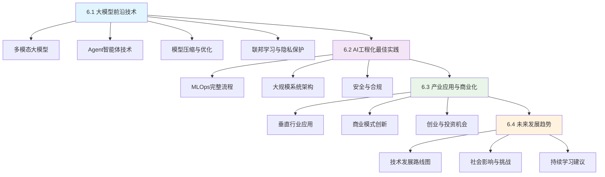

# 第6章：进阶话题和未来展望

## 章节概述

欢迎来到本教程的最后一章！在前面五章中，我们从传统AI算法开始，逐步深入到现代大模型技术，并通过Trae AI开发环境完成了完整的项目实战。现在，让我们将视野扩展到AI领域的前沿技术和未来发展趋势。

第6章将带你探索AI技术的最新进展，了解工程化最佳实践，分析产业应用模式，并展望未来发展方向。这不仅是对前面学习内容的升华，更是为你在AI领域的持续发展提供指引。

## 学习目标

通过本章学习，你将能够：

### 🔬 技术前沿洞察
- **掌握前沿技术**：了解多模态大模型、Agent智能体、模型压缩等最新技术
- **理解技术趋势**：把握AI技术发展的主要方向和突破点
- **评估技术价值**：具备分析新兴技术潜力和应用前景的能力

### 🏗️ 工程化思维
- **MLOps实践**：掌握机器学习工程化的完整流程和最佳实践
- **系统架构设计**：了解大规模AI系统的架构设计原则
- **安全合规意识**：理解AI系统的安全防护和合规要求

### 💼 商业化视角
- **产业应用分析**：了解AI在各垂直行业的深度应用模式
- **商业模式创新**：理解AI驱动的商业模式变革和创新机会
- **投资创业洞察**：识别AI领域的创业和投资机会

### 🚀 未来发展预判
- **趋势预测能力**：基于技术发展规律预测未来趋势
- **社会影响认知**：理解AI发展对社会的深远影响和挑战
- **持续学习规划**：建立终身学习的能力和职业发展规划

## 章节结构

## 学习方式

### 📖 理论学习
- **前沿论文阅读**：每个技术点都会推荐相关的重要论文
- **技术报告分析**：结合产业报告和技术白皮书
- **专家观点整合**：汇总领域专家的观点和预测

### 🛠️ 实践探索
- **Trae环境实验**：在Trae中体验前沿技术的应用
- **案例分析**：深入分析成功和失败的实际案例
- **动手实践**：完成小型的探索性项目

### 🤝 交流讨论
- **思考题设计**：每节都包含深度思考题
- **讨论话题**：提供丰富的讨论话题和观点
- **社区参与**：鼓励参与相关技术社区的讨论

## 与前面章节的关系

第6章是对前面学习内容的升华和扩展：

### 🔗 知识延续
- **第1章基础**：在传统算法基础上理解前沿技术的演进
- **第2章历史**：从发展历史中把握未来趋势
- **第3章技术**：在核心技术基础上探索前沿方向
- **第4章实践**：将实践经验扩展到工程化最佳实践
- **第5章项目**：从项目经验中理解商业化应用

### 🎯 能力提升
- **从技术使用者到技术评估者**：具备评估新技术的能力
- **从项目开发者到系统架构师**：理解大规模系统设计
- **从技术实现者到商业思考者**：具备商业化思维
- **从当前学习者到终身学习者**：建立持续学习能力

## 学习建议

### ⏰ 时间安排
- **总学习时长**：8-10小时
- **建议分配**：
  - 6.1节：3小时（前沿技术理解）
  - 6.2节：2.5小时（工程化实践）
  - 6.3节：2小时（商业化分析）
  - 6.4节：2.5小时（未来展望）

### 📚 学习重点
1. **不要追求完全掌握**：重点在于开阔视野和建立认知框架
2. **关注发展趋势**：重点理解技术发展的方向和规律
3. **结合实际需求**：根据自己的兴趣和职业规划选择重点
4. **建立学习习惯**：重点培养持续学习的能力和方法

### 🎯 学习策略
- **广度优先**：先建立整体认知，再深入感兴趣的领域
- **案例驱动**：通过具体案例理解抽象概念
- **实践验证**：在Trae中尝试相关技术和工具
- **社区参与**：加入相关技术社区，保持信息更新

## 预期成果

完成第6章学习后，你将具备：

### 🧠 认知能力
- **技术敏感度**：能够快速理解和评估新兴技术
- **趋势判断力**：具备预测技术发展方向的能力
- **系统思维**：能够从多个维度分析技术和商业问题

### 🛠️ 实践能力
- **架构设计**：能够设计大规模AI系统的架构
- **工程化实施**：掌握AI项目工程化的最佳实践
- **风险管控**：具备识别和管控AI项目风险的能力

### 🚀 发展潜力
- **持续学习**：建立终身学习的习惯和方法
- **创新思维**：具备技术创新和商业创新的思维
- **领导能力**：能够在AI项目中发挥技术领导作用

---

## 开始学习之前

在开始第6章的学习之前，建议你：

### ✅ 知识准备
- [ ] 回顾前面章节的核心概念
- [ ] 确保对大模型技术有基本理解
- [ ] 具备一定的项目开发经验

### 🔧 工具准备
- [ ] Trae AI开发环境正常运行
- [ ] 网络连接稳定（需要访问在线资源）
- [ ] 准备学习笔记工具

### 🎯 心态准备
- [ ] 保持开放和好奇的心态
- [ ] 接受不确定性和快速变化
- [ ] 培养批判性思维
- [ ] 建立长期学习的决心

让我们开始这段探索AI未来的精彩旅程！

---

**💡 学习提示**：第6章的内容具有很强的前瞻性，某些技术和观点可能会随着时间推移而发生变化。重要的是学会分析和思考的方法，而不是记住具体的结论。保持开放的心态，持续关注技术发展，这将是你在AI领域长期发展的关键能力。