# 算法流程图和架构图

本文档包含教程中涉及的各种算法流程图、系统架构图和数据处理可视化内容，帮助读者更好地理解复杂的概念和流程。

## 📊 机器学习算法流程图

### 1. 监督学习流程

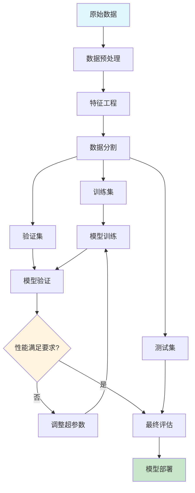

### 2. 深度学习训练流程

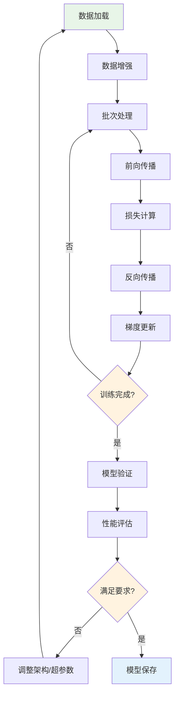

### 3. Transformer架构流程

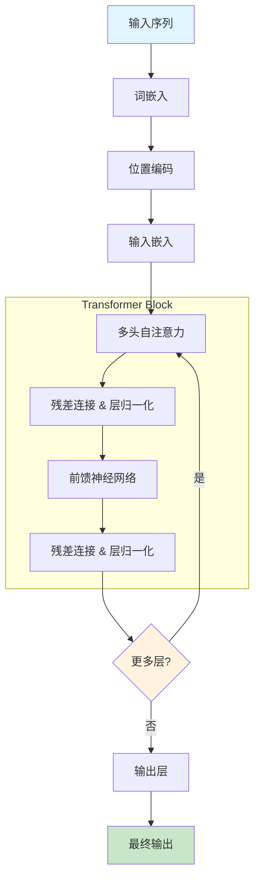

## 🏗️ 系统架构图

### 1. MLOps系统架构

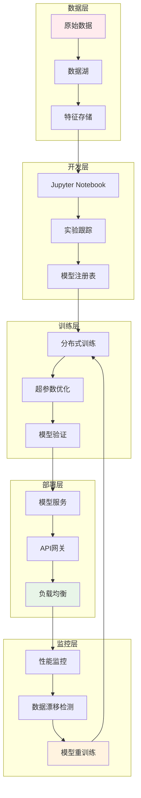

### 2. 大模型服务架构

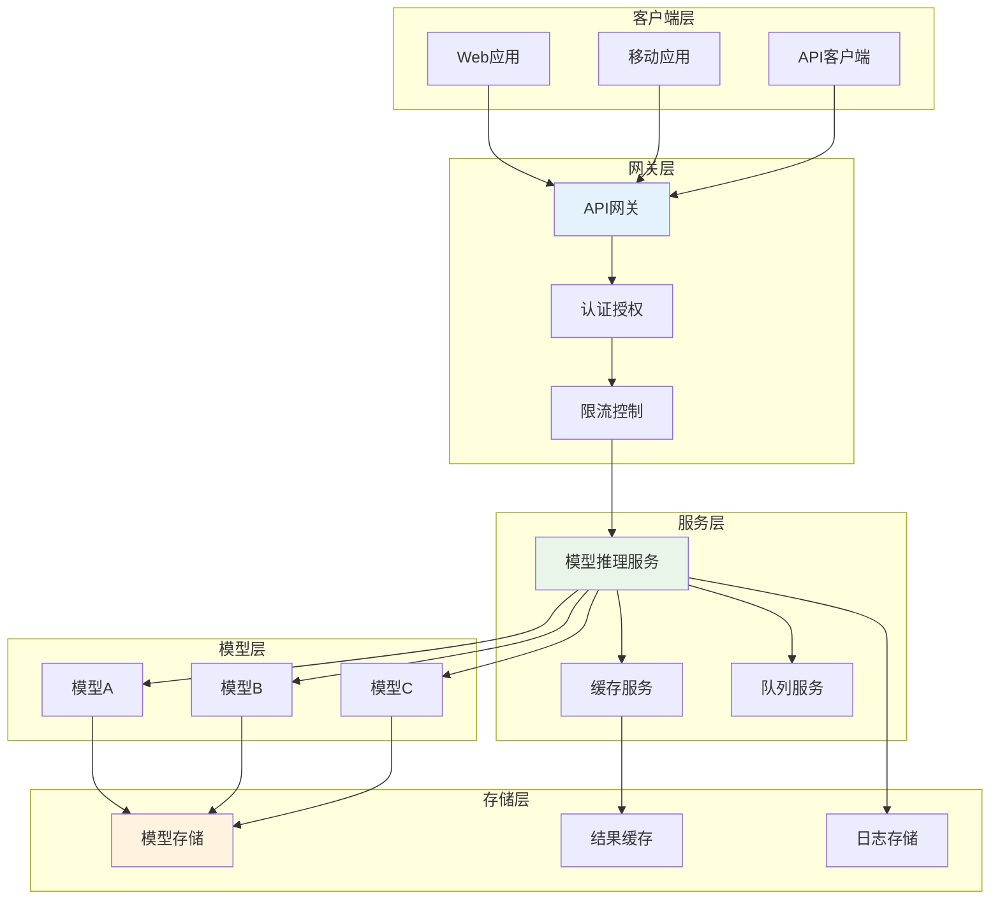

### 3. 联邦学习架构

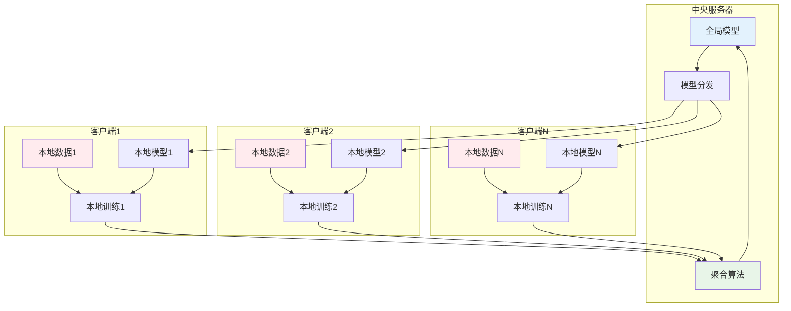

## 📈 数据处理可视化

### 1. 数据预处理流程

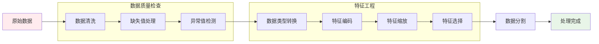

### 2. 特征工程流程

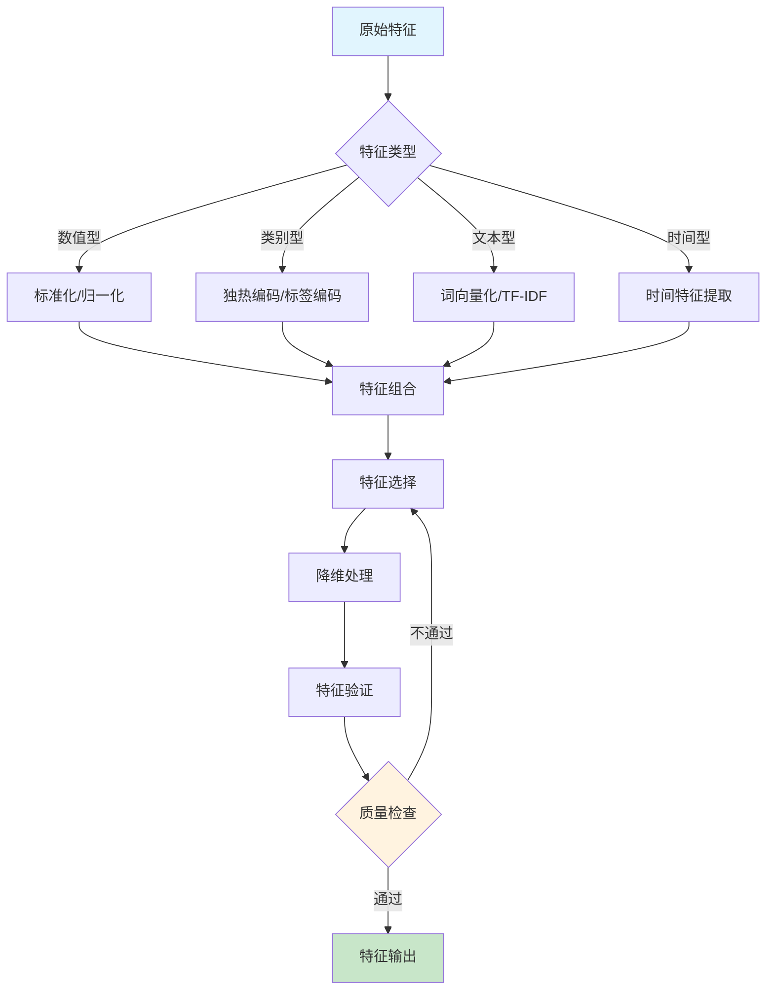

### 3. 模型评估流程

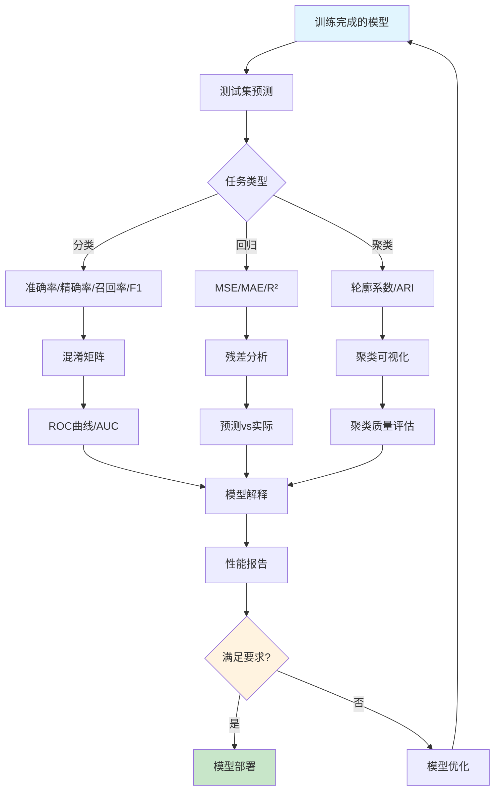

## 🤖 AI系统交互图

### 1. 智能客服系统交互

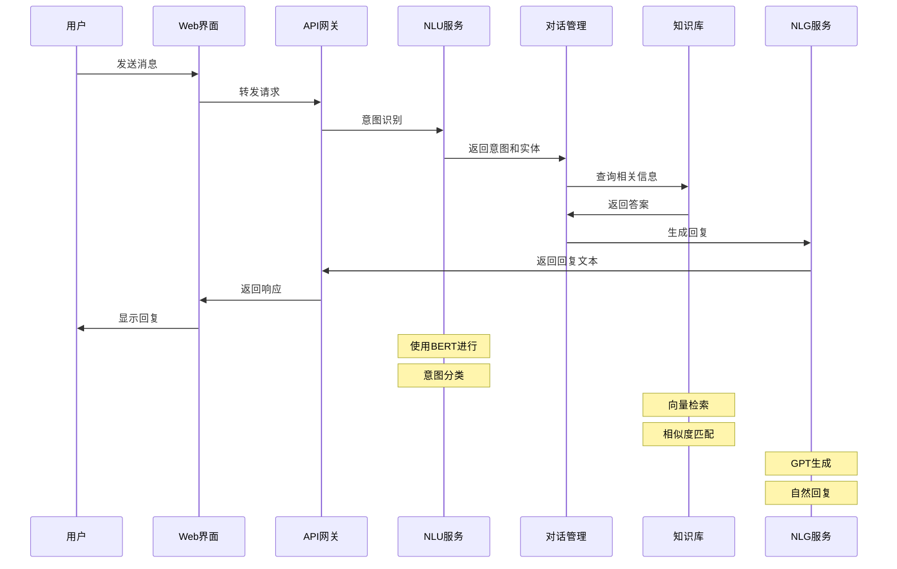

### 2. 推荐系统交互

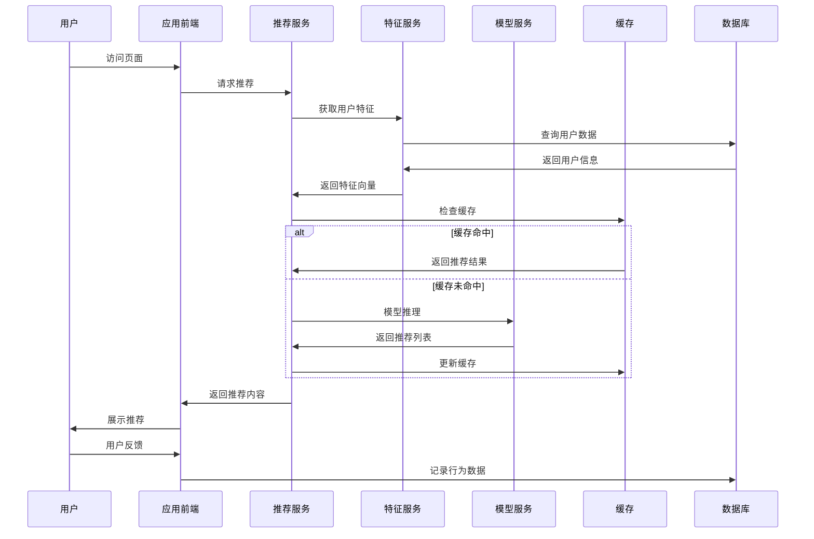

### 3. 多模态生成系统交互

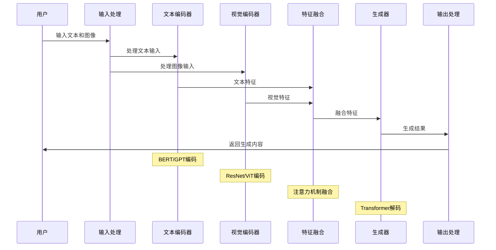

## 📊 性能监控仪表板

### 1. 模型性能监控

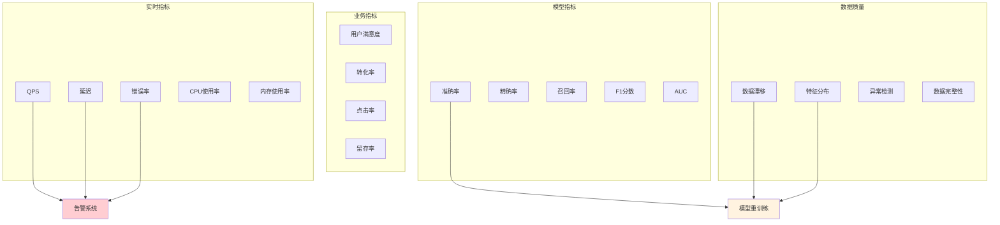

### 2. 系统健康度监控

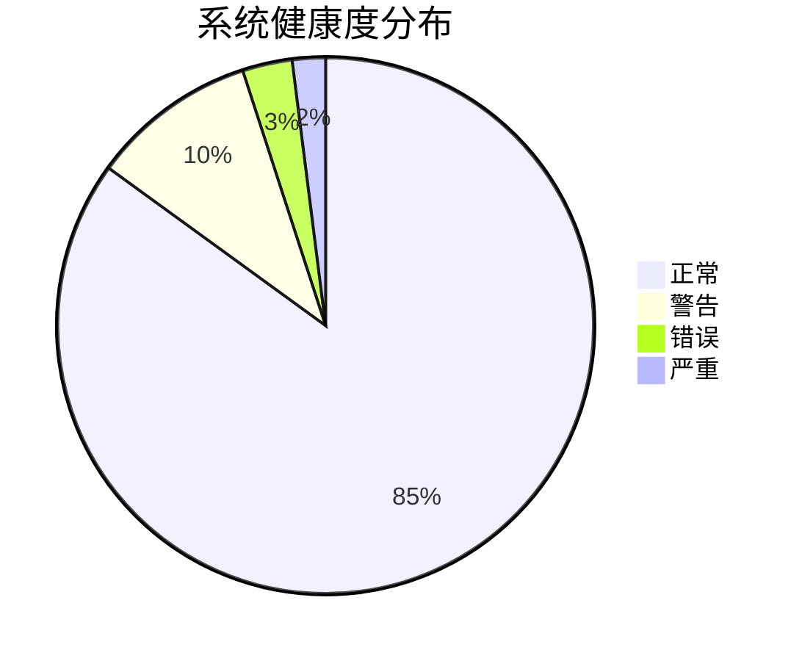

## 🔄 持续集成/持续部署流程

### 1. CI/CD流水线

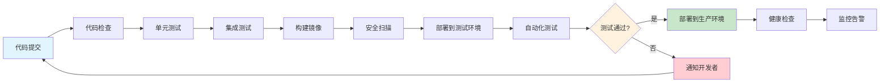

### 2. 模型版本管理

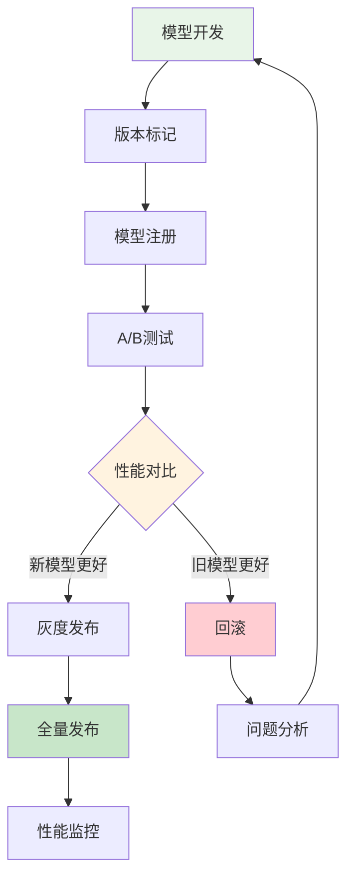

## 📱 用户界面设计

### 1. 智能客服界面布局

```
┌─────────────────────────────────────┐
│  智能客服系统                        │
├─────────────────────────────────────┤
│  [用户头像] 您好，有什么可以帮您的？   │
│                                     │
│              [机器人头像] 您好！我是  │
│              智能客服小助手，请问有   │
│              什么问题需要帮助？       │
│                                     │
│  [用户头像] 我想了解产品价格          │
│                                     │
│              [机器人头像] 好的，我来  │
│              为您查询相关产品信息...   │
│                                     │
├─────────────────────────────────────┤
│  [输入框: 请输入您的问题...]  [发送]   │
└─────────────────────────────────────┘
```

### 2. 推荐系统界面布局

```
┌─────────────────────────────────────┐
│  个性化推荐                          │
├─────────────────────────────────────┤
│  为您推荐                            │
│  ┌─────┐ ┌─────┐ ┌─────┐ ┌─────┐    │
│  │商品1│ │商品2│ │商品3│ │商品4│    │
│  │图片 │ │图片 │ │图片 │ │图片 │    │
│  │标题 │ │标题 │ │标题 │ │标题 │    │
│  │价格 │ │价格 │ │价格 │ │价格 │    │
│  └─────┘ └─────┘ └─────┘ └─────┘    │
│                                     │
│  热门推荐                            │
│  ┌─────┐ ┌─────┐ ┌─────┐ ┌─────┐    │
│  │商品5│ │商品6│ │商品7│ │商品8│    │
│  └─────┘ └─────┘ └─────┘ └─────┘    │
└─────────────────────────────────────┘
```

## 🎯 算法复杂度分析

### 1. 常见算法时间复杂度对比

```mermaid
xychart-beta
    title "算法时间复杂度对比"
    x-axis ["输入规模(n)" : 10, 100, 1000, 10000]
    y-axis "执行时间" 0 --> 1000000
    line [1, 1, 1, 1] "O(1)"
    line [10, 100, 1000, 10000] "O(n)"
    line [100, 10000, 1000000, 100000000] "O(n²)"
    line [33, 664, 9966, 132877] "O(n log n)"
```

### 2. 模型训练时间对比

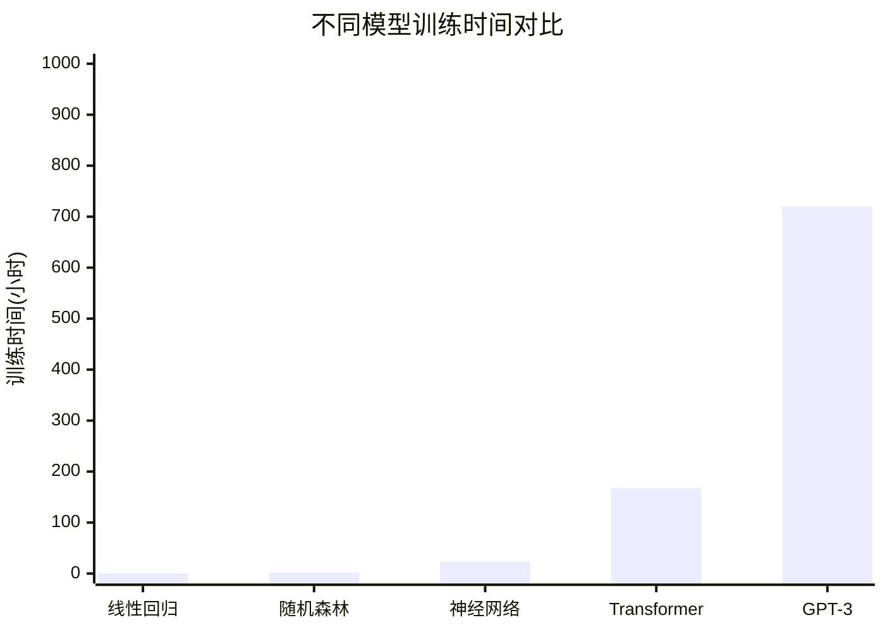

## 📊 数据流向图

### 1. 端到端数据流

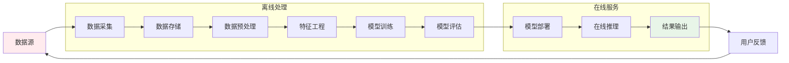

### 2. 实时数据处理流

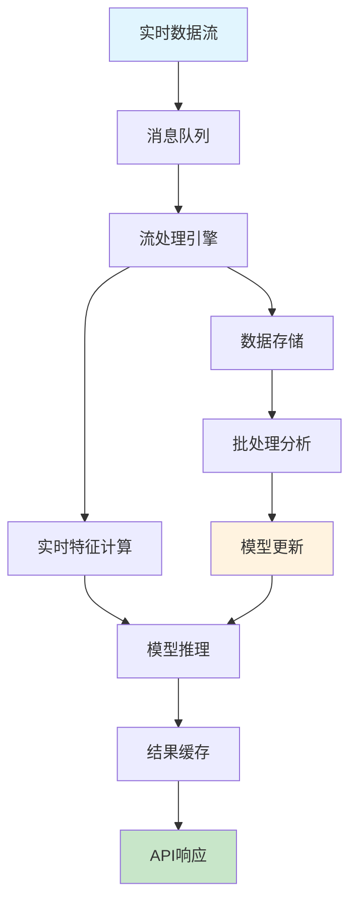

这些可视化图表和流程图为教程提供了直观的理解工具，帮助读者更好地掌握复杂的AI概念、系统架构和数据处理流程。每个图表都经过精心设计，既保持了技术准确性，又具有良好的可读性和美观性。