# 系统架构图和技术栈图表

本文档包含AI系统开发中常用的各种架构图、技术栈图表和部署图，帮助读者理解复杂的系统设计和技术选型。

## 🏗️ AI系统架构图

### 1. 端到端AI平台架构

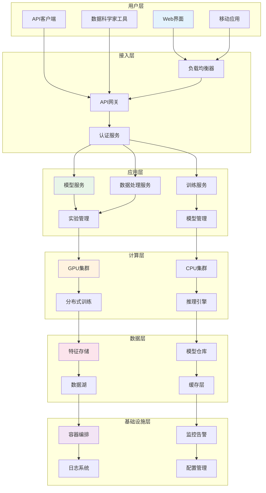
```mermaid
flowchart TB
    subgraph "用户层"
        A[Web界面]
        B[移动应用]
        C[API客户端]
        D[数据科学家工具]
    end
    
    subgraph "接入层"
        E[负载均衡器]
        F[API网关]
        G[认证服务]
    end
    
    subgraph "应用层"
        H[模型服务]
        I[训练服务]
        J[数据处理服务]
        K[实验管理]
        L[模型管理]
    end
    
    subgraph "计算层"
        M[GPU集群]
        N[CPU集群]
        O[分布式训练]
        P[推理引擎]
    end
    
    subgraph "数据层"
        Q[特征存储]
        R[模型仓库]
        S[数据湖]
        T[缓存层]
    end
    
    subgraph "基础设施层"
        U[容器编排]
        V[监控告警]
        W[日志系统]
        X[配置管理]
    end
    
    A --> E
    B --> E
    C --> F
    D --> F
    E --> F
    F --> G
    G --> H
    G --> I
    G --> J
    H --> K
    I --> L
    J --> K
    K --> M
    L --> N
    M --> O
    N --> P
    O --> Q
    P --> R
    Q --> S
    R --> T
    S --> U
    T --> V
    U --> W
    V --> X
    
    style A fill:#e3f2fd
    style H fill:#e8f5e8
    style M fill:#fff3e0
    style Q fill:#fce4ec
    style U fill:#f3e5f5
```

### 2. 微服务架构设计

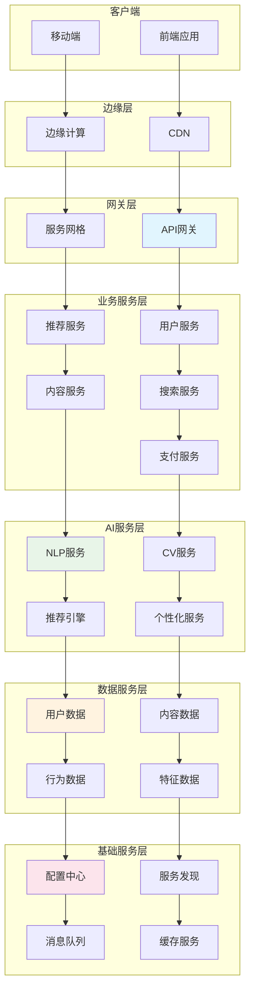
```mermaid
flowchart TB
    subgraph "客户端"
        A[前端应用]
        B[移动端]
    end
    
    subgraph "边缘层"
        C[CDN]
        D[边缘计算]
    end
    
    subgraph "网关层"
        E[API网关]
        F[服务网格]
    end
    
    subgraph "业务服务层"
        G[用户服务]
        H[推荐服务]
        I[搜索服务]
        J[内容服务]
        K[支付服务]
    end
    
    subgraph "AI服务层"
        L[NLP服务]
        M[CV服务]
        N[推荐引擎]
        O[个性化服务]
    end
    
    subgraph "数据服务层"
        P[用户数据]
        Q[内容数据]
        R[行为数据]
        S[特征数据]
    end
    
    subgraph "基础服务层"
        T[配置中心]
        U[服务发现]
        V[消息队列]
        W[缓存服务]
    end
    
    A --> C
    B --> D
    C --> E
    D --> F
    E --> G
    F --> H
    G --> I
    H --> J
    I --> K
    J --> L
    K --> M
    L --> N
    M --> O
    N --> P
    O --> Q
    P --> R
    Q --> S
    R --> T
    S --> U
    T --> V
    U --> W
    
    style E fill:#e1f5fe
    style L fill:#e8f5e8
    style P fill:#fff3e0
    style T fill:#fce4ec
```

### 3. 实时推荐系统架构

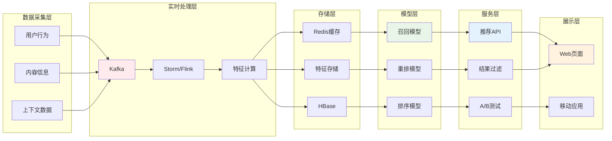
```mermaid
flowchart LR
    subgraph "数据采集层"
        A[用户行为]
        B[内容信息]
        C[上下文数据]
    end
    
    subgraph "实时处理层"
        D[Kafka]
        E[Storm/Flink]
        F[特征计算]
    end
    
    subgraph "存储层"
        G[Redis缓存]
        H[HBase]
        I[特征存储]
    end
    
    subgraph "模型层"
        J[召回模型]
        K[排序模型]
        L[重排模型]
    end
    
    subgraph "服务层"
        M[推荐API]
        N[A/B测试]
        O[结果过滤]
    end
    
    subgraph "展示层"
        P[Web页面]
        Q[移动应用]
    end
    
    A --> D
    B --> D
    C --> D
    D --> E
    E --> F
    F --> G
    F --> H
    F --> I
    G --> J
    H --> K
    I --> L
    J --> M
    K --> N
    L --> O
    M --> P
    N --> Q
    O --> P
    
    style D fill:#ffebee
    style J fill:#e8f5e8
    style M fill:#e3f2fd
    style P fill:#fff3e0
```

## 🔧 技术栈架构图

### 1. 深度学习技术栈

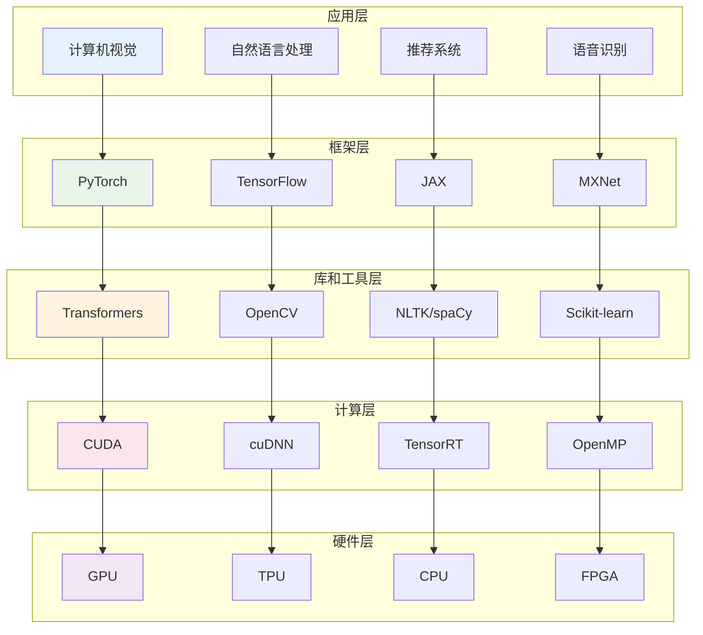
```mermaid
flowchart TB
    subgraph "应用层"
        A[计算机视觉]
        B[自然语言处理]
        C[推荐系统]
        D[语音识别]
    end
    
    subgraph "框架层"
        E[PyTorch]
        F[TensorFlow]
        G[JAX]
        H[MXNet]
    end
    
    subgraph "库和工具层"
        I[Transformers]
        J[OpenCV]
        K[NLTK/spaCy]
        L[Scikit-learn]
    end
    
    subgraph "计算层"
        M[CUDA]
        N[cuDNN]
        O[TensorRT]
        P[OpenMP]
    end
    
    subgraph "硬件层"
        Q[GPU]
        R[TPU]
        S[CPU]
        T[FPGA]
    end
    
    A --> E
    B --> F
    C --> G
    D --> H
    E --> I
    F --> J
    G --> K
    H --> L
    I --> M
    J --> N
    K --> O
    L --> P
    M --> Q
    N --> R
    O --> S
    P --> T
    
    style A fill:#e3f2fd
    style E fill:#e8f5e8
    style I fill:#fff3e0
    style M fill:#fce4ec
    style Q fill:#f3e5f5
```

### 2. MLOps技术栈

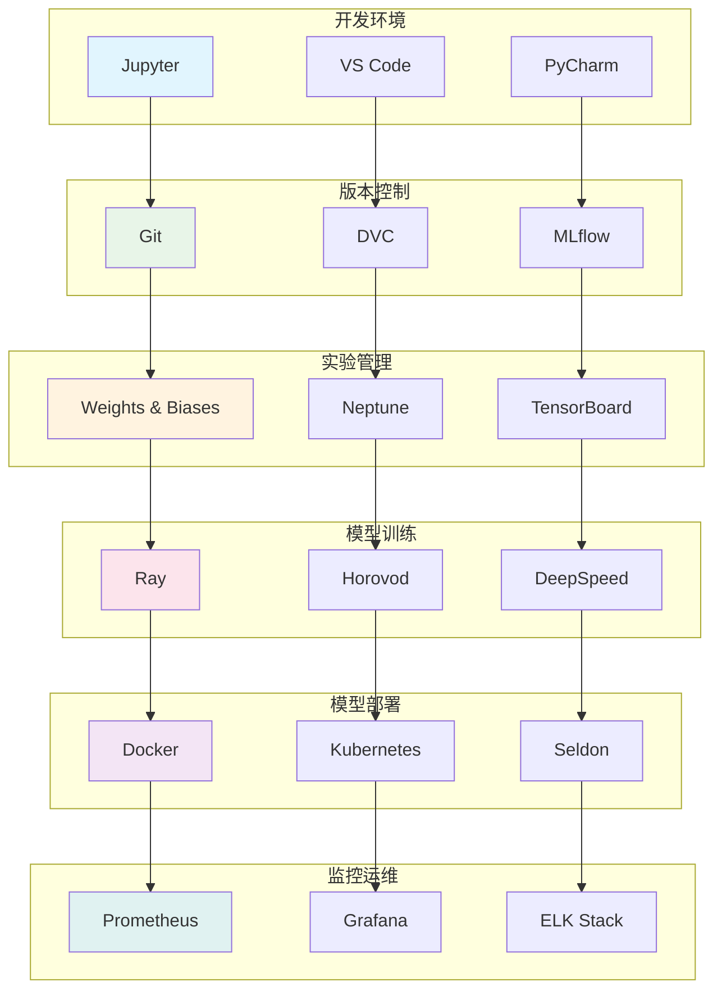
```mermaid
flowchart TB
    subgraph "开发环境"
        A[Jupyter]
        B[VS Code]
        C[PyCharm]
    end
    
    subgraph "版本控制"
        D[Git]
        E[DVC]
        F[MLflow]
    end
    
    subgraph "实验管理"
        G[Weights & Biases]
        H[Neptune]
        I[TensorBoard]
    end
    
    subgraph "模型训练"
        J[Ray]
        K[Horovod]
        L[DeepSpeed]
    end
    
    subgraph "模型部署"
        M[Docker]
        N[Kubernetes]
        O[Seldon]
    end
    
    subgraph "监控运维"
        P[Prometheus]
        Q[Grafana]
        R[ELK Stack]
    end
    
    A --> D
    B --> E
    C --> F
    D --> G
    E --> H
    F --> I
    G --> J
    H --> K
    I --> L
    J --> M
    K --> N
    L --> O
    M --> P
    N --> Q
    O --> R
    
    style A fill:#e1f5fe
    style D fill:#e8f5e8
    style G fill:#fff3e0
    style J fill:#fce4ec
    style M fill:#f3e5f5
    style P fill:#e0f2f1
```

### 3. 大数据处理技术栈

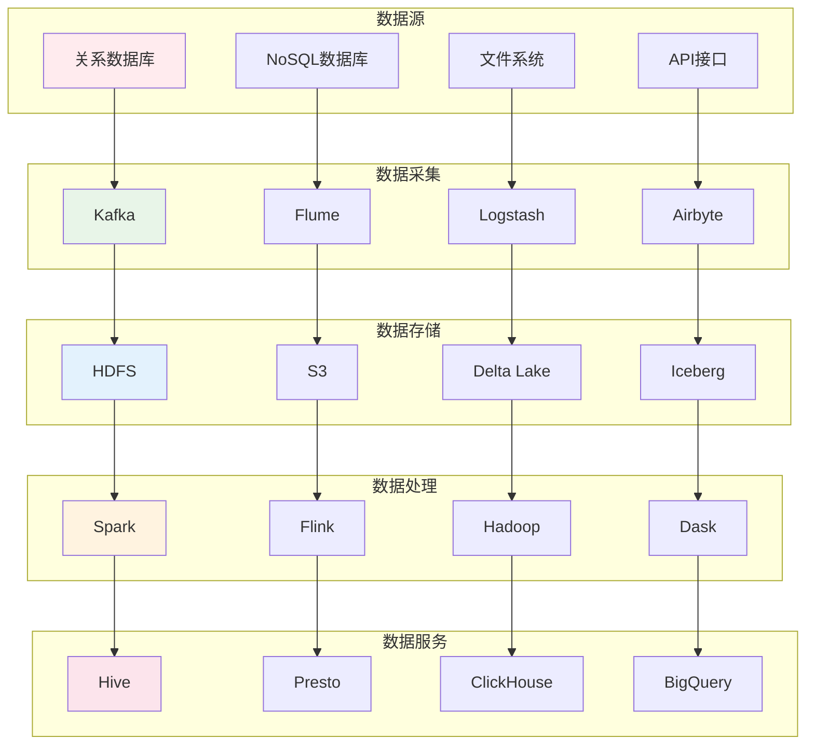
```mermaid
flowchart TB
    subgraph "数据源"
        A[关系数据库]
        B[NoSQL数据库]
        C[文件系统]
        D[API接口]
    end
    
    subgraph "数据采集"
        E[Kafka]
        F[Flume]
        G[Logstash]
        H[Airbyte]
    end
    
    subgraph "数据存储"
        I[HDFS]
        J[S3]
        K[Delta Lake]
        L[Iceberg]
    end
    
    subgraph "数据处理"
        M[Spark]
        N[Flink]
        O[Hadoop]
        P[Dask]
    end
    
    subgraph "数据服务"
        Q[Hive]
        R[Presto]
        S[ClickHouse]
        T[BigQuery]
    end
    
    A --> E
    B --> F
    C --> G
    D --> H
    E --> I
    F --> J
    G --> K
    H --> L
    I --> M
    J --> N
    K --> O
    L --> P
    M --> Q
    N --> R
    O --> S
    P --> T
    
    style A fill:#ffebee
    style E fill:#e8f5e8
    style I fill:#e3f2fd
    style M fill:#fff3e0
    style Q fill:#fce4ec
```

## 🚀 部署架构图

### 1. 云原生部署架构

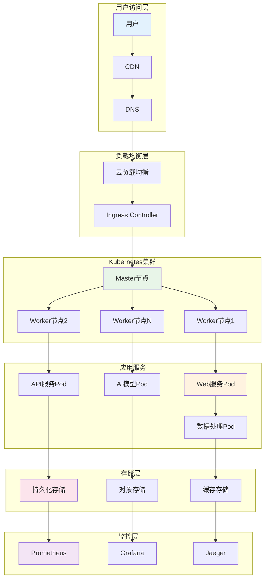
```mermaid
flowchart TB
    subgraph "用户访问层"
        A[用户]
        B[CDN]
        C[DNS]
    end
    
    subgraph "负载均衡层"
        D[云负载均衡]
        E[Ingress Controller]
    end
    
    subgraph "Kubernetes集群"
        F[Master节点]
        G[Worker节点1]
        H[Worker节点2]
        I[Worker节点N]
    end
    
    subgraph "应用服务"
        J[Web服务Pod]
        K[API服务Pod]
        L[AI模型Pod]
        M[数据处理Pod]
    end
    
    subgraph "存储层"
        N[持久化存储]
        O[对象存储]
        P[缓存存储]
    end
    
    subgraph "监控层"
        Q[Prometheus]
        R[Grafana]
        S[Jaeger]
    end
    
    A --> B
    B --> C
    C --> D
    D --> E
    E --> F
    F --> G
    F --> H
    F --> I
    G --> J
    H --> K
    I --> L
    J --> M
    K --> N
    L --> O
    M --> P
    N --> Q
    O --> R
    P --> S
    
    style A fill:#e3f2fd
    style F fill:#e8f5e8
    style J fill:#fff3e0
    style N fill:#fce4ec
    style Q fill:#f3e5f5
```

### 2. 混合云部署架构

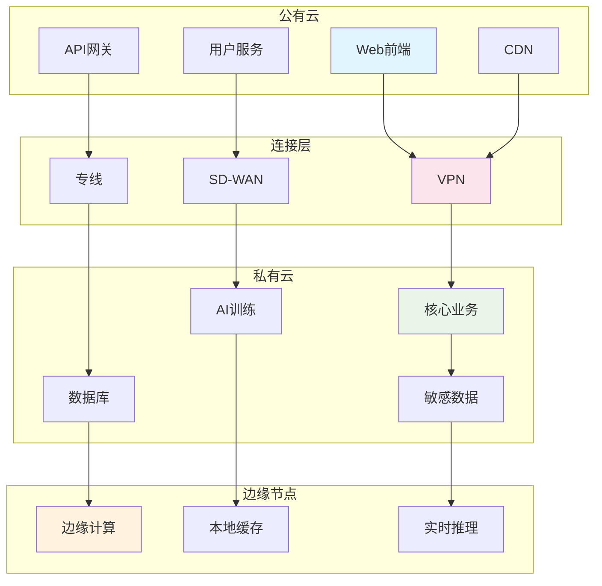
```mermaid
flowchart TB
    subgraph "公有云"
        A[Web前端]
        B[API网关]
        C[用户服务]
        D[CDN]
    end
    
    subgraph "私有云"
        E[核心业务]
        F[数据库]
        G[AI训练]
        H[敏感数据]
    end
    
    subgraph "边缘节点"
        I[边缘计算]
        J[本地缓存]
        K[实时推理]
    end
    
    subgraph "连接层"
        L[VPN]
        M[专线]
        N[SD-WAN]
    end
    
    A --> L
    B --> M
    C --> N
    D --> L
    L --> E
    M --> F
    N --> G
    E --> H
    F --> I
    G --> J
    H --> K
    
    style A fill:#e1f5fe
    style E fill:#e8f5e8
    style I fill:#fff3e0
    style L fill:#fce4ec
```

### 3. 边缘计算部署架构

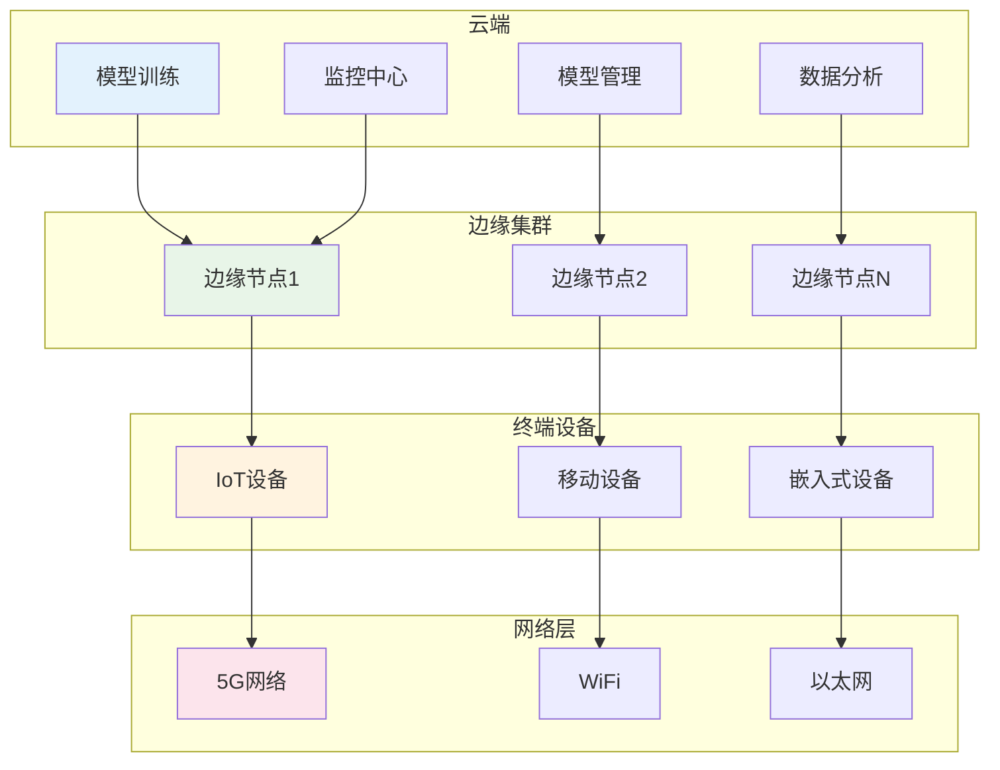
```mermaid
flowchart TB
    subgraph "云端"
        A[模型训练]
        B[模型管理]
        C[数据分析]
        D[监控中心]
    end
    
    subgraph "边缘集群"
        E[边缘节点1]
        F[边缘节点2]
        G[边缘节点N]
    end
    
    subgraph "终端设备"
        H[IoT设备]
        I[移动设备]
        J[嵌入式设备]
    end
    
    subgraph "网络层"
        K[5G网络]
        L[WiFi]
        M[以太网]
    end
    
    A --> E
    B --> F
    C --> G
    D --> E
    E --> H
    F --> I
    G --> J
    H --> K
    I --> L
    J --> M
    
    style A fill:#e3f2fd
    style E fill:#e8f5e8
    style H fill:#fff3e0
    style K fill:#fce4ec
```

## 📊 数据流架构图

### 1. Lambda架构

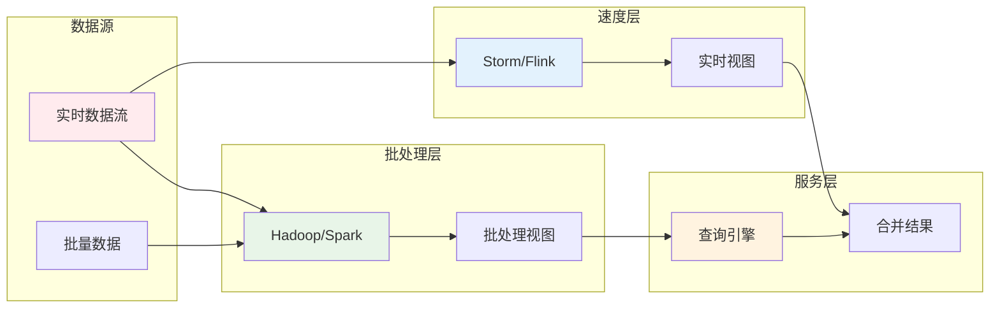
```mermaid
flowchart LR
    subgraph "数据源"
        A[实时数据流]
        B[批量数据]
    end
    
    subgraph "批处理层"
        C[Hadoop/Spark]
        D[批处理视图]
    end
    
    subgraph "速度层"
        E[Storm/Flink]
        F[实时视图]
    end
    
    subgraph "服务层"
        G[查询引擎]
        H[合并结果]
    end
    
    A --> C
    A --> E
    B --> C
    C --> D
    E --> F
    D --> G
    F --> H
    G --> H
    
    style A fill:#ffebee
    style C fill:#e8f5e8
    style E fill:#e3f2fd
    style G fill:#fff3e0
```

### 2. Kappa架构

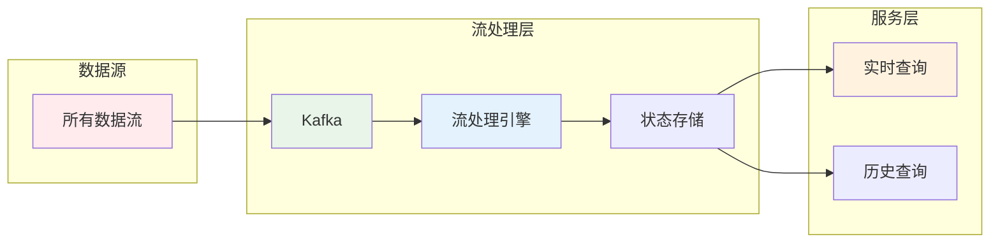
```mermaid
flowchart LR
    subgraph "数据源"
        A[所有数据流]
    end
    
    subgraph "流处理层"
        B[Kafka]
        C[流处理引擎]
        D[状态存储]
    end
    
    subgraph "服务层"
        E[实时查询]
        F[历史查询]
    end
    
    A --> B
    B --> C
    C --> D
    D --> E
    D --> F
    
    style A fill:#ffebee
    style B fill:#e8f5e8
    style C fill:#e3f2fd
    style E fill:#fff3e0
```

### 3. 数据湖架构

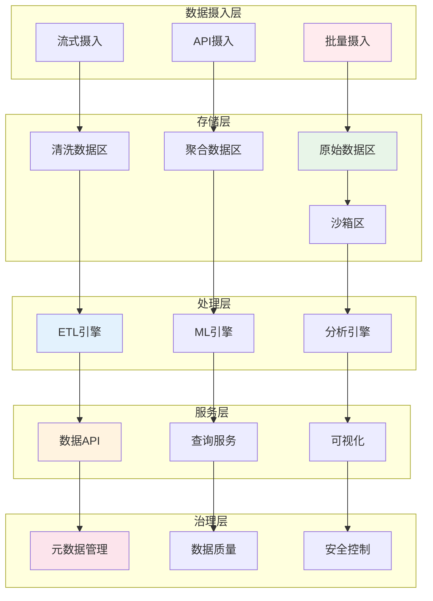
```mermaid
flowchart TB
    subgraph "数据摄入层"
        A[批量摄入]
        B[流式摄入]
        C[API摄入]
    end
    
    subgraph "存储层"
        D[原始数据区]
        E[清洗数据区]
        F[聚合数据区]
        G[沙箱区]
    end
    
    subgraph "处理层"
        H[ETL引擎]
        I[ML引擎]
        J[分析引擎]
    end
    
    subgraph "服务层"
        K[数据API]
        L[查询服务]
        M[可视化]
    end
    
    subgraph "治理层"
        N[元数据管理]
        O[数据质量]
        P[安全控制]
    end
    
    A --> D
    B --> E
    C --> F
    D --> G
    E --> H
    F --> I
    G --> J
    H --> K
    I --> L
    J --> M
    K --> N
    L --> O
    M --> P
    
    style A fill:#ffebee
    style D fill:#e8f5e8
    style H fill:#e3f2fd
    style K fill:#fff3e0
    style N fill:#fce4ec
```

## 🔐 安全架构图

### 1. 零信任安全架构

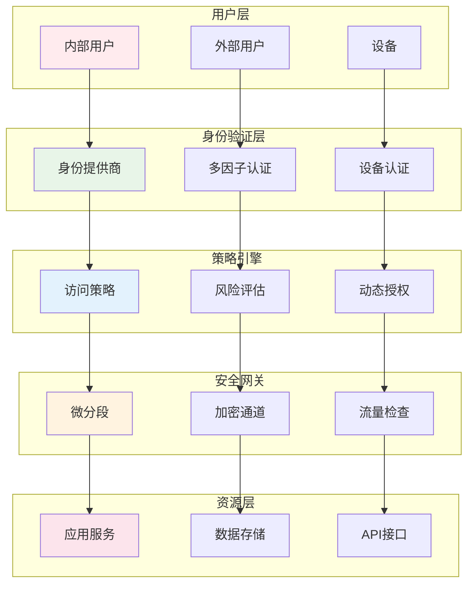
```mermaid
flowchart TB
    subgraph "用户层"
        A[内部用户]
        B[外部用户]
        C[设备]
    end
    
    subgraph "身份验证层"
        D[身份提供商]
        E[多因子认证]
        F[设备认证]
    end
    
    subgraph "策略引擎"
        G[访问策略]
        H[风险评估]
        I[动态授权]
    end
    
    subgraph "安全网关"
        J[微分段]
        K[加密通道]
        L[流量检查]
    end
    
    subgraph "资源层"
        M[应用服务]
        N[数据存储]
        O[API接口]
    end
    
    A --> D
    B --> E
    C --> F
    D --> G
    E --> H
    F --> I
    G --> J
    H --> K
    I --> L
    J --> M
    K --> N
    L --> O
    
    style A fill:#ffebee
    style D fill:#e8f5e8
    style G fill:#e3f2fd
    style J fill:#fff3e0
    style M fill:#fce4ec
```

### 2. 数据安全架构

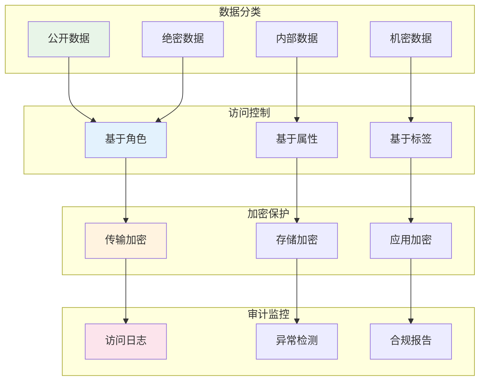
```mermaid
flowchart TB
    subgraph "数据分类"
        A[公开数据]
        B[内部数据]
        C[机密数据]
        D[绝密数据]
    end
    
    subgraph "访问控制"
        E[基于角色]
        F[基于属性]
        G[基于标签]
    end
    
    subgraph "加密保护"
        H[传输加密]
        I[存储加密]
        J[应用加密]
    end
    
    subgraph "审计监控"
        K[访问日志]
        L[异常检测]
        M[合规报告]
    end
    
    A --> E
    B --> F
    C --> G
    D --> E
    E --> H
    F --> I
    G --> J
    H --> K
    I --> L
    J --> M
    
    style A fill:#e8f5e8
    style E fill:#e3f2fd
    style H fill:#fff3e0
    style K fill:#fce4ec
```

## 🎯 性能优化架构

### 1. 缓存架构设计

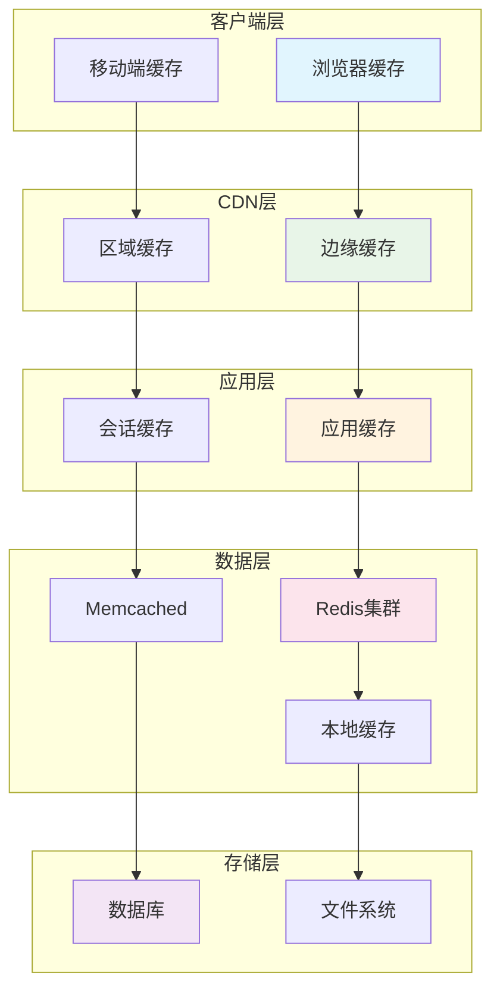
```mermaid
flowchart TB
    subgraph "客户端层"
        A[浏览器缓存]
        B[移动端缓存]
    end
    
    subgraph "CDN层"
        C[边缘缓存]
        D[区域缓存]
    end
    
    subgraph "应用层"
        E[应用缓存]
        F[会话缓存]
    end
    
    subgraph "数据层"
        G[Redis集群]
        H[Memcached]
        I[本地缓存]
    end
    
    subgraph "存储层"
        J[数据库]
        K[文件系统]
    end
    
    A --> C
    B --> D
    C --> E
    D --> F
    E --> G
    F --> H
    G --> I
    H --> J
    I --> K
    
    style A fill:#e1f5fe
    style C fill:#e8f5e8
    style E fill:#fff3e0
    style G fill:#fce4ec
    style J fill:#f3e5f5
```

### 2. 负载均衡架构

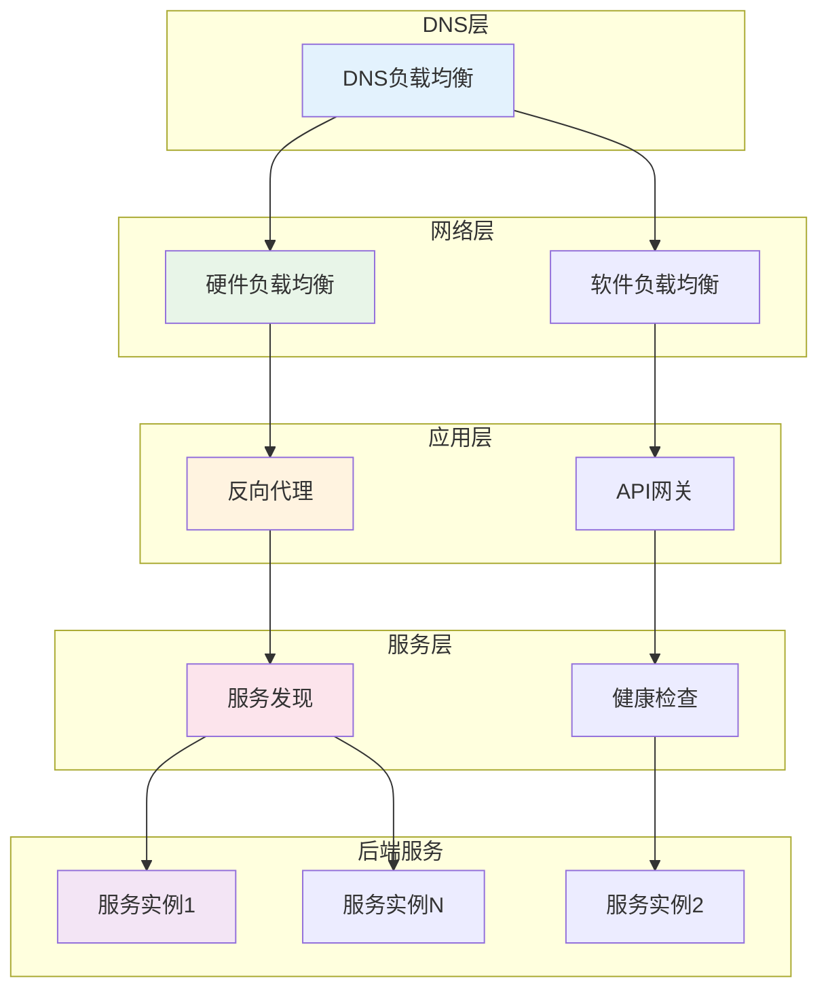
```mermaid
flowchart TB
    subgraph "DNS层"
        A[DNS负载均衡]
    end
    
    subgraph "网络层"
        B[硬件负载均衡]
        C[软件负载均衡]
    end
    
    subgraph "应用层"
        D[反向代理]
        E[API网关]
    end
    
    subgraph "服务层"
        F[服务发现]
        G[健康检查]
    end
    
    subgraph "后端服务"
        H[服务实例1]
        I[服务实例2]
        J[服务实例N]
    end
    
    A --> B
    A --> C
    B --> D
    C --> E
    D --> F
    E --> G
    F --> H
    G --> I
    F --> J
    
    style A fill:#e3f2fd
    style B fill:#e8f5e8
    style D fill:#fff3e0
    style F fill:#fce4ec
    style H fill:#f3e5f5
```

## 📈 监控架构图

### 1. 全栈监控架构

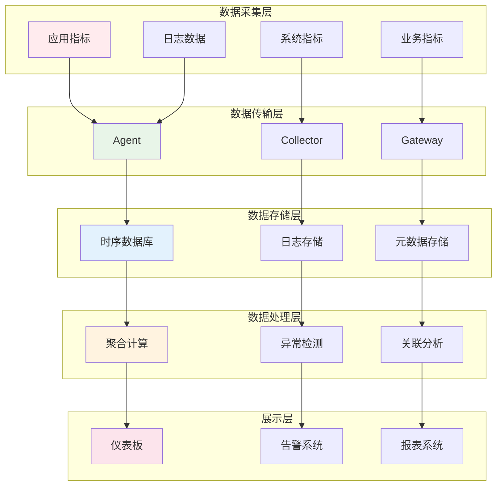
```mermaid
flowchart TB
    subgraph "数据采集层"
        A[应用指标]
        B[系统指标]
        C[业务指标]
        D[日志数据]
    end
    
    subgraph "数据传输层"
        E[Agent]
        F[Collector]
        G[Gateway]
    end
    
    subgraph "数据存储层"
        H[时序数据库]
        I[日志存储]
        J[元数据存储]
    end
    
    subgraph "数据处理层"
        K[聚合计算]
        L[异常检测]
        M[关联分析]
    end
    
    subgraph "展示层"
        N[仪表板]
        O[告警系统]
        P[报表系统]
    end
    
    A --> E
    B --> F
    C --> G
    D --> E
    E --> H
    F --> I
    G --> J
    H --> K
    I --> L
    J --> M
    K --> N
    L --> O
    M --> P
    
    style A fill:#ffebee
    style E fill:#e8f5e8
    style H fill:#e3f2fd
    style K fill:#fff3e0
    style N fill:#fce4ec
```

### 2. APM架构设计

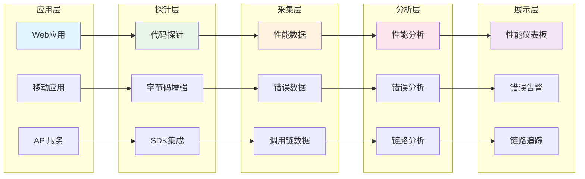
```mermaid
flowchart LR
    subgraph "应用层"
        A[Web应用]
        B[移动应用]
        C[API服务]
    end
    
    subgraph "探针层"
        D[代码探针]
        E[字节码增强]
        F[SDK集成]
    end
    
    subgraph "采集层"
        G[性能数据]
        H[错误数据]
        I[调用链数据]
    end
    
    subgraph "分析层"
        J[性能分析]
        K[错误分析]
        L[链路分析]
    end
    
    subgraph "展示层"
        M[性能仪表板]
        N[错误告警]
        O[链路追踪]
    end
    
    A --> D
    B --> E
    C --> F
    D --> G
    E --> H
    F --> I
    G --> J
    H --> K
    I --> L
    J --> M
    K --> N
    L --> O
    
    style A fill:#e1f5fe
    style D fill:#e8f5e8
    style G fill:#fff3e0
    style J fill:#fce4ec
    style M fill:#f3e5f5
```

## 🔄 CI/CD架构图

### 1. DevOps流水线架构

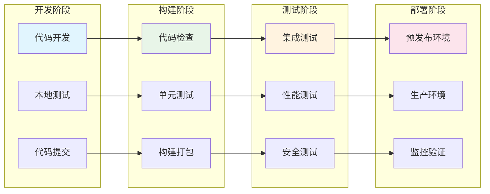
```mermaid
flowchart LR
    subgraph "开发阶段"
        A[代码开发]
        B[本地测试]
        C[代码提交]
    end
    
    subgraph "构建阶段"
        D[代码检查]
        E[单元测试]
        F[构建打包]
    end
    
    subgraph "测试阶段"
        G[集成测试]
        H[性能测试]
        I[安全测试]
    end
    
    subgraph "部署阶段"
        J[预发布环境]
        K[生产环境]
        L[监控验证]
    end
    
    A --> D
    B --> E
    C --> F
    D --> G
    E --> H
    F --> I
    G --> J
    H --> K
    I --> L
    
    style A fill:#e1f5fe
    style D fill:#e8f5e8
    style G fill:#fff3e0
    style J fill:#fce4ec
```

### 2. GitOps架构设计

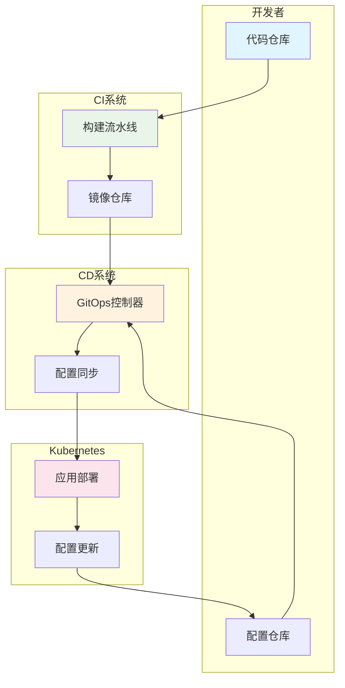
```mermaid
flowchart TB
    subgraph "开发者"
        A[代码仓库]
        B[配置仓库]
    end
    
    subgraph "CI系统"
        C[构建流水线]
        D[镜像仓库]
    end
    
    subgraph "CD系统"
        E[GitOps控制器]
        F[配置同步]
    end
    
    subgraph "Kubernetes"
        G[应用部署]
        H[配置更新]
    end
    
    A --> C
    B --> E
    C --> D
    D --> E
    E --> F
    F --> G
    G --> H
    H --> B
    
    style A fill:#e1f5fe
    style C fill:#e8f5e8
    style E fill:#fff3e0
    style G fill:#fce4ec
```

这些架构图和技术栈图表为AI系统开发提供了全面的设计参考，涵盖了从应用架构到基础设施的各个层面，帮助读者理解复杂系统的设计思路和最佳实践。每个图表都经过精心设计，既保持了技术准确性，又具有良好的可读性和实用性。